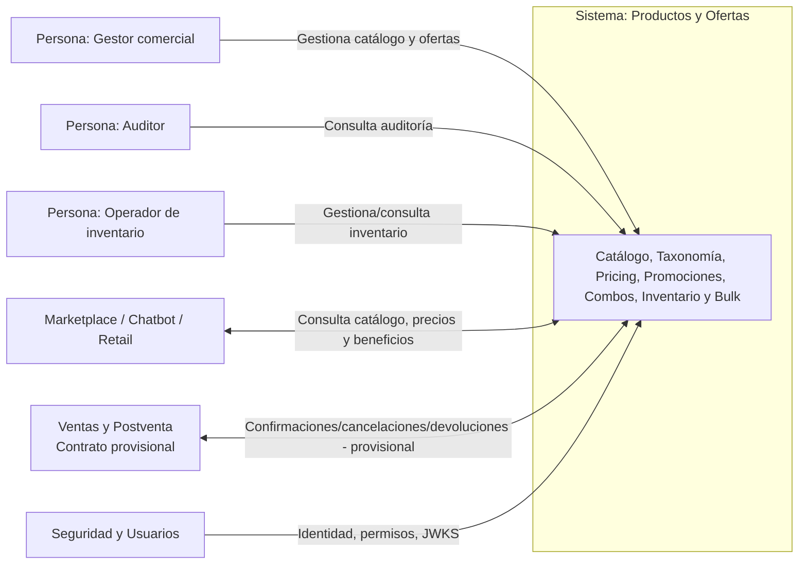
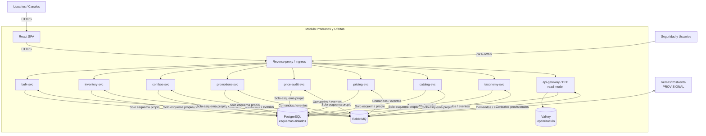
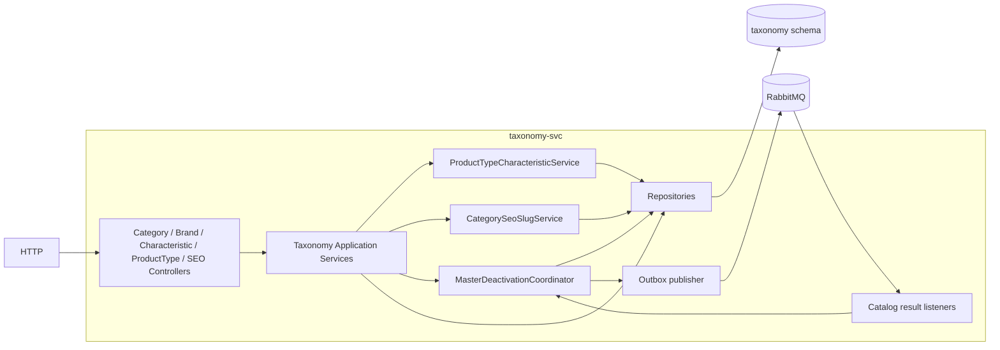
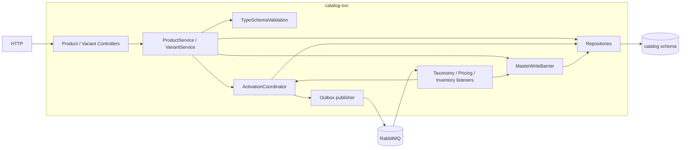
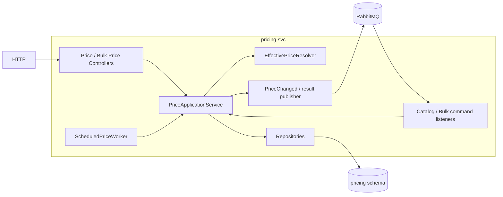
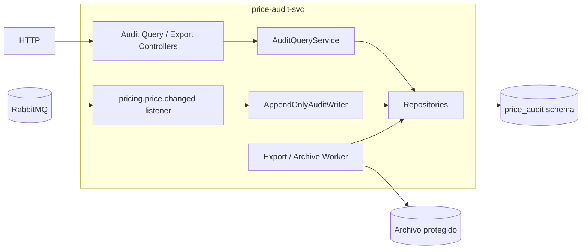
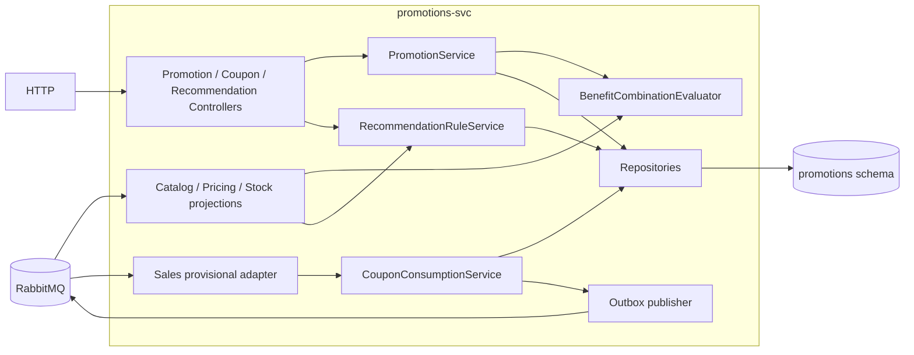
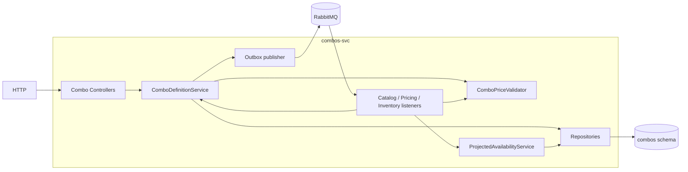
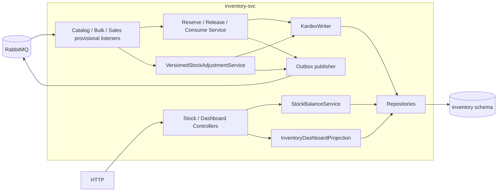
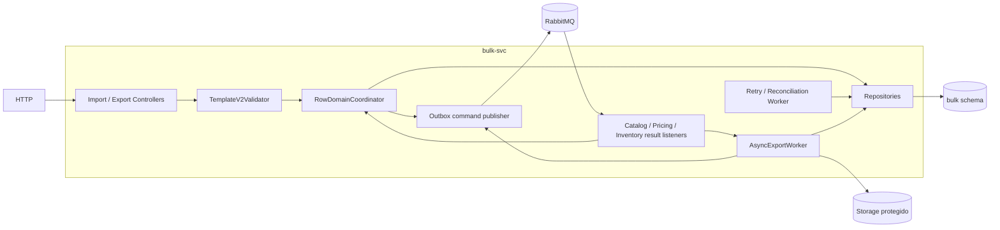

# Arquitectura del Módulo de Productos y Ofertas

**Repositorio:** `Taller-SW-Web/Productos-y-Ofertas-docs`  
**Ruta recomendada:** `architecture/arquitectura-modulo-productos-ofertas.md`  

Esta arquitectura se deriva de las 16 especificaciones en `specs/`, las 16 historias de usuario en `hu/` y los 16 flujos funcionales en `wireframes/flows/`.

---

## 0. Objetivo y alcance

Esta arquitectura organiza el módulo de **Productos y Ofertas** de un marketplace multicanal deportivo y cubre las 16 funcionalidades documentadas:

1. Carga y exportación masiva de productos.
2. Gestión de combos de productos.
3. Gestión de productos CRUD.
4. Gestión de variantes y SKUs.
5. Gestión de cupones de descuento.
6. Gestión de ofertas y promociones.
7. Reglas de venta cruzada y upselling.
8. Gestión de categorías y subcategorías.
9. Gestión de características y valores.
10. Asociación Tipo de Producto–Característica.
11. Gestión de marcas.
12. SEO y metadatos de categorías.
13. Gestión de precios individuales y masivos.
14. Historial y auditoría de precios.
15. Control de stock y disponibilidad.
16. Dashboard y alertas de stock.

La arquitectura mantiene **ocho bounded contexts de negocio**, más un **API Gateway/BFF** como contenedor de acceso y lectura agregada. El gateway no es un noveno bounded context y no posee reglas de negocio maestras.

### 0.1 Decisiones arquitectónicas base

1. El módulo se mantiene separado en repositorios de **documentación**, **frontend** y **backend**, según la organización del proyecto.
2. El backend se implementa como workspace/monorepo NestJS con ocho aplicaciones de dominio y un gateway/BFF.
3. Cada bounded context es propietario exclusivo de sus datos. **No existen joins ni escrituras directas sobre el esquema de otro contexto.**
4. Las mutaciones interdominio y los procesos largos usan mensajería asíncrona, idempotencia, Outbox/Inbox y correlación por `operation_id`/`batch_id` cuando corresponda.
5. Las consultas autoritativas de solo lectura que las SPEC declaran como API interna pueden exponerse por HTTP. Esto **no** autoriza escrituras cruzadas ni acceso directo a la base de otro servicio.
6. El frontend consume HTTP/HTTPS. Las lecturas agregadas pueden resolverse mediante BFF/read model alimentado por eventos para evitar fan-out innecesario.
7. Los contratos con Ventas/Postventa permanecen **provisionales** hasta su homologación. La arquitectura no supone reservas de stock ni reembolsos no definidos por las SPEC.
8. Los límites configurables (`MAX_CATEGORY_DEPTH`, `MAX_PRODUCT_TYPE_ATTRIBUTES`, etc.) se modelan como configuración; sus valores iniciales del MVP no se convierten en invariantes permanentes.

---

## 1. Descomposición DDD

### 1.1 Bounded contexts

| Aplicación | Contexto | Responsabilidades principales |
|---|---|---|
| `taxonomy-svc` | Taxonomía, maestros y SEO de categorías | Categorías/subcategorías, marcas, características/valores, tipos de producto ligeros, asociación Tipo de Producto–Característica, SEO/meta de categorías, historial de slugs y bajas seguras de maestros. |
| `catalog-svc` | Catálogo | Producto base, `sku_base`, variantes, `variant_id`, SKU comercial, atributos, imágenes, estados BORRADOR/ACTIVO/INACTIVO, slug de producto y validaciones de activación. |
| `pricing-svc` | Pricing | Precio regular, precio oferta opcional, vigencias, scope/canal, herencia/fallback producto→variante, importación propia de precios y publicación de cambios. |
| `price-audit-svc` | Auditoría de precios | Registro append-only de cambios de precio, filtros, exportaciones y retención/archivo configurable. |
| `promotions-svc` | Promociones, cupones y recomendaciones | Promociones automáticas/CUPÓN, políticas granulares de combinación, cupones/consumos, Cross-sell/Upsell y evaluación de beneficios. |
| `combos-svc` | Combos | Definición de combo, componentes SKU/cantidad, precio del combo, disponibilidad proyectada y desactivación por componentes. No es propietario del stock. |
| `inventory-svc` | Inventario | Saldos por `(sku, location_id)`, `on_hand`, `reserved`, `available`, umbrales, reserve/release/consume, ajustes, Kardex y dashboard operativo de stock. |
| `bulk-svc` | Carga/exportación masiva | Plantilla v2, validación XLSX/CSV, importaciones/exportaciones asíncronas, coordinación por fila entre Catálogo/Pricing/Inventario, reintentos y conciliación. |

### 1.2 Gateway/BFF

`api-gateway` es un contenedor de infraestructura de acceso con estas responsabilidades:

- exponer lecturas agregadas cuando una vista requiere datos de varios contextos;
- mantener read models/proyecciones alimentadas por eventos;
- exponer estado de operaciones asíncronas;
- validar autenticación/autorización de sus propias rutas;
- actuar como adaptador anti-corrupción para integraciones externas cuando sea necesario.

No debe:

- poseer reglas de dominio que pertenecen a un bounded context;
- escribir directamente en esquemas de servicios;
- convertirse en base de datos maestra de catálogo, precios, promociones o stock.

---

## 2. Trazabilidad de las 16 funcionalidades

| WF | SPEC / HU | Propietario arquitectónico |
|---|---|---|
| WF-001 | `SPEC-001-carga-exportacion-masiva-productos.md` / `HU-001-carga-exportacion-masiva-productos.md` | `bulk-svc` |
| WF-002 | `SPEC-002-gestion-combos-productos.md` / `HU-002-gestion-combos-productos.md` | `combos-svc` |
| WF-003 | `SPEC-003-gestion-productos-crud.md` / `HU-003-gestion-productos-crud.md` | `catalog-svc` |
| WF-004 | `SPEC-004-gestion-variantes-skus.md` / `HU-004-gestion-variantes-skus.md` | `catalog-svc` |
| WF-005 | `SPEC-005-gestion-cupones-descuento.md` / `HU-005-gestion-cupones-descuento.md` | `promotions-svc` |
| WF-006 | `SPEC-006-gestion-ofertas-promociones.md` / `HU-006-gestion-ofertas-promociones.md` | `promotions-svc` |
| WF-007 | `SPEC-007-reglas-venta-cruzada-upselling.md` / `HU-007-reglas-venta-cruzada-upselling.md` | `promotions-svc` |
| WF-008 | `SPEC-008-gestion-categorias.md` / `HU-008-gestion-categorias.md` | `taxonomy-svc` |
| WF-009 | `SPEC-009-gestion-caracteristicas.md` / `HU-009-gestion-caracteristicas.md` | `taxonomy-svc` |
| WF-010 | `SPEC-010-asociacion-tipo-producto-caracteristica.md` / `HU-010-asociacion-tipo-producto-caracteristica.md` | `taxonomy-svc` |
| WF-011 | `SPEC-011-gestion-marcas.md` / `HU-011-gestion-marcas.md` | `taxonomy-svc` |
| WF-012 | `SPEC-012-seo-metadatos.md` / `HU-012-seo-metadatos.md` | `taxonomy-svc` |
| WF-013 | `SPEC-013-gestion-precios-individuales-masivos.md` / `HU-013-gestion-precios-individuales-masivos.md` | `pricing-svc` |
| WF-014 | `SPEC-014-historial-auditoria-precios.md` / `HU-014-historial-auditoria-precios.md` | `price-audit-svc` |
| WF-015 | `SPEC-015-control-stock-disponibilidad.md` / `HU-015-control-stock-disponibilidad.md` | `inventory-svc` |
| WF-016 | `SPEC-016-dashboard-alertas-stock.md` / `HU-016-dashboard-alertas-stock.md` | `inventory-svc` |

---

## 3. Reglas transversales que condicionan la arquitectura

### 3.1 Taxonomía, categorías y tipos de producto

- Una categoría sirve para **navegación/clasificación**. No define ni hereda características.
- En el MVP, cada producto mantiene una sola `categoria_id`.
- El esquema de atributos se determina exclusivamente por `tipo_producto_id`.
- `taxonomy-svc` mantiene tipos de producto ligeros con `tipo_producto_id`, nombre y estado.
- La asociación Tipo de Producto–Característica define si cada característica es `OBLIGATORIA` u `OPCIONAL`.
- `MAX_PRODUCT_TYPE_ATTRIBUTES` es configurable; valor inicial del MVP: 20.
- `MAX_CATEGORY_DEPTH` es configurable; valor inicial del MVP: 2.
- Características soportadas: `TEXTO`, `NUMERO`, `LISTA`.
- Límites configurables iniciales adicionales: `MAX_ACTIVE_LIST_VALUES=50` y `MAX_TEXT_ATTRIBUTE_LENGTH=100`.
- Desactivar categorías, marcas o valores LISTA utilizados requiere verificación segura; no se elimina físicamente ni se reescriben históricos.

### 3.2 Catálogo, producto, variante y SKU

- Producto y variante se crean inicialmente en BORRADOR cuando corresponda.
- `variant_id` es el identificador interno estable de la variante y **no es el SKU comercial**.
- `sku_base` identifica al producto; para producto simple también es el SKU vendible.
- El SKU comercial de variante es globalmente único y generalmente inmutable una vez publicada la identidad.
- Los atributos identificadores de una variante son inmutables después de crear identidad comercial; los no identificadores e imagen pueden editarse según contrato.
- `tipo_producto_id` define atributos requeridos. Si el tipo no tiene atributos obligatorios, no se impone artificialmente “al menos una característica”.
- Un producto con variantes no mantiene stock propio; el stock corresponde a sus SKUs vendibles.
- El slug de producto pertenece a `catalog-svc`.
- La activación de producto exige categoría/tipo/marca vigentes, atributos obligatorios, imagen y preparación confirmada de Pricing/Inventario; si maneja variantes, requiere al menos una variante ACTIVA válida.
- Desactivar la última variante ACTIVA puede inactivar el padre según la regla del catálogo; reactivar una variante no reactiva automáticamente al padre.

### 3.3 SEO de categorías

- El slug de categoría y sus metadatos pertenecen a `taxonomy-svc` (capacidad SEO).
- Durante creación de categoría, WF-008 consume la generación de slug y muestra **el slug final antes de confirmar**.
- En colisión automática se permite sufijo incremental visible (`slug-2`, `slug-3`, ...).
- En edición manual, un slug duplicado se rechaza; no se corrige silenciosamente.
- Se registra `old_slug → new_slug` como resolución permanente.
- Marketplace/canal público es responsable de materializar la respuesta HTTP 301; Taxonomía solo expone la resolución.

### 3.4 Pricing y política de beneficios

`pricing-svc` es propietario de:

- `precio_regular`;
- `precio_oferta` opcional;
- moneda;
- vigencia;
- scope/canal;
- `price_version`.

No decide la combinación de promociones/cupones.

`promotions-svc` administra una política granular de compatibilidad con:

- `OFERTA_PRICING`;
- `PROMOCION_AUTOMATICA`;
- `CUPON`.

Reglas compartidas:

1. Solo se evalúan combinaciones expresamente autorizadas.
2. Se selecciona el menor importe final para la misma cesta.
3. En empate exacto: primero la alternativa que **no consuma cupón**; luego menor `prioridad`; finalmente identificador estable.
4. La etiqueta “Exclusiva” puede derivarse cuando las tres compatibilidades están deshabilitadas; no sustituye al contrato granular.
5. Un cupón solo consume uso si forma parte de la alternativa finalmente seleccionada.

### 3.5 Combos

- Un combo contiene al menos dos SKUs vendibles distintos, con cantidades positivas.
- No se permiten combos anidados.
- El precio del combo es mayor que cero y menor tanto que la suma regular de componentes como que la suma de sus precios públicos vigentes individuales.
- La disponibilidad estimada se calcula como `min(floor(available_i / cantidad_i))`.
- `combos-svc` no descuenta stock; el propietario del stock sigue siendo `inventory-svc`.
- La existencia de un combo no impone por arquitectura una exclusividad universal con otros beneficios. La coexistencia comercial se rige por la política correspondiente.
- La baja de un SKU componente debe hacer que el combo deje de considerarse vendible.

### 3.6 Inventario

La unidad operativa es `(sku, location_id)`.

```text
available = max(on_hand - reserved, 0)

available = 0                         -> AGOTADO
0 < available <= umbral_resuelto     -> STOCK_BAJO
available > umbral_resuelto           -> DISPONIBLE
```

- Existe un umbral global configurable y override opcional por SKU.
- El valor 5 utilizado en ejemplos **no es un default contractual**.
- Inventario ofrece capacidades idempotentes `reserve`, `release` y `consume`.
- Sales/Postventa decide cuándo solicitar reserva si algún día se homologa esa fase.
- En el alcance vigente, `order.created` por sí solo no reserva ni descuenta.
- Provisionalmente, `order.confirmed` dispara consumo.
- Despacho no produce un segundo consumo.
- Cancelación compensa solo cuando corresponde al estado previo acordado.
- Una devolución repone exclusivamente cantidades físicamente aceptadas y reintegrables en una ubicación.
- `inventory.stock.changed` es el evento canónico para proyecciones/dashboard; `inventory.stock.adjusted` expresa un ajuste persistido/Kardex.
- WF-016 muestra métricas operativas de inventario; **no** rankings de ventas ni Top 5 comerciales.

### 3.7 Bulk

- Plantilla contractual: `template_version=2`.
- Importación: máximo 5.000 filas o 10 MB.
- Exportación completa: asíncrona y **no truncada** por el límite de importación.
- Operaciones: `CREAR_PRODUCTO_SIMPLE | CREAR_VARIANTE | ACTUALIZAR`.
- La plantilla v2 usa exactamente estas 25 columnas, en este orden:

```text
operacion
product_id
variant_id
sku_base
sku
nombre
descripcion
categoria_id
tipo_producto_id
marca_id
tiene_variantes
caracteristicas_identificadoras
atributos_identificadores
atributos_no_identificadores
imagen_url
precio_regular
precio_oferta
accion_precio_oferta
location_id
stock
catalog_version
price_version
stock_version
estado
motivo_cambio
```

- `variant_id` siempre es identidad interna generada por Catálogo; no se deriva del SKU.
- Stock informado representa conteo absoluto y usa `stock_version` para concurrencia optimista.
- No existe transacción distribuida global entre Catálogo, Pricing e Inventario.
- Una fila solo queda `COMPLETED` cuando todos los dominios requeridos confirman.
- Un fallo parcial registra `applied_domains[]`, `failed_domain` y `needs_reconciliation` cuando corresponde.
- Reintentos transitorios usan idempotencia; un lote fallido puede reanudar operaciones pendientes con el mismo `batch_id` sin repetir pasos ya confirmados.

### 3.8 Auditoría de precios

- `price-audit-svc` consume cambios confirmados de Pricing y registra una bitácora append-only.
- El primer precio se audita como `CREACION`, con `precio_anterior=null`.
- Retirar una oferta se registra como `RETIRO_OFERTA`, con nuevo valor de oferta `null`.
- Límites de exportación: CSV hasta 100.000 registros; PDF hasta 500.
- Retención configurable con `AUDIT_HOT_RETENTION_MONTHS` y `AUDIT_ARCHIVE_RETENTION_YEARS`.
- Valores iniciales del MVP: 24 meses en caliente y 5 años en archivo; son configuración, no una obligación legal universal.
- Auditoría no ejecuta rollback de precios.

---

## 4. Persistencia y aislamiento

### 4.1 Principio

Cada servicio posee su esquema PostgreSQL y sus migraciones. Puede utilizarse una única instancia física durante el proyecto, pero con aislamiento lógico por roles/esquemas. Ningún servicio consulta tablas ajenas.

### 4.2 Esquemas sugeridos

| Servicio | Esquema | Entidades/tablas conceptuales |
|---|---|---|
| `taxonomy-svc` | `taxonomy` | `categories`, `brands`, `characteristics`, `characteristic_values`, `product_types`, `product_type_characteristics`, `category_seo`, `slug_history`, `master_deactivation_operations`, `outbox`, `inbox` |
| `catalog-svc` | `catalog` | `products`, `variants`, `product_attribute_values`, `variant_attribute_values`, `activation_checks`, `master_barriers`, `outbox`, `inbox` |
| `pricing-svc` | `pricing` | `prices`, `price_validities`, `scheduled_prices`, `bulk_price_jobs`, `outbox`, `inbox` |
| `price-audit-svc` | `price_audit` | `price_audit_log`, `export_jobs`, `archive_manifests`, `inbox` |
| `promotions-svc` | `promotions` | `promotions`, `promotion_scopes`, `combination_policy`, `coupons`, `coupon_uses`, `recommendation_rules`, `catalog_projection`, `outbox`, `inbox` |
| `combos-svc` | `combos` | `combos`, `combo_items`, `component_projection`, `outbox`, `inbox` |
| `inventory-svc` | `inventory` | `stock_balance`, `stock_threshold_override`, `kardex`, `inventory_operations`, `dashboard_projection`, `outbox`, `inbox` |
| `bulk-svc` | `bulk` | `batch_jobs`, `batch_rows`, `row_domain_steps`, `export_jobs`, `file_manifests`, `outbox`, `inbox` |
| `api-gateway` | `read_model` | `product_listing`, `product_detail_view`, `combo_view`, `operation_status`, `event_offsets`, `inbox` |

Estas tablas son una propuesta física inicial; los **límites de propiedad** sí son arquitectónicos, los nombres concretos de tablas no.

---

## 5. Topología de integración

### 5.1 Patrones

- **HTTP/HTTPS:** frontend → gateway/servicio propietario; consultas autoritativas de solo lectura entre servicios cuando una SPEC las exige.
- **Mensajería asíncrona:** mutaciones cross-context, coordinación, eventos y trabajos largos.
- **Outbox:** publicación posterior al commit local.
- **Inbox:** deduplicación/idempotencia del consumidor.
- **Optimistic concurrency:** versiones de catálogo/precio/stock donde las SPEC lo exigen.
- **Read models:** vistas agregadas no autoritativas.

### 5.2 Mensajes principales

| Productor | Mensaje / contrato | Consumidores principales | Semántica |
|---|---|---|---|
| Taxonomía | `taxonomy.master.deactivation.check.requested` | Catálogo | Solicita verificación y barrera para baja segura. |
| Catálogo | `catalog.master.deactivation.checked` | Taxonomía | `CLEAR` o `HAS_ACTIVE_PRODUCTS` correlacionado por `operation_id`. |
| Taxonomía | `taxonomy.master.deactivated` / `.rejected` | Catálogo, proyecciones | Resultado final de la baja maestra. |
| Taxonomía | `taxonomy.category.updated` | Catálogo/BFF/canales | Hecho de actualización de categoría. |
| Catálogo | `catalog.product.deactivated` | consumidores | Hecho posterior a baja lógica. |
| Catálogo | `catalog.sku.deactivated` | Combos/Promociones/BFF | Retira componentes/candidatos vendibles. |
| Pricing | `pricing.price.changed` | Auditoría, Promociones, BFF | Hecho confirmado; nunca comando de cambio. |
| Inventario | `inventory.stock.changed` | Dashboard, Combos, Promociones/BFF | Actualización de proyecciones. |
| Inventario | `inventory.stock.adjusted` | Bulk/BFF/auditoría operativa | Ajuste confirmado después de Kardex. |
| Bulk | `catalog.bulk.upsert.requested` | Catálogo | Comando idempotente por fila. |
| Catálogo | `catalog.bulk.upsert.completed|rejected` | Bulk | Resultado de dominio. |
| Bulk | `pricing.bulk.price.apply.requested` | Pricing | Aplicación de cambio de precio posterior cuando corresponda. |
| Pricing | `pricing.bulk.price.apply.completed|rejected` | Bulk | Resultado de Pricing. |
| Bulk | `inventory.bulk.stock.adjust.requested` | Inventario | Ajuste absoluto condicionado por versión. |
| Inventario | `inventory.bulk.stock.adjust.completed|rejected` | Bulk | Resultado de Inventario. |
| Promociones | `promotions.coupon.consumption.completed|rejected` | Ventas/Postventa provisional | Resultado idempotente de consumo de cupón. |

Los nombres que una SPEC identifica como “propuestos” siguen tratándose como contratos internos versionados, no como contratos externos definitivamente homologados.

### 5.3 Sobre de mensaje recomendado

```json
{
  "message_id": "uuid",
  "kind": "command|event|result",
  "name": "inventory.bulk.stock.adjust.requested",
  "schema_version": 1,
  "operation_id": "uuid",
  "correlation_id": "uuid",
  "causation_id": "uuid-or-null",
  "occurred_at": "ISO-8601",
  "producer": "bulk-svc",
  "actor": {
    "user_id": "opaque-id",
    "channel": "BULK_IMPORT"
  },
  "data": {}
}
```

---

## 6. Flujos arquitectónicos críticos

### 6.1 Alta de producto simple

1. `catalog-svc` valida datos mínimos y crea producto BORRADOR.
2. Catálogo genera `product_id`, `sku_base` y slug de producto.
3. Solicita de forma idempotente el precio inicial a `pricing-svc`.
4. Solicita inicialización del SKU vendible en `inventory-svc` con saldo 0 y versión inicial.
5. Pricing e Inventario confirman sus preparaciones.
6. La activación solo se permite cuando se cumplen todas las condiciones de SPEC-003.

### 6.2 Alta de variante

1. Catálogo valida padre `tiene_variantes=true` y esquema del `tipo_producto_id`.
2. Genera `variant_id` interno.
3. Valida o genera SKU comercial único.
4. Persiste atributos identificadores y no identificadores.
5. Inventario inicializa el SKU de variante.
6. Pricing resuelve precio mediante override de variante o fallback al producto padre.
7. La variante pasa a ACTIVA únicamente cuando cumple imagen, precio aplicable e inventario inicializado.

### 6.3 Baja segura de categoría/marca/valor LISTA

1. Taxonomía crea operación `PENDING_DEACTIVATION` con `operation_id`.
2. Publica solicitud de verificación.
3. Catálogo instala barrera de escritura sobre la entidad y verifica usos activos.
4. Devuelve `CLEAR` o `HAS_ACTIVE_PRODUCTS`.
5. Taxonomía confirma o rechaza la baja.
6. Catálogo libera la barrera tras procesar el resultado final.
7. Timeout/error nunca se interpreta como autorización para desactivar.

### 6.4 Evaluación de precio/promoción/cupón

1. Pricing resuelve precio regular y, si existe, oferta pública vigente.
2. Promociones obtiene promociones automáticas/cupón válidos para la cesta.
3. Construye únicamente combinaciones autorizadas por la política granular.
4. Calcula cada alternativa con aritmética decimal exacta.
5. Selecciona el menor importe final.
6. Empate: sin cupón → menor prioridad → identificador estable.
7. El cupón no se consume durante validación; se consume únicamente si fue seleccionado y Ventas/Postventa confirma el pedido según el contrato vigente.

### 6.5 Pedido y stock — contrato externo provisional

Hasta homologación con Ventas/Postventa:

- `order.created` no modifica inventario por sí mismo.
- `order.confirmed` puede disparar `consume` de forma provisional.
- `order.cancelled` compensa según el estado previo acordado.
- despacho no vuelve a consumir;
- `order.returned`/equivalente solo repone cantidades físicamente aceptadas y reintegrables.

Si en el futuro se homologa una fase de reserva, Ventas/Postventa podrá solicitar `reserve` y posteriormente `release`/`consume`, sin cambiar la propiedad de Inventario.

### 6.6 Importación masiva

1. `bulk-svc` recibe archivo y devuelve `202 + batch_id`.
2. Valida tamaño, estructura, `template_version=2`, fórmulas/macros y reglas de formato.
3. Asigna `row_id` y determina qué dominios requiere cada fila.
4. Emite comandos idempotentes a Catálogo/Pricing/Inventario respetando dependencias.
5. Cada dominio persiste localmente y devuelve `completed|rejected`.
6. Bulk marca fila `COMPLETED` solo con todos los resultados requeridos.
7. Fallo parcial registra los dominios ya aplicados y activa conciliación, sin rollback global ficticio.

---

## 7. Stack tecnológico propuesto

Las decisiones siguientes son arquitectónicas/técnicas y no sustituyen requisitos funcionales:

| Capa | Tecnología |
|---|---|
| Backend | NestJS + TypeScript + Node.js |
| Gestión de paquetes | pnpm |
| Frontend | React + TypeScript + Vite |
| Routing frontend | React Router |
| Server state | TanStack Query |
| Estado cliente | Zustand |
| Formularios | React Hook Form |
| Validación frontend | Zod |
| Persistencia | PostgreSQL; Supabase puede utilizarse como proveedor durante el proyecto |
| Mensajería | RabbitMQ |
| Caché/rate limiting | Valkey, solo como optimización |
| Contratos HTTP | OpenAPI |
| Contratos asíncronos | AsyncAPI + JSON Schema |
| Observabilidad | Logs estructurados + OpenTelemetry |
| Unit/integration | Jest/Vitest + Testcontainers |
| E2E | Playwright |
| CI/CD | GitHub Actions |

### 7.1 Estructura backend sugerida

```text
backend/
├── apps/
│   ├── api-gateway/
│   ├── taxonomy-svc/
│   ├── catalog-svc/
│   ├── pricing-svc/
│   ├── price-audit-svc/
│   ├── promotions-svc/
│   ├── combos-svc/
│   ├── inventory-svc/
│   └── bulk-svc/
├── libs/
│   ├── common/
│   │   ├── auth/
│   │   ├── messaging/
│   │   ├── observability/
│   │   └── errors/
│   └── contracts/
│       ├── taxonomy/
│       ├── catalog/
│       ├── pricing/
│       ├── promotions/
│       ├── combos/
│       ├── inventory/
│       ├── bulk/
│       └── sales/provisional-v0/
├── infra/
└── .github/workflows/
```

No deben compartirse entidades ORM ni repositorios entre bounded contexts. `libs/contracts` comparte DTOs/esquemas versionados, no modelos de persistencia.

---

## 8. Seguridad

- JWT emitido por el módulo/equipo de Seguridad y Usuarios.
- Validación local en cada entrada HTTP mediante JWKS y algoritmo permitido.
- Autorización mediante permisos/claims acordados; el frontend no es autoridad de seguridad.
- Mensajería usa identidades/credenciales de servicio y permisos por exchange/queue.
- No propagar JWT de usuario como mecanismo de autenticación de jobs largos.
- No registrar JWT, secretos o archivos completos en logs.
- Operaciones de negocio sensibles deben fallar de forma segura si no pueden validar identidad/autorización.
- Nunca utilizar credenciales administrativas de base de datos desde el frontend.

---

## 9. C4 — Nivel 1: contexto



---

## 10. C4 — Nivel 2: contenedores



---

## 11. C4 — Nivel 3 por bounded context

### 11.1 `taxonomy-svc`



### 11.2 `catalog-svc`



### 11.3 `pricing-svc`



### 11.4 `price-audit-svc`



### 11.5 `promotions-svc`



### 11.6 `combos-svc`



### 11.7 `inventory-svc`



### 11.8 `bulk-svc`



---

## 12. Resiliencia, idempotencia y concurrencia

| Riesgo | Respuesta arquitectónica |
|---|---|
| Evento perdido después de commit | Outbox en la misma transacción local + relay reintentable. |
| Mensaje duplicado | Inbox/clave idempotente por `message_id` y/o `operation_id`. |
| Mensajes fuera de orden | Versiones de agregado, correlación y estados pendientes recuperables. |
| Stock concurrente | Operación por `(sku, location_id)` y `stock_version`; no locks globales. |
| Cupón concurrente | Consumo transaccional e idempotente por `order_id + cupon_id`. |
| Precio concurrente | `price_version` y validación optimista. |
| Bulk parcialmente aplicado | `applied_domains[]`, `failed_domain`, `needs_reconciliation`; no rollback global inventado. |
| Baja maestra concurrente | Barrera en Catálogo durante verificación asíncrona. |
| Proyección desactualizada | `source_version`, `as_of`/`updated_at`; nunca autorizar una escritura crítica solo con read model. |
| Poison message | DLQ/cuarentena y runbook de replay. |

---

## 13. Testing y CI/CD

### 13.1 Capas de prueba

1. **Unitarias:** invariantes de cada bounded context.
2. **Integración:** PostgreSQL real y broker mediante Testcontainers.
3. **Contratos:** OpenAPI/AsyncAPI/JSON Schema y compatibilidad productor-consumidor.
4. **Concurrencia:** último cupón, `stock_version`, `price_version`, replay de mensajes.
5. **E2E:** WF-001..WF-016 sobre frontend y backend/mocks contractuales.
6. **Resiliencia:** broker caído, duplicados, orden invertido, worker reiniciado, proyección atrasada.

### 13.2 Casos críticos mínimos

- dos consumos para el último uso de cupón → uno debe rechazarse;
- dos ajustes con la misma `stock_version` → uno debe producir conflicto;
- precio rechazado → no se emite `pricing.price.changed`;
- replay de `pricing.price.changed` → un solo asiento de auditoría;
- archivo con 5.001 filas → importación rechazada por límite, exportación no truncada;
- fallo de Pricing después de Catálogo en bulk → fila fallida/parcial con conciliación, sin afirmar rollback global;
- categoría con productos activos → baja rechazada y barrera liberada de forma segura;
- tipo de producto sin atributos obligatorios → activación no exige atributo ficticio;
- variante nueva → `variant_id` distinto del SKU comercial;
- `order.created` → no modifica stock en el contrato actual.

### 13.3 CI sugerido

- `pnpm install --frozen-lockfile`;
- lint + typecheck;
- unit tests por servicio afectado;
- integration/contract tests para productor y consumidores cuando cambia `libs/contracts/**`;
- build NestJS por app afectada;
- build Vite frontend;
- Playwright para flujos críticos;
- Markdown lint + verificación de Mermaid y enlaces en repo docs.

---

## 14. Decisiones que quedan provisionales

1. Nombre y esquema definitivo de eventos de Ventas/Postventa.
2. Hito exacto en el que una venta autoriza `consume` de Inventario.
3. Si existirá una fase futura de reserva previa (`reserve`/TTL) y su expiración.
4. Semántica final de cancelación después de despacho y devoluciones parciales.
5. Tratamiento financiero ante fallo de stock/cupón después de un pago confirmado.
6. Infraestructura cloud definitiva y presupuesto real para broker, observabilidad y archivo de auditoría.
7. Valores operativos finales de parámetros configurables del despliegue.
