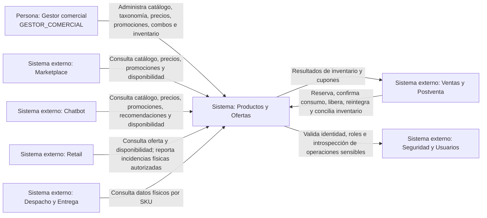
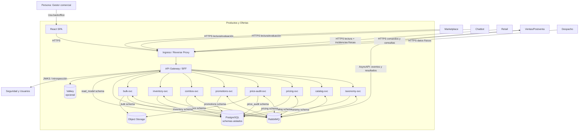
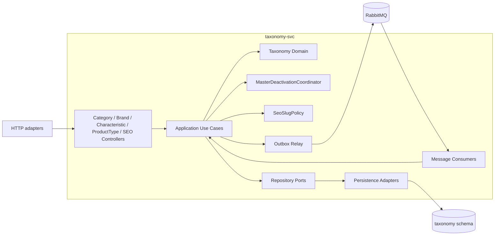
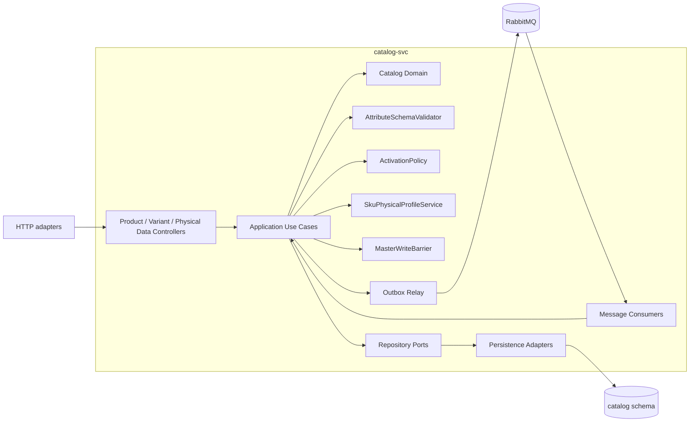
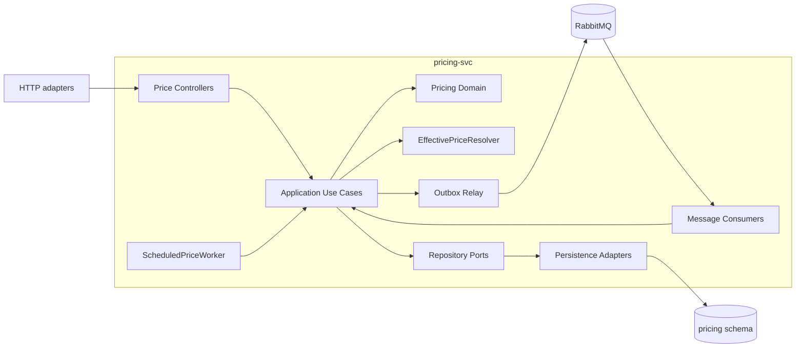
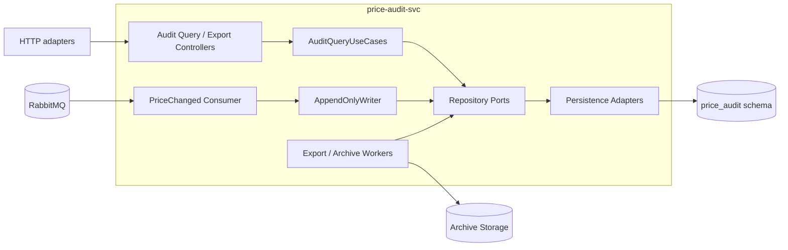
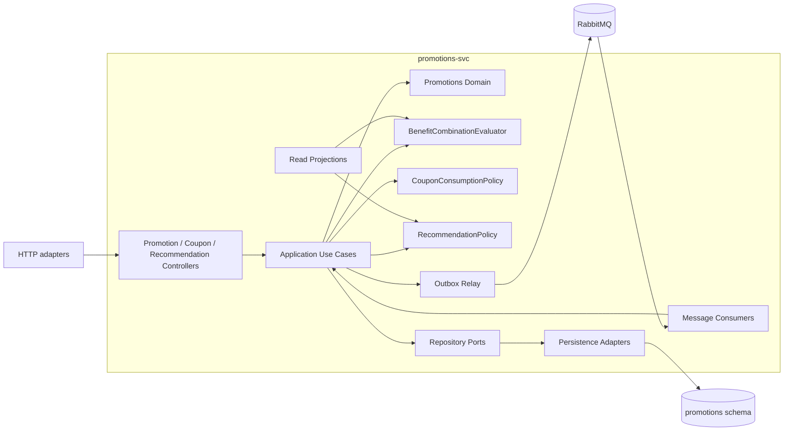
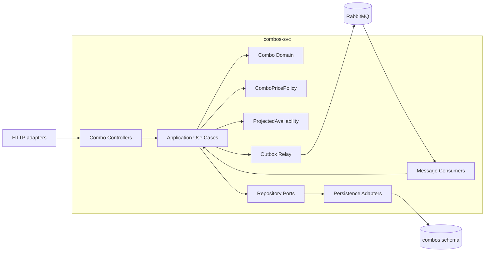
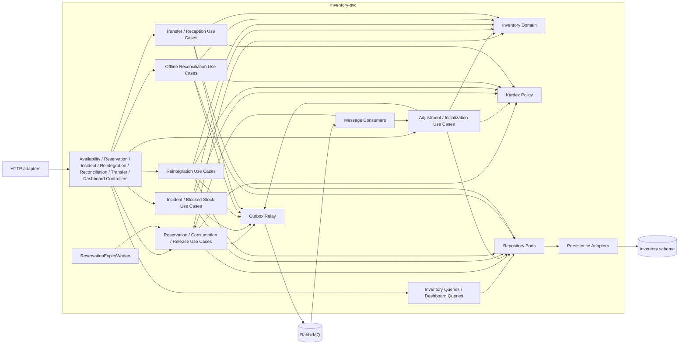
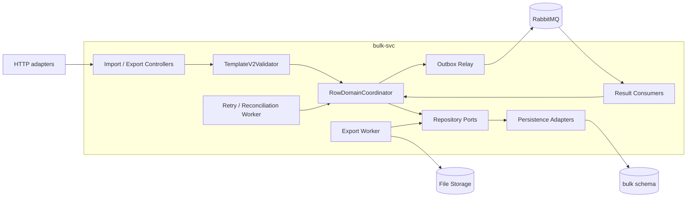

# Arquitectura del Módulo de Productos y Ofertas

**Fecha de actualización:** 2026-10-01  
**Repositorio de documentación:** `Taller-SW-Web/Productos-y-Ofertas-docs`  
**Archivo:** `Arquitectura.md`  
**Contrato HTTP canónico:** `api/openapi.yaml` (`0.4.0`)  
**Contrato asíncrono canónico:** `asyncapi/asyncapi.yaml` (`0.4.0`)  
**Catálogo de eventos:** `api/catalogo-eventos.md` (`0.4.0`)  
**Catálogo canónico de errores:** `api/catalogo-errores.md` (`0.4.0`)  
**Contrato humano de integración:** `Contrato_Api.md`  
**Modelo conceptual:** `Modelo_Conceptual.md`  
**Estado contractual consolidado:** OpenAPI `0.5.0` + AsyncAPI `0.4.0` + topología RabbitMQ consolidada.

> Esta arquitectura es la guía de implementación del backend y de sus integraciones.  
> Las SPEC son la fuente de verdad para reglas funcionales; `api/openapi.yaml` gobierna HTTP; `asyncapi/asyncapi.yaml` gobierna mensajería; `api/catalogo-errores.md` gobierna la semántica estable de `code`.

---

# 0. Objetivo

El módulo **Productos y Ofertas** administra las capacidades comerciales compartidas por Marketplace, Chatbot, Retail, Ventas/Postventa y Despacho:

1. carga y exportación masiva;
2. combos;
3. productos;
4. variantes y SKU;
5. cupones;
6. promociones;
7. cross-sell y upsell;
8. categorías;
9. características;
10. tipo de producto–característica;
11. marcas;
12. SEO;
13. precios;
14. auditoría de precios;
15. inventario y disponibilidad;
16. dashboard y alertas de stock.

La arquitectura debe permitir que estas capacidades evolucionen de forma independiente sin:

- compartir tablas entre bounded contexts;
- acoplar reglas de negocio al framework;
- duplicar contratos;
- depender de llamadas síncronas innecesarias;
- convertir `api-gateway` en un “microservicio dios”;
- compartir entidades ORM;
- propagar detalles de infraestructura al dominio;
- romper consumidores cuando cambie una implementación interna.

---

# 1. Decisiones arquitectónicas

## 1.1. Bounded contexts

Se mantienen **ocho bounded contexts de negocio**:

| Aplicación | Bounded context | Responsabilidad |
|---|---|---|
| `taxonomy-svc` | Taxonomía | Categorías, marcas, características, valores, tipos de producto, asociaciones y SEO de categoría. |
| `catalog-svc` | Catálogo | Productos, variantes, SKU, atributos, imágenes, estados, slug de producto y perfil físico por SKU. |
| `pricing-svc` | Pricing | Precios regulares/oferta, vigencias, canal, versión y programación. |
| `price-audit-svc` | Auditoría de precios | Registro append-only, consulta, exportación y archivo. |
| `promotions-svc` | Promociones | Promociones, cupones, consumo de cupón, cross-sell y upsell. |
| `combos-svc` | Combos | Definición, composición, precio y disponibilidad proyectada de combos. |
| `inventory-svc` | Inventario | Saldos, reservas, consumo, liberación, expiración, ajustes, incidencias y cuarentenas, reintegros, conciliación offline, traslados y recepciones, Kardex y dashboard. |
| `bulk-svc` | Bulk | Importación/exportación, validación, coordinación por fila, reintentos y conciliación. |

Además existe:

```text
api-gateway
```

como contenedor de acceso/BFF, **no como bounded context de negocio**.

---

## 1.2. Ownership externo

| Dato / proceso | Owner |
|---|---|
| Usuario, roles y autenticación | Seguridad y Usuarios |
| Pedido y estado comercial | Ventas y Postventa |
| Producto, SKU, precio, promociones y stock | Productos y Ofertas |
| Despacho, empaque y entrega | Despacho y Entrega |

### 1.2.1. Actor humano canónico

El actor humano canónico del módulo **Productos y Ofertas** es el **Gestor Comercial** (`GESTOR_COMERCIAL`).

Auditoría de precios, operación de inventario y consulta analítica son **capacidades funcionales del Gestor Comercial**, no roles humanos globales independientes. Cuando una operación requiera granularidad adicional, el módulo puede asociar capacidades locales al `sub` del Gestor Comercial autenticado, sin introducir nuevas personas en el C4 ni nuevos roles globales en Seguridad.

Por tanto, la documentación del módulo no debe modelar como roles globales independientes a `Auditor`, `Auditor Comercial`, `Responsable de inventario`, `Operador de inventario` o `Trabajador`. Esos términos solo pueden utilizarse como descripción de una responsabilidad operativa, nunca como identidad de autorización separada del `GESTOR_COMERCIAL`.

---

## 1.3. Flujo oficial de inventario

Flujo comercial normal:

```text
Canal
  -> Ventas crea CREADO
  -> Ventas RESERVA
  -> pago aprobado / PAGADO
  -> Ventas confirma CONSUMO
```

Compensaciones:

```text
anulación pre-consumo -> LIBERACIÓN
retorno físico aceptado -> REINTEGRO
venta Retail offline registrada -> CONCILIACIÓN
```

Hechos físicos de tienda:

```text
Retail -> reporta/resuelve INCIDENCIA -> inventory-svc
```

Consecuencias:

- Marketplace y Chatbot solo consultan.
- Retail no muta stock por una venta; solo reporta/resuelve hechos físicos mediante scopes dedicados.
- Ventas/Postventa orquesta las mutaciones comerciales.
- Inventario mantiene el saldo autoritativo.
- Despacho no produce un segundo consumo.
- La reserva conserva TTL configurable.

---

## 1.4. Datos físicos y Despacho

`catalog-svc` es owner de las propiedades físicas intrínsecas del SKU:

```text
pesoKg
largoCm
anchoCm
altoCm
actualizadoEn
```

Despacho es owner de:

```text
tipo de empaque
agrupación de unidades
cantidad de paquetes
volumen logístico final
capacidad de transporte
```

Productos no debe incorporar reglas de empaquetado.

---

# 2. Principios de diseño para mantenibilidad

## 2.1. Dependency Rule

Cada servicio sigue una arquitectura por capas/puertos:

```text
interfaces/adapters
        |
        v
application
        |
        v
domain
```

`infrastructure` implementa puertos definidos hacia adentro:

```text
domain <- application <- interfaces
             ^
             |
      infrastructure
```

Reglas:

1. `domain` no importa NestJS.
2. `domain` no importa PostgreSQL, RabbitMQ, HTTP ni OpenAPI.
3. `application` no importa implementaciones concretas de persistencia.
4. `interfaces` traduce HTTP/mensajería a casos de uso.
5. `infrastructure` implementa repositorios, broker, storage y clientes externos.
6. Ningún servicio importa código desde `apps/<otro-servicio>`.
7. Los contratos compartidos viven en `libs/contracts`, no en los dominios.

---

## 2.2. Regla contra el “shared kernel” accidental

No crear una librería común con:

```text
ProductEntity
VariantEntity
PriceEntity
StockEntity
PromotionEntity
```

El código común se limita a capacidades técnicas estables:

```text
auth
messaging
observability
problem-details
configuration
testing helpers
```

Los conceptos de negocio pertenecen a su bounded context.

---

## 2.3. Contrato ≠ modelo de dominio

Los DTO HTTP y schemas asíncronos no son entidades de dominio.

Ejemplo:

```text
ReservaInventarioRequest (OpenAPI)
        |
        v mapper
CreateReservationCommand
        |
        v
InventoryReservation (dominio)
```

Esto permite cambiar:

- nombres externos;
- serialización;
- headers;
- versión HTTP;

sin modificar las invariantes internas.

---

## 2.4. Una razón de cambio por módulo

Un archivo/clase no debe mezclar:

- transporte;
- autorización;
- reglas de negocio;
- persistencia;
- publicación de eventos.

Ejemplo incorrecto:

```text
InventoryController
  -> valida JWT
  -> ejecuta SQL
  -> calcula stock
  -> escribe Kardex
  -> publica RabbitMQ
```

Ejemplo correcto:

```text
InventoryController
  -> ConfirmReservationUseCase
       -> ReservationRepository
       -> StockRepository
       -> UnitOfWork
       -> OutboxPort
```

---

# 3. Estructura del monorepo backend

```text
backend/
├── apps/
│   ├── api-gateway/
│   ├── taxonomy-svc/
│   ├── catalog-svc/
│   ├── pricing-svc/
│   ├── price-audit-svc/
│   ├── promotions-svc/
│   ├── combos-svc/
│   ├── inventory-svc/
│   └── bulk-svc/
│
├── libs/
│   ├── contracts/
│   │   ├── http/
│   │   ├── events/
│   │   └── schemas/
│   └── platform/
│       ├── auth/
│       ├── config/
│       ├── messaging/
│       ├── observability/
│       ├── problem-details/
│       └── testing/
│
├── infra/
│   ├── docker/
│   ├── rabbitmq/
│   ├── postgres/
│   └── local/
│
├── scripts/
├── test/
├── package.json
├── pnpm-workspace.yaml
├── tsconfig.base.json
└── .github/workflows/
```
## 3.1. Qué puede vivir en `libs/contracts`

Solo artefactos de intercambio:

- DTO generados o mantenidos desde OpenAPI;
- JSON Schema;
- schemas AsyncAPI;
- tipos de envelopes;
- enumeraciones contractuales versionadas;
- códigos de error publicados.

No contiene:

- servicios de dominio;
- entidades ORM;
- repositorios;
- lógica de negocio.

---

## 3.2. Qué puede vivir en `libs/platform`

Solo infraestructura reusable transversal.

Ejemplos:

```text
JwtVerifier
CorrelationIdMiddleware
ProblemDetailsMapper
OutboxRelayBase
InboxDeduplicator
StructuredLogger
TelemetryModule
ConfigLoader
```

Una utilidad pasa a `platform` únicamente si:

1. no pertenece a un bounded context;
2. tiene al menos dos consumidores reales;
3. su semántica no depende de reglas de negocio.

---

# 4. Estructura interna estándar de cada servicio

Ejemplo `inventory-svc`:

```text
apps/inventory-svc/src/
├── main.ts
├── inventory.module.ts
│
├── domain/
│   ├── entities/
│   │   ├── stock-balance.ts
│   │   ├── inventory-reservation.ts
│   │   └── inventory-operation.ts
│   ├── value-objects/
│   │   ├── sku.ts
│   │   ├── location-id.ts
│   │   └── quantity.ts
│   ├── services/
│   ├── events/
│   ├── errors/
│   └── ports/
│       └── repositories/
│
├── application/
│   ├── commands/
│   ├── queries/
│   ├── handlers/
│   ├── ports/
│   └── policies/
│
├── interfaces/
│   ├── http/
│   │   ├── controllers/
│   │   ├── dto/
│   │   └── mappers/
│   └── messaging/
│       ├── consumers/
│       └── mappers/
│
├── infrastructure/
│   ├── persistence/
│   │   ├── repositories/
│   │   ├── entities/
│   │   └── migrations/
│   ├── messaging/
│   ├── config/
│   └── clock/
│
└── health/
```

Todos los servicios deben usar esta misma plantilla salvo una justificación explícita.

---

# 5. Reglas de dependencias entre paquetes

Permitido:

```text
interfaces -> application
infrastructure -> application/domain ports
application -> domain
domain -> nada externo
```

Prohibido:

```text
domain -> NestJS
domain -> ORM
domain -> RabbitMQ
domain -> Axios/fetch
catalog-svc -> inventory-svc source code
inventory-svc -> sales source code
```

La CI debe bloquear imports ilegales mediante reglas ESLint (`no-restricted-imports` / boundaries).

---

# 6. API Gateway / BFF

## 6.1. Responsabilidades

El gateway puede:

- autenticar requests externos;
- aplicar rate limiting;
- propagar `X-Correlation-Id`;
- enrutar al servicio owner;
- servir read models;
- agregar lecturas cuando una pantalla requiere varios dominios;
- exponer estado de operaciones asíncronas.

---

## 6.2. Prohibiciones

No debe:

- implementar descuentos;
- determinar stock;
- crear SKU;
- cambiar precios;
- decidir activación;
- escribir tablas de servicios;
- convertirse en orquestador de cada proceso interno.

---

## 6.3. Acceso externo

Las APIs externas se publican detrás de:

```text
Ingress / Reverse Proxy
          |
          v
API Gateway
```

Los servicios de dominio permanecen privados siempre que el despliegue lo permita.

Las rutas públicas siguen `api/openapi.yaml`.

---

# 7. Persistencia

## 7.1. PostgreSQL

Cada servicio tiene schema y credenciales propias.

| Servicio | Schema |
|---|---|
| `taxonomy-svc` | `taxonomy` |
| `catalog-svc` | `catalog` |
| `pricing-svc` | `pricing` |
| `price-audit-svc` | `price_audit` |
| `promotions-svc` | `promotions` |
| `combos-svc` | `combos` |
| `inventory-svc` | `inventory` |
| `bulk-svc` | `bulk` |
| `api-gateway` | `read_model` |

Una sola instancia PostgreSQL puede utilizarse para el curso, pero:

```text
un schema físico compartido != un modelo compartido
```

---

## 7.2. Tablas conceptuales revisadas

### `taxonomy`

```text
categories
brands
characteristics
characteristic_values
product_types
product_type_characteristics
category_seo
slug_history
master_deactivation_operations
outbox
inbox
```

### `catalog`

```text
products
variants
product_images
variant_images
product_attribute_values
variant_attribute_values
product_identifying_characteristics
sku_physical_profiles
activation_checks
master_barriers
outbox
inbox
```

### `pricing`

```text
prices
price_validities
scheduled_prices
bulk_price_jobs
outbox
inbox
```

### `price_audit`

```text
price_audit_log
export_jobs
archive_manifests
inbox
```

### `promotions`

```text
promotions
promotion_scopes
combination_policy
coupons
coupon_uses
recommendation_rules
recommendation_items
catalog_projection
price_projection
stock_projection
outbox
inbox
```

### `combos`

```text
combos
combo_items
component_projection
outbox
inbox
```

### `inventory`

```text
stock_balance
reservations
reservation_lines
inventory_operations
kardex
stock_threshold_override
inventory_config
dashboard_projection
outbox
inbox
```

### `bulk`

```text
batch_jobs
batch_rows
row_domain_steps
export_jobs
file_manifests
outbox
inbox
```

### `read_model`

```text
product_listing
product_detail_view
combo_view
operation_status
event_offsets
inbox
```

Los nombres físicos pueden evolucionar; el ownership no.

---

# 8. Migraciones

Cada servicio es dueño de sus migraciones.

Reglas:

1. una migración nunca modifica el schema de otro servicio;
2. las migraciones deben ser reproducibles desde cero;
3. no editar migraciones ya aplicadas en ambientes compartidos;
4. cambios destructivos se realizan con estrategia expand/contract;
5. las migraciones se ejecutan antes de iniciar la nueva versión;
6. despliegues no deben depender de creación automática de tablas del ORM.

Ejemplo expand/contract:

```text
v1: añadir columna nueva nullable
v2: escribir campo viejo + nuevo
v3: migrar datos históricos
v4: leer solo nuevo
v5: retirar campo viejo
```

---

# 9. Transacciones

## 9.1. ACID local

Debe usarse para invariantes del mismo servicio.

Ejemplos:

```text
Reserva + líneas + saldos + Outbox
Consumo + Kardex + saldos + Outbox
Liberación + Kardex + saldos + Outbox
Precio + vigencia + Outbox
Cupón + contador + Outbox
```

---

## 9.2. Prohibición de transacción distribuida

No existe una transacción SQL que abarque:

```text
Ventas + Inventario
Catálogo + Pricing
Catálogo + Inventario
Pricing + Auditoría
Bulk + Catálogo + Pricing + Inventario
```

La coordinación se implementa con:

- mensajes;
- estados explícitos;
- idempotencia;
- reintentos;
- compensación;
- conciliación.

---

# 10. Mensajería asíncrona

## 10.1. RabbitMQ

P2 fija una topología física estable en el vhost:

```text
/marketplace
```

Exchanges:

```text
po.commands.x  topic
po.events.x    topic
po.results.x   topic
po.retry.x     direct
po.dlx.x       direct
po.unrouted.x  fanout
```

Las routing keys son exactamente los nombres AsyncAPI.

Colas principales:

```text
po.catalog.q
po.gateway.q
po.promotions.q
po.combos.q
po.inventory.q
po.pricing.q
po.price-audit.q
po.sales.q
po.taxonomy.q
po.bulk.q
```

Cada cola principal tiene:

```text
<main>.retry
<main>.dlq
```

Características:

- quorum + durable;
- manual ack;
- publisher confirms;
- prefetch inicial 20;
- at-least-once;
- dedupe por `message_id`;
- idempotencia de negocio por `operation_id`;
- Outbox/Inbox obligatorios.

Retry técnico:

```text
fallo transitorio
-> po.retry.x
-> <main>.retry
-> TTL 30 s
-> default exchange
-> <main>
```

Máximo 3 retries de aplicación. Después:

```text
po.dlx.x -> <main>.dlq
```

Rechazos de negocio (`STOCK_INSUFICIENTE`, cupón sin cupo, etc.) se ACKean y producen resultado `...rejected`; no van a DLQ.

Publicaciones sin binding terminan en `po.unrouted.x` / `po.unrouted.q` y el publisher usa `mandatory=true`.

La matriz completa de bindings está en `api/rabbitmq-topologia.md` y en `asyncapi/asyncapi.yaml`.

## 10.2. Envelope estándar

```json
{
  "message_id": "uuid",
  "kind": "command|event|result",
  "name": "inventory.reservation.created",
  "schema_version": 1,
  "operation_id": "uuid",
  "correlation_id": "uuid",
  "causation_id": "uuid-or-null",
  "occurred_at": "ISO-8601",
  "producer": "inventory-svc",
  "actor": {
    "user_id": "opaque-or-null",
    "service_id": "modulo-ventas",
    "channel": "MARKETPLACE"
  },
  "data": {}
}
```

---

## 10.3. Reglas de publicación

Un evento de dominio:

1. se registra en Outbox en la misma transacción del cambio;
2. se publica después del commit;
3. puede ser entregado más de una vez;
4. debe ser procesable idempotentemente;
5. no garantiza orden global.

---

## 10.4. Inbox

Todo consumidor que cause efectos debe registrar:

```text
message_id
processed_at
handler
result
```

con unicidad por `message_id` o clave semántica equivalente.

---

## 10.5. Reintentos

Diferenciar:

### Error transitorio

Ejemplos:

```text
timeout
broker no disponible
DB temporalmente indisponible
HTTP 503
```

Puede reintentarse con backoff.

### Rechazo de negocio

Ejemplos:

```text
STOCK_INSUFICIENTE
VERSION_CONFLICT
SKU_INACTIVO
CUPON_AGOTADO
```

No debe reintentarse automáticamente como si fuera un error técnico.

---

## 10.6. DLQ

DLQ/cuarentena se reserva para:

- mensajes malformados;
- schema incompatible;
- errores técnicos persistentes;
- poison messages.

Un rechazo de negocio válido no es poison message.

---

# 11. Contratos

## 11.1. HTTP

Fuente canónica:

```text
api/openapi.yaml
```

La línea base vigente es OpenAPI `3.1.0`, contrato `0.4.0`. El contrato contiene **101 paths, 128 operaciones y 155 schemas**, con cobertura consolidada para las 16 funcionalidades del módulo.

Entre los cierres incorporados a esta línea base están:

- resolución previa del slug de categoría mediante `POST /api/v1/seo/categorias/slug/resolver`;
- creación de categoría con `slugConfirmado`, revalidado al persistir para evitar cambios silenciosos ante carreras;
- CRUD/consulta administrativa de tipos de producto y sus asociaciones de características;
- consulta del estado de una baja segura mediante `GET /api/v1/taxonomia/operaciones/{operationId}`;
- consulta y exportación administrativa de Auditoría de precios;
- códigos HTTP específicos para recurso inexistente, conflicto y límites funcionales de exportación.

Cambios incompatibles requieren nueva versión de la interfaz; los cambios compatibles dentro de `v1` deben actualizar primero OpenAPI y después los documentos humanos derivados.

---

## 11.2. Asíncronos

Fuente canónica:

```text
asyncapi/asyncapi.yaml
```

El contrato AsyncAPI P0 ya formaliza:

- envelope estándar;
- `message_id`;
- `operation_id`;
- `correlation_id`;
- `causation_id`;
- `schema_version`;
- productor y consumidores previstos;
- payload de cada mensaje;
- semántica `command | event | result`;
- entrega `at-least-once`;
- deduplicación por `message_id`.

El catálogo de eventos correspondiente es:

```text
api/catalogo-eventos.md
```

AsyncAPI P2 documenta **39 mensajes lógicos**, distribuidos entre:

- Taxonomía;
- Catálogo;
- Pricing;
- Inventario;
- Bulk;
- Promociones/Cupones.

Además de la baja segura de entidades maestras, AsyncAPI `0.4.0` formaliza:

```text
taxonomy.product-type-schema.changed
taxonomy.characteristic-value.updated
```

El primero propaga a Catálogo cambios confirmados del esquema asociado a un `tipo_producto_id`; el segundo propaga renombres confirmados de valores `LISTA`. El flujo genérico de baja segura cubre también `PRODUCT_TYPE` y `PRODUCT_TYPE_CHARACTERISTIC`.

P2 fija los nombres físicos de exchange, queue, retry y DLQ en `api/rabbitmq-topologia.md`.

Los contratos Catálogo → Pricing, Catálogo → Inventario, consumo/restitución de cupón y reintegro físico ya están formalizados en OpenAPI/AsyncAPI según corresponda.
## 11.3. Catálogos humanos

Dos documentos complementan los contratos ejecutables:

```text
api/catalogo-eventos.md
api/catalogo-errores.md
```

`catalogo-eventos.md` explica productores, consumidores, correlación, idempotencia, retries y relación OpenAPI ↔ AsyncAPI.

`catalogo-errores.md` centraliza:

- `Problem.code`;
- códigos de rechazo asíncrono;
- `401 TOKEN_INVALIDO`;
- `403 SCOPE_INSUFICIENTE`;
- `IDEMPOTENCY_CONFLICT`;
- códigos funcionales por dominio.

La implementación no debe inventar códigos desde controllers/consumers fuera de este catálogo.

---

## 11.4. Contratos generados

Si se usa generación de tipos desde OpenAPI/JSON Schema:

- los tipos generados son DTOs;
- no deben importarse dentro del dominio;
- deben mapearse en adapters.

---

# 12. Catálogo y perfil físico

## 12.1. Producto y variante

- `variant_id` es identidad interna.
- `sku` es identidad comercial.
- Producto simple usa `sku_base` como SKU vendible.
- Producto con variantes no posee stock propio.

---

## 12.2. Perfil físico

`catalog-svc` administra:

```text
sku
pesoKg
largoCm
anchoCm
altoCm
actualizadoEn
```

El perfil se asocia al SKU vendible.

No contiene:

```text
tipoEmpaque
cantidadPaquetes
volumenLogisticoFinal
```

---

## 12.3. Consulta de Despacho

Contrato:

```http
POST /api/v1/productos/datos-fisicos/consulta
```

Características:

- request en lote;
- consumidor técnico `modulo-despacho`;
- no consulta base de Catálogo directamente;
- scope propuesto `productos:fisicos:leer`;
- no incluye stock;
- no decide empaque.

---

# 13. Inventario

## 13.1. Modelo autoritativo

Unidad:

```text
(sku, location_id)
```

Estado:

```text
on_hand
reserved
blocked
available
stock_version
```

Regla:

```text
available = max(on_hand - reserved - blocked, 0)
```

Invariantes:

```text
reserved + blocked <= on_hand
on_hand >= 0
reserved >= 0
blocked >= 0
available >= 0
```

`blocked` representa unidades físicamente presentes pero temporalmente fuera de venta por incidencia/cuarentena.

---

## 13.2. Consulta

```http
GET /api/v1/inventario/disponibilidad
```

Consumidores:

```text
Marketplace
Chatbot
Retail
Ventas/Postventa
```

Para llamadas módulo-a-módulo, la consulta utiliza la audiencia `api-productos` y propone el scope `inventario:disponibilidad:leer`.

La consulta:

- no crea reserva;
- no garantiza stock futuro;
- no habilita mutaciones de canal.

---

# 14. Reserva de inventario

## 14.1. Creación

Cuando Ventas registra el pedido en:

```text
CREADO
```

solicita:

```http
POST /api/v1/inventario/reservas
```

La operación:

1. valida el comando;
2. comprueba idempotencia;
3. bloquea únicamente los saldos necesarios durante la transacción;
4. verifica disponibilidad;
5. crea reserva + líneas;
6. incrementa `reserved`;
7. recalcula `available`;
8. registra Outbox;
9. confirma la transacción;
10. publica resultado.

---

## 14.2. Confirmación

Cuando Ventas cambia el pedido a:

```text
PAGADO
```

solicita:

```http
POST /api/v1/inventario/reservas/{reservaId}/confirmar
```

Inventario:

```text
on_hand -= cantidad
reserved -= cantidad
blocked no cambia
available = max(on_hand - reserved - blocked, 0)
```

y registra Kardex.

La operación debe ser idempotente.

---

## 14.3. Liberación

Ante:

```text
PAGO_NO_COMPLETADO
anulación aplicable
```

Ventas solicita:

```http
POST /api/v1/inventario/reservas/{reservaId}/liberar
```

Inventario:

```text
reserved -= cantidad
available += cantidad
```

sin modificar `on_hand`.

---

## 14.4. Expiración

Una reserva activa contiene:

```text
expires_at
```

El TTL es configurable por canal/entorno.

Un worker periódico o scheduler de Inventario:

1. localiza reservas expirables;
2. reclama un lote con locking seguro;
3. libera cantidades;
4. registra operación;
5. publica `inventory.reservation.expired`.

Debe tolerar que al mismo tiempo llegue confirmación o liberación explícita.

Solo una transición final puede ganar.

---

## 14.5. Máquina de estados

```text
             +------------+
             |   ACTIVA   |
             +-----+------+
                   |
       +-----------+-----------+
       |           |           |
       v           v           v
  CONSUMIDA    LIBERADA    EXPIRADA
```

Una repetición de la **misma operación lógica**, con la misma identidad idempotente y el mismo payload semántico, reutiliza el resultado previo sin repetir efectos.

Una **operación distinta** que intenta ejecutar una transición incompatible desde un estado terminal se rechaza con el código funcional correspondiente (`RESERVA_NO_ACTIVA`, `RESERVA_EXPIRADA`, etc.).

Reutilizar la misma identidad idempotente para una intención distinta produce:

```text
409 IDEMPOTENCY_CONFLICT
```

Nunca se vuelve a `ACTIVA`.

---

## 14.6. Incidencias físicas y cuarentena

Retail no escribe el saldo directamente. Reporta:

```http
POST /api/v1/inventario/incidencias
```

`inventory-svc` bloquea de forma transaccional únicamente unidades `available`:

```text
blocked += quantity
available = max(on_hand - reserved - blocked, 0)
```

La resolución se realiza mediante:

```http
POST /api/v1/inventario/incidencias/{incidenciaId}/resolver
```

Una rehabilitación reduce `blocked`. Una merma/faltante confirmado reduce `blocked` y `on_hand`.

## 14.7. Reintegro postventa

Solo `modulo-ventas` puede invocar:

```http
POST /api/v1/inventario/reintegros
```
Precondición de integración:

```text
retorno comercial aceptado
+
recepción física confirmada
+
unidad reintegrable
```

El reintegro incrementa `on_hand`, recalcula `available`, registra Kardex y es idempotente.

## 14.8. Conciliación Retail offline

La venta offline se registra primero en Ventas/Postventa.

Luego:

```http
POST /api/v1/inventario/conciliaciones-offline
```

Inventario aplica:

```text
applied = min(requested, available)
unresolved = requested - applied
```

Nunca consume unidades reservadas/bloqueadas para ocultar una discrepancia ni permite saldos negativos.

Resultado:

```text
unresolved = 0 -> COMPLETED
unresolved > 0 -> REQUIRES_REVIEW
```

## 14.9. Sincronía de capacidades de inventario e incidencias

Incidencias, reintegro y conciliación se confirman en la respuesta HTTP después del commit local. Esto evita crear nuevos mensajes asíncronos que dupliquen un resultado ya autoritativo.

Después del commit pueden publicar:

```text
inventory.stock.changed
inventory.stock.adjusted
```

según corresponda.

---

# 15. Concurrencia de inventario

## 15.1. Regla

Dos operaciones concurrentes nunca pueden comprometer las mismas unidades.

---

## 15.2. Estrategia

Dentro de una transacción local:

- bloquear únicamente filas `(sku, location_id)` afectadas;
- adquirir locks en orden determinista para evitar deadlocks;
- validar disponibilidad después del lock;
- actualizar saldo;
- incrementar `stock_version`;
- registrar Kardex/Outbox;
- commit rápido.

No usar:

- lock global del inventario;
- transacciones largas;
- locks mientras se llama a otro servicio.

---

## 15.3. Ajustes absolutos

Bulk usa:

```text
stock_version
```

Un ajuste con versión obsoleta produce:

```text
VERSION_CONFLICT
```

y no sobrescribe ventas/reservas recientes.

---

# 16. Pricing

`pricing-svc` posee:

```text
precio_regular
precio_oferta
currency
channel_id
valid_from
valid_until
price_version
```

Reglas:

- aritmética decimal;
- optimistic concurrency por `price_version`;
- cambio confirmado publica `pricing.price.changed`;
- auditoría consume el evento después del commit;
- Pricing no conoce reglas completas de combinabilidad.

---

# 17. Promociones y cupones

`promotions-svc` resuelve:

- promoción automática;
- CUPÓN;
- combinabilidad;
- mejor beneficio;
- cross-sell;
- upsell.

Regla:

```text
validar cupón != consumir cupón
```

La evaluación HTTP es side-effect free.

El consumo definitivo de cupón debe correlacionarse con el pedido y ser idempotente.

---

# 18. Combos

`combos-svc` posee la definición comercial.

No posee:

- stock;
- precio autoritativo de cada componente;
- producto.

Mantiene proyecciones locales reconstruibles.

Disponibilidad informativa:

```text
min(floor(available_i / cantidad_i))
```

La reserva real ocurre en Inventario sobre los SKU componentes.

---

# 19. Bulk

## 19.1. Responsabilidad

`bulk-svc` es un process manager, no un dueño de catálogo/precio/stock.

---

## 19.2. Flujo

```text
archivo
  |
  v
prevalidación
  |
  v
batch + rows
  |
  +--> Catálogo
  +--> Pricing
  +--> Inventario
       |
       v
resultados correlacionados
       |
       v
COMPLETED / FAILED / RECONCILIATION_REQUIRED
```

---

## 19.3. Estado durable

Cada fila registra:

```text
required_domains[]
applied_domains[]
failed_domain
needs_reconciliation
```

Un ACK de RabbitMQ no equivale a éxito de dominio.

---

# 20. Auditoría

`price-audit-svc`:

- consume `pricing.price.changed`;
- deduplica por `message_id` del envelope; `operation_id` conserva la idempotencia de negocio cuando aplique;
- escribe append-only;
- no modifica Pricing;
- expone consulta administrativa paginada y detalle por `auditId`;
- permite exportación asíncrona y descarga del archivo generado;
- aplica retención configurable.

La superficie HTTP vigente incluye:

```text
GET  /api/v1/auditoria-precios
GET  /api/v1/auditoria-precios/{auditId}
POST /api/v1/auditoria-precios/exportaciones
GET  /api/v1/auditoria-precios/exportaciones/{exportId}
GET  /api/v1/auditoria-precios/exportaciones/{exportId}/archivo
```

Reglas de exportación:

```text
CSV <= 100000 filas
PDF <= 500 filas
```

Si una solicitud válida excede el límite funcional, se rechaza con:

```text
422 LIMITE_EXPORTACION_AUDITORIA_EXCEDIDO
```

y no se crea `export_id`. Un registro inexistente usa:

```text
404 AUDITORIA_PRECIO_NO_ENCONTRADA
```

La bitácora continúa siendo estrictamente append-only; ninguna de estas rutas introduce edición o borrado del histórico.

---

# 21. Seguridad

## 21.1. Proveedor de identidad y rol comercial

Productos adopta el contrato publicado por `Taller-SW-Web/Modulo-de-Seguridad`.

Identidad técnica del módulo:

```text
client_id = modulo-productos
```

Scopes concedidos a este cliente para consumir Seguridad:

```text
tokens:introspeccion
roles:leer
```

Seguridad publica además el rol global:

```text
GESTOR_COMERCIAL
```

que cubre administración de catálogo, precios y promociones. Productos y Ofertas autoriza esas operaciones a partir del claim `roles`; el claim `permisos` pertenece a permisos internos de Seguridad y no es el repositorio de permisos de negocio de Productos.

El único actor humano canónico de Productos y Ofertas es `GESTOR_COMERCIAL`. Las capacidades de auditoría, inventario y consulta analítica se asignan dentro del módulo al `sub` de un Gestor Comercial cuando se necesite granularidad adicional; no crean roles globales adicionales ni nuevas personas en los diagramas C4.

---

## 21.2. Validación JWT de usuario

Tráfico ordinario:

```text
JWT de usuario
  -> validar firma/iss/exp localmente
  -> JWKS cacheado
  -> comprobar roles y reglas propias
```

Endpoints de Seguridad:

```http
GET /api/v1/auth/.well-known/openid-configuration
GET /api/v1/auth/.well-known/jwks.json
```

Claims relevantes:

```text
sub
email
roles
permisos
tipo
iss
exp
jti
```

`permisos` no se usa para esperar capacidades internas de Productos.

---

## 21.3. Introspección

Seguridad define introspección para operaciones sensibles y documenta explícitamente el **cambio de precio** como operación sensible. En la integración vigente, `modulo-productos` recibe `tokens:introspeccion` para autorizar cambios de precio.

Antes de admitir una mutación que cambie o programe precios:

```http
POST /api/v1/auth/introspeccion
```

Flujo:

```text
JWT usuario
  -> validación local
  -> rol GESTOR_COMERCIAL
  -> introspección
  -> activo=true
  -> ejecutar/admitir cambio de precio
```

Las lecturas y operaciones no clasificadas como sensibles permanecen en la vía local con JWKS.

---

## 21.4. Tokens de servicio hacia `api-productos`

La audiencia contractual de esta API es:

```text
api-productos
```

Un token técnico entrante debe validar:

```text
iss
aud contiene api-productos
tipo = servicio
exp vigente
scope requerido por la operación
```

El `sub` identifica al `client_id` del módulo consumidor. Los scopes viajan en `scope` separados por espacios.

La validación de `aud` evita que un token emitido para otra API pueda reutilizarse contra Productos y Ofertas.

---

## 21.5. Scopes propios de Productos y Ofertas

`0.4.0` conserva 16 scopes técnicos bajo `aud=api-productos`.

```text
catalogo:leer
precios:leer
promociones:leer
promociones:evaluar
cupones:validar
recomendaciones:leer
combos:leer
inventario:disponibilidad:leer
inventario:reservar
inventario:consumir
inventario:liberar
inventario:reintegrar
inventario:conciliar-offline
inventario:incidencias:reportar
inventario:incidencias:resolver
productos:fisicos:leer
```

Agrupación:

```text
catalog/taxonomy:
  catalogo:leer

pricing:
  precios:leer

promotions:
  promociones:leer
  promociones:evaluar
  cupones:validar

recommendations:
  recomendaciones:leer

combos:
  combos:leer

inventory:
  inventario:disponibilidad:leer
  inventario:reservar
  inventario:consumir
  inventario:liberar
  inventario:reintegrar
  inventario:conciliar-offline
  inventario:incidencias:reportar
  inventario:incidencias:resolver

catalog physical projection:
  productos:fisicos:leer
```

Mínimo privilegio:

```text
Marketplace -> lectura/evaluación + disponibilidad
Chatbot     -> lectura/evaluación + recomendaciones + disponibilidad
Retail      -> lectura/evaluación + disponibilidad + incidencias físicas
Ventas      -> disponibilidad + ciclo comercial completo de Inventario
Despacho    -> datos físicos
```

`combos:leer` permanece sin concesión externa inicial.

Hasta que Seguridad registre el catálogo y grants:

```text
x-scope-registration-status: pending-security-registration
```

continúa siendo obligatorio.


# 22. Errores

Fuente canónica de códigos:

```text
api/catalogo-errores.md
```

Fuente canónica de respuestas por endpoint:

```text
api/openapi.yaml
```

Todos los adapters HTTP producen:

```text
application/problem+json
```

Formato:

```json
{
  "type": "/errores/stock-insuficiente",
  "title": "Stock insuficiente",
  "status": 409,
  "detail": "No existe disponibilidad suficiente.",
  "instance": "/api/v1/inventario/reservas",
  "code": "STOCK_INSUFICIENTE",
  "correlationId": "uuid",
  "details": {}
}
```

`Problem.code` ya no es un `string` libre. OpenAPI lo restringe mediante `ErrorCode` y cada operación limita el subconjunto aplicable mediante `x-error-codes`.

La línea base `0.4.0` contiene **95 códigos globales**. Entre las armonizaciones recientes:

```text
TIPO_PRODUCTO_NO_ENCONTRADO          -> 404
TIPO_PRODUCTO_INVALIDO               -> 422
PRODUCTO_NO_ADMITE_VARIANTES         -> 409
SLUG_DUPLICADO                       -> 409
OPERACION_MAESTRA_NO_ENCONTRADA      -> 404
AUDITORIA_PRECIO_NO_ENCONTRADA       -> 404
LIMITE_EXPORTACION_AUDITORIA_EXCEDIDO -> 422
```

La separación entre “no encontrado”, “estado/semántica inválida” y “conflicto” debe conservarse en controllers, pruebas de contrato y consumidores.

Reglas:

```text
401 -> TOKEN_INVALIDO
403 -> SCOPE_INSUFICIENTE
```

`SIN_AUTORIZACION` queda retirado de contratos nuevos.

Para idempotencia:

```text
misma identidad + misma intención
-> replay sin efectos adicionales

misma identidad + intención distinta
-> 409 IDEMPOTENCY_CONFLICT
```

`OPERACION_DUPLICADA` queda retirado de contratos nuevos.

El dominio no conoce códigos HTTP:

```textDomainError
   |
   v
ProblemDetailsMapper
   |
   v
Problem.code + HTTP status
```

Los consumidores ramifican por `code`, nunca por `title` ni `detail`.

Un rechazo funcional posterior a `202 Accepted` se expresa mediante el `result` AsyncAPI correspondiente; no debe confundirse con un error de transporte.

# 23. Configuración

Toda configuración se valida al arrancar.

No acceder directamente a:

```ts
process.env.X
```

desde lógica de negocio.

Debe existir un `ConfigService` tipado por aplicación.

Ejemplos:

```text
DATABASE_URL
RABBITMQ_URL
AUTH_ISSUER
AUTH_JWKS_URL
RESERVATION_TTL_*
MAX_CATEGORY_DEPTH
MAX_PRODUCT_TYPE_ATTRIBUTES
AUDIT_HOT_RETENTION_MONTHS
AUDIT_ARCHIVE_RETENTION_YEARS
```

La aplicación debe fallar rápido al arrancar si falta una variable obligatoria.

---

# 24. Observabilidad

## 24.1. Correlación

Toda request genera o preserva:

```text
X-Correlation-Id
```

Toda operación asíncrona conserva:

```text
correlation_id
causation_id
operation_id
```

---

## 24.2. Logs

Logs estructurados JSON.

Campos recomendados:

```text
timestamp
level
service
environment
correlation_id
operation_id
message_id
route/event
code
duration_ms
```

No registrar:

- JWT;
- client secrets;
- contraseñas;
- archivo completo de importación;
- PII innecesaria.

---

## 24.3. Métricas

Mínimas:

```text
HTTP latency/error rate
DB latency
consumer lag
messages processed/rejected/retried
outbox backlog
DLQ size
reservation success/rejection/expiration
bulk processing duration
```

---

## 24.4. Tracing

OpenTelemetry propaga contexto entre:

```text
HTTP
RabbitMQ
workers
DB
```

Los spans no sustituyen logs de auditoría de negocio.

---

# 25. Health checks

Cada servicio expone:

```text
/health/live
/health/ready
```

`live`:

- confirma que el proceso está vivo;
- no depende de cada servicio remoto.

`ready`:

- verifica dependencias necesarias para aceptar trabajo;
- DB;
- broker cuando la operación lo requiere.

No realizar fan-out a todos los microservicios en cada health check.

---

# 26. Resiliencia

| Riesgo | Respuesta |
|---|---|
| Broker temporalmente caído | Outbox mantiene eventos pendientes |
| Mensaje duplicado | Inbox/idempotencia |
| Mensaje fuera de orden | versión + estado + reconciliación |
| Dependencia HTTP lenta | timeout corto y explícito |
| Dependencia caída | error 503/circuit breaker cuando aplique |
| Proyección atrasada | `source_version` / `updated_at`; escritura revalida owner |
| Worker reiniciado | estado durable y reanudable |
| Poison message | DLQ |
| Retry storm | backoff + jitter + límite |

No aplicar retries automáticos indiscriminados a mutaciones HTTP sin idempotency key.

---

# 27. API externa vs llamadas internas

## Externa

Definida en:

```text
api/openapi.yaml
```

---

## Interna

Solo crear una llamada síncrona entre microservicios cuando:

1. se necesita respuesta inmediata;
2. el owner es autoritativo;
3. la operación es de lectura;
4. no existe una proyección suficientemente fresca.

Las mutaciones cross-context deben preferir comandos asíncronos.

---

# 28. Caching

Valkey es opcional.

Puede utilizarse para:

- catálogo agregado;
- read models;
- rate limiting;
- metadata poco cambiante.

No utilizar caché como autoridad para:

- reserva;
- consumo;
- stock final;
- límites de cupón;
- concurrencia de precio.

La invalidación debe basarse en eventos o TTL explícito.

---

# 29. C4 — Nivel 1: contexto actualizado


```mermaid
flowchart LR
  gestor["Persona: Gestor comercial<br/>GESTOR_COMERCIAL"]

  market["Sistema externo: Marketplace"]
  chatbot["Sistema externo: Chatbot"]
  retail["Sistema externo: Retail"]
  ventas["Sistema externo: Ventas y Postventa"]
  despacho["Sistema externo: Despacho y Entrega"]
  seguridad["Sistema externo: Seguridad y Usuarios"]

  po["Sistema: Productos y Ofertas"]

  gestor -->|"Administra catálogo, taxonomía, precios, promociones, combos e inventario"| po

  market -->|"Consulta catálogo, precios, promociones y disponibilidad"| po
  chatbot -->|"Consulta catálogo, precios, promociones, recomendaciones y disponibilidad"| po
  retail -->|"Consulta oferta y disponibilidad; reporta incidencias físicas autorizadas"| po

  ventas -->|"Reserva, confirma consumo, libera, reintegra y concilia inventario"| po
  po -->|"Resultados de inventario y cupones"| ventas

  despacho -->|"Consulta datos físicos por SKU"| po

  po -->|"Valida identidad, roles e introspección de operaciones sensibles"| seguridad
```

---

# 30. C4 — Nivel 2: contenedores


```mermaid
flowchart TB
  gestor["Persona: Gestor comercial"]
  market["Marketplace"]
  chatbot["Chatbot"]
  retail["Retail"]
  sales["Ventas/Postventa"]
  dispatch["Despacho"]
  security["Seguridad y Usuarios"]

  subgraph module["Productos y Ofertas"]
    fe["React SPA"]
    ingress["Ingress / Reverse Proxy"]
    gateway["API Gateway / BFF"]

    taxonomy["taxonomy-svc"]
    catalog["catalog-svc"]
    pricing["pricing-svc"]
    audit["price-audit-svc"]
    promotions["promotions-svc"]
    combos["combos-svc"]
    inventory["inventory-svc"]
    bulk["bulk-svc"]

    mq[("RabbitMQ")]
    db[("PostgreSQL<br/>schemas aislados")]
    cache[("Valkey<br/>opcional")]
    storage[("Object Storage")]
  end

  gestor -->|"Usa backoffice"| fe
  fe -->|HTTPS| ingress
  market -->|HTTPS lectura/evaluación| ingress
  chatbot -->|HTTPS lectura/evaluación| ingress
  retail -->|HTTPS lectura + incidencias físicas| ingress
  sales -->|HTTPS comandos y consultas| ingress
  dispatch -->|HTTPS datos físicos| ingress

  ingress --> gateway

  gateway --> taxonomy
  gateway --> catalog
  gateway --> pricing
  gateway --> audit
  gateway --> promotions
  gateway --> combos
  gateway --> inventory
  gateway --> bulk

  taxonomy <--> mq
  catalog <--> mq
  pricing <--> mq
  audit <--> mq
  promotions <--> mq
  combos <--> mq
  inventory <--> mq
  bulk <--> mq
  gateway <--> mq
  sales <-->|"AsyncAPI: eventos y resultados"| mq

  taxonomy -->|"taxonomy schema"| db
  catalog -->|"catalog schema"| db
  pricing -->|"pricing schema"| db
  audit -->|"price_audit schema"| db
  promotions -->|"promotions schema"| db
  combos -->|"combos schema"| db
  inventory -->|"inventory schema"| db
  bulk -->|"bulk schema"| db
  gateway -->|"read_model schema"| db

  gateway --> cache
  bulk --> storage
  audit --> storage

  gateway -->|"JWKS / introspección"| security
```

---

# 31. C4 — Nivel 3: `taxonomy-svc`


```mermaid
flowchart LR
  http["HTTP adapters"]
  bus[("RabbitMQ")]
  db[("taxonomy schema")]

  subgraph svc["taxonomy-svc"]
    controllers["Category / Brand / Characteristic / ProductType / SEO Controllers"]
    usecases["Application Use Cases"]
    domain["Taxonomy Domain"]
    deactivation["MasterDeactivationCoordinator"]
    seo["SeoSlugPolicy"]
    repos["Repository Ports"]
    adapters["Persistence Adapters"]
    consumers["Message Consumers"]
    outbox["Outbox Relay"]
  end

  http --> controllers --> usecases --> domain
  usecases --> deactivation
  usecases --> seo
  usecases --> repos
  repos --> adapters --> db
  bus --> consumers --> usecases
  usecases --> outbox --> bus
```

Reglas contractuales adicionales del componente SEO/Taxonomía:

- `SeoSlugPolicy` genera una propuesta de slug sin reservarla;
- la creación de categoría recibe `slugConfirmado` y revalida unicidad al persistir;
- una carrera de unicidad devuelve `409 SLUG_DUPLICADO`; nunca se sustituye silenciosamente el slug ya confirmado por el gestor;
- `MasterDeactivationCoordinator` persiste/expone el estado consultable por `operationId`;
- cambios confirmados del esquema de tipo y de valores `LISTA` se publican por los eventos canónicos de AsyncAPI `0.4.0`.

---

# 32. C4 — Nivel 3: `catalog-svc`


```mermaid
flowchart LR
  http["HTTP adapters"]
  bus[("RabbitMQ")]
  db[("catalog schema")]

  subgraph svc["catalog-svc"]
    controllers["Product / Variant / Physical Data Controllers"]
    usecases["Application Use Cases"]
    domain["Catalog Domain"]
    schema["AttributeSchemaValidator"]
    activation["ActivationPolicy"]
    physical["SkuPhysicalProfileService"]
    barriers["MasterWriteBarrier"]
    repos["Repository Ports"]
    adapters["Persistence Adapters"]
    consumers["Message Consumers"]
    outbox["Outbox Relay"]
  end

  http --> controllers --> usecases --> domain
  usecases --> schema
  usecases --> activation
  usecases --> physical
  usecases --> barriers
  usecases --> repos --> adapters --> db
  bus --> consumers --> usecases
  usecases --> outbox --> bus
```

---

# 33. C4 — Nivel 3: `pricing-svc`


```mermaid
flowchart LR
  http["HTTP adapters"]
  bus[("RabbitMQ")]
  db[("pricing schema")]

  subgraph svc["pricing-svc"]
    controllers["Price Controllers"]
    usecases["Application Use Cases"]
    domain["Pricing Domain"]
    resolver["EffectivePriceResolver"]
    scheduler["ScheduledPriceWorker"]
    repos["Repository Ports"]
    adapters["Persistence Adapters"]
    consumers["Message Consumers"]
    outbox["Outbox Relay"]
  end

  http --> controllers --> usecases --> domain
  usecases --> resolver
  scheduler --> usecases
  usecases --> repos --> adapters --> db
  bus --> consumers --> usecases
  usecases --> outbox --> bus
```

---

# 34. C4 — Nivel 3: `price-audit-svc`


```mermaid
flowchart LR
  http["HTTP adapters"]
  bus[("RabbitMQ")]
  db[("price_audit schema")]
  storage[("Archive Storage")]

  subgraph svc["price-audit-svc"]
    controllers["Audit Query / Export Controllers"]
    query["AuditQueryUseCases"]
    consumer["PriceChanged Consumer"]
    writer["AppendOnlyWriter"]
    export["Export / Archive Workers"]
    repos["Repository Ports"]
    adapters["Persistence Adapters"]
  end

  http --> controllers --> query --> repos
  bus --> consumer --> writer --> repos
  export --> repos
  repos --> adapters --> db
  export --> storage
```

---

# 35. C4 — Nivel 3: `promotions-svc`


```mermaid
flowchart LR
  http["HTTP adapters"]
  bus[("RabbitMQ")]
  db[("promotions schema")]

  subgraph svc["promotions-svc"]
    controllers["Promotion / Coupon / Recommendation Controllers"]
    usecases["Application Use Cases"]
    domain["Promotions Domain"]
    evaluator["BenefitCombinationEvaluator"]
    coupon["CouponConsumptionPolicy"]
    recommendations["RecommendationPolicy"]
    projections["Read Projections"]
    repos["Repository Ports"]
    adapters["Persistence Adapters"]
    consumers["Message Consumers"]
    outbox["Outbox Relay"]
  end

  http --> controllers --> usecases --> domain
  usecases --> evaluator
  usecases --> coupon
  usecases --> recommendations
  projections --> evaluator
  projections --> recommendations
  usecases --> repos --> adapters --> db
  bus --> consumers --> usecases
  usecases --> outbox --> bus
```

---

# 36. C4 — Nivel 3: `combos-svc`


```mermaid
flowchart LR
  http["HTTP adapters"]
  bus[("RabbitMQ")]
  db[("combos schema")]

  subgraph svc["combos-svc"]
    controllers["Combo Controllers"]
    usecases["Application Use Cases"]
    domain["Combo Domain"]
    pricing["ComboPricePolicy"]
    availability["ProjectedAvailability"]
    repos["Repository Ports"]
    adapters["Persistence Adapters"]
    consumers["Message Consumers"]
    outbox["Outbox Relay"]
  end

  http --> controllers --> usecases --> domain
  usecases --> pricing
  usecases --> availability
  usecases --> repos --> adapters --> db
  bus --> consumers --> usecases
  usecases --> outbox --> bus
```

---

# 37. C4 — Nivel 3: `inventory-svc`


```mermaid
flowchart LR
  http["HTTP adapters"]
  bus[("RabbitMQ")]
  db[("inventory schema")]

  subgraph svc["inventory-svc"]
    controllers["Availability / Reservation / Incident / Reintegration / Reconciliation / Transfer / Dashboard Controllers"]
    queries["Inventory Queries / Dashboard Queries"]
    reservation["Reservation / Consumption / Release Use Cases"]
    adjustment["Adjustment / Initialization Use Cases"]
    incidents["Incident / Blocked Stock Use Cases"]
    reintegration["Reintegration Use Cases"]
    reconciliation["Offline Reconciliation Use Cases"]
    transfers["Transfer / Reception Use Cases"]
    domain["Inventory Domain"]
    expiry["ReservationExpiryWorker"]
    kardex["Kardex Policy"]
    repos["Repository Ports"]
    adapters["Persistence Adapters"]
    consumers["Message Consumers"]
    outbox["Outbox Relay"]
  end

  http --> controllers
  controllers --> queries
  controllers --> reservation
  controllers --> adjustment
  controllers --> incidents
  controllers --> reintegration
  controllers --> reconciliation
  controllers --> transfers

  queries --> repos
  reservation --> domain
  adjustment --> domain
  incidents --> domain
  reintegration --> domain
  reconciliation --> domain
  transfers --> domain
  expiry --> reservation

  reservation --> kardex
  adjustment --> kardex
  incidents --> kardex
  reintegration --> kardex
  reconciliation --> kardex
  transfers --> kardex

  reservation --> repos
  adjustment --> repos
  incidents --> repos
  reintegration --> repos
  reconciliation --> repos
  transfers --> repos
  repos --> adapters --> db

  bus --> consumers --> reservation
  consumers --> adjustment

  reservation --> outbox --> bus
  adjustment --> outbox
  incidents --> outbox
  reintegration --> outbox
  reconciliation --> outbox
  transfers --> outbox
```

---

# 38. C4 — Nivel 3: `bulk-svc`


```mermaid
flowchart LR
  http["HTTP adapters"]
  bus[("RabbitMQ")]
  db[("bulk schema")]
  storage[("File Storage")]

  subgraph svc["bulk-svc"]
    controllers["Import / Export Controllers"]
    validation["TemplateV2Validator"]
    coordinator["RowDomainCoordinator"]
    retry["Retry / Reconciliation Worker"]
    export["Export Worker"]
    repos["Repository Ports"]
    adapters["Persistence Adapters"]
    consumers["Result Consumers"]
    outbox["Outbox Relay"]
  end

  http --> controllers --> validation --> coordinator
  coordinator --> repos --> adapters --> db
  coordinator --> outbox --> bus
  bus --> consumers --> coordinator
  retry --> coordinator
  export --> repos
  export --> storage
```

---

# 39. Flujos críticos

## 39.1. Alta de producto simple

1. Catálogo crea producto BORRADOR.
2. Genera `product_id`, `sku_base` y slug.
3. Valida Taxonomía mediante contrato/proyección.
4. Solicita preparación de Pricing.
5. Solicita inicialización de Inventario con saldo 0.
6. Espera confirmaciones.
7. Solo activa al cumplir invariantes funcionales.

No existe escritura directa en schemas de Pricing/Inventario.

---

## 39.2. Alta de variante

1. valida producto padre;
2. valida esquema de tipo;
3. genera `variant_id`;
4. valida/genera SKU;
5. persiste atributos;
6. registra perfil físico cuando corresponda;
7. inicializa Inventario;
8. resuelve Pricing;
9. activa únicamente con requisitos completos.

---

## 39.3. Pedido `CREADO`

```text
Ventas
  |
  | POST /inventario/reservas
  | Idempotency-Key + operation_id
  v
API / Inventory admission
  |
  +-- autenticación/autorización
  +-- validación de request
  +-- conflicto de idempotencia
  |
  v
202 Accepted
  |
  v
Procesamiento asíncrono de Inventario
  |
  +-- locks de saldos
  +-- validación de disponibilidad
  +-- reserva + líneas
  +-- Kardex cuando corresponda
  +-- Outbox en la misma transacción
  |
  v
commit
  |
  +--> inventory.reservation.created
  |
  └--> inventory.consumption.rejected
       operation_type = RESERVAR
```

`202 Accepted` significa **comando admitido**, no reserva completada.

Un retry con la misma identidad y la misma intención no produce una segunda reserva.

## 39.4. Pedido `PAGADO`

```text
Ventas
  |
  | POST /inventario/reservas/{reservaId}/confirmar
  | Idempotency-Key + operation_id
  v
API / Inventory admission
  |
  v
202 Accepted
  |
  v
Procesamiento asíncrono
  |
  +-- ACTIVA -> CONSUMIDA
  +-- on_hand--
  +-- reserved--
  +-- Kardex
  +-- Outbox en transacción local
  |
  v
commit
  |
  +--> inventory.reservation.consumed
  +--> inventory.consumption.completed
  |
  └--> inventory.consumption.rejected
```

La misma confirmación reintentada no vuelve a consumir.

## 39.5. Pago fallido / anulación

```text
Ventas
  |
  | POST /inventario/reservas/{reservaId}/liberar
  | Idempotency-Key + operation_id
  v
API / Inventory admission
  |
  v
202 Accepted
  |
  v
Procesamiento asíncrono
  |
  +-- ACTIVA -> LIBERADA
  +-- reserved--
  +-- available recalculado
  +-- Kardex
  +-- Outbox
  |
  v
inventory.reservation.released
```

La misma liberación reintentada reutiliza el resultado previo sin incrementar disponibilidad otra vez.

## 39.6. Expiración

```text
ExpiryWorker
  |
  | busca ACTIVA con expires_at <= now
  v
ReservationUseCase
  |
  +-- lock
  +-- revalidar estado
  +-- EXPIRADA
  +-- liberar reserved
  +-- evento
```

---

## 39.7. Despacho

```text
Despacho
   |
   | consulta lote de SKU
   v
Catalog
   |
   +-- peso
   +-- dimensiones
   |
   v
Despacho
   |
   +-- decide empaque
   +-- calcula volumen logístico
```

---


## 39.8. Devolución físicamente reintegrable

```text
Postventa confirma recepción física
  -> modulo-ventas
  -> POST /inventario/reintegros
  -> inventory-svc
  -> on_hand aumenta
  -> Kardex + stock.changed
```

## 39.9. Incidencia de tienda

```text
Retail detecta daño/no ubicación
  -> POST /inventario/incidencias
  -> blocked aumenta
  -> available disminuye
  -> todos los canales dejan de ver esas unidades como disponibles
```

## 39.11. Traslado Retail → almacén central

```text
Retail resuelve incidencia como TRASLADO_ALMACEN_CENTRAL
  -> inventory-svc crea traslado EN_TRANSITO
  -> origen: on_hand y blocked disminuyen
  -> transporte físico fuera del saldo de destino
  -> Gestor Comercial con capacidad local de inventario confirma recepción
  -> disponible | bloqueado | merma
  -> COMPLETADO | COMPLETADO_CON_DISCREPANCIA
```

La recepción no pertenece a Despacho. Despacho puede certificar retornos de sus propios paquetes, pero no es owner del reingreso de stock.

Autorización del receptor:

```text
JWT de usuario validado por JWKS
rol GESTOR_COMERCIAL
sub vinculado a capacidades locales de inventario
INVENTARIO_TRASLADOS_LEER
INVENTARIO_TRASLADOS_RECIBIR
```

No se crea un rol global adicional en Seguridad.

## 39.11. Venta Retail offline

```text
Retail offline
  -> ventaLocalUuid
  -> sincroniza con Ventas
  -> Ventas registra pedido/venta
  -> POST /inventario/conciliaciones-offline
  -> COMPLETED | REQUIRES_REVIEW
```


## 39.12. Preparación de cupón antes del pago

```text
pedido CREADO
  -> reserva de stock confirmada
  -> snapshot comercial de cupón fijado
  -> promotions.coupon.consumption.requested
  -> completed
  -> pago habilitado
```

Si el pedido se cancela después del consumo:

```text
promotions.coupon.restoration.requested
```

Esta secuencia evita cobrar primero y descubrir después que el último uso del cupón ya fue tomado por otro pedido.

## 39.13. Inicialización de Pricing

```text
catalog-svc
  -> pricing.product.initialization.requested
  -> pricing-svc
  -> completed | rejected
```

La unidad inicial de Pricing es el producto:

- el producto simple usa ese precio mediante su `sku_base`;
- la variante sin override hereda ese precio;
- una variante con override se gestiona posteriormente desde Pricing.

## 39.14. Inicialización de Inventario

```text
catalog-svc
  -> inventory.sku.initialization.requested
  -> inventory-svc
  -> completed | rejected
```

La unidad inicial de Inventario es el SKU vendible.

No existe transacción distribuida Catálogo+Pricing+Inventario. El producto/variante permanece `BORRADOR` hasta reunir las confirmaciones requeridas y los reintentos son idempotentes.

## 39.15. `customer_ref`

```text
Security.sub UUID
      |
      +-> canal -> Productos (validación)
      |
      +-> Ventas.contacto.clienteId
                  |
                  +-> consumo/restitución de cupón
```

La referencia se trata como identificador opaco y no como copia del perfil del usuario.


# 40. Pruebas

## 40.1. Pirámide

### Unitarias

Probar dominio sin NestJS ni DB.

Ejemplos:

- reserva con stock suficiente;
- reserva insuficiente;
- transición inválida;
- TTL;
- price policy;
- combinabilidad;
- SKU identity;
- reglas de categoría.

### Integración

Con Testcontainers:

- PostgreSQL real;
- RabbitMQ real;
- repositorios;
- Outbox/Inbox;
- migrations.

### Contract tests

Validar:

```text
OpenAPI
JSON Schema
AsyncAPI
```

Consumidores externos deben probar contra mocks contractuales.

### E2E

Frontend + gateway + servicios relevantes.

---

## 40.2. Casos críticos mínimos

Inventario:

1. dos reservas simultáneas sobre últimas unidades;
2. confirmar misma reserva dos veces;
3. liberar misma reserva dos veces;
4. confirmación y expiración concurrentes;
5. confirmación y liberación concurrentes;
6. ajuste Bulk contra `stock_version` obsoleta;
7. mensaje duplicado;
8. Outbox relay reintentado;
9. evento fuera de orden.

Pricing:

10. `price_version` concurrente;
11. precio inválido no publica evento;
12. replay de `pricing.price.changed` no duplica auditoría.

Bulk:

13. 5.001 filas rechazadas;
14. worker reiniciado;
15. fila parcialmente aplicada;
16. reanudar mismo batch sin duplicar cambios.

Catálogo:

17. `variant_id != sku`;
18. SKU duplicado;
19. activación incompleta;
20. perfil físico inválido.

---

# 41. Testing de arquitectura

La CI debe comprobar límites de dependencias.

Ejemplos de reglas:

```text
domain/** no importa @nestjs/*
domain/** no importa infrastructure/**
apps/catalog-svc/** no importa apps/inventory-svc/**
apps/** no importa ORM entities de otro servicio
```

Esto evita que el diseño se degrade gradualmente.

---

# 42. CI/CD

Pipeline mínimo:

```text
1. install
2. lint
3. architecture-boundary checks
4. typecheck
5. unit tests
6. OpenAPI/AsyncAPI validation
7. integration tests
8. build affected apps
9. security/dependency scan
10. Docker build
11. E2E/contract tests según alcance
12. deploy
13. smoke tests
```

---

## 42.1. Pull requests

Todo cambio contractual debe indicar:

```text
¿cambia OpenAPI?
¿cambia AsyncAPI?
¿cambia schema?
¿requiere migración?
¿es compatible?
¿qué consumidores afecta?
```

---

# 43. Versionado y compatibilidad

## HTTP

```text
/api/v1
```

No introducir breaking changes dentro de `v1`.

---

## Eventos

Cada evento contiene:

```text
schema_version
```

Un nuevo campo opcional puede ser compatible.

Cambios de semántica o campos obligatorios requieren nueva versión.

---

# 44. Desarrollo local

El repositorio backend debe permitir:

```text
pnpm install
docker compose up -d postgres rabbitmq
pnpm dev:<servicio>
```

y un modo para levantar todo el módulo cuando sea necesario.

No exigir servicios cloud para ejecutar unit/integration tests localmente.

---

# 45. Despliegue

Cada aplicación debe poder construirse como artefacto independiente.

Requisitos:

- Dockerfile reproducible;
- variables de entorno externas;
- migraciones controladas;
- readiness/liveness;
- graceful shutdown;
- cierre ordenado de consumers;
- no pérdida de mensajes ya aceptados;
- logging estructurado.

---

# 46. Graceful shutdown

Al recibir señal de terminación:

1. dejar de aceptar nuevos requests;
2. dejar de reclamar nuevos mensajes;
3. completar o abortar limpiamente trabajo en curso;
4. cerrar conexiones;
5. confirmar ACK únicamente después de persistir resultado;
6. terminar proceso.

---

# 47. Política de timeouts

Toda dependencia remota debe tener timeout explícito.

No usar timeouts infinitos.

La configuración se centraliza por adaptador.

Un timeout no se traduce automáticamente en retry de negocio.

---

# 48. Reloj y tiempo

Reglas dependientes del tiempo no deben llamar directamente a:

```ts
new Date()
```

desde el dominio.

Definir:

```text
Clock
```

como puerto inyectable para:- vigencia;
- expiración de reserva;
- promociones;
- pricing;
- auditoría.

Esto vuelve deterministas las pruebas.

---

# 49. Identificadores

Usar value objects internos cuando aporten validación:

```text
Sku
ProductId
VariantId
ReservationId
OrderId
LocationId
OperationId
```

Los adaptadores convierten strings externos a value objects.

Evitar transportar strings desnudos por todo el dominio sin validación.

---

# 50. Dinero y cantidades

Dinero:

- no utilizar `float`;
- usar decimal exacto;
- currency explícita.

Cantidad de inventario:

```text
integer >= 0
```

Dimensiones/peso:

- validar positivos;
- unidad contractual fija: kg y cm;
- convertir únicamente en adapters cuando un consumidor necesite otra representación.

---

# 51. Nomenclatura del código

Para evitar mezcla arbitraria:

- API pública: nombres definidos por OpenAPI en español.
- Eventos: nomenclatura contractual existente (`inventory.*`, `pricing.*`, etc.).
- Código interno: un único idioma consistente por repositorio; se recomienda inglés técnico por coherencia con framework/librerías.
- Los adapters realizan el mapeo entre contrato externo y modelo interno.

No mezclar en una misma capa:

```text
crearReserva()
confirmReservation()
liberarStock()
```

Elegir una convención y aplicarla sistemáticamente.

---

# 52. ADRs obligatorios para decisiones de alto impacto

Crear `docs/adr/`.

ADRs iniciales recomendados:

```text
001-bounded-contexts.md
002-database-per-schema.md
003-outbox-inbox.md
004-api-language-spanish.md
005-sales-owned-inventory-orchestration.md
006-sku-physical-profile.md
007-dispatch-owns-packaging.md
008-openapi-as-http-source-of-truth.md
009-clean-architecture-service-template.md
```

Un ADR explica:

- contexto;
- decisión;
- alternativas;
- consecuencias.

---

# 53. Definición de terminado arquitectónica

Una funcionalidad backend no está terminada si solo “funciona”.

Debe cumplir:

- regla de negocio en domain/application;
- controller/consumer delgado;
- persistencia detrás de repository port;
- errores mapeados;
- idempotencia cuando corresponda;
- correlación;
- logs;
- pruebas unitarias;
- integración cuando toque DB/broker;
- contrato actualizado;
- migración si cambia schema;
- ninguna dependencia prohibida.

---

# 54. Pendientes de integración arquitectónica

P2 cerró:

- exchanges, queues, bindings, retry y DLQ;
- recepción y discrepancias de traslados a almacén central;
- capacidades locales de inventario asociadas al `GESTOR_COMERCIAL`.

Pendientes que requieren código/infra real:

1. Registrar scopes/grants en Seguridad.
2. Crear políticas/recursos RabbitMQ del entorno desde IaC/configuración.
3. Ejecutar contract tests runtime.
4. Sincronizar prototipos HTML después del freeze documental.

No queda pendiente de definición arquitectónica la topología lógica/física de mensajería.
# 55. Decisiones deliberadamente NO fijadas

Para evitar acoplamiento prematuro, esta arquitectura no obliga todavía a:

- TypeORM vs Prisma vs SQL directo;
- proveedor cloud específico;
- Kubernetes;
- proveedor de object storage;
- Valkey obligatorio;
- número fijo de réplicas;
- valores definitivos de TTL.

Estas decisiones pueden tomarse más tarde sin alterar los bounded contexts ni los contratos externos.

---

# 56. Conclusión

La arquitectura resultante mantiene ocho bounded contexts con ownership explícito y establece una disciplina de implementación que evita el acoplamiento accidental.

Los principios arquitectónicos principales son:

1. **Ventas/Postventa orquesta Inventario**.
2. `CREADO` produce reserva.
3. `PAGADO` produce consumo.
4. pago fallido/anulación pre-consumo libera; una reserva consumida nunca se libera.
5. reservas expiran por TTL configurable.
6. devoluciones físicas reintegrables y ventas offline se procesan por contratos explícitos de Ventas/Postventa.
7. Marketplace/Chatbot solo consultan; Retail además reporta/resuelve incidencias físicas sin orquestar ventas.
8. Catálogo mantiene perfil físico por SKU.
9. Despacho mantiene ownership del empaque.
10. OpenAPI `0.5.0` gobierna la interfaz HTTP de integración y administración.
11. AsyncAPI `0.4.0` gobierna la mensajería lógica consolidada y sus 39 mensajes.
12. `api/catalogo-errores.md` gobierna los códigos estables y `api/catalogo-eventos.md` la lectura humana de mensajería.
13. cada servicio aplica arquitectura por capas/puertos.
14. no se comparten entidades ORM, repositorios ni schemas.
15. Outbox/Inbox, idempotencia, correlación y pruebas de contrato forman parte de la arquitectura, no son mejoras opcionales.
16. la CI debe proteger automáticamente los límites de dependencias.
17. la autorización comercial usa `GESTOR_COMERCIAL`; la integración técnica valida `aud=api-productos` y scopes propios por operación.
18. los cambios de precio usan introspección; el resto del tráfico de usuario usa validación local con JWKS salvo ampliación contractual futura.

Esta estructura permite implementar cada bounded context de forma independiente, probarlo en aislamiento, desplegarlo por separado y evolucionar contratos sin convertir el monorepo en una aplicación monolítica fuertemente acoplada.

---

<!-- HOMOLOGACION-HTTP-0.5.0:START -->
## Alineación arquitectónica HTTP 0.5.0

### Fronteras

```text
Frontend Marketplace
→ backend/BFF Marketplace (externo al módulo)
→ Ingress/API Gateway de Productos y Ofertas
→ servicio owner
```

El BFF Marketplace no es el `api-gateway` interno.

### catalog-svc

Responsabilidades nuevas/explicitadas:

```text
CommercialProductQuery
CommercialEligibilityPolicy
BarcodeResolver
```

La persistencia de barcode/elegibilidad sigue detrás de ports mientras `D-CAT-*` permanezcan abiertas.

### inventory-svc

Distinguir:

```text
DetailedAvailabilityQuery
CommercialAvailabilityQuery
CommercialAvailabilityPolicy
```

La policy multiubicación no está cerrada (`D-INV-01`), por lo que la proyección comercial sigue provisional.

### promotions-svc

`RecommendationPolicy` puede enriquecerse mediante proyecciones mínimas de Catálogo, Pricing e Inventario, sin joins cross-schema ni ownership ajeno. `D-REC-01/02` siguen abiertas.

### Gateway

El rate limiting pertenece a Ingress/API Gateway:

```text
429 RATE_LIMIT_EXCEDIDO
Retry-After
```

La correlación se genera/preserva antes del rechazo.

### Scopes

Se mantienen 16 scopes. `catalogo:leer` no habilita el resolver a clientes distintos de Retail; `inventario:disponibilidad:leer` no habilita automáticamente la lectura detallada a canales.

Los conteos históricos de paths/operaciones/schemas/ErrorCode deben recalcularse mecánicamente o eliminarse; no reutilizar cifras de 0.4.0.
<!-- HOMOLOGACION-HTTP-0.5.0:END -->
