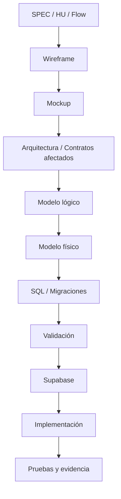
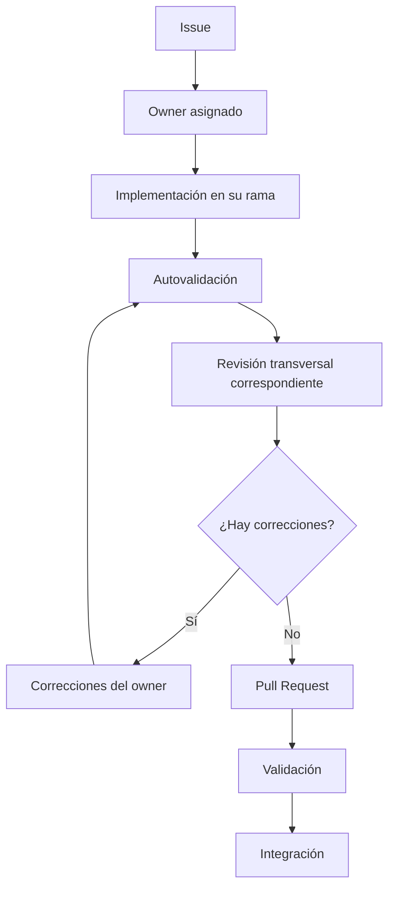
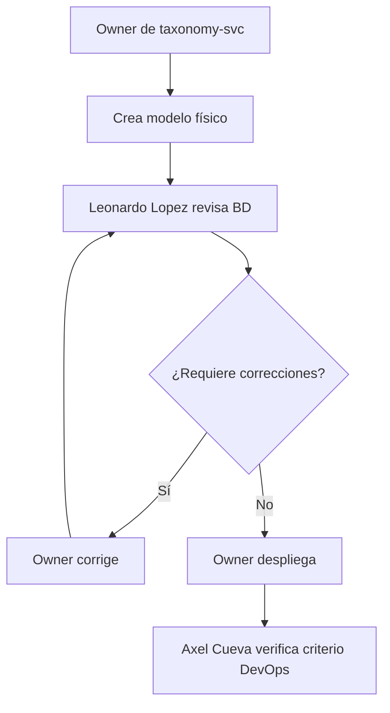

# Equipo y responsabilidades

## 1. Propósito

Este documento define la organización interna del equipo responsable del módulo **Productos y Ofertas**.

La organización distingue explícitamente dos tipos de responsabilidad:

| Tipo | Descripción |
|---|---|
| **Ownership funcional** | Responsabilidad directa sobre una funcionalidad, bounded context y sus artefactos asociados. |
| **Rol transversal** | Responsabilidad de definir criterios, revisar consistencia y acompañar al resto del equipo dentro de un área especializada. |

Un rol transversal **no reemplaza el ownership funcional**.

Cada integrante mantiene autonomía sobre las funcionalidades que tiene asignadas y es responsable de llevarlas desde la documentación hasta su implementación y validación.

---

## 2. Principio de autonomía

Cada owner funcional es responsable de evolucionar los artefactos asociados a sus funcionalidades cuando corresponda:

Los responsables transversales establecen estándares y realizan revisiones especializadas, pero no absorben automáticamente la ejecución del trabajo de los demás integrantes.

---

## 3. Equipo

| Integrante | Rama | Rol transversal | Ownership funcional |
|---|---|---|---|
| Marco Renato Castilla Huanca | `castilla` | Líder del módulo / QA documental y trazabilidad | Carga y exportación masiva; combos |
| Gabriel Poma Gutierrez | `poma` | Product Owner / Gobernanza funcional | Productos; variantes y SKU |
| Axel Andree Cueva Alcalá | `cueva` | Arquitectura de Software / DevOps | Cupones; promociones; cross-sell y upselling |
| Leonardo Lopez | `lopez` | Datos y Testing | Taxonomía; características; tipos de producto; marcas; SEO |
| Leonardo Vera Rodríguez | `vera` | UI/UX / Revisión UX transversal | Precios; auditoría de precios |
| Miguel Ángel Taco Zavala | `taco` | Backend / Integración API | Inventario; disponibilidad; dashboard y alertas |

---

## 4. Ownership por bounded context

La arquitectura del módulo define ocho bounded contexts.

| Bounded context | Responsable funcional | Funcionalidades |
|---|---|---|
| `bulk-svc` | Marco Castilla | 001 |
| `combos-svc` | Marco Castilla | 002 |
| `catalog-svc` | Gabriel Poma | 003-004 |
| `promotions-svc` | Axel Cueva | 005-007 |
| `taxonomy-svc` | Leonardo Lopez | 008-012 |
| `pricing-svc` | Leonardo Vera | 013 |
| `price-audit-svc` | Leonardo Vera | 014 |
| `inventory-svc` | Miguel Taco | 015-016 |

El owner del bounded context es responsable de mantener coherentes sus requisitos, modelo de datos, contratos, implementación y evidencia.

---

## 5. Responsabilidades transversales

### 5.1. Marco Renato Castilla Huanca

**Rol:** Líder del módulo y responsable de QA documental y trazabilidad.

Marco coordina la ejecución del módulo y mantiene la visión transversal del estado de los entregables.

Sus responsabilidades incluyen coordinar la distribución del trabajo mediante Issues, verificar que exista un owner claro para cada entregable, supervisar la trazabilidad entre requisitos e implementación, revisar la consistencia global de la documentación y comprobar que los criterios de terminado hayan sido satisfechos antes de considerar cerrado un entregable.

También coordina las correcciones transversales cuando una modificación afecta más de un bounded context o más de una capa documental.

Su responsabilidad de QA se concentra en **calidad global, trazabilidad y cumplimiento del proceso**. No sustituye las pruebas técnicas realizadas por cada owner ni la revisión especializada de Testing.

Marco no debe convertirse en autor obligatorio de todos los documentos ni en ejecutor de todas las correcciones.

---

### 5.2. Gabriel Poma Gutierrez

**Rol:** Product Owner y responsable de gobernanza funcional.

Gabriel vela por que las funcionalidades representen correctamente las necesidades de negocio y mantengan coherencia entre SPEC, historias de usuario, flujos y comportamiento esperado.

Es responsable de revisar cambios que modifiquen reglas de negocio, criterios de aceptación, comportamiento funcional o alcance.

Ante contradicciones funcionales entre documentos, coordina la resolución de la regla de negocio antes de propagar la modificación hacia contratos, interfaces o implementación.

El Product Owner no redacta obligatoriamente todas las SPEC ni aprueba cada modificación menor. El owner funcional continúa siendo responsable de su propia funcionalidad.

---

### 5.3. Axel Andree Cueva Alcalá

**Rol:** Arquitecto de Software y responsable DevOps.

Axel mantiene los lineamientos arquitectónicos transversales del módulo.

Es responsable de revisar decisiones que afecten bounded contexts, dependencias entre servicios, comunicación síncrona y asíncrona, persistencia, seguridad técnica, despliegue y configuración de infraestructura.

Para el Hito 2 define los lineamientos comunes de despliegue hacia Supabase y las convenciones necesarias para que los diferentes bounded contexts puedan desplegarse de forma consistente.

Cada owner continúa siendo responsable de preparar y desplegar los artefactos correspondientes a su dominio siguiendo esos lineamientos.

Axel no implementa ni despliega automáticamente los ocho bounded contexts.

---

### 5.4. Leonardo Lopez

**Rol:** Responsable transversal de Datos y Testing.

Leonardo define los criterios comunes para modelado e implementación de base de datos.

Su revisión cubre principalmente modelos lógicos y físicos, nombres y convenciones, claves y restricciones, integridad referencial interna al bounded context, índices cuando correspondan, migraciones, scripts SQL y validaciones de persistencia.

En Testing establece criterios comunes de pruebas y revisa especialmente los escenarios de integración y las validaciones técnicas necesarias antes del cierre.

Cada owner es responsable de crear el modelo físico, SQL, migraciones y pruebas correspondientes a sus propias funcionalidades.

Leonardo revisa esos artefactos y detecta inconsistencias, pero no construye las bases de datos de todos los servicios.

Los datos ficticios o de demostración no deben considerarse datos iniciales obligatorios del sistema. Los scripts de seed permanentes se reservan para información de configuración o catálogos realmente requeridos por la aplicación.

---

### 5.5. Leonardo Vera Rodríguez

**Rol:** Líder UI/UX y Revisor UX transversal.

Leonardo mantiene la coherencia visual y de experiencia de usuario del módulo.

Es responsable de los lineamientos UX transversales, UX Decisions, UX Guidelines y de la aplicación consistente del Design System correspondiente.

En el pipeline de mockups realiza la revisión UX transversal después de la autovalidación del owner funcional.

El visto bueno de UX es requisito para declarar un mockup **APROBADO PARA FIGMA**, según el pipeline definido en `mockups/README.md`.

Cada owner continúa siendo responsable de construir, refinar, normalizar y corregir los mockups correspondientes a sus funcionalidades.

Leonardo no sustituye a los owners funcionales ni debe convertirse en responsable de implementar personalmente las 16 funcionalidades.

---

### 5.6. Miguel Ángel Taco Zavala

**Rol:** Responsable Backend e Integración API.

Miguel vela por la viabilidad técnica de los contratos desde la perspectiva del backend y por su implementación consistente.

Revisa especialmente cambios en OpenAPI, AsyncAPI, modelos de request/response, códigos de error, idempotencia, integración entre servicios y correspondencia entre contratos publicados e implementación.

Cuando una funcionalidad modifica su contrato, el owner de la funcionalidad propone el cambio y Miguel realiza la revisión técnica transversal correspondiente.

La responsabilidad sobre Backend no implica desarrollar todos los servicios del módulo.

Cada owner mantiene la implementación correspondiente a su bounded context siguiendo los contratos y lineamientos compartidos.

---

## 6. Responsabilidad por tipo de artefacto

| Artefacto | Responsable de creación o modificación | Revisión transversal principal |
|---|---|---|
| SPEC / HU / Flow | Owner funcional | Gabriel Poma cuando cambia comportamiento de negocio |
| Wireframe | Owner funcional | Leonardo Vera cuando afecta UX transversal |
| Mockup | Owner funcional | Leonardo Vera |
| Arquitectura / C4 | Axel Cueva con participación del dominio afectado | Owners afectados |
| OpenAPI / AsyncAPI | Owner del dominio afectado | Miguel Taco |
| Contrato de integración | Owner del dominio afectado | Miguel Taco + Axel Cueva cuando afecta arquitectura |
| Modelo lógico | Owner del bounded context | Leonardo Lopez |
| Modelo físico | Owner del bounded context | Leonardo Lopez |
| SQL / migraciones | Owner del bounded context | Leonardo Lopez |
| Despliegue Supabase | Owner del bounded context | Axel Cueva |
| Pruebas de la funcionalidad | Owner funcional | Leonardo Lopez para criterios transversales e integración |
| Evidencias y trazabilidad | Owner del artefacto | Marco Castilla |
| UX Decisions / UX Guidelines | Leonardo Vera | Owners funcionales afectados |

No todas las revisiones deben convertirse en bloqueos simultáneos.

Solo debe solicitarse la revisión transversal correspondiente al tipo de cambio realizado.

---

## 7. Flujo de trabajo

El mecanismo principal para asignar trabajo concreto es **GitHub Issues**.

Marco puede realizar la distribución inicial de trabajo mediante Issues, especialmente para entregables del hito o cambios transversales.

El owner puede descomponer posteriormente el trabajo en tareas menores cuando sea necesario.

El documento de responsabilidades define **quién responde por cada área**; los Issues definen **qué trabajo concreto debe hacerse**.

---

## 8. Regla de revisión

Una revisión transversal no transfiere ownership.

Por ejemplo:

El revisor identifica problemas, valida estándares y solicita correcciones.

Salvo que exista un Issue explícitamente reasignado, las correcciones continúan siendo responsabilidad del owner original.

---

## 9. Definition of Done organizacional

Un entregable puede considerarse terminado cuando existe un owner identificable, el artefacto correspondiente está versionado, el responsable realizó su autovalidación, se completó la revisión transversal requerida por el tipo de artefacto, los hallazgos bloqueantes fueron corregidos y existe evidencia trazable en GitHub.

La Definition of Done específica de cada artefacto puede establecer condiciones adicionales.

En particular, los mockups mantienen la Definition of Done definida en `mockups/README.md`.

---

## 10. Fuentes relacionadas

La asignación funcional detallada de las 16 funcionalidades se mantiene en:

[`wireframes/INDEX.md`](wireframes/INDEX.md)

La gobernanza del pipeline de mockups se mantiene en:

[`mockups/README.md`](mockups/README.md)

Las responsabilidades y límites técnicos de los bounded contexts se mantienen en:

[`Arquitectura.md`](Arquitectura.md)

El ownership de integración se mantiene en:

[`Contrato_Api.md`](Contrato_Api.md)

El ownership conceptual de datos se mantiene en:

[`Modelo_Conceptual.md`](Modelo_Conceptual.md)

Este documento gobierna exclusivamente la **organización y responsabilidades internas del equipo**.
