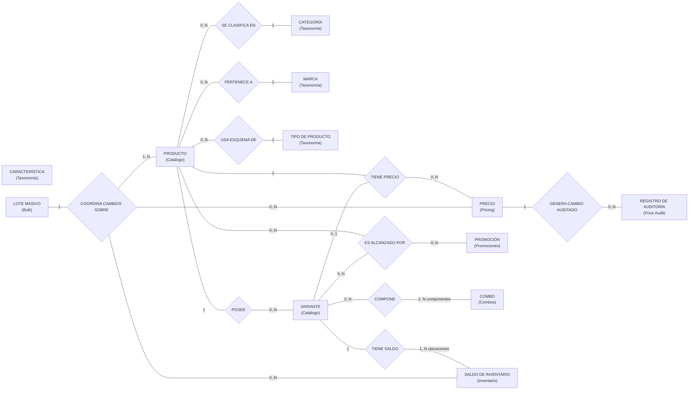
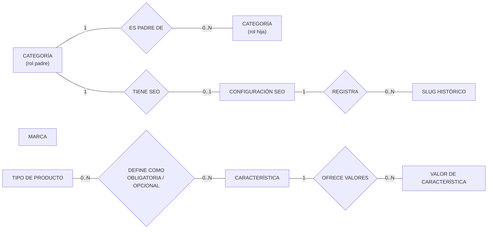
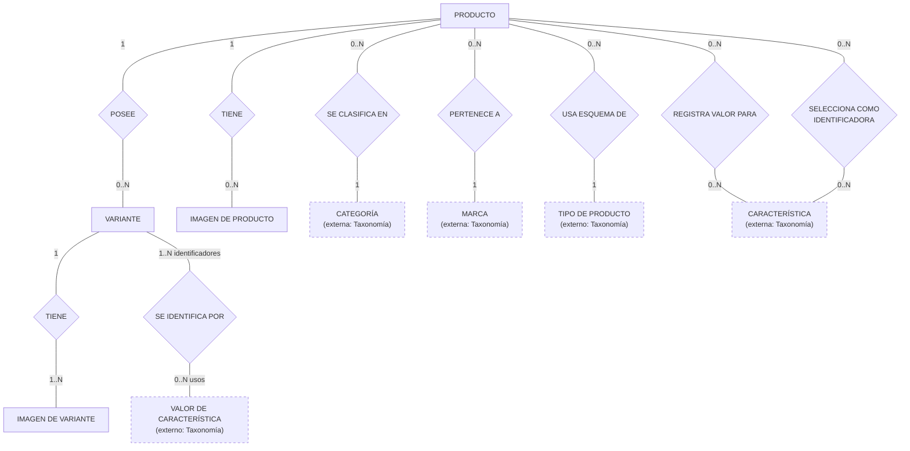
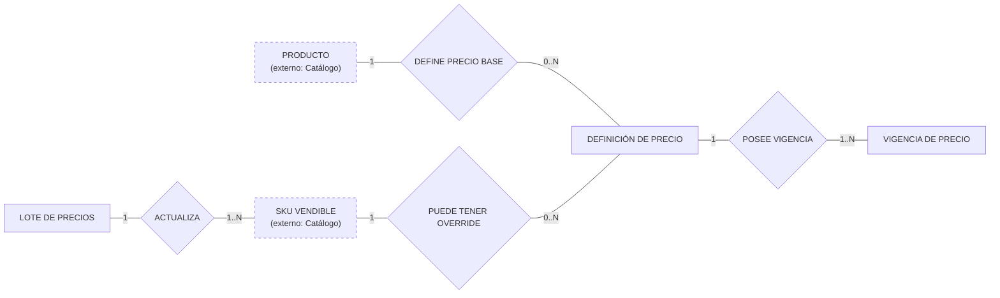
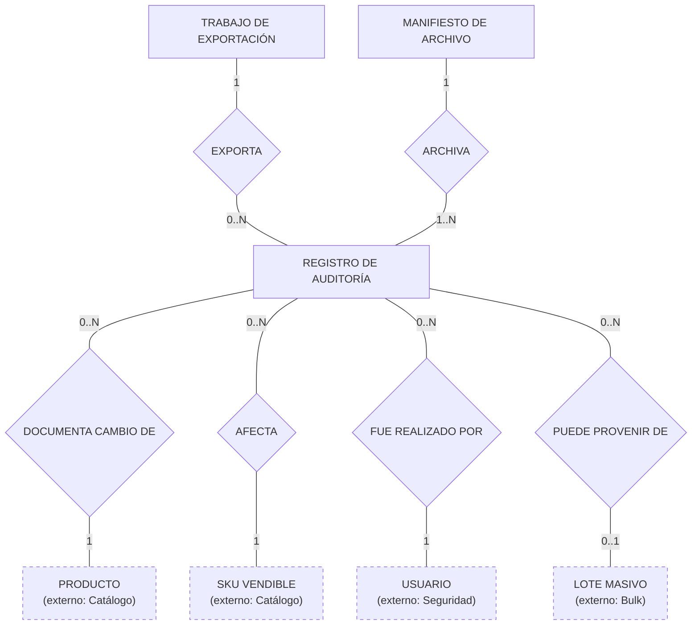
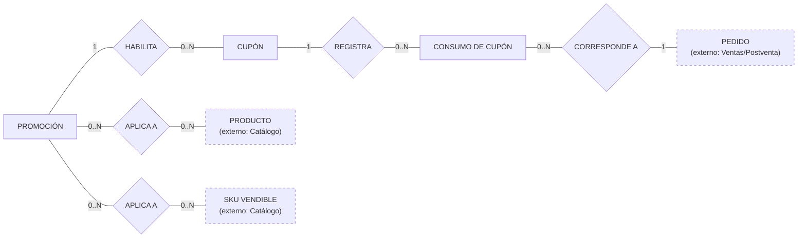
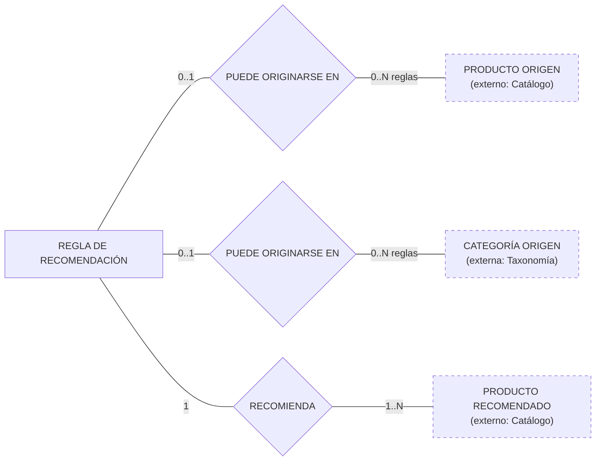
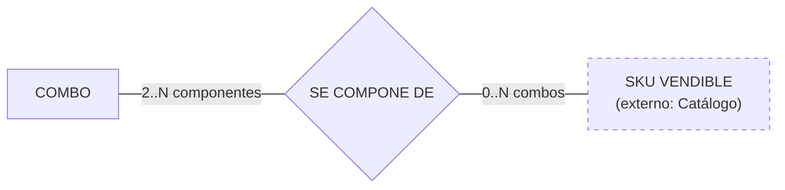
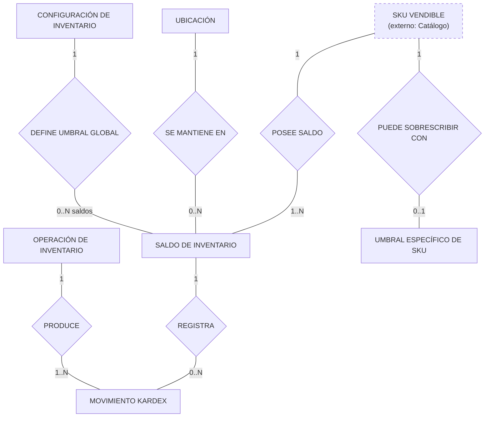
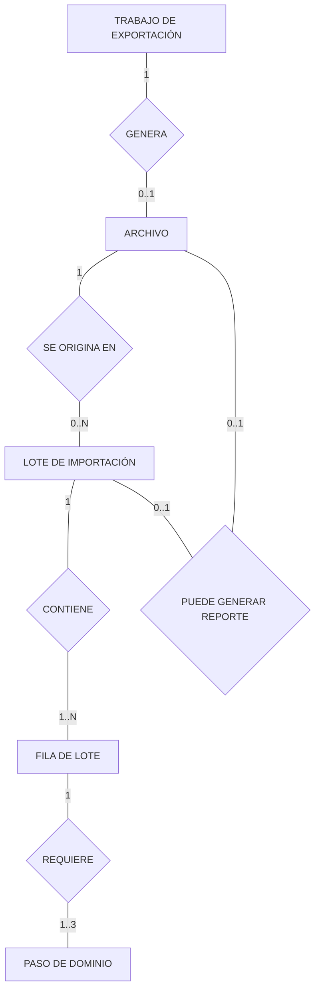

# Modelos conceptuales de datos — Módulo de Productos y Ofertas

**Fecha:** 2026-09-23  
**Repositorio:** `Taller-SW-Web/Productos-y-Ofertas-docs`  
**Ruta recomendada:** `architecture/modelos-conceptuales-datos.md`  
**Arquitectura de referencia:** `architecture/arquitectura-modulo-productos-ofertas.md`

> **Alcance:** este documento define los **modelos conceptuales de datos** de los ocho bounded contexts/microservicios de negocio del módulo Productos y Ofertas y analiza si existe alguna necesidad de compartir esquemas PostgreSQL entre ellos.

---


# 2. Modelo conceptual interdominio

Las relaciones interdominio **no implican foreign keys cross-schema**.



> **Interpretación:** las relaciones son conceptuales. En persistencia distribuida, el contexto consumidor conserva únicamente identificadores externos, snapshots o proyecciones que necesita. No se crean FK PostgreSQL entre estos rectángulos cuando pertenecen a schemas distintos.

---

# 3. `taxonomy-svc` — Modelo conceptual

## 3.1 Responsabilidad de datos

Taxonomía es autoridad de:

- categorías y jerarquía;
- marcas;
- características;
- valores de características `LISTA`;
- tipos de producto ligeros;
- asociación Tipo de Producto–Característica;
- obligatoriedad de la asociación;
- SEO de categoría;
- historial de slugs.

Las categorías **no** definen ni heredan características.

## 3.2 Diagrama conceptual



### 3.3 Observaciones conceptuales

1. `CATEGORÍA (padre)` y `CATEGORÍA (hija)` son **roles de la misma entidad**, no dos tablas diferentes.
2. Una categoría puede ser raíz; por tanto su padre es opcional.
3. Una característica `LISTA` puede poseer múltiples valores; `TEXTO` y `NUMERO` no necesitan filas de valores enumerados.
4. Tipo de Producto y Característica forman una relación N:M.
5. La propiedad `OBLIGATORIA | OPCIONAL` pertenece a esa relación, no a Característica globalmente.
6. Marca queda intencionalmente sin relación interna en este diagrama: la asociación Marca→Producto pertenece a Catálogo.
7. SEO es de **categoría**, no de producto.
8. El slug de producto no aparece porque pertenece a Catálogo.

### 3.4 Consecuencia para el modelo lógico

Relaciones que probablemente se materializarán como tabla:

- `product_type_characteristics` ← relación `DEFINE COMO OBLIGATORIA / OPCIONAL`.
- jerarquía de categorías ← FK interna autorreferenciada dentro de `taxonomy`.
- `characteristic_values`.
- `category_seo`.
- `slug_history`.

No debe existir:

```text
category_characteristics
```

porque la documentación actual separa completamente navegación y esquema de atributos.

---

# 4. `catalog-svc` — Modelo conceptual

## 4.1 Responsabilidad de datos

Catálogo es autoridad de:

- producto;
- `sku_base`;
- estado del producto;
- slug del producto;
- variantes;
- `variant_id`;
- SKU comercial de variante;
- imágenes;
- valores de atributos registrados;
- selección de características identificadoras por producto con variantes.

Categoría, Marca, Tipo de Producto, Característica y Valor de Característica pertenecen a Taxonomía.

## 4.2 Diagrama conceptual



### 4.3 Observaciones conceptuales

1. Un producto puede no tener variantes o tener muchas.
2. Cuando `tiene_variantes=false`, `sku_base` es también el SKU vendible.
3. Cuando `tiene_variantes=true`, el producto padre no tiene stock propio.
4. Una variante pertenece exactamente a un producto.
5. `variant_id` y SKU comercial son identidades distintas.
6. El producto puede existir en BORRADOR sin imágenes.
7. La variante requiere imagen propia en el flujo de creación.
8. `REGISTRA VALOR PARA` representa valores de atributos de producto; en el lógico se materializará una estructura de valores tipados.
9. `SELECCIONA COMO IDENTIFICADORA` pertenece al producto con variantes y se fija antes de crear la primera variante.
10. `SE IDENTIFICA POR` usa valores LISTA estables de Taxonomía.
11. Ninguna relación a Taxonomía implica FK cross-schema.

### 4.4 Refinamiento importante respecto de la arquitectura

La lista física preliminar de la arquitectura debe contemplar, en el modelo lógico, una persistencia para:

```text
product_identifying_characteristics
```

o equivalente.

Esta asociación es necesaria porque SPEC-003/SPEC-004 establecen que un producto con variantes selecciona previamente un conjunto de características LISTA identificadoras que queda inmutable desde la primera variante.

---

# 5. `pricing-svc` — Modelo conceptual

## 5.1 Responsabilidad de datos

Pricing es autoridad de:

- precio regular;
- precio de oferta opcional;
- moneda;
- canal/scope;
- vigencias;
- programación futura;
- historial temporal/as-of;
- versión de precio;
- carga masiva exclusiva de precios.

Producto y SKU pertenecen a Catálogo.

## 5.2 Diagrama conceptual



### 5.3 Restricción XOR conceptual

Cada definición de precio tiene como objetivo:

- **un Producto**, para precio base/fallback; **o**
- **un SKU**, para override;

pero no ambos simultáneamente.

Ese XOR debe formalizarse en el modelo lógico.

### 5.4 Vigencias

`VIGENCIA DE PRECIO` representa:

- precio regular u oferta;
- periodo temporal;
- moneda;
- scope de canal;
- estado programado/vigente/histórico.

### 5.5 Carga masiva propia

`LOTE DE PRECIOS` se relaciona con múltiples SKU. En el modelo lógico, la relación `ACTUALIZA` requerirá una entidad/fila de lote para:

- estado de fila;
- error;
- `price_version`;
- acción de oferta;
- resultado.

---

# 6. `price-audit-svc` — Modelo conceptual

## 6.1 Responsabilidad de datos

Price Audit es autoridad únicamente de la bitácora append-only, exportaciones y archivado de dicha bitácora.

No es autoridad de Precio, Producto, SKU, Usuario ni lote Bulk.

## 6.2 Diagrama conceptual



### 6.3 Razón para NO compartir el schema `pricing`

Aunque Auditoría nace de eventos de Pricing, mantener `price_audit` separado permite:

- privilegios append-only específicos;
- retención distinta;
- exportaciones pesadas sin interferir con la escritura de precios;
- archivado independiente;
- deduplicación por `event_id`;
- impedir que una operación de auditoría modifique accidentalmente el precio vigente.

La relación se mantiene mediante `pricing.price.changed`, no mediante FK a `pricing`.

---

# 7. `promotions-svc` — Modelo conceptual

## 7.1 Responsabilidad de datos

Este bounded context reúne:

- promociones;
- alcance por Producto/SKU;
- política granular de combinación;
- cupones;
- consumos de cupón;
- reglas Cross-sell;
- reglas Upsell.

Producto, SKU y Categoría pertenecen a otros dominios.

## 7.2 Promociones y cupones



### 7.3 Recomendaciones Cross-sell / Upsell



### 7.4 Restricciones conceptuales

1. Una regla tiene **un solo tipo de origen**: Producto **o** Categoría.
2. Una regla recomienda uno o varios productos.
3. El orden del recomendado y, para Upsell, el criterio de superioridad pertenecen a la relación `RECOMIENDA`.
4. Una promoción puede aplicar a productos completos, SKU específicos o ambos.
5. Si el mismo SKU queda cubierto por ambas vías, la evaluación lo deduplica.
6. El descuento, vigencia y alcance pertenecen a Promoción, no a Cupón.
7. Cupón referencia una promoción en modalidad CUPÓN.
8. El consumo de cupón se correlaciona con un pedido externo, sin FK al schema de Ventas.

### 7.5 Consecuencia lógica

Probables tablas asociativas:

```text
promotion_scopes
recommendation_items
```

`combination_policy` puede implementarse como:

- columnas/value object dentro de `promotions`; o
- tabla 1:1;

pero conceptualmente no necesita ser una entidad independiente porque no tiene ciclo de vida autónomo frente a Promoción.

---

# 8. `combos-svc` — Modelo conceptual

## 8.1 Responsabilidad de datos

Combos es autoridad de:

- definición del combo;
- composición;
- cantidades requeridas;
- precio propio del combo;
- estado;
- versión/snapshot de composición;
- disponibilidad proyectada no vinculante.

No es autoridad de Producto, SKU, Precio ni Stock.

## 8.2 Diagrama conceptual



### 8.3 Interpretación de la relación

La relación `SE COMPONE DE` tiene información propia, principalmente:

- cantidad requerida del SKU;
- orden/snapshot si se decide persistirlo.

En el modelo lógico la relación se materializará como:

```text
combo_items
```

### 8.4 Proyección de componentes

`component_projection` no es una nueva entidad maestra.

Es una **réplica/proyección local no autoritativa** de datos de:

- Catálogo;
- Pricing;
- Inventario.

Puede persistirse para latencia, pero:

- no crea ownership;
- no recibe FK a schemas externos;
- puede reconstruirse desde eventos/contratos.

---

# 9. `inventory-svc` — Modelo conceptual

## 9.1 Responsabilidad de datos

Inventario es autoridad de:

- saldo por SKU + ubicación;
- movimientos;
- idempotencia de operaciones;
- Kardex;
- umbral global;
- override de umbral por SKU;
- dashboard operativo de Inventario.

SKU pertenece a Catálogo.

## 9.2 Diagrama conceptual



### 9.3 Cardinalidad del saldo

Cada `SALDO DE INVENTARIO` pertenece a:

- exactamente un SKU;
- exactamente una Ubicación.

Un mismo SKU puede tener varios saldos porque puede existir en varias ubicaciones.

La unicidad lógica será:

```text
(SKU, location_id)
```

### 9.4 Operaciones y Kardex

Una operación idempotente de Inventario puede afectar una o varias líneas/saldos, por ejemplo un pedido con varios SKU.

Por eso:

```text
OPERACIÓN DE INVENTARIO 1 → N MOVIMIENTOS KARDEX
```

y cada movimiento afecta un saldo concreto.

Esta estructura permite:

- `reserve`;
- `release`;
- `consume`;
- ajuste masivo;
- compensación;
- devolución aceptada.

### 9.5 Dashboard

WF-016 pertenece al mismo bounded context de Inventario.

No necesita otro schema.

Puede:

- consultar directamente el modelo de Inventario; o
- utilizar una proyección/materialized view propia del mismo schema si el volumen lo exige.

No se crea un microservicio o schema separado solo para Dashboard.

---

# 10. `bulk-svc` — Modelo conceptual

## 10.1 Responsabilidad de datos

Bulk persiste el **proceso**, no una copia maestra de Catálogo, Pricing o Inventario.

Debe poder reconstruir:

- qué archivo originó un lote;
- qué filas contiene;
- estado de cada fila;
- qué dominios debía ejecutar;
- qué dominios ya confirmaron;
- qué dominio falló;
- si requiere conciliación;
- trabajos de exportación;
- archivos resultantes.

## 10.2 Diagrama conceptual



### 10.3 Paso de dominio

Cada fila puede requerir pasos sobre:

- Catálogo;
- Pricing;
- Inventario.

`PASO DE DOMINIO` permite registrar de forma durable:

- pendiente;
- aplicado;
- rechazado;
- reintentable;
- error;
- reconciliación.

Los dominios no se modelan como FK a sus bases. El paso solo conserva el nombre/identificador del dominio y correlación de la operación.

### 10.4 Razón para no leer schemas externos

Aunque una exportación necesita combinar Catálogo, Precio y Stock, Bulk no debe hacer:

```sql
SELECT ...
FROM catalog.products
JOIN pricing.prices ...
JOIN inventory.stock_balance ...
```

Debe solicitar la información a sus propietarios mediante los contratos definidos y construir el archivo desde resultados correlacionados.

---

# 11. `api-gateway` / BFF — Read model auxiliar

El gateway no es un bounded context de negocio, por lo que **no se propone un modelo conceptual de dominio equivalente a los ocho anteriores**.

Su schema `read_model` es deliberadamente denormalizado y derivado.

Puede contener proyecciones como:

```text
product_listing
product_detail_view
combo_view
operation_status
event_offsets
```

Reglas:

1. ninguna proyección es autoridad de negocio;
2. puede eliminarse y reconstruirse;
3. no tiene FK hacia schemas de dominio;
4. recibe eventos y conserva `source_version`/`as_of`;
5. nunca autoriza una escritura crítica usando únicamente una proyección posiblemente obsoleta.

---

# 12. Entidades técnicas comunes

Todos los microservicios que publiquen o consuman mensajes pueden necesitar:

```text
outbox
inbox
```

Además, algunos bounded contexts requieren persistencia técnica especializada:

| Servicio | Persistencia técnica posible |
|---|---|
| Taxonomía | operaciones de baja segura |
| Catálogo | barreras de entidades maestras, checks de activación |
| Pricing | jobs de activación programada |
| Price Audit | jobs de exportación y manifests de archivo |
| Promociones | proyecciones de catálogo/precio/stock |
| Combos | proyección de componentes/precio/stock |
| Inventario | idempotencia de operaciones y proyección/dashboard |
| Bulk | reintentos, conciliación y manifiestos de archivos |
| BFF | offsets de eventos y estado de proyección |

Estas tablas son de infraestructura/aplicación. No deben convertirse en relaciones de dominio artificiales.

---

# 13. Matriz de ownership de schemas

| Schema | Owner exclusivo | Puede escribir | Puede leer directamente |
|---|---|---|---|
| `taxonomy` | `taxonomy-svc` | `taxonomy-svc` | `taxonomy-svc` |
| `catalog` | `catalog-svc` | `catalog-svc` | `catalog-svc` |
| `pricing` | `pricing-svc` | `pricing-svc` | `pricing-svc` |
| `price_audit` | `price-audit-svc` | `price-audit-svc` | `price-audit-svc` |
| `promotions` | `promotions-svc` | `promotions-svc` | `promotions-svc` |
| `combos` | `combos-svc` | `combos-svc` | `combos-svc` |
| `inventory` | `inventory-svc` | `inventory-svc` | `inventory-svc` |
| `bulk` | `bulk-svc` | `bulk-svc` | `bulk-svc` |
| `read_model` | `api-gateway` | `api-gateway`/projectores propios | `api-gateway` |

> Si todos viven en una sola instancia PostgreSQL, esta matriz debe implementarse con roles y `GRANT/REVOKE`. El hecho de que PostgreSQL permita un `JOIN` cross-schema no significa que arquitectónicamente esté permitido.

---

# 14. Relaciones conceptuales que se convertirán en tablas asociativas

Este punto es importante para no confundir el modelo conceptual con el modelo lógico.

| Relación conceptual | Cardinalidad | Posible materialización lógica |
|---|---:|---|
| Tipo de Producto — DEFINE — Característica | N:M | `product_type_characteristics` |
| Producto — SELECCIONA COMO IDENTIFICADORA — Característica | N:M | `product_identifying_characteristics` |
| Producto — REGISTRA VALOR PARA — Característica | N:M | `product_attribute_values` |
| Variante — SE IDENTIFICA POR — Valor de Característica | N:M | `variant_attribute_values` |
| Promoción — APLICA A — Producto/SKU | N:M | `promotion_scopes` |
| Regla de recomendación — RECOMIENDA — Producto | N:M | `recommendation_items` |
| Combo — SE COMPONE DE — SKU | N:M | `combo_items` |
| SKU + Ubicación — define — Saldo de Inventario | asociación con estado | `stock_balance` |
| Lote de precios — ACTUALIZA — SKU | N:M procesal | `bulk_price_rows` o equivalente |
| Trabajo de exportación — EXPORTA — registros | selección procesal | job + filtros/artefacto, no necesariamente FK N:M |

Los nombres son propuestas para el **siguiente modelo lógico**; no son todavía contrato físico definitivo.

---

# 15. Foreign keys: dónde sí y dónde no

## 15.1 FK permitidas

Solo dentro del mismo schema/owner, por ejemplo:

```text
catalog.variants -> catalog.products
taxonomy.characteristic_values -> taxonomy.characteristics
taxonomy.slug_history -> taxonomy.category_seo
promotions.coupon_uses -> promotions.coupons
combos.combo_items -> combos.combos
inventory.kardex -> inventory.stock_balance
bulk.batch_rows -> bulk.batch_jobs
```

## 15.2 FK prohibidas arquitectónicamente

No crear:

```text
catalog.products.categoria_id
  FK -> taxonomy.categories.id

pricing.prices.sku
  FK -> catalog.variants.sku

inventory.stock_balance.sku
  FK -> catalog.variants.sku

promotions.promotion_scopes.product_id
  FK -> catalog.products.id

combos.combo_items.sku
  FK -> catalog.variants.sku

price_audit.price_audit_log.price_id
  FK -> pricing.prices.id
```

Esos campos pueden almacenar IDs externos, pero su integridad distribuida se mantiene mediante:

- validación de contrato;
- APIs autoritativas;
- eventos;
- proyecciones;
- barreras;
- procesos de reconciliación.

---

# 16. Datos compartidos que deben ser contrato, no tabla compartida

Algunos valores aparecen en varios servicios pero no justifican un schema común:

| Dato | Estrategia |
|---|---|
| `product_id` | identificador opaco de Catálogo |
| `variant_id` | identificador opaco de Catálogo; no sustituye SKU |
| SKU comercial | identificador de integración emitido/validado por Catálogo |
| `categoria_id` | identificador opaco de Taxonomía |
| `marca_id` | identificador opaco de Taxonomía |
| `tipo_producto_id` | identificador opaco de Taxonomía |
| `caracteristica_id` / `valor_id` | identificadores opacos de Taxonomía |
| `channel_id` | contrato/enumeración compartida, no tabla de Pricing |
| moneda | código estándar/contrato |
| `user_id` | identidad externa de Seguridad y Usuarios |
| `order_id` | identidad externa de Ventas/Postventa |
| `batch_id` | identidad de Bulk transportada a eventos de Pricing/Auditoría |
| `location_id` | autoridad de Inventario |

Los tipos TypeScript/JSON Schema de estos identificadores pueden vivir en:

```text
libs/contracts/
```

pero esa librería no debe exportar entidades ORM ni repositorios.

---

# 17. Proyecciones locales y duplicación permitida

La arquitectura de microservicios **sí permite duplicar datos**, siempre que se marque quién es el owner.

Ejemplos válidos:

- Promociones conserva una proyección mínima de productos/SKU/precios/stock para evaluación.
- Combos conserva una proyección de componentes y disponibilidad.
- BFF conserva una ficha comercial agregada.
- Dashboard de Inventario puede materializar agregados del propio Inventario.
- Auditoría conserva el snapshot del cambio de precio recibido en el evento.

Regla:

```text
duplicar para leer ≠ compartir ownership
```

Una proyección:

- es reconstruible;
- no autoriza mutaciones sobre el dominio origen;
- lleva versión/timestamp cuando sea relevante;
- se actualiza mediante eventos o sincronización explícita.

---

# 18. Transacciones: límite correcto

## 18.1 ACID local

Debe existir dentro de un servicio cuando protege una invariante local.

Ejemplos:

- Producto + última Variante activa.
- Saldo + Kardex + Outbox de Inventario.
- Contador global + contador por cliente + consumo idempotente de Cupón.
- Precio + vigencia + Outbox.
- Estado de fila + paso de dominio en Bulk.

## 18.2 No ACID distribuido

No deben existir transacciones SQL únicas que incluyan:

```text
catalog + pricing
catalog + inventory
pricing + audit
promotions + inventory
bulk + catalog + pricing + inventory
```

La consistencia interdominio es:

- eventual;
- idempotente;
- correlacionada;
- basada en comandos/resultados/eventos;
- conciliable ante fallos parciales.

---

# 19. Conclusión

Los modelos conceptuales confirman la descomposición de la arquitectura:

1. Los ocho bounded contexts poseen **modelos de datos cohesionados internamente**.
2. Las referencias entre dominios son numerosas, pero ninguna exige compartir tablas.
3. Una sola instancia PostgreSQL/Supabase puede alojar todos los schemas por economía, siempre que el aislamiento sea real mediante roles y permisos.
4. No deben existir FK ni joins cross-schema entre bounded contexts.
5. Taxonomía y Catálogo necesitan una relación estrecha funcionalmente, pero no una base compartida.
6. Pricing y Price Audit deben permanecer separados por inmutabilidad, seguridad, carga y retención.
7. Promociones/Cupones/Recomendaciones sí deben permanecer juntas porque comparten política comercial y consumo.
8. Inventario y su Dashboard pertenecen al mismo modelo; separar el Dashboard en otra base añadiría duplicación sin un bounded context nuevo.
9. Bulk debe persistir únicamente su workflow y coordinación, no replicar las tablas maestras de los otros tres dominios.
10. El BFF usa un read model separado y reconstruible; no es fuente de verdad.
11. Las relaciones N:M identificadas en este documento servirán como base directa del siguiente **modelo lógico relacional**.

---

# 20. Siguiente nivel recomendado

El siguiente artefacto debería ser:

```text
architecture/modelos-logicos-datos.md
```

y para cada schema especificar:

- tablas;
- columnas;
- PK;
- FK **solo internas**;
- claves únicas;
- nullable/no nullable;
- tablas asociativas;
- constraints;
- índices;
- versionado optimista;
- tablas Outbox/Inbox;
- reglas de borrado lógico;
- particionamiento/retención cuando aplique.

El modelo lógico debe derivarse de estos diagramas conceptuales, no al revés.
