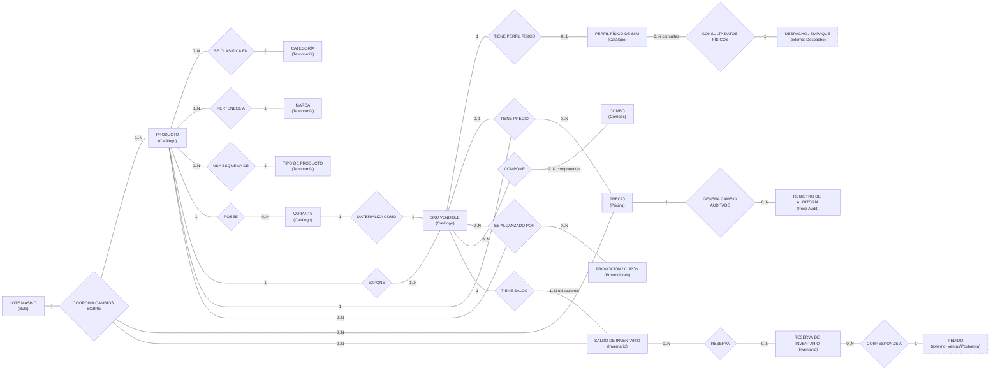
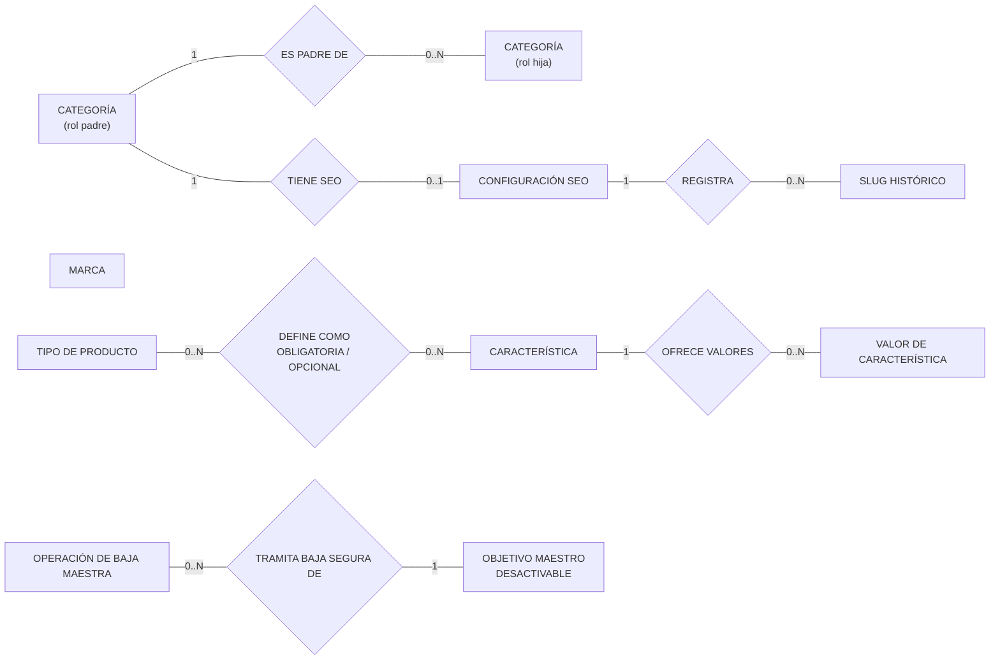
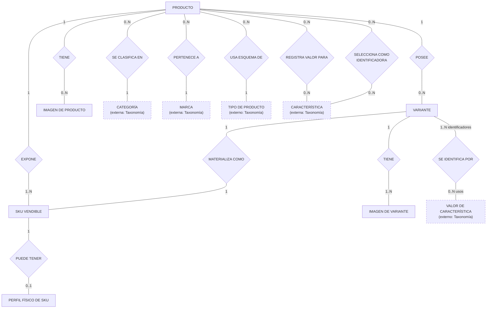
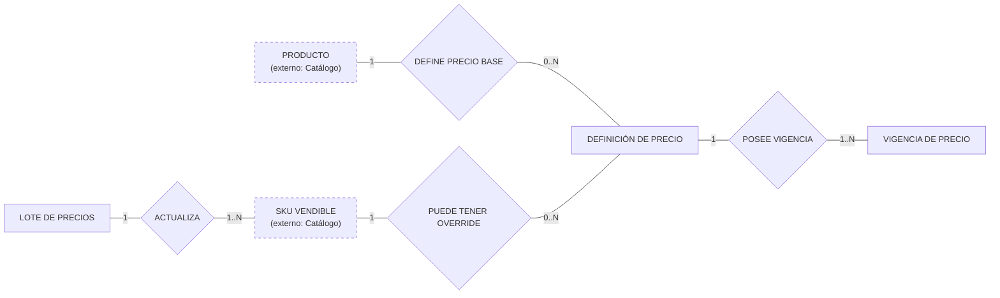
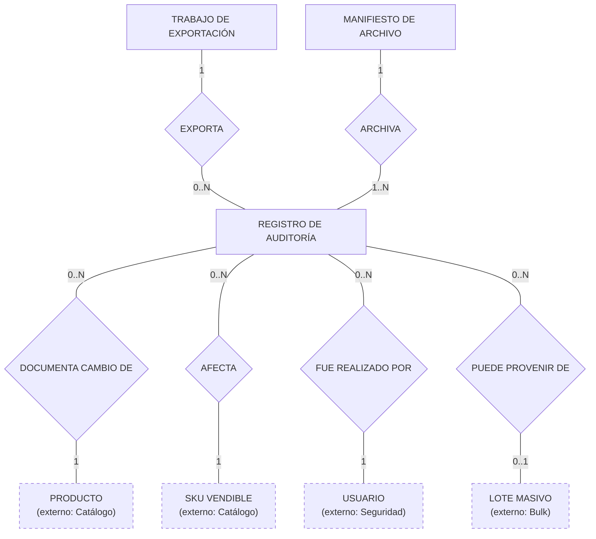
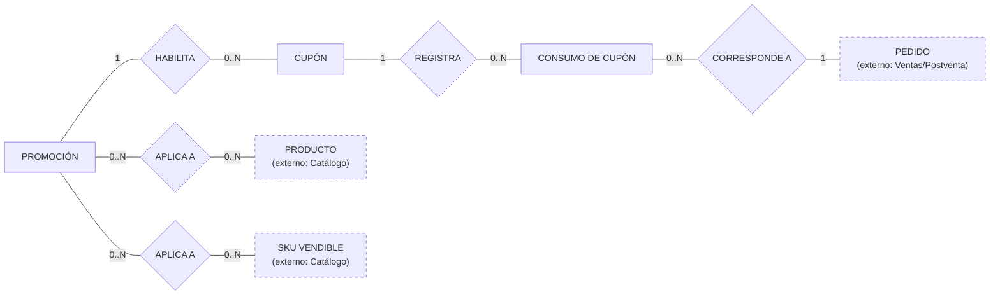
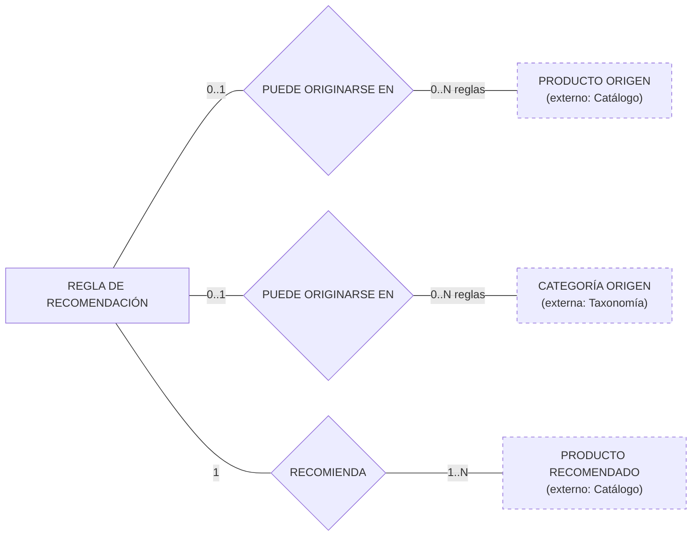
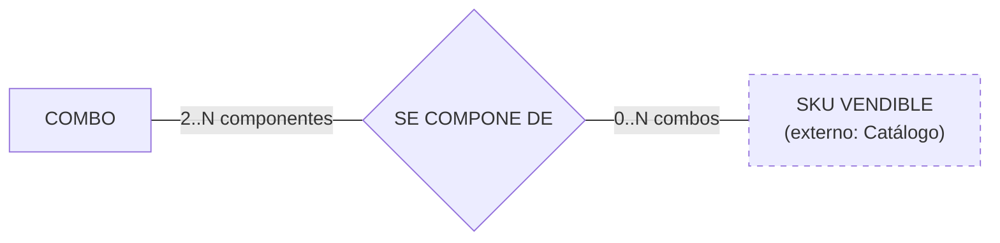
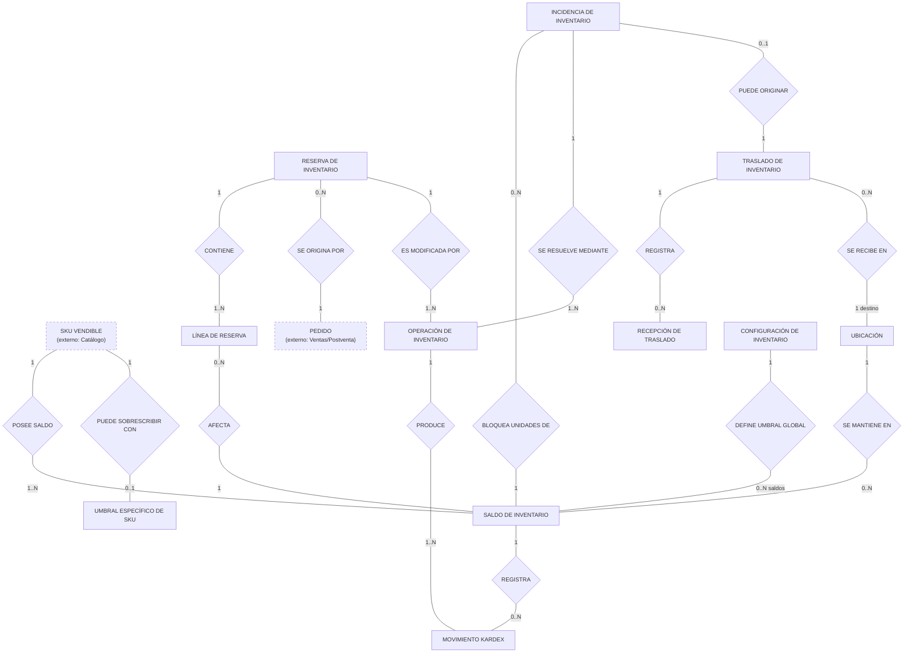
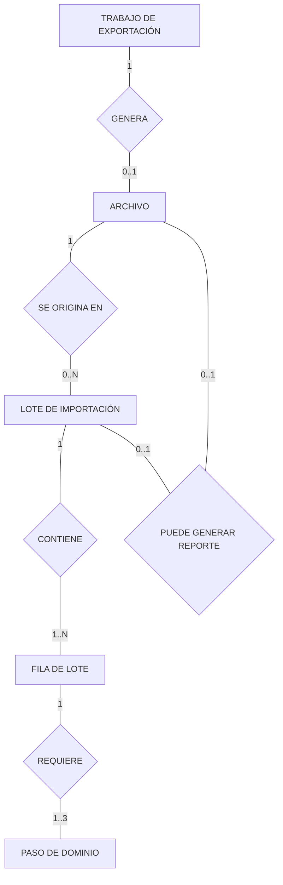

# Modelos conceptuales de datos — Módulo de Productos y Ofertas

**Fecha de actualización:** 2026-10-01  
**Repositorio:** `Taller-SW-Web/Productos-y-Ofertas-docs`  
**Archivo:** `Modelo_Conceptual.md`  
**Arquitectura de referencia:** `Arquitectura.md`  
**Contrato HTTP de referencia:** `api/openapi.yaml` (`0.4.0`)  
**Contrato asíncrono de referencia:** `asyncapi/asyncapi.yaml` (`0.4.0`)  
**Catálogo de errores:** `api/catalogo-errores.md` (`0.4.0`)  
**Catálogo de eventos:** `api/catalogo-eventos.md` (`0.4.0`)  
**Contrato humano de referencia:** `Contrato_Api.md`

> **Alcance:** este documento define los modelos conceptuales de datos de los ocho bounded contexts del módulo Productos y Ofertas.  
> Las relaciones entre bounded contexts son conceptuales y **no implican foreign keys ni acceso directo cross-schema**.

---

# 0. Convención de modelado conceptual

Los diagramas usan notación Chen simplificada sobre Mermaid `flowchart`:

- Rectángulo → entidad o concepto.
- Rombo → relación.
- Borde discontinuo → concepto cuyo ownership pertenece a otro bounded context o módulo.
- Las etiquetas de las líneas expresan cardinalidad.
- No se muestran PK, FK, tipos SQL ni atributos físicos salvo cuando una sección textual los utiliza para explicar una regla.

Cardinalidades canónicas:

| Notación | Significado |
|---|---|
| `1` | exactamente uno |
| `0..1` | cero o uno |
| `1..N` | uno o muchos |
| `0..N` | cero o muchos |
| `2..N` | dos o muchos |
| `1..3` | entre uno y tres |

No utilizar variantes como `0.N`, `1.N`, `0.1`, `2.N` o `1.3` en los diagramas.

---

# 1. Decisiones del modelo conceptual

Esta versión incorpora las decisiones de diseño del modelo de datos:

1. **Inventario pertenece a Productos y Ofertas**.
2. Marketplace y Chatbot solo consultan disponibilidad; Retail además reporta/resuelve incidencias físicas sin convertirse en owner del saldo.
3. **Ventas/Postventa orquesta inventario comercial**:
   - pedido `CREADO` → reserva;
   - pedido `PAGADO` → consumo definitivo;
   - `PAGO_NO_COMPLETADO` o anulación pre-consumo → liberación;
   - retorno físicamente reintegrable → reintegro;
   - venta Retail offline registrada → conciliación.
4. La reserva tiene expiración configurable.
5. Los datos físicos propios de una unidad vendible se modelan por **SKU**.
6. Productos y Ofertas es owner de:
   - peso;
   - dimensiones físicas propias del SKU.
7. **Despacho es owner del empaque**, agrupación logística y volumen operativo final.
8. Productos y Ofertas no modela `tipoEmpaque` como atributo propio del producto/SKU.
9. `SPEC/HU/WF-003`, `004` y `015` ya incorporan estas decisiones; dejan de ser propagaciones futuras.
10. La idempotencia de Inventario distingue retry legítimo de `IDEMPOTENCY_CONFLICT`.
11. Los contratos HTTP/asíncronos y códigos estables ya están publicados en OpenAPI, AsyncAPI y `catalogo-errores.md`.
12. OpenAPI y AsyncAPI `0.4.0` constituyen el baseline contractual vigente de este modelo.
13. Taxonomía expone operaciones observables de **baja maestra segura** para recursos con dependencias.
14. Una operación de baja maestra puede permanecer pendiente después de un `202 Accepted`; su resultado definitivo se resuelve de forma asíncrona.
15. La operación de baja pertenece a Taxonomía y no implica acceso directo a las tablas del bounded context consumidor.
16. El actor humano canónico de administración del módulo es `GESTOR_COMERCIAL`; capacidades de auditoría o inventario no crean roles globales adicionales.

---

# 2. Modelo conceptual interdominio


```mermaid
flowchart LR
  CAT["CATEGORÍA<br/>(Taxonomía)"]
  BRAND["MARCA<br/>(Taxonomía)"]
  TYPE["TIPO DE PRODUCTO<br/>(Taxonomía)"]

  PRODUCT["PRODUCTO<br/>(Catálogo)"]
  VARIANT["VARIANTE<br/>(Catálogo)"]
  SKU["SKU VENDIBLE<br/>(Catálogo)"]
  PHYSICAL["PERFIL FÍSICO DE SKU<br/>(Catálogo)"]

  PRICE["PRECIO<br/>(Pricing)"]
  PROMO["PROMOCIÓN / CUPÓN<br/>(Promociones)"]
  COMBO["COMBO<br/>(Combos)"]

  STOCK["SALDO DE INVENTARIO<br/>(Inventario)"]
  RESERVATION["RESERVA DE INVENTARIO<br/>(Inventario)"]

  AUDIT["REGISTRO DE AUDITORÍA<br/>(Price Audit)"]
  BATCH["LOTE MASIVO<br/>(Bulk)"]

  ORDER["PEDIDO<br/>(externo: Ventas/Postventa)"]
  DISPATCH["DESPACHO / EMPAQUE<br/>(externo: Despacho)"]

  R1{"SE CLASIFICA EN"}
  R2{"PERTENECE A"}
  R3{"USA ESQUEMA DE"}
  R4{"POSEE"}
  R5{"EXPONE"}
  R6{"MATERIALIZA COMO"}
  R7{"TIENE PERFIL FÍSICO"}
  R8{"TIENE PRECIO"}
  R9{"ES ALCANZADO POR"}
  R10{"COMPONE"}
  R11{"TIENE SALDO"}
  R12{"RESERVA"}
  R13{"CORRESPONDE A"}
  R14{"CONSULTA DATOS FÍSICOS"}
  R15{"GENERA CAMBIO AUDITADO"}
  R16{"COORDINA CAMBIOS SOBRE"}

  PRODUCT ---|"0..N"| R1
  R1 ---|"1"| CAT

  PRODUCT ---|"0..N"| R2
  R2 ---|"1"| BRAND

  PRODUCT ---|"0..N"| R3
  R3 ---|"1"| TYPE

  PRODUCT ---|"1"| R4
  R4 ---|"0..N"| VARIANT

  PRODUCT ---|"1"| R5
  R5 ---|"1..N"| SKU

  VARIANT ---|"1"| R6
  R6 ---|"1"| SKU

  SKU ---|"1"| R7
  R7 ---|"0..1"| PHYSICAL

  PRODUCT ---|"1"| R8
  SKU ---|"0..1"| R8
  R8 ---|"0..N"| PRICE

  PRODUCT ---|"0..N"| R9
  SKU ---|"0..N"| R9
  R9 ---|"0..N"| PROMO

  SKU ---|"0..N"| R10
  R10 ---|"2..N componentes"| COMBO

  SKU ---|"1"| R11
  R11 ---|"1..N ubicaciones"| STOCK

  STOCK ---|"0..N"| R12
  R12 ---|"0..N"| RESERVATION

  RESERVATION ---|"0..N"| R13
  R13 ---|"1"| ORDER

  PHYSICAL ---|"0..N consultas"| R14
  R14 ---|"1"| DISPATCH

  PRICE ---|"1"| R15
  R15 ---|"0..N"| AUDIT

  BATCH ---|"1"| R16
  R16 ---|"1..N"| PRODUCT
  R16 ---|"0..N"| PRICE
  R16 ---|"0..N"| STOCK

  classDef external stroke-dasharray: 5 5;
  class ORDER,DISPATCH external;
```

La entidad conceptual `SKU VENDIBLE` unifica los dos casos:

```text
producto simple -> sku_base es el SKU vendible
producto con variantes -> cada variante materializa un SKU vendible
```

No obliga a crear una tabla `sellable_sku`; expresa la identidad comercial compartida por los contratos.

## 2.1. Interpretación

Las relaciones del diagrama no significan joins distribuidos.

Un bounded context consumidor conserva únicamente:

- identificadores externos;
- snapshots;
- proyecciones reconstruibles;
- correlaciones de operación.

No existen FK entre schemas de bounded contexts distintos.

---

# 3. `taxonomy-svc` — Modelo conceptual

## 3.1. Responsabilidad de datos

Taxonomía es autoridad de:

- categorías y jerarquía;
- marcas;
- características;
- valores de características `LISTA`;
- tipos de producto;
- asociación Tipo de Producto–Característica;
- obligatoriedad de esa asociación;
- SEO de categoría;
- historial de slugs;
- operaciones de baja maestra segura sobre recursos de Taxonomía.

Las categorías no definen ni heredan características.

## 3.2. Diagrama conceptual


```mermaid
flowchart LR
  CAT_PARENT["CATEGORÍA<br/>(rol padre)"]
  CAT_CHILD["CATEGORÍA<br/>(rol hija)"]
  BRAND["MARCA"]
  CHAR["CARACTERÍSTICA"]
  VALUE["VALOR DE CARACTERÍSTICA"]
  TYPE["TIPO DE PRODUCTO"]
  SEO["CONFIGURACIÓN SEO"]
  SLUG["SLUG HISTÓRICO"]
  MASTER_TARGET["OBJETIVO MAESTRO<br/>DESACTIVABLE"]
  DEACT_OP["OPERACIÓN DE BAJA MAESTRA"]

  R_HIER{"ES PADRE DE"}
  R_VALUES{"OFRECE VALORES"}
  R_SCHEMA{"DEFINE COMO<br/>OBLIGATORIA / OPCIONAL"}
  R_SEO{"TIENE SEO"}
  R_HISTORY{"REGISTRA"}
  R_DEACT{"TRAMITA BAJA SEGURA DE"}

  CAT_PARENT ---|"1"| R_HIER
  R_HIER ---|"0..N"| CAT_CHILD

  CHAR ---|"1"| R_VALUES
  R_VALUES ---|"0..N"| VALUE

  TYPE ---|"0..N"| R_SCHEMA
  R_SCHEMA ---|"0..N"| CHAR

  CAT_PARENT ---|"1"| R_SEO
  R_SEO ---|"0..1"| SEO

  SEO ---|"1"| R_HISTORY
  R_HISTORY ---|"0..N"| SLUG

  DEACT_OP ---|"0..N"| R_DEACT
  R_DEACT ---|"1"| MASTER_TARGET
```

## 3.3. Reglas conceptuales

1. Categoría padre/hija son roles de la misma entidad.
2. Una categoría raíz no tiene padre.
3. Tipo de Producto y Característica forman una relación N:M.
4. `OBLIGATORIA | OPCIONAL` pertenece a la asociación.
5. Marca pertenece a Taxonomía aunque su uso comercial se realiza desde Catálogo.
6. SEO de categoría pertenece a Taxonomía.
7. Una **Operación de Baja Maestra** registra conceptualmente una solicitud de desactivación/desasociación que puede continuar después de la respuesta HTTP inicial.
8. Cada operación de baja maestra se ejecuta sobre exactamente un **Objetivo Maestro Desactivable**; un mismo objetivo puede tener cero o varias operaciones a lo largo de su ciclo de vida.
9. `OBJETIVO MAESTRO DESACTIVABLE` es una abstracción conceptual para una categoría, marca, valor de característica, tipo de producto o asociación Tipo de Producto–Característica. No exige una tabla común ni herencia física.
10. La asociación Tipo de Producto–Característica sigue siendo una relación conceptual N:M; que pueda ser objetivo de baja no obliga a convertirla en una entidad de dominio independiente fuera de la operación administrativa.
11. El estado observable de la baja pertenece a Taxonomía; otros bounded contexts reaccionan por contratos publicados, no mediante lectura de su schema.

## 3.4. Trazabilidad contractual de la baja maestra

La operación conceptual anterior corresponde al recurso administrativo observable publicado por OpenAPI:

```http
GET /api/v1/taxonomia/operaciones/{operationId}
```

Reglas de interpretación:

- un `202 Accepted` en una solicitud de baja significa **admisión**, no finalización;
- el resultado definitivo puede requerir coordinación asíncrona con consumidores;
- una identidad inexistente se expresa como `404 OPERACION_MAESTRA_NO_ENCONTRADA`;
- el recurso observable pertenece a Taxonomía y no autoriza acceso directo a los schemas de Catálogo u otros bounded contexts.

---

# 4. `catalog-svc` — Modelo conceptual

## 4.1. Responsabilidad de datos

Catálogo es autoridad de:

- producto;
- `sku_base`;
- estado del producto;
- slug del producto;
- variantes;
- `variant_id`;
- SKU comercial;
- imágenes;
- valores de atributos;
- características identificadoras;
- **perfil físico del SKU vendible**.

No es autoridad de:

- precio;
- stock;
- reserva;
- empaque;
- capacidad logística.

---

## 4.2. Diagrama conceptual


```mermaid
flowchart TB
  PRODUCT["PRODUCTO"]
  VARIANT["VARIANTE"]
  SKU["SKU VENDIBLE"]
  PIMAGE["IMAGEN DE PRODUCTO"]
  VIMAGE["IMAGEN DE VARIANTE"]
  PHYSICAL["PERFIL FÍSICO DE SKU"]

  CATEGORY["CATEGORÍA<br/>(externa: Taxonomía)"]
  BRAND["MARCA<br/>(externa: Taxonomía)"]
  TYPE["TIPO DE PRODUCTO<br/>(externo: Taxonomía)"]
  CHAR["CARACTERÍSTICA<br/>(externa: Taxonomía)"]
  VALUE["VALOR DE CARACTERÍSTICA<br/>(externo: Taxonomía)"]

  R_VARIANTS{"POSEE"}
  R_SKUS{"EXPONE"}
  R_VARIANT_SKU{"MATERIALIZA COMO"}
  R_PIMG{"TIENE"}
  R_VIMG{"TIENE"}
  R_PHYSICAL{"PUEDE TENER"}
  R_CATEGORY{"SE CLASIFICA EN"}
  R_BRAND{"PERTENECE A"}
  R_TYPE{"USA ESQUEMA DE"}
  R_PATTR{"REGISTRA VALOR PARA"}
  R_IDCHAR{"SELECCIONA COMO<br/>IDENTIFICADORA"}
  R_VATTR{"SE IDENTIFICA POR"}

  PRODUCT ---|"1"| R_VARIANTS
  R_VARIANTS ---|"0..N"| VARIANT

  PRODUCT ---|"1"| R_SKUS
  R_SKUS ---|"1..N"| SKU

  VARIANT ---|"1"| R_VARIANT_SKU
  R_VARIANT_SKU ---|"1"| SKU

  PRODUCT ---|"1"| R_PIMG
  R_PIMG ---|"0..N"| PIMAGE

  VARIANT ---|"1"| R_VIMG
  R_VIMG ---|"1..N"| VIMAGE

  SKU ---|"1"| R_PHYSICAL
  R_PHYSICAL ---|"0..1"| PHYSICAL

  PRODUCT ---|"0..N"| R_CATEGORY
  R_CATEGORY ---|"1"| CATEGORY

  PRODUCT ---|"0..N"| R_BRAND
  R_BRAND ---|"1"| BRAND

  PRODUCT ---|"0..N"| R_TYPE
  R_TYPE ---|"1"| TYPE

  PRODUCT ---|"0..N"| R_PATTR
  R_PATTR ---|"0..N"| CHAR

  PRODUCT ---|"0..N"| R_IDCHAR
  R_IDCHAR ---|"0..N"| CHAR

  VARIANT ---|"1..N identificadores"| R_VATTR
  R_VATTR ---|"0..N usos"| VALUE

  classDef external stroke-dasharray: 5 5;
  class CATEGORY,BRAND,TYPE,CHAR,VALUE external;
```

`SKU VENDIBLE` es una abstracción conceptual. No implica obligatoriamente una entidad física independiente en PostgreSQL.

## 4.3. SKU vendible

La unidad comercial integrada con Pricing, Inventario, Combos, Promociones y Despacho es el **SKU vendible**.

### Producto simple

```text
tiene_variantes = false
```

`sku_base` funciona como SKU vendible.

### Producto con variantes

```text
tiene_variantes = true
```

Cada variante posee su SKU comercial y el producto padre no tiene stock propio.

---

## 4.4. Perfil físico del SKU

El perfil físico representa propiedades intrínsecas necesarias para integración logística.

Campos conceptuales:

```text
pesoKg
largoCm
anchoCm
altoCm
actualizadoEn
```

### Reglas

1. El perfil corresponde al SKU vendible.
2. No contiene `tipoEmpaque`.
3. No contiene cantidad de paquetes.
4. No determina cómo se agrupan unidades en un despacho.
5. Despacho puede calcular un volumen unitario a partir de dimensiones.
6. El volumen logístico final sigue siendo responsabilidad de Despacho.
7. La consulta externa debe ser en lote para evitar N llamadas por pedido.

> **Trazabilidad cerrada:** estas reglas ya están incorporadas en `SPEC-003` para producto simple y `SPEC-004` para variantes/SKU.

---

## 4.5. Producto simple y perfil físico

Conceptualmente, un producto simple también tiene un SKU vendible.

En el modelo conceptual se representa mediante `SKU VENDIBLE`.

En el modelo lógico no es obligatorio crear una tabla `sellable_sku`: el perfil puede utilizar `sku` como referencia comercial estable mientras Catálogo mantenga la unicidad y el ownership.

Para producto simple:

```text
sku = sku_base
```

Para producto con variantes:

```text
sku = SKU comercial de la variante
```

---

# 5. `pricing-svc` — Modelo conceptual

## 5.1. Responsabilidad de datos

Pricing es autoridad de:

- precio regular;
- precio de oferta;
- moneda;
- canal;
- vigencias;
- programación futura;
- histórico/as-of;
- versión de precio.

Producto y SKU pertenecen a Catálogo.

## 5.2. Diagrama conceptual


```mermaid
flowchart LR
  PRODUCT["PRODUCTO<br/>(externo: Catálogo)"]
  SKU["SKU VENDIBLE<br/>(externo: Catálogo)"]
  PRICE["DEFINICIÓN DE PRECIO"]
  PERIOD["VIGENCIA DE PRECIO"]
  BATCH["LOTE DE PRECIOS"]

  R_BASE{"DEFINE PRECIO BASE"}
  R_OVERRIDE{"PUEDE TENER OVERRIDE"}
  R_PERIOD{"POSEE VIGENCIA"}
  R_BATCH{"ACTUALIZA"}

  PRODUCT ---|"1"| R_BASE
  R_BASE ---|"0..N"| PRICE

  SKU ---|"1"| R_OVERRIDE
  R_OVERRIDE ---|"0..N"| PRICE

  PRICE ---|"1"| R_PERIOD
  R_PERIOD ---|"1..N"| PERIOD

  BATCH ---|"1"| R_BATCH
  R_BATCH ---|"1..N"| SKU

  classDef external stroke-dasharray: 5 5;
  class PRODUCT,SKU external;
```

Cada definición de precio apunta a Producto o SKU, pero no a ambos simultáneamente.

---

# 6. `price-audit-svc` — Modelo conceptual

## 6.1. Responsabilidad de datos

Price Audit es autoridad de:

- bitácora append-only;
- exportaciones de auditoría;
- archivado de auditoría.

## 6.2. Diagrama conceptual


```mermaid
flowchart TB
  AUDIT["REGISTRO DE AUDITORÍA"]
  EXPORT["TRABAJO DE EXPORTACIÓN"]
  ARCHIVE["MANIFIESTO DE ARCHIVO"]

  PRODUCT["PRODUCTO<br/>(externo: Catálogo)"]
  SKU["SKU VENDIBLE<br/>(externo: Catálogo)"]
  USER["USUARIO<br/>(externo: Seguridad)"]
  BATCH["LOTE MASIVO<br/>(externo: Bulk)"]

  R_PRODUCT{"DOCUMENTA CAMBIO DE"}
  R_SKU{"AFECTA"}
  R_USER{"FUE REALIZADO POR"}
  R_BATCH{"PUEDE PROVENIR DE"}
  R_EXPORT{"EXPORTA"}
  R_ARCHIVE{"ARCHIVA"}

  AUDIT ---|"0..N"| R_PRODUCT
  R_PRODUCT ---|"1"| PRODUCT

  AUDIT ---|"0..N"| R_SKU
  R_SKU ---|"1"| SKU

  AUDIT ---|"0..N"| R_USER
  R_USER ---|"1"| USER

  AUDIT ---|"0..N"| R_BATCH
  R_BATCH ---|"0..1"| BATCH

  EXPORT ---|"1"| R_EXPORT
  R_EXPORT ---|"0..N"| AUDIT

  ARCHIVE ---|"1"| R_ARCHIVE
  R_ARCHIVE ---|"1..N"| AUDIT

  classDef external stroke-dasharray: 5 5;
  class PRODUCT,SKU,USER,BATCH external;
```

Price Audit permanece separado de Pricing por privilegios, retención, carga e inmutabilidad.

---

# 7. `promotions-svc` — Modelo conceptual

## 7.1. Responsabilidad de datos

Promociones es autoridad de:

- promociones;
- alcance por Producto/SKU;
- combinabilidad;
- cupones;
- consumos de cupón;
- cross-sell;
- upsell.

## 7.2. Promociones y cupones


```mermaid
flowchart LR
  PROMO["PROMOCIÓN"]
  COUPON["CUPÓN"]
  USE["CONSUMO DE CUPÓN"]

  PRODUCT["PRODUCTO<br/>(externo: Catálogo)"]
  SKU["SKU VENDIBLE<br/>(externo: Catálogo)"]
  ORDER["PEDIDO<br/>(externo: Ventas/Postventa)"]

  R_PRODUCT{"APLICA A"}
  R_SKU{"APLICA A"}
  R_COUPON{"HABILITA"}
  R_USE{"REGISTRA"}
  R_ORDER{"CORRESPONDE A"}

  PROMO ---|"0..N"| R_PRODUCT
  R_PRODUCT ---|"0..N"| PRODUCT

  PROMO ---|"0..N"| R_SKU
  R_SKU ---|"0..N"| SKU

  PROMO ---|"1"| R_COUPON
  R_COUPON ---|"0..N"| COUPON

  COUPON ---|"1"| R_USE
  R_USE ---|"0..N"| USE

  USE ---|"0..N"| R_ORDER
  R_ORDER ---|"1"| ORDER

  classDef external stroke-dasharray: 5 5;
  class PRODUCT,SKU,ORDER external;
```

Validar un cupón no crea `CONSUMO DE CUPÓN`.

El consumo ocurre únicamente al confirmarse el beneficio dentro del flujo comercial acordado.

---

## 7.3. Recomendaciones


```mermaid
flowchart LR
  RULE["REGLA DE RECOMENDACIÓN"]

  ORIGIN_PRODUCT["PRODUCTO ORIGEN<br/>(externo: Catálogo)"]
  ORIGIN_CATEGORY["CATEGORÍA ORIGEN<br/>(externa: Taxonomía)"]
  RECOMMENDED["PRODUCTO RECOMENDADO<br/>(externo: Catálogo)"]

  R_OP{"PUEDE ORIGINARSE EN"}
  R_OC{"PUEDE ORIGINARSE EN"}
  R_REC{"RECOMIENDA"}

  RULE ---|"0..1"| R_OP
  R_OP ---|"0..N reglas"| ORIGIN_PRODUCT

  RULE ---|"0..1"| R_OC
  R_OC ---|"0..N reglas"| ORIGIN_CATEGORY

  RULE ---|"1"| R_REC
  R_REC ---|"1..N"| RECOMMENDED

  classDef external stroke-dasharray: 5 5;
  class ORIGIN_PRODUCT,ORIGIN_CATEGORY,RECOMMENDED external;
```

---

# 8. `combos-svc` — Modelo conceptual

## 8.1. Responsabilidad de datos

Combos es autoridad de:

- definición;
- composición;
- cantidades;
- precio propio;
- estado;
- versión/snapshot;
- disponibilidad proyectada.

## 8.2. Diagrama conceptual


```mermaid
flowchart LR
  COMBO["COMBO"]
  SKU["SKU VENDIBLE<br/>(externo: Catálogo)"]

  R_COMPONENT{"SE COMPONE DE"}

  COMBO ---|"2..N componentes"| R_COMPONENT
  R_COMPONENT ---|"0..N combos"| SKU

  classDef external stroke-dasharray: 5 5;
  class SKU external;
```

La relación `SE COMPONE DE` contiene al menos la cantidad requerida del SKU.

---

# 9. `inventory-svc` — Modelo conceptual actualizado

## 9.1. Responsabilidad de datos

Inventario es autoridad de:

- saldo por SKU + ubicación;
- reservas;
- líneas de reserva;
- unidades bloqueadas (`blocked`);
- incidencias físicas/cuarentenas;
- reintegros;
- conciliaciones offline;
- movimientos;
- Kardex;
- idempotencia;
- expiración de reserva;
- configuración de umbral;
- traslados y recepciones;
- dashboard operativo.

No es autoridad del pedido.

`order_id` es una referencia externa cuyo owner es Ventas/Postventa.

---

## 9.2. Diagrama conceptual


```mermaid
flowchart TB
  SKU["SKU VENDIBLE<br/>(externo: Catálogo)"]
  ORDER["PEDIDO<br/>(externo: Ventas/Postventa)"]

  LOCATION["UBICACIÓN"]
  BALANCE["SALDO DE INVENTARIO"]
  RESERVATION["RESERVA DE INVENTARIO"]
  RLINE["LÍNEA DE RESERVA"]
  OP["OPERACIÓN DE INVENTARIO"]
  MOVEMENT["MOVIMIENTO KARDEX"]
  INCIDENT["INCIDENCIA DE INVENTARIO"]
  TRANSFER["TRASLADO DE INVENTARIO"]
  RECEIPT["RECEPCIÓN DE TRASLADO"]
  OVERRIDE["UMBRAL ESPECÍFICO DE SKU"]
  CONFIG["CONFIGURACIÓN DE INVENTARIO"]

  R_SKU_BAL{"POSEE SALDO"}
  R_LOC_BAL{"SE MANTIENE EN"}
  R_RES_LINES{"CONTIENE"}
  R_LINE_BAL{"AFECTA"}
  R_ORDER_RES{"SE ORIGINA POR"}
  R_BAL_MOV{"REGISTRA"}
  R_OP_MOV{"PRODUCE"}
  R_RES_OP{"ES MODIFICADA POR"}
  R_INC_BAL{"BLOQUEA UNIDADES DE"}
  R_INC_OP{"SE RESUELVE MEDIANTE"}
  R_INC_TRANSFER{"PUEDE ORIGINAR"}
  R_TRANSFER_RECEIPT{"REGISTRA"}
  R_TRANSFER_TARGET{"SE RECIBE EN"}
  R_OVERRIDE{"PUEDE SOBRESCRIBIR CON"}
  R_DEFAULT{"DEFINE UMBRAL GLOBAL"}

  SKU ---|"1"| R_SKU_BAL
  R_SKU_BAL ---|"1..N"| BALANCE

  LOCATION ---|"1"| R_LOC_BAL
  R_LOC_BAL ---|"0..N"| BALANCE

  RESERVATION ---|"1"| R_RES_LINES
  R_RES_LINES ---|"1..N"| RLINE

  RLINE ---|"0..N"| R_LINE_BAL
  R_LINE_BAL ---|"1"| BALANCE

  RESERVATION ---|"0..N"| R_ORDER_RES
  R_ORDER_RES ---|"1"| ORDER

  BALANCE ---|"1"| R_BAL_MOV
  R_BAL_MOV ---|"0..N"| MOVEMENT

  OP ---|"1"| R_OP_MOV
  R_OP_MOV ---|"1..N"| MOVEMENT

  RESERVATION ---|"1"| R_RES_OP
  R_RES_OP ---|"1..N"| OP

  INCIDENT ---|"0..N"| R_INC_BAL
  R_INC_BAL ---|"1"| BALANCE

  INCIDENT ---|"1"| R_INC_OP
  R_INC_OP ---|"1..N"| OP

  INCIDENT ---|"0..1"| R_INC_TRANSFER
  R_INC_TRANSFER ---|"1"| TRANSFER

  TRANSFER ---|"1"| R_TRANSFER_RECEIPT
  R_TRANSFER_RECEIPT ---|"0..N"| RECEIPT

  TRANSFER ---|"0..N"| R_TRANSFER_TARGET
  R_TRANSFER_TARGET ---|"1 destino"| LOCATION

  SKU ---|"1"| R_OVERRIDE
  R_OVERRIDE ---|"0..1"| OVERRIDE

  CONFIG ---|"1"| R_DEFAULT
  R_DEFAULT ---|"0..N saldos"| BALANCE

  classDef external stroke-dasharray: 5 5;
  class SKU,ORDER external;
```

---

## 9.3. Saldo de Inventario

Cada saldo pertenece a:

- un SKU;
- una ubicación.

Unicidad conceptual:

```text
(sku, location_id)
```

Atributos de estado:

```text
on_hand
reserved
blocked
available
stock_version
```

Regla:

```text
available = max(on_hand - reserved - blocked, 0)
```

---

## 9.4. Reserva de Inventario

`RESERVA DE INVENTARIO` representa la retención temporal de unidades solicitada por Ventas/Postventa.

Estados conceptuales:

```text
ACTIVA
CONSUMIDA
LIBERADA
EXPIRADA
```

Datos conceptuales mínimos:

```text
reservation_id
order_id
operation_id
channel_id
estado
created_at
expires_at
```

`order_id` no crea ownership sobre el Pedido.

---

## 9.5. Línea de Reserva

Una reserva contiene una o varias líneas.

Cada línea identifica:

```text
sku
location_id
quantity
```

Una línea de reserva afecta exactamente un saldo autoritativo.

El mismo pedido puede contener varios SKU y, por tanto, una reserva puede afectar varios saldos.

---

## 9.6. Ciclo de reserva

```text
PEDIDO CREADO
    |
    v
RESERVA ACTIVA
    |
    +---- PAGADO -----------------> CONSUMIDA
    |
    +---- PAGO_NO_COMPLETADO -----> LIBERADA
    |
    +---- ANULACIÓN APLICABLE ----> LIBERADA
    |
    +---- TTL --------------------> EXPIRADA
```

### Efectos

#### Crear reserva

```text
reserved += quantity
available -= quantity
```

#### Confirmar consumo

```text
on_hand -= quantity
reserved -= quantity
available se recalcula
```

#### Liberar / expirar

```text
reserved -= quantity
available += quantity
```

Las actualizaciones deben ser atómicas por los saldos involucrados.

---

## 9.7. Operación de Inventario

`OPERACIÓN DE INVENTARIO` conserva la identidad idempotente y el resultado lógico de:

```text
RESERVE
CONSUME
RELEASE
EXPIRE
ADJUST
RETURN
BLOCK
UNBLOCK
WRITE_OFF
OFFLINE_RECONCILE
```

Debe permitir distinguir:

```text
misma identidad + misma intención
-> replay sin nuevos efectos

misma identidad + intención distinta
-> IDEMPOTENCY_CONFLICT
```

Conceptualmente puede conservar un fingerprint semántico de la intención y el resultado conocido; esos campos son una decisión del modelo lógico, no una nueva entidad de dominio.

`correlation_id` sirve para trazabilidad y no sustituye la identidad idempotente.

Una operación puede producir múltiples movimientos de Kardex.

Relación:

```text
OPERACIÓN DE INVENTARIO 1 -> N MOVIMIENTOS KARDEX
```

---

## 9.8. Incidencia de Inventario

`INCIDENCIA DE INVENTARIO` representa un hecho físico reportado por Retail que saca temporalmente unidades del stock vendible sin convertirlas inmediatamente en merma.

Estados conceptuales:

```text
ABIERTA
RESUELTA
TRASLADO_PENDIENTE
```

Una incidencia abierta afecta un único `SALDO DE INVENTARIO` y contribuye a `blocked`.

Resoluciones:

```text
REHABILITADO
MERMA
FALTANTE_CONFIRMADO
TRASLADO_ALMACEN_CENTRAL
```

La incidencia conserva referencias operativas externas (`external_incident_id`, acta) sin asumir ownership sobre la operación de Retail.

---

## 9.9. Traslado y recepción

`TRASLADO DE INVENTARIO` representa unidades que salieron de una ubicación y todavía no fueron acreditadas completamente en otra.

Estados:

```text
EN_TRANSITO
RECIBIDO_PARCIAL
COMPLETADO
COMPLETADO_CON_DISCREPANCIA
```

Una incidencia resuelta como `TRASLADO_ALMACEN_CENTRAL` puede originar un traslado.

`RECEPCIÓN DE TRASLADO` registra cada recepción idempotente y su disposición:

```text
REINGRESAR_DISPONIBLE
REINGRESAR_BLOQUEADO
CONFIRMAR_MERMA
```

La recepción se vincula al `sub` del **gestor comercial autorizado para gestión de inventario**, sin crear una entidad Usuario propia ni un rol global adicional.

Una recepción parcial final conserva:

```text
missing_quantity
```

y cierra como `COMPLETADO_CON_DISCREPANCIA`.

---

## 9.10. Reintegro y conciliación offline

Un reintegro es una `OPERACIÓN DE INVENTARIO` originada por Ventas/Postventa después de una recepción física aceptada.

Una conciliación offline es una operación de ajuste por una venta Retail ya ocurrida y ya registrada comercialmente en Ventas.

La conciliación puede terminar en:

```text
COMPLETED
REQUIRES_REVIEW
```

sin permitir saldos negativos.

---

## 9.11. Pedido externo

Inventario puede conservar referencias como:

```text
order_id
operation_id
correlation_id
```

pero no persiste ni gestiona:

- estado maestro del pedido;
- pago;
- comprobante;
- reembolso.

Ventas/Postventa continúa siendo el único owner del Pedido.

Los resultados asíncronos se correlacionan con el pedido/operación mediante los identificadores del contrato; esto no crea una entidad Pedido dentro de Inventario.

---

## 9.12. Dashboard

WF-016 pertenece al mismo bounded context.

Puede mostrar:

- total disponible;
- total reservado;
- total bloqueado;
- stock bajo;
- agotados;
- distribución por ubicación;
- traslados pendientes y con discrepancia.

No se crea un bounded context adicional.

---

# 10. `bulk-svc` — Modelo conceptual

## 10.1. Responsabilidad de datos

Bulk persiste el workflow de importación/exportación, no una copia maestra de Catálogo, Pricing o Inventario.

## 10.2. Diagrama conceptual


```mermaid
flowchart TB
  FILE["ARCHIVO"]
  BATCH["LOTE DE IMPORTACIÓN"]
  ROW["FILA DE LOTE"]
  STEP["PASO DE DOMINIO"]
  EXPORT["TRABAJO DE EXPORTACIÓN"]

  R_INPUT{"SE ORIGINA EN"}
  R_ROWS{"CONTIENE"}
  R_STEPS{"REQUIERE"}
  R_REPORT{"PUEDE GENERAR REPORTE"}
  R_EXPORT{"GENERA"}

  FILE ---|"1"| R_INPUT
  R_INPUT ---|"0..N"| BATCH

  BATCH ---|"1"| R_ROWS
  R_ROWS ---|"1..N"| ROW

  ROW ---|"1"| R_STEPS
  R_STEPS ---|"1..3"| STEP

  BATCH ---|"0..1"| R_REPORT
  R_REPORT ---|"0..1"| FILE

  EXPORT ---|"1"| R_EXPORT
  R_EXPORT ---|"0..1"| FILE
```

Bulk coordina mediante contratos, nunca mediante joins cross-schema.

---

# 11. `api-gateway` / BFF

El gateway no es owner de negocio.

Puede mantener read models reconstruibles como:

```text
product_listing
product_detail_view
combo_view
operation_status
event_offsets
```

Reglas:

1. no es fuente de verdad;
2. no autoriza mutaciones críticas con información stale;
3. no tiene FK hacia schemas de dominio;
4. conserva `source_version`, `as_of` o equivalente cuando sea necesario.

---

# 12. Relación con Despacho

## 12.1. Lo que Productos entrega

Por SKU:

```text
sku
estado
pesoKg
largoCm
anchoCm
altoCm
actualizadoEn
```

---

## 12.2. Lo que NO pertenece a Productos

No modelar en Catálogo:

```text
tipoEmpaque
cantidadPaquetes
volumenOperativoFinal
capacidadVehiculo
```

Esos conceptos pertenecen a Despacho.

---

## 12.3. Integración

Despacho consume una consulta en lote equivalente a:

```http
POST /api/v1/productos/datos-fisicos/consulta
```

No existe acceso a tablas de Catálogo.

---

# 13. Entidades técnicas comunes

Los servicios con mensajería pueden necesitar:

```text
outbox
inbox
```

Persistencia técnica probable:

| Servicio | Persistencia técnica |
|---|---|
| Taxonomía | operaciones de baja segura |
| Catálogo | barreras, activación, perfil físico de SKU |
| Pricing | jobs programados |
| Price Audit | exportación/archivo |
| Promociones | proyecciones comerciales |
| Combos | proyección de componentes |
| Inventario | idempotencia, reservas, expiración, incidencias, traslados y dashboard |
| Bulk | reintentos, conciliación y manifiestos |
| BFF | offsets y read models |

---

# 14. Matriz de ownership de schemas

| Schema | Owner exclusivo | Puede escribir | Puede leer directamente |
|---|---|---|---|
| `taxonomy` | `taxonomy-svc` | `taxonomy-svc` | `taxonomy-svc` |
| `catalog` | `catalog-svc` | `catalog-svc` | `catalog-svc` |
| `pricing` | `pricing-svc` | `pricing-svc` | `pricing-svc` |
| `price_audit` | `price-audit-svc` | `price-audit-svc` | `price-audit-svc` |
| `promotions` | `promotions-svc` | `promotions-svc` | `promotions-svc` |
| `combos` | `combos-svc` | `combos-svc` | `combos-svc` |
| `inventory` | `inventory-svc` | `inventory-svc` | `inventory-svc` |
| `bulk` | `bulk-svc` | `bulk-svc` | `bulk-svc` |
| `read_model` | `api-gateway` | `api-gateway` / proyectores | `api-gateway` |

Incluso si todos los schemas viven en una sola instancia PostgreSQL/Supabase, se mantiene aislamiento mediante permisos.

---

# 15. Relaciones conceptuales que probablemente se materializarán

| Relación conceptual | Cardinalidad | Posible materialización lógica |
|---|---:|---|
| Tipo Producto — Característica | N:M | `product_type_characteristics` |
| Objetivo maestro — Operación de baja maestra | 1:0..N | `master_deactivation_operations` con referencia estable al objetivo, sin FK cross-context |
| Producto — Característica identificadora | N:M | `product_identifying_characteristics` |
| Producto — Valor de atributo | N:M | `product_attribute_values` |
| Variante — Valor identificador | N:M | `variant_attribute_values` |
| SKU vendible — Perfil físico | 1:0..1 | `sku_physical_profiles` o equivalente referenciado por `sku` |
| Promoción — Producto/SKU | N:M | `promotion_scopes` |
| Regla recomendación — Producto | N:M | `recommendation_items` |
| Combo — SKU | N:M | `combo_items` |
| SKU + Ubicación — Saldo | asociación con estado | `stock_balance` |
| Reserva — Línea de reserva | 1:N | `reservation_lines` |
| Reserva — Pedido externo | N:1 conceptual | `order_id` externo, sin FK |
| Operación Inventario — Kardex | 1:N | `inventory_operations` + `kardex` |
| Lote de precios — SKU | N:M procesal | `bulk_price_rows` o equivalente |

Los nombres son propuestas para el futuro modelo lógico; no constituyen todavía nombres físicos obligatorios.

---

# 16. Foreign keys: dónde sí y dónde no

## 16.1. FK permitidas

Solo dentro del mismo schema.

Ejemplos:

```text
catalog.variants -> catalog.products
catalog.sku_physical_profiles -> entidad local que represente SKU
taxonomy.characteristic_values -> taxonomy.characteristics
inventory.reservation_lines -> inventory.reservations
inventory.reservation_lines -> inventory.stock_balance
inventory.kardex -> inventory.stock_balance
inventory.kardex -> inventory.inventory_operations
bulk.batch_rows -> bulk.batch_jobs
```

---

## 16.2. FK prohibidas

No crear:

```text
catalog.products.categoria_id
  FK -> taxonomy.categories.id

pricing.prices.sku
  FK -> catalog.variants.sku

inventory.stock_balance.sku
  FK -> catalog.variants.sku

inventory.reservations.order_id
  FK -> ventas.orders.id

promotions.promotion_scopes.product_id
  FK -> catalog.products.id

combos.combo_items.sku
  FK -> catalog.variants.sku

price_audit.price_id
  FK -> pricing.prices.id
```

---

# 17. Datos compartidos que deben ser contrato

| Dato | Owner / estrategia |
|---|---|
| `product_id` | Catálogo |
| `variant_id` | Catálogo |
| `sku` | Catálogo |
| `categoria_id` | Taxonomía |
| `marca_id` | Taxonomía |
| `tipo_producto_id` | Taxonomía |
| `channel_id` | enumeración contractual |
| `user_id` | Seguridad |
| `customer_ref` | Seguridad |
| `order_id` | Ventas/Postventa |
| `reservation_id` | Inventario |
| `operation_id` | productor de la operación |
| `location_id` | Inventario |
| `batch_id` | Bulk |

Los DTO/JSON Schema pueden compartirse como contrato.

No se comparten entidades ORM ni repositorios.

---

## 17.1. Decisiones de referencias interdominio

### Cliente

La referencia externa estable es:

```text
customer_ref = Seguridad.sub
```

Productos no crea una segunda identidad de cliente.

`CONSUMO DE CUPÓN` puede conservar `customer_ref` como referencia lógica externa, sin FK física a la base de Seguridad.

### Preparación de Pricing

El alta inicial de precio corresponde al **PRODUCTO**, no a cada variante:

```text
PRODUCTO
  -> PREPARACIÓN DE PRECIO BASE
  -> PRECIO / VIGENCIA EN PRICING
```

Una variante puede resolver su precio por herencia del producto o por override SKU posterior.

### Inicialización de Inventario

Inventario reconoce cada SKU vendible:

```text
SKU VENDIBLE
  -> INICIALIZACIÓN DE SKU
  -> 0..N SALDOS POR UBICACIÓN
```

Una inicialización sin `default_location_id` no necesita inventar un saldo en una ubicación ficticia.

El producto padre con variantes no genera un saldo físico.

---

# 18. Proyecciones locales

Se permite duplicar datos para lectura si el owner permanece explícito.

Ejemplos:

- Promociones conserva proyección mínima de catálogo/precio/stock.
- Combos conserva componentes y disponibilidad proyectada.
- BFF mantiene una ficha comercial agregada.
- Dashboard de Inventario materializa agregados propios.
- Auditoría conserva snapshot del cambio de precio.

Regla:

```text
duplicar para leer != compartir ownership
```

---

# 19. Límites transaccionales

## 19.1. ACID local

Ejemplos:

- Producto + Variante dentro de Catálogo.
- Reserva + líneas + actualización de saldos + Outbox.
- Confirmación de consumo + saldos + Kardex + Outbox.
- Liberación + saldos + Kardex + Outbox.
- Precio + vigencia + Outbox.
- Consumo de cupón + contador + Outbox.

---

## 19.2. No ACID distribuido

No crear transacciones SQL únicas entre:

```text
catalog + pricing
catalog + inventory
ventas + inventory
pricing + audit
promotions + inventory
bulk + catalog + pricing + inventory
```

La coordinación entre módulos es:

- eventual;
- idempotente;
- correlacionada;
- reintentable;
- reconciliable.

---

# 20. Estado de propagación a otros artefactos

Las decisiones conceptuales principales ya fueron propagadas.

| Artefacto | Estado |
|---|---|
| `Arquitectura.md` | Actualizado con `GESTOR_COMERCIAL` como actor humano canónico, Ventas como orquestador, inventario extendido, datos físicos, AsyncAPI, errores e idempotencia |
| `Contrato_Api.md` | Baseline `0.4.0`, ownership e integración consolidados |
| `SPEC/HU/WF-003` | Actualizados: perfil físico de producto simple y Seguridad |
| `SPEC/HU/WF-004` | Actualizados: perfil físico de variante/SKU y Seguridad |
| `SPEC/HU/WF-014` | Auditoría alineada con `GESTOR_COMERCIAL` y capacidades internas, sin rol global de Auditor |
| `SPEC/HU/WF-015` | Reserva/consumo/liberación, TTL, idempotencia, incidencias, reintegros, conciliación y traslados |
| `HU/WF-016` | Dashboard y alertas alineados con Gestor Comercial autorizado y proyección de solo lectura |
| `api/openapi.yaml` | `0.4.0`: contrato HTTP consolidado P0/P1/P2 |
| `asyncapi/asyncapi.yaml` | `0.4.0`: mensajería consolidada y topología RabbitMQ consolidada |
| `api/catalogo-eventos.md` | `0.4.0`: referencia humana alineada con 39 mensajes y consumidores |
| `api/catalogo-errores.md` | `0.4.0`: catálogo consolidado, incluidos errores de traslados |
| Operación de baja maestra | Incorporada conceptualmente en Taxonomía y observable por `GET /api/v1/taxonomia/operaciones/{operationId}` |

Los contratos Catálogo → Pricing, Catálogo → Inventario y el reintegro físico ya están formalizados en el baseline `0.4.0`; no se mantienen como pendientes del modelo conceptual.

Pendientes que sí pueden afectar el modelo lógico o la implementación futura:

1. decisión final sobre tabla/abstracción física para representar SKU vendible dentro de Catálogo;
2. registro definitivo de scopes/grants técnicos de `api-productos` en Seguridad.

Ninguno requiere compartir schemas entre bounded contexts.

# 21. Conclusión

La actualización confirma que:

1. Los ocho bounded contexts continúan correctamente separados.
2. No es necesario compartir schemas entre microservicios.
3. Catálogo es owner de los datos físicos intrínsecos del SKU.
4. Despacho es owner del empaque y de la logística final.
5. Inventario es owner de saldo y reserva.
6. Ventas es owner del Pedido y orquesta el ciclo de reserva/consumo.
7. Marketplace y Chatbot no mutan Inventario; Retail tampoco ejecuta mutaciones comerciales de venta, aunque puede reportar/resolver incidencias físicas mediante contratos dedicados.
8. Una Reserva pertenece conceptualmente a un Pedido externo, pero no existe FK cross-module.
9. La reserva tiene ciclo propio y debe modelarse explícitamente.
10. `on_hand`, `reserved`, `blocked` y `available` pertenecen al saldo por `(sku, location_id)`.
11. Taxonomía modela explícitamente la operación de baja maestra segura como concepto observable, sin compartir schema ni convertir el `202 Accepted` en resultado definitivo.
12. La autorización humana del módulo se apoya en `GESTOR_COMERCIAL`; la granularidad adicional de auditoría o inventario se modela como capacidad interna, no como rol global independiente.
13. Arquitectura, Contrato API, OpenAPI/AsyncAPI `0.4.0` y las funcionalidades relacionadas reflejan estas decisiones; los pendientes restantes son de modelo lógico/implementación o registro de grants, no de ownership conceptual.

---

<!-- HOMOLOGACION-HTTP-0.5.0:START -->
## Alineación conceptual HTTP 0.5.0

- SKU continúa siendo la identidad comercial compartida.
- `codigo_barras` es un identificador de captura distinto; cada código resoluble identifica exactamente un SKU vendible.
- No se fija todavía la cardinalidad inversa ni una tabla física para la asociación.
- La elegibilidad comercial por canal es una regla de Catálogo; su persistencia/default siguen abiertos (`D-CAT-05/06`).
- Inventario conserva el saldo autoritativo por `(sku, location_id)`.
- La disponibilidad comercial es una **proyección derivada** `sku + status`, no una segunda autoridad. `D-INV-01` sigue abierta.
- Recomendaciones siguen siendo producto→producto. `current_price` y `availability` son enriquecimientos derivados; `D-REC-01/02` continúan abiertas.
- No materializar automáticamente `CODIGO_BARRAS`, `PRODUCTO_CANAL`, `DISPONIBILIDAD_COMERCIAL` o `PRECIO_RECOMENDACION` como entidades maestras.
<!-- HOMOLOGACION-HTTP-0.5.0:END -->
