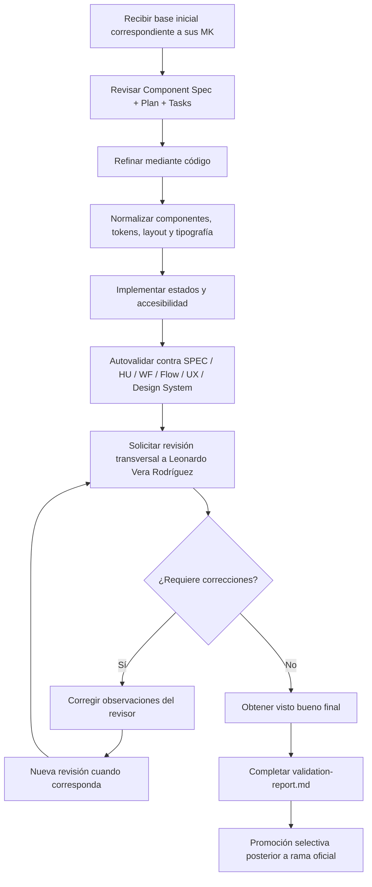

# LAB — lopez

> Rama temporal: `lab/lopez`  
> Rama oficial: `lopez`  
> **Regla inmutable: Nunca hacer merge de esta rama hacia cualquier rama oficial ni abrir Pull Request.**

## Finalidad

Espacio de trabajo experimental para el refinamiento de mockups asignados en un entorno aislado.

La UX no se define aquí. Esta rama debe aplicar obligatoriamente la UX transversal del módulo:

```text
mockups/ux/propuesta-ux.md
mockups/ux/ux-decisions.md
mockups/ux/ux-guidelines.md
```

Cada funcionalidad se guía por:

```text
mockups/MK-XXX/component-spec.md
mockups/MK-XXX/plan.md
mockups/MK-XXX/tasks.md
mockups/MK-XXX/validation-report.md
```

## Regla Conceptual

```text
3 propuestas UX del módulo → comparación y consolidación → Propuesta UX Integral Adoptada
                                      ↓
                               UX Decisions (UXD-XXX)
                                      ↓
                               UX Guidelines
                                      ↓
                               16 funcionalidades
                                      ↓
                               1 MK por funcionalidad
                                      ↓
                               N pantallas por MK
```

## Funcionalidades Asignadas

- **MK-008:** Gestión de categorías y subcategorías
- **MK-009:** Gestión de características y sus valores
- **MK-010:** Asociación entre tipos de producto y características
- **MK-011:** Gestión de marcas
- **MK-012:** Gestión de SEO y metadatos

## Solo Web Desktop

- Entorno: Web Desktop exclusivamente.
- Viewport canónico de revisión: 1440 px (sin considerarlo un ancho rígido).
- No diseñar variantes mobile o tablet.

## Flujo Operativo de Refinamiento



El flujo operativo se ejecuta de la siguiente manera:
1. **Recibir base inicial correspondiente a sus MK:** Punto de partida en código para las funcionalidades asignadas.
2. **Revisar Component Spec + Plan + Tasks:** Confirmar requisitos y pantallas a implementar.
3. **Refinar mediante código:** Trabajar directamente sobre los componentes y vistas.
4. **Normalizar componentes, tokens, layout y tipografía:** Alinear la interfaz a Mantine, Tabler Icons y el Design System.
5. **Implementar estados y accesibilidad:** Cubrir estados Default, Loading, Error, validaciones y navegación por teclado.
6. **Autovalidar contra SPEC/HU/WF/Flow/UX/Design System:** Ejecutar los checklists de autovalidación local y confirmar cero hallazgos bloqueantes ni importantes requeridos abiertos.
7. **Solicitar revisión transversal a Leonardo Vera Rodríguez:** Someter el mockup refinado al revisor transversal del módulo.
8. **Corregir observaciones:** Atender todos los hallazgos `RV-XX` formulados.
9. **Nueva revisión cuando corresponda:** Re-inspección por parte de Leonardo Vera hasta su conformidad.
10. **Obtener visto bueno:** Confirmar el visto bueno obligatorio del revisor transversal.
11. **Completar validation-report.md:** Registrar la aprobación formal con dictamen APROBADO.
12. **Promoción selectiva posterior:** Promover selectivamente el código normalizado y el reporte hacia la rama oficial.

## Trabajo Permitido en `lab/lopez`

- Refinamiento de componentes y pantallas de prototipado para MK-008 a MK-012.
- Pruebas interactivas y validación ergonómica local.
- Commits iterativos de trabajo en progreso.

## Trabajo Prohibido en `lab/lopez`

- Modificar la UX transversal sin aprobación oficial en `master`.
- Abrir Pull Request desde `lab/lopez`.
- Fusionar (`git merge`) `lab/lopez` hacia cualquier rama oficial (`lopez`, `master`).
- Crear carpetas innecesarias o estructuras paralelas (`raw/`, `candidatos/`, etc.).

## Promoción Selectiva hacia la Rama Oficial

Cuando una funcionalidad (`MK-XXX`) esté finalizada y cuente con `validation-report.md` con dictamen **APROBADO** y visto bueno formal de Leonardo Vera Rodríguez:

```bash
# 1. Posicionarse en la rama oficial limpia y actualizada
git switch lopez
git pull --ff-only origin lopez

# 2. Restaurar selectivamente ÚNICAMENTE el código normalizado y validation-report.md
git restore --source lab/lopez -- \
  mockups/MK-XXX/validation-report.md \
  mockups/prototipo/src/pantallas/MKXXX

# 3. Inspeccionar el estado de los archivos restaurados (unstaged)
git status
git diff

# 4. Agregar explícitamente únicamente las rutas aprobadas
git add mockups/MK-XXX/validation-report.md mockups/prototipo/src/pantallas/MKXXX

# 5. Auditar minuciosamente el staging
git diff --cached

# 6. Commit y push a la rama oficial
git commit -m "feat(mockups): promover código y reporte de MK-XXX aprobado desde lab/lopez"
git push origin lopez
```

> **Aviso:** `component-spec.md`, `plan.md` y `tasks.md` no se sobrescriben masivamente desde `lab/`. Si requirieron ajustes justificados, se restauran individualmente tras revisión explícita.

## Sincronización desde la Rama Oficial

Para incorporar actualizaciones provenientes de `lopez` hacia `lab/lopez`:

```bash
git switch lab/lopez
git fetch origin
git merge origin/lopez
git push origin lab/lopez
```

## Cierre y Eliminación

Al finalizar la validación de todos los mockups asignados:

```bash
git push origin --delete lab/lopez
git branch -D lab/lopez
```
