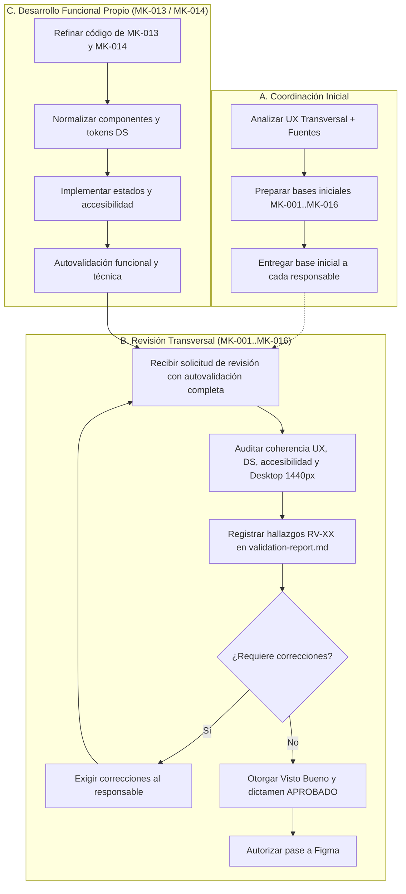

# LAB — vera

> Rama temporal: `lab/vera`  
> Rama oficial: `vera`  
> **Regla inmutable: Nunca hacer merge de esta rama hacia cualquier rama oficial ni abrir Pull Request.**

## Finalidad

Espacio de trabajo experimental para el ejercicio de las responsabilidades técnicas y metodológicas asignadas a Leonardo Vera Rodríguez durante la etapa de mockups.

La UX no se define aquí. Esta rama debe aplicar obligatoriamente la UX transversal del módulo:

```text
mockups/ux/propuesta-ux.md
mockups/ux/ux-decisions.md
mockups/ux/ux-guidelines.md
```

Cada funcionalidad se guía por:

```text
mockups/MK-XXX/component-spec.md
mockups/MK-XXX/plan.md
mockups/MK-XXX/tasks.md
mockups/MK-XXX/validation-report.md
```

## Regla Conceptual

```text
3 propuestas UX del módulo → comparación y consolidación → Propuesta UX Integral Adoptada
                                      ↓
                               UX Decisions (UXD-XXX)
                                      ↓
                               UX Guidelines
                                      ↓
                               16 funcionalidades
                                      ↓
                               1 MK por funcionalidad
                                      ↓
                               N pantallas por MK
```

## Triple Rol y Responsabilidades

Leonardo Vera Rodríguez desempeña tres responsabilidades claramente delimitadas:

### A. Coordinación Inicial (Generación Centralizada)
- Preparar de forma centralizada y homogénea las bases iniciales en código de prototipado para las 16 funcionalidades (`MK-001` a `MK-016`).
- Utilizar estrictamente como fuentes: `propuesta-ux.md`, `ux-decisions.md`, `ux-guidelines.md`, Design System, especificaciones `SPEC`, `HU`, `WF`, flujos y la documentación inicial (`component-spec.md`, `plan.md`, `tasks.md`).
- Entregar oportunamente cada base inicial a su responsable respectivo según el mapeo canónico para que continúe directamente con el refinamiento mediante código.
- No se requiere documentar prompts, sesiones, IDs ni evidencia del mecanismo utilizado para preparar las bases iniciales.

### B. Revisión Transversal de Mockups (Gate de Visto Bueno)
- Actuar como **Revisor UX transversal de mockups** del módulo para todos los mockups (`MK-001` a `MK-016`).
- Auditar cada funcionalidad una vez que su responsable haya completado la autovalidación local.
- Inspeccionar el estricto cumplimiento de la UX transversal, UX Decisions, UX Guidelines, Design System, accesibilidad y PC Desktop.
- Registrar observaciones y hallazgos formales en la tabla `RV-XX` de `validation-report.md`.
- Exigir correcciones cuando existan observaciones bloqueantes o importantes requeridas, y realizar nuevas revisiones hasta su conformidad.
- Otorgar formalmente el **Visto bueno** completando el checklist mandatorio en `validation-report.md`.
- **Regla estricta:** Ningún mockup puede marcarse como `APROBADO` ni pasar a Figma sin este visto bueno.

### C. Responsabilidad Funcional Propia (MK-013 y MK-014)
- Responsable funcional directo exclusivo de:
  - **MK-013:** Gestión de precios individuales y masivos
  - **MK-014:** Historial y auditoría de precios
- Para MK-013 y MK-014, Leonardo Vera conserva simultáneamente la responsabilidad de refinamiento del código y la función de revisión transversal propia para su dictamen final y pase a Figma.

## Solo Web Desktop

- Entorno: Web Desktop exclusivamente.
- Viewport canónico de revisión: 1440 px (sin considerarlo un ancho rígido).
- No diseñar variantes mobile o tablet.

## Flujo Operativo de Trabajo



## Trabajo Permitido en `lab/vera`

- Preparación centralizada de las bases iniciales en código para MK-001 a MK-016.
- Refinamiento y normalización de MK-013 y MK-014.
- Pruebas y auditoría transversal de consistencia sobre los prototipos del módulo.
- Commits iterativos de trabajo en progreso.

## Trabajo Prohibido en `lab/vera`

- Modificar la UX transversal sin aprobación oficial en `master`.
- Abrir Pull Request desde `lab/vera`.
- Fusionar (`git merge`) `lab/vera` hacia cualquier rama oficial (`vera`, `master`).
- Trabajar únicamente dentro de la estructura oficial de artefactos y código de prototipado definida para el módulo.

## Promoción Selectiva hacia la Rama Oficial

Cuando MK-013 o MK-014 estén finalizados y cuenten con `validation-report.md` con dictamen **APROBADO**:

```bash
# 1. Posicionarse en la rama oficial limpia y actualizada
git switch vera
git pull --ff-only origin vera

# 2. Restaurar selectivamente ÚNICAMENTE el código normalizado y validation-report.md
git restore --source lab/vera -- \
  mockups/MK-XXX/validation-report.md \
  mockups/prototipo/src/pantallas/MKXXX

# 3. Inspeccionar el estado de los archivos restaurados (unstaged)
git status
git diff

# 4. Agregar explícitamente únicamente las rutas aprobadas
git add mockups/MK-XXX/validation-report.md mockups/prototipo/src/pantallas/MKXXX

# 5. Auditar minuciosamente el staging
git diff --cached

# 6. Commit y push a la rama oficial
git commit -m "feat(mockups): promover código y reporte de MK-XXX aprobado desde lab/vera"
git push origin vera
```

> **Aviso:** `component-spec.md`, `plan.md` y `tasks.md` no se sobrescriben masivamente desde `lab/`. Si requirieron ajustes justificados, se restauran individualmente tras revisión explícita.

## Sincronización desde la Rama Oficial

Para incorporar actualizaciones provenientes de `vera` hacia `lab/vera`:

```bash
git switch lab/vera
git fetch origin
git merge origin/vera
git push origin lab/vera
```

## Cierre y Eliminación

Al finalizar la validación de todos los mockups asignados:

```bash
git push origin --delete lab/vera
git branch -D lab/vera
```
