# LAB — vera

> Rama temporal: `lab/vera`  
> Rama oficial: `vera`  
> **Regla inmutable: Nunca hacer merge de esta rama hacia una rama oficial ni abrir Pull Request.**

## Finalidad

Iterar y experimentar mockups con Stitch MCP y asistentes en un entorno aislado.

La UX no se define aquí. Stitch **no está autorizado a redefinir la UX del módulo**. Esta rama debe aplicar obligatoriamente:

```text
mockups/ux/propuesta-ux.md
mockups/ux/ux-decisions.md
mockups/ux/ux-guidelines.md
```

Cada funcionalidad se guía por:

```text
mockups/MK-XXX/component-spec.md
mockups/MK-XXX/plan.md
mockups/MK-XXX/tasks.md
```

## Regla Conceptual

```text
3 propuestas UX del módulo → comparación y consolidación → Propuesta UX Integral Adoptada
                                      ↓
                               16 funcionalidades
                                      ↓
                               1 MK por funcionalidad
                                      ↓
                               N pantallas por MK
```

Stitch puede generar candidatos de implementación para perfeccionar una pantalla, pero esos candidatos **nunca son propuestas UX**.

## Solo Web Desktop

- Entorno: Web Desktop exclusivamente.
- `deviceType = DESKTOP` en Stitch MCP.
- Viewport canónico de generación y revisión: 1440 px (sin considerarlo un ancho rígido).
- No diseñar ni generar variantes mobile o tablet.

## Trabajo Permitido en `lab/vera`

- Pantallas y componentes temporales de prototipado.
- Variantes y candidatos de implementación.
- Versionado de artefactos experimentales livianos en `.stitch/` (prompts, IDs de pantalla generados, notas de sesión, HTML/código de prueba).
- Commits y pruebas iterativas rápidas.

## Trabajo Prohibido en `lab/vera`

- Modificar la UX transversal sin aprobación oficial en `master`.
- Abrir Pull Request desde `lab/vera`.
- Fusionar (`git merge`) `lab/vera` hacia ramas oficiales (`vera`, `master`, `testing`).
- Promover carpetas `.stitch/`, cachés o prompts temporales a la rama oficial.

## Política de `.stitch/`

- **Versionar en `lab/vera` (livianos):** prompts enviados, notas de sesión (`stitch-session.json`), IDs de pantalla y código HTML preliminar generado para conservar la trazabilidad de iteraciones.
- **Ignorar (pesados/regenerables):** cachés de herramientas, dependencias locales y screenshots redundantes.
- **En ramas oficiales:** Ningún archivo de `.stitch/` puede promoverse.

## Flujo de Experimentación con Stitch MCP

```mermaid
flowchart TD
    A["Leer UX global + fuentes del MK"]
    B["Elegir pantalla ancla"]
    C["Generar candidato con Stitch DESKTOP"]
    D["Revisar cumplimiento"]
    E["Editar de forma focalizada edit_screens"]
    F{"¿Cumple criterios?"}
    G["Seguir refinando"]
    H["Normalizar código en prototipo/src/pantallas/"]
    I["Completar validation-report.md"]
    J["Promover selectivamente a vera"]

    A --> B --> C --> D --> E --> F
    F -- "No" --> G --> E
    F -- "Sí" --> H --> I --> J
```



## Promoción Selectiva hacia la Rama Oficial

Cuando una funcionalidad (`MK-XXX`) esté finalizada y cuente con `validation-report.md` con dictamen **APROBADO**:

```bash
# 1. Posicionarse en la rama oficial limpia y actualizada
git switch vera
git pull --ff-only origin vera

# 2. Restaurar selectivamente ÚNICAMENTE el código normalizado y validation-report.md
git restore --source lab/vera -- \
  mockups/MK-XXX/validation-report.md \
  mockups/prototipo/src/pantallas/MKXXX

# 3. Inspeccionar el estado de los archivos restaurados (unstaged)
git status
git diff

# 4. Agregar explícitamente únicamente las rutas aprobadas
git add mockups/MK-XXX/validation-report.md mockups/prototipo/src/pantallas/MKXXX

# 5. Auditar minuciosamente el staging (sin .stitch/, prompts ni residuos experimentales)
git diff --cached

# 6. Commit y push a la rama oficial
git commit -m "feat(mockups): promover código y reporte de MK-XXX aprobado desde lab/vera"
git push origin vera
```

> **Aviso:** `component-spec.md`, `plan.md` y `tasks.md` no se sobrescriben masivamente desde `lab/`. Si requirieron ajustes justificados, se restauran individualmente tras revisión explícita.

## Sincronización desde la Rama Oficial

Para incorporar actualizaciones provenientes de `vera` hacia `lab/vera`:

```bash
git switch lab/vera
git fetch origin
git merge origin/vera
git push origin lab/vera
```

## Cierre y Eliminación

Al finalizar la validación de todos los mockups asignados:

```bash
git push origin --delete lab/vera
git branch -D lab/vera
```