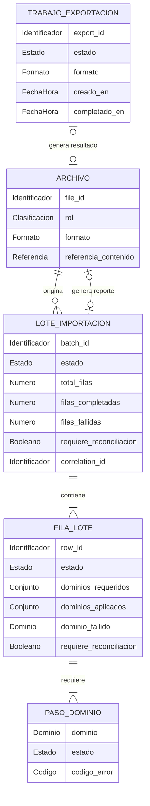

# Modelo lógico — `bulk` (`bulk-svc`)

- **Issue:** #57 — `[Hito 2][BD] Implementar persistencia de bulk-svc`
- **Responsable:** Marco Renato Castilla Huanca
- **Bounded context:** Bulk / Procesamiento masivo
- **Microservicio:** `bulk-svc`
- **Schema objetivo:** `bulk`
- **Última actualización:** `2026-10-03`
- **Estado:** `APROBADO`

## Fuentes

Este modelo deriva de las fuentes funcionales, arquitectónicas y contractuales vigentes del módulo Productos y Ofertas.

Fuentes revisadas:

- `Modelo_Conceptual.md`
- `Arquitectura.md`
- `Contrato_Api.md`
- `api/openapi.yaml` — OpenAPI `0.5.0`
- `asyncapi/asyncapi.yaml` — AsyncAPI `0.4.0`
- `specs/SPEC-001-carga-exportacion-masiva-productos.md`
- `hu/HU-001-carga-exportacion-masiva-productos.md`
- `wireframes/flows/WF-001-carga-exportacion-masiva-productos.md`
- `flujos/FLOW-001-carga-exportacion-masiva-productos.md`
- Issue `#57`
- `bd/CONVENCIONES_BD.md` — convenciones físicas vigentes; no modifica el nivel lógico del modelo

Si existe contradicción entre fuentes oficiales, debe resolverse antes de incorporarla como regla definitiva del modelo. Las convenciones físicas se aplican únicamente al derivar `physical-model.md` y no introducen entidades ni reglas funcionales nuevas.

---

# 1. Propósito

Describir la estructura lógica de información propiedad de `bulk-svc` para la funcionalidad `001 — Carga y exportación masiva de productos`.

Este modelo cubre:

- admisión y seguimiento de lotes de importación;
- seguimiento de cada fila del lote;
- coordinación lógica de dependencias por dominio;
- consolidación de éxitos y fallos parciales;
- reconciliación y reanudación idempotente;
- generación de reportes de importación;
- trabajos asíncronos de exportación;
- archivos de entrada y salida;
- necesidades de persistencia técnica para mensajería e idempotencia.

Este documento **no define todavía la implementación PostgreSQL**.

Por tanto, no decide:

- tipos PostgreSQL;
- tamaños de columnas;
- índices;
- nombres de constraints;
- `CREATE TABLE`;
- `CREATE TYPE`;
- `CHECK`;
- `DEFAULT`;
- triggers;
- funciones PL/pgSQL;
- estrategia concreta de almacenamiento de archivos;
- detalles de Supabase.

Estas decisiones pertenecen a `physical-model.md`.

---

# 2. Responsabilidad del bounded context

## 2.1. Datos propios

`bulk-svc` es autoridad sobre el **workflow masivo**, no sobre los datos comerciales procesados.

Son datos propios de Bulk:

- identidad y estado del lote de importación;
- progreso agregado del lote;
- identidad y estado de cada fila procesada;
- dependencias requeridas por fila;
- dominios ya aplicados;
- dominio fallido;
- necesidad de reconciliación;
- estado lógico de los pasos de dominio;
- identidad y estado de trabajos de exportación;
- referencias a archivos usados o generados por el workflow;
- estado durable necesario para reanudar procesos sin duplicar efectos;
- estado técnico de publicación y deduplicación de mensajes cuando corresponda.

## 2.2. Datos que NO posee

`bulk-svc` no es autoridad sobre:

- Producto — owner: `catalog-svc`
- Variante — owner: `catalog-svc`
- SKU vendible — owner: `catalog-svc`
- Precio — owner: `pricing-svc`
- Moneda y vigencia autoritativa del precio — owner: `pricing-svc`
- Stock — owner: `inventory-svc`
- Ubicación de inventario — owner: `inventory-svc`
- Saldo por SKU y ubicación — owner: `inventory-svc`
- Identidad del Gestor Comercial — owner: Seguridad

Los datos de estos dominios pueden participar en comandos y resultados del workflow, pero **no se convierten en entidades maestras de Bulk**.

Regla de ownership:

```text
bulk-svc = process manager
bulk-svc != owner de catálogo
bulk-svc != owner de pricing
bulk-svc != owner de inventario
```

---

# 3. Entidades lógicas

## 3.1. `ARCHIVO`

**Propósito:**  
Representar un archivo que participa en el workflow de Bulk: archivo de importación recibido, reporte de importación generado o archivo consolidado de exportación.

**Identificador lógico:**  
`file_id`

### Atributos

| Atributo | Naturaleza lógica | Obligatorio | Descripción |
|---|---|---:|---|
| `file_id` | Identificador | Sí | Identidad estable del archivo dentro del workflow de Bulk. |
| `rol` | Clasificación | Sí | Distingue entrada de importación, reporte de importación o resultado de exportación. |
| `formato` | Valor controlado | Sí | Formato funcional del archivo. |
| `referencia_contenido` | Referencia | Sí | Referencia lógica que permite asociar el manifiesto con el contenido del archivo; su implementación física se define posteriormente. |

### Reglas

- Un archivo pertenece al workflow de Bulk, aunque su contenido pueda transportar datos cuyo ownership corresponde a otros dominios.
- La referencia del contenido no equivale necesariamente a una URL temporal de descarga.
- Para la funcionalidad 001, los archivos de importación y exportación soportan `CSV` y `XLSX`.
- El reporte de errores de importación se expone como CSV.
- La estrategia física de almacenamiento del archivo queda fuera de este modelo lógico.

---

## 3.2. `LOTE_IMPORTACION`

**Propósito:**  
Representar una ejecución asíncrona de importación masiva de productos.

**Identificador lógico:**  
`batch_id`

### Atributos

| Atributo | Naturaleza lógica | Obligatorio | Descripción |
|---|---|---:|---|
| `batch_id` | Identificador | Sí | Identidad estable del lote expuesta por el contrato. |
| `estado` | Estado | Sí | Estado global contractual del lote. |
| `version_plantilla` | Número entero | Sí | Versión de plantilla utilizada para interpretar el archivo. |
| `correlation_id` | Identificador de correlación | Sí | Correlaciona la solicitud con el procesamiento asíncrono. |
| `total_filas` | Número entero | Sí | Total de filas consideradas por el lote. |
| `filas_completadas` | Número entero | Sí | Filas consolidadas exitosamente. |
| `filas_fallidas` | Número entero | Sí | Filas consolidadas con error. |
| `requiere_reconciliacion` | Booleano | Sí | Indica si existen efectos parciales o filas pendientes de continuación/reconciliación. |

### Reglas

- Un lote válido inicia en `QUEUED`.
- `PROCESSING` representa trabajo asíncrono en curso.
- `COMPLETED` puede representar un lote completamente exitoso o un lote con filas fallidas; la diferencia se expresa mediante contadores y `requiere_reconciliacion`.
- `FAILED_GENERAL` se reserva para una falla global que impide completar el trabajo como lote.
- Reanudar un lote conserva el mismo `batch_id`; no crea un nuevo lote lógico para la misma ejecución.
- Cuando una reanudación es aceptada, el mismo lote vuelve al ciclo asíncrono con estado `QUEUED` para procesar únicamente dependencias pendientes o reconciliables.
- Reanudar el mismo `batch_id` no debe repetir efectos ya confirmados.
- Si el lote finaliza `COMPLETED` con filas fallidas, el contrato refleja `filas_fallidas > 0` y `requiere_reconciliacion = true`.
- El lote no adquiere ownership sobre productos, precios o stock.

---

## 3.3. `FILA_LOTE`

**Propósito:**  
Representar una fila individual del archivo de importación y su resultado consolidado multidominio.

**Identificador lógico:**  
`row_id` dentro de un `LOTE_IMPORTACION`.

### Atributos

| Atributo | Naturaleza lógica | Obligatorio | Descripción |
|---|---|---:|---|
| `row_id` | Identificador | Sí | Identidad estable de la fila dentro del lote. |
| `estado` | Estado | Sí | Estado consolidado de la fila. |
| `dominios_requeridos` | Conjunto controlado | Sí | Dominios cuya aplicación debe concluir para consolidar la fila. |
| `dominios_aplicados` | Conjunto controlado | Sí | Dominios que ya confirmaron efectos aplicados. |
| `dominio_fallido` | Valor controlado | No | Dominio responsable del fallo consolidado cuando corresponda. |
| `requiere_reconciliacion` | Booleano | Sí | Indica existencia de efecto parcial que debe continuarse sin rollback destructivo. |
| `codigo_error` | Código | No | Código canónico asociado al fallo de la fila. |
| `detalle_error` | Texto | No | Explicación funcional del error. |

### Reglas

- Una fila pertenece exactamente a un lote.
- Una fila solo puede quedar `COMPLETED` cuando todas sus dependencias requeridas hayan finalizado satisfactoriamente.
- `dominios_aplicados` debe ser subconjunto de `dominios_requeridos`.
- `dominio_fallido`, cuando existe, debe pertenecer a `dominios_requeridos`.
- Por cada dominio incluido en `dominios_requeridos` debe existir un `PASO_DOMINIO`.
- Todo `PASO_DOMINIO` asociado a una fila debe pertenecer a `dominios_requeridos`.
- Un dominio aparece en `dominios_aplicados` únicamente cuando su resultado funcional ya fue confirmado como aplicado.
- Un fallo parcial después de efectos confirmados no elimina esos efectos.
- Si Catálogo rechaza la fila, no se consideran aplicados Pricing ni Inventario como consecuencia de esa fila.
- Si Pricing o Inventario falla después de otro dominio aplicado, la fila queda `FAILED` y puede requerir reconciliación.
- El archivo no puede producir SKU duplicados dentro de la importación aceptada.

---

## 3.4. `PASO_DOMINIO`

**Propósito:**  
Representar el estado funcional consolidado de una dependencia de dominio necesaria para completar una `FILA_LOTE`.

**Identificador lógico:**  
combinación `FILA_LOTE + dominio`.

### Atributos

| Atributo | Naturaleza lógica | Obligatorio | Descripción |
|---|---|---:|---|
| `dominio` | Valor controlado | Sí | `CATALOGO`, `PRICING` o `INVENTARIO`. |
| `estado` | Estado | Sí | Estado funcional consolidado del dominio para la fila. |
| `codigo_error` | Código | No | Código canónico del resultado fallido. |
| `detalle_error` | Texto | No | Detalle asociado al resultado funcional. |

### Reglas

- Una fila tiene como máximo un paso lógico vigente por dominio.
- Los pasos reflejan el **resultado funcional consolidado**, no la topología física de colas ni un único comando técnico.
- Un paso funcional puede depender de más de una operación asíncrona.
- Un ACK técnico de mensajería no equivale a `COMPLETED` del paso.
- La fila solo se consolida como exitosa cuando todos los pasos requeridos están `COMPLETED`.
- Cuando un dominio queda `COMPLETED` y su efecto ya fue confirmado, debe reflejarse en `dominios_aplicados`.
- Cuando un dominio queda `FAILED`, dicho dominio puede registrarse como `dominio_fallido` según el resultado consolidado.

Los identificadores técnicos `message_id`, `operation_id` y `correlation_id` pertenecen a las operaciones/mensajes asíncronos y no se modelan como atributos de un único `PASO_DOMINIO`.

---

## 3.5. `TRABAJO_EXPORTACION`

**Propósito:**  
Representar la generación asíncrona de un archivo consolidado con la totalidad del catálogo activo, precios vigentes y existencias de inventario.

**Identificador lógico:**  
`export_id`

### Atributos

| Atributo | Naturaleza lógica | Obligatorio | Descripción |
|---|---|---:|---|
| `export_id` | Identificador | Sí | Identidad estable del trabajo de exportación. |
| `estado` | Estado | Sí | Estado contractual del trabajo. |
| `formato` | Valor controlado | Sí | `CSV` o `XLSX` para la funcionalidad 001. |
| `creado_en` | Fecha/hora | Sí | Momento de creación. |
| `completado_en` | Fecha/hora | No | Finalización del trabajo. |

### Reglas

- El trabajo se procesa de forma asíncrona.
- Para `SPEC-001`, los formatos permitidos son exclusivamente `CSV` y `XLSX`.
- El resultado consolida información vigente proveniente de Catálogo, Pricing e Inventario.
- El consolidado generado no convierte a Bulk en owner de esos datos.
- Un trabajo `COMPLETED` debe tener un archivo de resultado disponible.
- Un trabajo `FAILED_GENERAL` no debe presentarse como archivo completado.
- No se introducen filtros de segmentación no contemplados por `CrearExportacionProductosRequest`.

---

# 4. Catálogos de estados y valores controlados

## 4.1. Estado de lote de importación

Valores:

```text
QUEUED
PROCESSING
COMPLETED
FAILED_GENERAL
```

Semántica:

| Valor | Significado |
|---|---|
| `QUEUED` | El lote fue aceptado y espera procesamiento. |
| `PROCESSING` | El lote se encuentra en ejecución asíncrona. |
| `COMPLETED` | El lote terminó su procesamiento; puede contener filas fallidas informadas mediante contadores y reconciliación. |
| `FAILED_GENERAL` | Una falla global impidió finalizar el procesamiento normal del lote. |

`COMPLETED_CON_ERRORES` puede utilizarse como descripción funcional visible, pero **no se incorpora como estado contractual independiente** porque OpenAPI define `COMPLETED` más `failed_rows` / `needs_reconciliation`.

---

## 4.2. Estado de fila

Valores:

```text
PENDING
PROCESSING
COMPLETED
FAILED
```

| Valor | Significado |
|---|---|
| `PENDING` | La fila todavía no inició todas sus dependencias necesarias. |
| `PROCESSING` | Existe procesamiento multidominio en curso. |
| `COMPLETED` | Todas las dependencias requeridas terminaron satisfactoriamente. |
| `FAILED` | Existe un fallo funcional consolidado en al menos una dependencia requerida. |

---

## 4.3. Estado de paso de dominio

Valores:

```text
PENDING
PROCESSING
COMPLETED
FAILED
```

La semántica coincide con el avance funcional consolidado de la dependencia específica.

---

## 4.4. Dominios de consolidación

Valores:

```text
CATALOGO
PRICING
INVENTARIO
```

Estos valores representan responsabilidades funcionales.

No representan nombres de schemas ni autorizan acceso SQL cross-service.

---

## 4.5. Estado de trabajo de exportación

Valores:

```text
QUEUED
PROCESSING
COMPLETED
FAILED_GENERAL
```

La semántica es equivalente a la del trabajo asíncrono expuesto por OpenAPI.

---

## 4.6. Formatos de archivo de la funcionalidad 001

Valores:

```text
CSV
XLSX
```

El esquema genérico `TrabajoExportacion` de OpenAPI puede admitir otros formatos para otras funcionalidades, pero `CrearExportacionProductosRequest` utiliza `FormatoArchivo`, cuyo alcance para esta funcionalidad es `CSV` / `XLSX`.

---

## 4.7. Roles lógicos de archivo

Valores:

```text
ENTRADA_IMPORTACION
REPORTE_IMPORTACION
RESULTADO_EXPORTACION
```

| Valor | Significado |
|---|---|
| `ENTRADA_IMPORTACION` | Archivo recibido para originar uno o más lotes de importación. |
| `REPORTE_IMPORTACION` | Archivo CSV generado como reporte de filas fallidas de un lote. |
| `RESULTADO_EXPORTACION` | Archivo CSV o XLSX generado por un trabajo de exportación completado. |

Estos valores clasifican el papel del archivo dentro de Bulk; no determinan cómo se almacena físicamente.

---

# 5. Relaciones y cardinalidades

| Origen | Relación | Destino | Cardinalidad | Propiedad |
|---|---|---|---:|---|
| `ARCHIVO` | origina | `LOTE_IMPORTACION` | `1 : 0..N` | Interna |
| `LOTE_IMPORTACION` | contiene | `FILA_LOTE` | `1 : 1..N` | Interna |
| `FILA_LOTE` | requiere | `PASO_DOMINIO` | `1 : 1..3` | Interna |
| `LOTE_IMPORTACION` | puede generar | `ARCHIVO` | `1 : 0..1` | Interna |
| `TRABAJO_EXPORTACION` | genera | `ARCHIVO` | `1 : 0..1` | Interna |

Las interacciones con Catálogo, Pricing, Inventario y Seguridad son **referencias contractuales externas**, no relaciones ER internas ni FK cross-context.

---

# 6. Referencias interdominio e identificadores de integración

## 6.1. Referencias interdominio

| Referencia | Owner | Uso local en Bulk | ¿FK cross-context? |
|---|---|---|---:|
| `product_id` | `catalog-svc` | Correlación de filas/comandos cuando el contrato lo transporte. | No |
| `sku` / `sku_base` | `catalog-svc` | Procesamiento de filas y coordinación con Inventario. | No |
| `precio_regular` | `pricing-svc` una vez aplicado | Dato transportado en el flujo de inicialización, sin autoridad local. | No |
| `moneda` | `pricing-svc` una vez aplicada | Dato transportado en el flujo de inicialización. | No |
| `location_id` / `default_location_id` | `inventory-svc` | Determina si puede solicitarse el ajuste de stock inicial. | No |
| `stock_inicial` | `inventory-svc` una vez aplicado | Intención de ajuste proveniente del archivo de importación. | No |

Regla:

```text
referencia externa != entidad local autoritativa
```

No se crean relaciones SQL hacia schemas de Catálogo, Pricing o Inventario.

## 6.2. Identificadores de integración

Los siguientes identificadores no representan entidades externas ni relaciones de datos:

| Identificador | Semántica |
|---|---|
| `batch_id` | Identidad estable del lote administrada por Bulk. |
| `row_id` | Identidad estable de la fila dentro del workflow de Bulk. |
| `operation_id` | Idempotencia de negocio de una operación asíncrona. |
| `message_id` | Deduplicación técnica de un mensaje. |
| `correlation_id` | Correlación extremo a extremo del procesamiento. |

`operation_id`, `message_id` y `correlation_id` pertenecen a la integración/mensajería y no deben interpretarse como FK hacia otros bounded contexts.

---

# 7. Reglas de integridad lógica

1. `total_filas`, `filas_completadas` y `filas_fallidas` nunca pueden ser negativas.
2. `filas_completadas + filas_fallidas` no puede exceder `total_filas`.
3. `dominios_aplicados` debe ser subconjunto de `dominios_requeridos`.
4. `dominio_fallido`, cuando existe, debe formar parte de `dominios_requeridos`.
5. Por cada dominio requerido debe existir exactamente un `PASO_DOMINIO`.
6. No puede existir un `PASO_DOMINIO` cuyo dominio no esté incluido en `dominios_requeridos`.
7. Un dominio funcionalmente completado y con efecto confirmado debe reflejarse en `dominios_aplicados`.
8. Una fila solo puede marcarse `COMPLETED` cuando todos sus pasos requeridos estén `COMPLETED`.
9. Una fila `FAILED` con dominios ya aplicados no ejecuta rollback destructivo sobre esos dominios.
10. Si Catálogo rechaza la operación de la fila, no deben considerarse aplicados Pricing ni Inventario como consecuencia de esa fila.
11. Si existe fallo parcial después de efectos aplicados, debe conservarse información suficiente para reconciliar o reanudar.
12. Reanudar un mismo `batch_id` procesa únicamente operaciones pendientes o reconciliables; al aceptarse la reanudación, el lote reingresa en `QUEUED` sin duplicar efectos ya confirmados.
13. Las operaciones internas usan `operation_id` para idempotencia de negocio y `message_id` para deduplicación técnica según AsyncAPI.
14. Un ACK técnico de RabbitMQ no representa éxito funcional de un dominio.
15. El archivo de importación aceptado no puede producir SKU duplicados.
16. Para un producto nuevo con precio base, la preparación de precio inicial corresponde al producto; una variante sin override hereda el precio del producto.
17. Cada SKU vendible nuevo requiere inicialización en Inventario.
18. El producto padre con variantes no genera saldo físico.
19. Inicializar un SKU en cero no equivale a aplicar el stock inicial del archivo.
20. Si `stock_inicial > 0` y existe `default_location_id`, Bulk solicita el ajuste masivo de stock.
21. Si `stock_inicial > 0` y no existe ubicación predeterminada, Bulk no inventa una ubicación y la fila queda observada o fallida según el flujo oficial.
22. El lote puede finalizar `COMPLETED` con `filas_fallidas > 0`; no se crea un estado contractual nuevo por esta condición.
23. Un trabajo de exportación `COMPLETED` debe tener un archivo de resultado disponible.
24. La exportación 001 solo admite `CSV` o `XLSX`.
25. El resultado exportado es un snapshot operativo; Catálogo, Pricing e Inventario continúan siendo las fuentes de verdad.

La forma concreta de implementar estas reglas (`UNIQUE`, `CHECK`, trigger o aplicación) se decide exclusivamente en `physical-model.md`.

---

# 8. Normalización y duplicación controlada

## 8.1. Datos autoritativos

Son autoritativos dentro de Bulk:

- `batch_id`;
- estado del lote;
- contadores del lote;
- resultado consolidado por fila;
- dominios aplicados/fallidos;
- necesidad de reconciliación;
- estado lógico de cada paso de dominio;
- `export_id`;
- estado del trabajo de exportación;
- vínculo lógico entre trabajos y archivos generados;
- información técnica de mensajería e idempotencia propia del workflow cuando corresponda.

## 8.2. Datos externos transportados por el workflow

Bulk puede procesar datos pertenecientes a otros dominios para coordinar operaciones.

| Dato | Owner autoritativo | Uso en Bulk |
|---|---|---|
| Producto / SKU | `catalog-svc` | Crear o actualizar borradores mediante contratos. |
| Precio / moneda | `pricing-svc` | Preparar el precio inicial mediante contratos. |
| Stock inicial | `inventory-svc` una vez aplicado | Solicitar ajuste inicial cuando corresponda. |
| Ubicación | `inventory-svc` | Determinar si puede aplicarse stock inicial. |
| Datos consolidados de exportación | Catálogo / Pricing / Inventario | Generar el archivo solicitado. |

La persistencia física de payloads, snapshots o copias temporales no se exige desde este modelo lógico y deberá justificarse, si resulta necesaria, en `physical-model.md`.

Regla:

```text
transportar datos externos != compartir ownership
```

---

# 9. Persistencia técnica necesaria

| Necesidad | Requerida | Justificación |
|---|---:|---|
| Outbox | Sí | Bulk publica comandos asíncronos y debe evitar pérdida entre commit local y publicación. |
| Inbox | Sí | Bulk consume resultados/eventos y debe deduplicar por `message_id`. |
| Idempotencia de operaciones | Sí | Los reintentos no pueden duplicar efectos ya confirmados. |
| Jobs asíncronos | Sí | Importaciones y exportaciones tienen ciclo `QUEUED → PROCESSING → ...`. |
| Estado durable del process manager | Sí | Bulk necesita sobrevivir reinicios y consolidar respuestas multidominio. |
| Reconciliación | Sí | Los fallos parciales no realizan rollback distribuido. |
| Referencia durable de archivos | Sí | El lote usa archivo de entrada y puede producir reporte; la exportación produce archivo final. |
| Historial de solicitudes de reanudación | Pendiente | Debe definirse si se requiere persistencia explícita adicional al estado durable del lote y sus pasos. |
| Proyección comercial local | No | Bulk no necesita mantener una copia maestra permanente de catálogo, precio o stock. |

La implementación concreta de Outbox, Inbox, historial de reanudación y archivos se define en el modelo físico.

---

# 10. Diagrama entidad-relación lógico



Las referencias a Catálogo, Pricing, Inventario y Seguridad son externas y no se representan como relaciones físicas.

---

# 11. Trazabilidad

| Fuente | Decisión / entidad derivada |
|---|---|
| `SPEC-001` | Lote, fila, coordinación multidominio, fallo parcial, reconciliación, stock inicial y exportación asíncrona. |
| `HU-001` | Criterios de consolidación, idempotencia, reporte de errores, exportación CSV/XLSX y reanudación. |
| `WF-001` | Necesidad de progreso, resultado por fila/dominio, reporte y archivo de exportación. |
| `FLOW-001` | Relaciones lote→filas→pasos, reanudación idempotente y ausencia de rollback distribuido. |
| OpenAPI `0.5.0` | `batch_id`, `export_id`, estados de lote/exportación, estados de fila/paso, `failed_domain`, `needs_reconciliation`, formatos específicos de 001. |
| AsyncAPI `0.4.0` | `message_id`, `operation_id`, `correlation_id`, Outbox/Inbox y contratos masivos de Catálogo/Inventario/Pricing. |
| `Modelo_Conceptual.md` | Entidades conceptuales `ARCHIVO`, `LOTE DE IMPORTACIÓN`, `FILA DE LOTE`, `PASO DE DOMINIO`, `TRABAJO DE EXPORTACIÓN`; prohibición de joins cross-schema. |
| `Arquitectura.md` | `bulk-svc` como process manager; estado durable por fila; integración eventual, idempotente, correlacionada y reconciliable. |
| `Contrato_Api.md` | Bulk coordina importaciones/exportaciones y no escribe directamente en schemas de Catálogo, Pricing o Inventario. |
| Issue `#57` | Alcance de trabajos batch, filas, pasos, exportaciones, manifiestos y Outbox/Inbox. |

---

# 12. Decisiones del modelo lógico

| ID | Decisión | Justificación | Impacto |
|---|---|---|---|
| `D-LOG-001` | Mantener como entidades núcleo `ARCHIVO`, `LOTE_IMPORTACION`, `FILA_LOTE`, `PASO_DOMINIO` y `TRABAJO_EXPORTACION`. | Coinciden con `Modelo_Conceptual.md` y cubren el alcance del issue #57. | Todo el modelo. |
| `D-LOG-002` | La reanudación actúa sobre el mismo `batch_id` y no crea una nueva versión del lote. | SPEC/HU definen reanudar operaciones pendientes del mismo lote. | `LOTE_IMPORTACION`. |
| `D-LOG-003` | Los pasos `CATALOGO`, `PRICING` e `INVENTARIO` representan consolidación funcional, no operaciones individuales ni consumidores físicos del broker. | OpenAPI expone esos pasos al usuario; una dependencia funcional puede involucrar varias operaciones asíncronas. | `PASO_DOMINIO`. |
| `D-LOG-004` | `COMPLETED_CON_ERRORES` no se modela como estado independiente. | OpenAPI define `COMPLETED` + `failed_rows` + `needs_reconciliation`. | `LOTE_IMPORTACION`. |
| `D-LOG-005` | La persistencia de snapshots/payloads de filas no se exige en el modelo lógico. | Bulk puede requerirlos físicamente, pero ninguna fuente vigente obliga a una representación concreta. | Derivación física. |
| `D-LOG-006` | Para funcionalidad 001, la exportación admite solo `CSV` y `XLSX`. | `CrearExportacionProductosRequest` usa `FormatoArchivo`; SPEC-001 limita explícitamente los formatos. | `TRABAJO_EXPORTACION`, `ARCHIVO`. |
| `D-LOG-007` | Outbox/Inbox se consideran necesidades técnicas del process manager, no entidades de negocio de la funcionalidad. | AsyncAPI exige Transactional Outbox e Inbox/deduplicación. | Derivación física. |
| `D-LOG-008` | El reporte de importación y el resultado de exportación son roles de `ARCHIVO`, no entidades independientes. | El modelo conceptual utiliza una única entidad `ARCHIVO`. | `ARCHIVO`. |
| `D-LOG-009` | Los timestamps técnicos no exigidos por contratos no forman parte del modelo lógico de lote, fila o paso. | Las convenciones de auditoría temporal pertenecen a la derivación física y al estándar transversal de BD. | `LOTE_IMPORTACION`, `FILA_LOTE`, `PASO_DOMINIO`. |

---

# 13. Decisiones pendientes

| ID | Pregunta | Fuente afectada | Bloquea modelo físico núcleo | Bloquea integración/mapeo |
|---|---|---|---:|---:|
| `P-LOG-001` | ¿Cómo se proyectan los resultados físicos de mensajería hacia los pasos funcionales `CATALOGO`, `PRICING` e `INVENTARIO` que expone Bulk? | `SPEC-001`, `FLOW-001`, OpenAPI `PasoDominioBulk`, AsyncAPI `0.4.0` | No | Sí |
| `P-LOG-002` | ¿La historia de solicitudes explícitas de `/reanudar` debe persistirse como registro propio o basta con el estado durable del lote/pasos más auditoría técnica? | OpenAPI `ReanudarImportacionRequest`, issue #57 | No | No |
| `P-LOG-003` | ¿Existe una política oficial de retención/expiración para archivos de importación, reportes y exportaciones? | Arquitectura / operación | No | No |

### Sobre `P-LOG-001`

El modelo lógico puede avanzar porque el contrato HTTP exige mostrar por fila los pasos funcionales:

```text
CATALOGO
PRICING
INVENTARIO
```

Sin embargo, la topología AsyncAPI vigente distribuye la coordinación física:

```text
bulk-svc
  → catalog.bulk.upsert.requested
      → catalog-svc
          → pricing.product.initialization.requested
          → inventory.sku.initialization.requested

bulk-svc
  → inventory.bulk.stock.adjust.requested
```

Además, `bulk-svc` consume resultados de contratos Bulk, mientras los resultados de inicialización de producto/SKU llegan a `catalog-svc`.

Por tanto, antes de cerrar la implementación de mensajería debe definirse cómo esos mensajes se proyectan hacia los tres estados funcionales expuestos por Bulk.

Esta decisión **no bloquea el núcleo del modelo físico** (`lote`, `fila`, `paso`, `archivo`, `exportación`), pero sí el adaptador/proyector que actualice `PASO_DOMINIO`.

---

# 14. Derivación esperada hacia el modelo físico

`physical-model.md` deberá decidir cómo materializar:

- `ARCHIVO`;
- `LOTE_IMPORTACION`;
- `FILA_LOTE`;
- `PASO_DOMINIO`;
- `TRABAJO_EXPORTACION`;
- persistencia técnica de `operation_id`, `message_id` y `correlation_id` donde corresponda;
- Outbox;
- Inbox;
- historial de reanudación solo si se confirma su necesidad;
- estados controlados;
- referencias externas sin FK.

El modelo físico deberá especificar:

- tablas;
- columnas;
- tipos PostgreSQL;
- PK;
- FK exclusivamente internas;
- `UNIQUE`;
- `CHECK`;
- defaults;
- índices;
- enums cuando correspondan;
- funciones/triggers estrictamente necesarios;
- timestamps técnicos cuando las convenciones transversales o la implementación los requieran;
- estrategia de referencias de archivo.

Toda tabla física deberá poder trazarse a:

1. una entidad lógica de este documento;
2. una relación lógica;
3. una necesidad técnica documentada.

No podrá introducir tablas maestras de Producto, Precio, Stock, Ubicación, Pedido, Pago o Reserva.

---

# 15. Checklist de aprobación

## Ownership

- [x] El bounded context conserva ownership exclusivamente sobre el workflow masivo.
- [x] Producto, SKU, Precio, Stock y Ubicación permanecen en sus owners.
- [x] Las referencias externas están identificadas.
- [x] No existe acceso SQL cross-service en el modelo.

## Modelo

- [x] Se representan archivos.
- [x] Se representan lotes.
- [x] Se representan filas.
- [x] Se representan pasos por dominio.
- [x] Se representan trabajos de exportación.
- [x] Se representan fallos parciales y reconciliación.
- [x] Los identificadores lógicos están definidos.
- [x] Las relaciones tienen cardinalidades.
- [x] Las invariantes principales están documentadas.
- [x] Los estados coinciden con OpenAPI vigente.

## Aislamiento

- [x] No se proponen FK entre bounded contexts.
- [x] Los datos externos transportados no se convierten en entidades maestras.
- [x] No se confunde referencia externa con ownership.

## Nivel de abstracción

- [x] No contiene SQL de implementación.
- [x] No fija tipos PostgreSQL.
- [x] No fija índices.
- [x] No fija triggers ni funciones de BD.
- [x] No exige una estrategia concreta de snapshot/payload.
- [x] Separa estado funcional de dominio de identidad técnica de mensajería.

## Trazabilidad

- [x] Las entidades principales son trazables a `Modelo_Conceptual.md`.
- [x] Las reglas principales son trazables a SPEC/HU/WF/FLOW/contratos.
- [x] Las decisiones locales están registradas.
- [x] `P-LOG-001` está aislado como decisión de integración y no bloquea el núcleo físico.

**Resultado:** `APROBADO PARA DERIVACIÓN FÍSICA`
