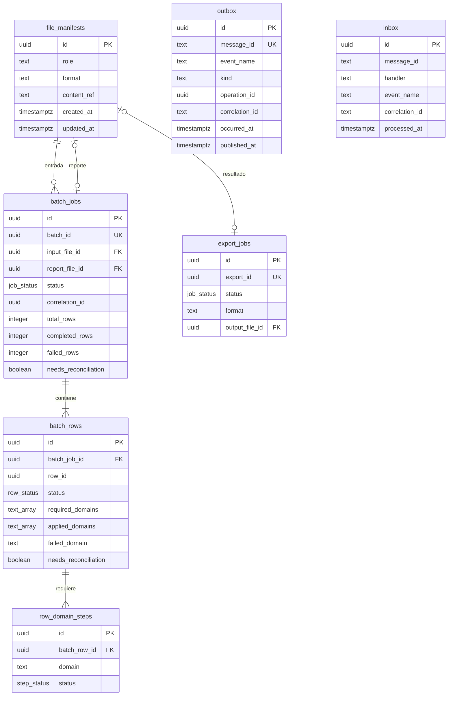

# Modelo físico — `bulk` (`bulk-svc`)

## 1. Identificación

- **Issue:** #57 — `[Hito 2][BD] Implementar persistencia de bulk-svc`
- **Responsable:** Marco Renato Castilla Huanca
- **Bounded context:** Bulk / Procesamiento masivo
- **Microservicio:** `bulk-svc`
- **Schema:** `bulk`
- **Owner exclusivo:** `bulk-svc`
- **Última actualización:** `2026-10-03`
- **Estado:** `EN REVISIÓN`
- **Modelo lógico de origen:** `logical-model.md`
- **Migraciones:** `migrations/`
- **Validación:** `validation.sql`
- **Motor objetivo:** PostgreSQL / Supabase

---

## 2. Fuentes y precedencia

Este modelo físico deriva de:

- `specs/SPEC-001-carga-exportacion-masiva-productos.md`
- `hu/HU-001-carga-exportacion-masiva-productos.md`
- `wireframes/flows/WF-001-carga-exportacion-masiva-productos.md`
- `flujos/FLOW-001-carga-exportacion-masiva-productos.md`
- `Modelo_Conceptual.md`
- `Arquitectura.md`
- `Contrato_Api.md`
- `api/openapi.yaml` — OpenAPI `0.5.0`
- `asyncapi/asyncapi.yaml` — AsyncAPI `0.4.0`
- `logical-model.md`
- `bd/CONVENCIONES_BD.md`
- `database/README.md`
- `database/bootstrap.sql`
- `database/migrate.py`

Precedencia aplicada:

```text
fuentes funcionales y contractuales
        ↓
modelo conceptual / arquitectura
        ↓
logical-model.md
        ↓
bd/CONVENCIONES_BD.md
        ↓
physical-model.md
        ↓
migrations/
        ↓
validation.sql
```

Las convenciones físicas no introducen reglas funcionales nuevas. Si una convención contradice un contrato oficial, prevalece el contrato, tal como establece `bd/CONVENCIONES_BD.md §2`.

---

## 3. Propósito

Materializar el modelo lógico aprobado de `bulk-svc` como persistencia PostgreSQL/Supabase para la funcionalidad 001 — Carga y exportación masiva de productos.

El modelo persiste:

- archivos del workflow;
- lotes de importación;
- filas de lote;
- pasos funcionales por dominio;
- trabajos de exportación;
- Transactional Outbox;
- Inbox de deduplicación.

No materializa maestros de Catálogo, Pricing, Inventario, Seguridad, Ventas, Retail o Despacho.

---

## 4. Alcance del bounded context

### 4.1. Datos que posee

Bulk es autoridad de:

- identidad y estado del lote;
- estado agregado y contadores del lote;
- estado de cada fila;
- dominios requeridos, aplicados y fallidos;
- necesidad de reconciliación;
- pasos funcionales de Catálogo, Pricing e Inventario;
- trabajos de exportación;
- manifiestos/referencias de archivos del workflow;
- publicación y deduplicación técnica de mensajes propios del process manager.

### 4.2. Datos que NO posee

No es autoridad de:

- Producto, Variante y SKU → `catalog-svc`;
- Precio y moneda autoritativa → `pricing-svc`;
- Stock y ubicación → `inventory-svc`;
- identidad de usuario → Seguridad;
- Pedido/Pago → Ventas/Postventa.

Las referencias y payloads externos no generan FK ni acceso SQL cross-service.

---

## 5. Principios de diseño físico

### 5.1. Aislamiento

Todo vive dentro del schema `bulk`.

Se prohíben:

- FK hacia otros schemas;
- joins operativos cross-service;
- vistas cross-service;
- `dblink` / `postgres_fdw`;
- FK hacia `auth.users`;
- tablas maestras de dominios ajenos.

El schema y su owner `po_bulk_owner` se crean mediante `database/bootstrap.sql`; las migraciones de Bulk se aplican después con `database/migrate.py bulk`.

### 5.2. Convenciones aplicadas

| Decisión local | ¿Se aparta? | Motivo | Evidencia / aprobación |
|---|---:|---|---|
| Se conservan `batch_jobs`, `batch_rows`, `row_domain_steps`, `export_jobs`, `file_manifests`, `outbox`, `inbox` | No | Son nombres heredados explícitamente de `Arquitectura.md`; `CONVENCIONES_BD.md §5.2` ordena preservarlos | `Arquitectura.md §7` |
| `message_id` y `correlation_id` de Outbox/Inbox son `text` | Sí | AsyncAPI `0.4.0` los define como `string` sin `format: uuid`; el contrato prevalece sobre la convención física | `asyncapi/asyncapi.yaml` `MessageEnvelope`; `CONVENCIONES_BD.md §2` |
| `operation_id` es `uuid` | No | AsyncAPI lo define como `string format: uuid` | AsyncAPI `0.4.0` |
| `batch_id`, `row_id` y `export_id` se materializan como `uuid` y se serializan como string en HTTP | No | Son identidades técnicas generadas por Bulk; UUID es compatible con los esquemas HTTP `type: string` | OpenAPI `0.5.0` + `CONVENCIONES_BD.md §6` |
| `schema_migrations` no forma parte de este modelo | No | Es ledger de infraestructura creado por `database/migrate.py`, no una tabla del bounded context | `database/migrate.py` |
| La migración no contiene `BEGIN/COMMIT` | No | `database/migrate.py` envuelve cada versión en una transacción | `database/README.md §1/§4` |

---

## 6. Inventario de tablas

| Tabla | Propósito | Origen | PK | Estabilidad |
|---|---|---|---|---|
| `file_manifests` | Referencias durables a archivos del workflow | `ARCHIVO` | `id` | mutable |
| `batch_jobs` | Estado agregado del lote de importación | `LOTE_IMPORTACION` | `id` | mutable |
| `batch_rows` | Estado durable por fila | `FILA_LOTE` | `id` | mutable |
| `row_domain_steps` | Estado funcional por dominio y fila | `PASO_DOMINIO` | `id` | mutable |
| `export_jobs` | Trabajo asíncrono de exportación | `TRABAJO_EXPORTACION` | `id` | mutable |
| `outbox` | Publicación transaccional confiable | necesidad técnica | `id` | infraestructura; sin `updated_at` |
| `inbox` | Deduplicación por mensaje/handler | necesidad técnica | `id` | registro de procesamiento; sin `updated_at` |

`bulk.schema_migrations`, cuando existe, es administrada por `database/migrate.py` y queda fuera de este inventario.

---

## 7. Enumeraciones y tipos propios

Solo se usan enums nativos para estados de ciclo de vida propios del bounded context.

### 7.1. `bulk.job_status`

Valores:

```text
QUEUED
PROCESSING
COMPLETED
FAILED_GENERAL
```

Usado por `batch_jobs.status` y `export_jobs.status`.

### 7.2. `bulk.row_status`

Valores:

```text
PENDING
PROCESSING
COMPLETED
FAILED
```

Usado por `batch_rows.status`.

### 7.3. `bulk.step_status`

Valores:

```text
PENDING
PROCESSING
COMPLETED
FAILED
```

Usado por `row_domain_steps.status`.

`domain`, `role` y `format` se materializan como `text + CHECK`, porque son catálogos cerrados de clasificación y no ciclos de vida independientes.

---

## 8. Modelo por tabla

### 8.1. `file_manifests`

**Origen lógico:** `ARCHIVO`  
**Propósito:** asociar una identidad local con el contenido durable de un archivo de entrada, reporte o resultado.  
**Estabilidad:** mutable.

| Columna | Tipo PostgreSQL | Nulo | Default | Restricciones | Origen lógico |
|---|---|---:|---|---|---|
| `id` | `uuid` | No | `gen_random_uuid()` | PK | `file_id` |
| `role` | `text` | No | — | CHECK | rol |
| `format` | `text` | No | — | CHECK | formato |
| `content_ref` | `text` | No | — | NN | referencia_contenido |
| `created_at` | `timestamptz` | No | `now()` | — | técnico |
| `updated_at` | `timestamptz` | No | `now()` | trigger | técnico |

**PK:** `pk_file_manifests(id)`.

**Constraints:**

| Constraint | Tipo | Expresión / regla |
|---|---|---|
| `ck_file_manifests_role` | CHECK | `role IN ('ENTRADA_IMPORTACION','REPORTE_IMPORTACION','RESULTADO_EXPORTACION')` |
| `ck_file_manifests_format` | CHECK | `format IN ('CSV','XLSX')` |
| `ck_file_manifests_report_csv` | CHECK | un reporte de importación solo puede ser CSV |

**Índices:** no requiere índices adicionales.

**Triggers:** `trg_file_manifests_updated_at`; `trg_file_manifests_protect_usage` protege rol/formato cuando el archivo ya está enlazado.

**Borrado:** no usa `deleted_at`; el borrado físico está bloqueado por FK `RESTRICT` mientras exista un lote/exportación que lo referencie. La retención posterior no se fija hasta existir política oficial.

---

### 8.2. `batch_jobs`

**Origen lógico:** `LOTE_IMPORTACION`  
**Propósito:** estado durable agregado de una importación.  
**Estabilidad:** mutable.

| Columna | Tipo | Nulo | Default | Restricciones |
|---|---|---:|---|---|
| `id` | `uuid` | No | `gen_random_uuid()` | PK |
| `batch_id` | `uuid` | No | — | UNIQUE |
| `input_file_id` | `uuid` | No | — | FK interna |
| `report_file_id` | `uuid` | Sí | `NULL` | FK interna + UNIQUE |
| `status` | `bulk.job_status` | No | `QUEUED` | — |
| `template_version` | `integer` | No | — | CHECK `> 0` |
| `correlation_id` | `uuid` | No | — | NN |
| `total_rows` | `integer` | No | `0` | CHECK `>= 0` |
| `completed_rows` | `integer` | No | `0` | CHECK `>= 0` |
| `failed_rows` | `integer` | No | `0` | CHECK `>= 0` |
| `needs_reconciliation` | `boolean` | No | `false` | — |
| `created_at` | `timestamptz` | No | `now()` | — |
| `updated_at` | `timestamptz` | No | `now()` | trigger |

**PK:** `pk_batch_jobs(id)`.

**UNIQUE:** `uq_batch_jobs_batch_id(batch_id)`, `uq_batch_jobs_report_file_id(report_file_id)`.

**FK:**

| Constraint | Origen | Destino | ON DELETE |
|---|---|---|---|
| `fk_batch_jobs_input_file_id` | `input_file_id` | `file_manifests.id` | RESTRICT |
| `fk_batch_jobs_report_file_id` | `report_file_id` | `file_manifests.id` | RESTRICT |

**Índices:** `ix_batch_jobs_input_file_id`; `ix_batch_jobs_status_created_at`; `ix_batch_jobs_reconciliation` parcial.

**Invariantes:** contadores no negativos; suma terminal no excede total; `COMPLETED` exige `completed_rows + failed_rows = total_rows`; si `COMPLETED` tiene fallos, `needs_reconciliation=true`.

**Triggers:** `trg_batch_jobs_updated_at`, `trg_batch_jobs_file_roles`.

---

### 8.3. `batch_rows`

**Origen lógico:** `FILA_LOTE`  
**Propósito:** estado durable por fila y consolidación multidominio.  
**Estabilidad:** mutable.

| Columna | Tipo | Nulo | Default | Restricciones |
|---|---|---:|---|---|
| `id` | `uuid` | No | `gen_random_uuid()` | PK |
| `batch_job_id` | `uuid` | No | — | FK interna |
| `row_id` | `uuid` | No | — | UNIQUE dentro del lote |
| `status` | `bulk.row_status` | No | `PENDING` | — |
| `required_domains` | `text[]` | No | — | CHECK |
| `applied_domains` | `text[]` | No | `ARRAY[]::text[]` | CHECK |
| `failed_domain` | `text` | Sí | `NULL` | CHECK |
| `needs_reconciliation` | `boolean` | No | `false` | CHECK contextual |
| `error_code` | `text` | Sí | `NULL` | — |
| `error_detail` | `text` | Sí | `NULL` | — |
| `created_at` | `timestamptz` | No | `now()` | — |
| `updated_at` | `timestamptz` | No | `now()` | trigger |

**PK:** `pk_batch_rows(id)`.

**UNIQUE:** `uq_batch_rows_batch_row(batch_job_id,row_id)`.

**FK:** `fk_batch_rows_batch_job_id → batch_jobs.id ON DELETE CASCADE`.

La FK está cubierta por el índice compuesto del `UNIQUE`, cuyo primer elemento es `batch_job_id`; adicionalmente existe `ix_batch_rows_batch_status` por consulta del workflow.

**Invariantes:**

- entre 1 y 3 dominios requeridos;
- dominios válidos: `CATALOGO`, `PRICING`, `INVENTARIO`;
- sin elementos nulos ni duplicados;
- `applied_domains ⊆ required_domains`;
- `failed_domain`, si existe, pertenece a requeridos y no aparece en aplicados;
- `failed_domain IS NOT NULL → status=FAILED`;
- `status=FAILED → failed_domain IS NOT NULL`;
- `status=COMPLETED` exige conjuntos requeridos/aplicados equivalentes, sin fallo ni reconciliación;
- `needs_reconciliation=true` exige fila `FAILED` con al menos un dominio aplicado.

**Índices:** `ix_batch_rows_batch_status`, `ix_batch_rows_reconciliation`, `ix_batch_rows_failed_domain`.

**Triggers:** `trg_batch_rows_updated_at`.

---

### 8.4. `row_domain_steps`

**Origen lógico:** `PASO_DOMINIO`  
**Propósito:** estado funcional consolidado de cada dominio requerido por una fila.  
**Estabilidad:** mutable.

| Columna | Tipo | Nulo | Default | Restricciones |
|---|---|---:|---|---|
| `id` | `uuid` | No | `gen_random_uuid()` | PK |
| `batch_row_id` | `uuid` | No | — | FK interna |
| `domain` | `text` | No | — | CHECK |
| `status` | `bulk.step_status` | No | `PENDING` | — |
| `error_code` | `text` | Sí | `NULL` | — |
| `error_detail` | `text` | Sí | `NULL` | — |
| `created_at` | `timestamptz` | No | `now()` | — |
| `updated_at` | `timestamptz` | No | `now()` | trigger |

**PK:** `pk_row_domain_steps(id)`.

**UNIQUE:** `uq_row_domain_steps_row_domain(batch_row_id,domain)`.

**FK:** `fk_row_domain_steps_batch_row_id → batch_rows.id ON DELETE CASCADE`.

La FK está cubierta por el índice del `UNIQUE` cuyo primer elemento es `batch_row_id`.

**Constraints:** `ck_row_domain_steps_domain` limita a `CATALOGO|PRICING|INVENTARIO`.

**Índice:** `ix_row_domain_steps_status_updated_at` para pasos pendientes/fallidos.

**Trigger:** `trg_row_domain_steps_updated_at`.

Esta tabla representa resultado funcional, no una operación RabbitMQ individual. `operation_id/message_id` no se almacenan aquí.

---

### 8.5. `export_jobs`

**Origen lógico:** `TRABAJO_EXPORTACION`  
**Propósito:** trabajo asíncrono de exportación completa.  
**Estabilidad:** mutable.

| Columna | Tipo | Nulo | Default | Restricciones |
|---|---|---:|---|---|
| `id` | `uuid` | No | `gen_random_uuid()` | PK |
| `export_id` | `uuid` | No | — | UNIQUE |
| `status` | `bulk.job_status` | No | `QUEUED` | — |
| `format` | `text` | No | — | CHECK `CSV|XLSX` |
| `output_file_id` | `uuid` | Sí | `NULL` | FK interna + UNIQUE |
| `created_at` | `timestamptz` | No | `now()` | contractual/técnico |
| `completed_at` | `timestamptz` | Sí | `NULL` | — |
| `updated_at` | `timestamptz` | No | `now()` | trigger |

**PK:** `pk_export_jobs(id)`.

**UNIQUE:** `uq_export_jobs_export_id(export_id)`, `uq_export_jobs_output_file_id(output_file_id)`.

**FK:** `fk_export_jobs_output_file_id → file_manifests.id ON DELETE RESTRICT`; su índice queda cubierto por el `UNIQUE`.

**Constraint:** `COMPLETED` exige `output_file_id` y `completed_at`.

**Índice:** `ix_export_jobs_status_created_at`.

**Triggers:** `trg_export_jobs_updated_at`, `trg_export_jobs_file_role`.

---

### 8.6. `outbox`

**Origen:** necesidad técnica documentada por Arquitectura/AsyncAPI/convenciones.  
**Propósito:** publicación posterior al commit con reintentos del relay.  
**Estabilidad:** infraestructura; exenta de `updated_at`/`deleted_at`.

| Columna | Tipo | Nulo | Default | Restricciones |
|---|---|---:|---|---|
| `id` | `uuid` | No | `gen_random_uuid()` | PK |
| `message_id` | `text` | No | — | UNIQUE; excepción contractual documentada |
| `event_name` | `text` | No | — | NN |
| `kind` | `text` | No | — | CHECK `command|event|result` |
| `schema_version` | `integer` | No | `1` | CHECK `>0` |
| `correlation_id` | `text` | No | — | excepción contractual documentada |
| `causation_id` | `text` | Sí | `NULL` | — |
| `operation_id` | `uuid` | Sí | `NULL` | idempotencia negocio |
| `occurred_at` | `timestamptz` | No | — | instante del envelope |
| `payload` | `jsonb` | No | — | NN |
| `published_at` | `timestamptz` | Sí | `NULL` | NULL = pendiente |
| `attempts` | `integer` | No | `0` | CHECK `>=0` |
| `last_error` | `text` | Sí | `NULL` | — |
| `created_at` | `timestamptz` | No | `now()` | técnico |

**PK:** `pk_outbox(id)`.

**UNIQUE:** `uq_outbox_message_id(message_id)` y `uq_outbox_operation_event(operation_id,event_name)`; PostgreSQL permite múltiples NULL en `operation_id`.

**Índice:** `ix_outbox_pending(published_at,occurred_at)`.

No existe `status`: `published_at IS NULL` significa pendiente, conforme a `CONVENCIONES_BD.md §10.3`.

---

### 8.7. `inbox`

**Origen:** necesidad técnica de deduplicación.  
**Propósito:** registrar el procesamiento por `message_id + handler`.  
**Estabilidad:** registro de procesamiento; exenta de `updated_at`/`deleted_at`.

| Columna | Tipo | Nulo | Default | Restricciones |
|---|---|---:|---|---|
| `id` | `uuid` | No | `gen_random_uuid()` | PK |
| `message_id` | `text` | No | — | parte de UNIQUE; excepción contractual |
| `handler` | `text` | No | — | parte de UNIQUE |
| `event_name` | `text` | No | — | NN |
| `correlation_id` | `text` | Sí | `NULL` | excepción contractual |
| `payload` | `jsonb` | No | — | NN |
| `result` | `text` | No | — | resultado del handler |
| `processed_at` | `timestamptz` | No | `now()` | instante de procesamiento |
| `created_at` | `timestamptz` | No | `now()` | timestamp transversal |

**PK:** `pk_inbox(id)`.

**UNIQUE:** `uq_inbox_message_handler(message_id,handler)`.

La deduplicación no se reduce a `message_id`: distintos handlers pueden procesar legítimamente el mismo mensaje.

---

## 9. Referencias externas

Bulk no normaliza referencias de Catálogo/Pricing/Inventario en tablas propias. Pueden existir únicamente dentro de archivos o `payload jsonb` de mensajes.

| Dato transportado | Owner | Se obtiene desde |
|---|---|---|
| `product_id`, `sku`, `sku_base` | `catalog-svc` | archivo / contratos asíncronos |
| `precio_regular`, `moneda` | `pricing-svc` | archivo / contratos |
| `location_id`, `default_location_id`, `stock_inicial` | `inventory-svc` | archivo / contratos |

No existe FK física para ninguno de ellos.

---

## 10. Constraints e invariantes

| Regla lógica | Implementación física | Justificación |
|---|---|---|
| Lote identificable de forma estable | `uq_batch_jobs_batch_id` | reanudación sobre mismo lote |
| Fila única dentro del lote | `uq_batch_rows_batch_row` | identidad por batch |
| Un paso por dominio/fila | `uq_row_domain_steps_row_domain` | evita duplicación funcional |
| Exportación identificable | `uq_export_jobs_export_id` | polling/descarga |
| Conteos no negativos | CHECK | invariante declarativa |
| Conteos terminales no superan total | CHECK | invariante declarativa |
| `COMPLETED` cierra todas las filas | CHECK | contrato |
| Aplicados son subconjunto de requeridos | CHECK | Arquitectura §19.3 |
| Dominios válidos/sin duplicados | CHECK | contrato |
| Fila FAILED identifica dominio | CHECK | SPEC-001 |
| Reconciliación implica efecto parcial | CHECK | SPEC-001 |
| Reporte de importación CSV | CHECK + trigger de enlace | OpenAPI/SPEC |
| Exportación completada tiene archivo | CHECK + trigger de enlace | contrato |
| Mensaje Outbox único | UNIQUE | deduplicación publicación |
| `kind` / `attempts` válidos | CHECK | convención Outbox |
| Inbox único por mensaje+handler | UNIQUE compuesto | `CONVENCIONES_BD.md §10.3` |
| Coherencia fila↔pasos y contadores reales | aplicación transaccional + validación de datos terminales | regla cross-table; no congelar `P-LOG-001` con triggers |

---

## 11. Foreign keys

### 11.1. FK permitidas

| Origen | Destino | Constraint | ON DELETE | Cobertura de índice |
|---|---|---|---|---|
| `batch_jobs.input_file_id` | `file_manifests.id` | `fk_batch_jobs_input_file_id` | RESTRICT | `ix_batch_jobs_input_file_id` |
| `batch_jobs.report_file_id` | `file_manifests.id` | `fk_batch_jobs_report_file_id` | RESTRICT | `uq_batch_jobs_report_file_id` |
| `batch_rows.batch_job_id` | `batch_jobs.id` | `fk_batch_rows_batch_job_id` | CASCADE | `uq_batch_rows_batch_row` |
| `row_domain_steps.batch_row_id` | `batch_rows.id` | `fk_row_domain_steps_batch_row_id` | CASCADE | `uq_row_domain_steps_row_domain` |
| `export_jobs.output_file_id` | `file_manifests.id` | `fk_export_jobs_output_file_id` | RESTRICT | `uq_export_jobs_output_file_id` |

### 11.2. FK prohibidas

No existen FK hacia `catalog`, `pricing`, `inventory`, `auth`, Ventas/Postventa u otros módulos.

---

## 12. Índices

| Índice | Tabla | Columnas | Tipo | Justificación |
|---|---|---|---|---|
| `ix_batch_jobs_input_file_id` | `batch_jobs` | `input_file_id` | btree | FK/consultas por archivo |
| `ix_batch_jobs_status_created_at` | `batch_jobs` | `status, created_at` | compuesto | worker/monitoreo |
| `ix_batch_jobs_reconciliation` | `batch_jobs` | `updated_at` | parcial | lotes reconciliables |
| `ix_batch_rows_batch_status` | `batch_rows` | `batch_job_id,status` | compuesto | progreso de lote |
| `ix_batch_rows_reconciliation` | `batch_rows` | `batch_job_id` | parcial | `/reanudar` |
| `ix_batch_rows_failed_domain` | `batch_rows` | `batch_job_id,failed_domain` | parcial | reporte de errores |
| `ix_row_domain_steps_status_updated_at` | `row_domain_steps` | `status,updated_at` | compuesto | pasos pendientes/fallidos |
| `ix_export_jobs_status_created_at` | `export_jobs` | `status,created_at` | compuesto | worker exportación |
| `ix_outbox_pending` | `outbox` | `published_at,occurred_at` | compuesto | relay en orden temporal |

No se duplican índices ya creados por `UNIQUE`.

---

## 13. Funciones y triggers

| Función / trigger | Objetivo | Tablas |
|---|---|---|
| `fn_set_updated_at` + `trg_*_updated_at` | mantener `updated_at` | cinco tablas mutables |
| `fn_validate_batch_job_files` + `trg_batch_jobs_file_roles` | rol/formato correcto de input/reporte | `batch_jobs`, `file_manifests` |
| `fn_validate_export_job_file` + `trg_export_jobs_file_role` | rol/formato correcto del resultado | `export_jobs`, `file_manifests` |
| `fn_protect_file_manifest_usage` + `trg_file_manifests_protect_usage` | impedir cambiar rol/formato de un archivo ya enlazado a un uso incompatible | `file_manifests` |

No hay triggers de negocio que decidan cuándo un dominio queda completado.

---

## 14. Outbox e Inbox

### 14.1. Aplicabilidad

| Tabla | ¿Aplica? | Motivo |
|---|---:|---|
| `outbox` | Sí | Bulk publica comandos/resultados del workflow |
| `inbox` | Sí | Bulk consume resultados/eventos de otros servicios |

### 14.2. Outbox

Se ajusta a `CONVENCIONES_BD.md §10.2` con la excepción contractual de tipo para `message_id/correlation_id` ya documentada.

Flujo:

```text
BEGIN transacción local
    mutación del workflow
    INSERT outbox
COMMIT
relay → publica → confirmación → actualiza published_at/attempts/last_error
```

### 14.3. Inbox

La deduplicación se realiza mediante:

```text
UNIQUE(message_id, handler)
```

El registro representa un handler ya procesado y conserva `result` y `processed_at`.

---

## 15. Idempotencia y concurrencia

### 15.1. Idempotencia

| Operación / tabla | Identificador | Restricción | Replay |
|---|---|---|---|
| publicación Outbox | `message_id` | `uq_outbox_message_id` | no crea mensaje duplicado |
| operación de negocio publicada | `operation_id + event_name` | `uq_outbox_operation_event` | evita duplicar la misma intención/evento |
| consumo Inbox | `message_id + handler` | `uq_inbox_message_handler` | mismo handler no repite efecto |
| reanudación de lote | `batch_id` + estado durable | `uq_batch_jobs_batch_id` | reutiliza el lote y solo continúa pendientes/reconciliables |

### 15.2. Concurrencia

No se añade versión optimista a las tablas de workflow. La consistencia se mantiene mediante transacciones locales y constraints. Si aparecen múltiples workers sobre el mismo lote, el mecanismo de claim/locking deberá documentarse en una migración posterior respaldada por implementación real.

---

## 16. Proyecciones locales

No se crean proyecciones comerciales persistentes en esta versión.

Los datos de Producto, Precio y Stock viajan en archivos/payloads, pero no se materializan como fuente de verdad local.

---

## 17. Reglas de escritura

| Regla | Implementación física |
|---|---|
| Idempotencia técnica | Outbox/Inbox + `UNIQUE` |
| Reanudación | `batch_id` estable + filas/pasos durables |
| Ciclo de vida | enums `job_status`, `row_status`, `step_status` |
| Reconciliación | `needs_reconciliation` + `applied_domains` + `failed_domain` |
| Outbox transaccional | inserción en misma transacción de negocio |
| Actualización temporal | `fn_set_updated_at` |
| Integridad de roles de archivos | triggers locales |

---

## 18. Excepciones de timestamps y borrado

| Tabla | Excepción | Motivo |
|---|---|---|
| `outbox` | sin `updated_at`, sin `deleted_at` | convención explícita; usa `published_at`, `attempts`, `last_error` |
| `inbox` | sin `updated_at`, sin `deleted_at` | registro de deduplicación ya procesado |
| resto de tablas | sin `deleted_at` | no existe requerimiento de baja lógica; la retención física aún no está definida |

Todas las tablas tienen `created_at timestamptz NOT NULL DEFAULT now()`.

---

## 19. Diagrama entidad-relación físico



`outbox` e `inbox` no tienen FK hacia los agregados del workflow.

---

## 20. Trazabilidad lógico → físico

| Elemento lógico | Materialización |
|---|---|
| `ARCHIVO` | `file_manifests` |
| `LOTE_IMPORTACION` | `batch_jobs` |
| `FILA_LOTE` | `batch_rows` |
| `PASO_DOMINIO` | `row_domain_steps` |
| `TRABAJO_EXPORTACION` | `export_jobs` |
| archivo→lote | `batch_jobs.input_file_id` |
| reporte del lote | `batch_jobs.report_file_id` |
| lote→fila | `batch_rows.batch_job_id` |
| fila→paso | `row_domain_steps.batch_row_id` |
| exportación→archivo | `export_jobs.output_file_id` |
| Outbox | `outbox` |
| Inbox | `inbox` |

---

## 21. Trazabilidad funcional

| Fuente | Elemento físico derivado |
|---|---|
| `SPEC-001` | lote, fila, pasos, reconciliación, exportación |
| `HU-001` | estados, reanudación y reporte |
| `WF-001` | progreso/resultado descargable |
| `FLOW-001` | coordinación multidominio y reintentos |
| OpenAPI `0.5.0` | identificadores, estados, contadores, formatos |
| AsyncAPI `0.4.0` | Outbox/Inbox y envelope de mensajería |
| `Modelo_Conceptual.md` | cinco entidades núcleo |
| `Arquitectura.md` | nombres de tablas, aislamiento y estado durable |
| `logical-model.md` | invariantes y ownership |
| `CONVENCIONES_BD.md` | PK, timestamps, nombres, Outbox/Inbox, índices |
| `database/README.md` | estructura/versionado/despliegue de migraciones |

---

## 22. Decisiones físicas

| ID | Decisión | Alternativas | Justificación | Impacto |
|---|---|---|---|---|
| `D-PHY-001` | PK UUID `id` en las siete tablas | PK naturales / identity | convención transversal | todas |
| `D-PHY-002` | IDs contractuales `batch_id,row_id,export_id` como UUID | text | identidades técnicas generadas por Bulk | jobs/rows |
| `D-PHY-003` | `required_domains/applied_domains` como `text[]` + CHECK | enums[] / tabla asociativa | arquitectura exige arrays durables; dominios no son ciclos de vida | `batch_rows` |
| `D-PHY-004` | estados como enums nativos | text+CHECK | ciclos de vida propios ya publicados | jobs/rows/steps |
| `D-PHY-005` | no snapshot comercial persistido | `jsonb normalized_payload` | lógico no lo exige | `batch_rows` |
| `D-PHY-006` | no `resume_requests` | tabla adicional | `P-LOG-002` sigue abierto | reanudación |
| `D-PHY-007` | Outbox/Inbox siguen estructura transversal | diseño anterior con status/identity | #48 ya está cerrado | mensajería |
| `D-PHY-008` | `message_id/correlation_id` text | uuid | AsyncAPI vigente tiene precedencia | mensajería |
| `D-PHY-009` | no BEGIN/COMMIT en archivo de migración | migración autocontenida | `migrate.py` envuelve cada versión | despliegue |
| `D-PHY-010` | `schema_migrations` fuera del modelo | incluirlo como tabla Bulk | ledger de infraestructura del migrador | validación |

---

## 23. Decisiones pendientes

| ID | Pregunta | Fuente | Impacto | ¿Bloquea migración? |
|---|---|---|---|---:|
| `P-PHY-001` | ¿Cómo se proyectan exactamente los resultados AsyncAPI hacia los pasos funcionales CATALOGO/PRICING/INVENTARIO? | `P-LOG-001` | implementación del consumer | No |
| `P-PHY-002` | ¿Se requiere historial explícito de solicitudes `/reanudar`? | `P-LOG-002` | posible tabla futura | No |
| `P-PHY-003` | ¿Cuál será el nombre/rol runtime al que se concederán permisos mínimos sobre `bulk`? | `database/README.md` | grants de runtime | No para DDL; sí antes de runtime productivo |
| `P-PHY-004` | `CONVENCIONES_BD.md §15.3` muestra 3 dígitos, pero `database/migrate.py` exige 4 | fuentes de infraestructura | nomenclatura de archivo | No; se usa 4 dígitos porque el ejecutor lo exige |

---

## 24. Migraciones

Ruta vigente:

```text
database/bulk/migrations/
```

Migración inicial:

```text
0001_create_bulk_persistence.sql
```

La versión utiliza cuatro dígitos porque `database/migrate.py` valida exactamente `0001_descripcion.sql`, aunque `CONVENCIONES_BD.md §15.3` aún muestre ejemplos de tres dígitos.

El archivo no contiene `BEGIN/COMMIT`; el ejecutor aplica cada versión dentro de una transacción y registra checksum en `bulk.schema_migrations`.

Prerrequisito: `database/bootstrap.sql` debe haber creado `po_bulk_owner` y el schema `bulk`.

---

## 25. Validación

Ruta:

```text
database/bulk/validation.sql
```

La versión corregida es **solo lectura** y aborta con `RAISE EXCEPTION` si detecta incumplimientos. Verifica:

1. schema y tablas esperadas;
2. tipos de columnas críticos;
3. PK UUID;
4. ausencia de SERIAL/IDENTITY;
5. FK internas y ausencia de FK cross-schema/auth/public;
6. índices de FK;
7. timestamps;
8. ausencia de `timestamp without time zone`;
9. enums locales;
10. constraints/nombres;
11. Outbox/Inbox;
12. aislamiento y RLS deshabilitado;
13. consistencia de datos terminales cuando existan registros.

`bulk.schema_migrations` se excluye de los checks de modelo porque es infraestructura creada por `database/migrate.py` y utiliza deliberadamente `version text` como PK.

---

## 26. Despliegue en Supabase

1. ejecutar una vez `database/bootstrap.sql` con administrador autorizado;
2. ejecutar `python database/migrate.py bulk` con deployer miembro de `po_bulk_owner`;
3. ejecutar `psql -X -v ON_ERROR_STOP=1 -f database/bulk/validation.sql`;
4. registrar commit, schema, versión, checksum, PostgreSQL, fecha y resultado;
5. no exponer `bulk` por Data API ni activar RLS en este schema de escritura;
6. conceder al runtime únicamente permisos explícitos cuando Infra defina el rol/login correspondiente.

---

## 27. Checklist de aprobación

### 27.1. Correspondencia lógica

- [x] Cinco entidades lógicas materializadas.
- [x] Outbox/Inbox tienen origen técnico documentado.
- [x] No se agregan maestros externos.

### 27.2. Aislamiento

- [x] Sin FK cross-service.
- [x] Sin joins/vistas cross-service.
- [x] Sin FK a `auth.users`.

### 27.3. Identificadores

- [x] Todas las PK del modelo son UUID.
- [x] Sin serial/bigserial/identity.
- [x] Identificadores contractuales documentados.

### 27.4. Tipos y timestamps

- [x] Todos los instantes usan `timestamptz`.
- [x] Todas las tablas tienen `created_at`.
- [x] Cinco tablas mutables tienen `updated_at` + trigger.
- [x] Outbox/Inbox documentadas como exentas de `updated_at`.

### 27.5. Integridad

- [x] Constraints con nombres explícitos.
- [x] FK internas con índice o índice UNIQUE equivalente.
- [x] CHECKs principales documentados.

### 27.6. Rendimiento

- [x] Índices justificados.
- [x] Sin índices redundantes deliberados.

### 27.7. Mensajería

- [x] Outbox/Inbox conformes a la convención actual, salvo excepción contractual de tipo explícita.
- [x] Inbox deduplica por `(message_id,handler)`.
- [x] Outbox ordenable por `(published_at,occurred_at)`.

### 27.8. Implementación

- [x] Migración versionada `0001_...` sin transacción anidada.
- [x] Validación solo lectura con assertions.
- [ ] Ejecución real en PostgreSQL limpio.
- [ ] Evidencia Supabase.
- [ ] Grants de runtime cuando Infra defina el rol.

---

## 28. Resultado de revisión

**Resultado:** `REQUIERE VALIDACIÓN DE EJECUCIÓN`

**Observaciones:**

- El modelo y el SQL quedan homologados con las convenciones cerradas del issue #48.
- Persiste la discrepancia documental de 3 vs 4 dígitos; se adopta 4 porque es requisito ejecutable de `database/migrate.py`.
- `message_id/correlation_id` mantienen `text` por precedencia del AsyncAPI vigente.
- Falta ejecución real de migración + `validation.sql` para marcar `APROBADO`.

**Revisor:** ChatGPT — auditoría técnica solicitada por el responsable.  
**Fecha:** `2026-10-03`
