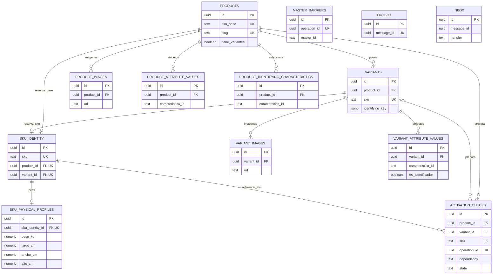

# Catálogo — Modelo lógico y físico de `catalog-svc`

## 1. Identificación

- Responsable: Gabriel Poma Gutierrez.
- Funcionalidades: 003 Gestión de productos y 004 Gestión de variantes/SKU.
- Bounded context: Catálogo. Microservicio y owner exclusivo: `catalog-svc`.
- Schema: `catalog`. Owner de despliegue: `po_catalog_owner`; runtime: `catalog_app`.
- Fecha: 2026-10-03. Estado: **BORRADOR PARA REVISIÓN**.
- Motor objetivo: PostgreSQL 15+ / Supabase; verificar versión efectiva antes del despliegue.
- Modelo lógico de origen: incluido en §3 de este archivo para conservar tres entregables.
- Migración: [migrations/0001_create_catalog.sql](migrations/0001_create_catalog.sql).
- Validación: [validation.sql](validation.sql).
- Ubicación solicitada: `db/catalog-savage`; no cambia el nombre del servicio/schema.

## 2. Fuentes y precedencia

El diseño parte de [Modelo_Conceptual.md §4, §14–18 y alineación HTTP 0.5.0](../../Modelo_Conceptual.md): conserva entidades, cardinalidades y ownership. Sus nombres de tablas propuestos no obligan a crear entidades de negocio adicionales.

| Fuente | Aplicación |
|---|---|
| [SPEC-003](../../specs/SPEC-003-gestion-productos-crud.md) / [SPEC-004](../../specs/SPEC-004-gestion-variantes-skus.md) | Borrador, perfil físico, preparación, identidad, edición y estados |
| [WF-003 Markdown](../../wireframes/flows/WF-003-gestion-productos-crud.md) / [WF-004 Markdown](../../wireframes/flows/WF-004-gestion-variantes-skus.md) | Datos editables y preparación visible |
| [HU-003](../../hu/HU-003-gestion-productos-crud.md) / [HU-004](../../hu/HU-004-gestion-variantes-skus.md) | Criterios de aceptación |
| [FLOW-003](../../flujos/FLOW-003-gestion-productos-crud.md) / [FLOW-004](../../flujos/FLOW-004-gestion-variantes-skus.md) | Secuencias, retry y efectos sobre el padre |
| [OpenAPI 0.5.0](../../api/openapi.yaml) | ProductoCreate/UpdateRequest, VarianteCreate/UpdateRequest, Atributo, ImagenRef, PerfilFisicoInput y estados |
| [AsyncAPI 0.4.0](../../asyncapi/asyncapi.yaml) / [Contrato_Api.md](../../Contrato_Api.md) | Envelope, mensajes, idempotencia e integración |
| [Arquitectura §7–8, §32 y §39](../../Arquitectura.md) | Schema, tablas de referencia, políticas de aplicación y transacciones locales |
| [CONVENCIONES_BD.md](../../bd/CONVENCIONES_BD.md) | UUID, nombres, tipos, timestamps, enums, FK, mensajería y seguridad |
| [database/README.md](../../database/README.md), [bootstrap.sql](../../database/bootstrap.sql), [migrate.py](../../database/migrate.py), [validation-report.md](../../database/validation-report.md) | Roles actuales, checksum/versionado, transacción del ejecutor y evidencia previa del procedimiento |

Precedencia funcional solicitada: SPEC → documentación WF → HU, contrastada con FLOW. Los índices HTML son prototipos, no fuentes para inventar reglas de BD. Los contratos quedan fijos. Las fuentes oficiales prevalecen sobre recomendaciones físicas o supuestos; las discrepancias se registran en §5 y §23.

## 3. Propósito y modelo lógico

Materializar PRODUCTO, VARIANTE, IMAGEN, ATRIBUTO, CARACTERÍSTICA IDENTIFICADORA y PERFIL FÍSICO DEL SKU, más las necesidades técnicas expresas del contexto.

### 3.1. Entidades y relaciones

| Entidad / relación | Cardinalidad lógica | Materialización |
|---|---|---|
| Producto → Variante | 1:0..N; solo si tiene_variantes=true | products → variants.product_id |
| Producto → Imagen | 1:0..N en borrador; al menos una al activar | product_images |
| Variante → Imagen | 1:1..N; CreateRequest exige imagen incluso en borrador | variant_images |
| Producto → valor de atributo | 1:0..N | product_attribute_values |
| Variante → valor de atributo | 1:0..N no identificadores y 1..N identificadores | variant_attribute_values |
| Producto → característica identificadora | N:M conceptual, referencias externas sin FK | product_identifying_characteristics |
| SKU vendible → perfil físico | 1:0..1, completo antes de activar | sku_physical_profiles |
| Producto → preparación de Pricing | 1:0..1 registro local; el alta debe crear uno | activation_checks, PRICING |
| SKU vendible → preparación de Inventario | 1:0..1 registro local; el alta debe crear uno | activation_checks, INVENTORY |
| Maestro externo → barrera local | 1:0..N operaciones | master_barriers |

Los IDs locales de producto y variante son UUID representados como strings en HTTP. Los IDs de Taxonomía son `text`: el contrato los define como strings opacos. Nunca se validan mediante FK externa.

### 3.2. Identidad y unidad comercial

Producto simple: `tiene_variantes=false`, `sku_base` es vendible y tiene su perfil. Producto con variantes: `sku_base` es identidad base; cada variante tiene su SKU vendible y perfil; el padre no tiene peso, dimensiones ni saldo.

`sku_identity` es un registro técnico derivado con una fila por base o variante. Lo crean triggers junto al propietario. Su UNIQUE total resuelve la carrera que dos UNIQUE separados en productos y variantes no resolverían. No agrega estado comercial, precio o stock, ni convierte al padre en unidad vendible.

`variant_id`, `product_id` y SKU no son intercambiables. La baja conserva identidades. Cuando VarianteCreateRequest omite SKU, Catálogo lo genera antes de INSERT; no se fija un formato/generador comercial en SQL.

### 3.3. Combinación identificadora

`variants.identifying_key` es un objeto JSONB canónico: `caracteristica_id → {"valor_id": ID}` para un valor de lista; de lo contrario `caracteristica_id → {"valor": JSON}`. Ejemplo: `{"talla":{"valor_id":"M"},"color":{"valor_id":"AZUL"}}`.

JSONB ignora el orden de claves. El nombre/snapshot mutable no participa de la identidad. UNIQUE `(product_id, identifying_key)` incluye variantes inactivas. La validación diferida reconstruye la clave desde los atributos identificadores y exige igualdad; editar esas filas no puede cambiar la combinación publicada. El servicio normaliza valores libres según el esquema de Taxonomía; SQL no inventa equivalencias entre strings.

Cada característica tiene una fila por entidad; valores múltiples permanecen dentro de `valor` JSONB si el esquema lo permite. Un atributo no se repite como identificador y no identificador de la misma variante.

### 3.4. Ciclos de vida e invariantes

- Producto: BORRADOR, ACTIVO, INACTIVO. Variante: BORRADOR, ACTIVA, INACTIVA.
- Borrador admite perfil ausente/parcial; cualquier medida informada debe ser positiva y finita. Activar/reactivar una unidad vendible exige las cuatro medidas. Volumen = largo × ancho × alto, calculado en consulta/aplicación, sin columna ni entrada independiente.
- Variante activa requiere imagen, identificadores válidos, perfil completo e INVENTORY COMPLETED. El padre puede estar borrador/inactivo.
- Producto activo requiere imagen, PRICING COMPLETED, maestros/atributos válidos y perfil + INVENTORY COMPLETED si es simple. Con variantes requiere al menos una ACTIVA; todas las activas deben cumplir sus requisitos. Borradores/inactivas no bloquean al padre.
- Editar actualiza el mismo registro. Identidad base, modelo y tipo no se migran por el UpdateRequest actual; variantes conservan padre, ID, SKU y combinación. El dominio valida la coherencia comercial del nombre/clasificación.
- Una edición activa inválida se rechaza entera con rollback, sin desactivación automática. Las comprobaciones locales se difieren hasta el estado final de la transacción.
- Baja del padre: INACTIVO, hijos conservan estados. Baja de última variante activa: la aplicación inactiva también al padre si estaba ACTIVO, en la misma transacción; SQL rechaza un padre activo sin hijo activo. Un padre borrador/inactivo conserva estado.
- Reactivar un hijo no reactiva al padre; reactivar al padre no reactiva hijos inactivos. ACTIVO/ACTIVA no sustituye elegibilidad por canal ni disponibilidad de Inventario.

## 4. Alcance del bounded context

Posee identidad, descripción, clasificación referenciada, slug, imágenes, atributos, perfiles, ciclo de vida y evidencia local de preparación/barreras/mensajes.

No posee categorías/marcas/tipos/definiciones de atributos (Taxonomía), precio/overrides (Pricing), saldos/ubicaciones/reservas (Inventario), pedidos/pagos (Ventas), empaque/agrupación/capacidad (Despacho). `precioBaseInicial` queda en el comando/outbox y snapshot de intención para retry, no en una tabla de precios propia.

## 5. Principios de diseño físico

Todo objeto de negocio vive en `catalog`. Solo FK internas; sin joins operativos externos, dblink, FDW ni FK a auth.users. No se crean tablas externas porque los schemas compartan instancia.

| Decisión local | Apartamiento | Motivo |
|---|---|---|
| Un documento lógico + físico | Organizativo | Tres entregables: una plantilla Markdown y dos SQL |
| Directorio db/catalog-savage | Ubicación solicitada | No modificar database ni mantener dos historiales activos |
| po_catalog_owner + catalog_app limitado | Ajusta ejemplo genérico de plantilla/convenciones | database vigente separa owner/runtime; no GRANT ALL de runtime |
| Sin BEGIN/COMMIT; nombre 0001 | Ajusta ejemplo de plantilla | El ejecutor administra transacción y exige cuatro dígitos |
| Medidas numeric sin escala fija | Se aparta de recomendación §8.4 | OpenAPI no fija escala/rango; evita redondear positivos pequeños a cero o imponer máximos no contractuales. Conserva decimal exacto, kg/cm |
| Validación con fixtures y ROLLBACK | Amplía plantilla de solo lectura | database exige operaciones representativas sin datos permanentes |

No exponer `catalog` en Data API: se sigue la instrucción concreta de database/README.md para escritura interna. El ejemplo genérico de convenciones §16.3 sobre registrar schemas no autoriza esa exposición.

## 6. Inventario de tablas

| Tabla | Origen / propósito | PK | Estabilidad |
|---|---|---|---|
| `products` | PRODUCTO; datos, clasificación y ciclo de vida. | id uuid | mutable |
| `variants` | VARIANTE; SKU vendible, combinación y ciclo de vida. | id uuid | mutable |
| `sku_identity` | Registro técnico de unicidad global; no entidad comercial adicional. | id uuid | registro inmutable |
| `product_images` | IMAGEN DE PRODUCTO; referencias URI y presentación. | id uuid | mutable |
| `variant_images` | IMAGEN DE VARIANTE; referencias URI y presentación. | id uuid | mutable |
| `product_attribute_values` | PRODUCTO — VALOR DE ATRIBUTO; referencias y valores locales. | id uuid | mutable |
| `variant_attribute_values` | VARIANTE — VALOR IDENTIFICADOR/ATRIBUTO; valores y clasificación. | id uuid | mutable |
| `product_identifying_characteristics` | PRODUCTO — CARACTERÍSTICA IDENTIFICADORA; relación conceptual. | id uuid | mutable |
| `sku_physical_profiles` | PERFIL FÍSICO DEL SKU; solo unidades vendibles. | id uuid | mutable |
| `activation_checks` | Necesidad técnica: preparación de dependencias y activación. | id uuid | mutable |
| `master_barriers` | Necesidad técnica: barreras del protocolo de Taxonomía. | id uuid | mutable |
| `outbox` | Necesidad técnica: publicación transaccional de mensajes. | id uuid | operativa |
| `inbox` | Necesidad técnica: deduplicación por mensaje/handler. | id uuid | registro inmutable |

`schema_migrations` no lo crea esta migración: es el ledger de migrate.py y una excepción transversal prescrita (PK version text y applied_at), no una entidad de Catálogo.

## 7. Enumeraciones y tipos propios

`catalog.estado_producto = BORRADOR | ACTIVO | INACTIVO`; `catalog.estado_variante = BORRADOR | ACTIVA | INACTIVA`. ENUM nativo por ser ciclos propios publicados en OpenAPI. Ningún otro schema usa estos tipos. Estados/dependencias técnicos: text + CHECK. Los tipos de maestro no se cierran con ENUM nuevo a partir de GenericData.

## 8. Modelo por tabla

`id`: UUID surrogate con default gen_random_uuid(). `created_at` y `updated_at`: infraestructura; el puerto Clock proporciona instantes de hechos de negocio. Tablas mutables: trigger trg_<tabla>_updated_at. PK/UNIQUE/FK/CHECK de cada tabla se detallan debajo; sus índices/triggers se explican en §11–13.

### 8.1. `catalog.products`

Origen: PRODUCTO; datos, clasificación y ciclo de vida. Estabilidad: mutable.

| Columna | Tipo PostgreSQL | Nulo | Default |
|---|---|---|---|
| `id` | `uuid` | No | `gen_random_uuid()` |
| `nombre` | `text` | No | — |
| `descripcion` | `text` | No | — |
| `categoria_id` | `text` | No | — |
| `tipo_producto_id` | `text` | No | — |
| `marca_id` | `text` | No | — |
| `sku_base` | `text` | No | — |
| `slug` | `text` | No | — |
| `tiene_variantes` | `boolean` | No | — |
| `estado` | `catalog.estado_producto` | No | `'BORRADOR'` |
| `catalog_version` | `bigint` | No | `0` |
| `created_at` | `timestamptz` | No | `now()` |
| `updated_at` | `timestamptz` | No | `now()` |

| Constraint | Definición |
|---|---|
| `pk_products` | `PRIMARY KEY (id)` |
| `uq_products_sku_base` | `UNIQUE (sku_base)` |
| `uq_products_slug` | `UNIQUE (slug)` |
| `ck_products_minimos` | `CHECK (length(nombre) > 0 AND length(descripcion) > 0 AND length(categoria_id) > 0 AND length(tipo_producto_id) > 0 AND length(marca_id) > 0 AND length(sku_base) > 0 AND length(slug) > 0)` |
| `ck_products_version` | `CHECK (catalog_version >= 0)` |

ID/base/modelo/tipo inmutables en edición; versión incrementa al actualizar la raíz. No borrar físicamente.

### 8.2. `catalog.variants`

Origen: VARIANTE; SKU vendible, combinación y ciclo de vida. Estabilidad: mutable.

| Columna | Tipo PostgreSQL | Nulo | Default |
|---|---|---|---|
| `id` | `uuid` | No | `gen_random_uuid()` |
| `product_id` | `uuid` | No | — |
| `sku` | `text` | No | — |
| `identifying_key` | `jsonb` | No | — |
| `estado` | `catalog.estado_variante` | No | `'BORRADOR'` |
| `catalog_version` | `bigint` | No | `0` |
| `created_at` | `timestamptz` | No | `now()` |
| `updated_at` | `timestamptz` | No | `now()` |

| Constraint | Definición |
|---|---|
| `pk_variants` | `PRIMARY KEY (id)` |
| `fk_variants_product_id` | `FOREIGN KEY (product_id) REFERENCES catalog.products (id) ON DELETE CASCADE` |
| `uq_variants_sku` | `UNIQUE (sku)` |
| `uq_variants_product_combination` | `UNIQUE (product_id, identifying_key)` |
| `uq_variants_id_product` | `UNIQUE (id, product_id)` |
| `ck_variants_sku` | `CHECK (length(sku) > 0)` |
| `ck_variants_identifying_key` | `CHECK (jsonb_typeof(identifying_key) = 'object' AND identifying_key <> '{}'::jsonb)` |
| `ck_variants_version` | `CHECK (catalog_version >= 0)` |

ID/padre/SKU/combinación inmutables; UNIQUE total incluye inactivas. No borrar físicamente.

### 8.3. `catalog.sku_identity`

Origen: Registro técnico de unicidad global; no entidad comercial adicional. Estabilidad: registro inmutable.

| Columna | Tipo PostgreSQL | Nulo | Default |
|---|---|---|---|
| `id` | `uuid` | No | `gen_random_uuid()` |
| `sku` | `text` | No | — |
| `product_id` | `uuid` | Sí | — |
| `variant_id` | `uuid` | Sí | — |
| `created_at` | `timestamptz` | No | `now()` |

| Constraint | Definición |
|---|---|
| `pk_sku_identity` | `PRIMARY KEY (id)` |
| `uq_sku_identity_sku` | `UNIQUE (sku)` |
| `uq_sku_identity_product` | `UNIQUE (product_id)` |
| `uq_sku_identity_variant` | `UNIQUE (variant_id)` |
| `fk_sku_identity_product_id` | `FOREIGN KEY (product_id) REFERENCES catalog.products (id) ON DELETE RESTRICT` |
| `fk_sku_identity_variant_id` | `FOREIGN KEY (variant_id) REFERENCES catalog.variants (id) ON DELETE RESTRICT` |
| `ck_sku_identity_owner` | `CHECK (num_nonnulls(product_id, variant_id) = 1)` |

Inmutable y sin updated_at/deleted_at. Exactamente un propietario, verificado por guard. Registro automático. UNIQUE admite NULL del propietario alternativo sin excluir inactivos.

### 8.4. `catalog.product_images`

Origen: IMAGEN DE PRODUCTO; referencias URI y presentación. Estabilidad: mutable.

| Columna | Tipo PostgreSQL | Nulo | Default |
|---|---|---|---|
| `id` | `uuid` | No | `gen_random_uuid()` |
| `product_id` | `uuid` | No | — |
| `url` | `text` | No | — |
| `principal` | `boolean` | No | `false` |
| `posicion` | `integer` | No | `0` |
| `created_at` | `timestamptz` | No | `now()` |
| `updated_at` | `timestamptz` | No | `now()` |

| Constraint | Definición |
|---|---|
| `pk_product_images` | `PRIMARY KEY (id)` |
| `fk_product_images_product_id` | `FOREIGN KEY (product_id) REFERENCES catalog.products (id) ON DELETE CASCADE` |
| `ck_product_images_url` | `CHECK (length(url) > 0)` |
| `ck_product_images_posicion` | `CHECK (posicion >= 0)` |

URI completa se valida en aplicación; no se impone máximo ni una imagen principal única sin respaldo contractual.

### 8.5. `catalog.variant_images`

Origen: IMAGEN DE VARIANTE; referencias URI y presentación. Estabilidad: mutable.

| Columna | Tipo PostgreSQL | Nulo | Default |
|---|---|---|---|
| `id` | `uuid` | No | `gen_random_uuid()` |
| `variant_id` | `uuid` | No | — |
| `url` | `text` | No | — |
| `posicion` | `integer` | No | `0` |
| `created_at` | `timestamptz` | No | `now()` |
| `updated_at` | `timestamptz` | No | `now()` |

| Constraint | Definición |
|---|---|
| `pk_variant_images` | `PRIMARY KEY (id)` |
| `fk_variant_images_variant_id` | `FOREIGN KEY (variant_id) REFERENCES catalog.variants (id) ON DELETE CASCADE` |
| `ck_variant_images_url` | `CHECK (length(url) > 0)` |
| `ck_variant_images_posicion` | `CHECK (posicion >= 0)` |

Al menos una imagen incluso en borrador; validación diferida permite reemplazos atómicos.

### 8.6. `catalog.product_attribute_values`

Origen: PRODUCTO — VALOR DE ATRIBUTO; referencias y valores locales. Estabilidad: mutable.

| Columna | Tipo PostgreSQL | Nulo | Default |
|---|---|---|---|
| `id` | `uuid` | No | `gen_random_uuid()` |
| `product_id` | `uuid` | No | — |
| `caracteristica_id` | `text` | No | — |
| `nombre_snapshot` | `text` | No | — |
| `valor_id` | `text` | Sí | — |
| `valor` | `jsonb` | No | — |
| `created_at` | `timestamptz` | No | `now()` |
| `updated_at` | `timestamptz` | No | `now()` |

| Constraint | Definición |
|---|---|
| `pk_product_attribute_values` | `PRIMARY KEY (id)` |
| `fk_product_attribute_values_product_id` | `FOREIGN KEY (product_id) REFERENCES catalog.products (id) ON DELETE CASCADE` |
| `uq_product_attribute_values_characteristic` | `UNIQUE (product_id, caracteristica_id)` |

nombre_snapshot no es definición autoritativa. valor admite JSON null, distinto de SQL NULL.

### 8.7. `catalog.variant_attribute_values`

Origen: VARIANTE — VALOR IDENTIFICADOR/ATRIBUTO; valores y clasificación. Estabilidad: mutable.

| Columna | Tipo PostgreSQL | Nulo | Default |
|---|---|---|---|
| `id` | `uuid` | No | `gen_random_uuid()` |
| `variant_id` | `uuid` | No | — |
| `caracteristica_id` | `text` | No | — |
| `nombre_snapshot` | `text` | No | — |
| `valor_id` | `text` | Sí | — |
| `valor` | `jsonb` | No | — |
| `es_identificador` | `boolean` | No | — |
| `created_at` | `timestamptz` | No | `now()` |
| `updated_at` | `timestamptz` | No | `now()` |

| Constraint | Definición |
|---|---|
| `pk_variant_attribute_values` | `PRIMARY KEY (id)` |
| `fk_variant_attribute_values_variant_id` | `FOREIGN KEY (variant_id) REFERENCES catalog.variants (id) ON DELETE CASCADE` |
| `uq_variant_attribute_values_characteristic` | `UNIQUE (variant_id, caracteristica_id)` |

es_identificador separa las dos colecciones de OpenAPI; nombres mutables no participan de la clave. Validación de tipo/obligatoriedad en dominio.

### 8.8. `catalog.product_identifying_characteristics`

Origen: PRODUCTO — CARACTERÍSTICA IDENTIFICADORA; relación conceptual. Estabilidad: mutable.

| Columna | Tipo PostgreSQL | Nulo | Default |
|---|---|---|---|
| `id` | `uuid` | No | `gen_random_uuid()` |
| `product_id` | `uuid` | No | — |
| `caracteristica_id` | `text` | No | — |
| `created_at` | `timestamptz` | No | `now()` |
| `updated_at` | `timestamptz` | No | `now()` |

| Constraint | Definición |
|---|---|
| `pk_product_identifying_characteristics` | `PRIMARY KEY (id)` |
| `fk_product_identifying_characteristics_product_id` | `FOREIGN KEY (product_id) REFERENCES catalog.products (id) ON DELETE CASCADE` |
| `uq_product_identifying_characteristics_ref` | `UNIQUE (product_id, caracteristica_id)` |

Referencias externas sin FK. Selección/validez según tipo se comprueba en AttributeSchemaValidator; no introduce nuevo endpoint.

### 8.9. `catalog.sku_physical_profiles`

Origen: PERFIL FÍSICO DEL SKU; solo unidades vendibles. Estabilidad: mutable.

| Columna | Tipo PostgreSQL | Nulo | Default |
|---|---|---|---|
| `id` | `uuid` | No | `gen_random_uuid()` |
| `sku_identity_id` | `uuid` | No | — |
| `peso_kg` | `numeric` | Sí | — |
| `largo_cm` | `numeric` | Sí | — |
| `ancho_cm` | `numeric` | Sí | — |
| `alto_cm` | `numeric` | Sí | — |
| `created_at` | `timestamptz` | No | `now()` |
| `updated_at` | `timestamptz` | No | `now()` |

| Constraint | Definición |
|---|---|
| `pk_sku_physical_profiles` | `PRIMARY KEY (id)` |
| `uq_sku_physical_profiles_identity` | `UNIQUE (sku_identity_id)` |
| `fk_sku_physical_profiles_sku_identity_id` | `FOREIGN KEY (sku_identity_id) REFERENCES catalog.sku_identity (id) ON DELETE RESTRICT` |
| `ck_sku_physical_profiles_positive` | `CHECK ( (peso_kg IS NULL OR (peso_kg > 0 AND peso_kg NOT IN ('NaN'::numeric,'Infinity'::numeric))) AND (largo_cm IS NULL OR (largo_cm > 0 AND largo_cm NOT IN ('NaN'::numeric,'Infinity'::numeric))) AND (ancho_cm IS NULL OR (ancho_cm > 0 AND ancho_cm NOT IN ('NaN'::numeric,'Infinity'::numeric))) AND (alto_cm IS NULL OR (alto_cm > 0 AND alto_cm NOT IN ('NaN'::numeric,'Infinity'::numeric))))` |

Perfil 0..1 por SKU; el guard de agregado rechaza padres con variantes. No almacena volumen, empaque ni paquetes.

### 8.10. `catalog.activation_checks`

Origen: Necesidad técnica: preparación de dependencias y activación. Estabilidad: mutable.

| Columna | Tipo PostgreSQL | Nulo | Default |
|---|---|---|---|
| `id` | `uuid` | No | `gen_random_uuid()` |
| `product_id` | `uuid` | No | — |
| `variant_id` | `uuid` | Sí | — |
| `sku` | `text` | No | — |
| `dependency` | `text` | No | — |
| `operation_id` | `uuid` | No | — |
| `correlation_id` | `uuid` | No | — |
| `request_payload` | `jsonb` | No | — |
| `state` | `text` | No | `'PENDING'` |
| `result_payload` | `jsonb` | Sí | — |
| `result_message_id` | `uuid` | Sí | — |
| `created_at` | `timestamptz` | No | `now()` |
| `updated_at` | `timestamptz` | No | `now()` |

| Constraint | Definición |
|---|---|
| `pk_activation_checks` | `PRIMARY KEY (id)` |
| `fk_activation_checks_product_id` | `FOREIGN KEY (product_id) REFERENCES catalog.products (id) ON DELETE RESTRICT` |
| `fk_activation_checks_variant_product` | `FOREIGN KEY (variant_id, product_id) REFERENCES catalog.variants (id, product_id) ON DELETE RESTRICT` |
| `fk_activation_checks_sku` | `FOREIGN KEY (sku) REFERENCES catalog.sku_identity (sku) ON DELETE RESTRICT` |
| `uq_activation_checks_operation` | `UNIQUE (operation_id)` |
| `uq_activation_checks_dependency_sku` | `UNIQUE (dependency, sku)` |
| `ck_activation_checks_dependency` | `CHECK (dependency IN ('PRICING', 'INVENTORY'))` |
| `ck_activation_checks_state` | `CHECK (state IN ('PENDING', 'COMPLETED', 'REJECTED'))` |
| `ck_activation_checks_request` | `CHECK (jsonb_typeof(request_payload) = 'object')` |
| `ck_activation_checks_result` | `CHECK (state = 'PENDING' OR (result_message_id IS NOT NULL AND result_payload IS NOT NULL))` |

PRICING solo producto base; INVENTORY solo simple/variante. Intención inmutable; completed/rejected requieren evidencia de resultado. No repetir COMPLETED ni sustituir inbox.

### 8.11. `catalog.master_barriers`

Origen: Necesidad técnica: barreras del protocolo de Taxonomía. Estabilidad: mutable.

| Columna | Tipo PostgreSQL | Nulo | Default |
|---|---|---|---|
| `id` | `uuid` | No | `gen_random_uuid()` |
| `master_type` | `text` | No | — |
| `master_id` | `text` | No | — |
| `operation_id` | `uuid` | No | — |
| `is_blocking` | `boolean` | No | `true` |
| `source_version` | `bigint` | Sí | — |
| `payload` | `jsonb` | No | — |
| `created_at` | `timestamptz` | No | `now()` |
| `updated_at` | `timestamptz` | No | `now()` |

| Constraint | Definición |
|---|---|
| `pk_master_barriers` | `PRIMARY KEY (id)` |
| `uq_master_barriers_operation` | `UNIQUE (operation_id)` |
| `ck_master_barriers_version` | `CHECK (source_version IS NULL OR source_version >= 0)` |

Sin FK externa. is_blocking es bandera técnica, no estado nuevo de Taxonomía; versiones solo cuando el contrato las aporte. Protocolo/locks en §15.

### 8.12. `catalog.outbox`

Origen: Necesidad técnica: publicación transaccional de mensajes. Estabilidad: operativa.

| Columna | Tipo PostgreSQL | Nulo | Default |
|---|---|---|---|
| `id` | `uuid` | No | `gen_random_uuid()` |
| `message_id` | `uuid` | No | — |
| `event_name` | `text` | No | — |
| `kind` | `text` | No | — |
| `schema_version` | `integer` | No | `1` |
| `correlation_id` | `uuid` | No | — |
| `causation_id` | `uuid` | Sí | — |
| `operation_id` | `uuid` | Sí | — |
| `occurred_at` | `timestamptz` | No | — |
| `payload` | `jsonb` | No | — |
| `published_at` | `timestamptz` | Sí | — |
| `attempts` | `integer` | No | `0` |
| `last_error` | `text` | Sí | — |
| `created_at` | `timestamptz` | No | `now()` |

| Constraint | Definición |
|---|---|
| `pk_outbox` | `PRIMARY KEY (id)` |
| `uq_outbox_message_id` | `UNIQUE (message_id)` |
| `ck_outbox_kind` | `CHECK (kind IN ('command', 'event', 'result'))` |
| `ck_outbox_attempts` | `CHECK (attempts >= 0)` |

Exenta de updated_at/deleted_at. published_at/attempts/last_error son operativos. payload conserva sobre AsyncAPI; no usar para lecturas de negocio.

### 8.13. `catalog.inbox`

Origen: Necesidad técnica: deduplicación por mensaje/handler. Estabilidad: registro inmutable.

| Columna | Tipo PostgreSQL | Nulo | Default |
|---|---|---|---|
| `id` | `uuid` | No | `gen_random_uuid()` |
| `message_id` | `uuid` | No | — |
| `handler` | `text` | No | — |
| `event_name` | `text` | No | — |
| `correlation_id` | `uuid` | Sí | — |
| `operation_id` | `uuid` | Sí | — |
| `payload` | `jsonb` | No | — |
| `result` | `text` | No | — |
| `processed_at` | `timestamptz` | No | `now()` |
| `created_at` | `timestamptz` | No | `now()` |

| Constraint | Definición |
|---|---|
| `pk_inbox` | `PRIMARY KEY (id)` |
| `uq_inbox_message_handler` | `UNIQUE (message_id, handler)` |

Inmutable, exenta de updated_at/deleted_at. INSERT con el efecto local. La misma message_id puede procesarse por otro handler legítimo.

## 9. Referencias externas

| Tabla / dato | Tipo | Owner | Resolución |
|---|---|---|---|
| products.categoria_id / tipo_producto_id / marca_id | text | taxonomy-svc | Contrato HTTP/proyección; revalidar owner en escritura |
| atributos.caracteristica_id / valor_id; características identificadoras | text | taxonomy-svc | Esquema/eventos; nombre es snapshot |
| master_barriers.master_type / master_id / source_version | text / text / bigint nullable | taxonomy-svc | Baja segura; versión solo si la fuente la proporciona |
| activation_checks.request_payload.default_location_id, si se proporcionó | JSON string | inventory-svc | Snapshot del comando; sin ubicación ni FK |
| operation_id / correlation_id / message_id | uuid | Productor del sobre | Contrato AsyncAPI y operaciones locales |

No se persiste perfil de usuario ni se crea FK a Seguridad.

## 10. Constraints e invariantes

| Regla | Protección |
|---|---|
| SKU único incluso inactivo y entre base/variante | UNIQUE sku_identity.sku + reserva automática transaccional |
| Combinación única por padre | UNIQUE variants(product_id, identifying_key) + reconstrucción diferida |
| Solo padre con variantes admite hijos; no tiene perfil | fn_assert_product |
| Perfil positivo/finito si se informa | CHECK; nullable en borrador |
| Perfil completo, imagen y confirmación al activar/editar activo | Constraint triggers diferidos, estado final |
| Dependencia en unidad correcta, intención estable y no repetir COMPLETED | Guard activation_checks + FK/UNIQUE/CHECK |
| No migrar identidad por edición | Guards products/variants/sku_identity |
| Maestros válidos, atributos obligatorios, coherencia comercial | Aplicación revalida contratos/proyecciones; no CHECK con datos externos |
| Baja de última ACTIVA e inserción de eventos | Servicio en transacción local; SQL rechaza padre activo sin hijo |

SQL no certifica que un evento provenga del owner: el consumidor autentica, valida sobre/versión/identidad y aplica inbox con el efecto. La BD no reemplaza esa responsabilidad.

## 11. Foreign keys

Las FK de §8 apuntan exclusivamente a catalog. Variantes/colecciones dependientes usan CASCADE según convención; identidad/perfil/preparación usan RESTRICT. El runtime no posee DELETE de productos/variantes; guards rechazan DELETE también en operaciones ordinarias del owner. CASCADE no ofrece un endpoint de borrado ni se usa para desactivar.

Cada FK tiene un índice útil con sus columnas como prefijo, sea UNIQUE o ix_. No se duplica un índice ya cubierto por UNIQUE. Ninguna FK a otro schema, auth.users o public.

## 12. Índices

| Índice / clave existente | Consulta o mecanismo |
|---|---|
| UNIQUE SKU, slug, combinación e intención | Lookup/integridad; incluye inactivos |
| ix_variants_product_id(product_id,estado) | Listado y conteo de activas bajo lock padre |
| ix_activation_checks_product_id / variant_product / sku | Preparación y FK correspondientes |
| ix_product_images_product_id / ix_variant_images_variant_id | Imágenes por propietario y FK |
| UNIQUE atributos/características(propietario,caracteristica_id) | Colección y cobertura FK |
| UNIQUE perfil(sku_identity_id) | Perfil por SKU y cobertura FK |
| ix_products_estado_created_at(estado,created_at,id) | Lista administrativa por estado y orden estable |
| ix_products_categoria_id / marca_id / tipo_producto_id | Filtros y comprobación de dependencias maestras |
| ix_master_barriers_blocking(master_type,master_id) WHERE is_blocking | Barreras vigentes; no evade unicidad de negocio |
| ix_outbox_pending(occurred_at,id) WHERE published_at IS NULL | Polling ordenado del relay; condición operativa |

Sin GIN/full-text anticipado. El adaptador puede implementar la búsqueda contractual y medirla antes de optimizar.

## 13. Funciones y triggers

| Función | Objetivo / justificación |
|---|---|
| fn_set_updated_at | Timestamp en las diez tablas mutables |
| fn_register_sku / fn_guard_identity | Reserva común, correspondencia de propietario y conservación de identidad |
| fn_guard_dependency | Intención idempotente, PRICING/producto e INVENTORY/SKU vendible |
| fn_assert_product | Invariantes internas entre tablas, imposibles como CHECK de una fila |
| fn_row_product / fn_lock_aggregate | Resolver/bloquear agregado de un cambio de colección |
| fn_check_aggregate | Validación diferida de estado final en alta/edición/transición |

trg_<tabla>_aggregate: AFTER INSERT/UPDATE/DELETE, DEFERRABLE INITIALLY DEFERRED. Permiten reemplazos atómicos de colecciones; los errores llegan al forzar SET CONSTRAINTS ALL IMMEDIATE o al COMMIT. El adaptador traduce al error contractual correspondiente y no responde éxito antes del commit. No crean eventos ni cambian estados automáticamente.

Funciones SECURITY INVOKER, referencias calificadas; sin SECURITY DEFINER ni consultas SQL a otros servicios.

## 14. Outbox e Inbox

Ambas aplican. En el alta se persisten agregado + operación/intención + outbox antes del commit. Publicar después; confirmar publicación antes de marcar published_at. Retry de transporte reutiliza sobre/message_id; volver a emitir una intención de negocio conserva operation_id y payload de intención.

Emitidos: pricing.product.initialization.requested, inventory.sku.initialization.requested, catalog.product.deactivated, catalog.sku.deactivated; el protocolo de Taxonomía usa catalog.master.deactivation.checked. Nombre/kind/envelope se validan contra AsyncAPI en el adaptador, sin ENUM rígido de eventos.

Consumidos: completed/rejected de ambas inicializaciones. En una transacción: INSERT inbox con ON CONFLICT; si ya existe, replay sin efecto; si no, validar correlación/intención y actualizar activation_checks. Los handlers publicados también procesan Taxonomía. requested no implica COMPLETED; sin rollback distribuido.

No se inventa un evento de reactivación ausente del contrato.

## 15. Idempotencia y concurrencia

- Activation_checks: UNIQUE operation_id y UNIQUE(dependency,sku). Misma identidad/intención reaplica sin duplicar; intención distinta se rechaza en dominio con el error contractual y el guard impide alterar snapshot/identidad. PRICING por producto, INVENTORY por unidad vendible.
- Inbox: UNIQUE(message_id,handler). Outbox: UNIQUE(message_id). El dominio decide retries, sin crear nuevas identidades/precios.
- Antes de mutar producto/variante/colecciones: SELECT de products FOR UPDATE. Orden padre → variante → dependientes; varios padres se bloquean ordenados por UUID. Los triggers refuerzan el lock, sin sustituir el orden del adaptador/retry ante deadlock.
- Con catalogVersion recibido, comparar bajo lock o UPDATE condicionado; cero filas es conflicto, sin reintento silencioso. El guard incrementa versión al actualizar products/variants. Al editar una colección, el servicio actualiza también su entidad y la raíz, una vez en esa transacción. SQL no detecta una versión antigua que el adaptador no haya comparado.
- Alta concurrente de SKU/combinación: UNIQUE, incluso entre padres distintos. Baja de última activa y activación de padre se serializan en el agregado.
- Maestros: escritura y handler de barrera toman un lock transaccional común por (master_type,master_id), mediante advisory lock local del adaptador, antes de consultar/instalar barrera y referencias. Bloquear referencias nuevas mientras is_blocking=true. Una fila aislada no evita la carrera de inserción; el protocolo completo pertenece a MasterWriteBarrier. Confirmación/rechazo valida operación/versión antes de liberar; conserva historia/snapshots.

## 16. Proyecciones locales

Activation_checks conserva readiness de Pricing/Inventario, no saldos/precios actuales. Master_barriers conserva evidencia del protocolo de Taxonomía. Nombres/valores de atributos son snapshots; se refrescan con eventos publicados sin perder identidad ni convertirse en definición autoritativa.

No se copia todo Taxonomía: AttributeSchemaValidator consulta contratos o una proyección local versionada al implementar el servicio. No se inventa payload tipado de GenericData. Fuente/versión/as_of se conservan en payload si están disponibles; su ausencia no significa validación satisfactoria del maestro.

## 17. Reglas de escritura

Alta simple: datos mínimos + registro SKU → PRICING/INVENTORY PENDING + comandos outbox, en una transacción. Alta padre: registro base → PRICING PENDING; sin INVENTORY padre. Alta variante: padre con variantes + atributos/imagen + registro SKU → INVENTORY PENDING; sin precio base de variante. El adaptador de alta debe crear estas operaciones/mensajes: SQL permite conservar borradores aún incompletos y no genera sobres por sí sola.

Activar/reactivar: dominio valida maestros, obligatorios, barreras y coherencia; luego readiness/invariantes locales y cambio de estado sin alterar identidad. Un padre solo cuenta hijos ACTIVA. Todo se confirma en commit local.

Baja variante: INACTIVA + catalog.sku.deactivated; si queda sin ACTIVA y el padre era ACTIVO, INACTIVO + catalog.product.deactivated en la misma transacción. Baja padre cambia solo su estado y agrega evento. Catálogo no modifica saldos, reservas ni pedidos.

Edición: campos del UpdateRequest, no cambio automático de slug por renombrar. Comparar catalogVersion, validar estado final; fallo revierte edición/outbox. Otra identidad comercial requiere nueva alta. Motivo de baja, si existe, queda en el payload contractual/outbox, sin inventar tabla de auditoría de dominio.

## 18. Excepciones de timestamps y borrado

Products/variants usan estado, sin deleted_at. Colecciones/perfiles/operaciones/barreras no tienen ciclo de negocio adicional ni deleted_at; omisión deliberada. Colecciones/perfiles pueden reemplazarse en una transacción validando el estado final.

Sku_identity e inbox son inmutables, exentos de updated_at. Outbox usa published_at, attempts y last_error operativos, también exenta; el runtime solo tiene UPDATE de esas tres columnas, sin permiso de reescribir el sobre. Las trece tablas tienen created_at. El ledger se ajusta exclusivamente a migrate.py.

## 19. Diagrama entidad-relación físico

Solo relaciones FK reales; Taxonomía no se representa como tabla local.

Sku_identity exige exactamente uno de product_id/variant_id; la optionalidad gráfica corresponde a FK nullable, no a identidad sin propietario. Los triggers garantizan una fila por base/variante. UNIQUE compuestos adicionales se detallan en §8.

## 20. Trazabilidad lógico → físico

La matriz §6 contiene las trece tablas y §3.1 las relaciones. Entidades conceptuales → products/variants/imágenes/perfiles; asociaciones → atributos/identificadoras; unicidad comercial → sku_identity técnico; preparación/barreras → activation_checks/master_barriers; transporte → outbox/inbox. No hay tabla sin origen conceptual o técnico expreso.

## 21. Trazabilidad funcional

| Fuente | Materialización |
|---|---|
| SPEC-003 §1–2, §5–7 / HU-003 CA-01..15 | products, colecciones, perfil simple, PRICING/INVENTORY, política activa |
| SPEC-004 §2, §4–6 / HU-004 CA-01..15 | variants, unicidades, atributos, perfil SKU, inventario, estados padre/hijo |
| WF Markdown / FLOW 003–004 | Borrador parcial, retry, edición rechazada, baja sin cambiar identidad |
| OpenAPI Producto/Variante/PerfilFisicoInput | Identificadores, campos, nullability/enums; input camelCase → snake_case |
| OpenAPI Atributo / ImagenRef | caracteristica_id, nombre_snapshot, valor_id/valor JSONB, url/principal |
| AsyncAPI | outbox/inbox, operation/message/correlation y evidencia de readiness |
| Modelo conceptual §4, §15–18 | SKU vendible, perfil, relaciones, referencias y ownership |
| Arquitectura §7/32 | Preparación/barrera y políticas, schema aislado |
| database | Roles, ledger, migración atómica y evidencia |

## 22. Decisiones físicas

| ID | Decisión | Alternativa / razón | Impacto |
|---|---|---|---|
| D-PHY-01 | Registro SKU común | UNIQUE separados no protegen colisiones entre tablas | sku_identity/triggers |
| D-PHY-02 | Atributos en tablas, valor JSONB | Columna única por entidad dificulta relaciones; JSON solo para valor abierto | Atributos/identifying_key |
| D-PHY-03 | Perfil único por registro SKU | Evita duplicar tabla física y FK externas; padre excluido por regla local | Perfiles |
| D-PHY-04 | Constraints diferidas | Trigger inmediato impediría reemplazos válidos en varios statements | Agregado |
| D-PHY-05 | Decimal sin escala impuesta | Conserva positivos/precisión de OpenAPI sin redondeo silencioso | Medidas |
| D-PHY-06 | UUID local / text externo | Sin asumir UUID de Taxonomía | Identificadores |
| D-PHY-07 | Preparación separada de estado | PENDING no es producto activo ni saldo | Activation_checks |
| D-PHY-08 | Owner/runtime separados | Runtime sin CREATE/TRUNCATE ni DELETE de identidades | Seguridad |

## 23. Decisiones pendientes y límites

| ID | Pregunta | Fuente / impacto | Bloquea migración |
|---|---|---|---|
| D-CAT-01..04 | Cardinalidad inversa SKU→código(s), gestión y reutilización | Modelo/SPEC 0.5.0. Sin columna/tabla de barras definitiva | No; pendiente implementar capacidad contractual completa |
| D-CAT-05/06 | Persistencia/default de elegibilidad por canal | Modelo/OpenAPI. ACTIVO no significa todos los canales; sin producto_canal ni default global | No; pendiente exposición comercial completa |
| P-PHY-01 | Payload/versionado de barreras | AsyncAPI GenericData. Validar con owner antes de cerrar campos/listas | No; completar handler/protocolo |
| P-PHY-02 | Maestros/obligatorios/coherencia comercial | Dominio/contratos; SQL no certifica Taxonomía ni detecta camisa→zapatilla por texto | No para DDL; sí para publicar backend funcional |
| P-PHY-03 | Consumidores tras reactivación | No inventar eventos; conservar mecanismos del contrato vigente | No para DDL; coordinar integración |
| P-PHY-04 | Versión Supabase, deployer/runtime y grants reales | Proyecto objetivo sin validar | Sí para desplegar allí |
| P-PHY-05 | Múltiples conexiones y locks de maestros | UNIQUE/locks locales presentes; adaptador y servidor deben probar carreras reales | No para DDL; pendiente integración |

El diseño resuelve persistencia de 003/004 sin cerrar decisiones comerciales abiertas. No acredita implementación completa de todos los endpoints de catalog-svc.

## 24. Migraciones

Entrega única: db/catalog-savage/migrations/0001_create_catalog.sql. El ejecutor espera `<root>/catalog/migrations`: para usarlo preparar copia temporal con ese layout y ejecutar `python database/migrate.py catalog --root RUTA_TEMPORAL`. Copiar SQL byte a byte, conservar nombre; la copia temporal no es otro historial versionado. Al integrar al backend/database estándar, trasladar el historial conservando versiones/checksums, sin reaplicar versiones registradas.

Infraestructura ejecuta bootstrap y provisiona catalog_app sin membresía owner. La migración no crea roles ni toca otros schemas; falla ante prerequisites ausentes. Sin BEGIN/COMMIT: el ejecutor aplica SQL + registro checksum en una transacción. Para ejecución aislada envolverla en una transacción explícita; no emitir éxito antes de COMMIT.

Reaplicación segura mediante ledger/checksum del ejecutor, no IF NOT EXISTS en cada tabla. No editar versiones aplicadas en entorno compartido; nueva versión y expand/contract. Esta versión todavía no está desplegada.

## 25. Validación

validation.sql contiene assertions: objetos faltantes o reglas inválidas lanzan excepción. Ejecutar `psql -X -v ON_ERROR_STOP=1 -f db/catalog-savage/validation.sql` con deployer/owner autorizado. Debe poder SET ROLE catalog_app para probar permisos; la membresía de prueba la gestiona infraestructura, no esta migración.

Comprueba schema/owner; manifest de columnas/tipos/nullability/constraints; PK UUID; FK externas (destino en todo pg_catalog, no solo catalog); índices FK; enums; tipos; RLS/grants; SKU/combinación; borrador parcial; activación con completed; perfil padre prohibido; edición atómica; reemplazo válido; última variante; reactivación independiente; retry; inbox/outbox. Fixtures y mensajes se revierten con ROLLBACK. Nunca limpiar una base compartida para probar desde cero.

La sección estructural comprueba diseño y la funcional ejecuta reglas. Exit code cero de consultas que solo muestran datos no es suficiente: revisar todos los PASS y ausencia de fixtures después.

## 26. Despliegue y evidencia

Evidencia local del 2026-10-03: **PostgreSQL 18.3, PGlite 0.5.8, WASM**; base en memoria aislada, sin datos comerciales. Bootstrap oficial + rol runtime de prueba + SET ROLE po_catalog_owner + migración en transacción. No se desplegó a Supabase ni se cambiaron credenciales del proyecto.

| Comprobación | Resultado |
|---|---|
| Migración desde base limpia | PASS; trece tablas |
| Manifest de columnas/tipos/nullability y constraints | PASS; 115 columnas y 60 constraints explícitas |
| Schema/ownership, enums, FK/índices, tipos y permisos | PASS |
| Escenarios funcionales de validation.sql | PASS |
| Ejecutar validation.sql dos veces | PASS; tres grupos de assertions en ambas ejecuciones |
| Consultar todas las tablas tras cada ROLLBACK de fixtures | PASS; cero filas persistidas |
| Eliminar índice crítico en transacción de prueba | PASS; validación detecta el faltante |
| Introducir FK de prueba hacia taxonomy | PASS; validación la detecta aunque el destino esté fuera del conjunto catalog |
| Error SQL tras CREATE TABLE en transacción de prueba | PASS; rollback elimina el objeto |
| Enlaces Markdown y diagrama Mermaid ER | PASS; enlaces locales resueltos y diagrama parseado/renderizado |

SHA-256 de 0001_create_catalog.sql, normalizado UTF-8 sin BOM y LF como migrate.py: `9e4ed4128dd5ef6c0004c4d492c6b5101108ea75c1fb79478bc04f369d78b96e`.

Esta evidencia prueba SQL y reglas locales en motor embebido. **No se ejecutó migrate.py/psql contra servidor**, no se probaron conexiones simultáneas y no se validó Supabase. El cliente PostgreSQL local disponible carece de archivos del servidor para iniciar una base desechable; se utilizó PGlite exclusivamente para la prueba aislada. La migración se adapta estáticamente al ejecutor vigente, cuya evidencia previa pertenece a database/validation-report.md.

Para aprobar despliegue real registrar entorno, commit, schema, versión 0001, SHA-256 normalizado por migrate.py, fecha, server_version, validation.sql, repetición del ejecutor y PR/revisor. Repetir con motor/permisos del proyecto; evidencia embebida no acredita servidor multiusuario ni Supabase.

## 27. Checklist de revisión

- [x] Entidades/relaciones del modelo conceptual, trazabilidad de trece tablas.
- [x] Fuentes/contratos sin modificaciones; sin precio/stock ni FK externos.
- [x] UUID, nombres, timestamps/enums; sin float/money/autoincremento.
- [x] Unicidad total SKU/combinación/preparación y cobertura de índices FK.
- [x] Baja lógica y registros operativos; excepciones de timestamps documentadas.
- [x] Outbox/inbox, intención idempotente, política diferida y permisos limitados.
- [x] Validación local embebida y ausencia de fixtures; evidencia §26.
- [ ] Ejecutar migrate.py con psql en servidor limpio y repetir ledger/checksum.
- [ ] Pruebas concurrentes del backend y protocolo de maestros.
- [ ] Evidencia Supabase, revisión/PR si se solicita.

## 28. Resultado de revisión

Estado: **BORRADOR PARA REVISIÓN**. Revisor: pendiente. Una plantilla completa no aprueba por sí sola la migración. §23 conserva los límites explícitos sin resolverlos silenciosamente con restricciones de BD.
