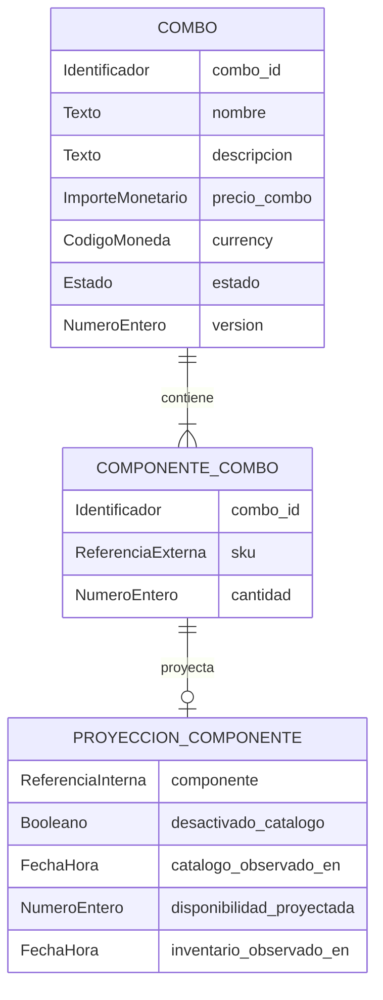

# Modelo lógico — `combos` (`combos-svc`)

- **Issue:** #58 — `[Hito 2][BD] Implementar persistencia de combos-svc`
- **Responsable:** Marco Renato Castilla Huanca
- **Bounded context:** Combos
- **Microservicio:** `combos-svc`
- **Schema objetivo:** `combos`
- **Última actualización:** `2026-10-03`
- **Estado:** `APROBADO PARA DERIVACIÓN FÍSICA`

## 1. Fuentes

- `Modelo_Conceptual.md`
- `Arquitectura.md`
- `Contrato_Api.md`
- `api/openapi.yaml`
- `api/kit-integracion.md`
- `asyncapi/asyncapi.yaml`
- `specs/SPEC-002-gestion-combos-productos.md`
- `hu/HU-002-gestion-combos-productos.md`
- `wireframes/flows/WF-002-gestion-combos-productos.md`
- `flujos/FLOW-002-gestion-combos-productos.md`
- `bd/CONVENCIONES_BD.md`
- issue #58

La precedencia aplicada es:

```text
reglas funcionales y contratos
        ↓
Modelo_Conceptual / Arquitectura
        ↓
modelo lógico
        ↓
modelo físico
```

Una decisión física no puede convertir una referencia externa en ownership local.

---

## 2. Propósito

Definir la información que pertenece a `combos-svc` y las invariantes que deben conservarse independientemente de PostgreSQL.

El modelo lógico no define:

- tipos PostgreSQL;
- índices;
- PK surrogate;
- triggers;
- funciones;
- grants;
- detalles de Supabase.

---

## 3. Ownership

### 3.1. Datos propios

Combos es autoridad sobre:

- definición administrativa del combo;
- identidad del combo;
- nombre y descripción;
- composición;
- cantidad requerida de cada componente;
- precio propio del combo;
- moneda asociada al precio propio;
- estado administrativo;
- versión lógica;
- disponibilidad informativa derivada;
- proyecciones locales reconstruibles necesarias para resolver elegibilidad/disponibilidad.

### 3.2. Datos externos

No posee:

- producto/SKU y su estado maestro — `catalog-svc`;
- precio regular/oferta de componentes — `pricing-svc`;
- stock, reservas y consumo — `inventory-svc`;
- promociones/cupones — `promotions-svc`;
- pedido, checkout y pago — Ventas/Postventa.

---

## 4. Entidades lógicas

### 4.1. `COMBO`

**Identificador lógico:** `combo_id`

| Atributo | Naturaleza | Obligatorio | Descripción |
|---|---|---:|---|
| `combo_id` | Identificador | Sí | Identidad estable del combo. |
| `nombre` | Texto | Sí | Nombre comercial. |
| `descripcion` | Texto | No | Descripción administrativa/comercial. |
| `precio_combo` | Importe monetario | Sí | Precio propio del combo. |
| `currency` | Código de moneda | Sí | Moneda explícita del precio propio. |
| `estado` | Estado | Sí | `ACTIVO` / `INACTIVO`. |
| `version` | Número entero | Sí | Versión para concurrencia optimista. |

Reglas:

1. `nombre` no vacío.
2. `precio_combo > 0`.
3. `currency` obligatoria.
4. `version >= 0`.
5. `INACTIVO` implica no comprable.
6. `ACTIVO` no garantiza comprabilidad si un componente está desactivado o no existe disponibilidad verificable.
7. La definición administrativa se conserva ante desactivación de componentes.

---

### 4.2. `COMPONENTE_COMBO`

**Identificador lógico de negocio:** `(combo_id, sku)`

| Atributo | Naturaleza | Obligatorio | Descripción |
|---|---|---:|---|
| `combo_id` | Referencia interna | Sí | Combo propietario. |
| `sku` | Referencia externa | Sí | SKU vendible de Catálogo. |
| `cantidad` | Número entero | Sí | Cantidad requerida por unidad de combo. |

Reglas:

1. `cantidad > 0`.
2. El par `(combo_id, sku)` no se repite.
3. Un combo contiene al menos dos componentes distintos.
4. Solo se admiten SKU vendibles directos.
5. No se admiten combos anidados.
6. `sku` no transfiere ownership ni genera FK a Catálogo.

> El identificador lógico de negocio no obliga a usar una PK natural en el modelo físico. Las convenciones vigentes exigen PK surrogate UUID.

---

### 4.3. `PROYECCION_COMPONENTE`

**Identificador lógico:** la asociación `COMPONENTE_COMBO` a la que proyecta.

Representa una proyección reconstruible, opcional y local para un componente concreto del combo.

| Atributo | Naturaleza | Obligatorio | Descripción |
|---|---|---:|---|
| `componente` | Referencia interna | Sí | Componente del combo al que pertenece la proyección. |
| `desactivado_catalogo` | Booleano proyectado | Sí | Último estado observado de Catálogo. |
| `catalogo_observado_en` | Fecha/hora | No | Momento de observación de Catálogo. |
| `disponibilidad_proyectada` | Número entero proyectado | No | Cantidad informativa observada desde Inventario. |
| `inventario_observado_en` | Fecha/hora | No | Momento de observación de Inventario. |

Reglas:

1. Existe como máximo una proyección por componente.
2. Es reconstruible.
3. `disponibilidad_proyectada`, si existe, es `>= 0`.
4. No constituye saldo, reserva ni garantía de Inventario.
5. Catálogo e Inventario mantienen frescura separada.
6. La eliminación/reconstrucción de la proyección no altera la definición autoritativa del combo.

Esta forma evita declarar `sku` como identidad única local fuera del owner Catálogo y permite que el mismo SKU participe legítimamente en distintos combos.

---

## 5. Estados controlados

### Estado administrativo del combo

```text
ACTIVO
INACTIVO
```

`AGOTADO` y `NO_ELEGIBLE` son condiciones derivadas, no estados administrativos persistidos.

---

## 6. Relaciones

| Origen | Relación | Destino | Cardinalidad |
|---|---|---|---:|
| `COMBO` | contiene | `COMPONENTE_COMBO` | `1:2..N` |
| `COMPONENTE_COMBO` | referencia | SKU externo | `N:1` |
| `COMPONENTE_COMBO` | puede tener | `PROYECCION_COMPONENTE` | `1:0..1` |

---

## 7. Reglas funcionales

1. Todo combo contiene al menos dos SKU directos y distintos.
2. Cada cantidad requerida es positiva.
3. No se permiten combos anidados.
4. El precio del combo es positivo.
5. El precio del combo debe ser estrictamente menor que:
   - la suma regular de los componentes;
   - la suma pública vigente de los componentes.
6. La comparación monetaria solo se realiza sobre importes de moneda compatible.
7. La regla de precio depende de `pricing-svc`; no es una invariante puramente local de BD.
8. El componente debe existir y estar activo al crear/editar, validado mediante Catálogo.
9. Desactivar un producto/SKU componente vuelve al combo no elegible para nuevas ventas.
10. La disponibilidad informativa se deriva conceptualmente como:

```text
min(floor(disponibilidad_i / cantidad_requerida_i))
```

11. La disponibilidad del combo no reserva ni consume stock.
12. Ventas/Postventa orquesta la reserva/consumo real de los SKU.
13. Combos no consume ni restaura cupones.
14. Una actualización con versión obsoleta conserva la semántica `VERSION_CONFLICT`.

---

## 8. Datos autoritativos y proyectados

### Autoritativos

- definición del combo;
- nombre/descripción;
- precio y moneda del combo;
- estado;
- versión;
- composición;
- cantidades.

### Proyectados

| Dato | Owner original | Reconstruible |
|---|---|---:|
| estado observado de desactivación | Catálogo | Sí |
| disponibilidad observada | Inventario | Sí |

No se mantiene localmente una fuente maestra de precios de componentes.

---

## 9. Persistencia técnica necesaria

| Necesidad | Aplica | Motivo |
|---|---:|---|
| Outbox | Sí | Arquitectura y convenciones vigentes declaran Outbox para `combos`. |
| Inbox | Sí | Consume eventos `at-least-once`. |
| Idempotencia técnica | Sí | Deduplicación por mensaje/handler. |
| Proyección local | Sí | `component_projection`. |
| Jobs durables propios | No | No documentados actualmente. |

---

## 10. Diagrama lógico



---

## 11. Decisiones lógicas

| ID | Decisión | Justificación |
|---|---|---|
| `D-LOG-01` | `ACTIVO/INACTIVO` se separa de elegibilidad derivada. | OpenAPI solo publica esos estados administrativos. |
| `D-LOG-02` | La composición tiene identidad de negocio `(combo_id, sku)`. | Evita duplicados dentro del agregado. |
| `D-LOG-03` | `sku` es referencia externa sin FK. | Aislamiento de bounded contexts. |
| `D-LOG-04` | La proyección pertenece a un componente, no a un SKU global local. | Permite PK surrogate física y evita imponer unicidad global de SKU fuera de Catálogo. |
| `D-LOG-05` | Frescura de Catálogo e Inventario es independiente. | Una fuente no debe refrescar artificialmente a la otra. |
| `D-LOG-06` | Disponibilidad de combo es derivada, no una entidad autoritativa independiente. | DTO/read model ≠ entidad persistente. |
| `D-LOG-07` | Precio incluye moneda explícita. | Arquitectura y convenciones de dinero. |

---

## 12. Pendientes contractuales

| ID | Pregunta | Impacto |
|---|---|---|
| `P-LOG-01` | `catalog.product.deactivated.data` sigue como `GenericData`. | Adapter/evento; no bloquea esquema base. |
| `P-LOG-02` | `inventory.stock.changed.data` sigue como `GenericData`. | Adapter/agregación; no bloquea esquema base. |
| `P-LOG-03` | OpenAPI de Combo aún no expone `currency`. | Debe alinearse antes de cerrar la implementación HTTP; no bloquea la migración de Hito 2. |
| `P-LOG-04` | AsyncAPI no publica todavía un mensaje con `x-producer: combos-svc`. | Outbox se crea por arquitectura/convención; no se insertan mensajes no contractuales. |

**Resultado lógico:** `APROBADO PARA DERIVACIÓN FÍSICA`
