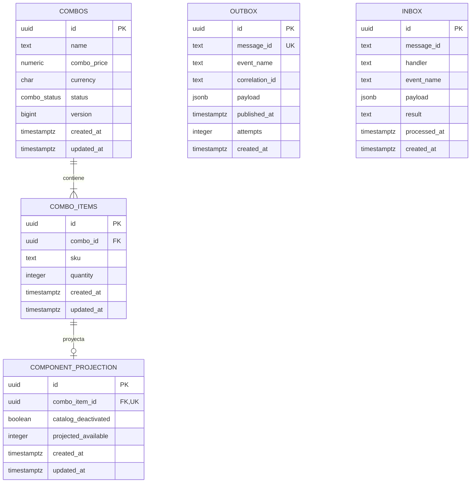

# Modelo físico — `combos` (`combos-svc`)

> Ubicación objetivo: `database/combos/physical-model.md`.
>
> Este documento materializa `logical-model.md` y aplica `bd/CONVENCIONES_BD.md` y el procedimiento vigente de `database/README.md`.

---

## 1. Identificación

- **Issue:** #58 — `[Hito 2][BD] Implementar persistencia de combos-svc`
- **Responsable:** Marco Renato Castilla Huanca
- **Bounded context:** Combos
- **Microservicio:** `combos-svc`
- **Schema:** `combos`
- **Owner exclusivo:** `combos-svc`
- **Owner PostgreSQL de despliegue:** `po_combos_owner`
- **Última actualización:** `2026-10-03`
- **Estado:** `EN REVISIÓN`
- **Modelo lógico de origen:** `logical-model.md`
- **Migraciones:** `migrations/`
- **Validación:** `validation.sql`
- **Motor objetivo:** PostgreSQL / Supabase

---

## 2. Fuentes y precedencia

Fuentes revisadas:

- `Modelo_Conceptual.md`
- `Arquitectura.md`
- `Contrato_Api.md`
- `api/openapi.yaml`
- `api/kit-integracion.md`
- `asyncapi/asyncapi.yaml`
- `SPEC-002`
- `HU-002`
- `WF-002`
- `FLOW-002`
- `logical-model.md`
- `bd/CONVENCIONES_BD.md`
- `bd/plantillas/physical-model.md`
- `bd/plantillas/migration.sql`
- `bd/plantillas/validation.sql`
- `database/README.md`
- `database/bootstrap.sql`
- `database/migrate.py`
- issue #58

Precedencia:

```text
fuentes funcionales y contractuales
        ↓
modelo conceptual / arquitectura
        ↓
logical-model.md
        ↓
CONVENCIONES_BD
        ↓
physical-model.md
        ↓
migrations/
        ↓
validation.sql
```

Cuando `CONVENCIONES_BD.md` contradice un contrato ejecutable, se respeta la regla de precedencia de la propia convención: prevalece la fuente oficial y la excepción se documenta.

---

## 3. Propósito

Materializar el bounded context Combos como un diseño PostgreSQL/Supabase aislado, trazable y compatible con el mecanismo oficial de migraciones.

Este documento define:

- tablas;
- tipos;
- PK surrogate UUID;
- FK internas;
- constraints;
- índices;
- triggers;
- proyecciones locales;
- Inbox/Outbox;
- concurrencia;
- excepciones de tipos respaldadas por contrato;
- despliegue y validación.

---

## 4. Alcance del bounded context

### 4.1. Datos que posee

- definición de combos;
- precio propio y moneda;
- estado y versión;
- componentes y cantidades;
- proyección local por componente.

### 4.2. Datos que NO posee

- SKU/producto/estado maestro → `catalog-svc`;
- precios de componentes → `pricing-svc`;
- stock/reservas → `inventory-svc`;
- cupones/promociones → `promotions-svc`;
- pedidos/pagos → Ventas/Postventa.

Una referencia externa no genera FK cross-context.

---

## 5. Principios de diseño físico

### 5.1. Aislamiento

Todo el modelo vive en:

```text
combos
```

El bootstrap transversal crea:

```text
schema = combos
owner  = po_combos_owner
```

Las migraciones propias **no** crean roles ni modifican otros schemas.

Prohibido:

- FK cross-schema;
- vistas cross-service;
- SQL directo hacia otros bounded contexts;
- `dblink`;
- `postgres_fdw`;
- FK hacia `auth.users`.

### 5.2. Convenciones aplicadas y excepciones

| Decisión local | ¿Apartamiento? | Motivo | Evidencia |
|---|---:|---|---|
| PK surrogate UUID en todas las tablas | No | Convención §6.1 | `CONVENCIONES_BD.md` |
| Dinero `numeric(12,2)` y moneda `char(3)` | No | Convención §8.1 | `CONVENCIONES_BD.md` |
| `message_id` de Inbox/Outbox como `text` | **Sí** | AsyncAPI lo publica como `string` sin `format: uuid`; la propia convención manda priorizar contrato | `asyncapi/asyncapi.yaml` `MessageEnvelope` |
| `correlation_id` de Inbox/Outbox como `text` | **Sí** | AsyncAPI lo publica como `string` sin `format: uuid` y lo exige | `MessageEnvelope` |
| `operation_id` como `uuid NULL` | No | AsyncAPI sí declara `format: uuid` nullable | `MessageEnvelope` |
| La migración no contiene `BEGIN/COMMIT` | No | `database/migrate.py` envuelve cada versión en una transacción | `database/README.md` |
| `schema_migrations` queda fuera del inventario de dominio | No | La crea el ejecutor de migraciones, no el bounded context | `database/migrate.py` |

---

## 6. Inventario de tablas

| Tabla | Propósito | Origen | PK | Estabilidad |
|---|---|---|---|---|
| `combos` | Definición autoritativa de combo | `COMBO` | `id` | mutable |
| `combo_items` | Componentes/cantidades | `COMPONENTE_COMBO` | `id` | mutable |
| `component_projection` | Proyección local por componente | `PROYECCION_COMPONENTE` | `id` | mutable/reconstruible |
| `outbox` | Publicación transaccional | necesidad técnica | `id` | mutable técnica |
| `inbox` | Deduplicación de consumidores | necesidad técnica | `id` | append-only |

`combos.schema_migrations` no forma parte de este inventario: es creado y administrado por `database/migrate.py`.

---

## 7. Enumeraciones y tipos propios

### 7.1. `combos.combo_status`

Valores:

```text
ACTIVO
INACTIVO
```

Usado por:

- `combos.status`

Justificación: ciclo de vida propio y contractual del agregado Combo.

---

## 8. Modelo por tabla

### 8.1. `combos`

**Origen lógico:** `COMBO`  
**Propósito:** definición comercial/administrativa del combo.  
**Estabilidad:** mutable.

| Columna | Tipo PostgreSQL | Nulo | Default | Restricciones | Origen |
|---|---|---:|---|---|---|
| `id` | `uuid` | No | `gen_random_uuid()` | PK | `combo_id` |
| `name` | `text` | No | — | no vacío | nombre |
| `description` | `text` | Sí | — | — | descripción |
| `combo_price` | `numeric(12,2)` | No | — | `> 0`, no `NaN` | precio |
| `currency` | `char(3)` | No | — | no vacío | moneda |
| `status` | `combos.combo_status` | No | `ACTIVO` | enum | estado |
| `version` | `bigint` | No | `0` | `>= 0` | versión |
| `created_at` | `timestamptz` | No | `now()` | — | técnico |
| `updated_at` | `timestamptz` | No | `now()` | trigger | técnico |

**PK:** `pk_combos (id)`.

**Índice:** `ix_combos_status (status)` porque el listado administrativo filtra por estado.

**Borrado:** `status` representa baja de negocio. No se añade `deleted_at`. La API administrativa desactiva; no borra físicamente el combo.

**Concurrencia:** optimistic locking mediante `version`.

---

### 8.2. `combo_items`

**Origen lógico:** `COMPONENTE_COMBO`  
**Propósito:** relación Combo–SKU con cantidad.  
**Estabilidad:** mutable.

| Columna | Tipo | Nulo | Default | Restricciones |
|---|---|---:|---|---|
| `id` | `uuid` | No | `gen_random_uuid()` | PK |
| `combo_id` | `uuid` | No | — | FK interna |
| `sku` | `text` | No | — | no vacío |
| `quantity` | `integer` | No | — | `> 0` |
| `created_at` | `timestamptz` | No | `now()` | — |
| `updated_at` | `timestamptz` | No | `now()` | trigger |

**PK:** `pk_combo_items (id)`.

**Única:** `uq_combo_items_combo_sku (combo_id, sku)`.

**FK:** `fk_combo_items_combo_id` → `combos(id)` `ON DELETE CASCADE`.

El índice generado por `uq_combo_items_combo_sku` empieza en `combo_id` y cubre la FK; no se crea un índice redundante adicional.

**Índice:** `ix_combo_items_sku (sku)` para localizar todos los componentes afectados por eventos de Catálogo/Inventario.

---

### 8.3. `component_projection`

**Origen lógico:** `PROYECCION_COMPONENTE`  
**Propósito:** proyección reconstruible por componente.  
**Estabilidad:** mutable/reconstruible.

| Columna | Tipo | Nulo | Default | Restricciones |
|---|---|---:|---|---|
| `id` | `uuid` | No | `gen_random_uuid()` | PK |
| `combo_item_id` | `uuid` | No | — | FK + UNIQUE |
| `catalog_deactivated` | `boolean` | No | — | — |
| `catalog_observed_at` | `timestamptz` | Sí | — | — |
| `projected_available` | `integer` | Sí | — | `>= 0` si existe |
| `inventory_observed_at` | `timestamptz` | Sí | — | — |
| `created_at` | `timestamptz` | No | `now()` | — |
| `updated_at` | `timestamptz` | No | `now()` | trigger |

**PK:** `pk_component_projection (id)`.

**Única:** `uq_component_projection_combo_item_id (combo_item_id)`.

**FK:** `fk_component_projection_combo_item_id` → `combo_items(id)` `ON DELETE CASCADE`.

La proyección no tiene `sku` propio: el SKU se obtiene mediante la relación interna con `combo_items`. Esto evita declarar unicidad de SKU fuera de Catálogo.

---

### 8.4. `outbox`

**Origen:** necesidad técnica transversal.  
**Estabilidad:** mutable técnica; exenta de `updated_at`.

Columnas:

| Columna | Tipo | Nulo | Default |
|---|---|---:|---|
| `id` | `uuid` | No | `gen_random_uuid()` |
| `message_id` | `text` | No | — |
| `event_name` | `text` | No | — |
| `kind` | `text` | No | — |
| `schema_version` | `integer` | No | `1` |
| `correlation_id` | `text` | No | — |
| `causation_id` | `text` | Sí | — |
| `operation_id` | `uuid` | Sí | — |
| `occurred_at` | `timestamptz` | No | — |
| `payload` | `jsonb` | No | — |
| `published_at` | `timestamptz` | Sí | — |
| `attempts` | `integer` | No | `0` |
| `last_error` | `text` | Sí | — |
| `created_at` | `timestamptz` | No | `now()` |

**Única:** `uq_outbox_message_id`.

**Índice:** `ix_outbox_pending (published_at, occurred_at)`.

`published_at IS NULL` significa pendiente; no se crea columna `status`.

---

### 8.5. `inbox`

**Origen:** deduplicación técnica.  
**Estabilidad:** append-only; exenta de `updated_at`.

| Columna | Tipo | Nulo | Default |
|---|---|---:|---|
| `id` | `uuid` | No | `gen_random_uuid()` |
| `message_id` | `text` | No | — |
| `handler` | `text` | No | — |
| `event_name` | `text` | No | — |
| `correlation_id` | `text` | No | — |
| `operation_id` | `uuid` | Sí | — |
| `payload` | `jsonb` | No | — |
| `processed_at` | `timestamptz` | No | `now()` |
| `result` | `text` | No | — |
| `created_at` | `timestamptz` | No | `now()` |

**Única:** `uq_inbox_message_handler (message_id, handler)`.

La deduplicación no es global por `message_id`: handlers legítimamente distintos pueden procesar el mismo mensaje.

---

## 9. Referencias externas

| Tabla | Columna | Tipo | Owner | Fuente |
|---|---|---|---|---|
| `combo_items` | `sku` | `text` | Catálogo | HTTP/evento |
| `combos` | `currency` | `char(3)` | valor propio del precio de Combo; coherente con Pricing | creación/validación |
| `outbox/inbox` | `correlation_id` | `text` | productor de la operación | AsyncAPI |
| `outbox/inbox` | `operation_id` | `uuid` | productor | AsyncAPI |

No hay FK hacia owners externos.

---

## 10. Constraints e invariantes

| Regla lógica | Implementación física |
|---|---|
| nombre no vacío | `ck_combos_name_not_blank` |
| precio positivo/finito | `ck_combos_combo_price_positive` |
| moneda no vacía | `ck_combos_currency_not_blank` |
| versión `>=0` | `ck_combos_version_non_negative` |
| cantidad `>0` | `ck_combo_items_quantity_positive` |
| SKU no vacío | `ck_combo_items_sku_not_blank` |
| SKU no repetido por combo | `uq_combo_items_combo_sku` |
| mínimo dos componentes | constraint trigger diferible |
| una proyección por componente | `uq_component_projection_combo_item_id` |
| disponibilidad proyectada no negativa | `ck_component_projection_available_non_negative` |
| precio menor que componentes | aplicación + `pricing-svc` |
| SKU activo/directo | aplicación + `catalog-svc` |

---

## 11. Foreign keys

| Origen | Destino | Constraint | ON DELETE |
|---|---|---|---|
| `combo_items.combo_id` | `combos.id` | `fk_combo_items_combo_id` | CASCADE |
| `component_projection.combo_item_id` | `combo_items.id` | `fk_component_projection_combo_item_id` | CASCADE |

Las dos dependencias son totalmente internas.

---

## 12. Índices

| Índice | Tabla | Columnas | Tipo | Justificación |
|---|---|---|---|---|
| `ix_combos_status` | `combos` | `status` | btree | filtro administrativo |
| `ix_combo_items_sku` | `combo_items` | `sku` | btree | fan-out de eventos por SKU |
| `ix_outbox_pending` | `outbox` | `published_at, occurred_at` | btree | polling/orden del relay |

Los índices de `UNIQUE` cubren las FK por su primera columna y evitan índices redundantes.

---

## 13. Funciones y triggers

### 13.1. `fn_set_updated_at` + triggers

Actualiza automáticamente `updated_at` en:

- `combos`;
- `combo_items`;
- `component_projection`.

Triggers:

- `trg_combos_updated_at`
- `trg_combo_items_updated_at`
- `trg_component_projection_updated_at`

Inbox/Outbox están exentas según las convenciones.

### 13.2. Mínimo dos componentes

Funciones:

- `fn_assert_combo_min_components`
- `fn_trg_combo_min_components`

Constraint triggers diferibles:

- `trg_combos_min_components`
- `trg_combo_items_min_components`

Se evalúan al cierre de la transacción, permitiendo el estado transitorio 0 → 1 → 2 componentes durante una creación.

La función bloquea la fila padre con `FOR UPDATE` antes de contar componentes, serializando modificaciones concurrentes de composición sobre el mismo combo en el aislamiento ordinario del despliegue.

---

## 14. Outbox e Inbox

### 14.1. Aplicabilidad

| Tabla | Aplica | Motivo |
|---|---:|---|
| `outbox` | Sí | Arquitectura/convenciones declaran publicación transaccional para Combos. |
| `inbox` | Sí | Consume eventos `at-least-once`. |

No se inventan eventos de negocio: mientras AsyncAPI no defina un mensaje producido por `combos-svc`, el servicio no inserta mensajes contractuales inexistentes.

### 14.2. Outbox

Cambio de negocio y registro Outbox se realizan en la misma transacción.

El relay selecciona `published_at IS NULL`, publica después del commit y actualiza:

- `published_at`;
- `attempts`;
- `last_error`.

### 14.3. Inbox

La unicidad `(message_id, handler)` evita efectos duplicados por handler.

El registro del Inbox y los efectos locales forman parte de la misma transacción de consumo.

---

## 15. Idempotencia y concurrencia

### 15.1. Idempotencia

| Operación | Identificador | Restricción | Replay |
|---|---|---|---|
| consumo de mensaje | `(message_id, handler)` | `uq_inbox_message_handler` | no repite efectos del mismo handler |
| publicación | `message_id` | `uq_outbox_message_id` | no duplica registro de publicación |

No se impone `UNIQUE(operation_id)` en Combos porque ninguna regla vigente define una operación de negocio local idempotente identificada globalmente por ese campo.

### 15.2. Concurrencia

| Entidad | Estrategia | Implementación |
|---|---|---|
| `combos` | optimista | `version` en UPDATE condicional |
| composición | serialización local + validación diferida | lock de padre + constraint trigger |

---

## 16. Proyecciones locales

| Dato | Owner | Actualización | Versionado/frescura | Reconstruible |
|---|---|---|---|---:|
| `catalog_deactivated` | Catálogo | validación/evento | `catalog_observed_at` | Sí |
| `projected_available` | Inventario | evento/consulta autorizada | `inventory_observed_at` | Sí |

No se modelan `product_id` ni `location_id` hasta que los payloads `GenericData` se especialicen.

---

## 17. Reglas de escritura

| Regla | Implementación |
|---|---|
| Idempotencia | Inbox/Outbox UNIQUE |
| Concurrencia | `version` + lock de composición |
| Ciclo de vida | `combo_status` |
| Baja comercial | `INACTIVO` |
| Auditoría técnica | timestamps + mensajería |
| Outbox transaccional | tabla `outbox` |

---

## 18. Excepciones de timestamps y borrado

| Tabla | Excepción | Motivo |
|---|---|---|
| `outbox` | sin `updated_at` / `deleted_at` | infraestructura con timestamps operativos propios |
| `inbox` | sin `updated_at` / `deleted_at` | registro de deduplicación |
| `combos` | sin `deleted_at` | el ciclo de vida se expresa con `status` |
| `combo_items` | sin `deleted_at` | relación interna del agregado; las modificaciones preservan invariantes |
| `component_projection` | sin `deleted_at` | proyección reconstruible |

Todas las tablas sí poseen `created_at`.

---

## 19. Diagrama físico



---

## 20. Trazabilidad lógico → físico

| Elemento lógico | Materialización |
|---|---|
| `COMBO` | `combos` |
| `COMPONENTE_COMBO` | `combo_items` |
| `PROYECCION_COMPONENTE` | `component_projection` |
| identidad lógica `(combo_id,sku)` | `uq_combo_items_combo_sku` |
| mínimo dos componentes | constraint triggers |
| referencia SKU | `combo_items.sku` sin FK externa |
| disponibilidad derivada | consulta sobre items + proyección; sin tabla propia |
| Outbox | `outbox` |
| Inbox | `inbox` |

---

## 21. Trazabilidad funcional

| Fuente | Elemento físico |
|---|---|
| SPEC/HU/WF/FLOW-002 | combo, componentes, precio, disponibilidad/elegibilidad |
| OpenAPI | estado, versión, estructuras de Combo |
| AsyncAPI | Inbox, metadatos de mensajes, tipos contractuales |
| Modelo Conceptual | ownership de Combo y proyección |
| Arquitectura | tablas conceptuales, Outbox Relay, aislamiento |
| CONVENCIONES_BD | PK UUID, timestamps, dinero, nomenclatura, Inbox/Outbox |
| database/README | ubicación/versionado y ejecución transaccional |
| logical-model.md | entidades e invariantes |

---

## 22. Decisiones físicas

| ID | Decisión | Alternativas | Justificación | Impacto |
|---|---|---|---|---|
| `D-PHY-01` | `combos.id` UUID materializa `combo_id` | columna contractual separada | PK surrogate obligatoria; API serializa UUID como string | `combos` |
| `D-PHY-02` | `combo_items` usa `id` PK + UQ `(combo_id,sku)` | PK natural | convención prohíbe PK natural | `combo_items` |
| `D-PHY-03` | proyección 1:1 por `combo_item_id` | PK/UNIQUE por SKU | evita unicidad global de SKU fuera de Catálogo | `component_projection` |
| `D-PHY-04` | precio `numeric(12,2)` + `char(3)` | numeric libre/text | convención monetaria | `combos` |
| `D-PHY-05` | tipos text para message/correlation IDs | UUID | AsyncAPI prevalece sobre convención física contradictoria | Inbox/Outbox |
| `D-PHY-06` | UQ de FK cubre índice referenciante | índice adicional | evita índice redundante | items/projection |
| `D-PHY-07` | validation excluye `schema_migrations` de checks de dominio | tratarlo como tabla del BC | el ledger lo crea `migrate.py` con PK text | validación |
| `D-PHY-08` | constraint trigger diferible para mínimo 2 | solo aplicación | protege invariante local al commit | composición |

---

## 23. Decisiones pendientes

| ID | Pregunta | Fuente | Impacto | ¿Bloquea migración? |
|---|---|---|---|---:|
| `P-PHY-01` | OpenAPI Combo no expone `currency`. | OpenAPI/Arquitectura | implementación HTTP futura | No |
| `P-PHY-02` | ¿Qué evento contractual publicará `combos-svc`? | AsyncAPI | uso efectivo de Outbox | No |
| `P-PHY-03` | Payload final de `catalog.product.deactivated`. | AsyncAPI | adapter de proyección | No |
| `P-PHY-04` | Granularidad final de `inventory.stock.changed`. | AsyncAPI | adapter de proyección | No |
| `P-PHY-05` | Runtime role/grants concretos todavía no están definidos por nombre en el repositorio. | database/README | permisos de servicio runtime | No para DDL; sí antes de backend productivo |

---

## 24. Migraciones

Ubicación:

```text
database/combos/migrations/
```

Versión inicial:

```text
0001_create_combos_persistence.sql
```

La migración:

- no contiene `BEGIN/COMMIT`;
- asume `database/bootstrap.sql` ya ejecutado;
- modifica únicamente `combos`;
- no crea roles;
- es ejecutada por `database/migrate.py` con `SET ROLE po_combos_owner`;
- no depende de objetos de otros contexts.

---

## 25. Validación

Ubicación:

```text
database/combos/validation.sql
```

La validación es **solo lectura** y verifica:

1. schema/owner;
2. tablas esperadas;
3. tipos y columnas;
4. PK UUID;
5. ausencia de PK natural/serial;
6. FK internas y ausencia de cross-context;
7. índices de FK;
8. checks/unique;
9. enum;
10. timestamps/triggers;
11. dinero;
12. Inbox/Outbox;
13. min-2 componentes mediante metadata de triggers;
14. proyección;
15. RLS deshabilitado;
16. aislamiento PUBLIC;
17. exclusión explícita de `schema_migrations` de los checks de dominio.

El script devuelve PASS/FAIL y termina con error en `psql` si existe algún fallo obligatorio.

---

## 26. Despliegue Supabase

Prerrequisito:

```text
database/bootstrap.sql
```

Ejecución:

```text
python database/migrate.py combos
psql -X -v ON_ERROR_STOP=1 -f database/combos/validation.sql
```

Registrar posteriormente:

- commit;
- versión;
- checksum;
- PostgreSQL;
- fecha;
- resultado;
- evidencia local;
- evidencia Supabase cuando exista acceso;
- PR #58.

---

## 27. Checklist de aprobación

### Correspondencia
- [x] Entidades lógicas materializadas.
- [x] Tablas justificadas.
- [x] Cardinalidades preservadas.
- [x] Ownership externo preservado.

### Aislamiento
- [x] Sin FK cross-context.
- [x] Sin SQL cross-service.
- [x] Sin FK a `auth.users`.

### Identificadores
- [x] Todas las PK del dominio son UUID surrogate.
- [x] Sin serial/autoincremento.
- [x] SKU permanece natural key externa, no PK.

### Tipos/timestamps
- [x] Precio `numeric(12,2)`.
- [x] Moneda `char(3)`.
- [x] Instantes `timestamptz`.
- [x] `created_at` en todas las tablas.
- [x] `updated_at` y triggers en tablas mutables de negocio/proyección.
- [x] Inbox/Outbox exentas de `updated_at`.

### Integridad
- [x] Constraints nombradas.
- [x] Funciones/triggers con prefijos.
- [x] FK internas con cobertura de índice.
- [x] Min-2 componentes protegido al commit.

### Mensajería
- [x] Inbox y Outbox definidos.
- [x] Dedupe por `(message_id,handler)`.
- [x] UQ de publicación por `message_id`.
- [x] Excepción de tipos AsyncAPI documentada.

### Implementación
- [x] Migración generada con nomenclatura oficial.
- [x] Sin `BEGIN/COMMIT` interno.
- [x] Validation read-only generada.
- [ ] Ejecución desde una base limpia pendiente.
- [ ] Reejecución con `migrate.py` pendiente.
- [ ] Evidencia Supabase pendiente.

### Evidencia
- [ ] Validación local ejecutada.
- [ ] Evidencia de checksum/ledger.
- [ ] PR asociado con evidencia final.

---

## 28. Resultado de revisión

**Resultado:** `REQUIERE CAMBIOS OPERATIVOS, NO DE DISEÑO`

**Observaciones:**

1. Diseño, migración y validación quedaron alineados con las convenciones/plantillas vigentes de `master`.
2. Falta ejecutar bootstrap + migración + validación en PostgreSQL limpio para convertir el resultado en `APROBADO`.
3. La evidencia Supabase permanece pendiente hasta disponer del entorno/autorización.
4. OpenAPI Combo debe alinear `currency` antes de implementar completamente el endpoint.

**Revisor:** ChatGPT  
**Fecha:** `2026-10-03`
