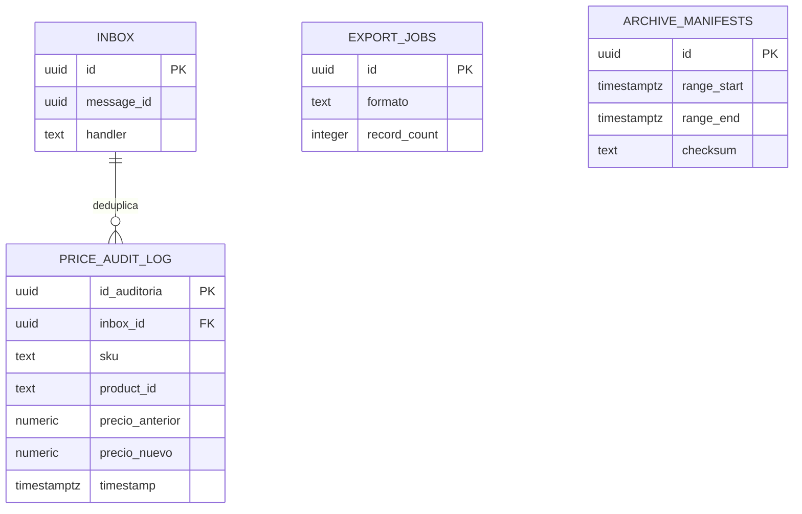

# Auditoría de precios — Modelo lógico y físico de `price-audit-svc`

## 1. Identificación

- Issue: [#56](https://github.com/Taller-SW-Web/Productos-y-Ofertas-docs/issues/56).
- Responsable: Leonardo Vera Rodríguez (`LeonardoVera`), rama `vera`.
- Bounded context/schema/owner exclusivo: `price_audit` / `price-audit-svc`.
- Última actualización: 2026-10-03. Estado: **EN REVISIÓN**, no aprobado ni desplegado a Supabase.
- Modelo lógico de origen: derivación integrada en §3/§20 desde fuentes vigentes.
- Migración: [0001_create_price_audit.sql](migrations/0001_create_price_audit.sql).
- Validación: [validation.sql](validation.sql). Evidencia: [validation-report.md](validation-report.md).
- Motor objetivo: PostgreSQL ≥15 / Supabase. Motor probado: PostgreSQL 18.3, PGlite 0.5.8/WASM.
- Base de fuentes revisada: `26ce90332bf677b20e8350553ccd4c6e8af21bf1`; SQL nuevo aún sin commit al validar.

## 2. Fuentes y precedencia

| Fuente | Derivación |
|---|---|
| [SPEC](../../specs/SPEC-014-historial-auditoria-precios.md), [HU](../../hu/HU-014-historial-auditoria-precios.md) | Reglas funcionales/invariantes |
| [WF](../../wireframes/flows/WF-014-historial-auditoria-precios.md), [FLOW](../../flujos/FLOW-014-historial-auditoria-precios.md) | Operaciones y estados; no definen permisos SQL |
| [OpenAPI](../../api/openapi.yaml), [AsyncAPI](../../asyncapi/asyncapi.yaml), [Contrato API](../../Contrato_Api.md) | Campos, enum de ciclo de vida, mensajes y referencias |
| [Modelo conceptual](../../Modelo_Conceptual.md), [Arquitectura](../../Arquitectura.md) | Entidades, ownership, tablas base y aislamiento |
| [Convenciones BD](../CONVENCIONES_BD.md) | Nombres, tipos, PK, timestamps, índices y mensajería |
| [Plantilla física](../plantillas/physical-model.md), [migración](../plantillas/migration.sql), [validación](../plantillas/validation.sql) | Estructura adaptada por contexto; no copiar ejemplos/grants indiscriminadamente |
| [Procedimiento #49](../../database/README.md), [ejecutor](../../database/migrate.py), [bootstrap](../../database/bootstrap.sql) | Owner/deployer/runtime, transacciones y ledger SHA-256 |

Precedencia: fuente funcional/contrato → conceptual → derivación lógica (§3) → físico → migración → validación. Estas plantillas son guías de entrega, no autorizaciones de despliegue. Las rutas provisionales no se convierten en estables por persistirlas.

## 3. Propósito y modelo lógico de origen

Un mensaje procesado se registra en Inbox por `(message_id, handler)`. Puede producir N asientos (por ejemplo, regular y oferta) en la misma transacción. El asiento tiene una identidad UUID propia y conserva todos los campos del contrato; referencia al inbox solo dentro del schema. Exportación registra formato, filtros aplicados y cantidad evaluada por el servidor. El manifiesto identifica una ventana temporal y el objeto archivado, con pruebas de conteo/checksum/recuperabilidad antes de retirar originales.

El modelo relacional se deriva aquí de Modelo_Conceptual §6, Arquitectura §7.2/§20 y los contratos. No existe un `logical-model.md` independiente versionado para este contexto; no se atribuye aprobación a un archivo inexistente. La revisión de BD incluye esta derivación lógica (§20).

## 4. Alcance del bounded context

Posee: Bitácora append-only, trabajos de exportación, manifiestos/retención y deduplicación de consumo.

No posee: Precios/moneda autoritativos: Pricing; productos y SKU: Catálogo; usuarios: Seguridad; archivo binario: puerto de almacenamiento del worker, no otra tabla de negocio. Referencias externas escalares, sin FK, acceso SQL ni transferencia de ownership. Esta entrega implementa persistencia; no controllers, broker, parser ni workers productivos.

## 5. Principios de diseño físico

Aplicar [Convenciones BD](../CONVENCIONES_BD.md) sin reescribirlas por servicio. PK UUID con gen_random_uuid, nombres explícitos, timestamptz para instantes, dinero numeric(12,2), enums locales, FK solo internas con índice, sin RLS en escritura. Ninguna FK a auth.users, ningún join hacia otro servicio. Decisiones/excepciones locales en §22 y límites en §23.

`schema_migrations` pertenece al mecanismo #49: PK natural `version text`, `checksum text`, `applied_at timestamptz`; excepción técnica preexistente, fuera de entidades de negocio/manifest UUID. No crear un segundo ledger ni cambiar migrate.py para redefinir su identidad.

## 6. Inventario de tablas

| Tabla | Elemento lógico/técnico | Origen | PK | Estabilidad |
|---|---|---|---|---|
| `price_audit.inbox` | DEDUPLICACIÓN | AsyncAPI pricing.price.changed; Convenciones §10 | id UUID | registro inmutable |
| `price_audit.price_audit_log` | REGISTRO DE AUDITORÍA | Modelo_Conceptual §6; SPEC-014 §§3–4; RegistroAuditoriaPrecio | id_auditoria UUID | append-only; retiro caliente excepcional verificado |
| `price_audit.export_jobs` | TRABAJO DE EXPORTACIÓN | Modelo_Conceptual §6; Arquitectura §20; TrabajoExportacion | id UUID | mutable, estado propio |
| `price_audit.archive_manifests` | MANIFIESTO DE ARCHIVO | Modelo_Conceptual §6; SPEC-014 archivo verificable | id UUID | metadata operativa mutable, restringida |

## 7. Enumeraciones y tipos propios

| Tipo local | Valores | Motivo |
|---|---|---|
| `price_audit.export_job_status` | 'QUEUED','PROCESSING','COMPLETED','FAILED_GENERAL' | Ciclo de vida propio publicado por OpenAPI |

Tipo de precio, operación, canal, moneda y códigos de error no son enums PostgreSQL compartidos. Canal es text nullable; moneda char(3) cuando el contrato la informa. Nunca reutilizar tipos de otro contexto.

## 8. Modelo por tabla

### 8.1. `price_audit.inbox`

Origen: DEDUPLICACIÓN; AsyncAPI pricing.price.changed; Convenciones §10. Estabilidad: registro inmutable.

| Columna | Tipo | Nulo | Default | Origen / integridad |
|---|---|---|---|---|
| `id` | `uuid` | No | `gen_random_uuid()` | Persistencia técnica trazada en §§6/22 |
| `message_id` | `uuid` | No | `—` | Contrato funcional/HTTP/asíncrono según origen de tabla |
| `handler` | `text` | No | `—` | Contrato funcional/HTTP/asíncrono según origen de tabla |
| `event_name` | `text` | No | `—` | Contrato funcional/HTTP/asíncrono según origen de tabla |
| `correlation_id` | `uuid` | Sí | `—` | Contrato funcional/HTTP/asíncrono según origen de tabla |
| `payload` | `jsonb` | No | `—` | Contrato funcional/HTTP/asíncrono según origen de tabla |
| `processed_at` | `timestamptz` | No | `now()` | Contrato funcional/HTTP/asíncrono según origen de tabla |
| `result` | `text` | No | `—` | Contrato funcional/HTTP/asíncrono según origen de tabla |
| `created_at` | `timestamptz` | No | `now()` | Persistencia técnica trazada en §§6/22 |

Constraints (expresiones completas en migración):

| Nombre | Definición |
|---|---|
| `pk_inbox` | `PRIMARY KEY (id)` |
| `uq_inbox_message_handler` | `UNIQUE (message_id, handler)` |

Índices: los índices de PK/UNIQUE de las constraints anteriores; no índices adicionales redundantes.
Sin updated_at/deleted_at: excepción append-only/infraestructura de Convenciones §7.3.
Borrado: runtime sin DELETE/TRUNCATE. FK internas usan RESTRICT; no cascadas a otros servicios. Política de retención/operación detallada en §§17–18.

### 8.2. `price_audit.price_audit_log`

Origen: REGISTRO DE AUDITORÍA; Modelo_Conceptual §6; SPEC-014 §§3–4; RegistroAuditoriaPrecio. Estabilidad: append-only; retiro caliente excepcional verificado.

| Columna | Tipo | Nulo | Default | Origen / integridad |
|---|---|---|---|---|
| `id_auditoria` | `uuid` | No | `gen_random_uuid()` | Identidad contractual / PK UUID |
| `inbox_id` | `uuid` | No | `—` | Persistencia técnica trazada en §§6/22 |
| `sku` | `text` | No | `—` | Contrato funcional/HTTP/asíncrono según origen de tabla |
| `product_id` | `text` | No | `—` | Contrato funcional/HTTP/asíncrono según origen de tabla |
| `tipo_precio` | `text` | No | `—` | Contrato funcional/HTTP/asíncrono según origen de tabla |
| `precio_anterior` | `numeric(12,2)` | Sí | `—` | Contrato funcional/HTTP/asíncrono según origen de tabla |
| `precio_nuevo` | `numeric(12,2)` | Sí | `—` | Contrato funcional/HTTP/asíncrono según origen de tabla |
| `variacion_porcentual` | `numeric` | Sí | `—` | Contrato funcional/HTTP/asíncrono según origen de tabla |
| `tipo_operacion` | `text` | No | `—` | Contrato funcional/HTTP/asíncrono según origen de tabla |
| `canal_origen` | `text` | No | `—` | Contrato funcional/HTTP/asíncrono según origen de tabla |
| `motivo_cambio` | `text` | No | `—` | Contrato funcional/HTTP/asíncrono según origen de tabla |
| `batch_id` | `uuid` | Sí | `—` | Contrato funcional/HTTP/asíncrono según origen de tabla |
| `usuario_id` | `text` | Sí | `—` | Contrato funcional/HTTP/asíncrono según origen de tabla |
| `usuario_email` | `text` | Sí | `—` | Contrato funcional/HTTP/asíncrono según origen de tabla |
| `ip_origen` | `text` | Sí | `—` | Contrato funcional/HTTP/asíncrono según origen de tabla |
| `timestamp` | `timestamptz` | No | `—` | Contrato funcional/HTTP/asíncrono según origen de tabla |
| `created_at` | `timestamptz` | No | `now()` | Persistencia técnica trazada en §§6/22 |

Constraints (expresiones completas en migración):

| Nombre | Definición |
|---|---|
| `pk_price_audit_log` | `PRIMARY KEY (id_auditoria)` |
| `fk_price_audit_log_inbox_id` | `FOREIGN KEY (inbox_id) REFERENCES price_audit.inbox (id) ON DELETE RESTRICT` |
| `ck_price_audit_log_type` | `CHECK (tipo_precio IN ('REGULAR','OFERTA'))` |
| `ck_price_audit_log_operation` | `CHECK (tipo_operacion IN ('CREACION','MODIFICACION','RETIRO_OFERTA'))` |
| `ck_price_audit_log_amounts` | `CHECK ( (precio_anterior IS NULL OR (precio_anterior >= 0 AND precio_anterior <> 'NaN'::numeric)) AND (precio_nuevo IS NULL OR (precio_nuevo >= 0 AND precio_nuevo <> 'NaN'::numeric)) AND (variacion_porcentual IS NULL OR variacion_porcentual NOT IN ('NaN'::numeric,'Infinity'::numeric,'-Infinity'::numeric)))` |
| `ck_price_audit_log_motivo` | `CHECK (length(btrim(motivo_cambio)) > 0)` |
| `ck_price_audit_log_null_semantics` | `CHECK ( (tipo_operacion = 'CREACION' AND precio_anterior IS NULL AND precio_nuevo IS NOT NULL AND variacion_porcentual IS NULL) OR (tipo_operacion = 'MODIFICACION' AND precio_anterior IS NOT NULL AND precio_nuevo IS NOT NULL AND variacion_porcentual IS NOT NULL) OR (tipo_operacion = 'RETIRO_OFERTA' AND tipo_precio = 'OFERTA' AND precio_anterior IS NOT NULL AND precio_nuevo IS NULL AND variacion_porcentual IS NULL) )` |

Índices: `ix_price_audit_log_inbox_id`, `ix_price_audit_log_timestamp`, `ix_price_audit_log_sku_timestamp`, `ix_price_audit_log_user_timestamp`, `ix_price_audit_log_canal_timestamp`, `ix_price_audit_log_batch_timestamp`.
Sin updated_at/deleted_at: excepción append-only/infraestructura de Convenciones §7.3.
Borrado: runtime sin DELETE/TRUNCATE. FK internas usan RESTRICT; no cascadas a otros servicios. Política de retención/operación detallada en §§17–18.

### 8.3. `price_audit.export_jobs`

Origen: TRABAJO DE EXPORTACIÓN; Modelo_Conceptual §6; Arquitectura §20; TrabajoExportacion. Estabilidad: mutable, estado propio.

| Columna | Tipo | Nulo | Default | Origen / integridad |
|---|---|---|---|---|
| `id` | `uuid` | No | `gen_random_uuid()` | Persistencia técnica trazada en §§6/22 |
| `status` | `price_audit.export_job_status` | No | `'QUEUED'` | Contrato funcional/HTTP/asíncrono según origen de tabla |
| `formato` | `text` | No | `—` | Contrato funcional/HTTP/asíncrono según origen de tabla |
| `filters` | `jsonb` | No | `—` | Persistencia técnica trazada en §§6/22 |
| `record_count` | `integer` | No | `—` | Persistencia técnica trazada en §§6/22 |
| `usuario_id` | `text` | Sí | `—` | Contrato funcional/HTTP/asíncrono según origen de tabla |
| `download_url` | `text` | Sí | `—` | Contrato funcional/HTTP/asíncrono según origen de tabla |
| `completed_at` | `timestamptz` | Sí | `—` | Contrato funcional/HTTP/asíncrono según origen de tabla |
| `created_at` | `timestamptz` | No | `now()` | Persistencia técnica trazada en §§6/22 |
| `updated_at` | `timestamptz` | No | `now()` | Persistencia técnica trazada en §§6/22 |

Constraints (expresiones completas en migración):

| Nombre | Definición |
|---|---|
| `pk_export_jobs` | `PRIMARY KEY (id)` |
| `ck_export_jobs_format` | `CHECK (formato IN ('CSV','PDF'))` |
| `ck_export_jobs_filters` | `CHECK (jsonb_typeof(filters) = 'object')` |
| `ck_export_jobs_limit` | `CHECK (record_count >= 0 AND ((formato = 'CSV' AND record_count <= 100000) OR (formato = 'PDF' AND record_count <= 500)))` |

Índices: `ix_export_jobs_worker`.
Trigger: `trg_export_jobs_updated_at` → `fn_set_updated_at`; no sustituye control de versión ni ciclo de vida.
Borrado: runtime sin DELETE/TRUNCATE. FK internas usan RESTRICT; no cascadas a otros servicios. Política de retención/operación detallada en §§17–18.

### 8.4. `price_audit.archive_manifests`

Origen: MANIFIESTO DE ARCHIVO; Modelo_Conceptual §6; SPEC-014 archivo verificable. Estabilidad: metadata operativa mutable, restringida.

| Columna | Tipo | Nulo | Default | Origen / integridad |
|---|---|---|---|---|
| `id` | `uuid` | No | `gen_random_uuid()` | Persistencia técnica trazada en §§6/22 |
| `range_start` | `timestamptz` | No | `—` | Persistencia técnica trazada en §§6/22 |
| `range_end` | `timestamptz` | No | `—` | Persistencia técnica trazada en §§6/22 |
| `object_uri` | `text` | No | `—` | Persistencia técnica trazada en §§6/22 |
| `record_count` | `integer` | No | `—` | Persistencia técnica trazada en §§6/22 |
| `checksum` | `text` | No | `—` | Persistencia técnica trazada en §§6/22 |
| `verified_count` | `integer` | Sí | `—` | Persistencia técnica trazada en §§6/22 |
| `verified_checksum` | `text` | Sí | `—` | Persistencia técnica trazada en §§6/22 |
| `verified_at` | `timestamptz` | Sí | `—` | Persistencia técnica trazada en §§6/22 |
| `recoverable` | `boolean` | No | `false` | Persistencia técnica trazada en §§6/22 |
| `purged_at` | `timestamptz` | Sí | `—` | Persistencia técnica trazada en §§6/22 |
| `created_at` | `timestamptz` | No | `now()` | Persistencia técnica trazada en §§6/22 |
| `updated_at` | `timestamptz` | No | `now()` | Persistencia técnica trazada en §§6/22 |

Constraints (expresiones completas en migración):

| Nombre | Definición |
|---|---|
| `pk_archive_manifests` | `PRIMARY KEY (id)` |
| `ck_archive_manifests_range` | `CHECK (range_end > range_start)` |
| `ck_archive_manifests_count` | `CHECK (record_count > 0 AND (verified_count IS NULL OR verified_count >= 0))` |
| `ck_archive_manifests_verified` | `CHECK (verified_at IS NULL OR (verified_count IS NOT NULL AND verified_count = record_count AND verified_checksum IS NOT NULL AND verified_checksum = checksum AND recoverable))` |
| `ck_archive_manifests_purged` | `CHECK (purged_at IS NULL OR verified_at IS NOT NULL)` |

Índices: `ix_archive_manifests_range`.
Trigger: `trg_archive_manifests_updated_at` → `fn_set_updated_at`; no sustituye control de versión ni ciclo de vida.
Borrado: runtime sin DELETE/TRUNCATE. FK internas usan RESTRICT; no cascadas a otros servicios. Política de retención/operación detallada en §§17–18.

## 9. Referencias externas

SKU/product_id pertenecen a Catálogo; usuario_id a Seguridad; batch_id/correlation_id/message_id a las operaciones/envelopes pertinentes. Tipo externo text salvo identidades técnicas UUID según Convenciones §6.3. Sin REFERENCES hacia owners remotos. No inventar tabla de usuarios, producto, impuesto o reserva.

## 10. Constraints e invariantes

- Bitácora sin updated_at/deleted_at, sin UPDATE funcional y sin DELETE/TRUNCATE del runtime. Trigger impide también alteración ordinaria por owner, salvo retiro de archivo mediante función controlada.
- CREACION conserva anterior/variación nulos; MODIFICACION exige valores anteriores/nuevos y variación; RETIRO_OFERTA conserva nuevo/variación nulos y tipo OFERTA. Cero realmente recibido sigue siendo cero; no rellena nulos.
- El contrato no limita variación a 999,99: numeric sin precisión acotada, excepción documentada a recomendación numeric(5,2). El dominio calcula porcentaje; no imponer ecuación que falle por precisión contractual no formalizada o divisor cero no definido.
- Exportación acepta únicamente CSV/PDF; record_count no negativo y ≤100000/≤500. Un INSERT excedido falla y no deja job. El caso de uso debe contar el resultado filtrado en servidor antes de insertar; el CHECK no ejecuta por sí solo ese conteo.
- Inbox conserva message_id/handler único; no UNIQUE operation_id sustituyendo deduplicación ni FK hacia Pricing.
- Manifiesto verificado exige igualdad de conteos/checksums y recoverable. La función compara también datos calientes bajo lock antes de retirar; si falla se preservan originales.

## 11. Foreign keys

Todas son internas y RESTRICT. Las unicidades que comienzan por columnas de FK sirven también como índice, sin duplicar índices. validation.sql comprueba el prefijo completo y resuelve destino contra **todo pg_catalog**, no solamente el conjunto validado. FK hacia otros servicios/auth/public es fallo.

## 12. Índices y consultas

| Índice | Tabla / definición | Consulta/proceso |
|---|---|---|
| `ix_price_audit_log_inbox_id` | `price_audit_log` / `(inbox_id)` | FK/consulta por definición |
| `ix_price_audit_log_timestamp` | `price_audit_log` / `(timestamp DESC, id_auditoria DESC)` | filtro y orden temporal contractual |
| `ix_price_audit_log_sku_timestamp` | `price_audit_log` / `(sku, timestamp DESC, id_auditoria DESC)` | filtro y orden temporal contractual |
| `ix_price_audit_log_user_timestamp` | `price_audit_log` / `(usuario_id, timestamp DESC)` | filtro y orden temporal contractual |
| `ix_price_audit_log_canal_timestamp` | `price_audit_log` / `(canal_origen, timestamp DESC)` | filtro y orden temporal contractual |
| `ix_price_audit_log_batch_timestamp` | `price_audit_log` / `(batch_id, timestamp DESC)` | filtro y orden temporal contractual |
| `ix_export_jobs_worker` | `export_jobs` / `(created_at) WHERE status IN ('QUEUED','PROCESSING')` | worker con estado pendiente |
| `ix_archive_manifests_range` | `archive_manifests` / `(range_start, range_end)` | ventana de archivo |

PK/UNIQUE/exclusion crean sus propios índices. Estos índices están justificados por GET/seguimiento/worker, no por supuestos de carga. No se afirma SLA <800 ms sin datos representativos y EXPLAIN del servidor objetivo.

## 13. Funciones y triggers

`price_audit.fn_set_updated_at`, `price_audit.fn_archive_checksum`, `price_audit.fn_guard_audit_immutable`, `price_audit.fn_archive_hot_rows`.

Guardas de UPDATE/DELETE y TRUNCATE sobre bitácora; updated_at solo en export_jobs/manifests. fn_archive_hot_rows es SECURITY DEFINER del owner, search_path fijo pg_catalog/price_audit, objetos calificados, sin SQL dinámico, EXECUTE revocado a PUBLIC/app y concedido únicamente al archiver operativo. La marca de sesión de archivo **no** basta para autorizar DELETE: la guarda verifica además current_user owner, manifiesto completo y ventana. fn_archive_checksum fuerza UTC.

## 14. Outbox e Inbox

Solo Inbox: consumidor de pricing.price.changed; no publica hechos de dominio, por lo tanto **no Outbox**. FK local inbox_id permite varios asientos de un mismo mensaje; no UNIQUE message_id en la bitácora que elimine asientos válidos.

## 15. Idempotencia y concurrencia

El consumidor inserta Inbox y asientos en una transacción; un replay por el mismo message_id/handler se traduce a lectura/no efecto, no a asientos nuevos. Una misma operación puede tener mensajes legítimos distintos: no deduplicar solo por operation_id. Inbox se conserva después del archivado para que un replay no repueble los datos calientes.

Exportación captura filtros/cantidad evaluados por el servidor y después crea el trabajo. La función de archivo bloquea el manifiesto y toma SHARE ROW EXCLUSIVE sobre la bitácora para impedir cambios concurrentes de contenido entre verificación y retiro. Repetir un manifiesto ya purgado devuelve 0. La prueba embebida no certifica carreras entre conexiones ni recuperabilidad real del almacenamiento.

## 16. Proyecciones locales

No se crean proyecciones autoritativas de Catálogo ni Seguridad. Contexto/identificadores externos vienen de contrato/evento. Outbox/Inbox y snapshots conservan hechos/intenciones propios; no permiten consultar otro schema. Resolver herencia/fallback requiere el contexto de Catálogo recibido por puerto, no FK o JOIN cross-service.

## 17. Reglas de escritura

1. Consumir pricing.price.changed después del commit remoto, sin SQL hacia pricing.
2. Dentro de una transacción local, deduplicar Inbox y escribir asientos completos; rollback revierte ambos.
3. Consulta/exportación verifican GESTOR_COMERCIAL y capacidades internas en aplicación, sin FK a auth.users ni roles humanos extra en BD.
4. Worker de exportación mantiene export_jobs; el runtime puede UPDATE de metadata operativa, nunca de asientos.
5. Worker de archivo calcula contenido canónico, escribe objeto, lo recupera y verifica cantidad/checksum. Solo entonces registra prueba verificada y ejecuta la función de retiro con price_audit_archiver.

El motor no accede al storage ni determina retención legal. AUDIT_HOT_RETENTION_MONTHS/AUDIT_ARCHIVE_RETENTION_YEARS son configuración del worker; 24 meses/5 años no son CHECK ni TTL fijo. Una metadata verificada es una atestación del worker privilegiado, no prueba automática de que el objeto remoto exista.

## 18. Timestamps, borrado y retención

Todas las tablas llevan created_at timestamptz DEFAULT now(); mutables llevan updated_at con trigger local. Outbox/Inbox y bitácora exentas según Convenciones §7.3. No se añade deleted_at como falsa baja funcional ni mecanismo que haga desaparecer histórico. Tablas operativas con status y snapshot histórico preservado justifican omisión del deleted_at opcional.

La bitácora es append-only para operaciones funcionales. La excepción de DELETE es exclusivamente retiro de copia caliente bajo archivo verificado, separado del runtime; storage conserva histórico. Owner/administrador siguen siendo una frontera de confianza: pueden modificar DDL, no se afirma inmutabilidad frente a superusuario. La plantilla GRANT ALL se restringe conforme a SPEC-014 y al procedimiento #49.

## 19. Diagrama físico

Solo líneas de FK internas reales. Export jobs y archive manifests se relacionan con conjuntos por filtros/ventanas, no por una FK a todos los asientos exportados/archivados.

## 20. Trazabilidad lógico → físico

| Elemento lógico/técnico | Materialización |
|---|---|
| DEDUPLICACIÓN | `price_audit.inbox`; detalle §8 |
| REGISTRO DE AUDITORÍA | `price_audit.price_audit_log`; detalle §8 |
| TRABAJO DE EXPORTACIÓN | `price_audit.export_jobs`; detalle §8 |
| MANIFIESTO DE ARCHIVO | `price_audit.archive_manifests`; detalle §8 |

Referencias externas se materializan como escalares; ningún enlace conceptual remoto se dibuja como FK.

## 21. Trazabilidad funcional

| Fuente | Materialización/alcance |
|---|---|
| SPEC/HU-014 | Tablas e invariantes de §§8–10; casos representativos en validation.sql |
| WF/FLOW-014 | Estados de consulta/mutación/seguimiento publicados, sin inventar endpoints |
| OpenAPI 0.5.0 | Tipos de precio, programación/lote o asientos/exportación; DTO↔columnas snake_case |
| AsyncAPI 0.4.0 | Inbox, identidad message_id y Outbox solo cuando publica |
| Arquitectura/Modelo_Conceptual | Entidades/tables base y aislamiento por owner |
| Convenciones BD/plantillas | UUID, nombres, tipos, timestamps, índices, estructura de entrega |
| Procedimiento #49 | Owner/runtime, migración transaccional, ledger y checksum; historial en bd/; usar --root bd explícitamente |

## 22. Decisiones físicas

| ID | Decisión | Alternativa | Justificación/impacto |
|---|---|---|---|
| D-AUD-01 | FK local inbox_id | message_id único en cada asiento | Permite varios asientos de un mismo evento y conserva deduplicación técnica |
| D-AUD-02 | Porcentaje numeric sin escala impuesta | numeric(5,2) | Fuente no acota variación; valores >999,99 no deben truncarse/rechazarse |
| D-AUD-03 | Runtime INSERT/SELECT log, UPDATE solo export_jobs | GRANT ALL de plantilla | Append-only por ACL y triggers; permisos no se copian mecánicamente |
| D-AUD-04 | Archiver operativo separado y función SECURITY DEFINER controlada | DELETE general o GUC como única autorización | SPEC exige retirar caliente tras verificar; app no puede ejecutar función ni asumir owner |
| D-AUD-05 | Checksum SHA-256 canónico de contenido v1 | Checksum de archivo comprimido como prueba del contenido | Hash JSONB por id_auditoria, UTF-8/LF y UTC; storage debe verificar contenido recuperado con igual protocolo |

## 23. Decisiones pendientes y límites

| ID | Pregunta/límite | Impacto/bloqueo |
|---|---|---|
| P-AUD-01 | RegistroAuditoriaPrecio no publica moneda | No para DDL contractual; sí para atribuir moneda histórica en UI/exportación. Q-014-01 permanece abierto; no añadir PEN |
| P-AUD-02 | Payload pricing.price.changed usa GenericData | No para DDL; confirmar mapeo/variación y nulabilidad real del consumidor |
| P-AUD-03 | Storage/recuperabilidad y formato canónico del worker | SQL protege precondiciones, pero verificación contra objeto real y límites de memoria del hash agregador pendientes |
| P-AUD-04 | Proyecto Supabase, roles reales y revisión BD/QA (PR #81 asociado) | Sí para despliegue y cierre #56 |

Contradicción documental transversal: Convenciones §16.3 menciona exponer schemas, pero el procedimiento #49 indica **no exponer contextos internos por Data API**. Se sigue el aislamiento arquitectónico y el procedimiento de despliegue: sin permisos anon/authenticated, sin exposición añadida; requiere revisión transversal de esa redacción antes de usar Data API. No se modifica silenciosamente la convención global.

## 24. Migraciones

Único historial: `bd/price_audit/migrations/0001_create_price_audit.sql`. Ejecutar desde raíz con `python database/migrate.py price_audit --root bd`; no copia ni segundo historial en database/. El ejecutor administra transacción/ledger/checksum y SET ROLE po_price_audit_owner; por eso no se copia BEGIN/COMMIT de la plantilla dentro del archivo de versión.

Bootstrap/roles son preparación de infraestructura. Runtime debe existir sin membresía owner ni atributos administrativos; migración falla si prerequisites faltan. En ejecución aislada envolver SQL en BEGIN/COMMIT bajo owner. Reejecución segura por ledger/checksum, no por IF NOT EXISTS que oculte drift. Nunca repetir el DDL a mano sobre tablas existentes. Cambios siguientes: 0002...; no editar migración aplicada, usar expand/contract.

## 25. Validación

`psql -X -v ON_ERROR_STOP=1 -f bd/price_audit/validation.sql` sobre base de pruebas ya migrada. Deployer de pruebas necesita SET ROLE a owner/runtime para assertions de ACL; no conceder owner al runtime. Scripts usan transacción y ROLLBACK; fixtures generados/ventana controlada no quedan permanentes. Si falla, rollback/desconectar y corregir causa antes de continuar.

Manifest explícito de tablas/columnas/tipos/nullabilidad, PK/constraints, enums, índices/FK, defaults/triggers, permisos e aislamiento. No PASS por consulta vacía ni filtro del destino de FK al mismo conjunto. Assertions levantan excepción; revisar resultados PASS y error/exit code. Repetir validación no muta datos comerciales. Operaciones sensibles y pruebas negativas descritas en [evidencia](validation-report.md).

## 26. Despliegue y evidencia

[validation-report.md](validation-report.md) y [local-validation.json](evidence/local-validation.json) registran ejecución **local embebida** del 2026-10-03. No equivalen a psql contra servidor, pruebas multiusuario, recuperación real de storage ni Supabase.

Destino Supabase: Módulo de Productos y Ofertas, project ref `slzglmtiyrzygpkiuthf`, declarado Desarrollo / Staging. Proyecto identificado; pendientes clasificación exacta del entorno, acceso PostgreSQL autenticado y ejecución real. Ver detalles en [validation-report.md](validation-report.md). Registrar después proyecto/entorno, commit, schema, versión, SHA-256, fecha, server_version, resultados validation.sql/repetición del ejecutor. PR asociado: [#81](https://github.com/Taller-SW-Web/Productos-y-Ofertas-docs/pull/81). Referencia de procedimiento: [database/README.md](../../database/README.md); no exponer schema de escritura por Data API.

## 27. Checklist de revisión

- [x] Derivación lógica/conceptual explícita e inventario trazable.
- [x] Columnas/DDL consistentes; constraints/índices explícitos; UUID e instantes con zona.
- [x] Sin FK cross-context/auth.users, roles runtime limitados y enums locales.
- [x] Mensajería y ciclos de vida aplicables; excepciones documentadas.
- [x] Migración desde limpio y validación repetida en PostgreSQL embebido, sin fixtures permanentes.
- [x] Validación detecta índice faltante/FK externa y rollback de error DDL.
- [ ] Ejecutar migrate.py con psql en servidor limpio/repetir y comprobar ledger real.
- [ ] Integración de handlers/worker y carreras con conexiones independientes.
- [ ] Despliegue/evidencia Supabase y revisión transversal de Leonardo Lopez.
- [x] Pull Request asociado: [#81](https://github.com/Taller-SW-Web/Productos-y-Ofertas-docs/pull/81).
- [ ] QA final de Marco Renato Castilla Huanca.

## 28. Resultado de revisión

**EN REVISIÓN.** Validación local satisfactoria, pendientes explícitos en §23/§26. Revisor/fecha de aprobación: pendientes; ningún archivo generado otorga APROBADO ni cierra el issue.
