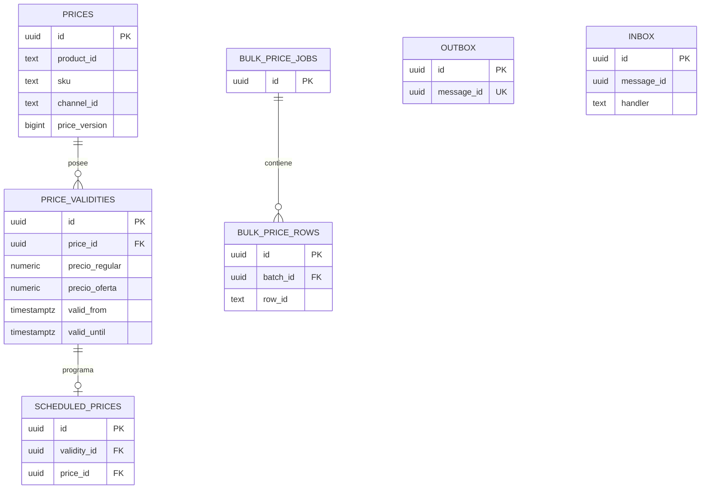

# Precios — Modelo lógico y físico de `pricing-svc`

## 1. Identificación

- Issue: [#55](https://github.com/Taller-SW-Web/Productos-y-Ofertas-docs/issues/55).
- Responsable: Leonardo Vera Rodríguez (`LeonardoVera`), rama `vera`.
- Bounded context/schema/owner exclusivo: `pricing` / `pricing-svc`.
- Última actualización: 2026-10-03. Estado: **EN REVISIÓN**, no aprobado ni desplegado a Supabase.
- Modelo lógico de origen: derivación integrada en §3/§20 desde fuentes vigentes.
- Migración: [0001_create_pricing.sql](migrations/0001_create_pricing.sql).
- Validación: [validation.sql](validation.sql). Evidencia: [validation-report.md](validation-report.md).
- Motor objetivo: PostgreSQL ≥15 / Supabase. Motor probado: PostgreSQL 18.3, PGlite 0.5.8/WASM.
- Base de fuentes revisada: `26ce90332bf677b20e8350553ccd4c6e8af21bf1`; SQL nuevo aún sin commit al validar.

## 2. Fuentes y precedencia

| Fuente | Derivación |
|---|---|
| [SPEC](../../specs/SPEC-013-gestion-precios-individuales-masivos.md), [HU](../../hu/HU-013-gestion-precios-individuales-masivos.md) | Reglas funcionales/invariantes |
| [WF](../../wireframes/flows/WF-013-gestion-precios-individuales-masivos.md), [FLOW](../../flujos/FLOW-013-gestion-precios-individuales-masivos.md) | Operaciones y estados; no definen permisos SQL |
| [OpenAPI](../../api/openapi.yaml), [AsyncAPI](../../asyncapi/asyncapi.yaml), [Contrato API](../../Contrato_Api.md) | Campos, enum de ciclo de vida, mensajes y referencias |
| [Modelo conceptual](../../Modelo_Conceptual.md), [Arquitectura](../../Arquitectura.md) | Entidades, ownership, tablas base y aislamiento |
| [Convenciones BD](../CONVENCIONES_BD.md) | Nombres, tipos, PK, timestamps, índices y mensajería |
| [Plantilla física](../plantillas/physical-model.md), [migración](../plantillas/migration.sql), [validación](../plantillas/validation.sql) | Estructura adaptada por contexto; no copiar ejemplos/grants indiscriminadamente |
| [Procedimiento #49](../../database/README.md), [ejecutor](../../database/migrate.py), [bootstrap](../../database/bootstrap.sql) | Owner/deployer/runtime, transacciones y ledger SHA-256 |

Precedencia: fuente funcional/contrato → conceptual → derivación lógica (§3) → físico → migración → validación. Estas plantillas son guías de entrega, no autorizaciones de despliegue. Las rutas provisionales no se convierten en estables por persistirlas.

## 3. Propósito y modelo lógico de origen

La definición tiene un único objetivo: producto (precio base) **o** SKU (override), y un canal específico o global (`channel_id IS NULL`). Existe como máximo una definición por esa combinación, incluso cuando hay nulos. Cada definición tiene N snapshots temporales y una versión de concurrencia. Cada programación se vincula a un snapshot futuro de la misma definición; no mantiene otra línea temporal independiente. El lote local tiene N filas durables; no coordina Catálogo/Inventario.

El modelo relacional de origen está documentado aquí, derivado de Modelo_Conceptual §5, Arquitectura §7.2/§16 y los contratos. No existe un `logical-model.md` independiente versionado para este contexto; no se afirma haber consumido uno ni su aprobación. La revisión de BD debe comprobar también esta derivación lógica (§20).

## 4. Alcance del bounded context

Posee: Definiciones base/override, snapshots regular/oferta y moneda, canal, vigencias, programación, versión y lote local.

No posee: Producto y SKU: Catálogo; identidad humana: Seguridad; coordinación de carga general: Bulk; auditoría append-only: price-audit-svc. Referencias externas escalares, sin FK, acceso SQL ni transferencia de ownership. Esta entrega implementa persistencia; no controllers, broker, parser ni workers productivos.

## 5. Principios de diseño físico

Aplicar [Convenciones BD](../CONVENCIONES_BD.md) sin reescribirlas por servicio. PK UUID con gen_random_uuid, nombres explícitos, timestamptz para instantes, dinero numeric(12,2), enums locales, FK solo internas con índice, sin RLS en escritura. Ninguna FK a auth.users, ningún join hacia otro servicio. Decisiones/excepciones locales en §22 y límites en §23.

`schema_migrations` pertenece al mecanismo #49: PK natural `version text`, `checksum text`, `applied_at timestamptz`; excepción técnica preexistente, fuera de entidades de negocio/manifest UUID. No crear un segundo ledger ni cambiar migrate.py para redefinir su identidad.

## 6. Inventario de tablas

| Tabla | Elemento lógico/técnico | Origen | PK | Estabilidad |
|---|---|---|---|---|
| `pricing.prices` | DEFINICIÓN DE PRECIO | Modelo_Conceptual §5; SPEC-013 §§1–2; identidad de producto O SKU, por canal | id UUID | mutable |
| `pricing.price_validities` | VIGENCIA DE PRECIO | Modelo_Conceptual §5; SPEC-013 §5; Precio de OpenAPI | id UUID | histórico/futuro; cierre de intervalos transaccional |
| `pricing.scheduled_prices` | PROGRAMACIÓN | Arquitectura §7.2; ProgramacionPrecio(Request) de OpenAPI | id UUID | mutable, estado propio |
| `pricing.bulk_price_jobs` | LOTE LOCAL PRICING | Modelo_Conceptual §5; Arquitectura §7.2; EstadoImportacionPrecio | id UUID | mutable, estado propio |
| `pricing.bulk_price_rows` | FILA DEL LOTE | Materialización técnica de rows/row_id en EstadoImportacionPrecio/FilaImportacionPrecio | id UUID | mutable, estado propio |
| `pricing.outbox` | PUBLICACIÓN TRANSACCIONAL | Arquitectura §9 y Contrato_Api §7.6; Convenciones §10 | id UUID | operativo; no updated_at |
| `pricing.inbox` | DEDUPLICACIÓN | AsyncAPI inicialización/aplicación masiva; Convenciones §10 | id UUID | registro inmutable |

## 7. Enumeraciones y tipos propios

| Tipo local | Valores | Motivo |
|---|---|---|
| `pricing.scheduled_price_status` | 'SCHEDULED','ACTIVE','HISTORICAL','CANCELLED' | Ciclo de vida propio publicado por OpenAPI |
| `pricing.bulk_price_job_status` | 'QUEUED','PROCESSING','COMPLETED','PARTIAL','FAILED' | Ciclo de vida propio publicado por OpenAPI |
| `pricing.bulk_price_row_status` | 'PENDING','PROCESSING','COMPLETED','FAILED' | Ciclo de vida propio publicado por OpenAPI |

Tipo de precio, operación, canal, moneda y códigos de error no son enums PostgreSQL compartidos. Canal es text nullable; moneda char(3) cuando el contrato la informa. Nunca reutilizar tipos de otro contexto.

## 8. Modelo por tabla

### 8.1. `pricing.prices`

Origen: DEFINICIÓN DE PRECIO; Modelo_Conceptual §5; SPEC-013 §§1–2; identidad de producto O SKU, por canal. Estabilidad: mutable.

| Columna | Tipo | Nulo | Default | Origen / integridad |
|---|---|---|---|---|
| `id` | `uuid` | No | `gen_random_uuid()` | Persistencia técnica trazada en §§6/22 |
| `product_id` | `text` | Sí | `—` | Contrato funcional/HTTP/asíncrono según origen de tabla |
| `sku` | `text` | Sí | `—` | Contrato funcional/HTTP/asíncrono según origen de tabla |
| `channel_id` | `text` | Sí | `—` | Contrato funcional/HTTP/asíncrono según origen de tabla |
| `price_version` | `bigint` | No | `1` | Contrato funcional/HTTP/asíncrono según origen de tabla |
| `created_at` | `timestamptz` | No | `now()` | Persistencia técnica trazada en §§6/22 |
| `updated_at` | `timestamptz` | No | `now()` | Persistencia técnica trazada en §§6/22 |

Constraints (expresiones completas en migración):

| Nombre | Definición |
|---|---|
| `pk_prices` | `PRIMARY KEY (id)` |
| `uq_prices_target_channel` | `UNIQUE NULLS NOT DISTINCT (product_id, sku, channel_id)` |
| `ck_prices_target` | `CHECK ((product_id IS NOT NULL) <> (sku IS NOT NULL))` |
| `ck_prices_version` | `CHECK (price_version >= 1)` |

Índices: los índices de PK/UNIQUE de las constraints anteriores; no índices adicionales redundantes.
Trigger: `trg_prices_updated_at` → `fn_set_updated_at`; no sustituye control de versión ni ciclo de vida.
Borrado: runtime sin DELETE/TRUNCATE. FK internas usan RESTRICT; no cascadas a otros servicios. Política de retención/operación detallada en §§17–18.

### 8.2. `pricing.price_validities`

Origen: VIGENCIA DE PRECIO; Modelo_Conceptual §5; SPEC-013 §5; Precio de OpenAPI. Estabilidad: histórico/futuro; cierre de intervalos transaccional.

| Columna | Tipo | Nulo | Default | Origen / integridad |
|---|---|---|---|---|
| `id` | `uuid` | No | `gen_random_uuid()` | Persistencia técnica trazada en §§6/22 |
| `price_id` | `uuid` | No | `—` | Contrato funcional/HTTP/asíncrono según origen de tabla |
| `precio_regular` | `numeric(12,2)` | No | `—` | Contrato funcional/HTTP/asíncrono según origen de tabla |
| `precio_oferta` | `numeric(12,2)` | Sí | `—` | Contrato funcional/HTTP/asíncrono según origen de tabla |
| `currency` | `char(3)` | No | `—` | Contrato funcional/HTTP/asíncrono según origen de tabla |
| `valid_from` | `timestamptz` | No | `—` | Contrato funcional/HTTP/asíncrono según origen de tabla |
| `valid_until` | `timestamptz` | Sí | `—` | Contrato funcional/HTTP/asíncrono según origen de tabla |
| `price_version` | `bigint` | No | `—` | Contrato funcional/HTTP/asíncrono según origen de tabla |
| `motivo_cambio` | `text` | No | `—` | Contrato funcional/HTTP/asíncrono según origen de tabla |
| `usuario_id` | `text` | Sí | `—` | Contrato funcional/HTTP/asíncrono según origen de tabla |
| `is_cancelled` | `boolean` | No | `false` | Persistencia técnica trazada en §§6/22 |
| `created_at` | `timestamptz` | No | `now()` | Persistencia técnica trazada en §§6/22 |
| `updated_at` | `timestamptz` | No | `now()` | Persistencia técnica trazada en §§6/22 |

Constraints (expresiones completas en migración):

| Nombre | Definición |
|---|---|
| `pk_price_validities` | `PRIMARY KEY (id)` |
| `uq_price_validities_id_price` | `UNIQUE (id, price_id)` |
| `uq_price_validities_price_version` | `UNIQUE (price_id, price_version)` |
| `fk_price_validities_price_id` | `FOREIGN KEY (price_id) REFERENCES pricing.prices (id) ON DELETE RESTRICT` |
| `ck_price_validities_regular` | `CHECK (precio_regular > 0 AND precio_regular <> 'NaN'::numeric)` |
| `ck_price_validities_oferta` | `CHECK (precio_oferta IS NULL OR (precio_oferta > 0 AND precio_oferta < precio_regular))` |
| `ck_price_validities_currency` | `CHECK (length(btrim(currency)) = 3)` |
| `ck_price_validities_order` | `CHECK (valid_until IS NULL OR valid_until > valid_from)` |
| `ck_price_validities_version` | `CHECK (price_version >= 1)` |
| `ck_price_validities_motivo` | `CHECK (length(btrim(motivo_cambio)) > 0)` |
| `ck_price_validities_no_overlap` | `EXCLUDE USING gist ( price_id extensions.gist_uuid_ops WITH =, tstzrange(valid_from, valid_until, '[)') WITH && ) WHERE (NOT is_cancelled) DEFERRABLE INITIALLY IMMEDIATE` |

Índices: `ix_price_validities_price_id`.
Trigger: `trg_price_validities_updated_at` → `fn_set_updated_at`; no sustituye control de versión ni ciclo de vida.
Borrado: runtime sin DELETE/TRUNCATE. FK internas usan RESTRICT; no cascadas a otros servicios. Política de retención/operación detallada en §§17–18.

### 8.3. `pricing.scheduled_prices`

Origen: PROGRAMACIÓN; Arquitectura §7.2; ProgramacionPrecio(Request) de OpenAPI. Estabilidad: mutable, estado propio.

| Columna | Tipo | Nulo | Default | Origen / integridad |
|---|---|---|---|---|
| `id` | `uuid` | No | `gen_random_uuid()` | Persistencia técnica trazada en §§6/22 |
| `price_id` | `uuid` | No | `—` | Contrato funcional/HTTP/asíncrono según origen de tabla |
| `validity_id` | `uuid` | No | `—` | Contrato funcional/HTTP/asíncrono según origen de tabla |
| `tipo_precio` | `text` | No | `—` | Contrato funcional/HTTP/asíncrono según origen de tabla |
| `importe` | `numeric(12,2)` | No | `—` | Contrato funcional/HTTP/asíncrono según origen de tabla |
| `status` | `pricing.scheduled_price_status` | No | `'SCHEDULED'` | Contrato funcional/HTTP/asíncrono según origen de tabla |
| `created_at` | `timestamptz` | No | `now()` | Persistencia técnica trazada en §§6/22 |
| `updated_at` | `timestamptz` | No | `now()` | Persistencia técnica trazada en §§6/22 |

Constraints (expresiones completas en migración):

| Nombre | Definición |
|---|---|
| `pk_scheduled_prices` | `PRIMARY KEY (id)` |
| `uq_scheduled_prices_validity` | `UNIQUE (validity_id, price_id)` |
| `fk_scheduled_prices_validity_price` | `FOREIGN KEY (validity_id, price_id) REFERENCES pricing.price_validities (id, price_id) ON DELETE RESTRICT` |
| `ck_scheduled_prices_type` | `CHECK (tipo_precio IN ('REGULAR','OFERTA'))` |
| `ck_scheduled_prices_importe` | `CHECK (importe > 0 AND importe <> 'NaN'::numeric)` |

Índices: `ix_scheduled_prices_price_id`, `ix_scheduled_prices_worker`.
Trigger: `trg_scheduled_prices_updated_at` → `fn_set_updated_at`; no sustituye control de versión ni ciclo de vida.
Borrado: runtime sin DELETE/TRUNCATE. FK internas usan RESTRICT; no cascadas a otros servicios. Política de retención/operación detallada en §§17–18.

### 8.4. `pricing.bulk_price_jobs`

Origen: LOTE LOCAL PRICING; Modelo_Conceptual §5; Arquitectura §7.2; EstadoImportacionPrecio. Estabilidad: mutable, estado propio.

| Columna | Tipo | Nulo | Default | Origen / integridad |
|---|---|---|---|---|
| `id` | `uuid` | No | `gen_random_uuid()` | Persistencia técnica trazada en §§6/22 |
| `status` | `pricing.bulk_price_job_status` | No | `'QUEUED'` | Contrato funcional/HTTP/asíncrono según origen de tabla |
| `allow_partial` | `boolean` | No | `—` | Contrato funcional/HTTP/asíncrono según origen de tabla |
| `total_rows` | `integer` | No | `—` | Contrato funcional/HTTP/asíncrono según origen de tabla |
| `completed_rows` | `integer` | No | `0` | Contrato funcional/HTTP/asíncrono según origen de tabla |
| `failed_rows` | `integer` | No | `0` | Contrato funcional/HTTP/asíncrono según origen de tabla |
| `correlation_id` | `uuid` | No | `—` | Contrato funcional/HTTP/asíncrono según origen de tabla |
| `usuario_id` | `text` | Sí | `—` | Contrato funcional/HTTP/asíncrono según origen de tabla |
| `report_uri` | `text` | Sí | `—` | Persistencia técnica trazada en §§6/22 |
| `created_at` | `timestamptz` | No | `now()` | Persistencia técnica trazada en §§6/22 |
| `updated_at` | `timestamptz` | No | `now()` | Persistencia técnica trazada en §§6/22 |

Constraints (expresiones completas en migración):

| Nombre | Definición |
|---|---|
| `pk_bulk_price_jobs` | `PRIMARY KEY (id)` |
| `ck_bulk_price_jobs_counts` | `CHECK (total_rows >= 0 AND completed_rows >= 0 AND failed_rows >= 0 AND completed_rows + failed_rows <= total_rows)` |
| `ck_bulk_price_jobs_completed` | `CHECK (status <> 'COMPLETED' OR (completed_rows = total_rows AND failed_rows = 0))` |
| `ck_bulk_price_jobs_partial` | `CHECK (status <> 'PARTIAL' OR (allow_partial AND completed_rows > 0 AND failed_rows > 0 AND completed_rows + failed_rows = total_rows))` |

Índices: `ix_bulk_price_jobs_worker`.
Trigger: `trg_bulk_price_jobs_updated_at` → `fn_set_updated_at`; no sustituye control de versión ni ciclo de vida.
Borrado: runtime sin DELETE/TRUNCATE. FK internas usan RESTRICT; no cascadas a otros servicios. Política de retención/operación detallada en §§17–18.

### 8.5. `pricing.bulk_price_rows`

Origen: FILA DEL LOTE; Materialización técnica de rows/row_id en EstadoImportacionPrecio/FilaImportacionPrecio. Estabilidad: mutable, estado propio.

| Columna | Tipo | Nulo | Default | Origen / integridad |
|---|---|---|---|---|
| `id` | `uuid` | No | `gen_random_uuid()` | Persistencia técnica trazada en §§6/22 |
| `batch_id` | `uuid` | No | `—` | Contrato funcional/HTTP/asíncrono según origen de tabla |
| `row_id` | `text` | No | `—` | Contrato funcional/HTTP/asíncrono según origen de tabla |
| `sku` | `text` | Sí | `—` | Contrato funcional/HTTP/asíncrono según origen de tabla |
| `status` | `pricing.bulk_price_row_status` | No | `'PENDING'` | Contrato funcional/HTTP/asíncrono según origen de tabla |
| `code` | `text` | Sí | `—` | Contrato funcional/HTTP/asíncrono según origen de tabla |
| `detail` | `text` | Sí | `—` | Contrato funcional/HTTP/asíncrono según origen de tabla |
| `row_input` | `jsonb` | No | `—` | Persistencia técnica trazada en §§6/22 |
| `created_at` | `timestamptz` | No | `now()` | Persistencia técnica trazada en §§6/22 |
| `updated_at` | `timestamptz` | No | `now()` | Persistencia técnica trazada en §§6/22 |

Constraints (expresiones completas en migración):

| Nombre | Definición |
|---|---|
| `pk_bulk_price_rows` | `PRIMARY KEY (id)` |
| `uq_bulk_price_rows_batch_row` | `UNIQUE (batch_id, row_id)` |
| `fk_bulk_price_rows_batch_id` | `FOREIGN KEY (batch_id) REFERENCES pricing.bulk_price_jobs (id) ON DELETE RESTRICT` |
| `ck_bulk_price_rows_input` | `CHECK (jsonb_typeof(row_input) = 'object')` |

Índices: los índices de PK/UNIQUE de las constraints anteriores; no índices adicionales redundantes.
Trigger: `trg_bulk_price_rows_updated_at` → `fn_set_updated_at`; no sustituye control de versión ni ciclo de vida.
Borrado: runtime sin DELETE/TRUNCATE. FK internas usan RESTRICT; no cascadas a otros servicios. Política de retención/operación detallada en §§17–18.

### 8.6. `pricing.outbox`

Origen: PUBLICACIÓN TRANSACCIONAL; Arquitectura §9 y Contrato_Api §7.6; Convenciones §10. Estabilidad: operativo; no updated_at.

| Columna | Tipo | Nulo | Default | Origen / integridad |
|---|---|---|---|---|
| `id` | `uuid` | No | `gen_random_uuid()` | Persistencia técnica trazada en §§6/22 |
| `message_id` | `uuid` | No | `—` | Contrato funcional/HTTP/asíncrono según origen de tabla |
| `event_name` | `text` | No | `—` | Contrato funcional/HTTP/asíncrono según origen de tabla |
| `kind` | `text` | No | `—` | Contrato funcional/HTTP/asíncrono según origen de tabla |
| `schema_version` | `integer` | No | `1` | Contrato funcional/HTTP/asíncrono según origen de tabla |
| `correlation_id` | `uuid` | No | `—` | Contrato funcional/HTTP/asíncrono según origen de tabla |
| `causation_id` | `uuid` | Sí | `—` | Contrato funcional/HTTP/asíncrono según origen de tabla |
| `operation_id` | `uuid` | Sí | `—` | Contrato funcional/HTTP/asíncrono según origen de tabla |
| `occurred_at` | `timestamptz` | No | `—` | Contrato funcional/HTTP/asíncrono según origen de tabla |
| `payload` | `jsonb` | No | `—` | Contrato funcional/HTTP/asíncrono según origen de tabla |
| `published_at` | `timestamptz` | Sí | `—` | Contrato funcional/HTTP/asíncrono según origen de tabla |
| `attempts` | `integer` | No | `0` | Contrato funcional/HTTP/asíncrono según origen de tabla |
| `last_error` | `text` | Sí | `—` | Contrato funcional/HTTP/asíncrono según origen de tabla |
| `created_at` | `timestamptz` | No | `now()` | Persistencia técnica trazada en §§6/22 |

Constraints (expresiones completas en migración):

| Nombre | Definición |
|---|---|
| `pk_outbox` | `PRIMARY KEY (id)` |
| `uq_outbox_message_id` | `UNIQUE (message_id)` |
| `ck_outbox_kind` | `CHECK (kind IN ('command','event','result'))` |
| `ck_outbox_attempts` | `CHECK (attempts >= 0)` |
| `ck_outbox_schema_version` | `CHECK (schema_version >= 1)` |

Índices: `ix_outbox_pending`.
Sin updated_at/deleted_at: excepción append-only/infraestructura de Convenciones §7.3.
Borrado: runtime sin DELETE/TRUNCATE. FK internas usan RESTRICT; no cascadas a otros servicios. Política de retención/operación detallada en §§17–18.

### 8.7. `pricing.inbox`

Origen: DEDUPLICACIÓN; AsyncAPI inicialización/aplicación masiva; Convenciones §10. Estabilidad: registro inmutable.

| Columna | Tipo | Nulo | Default | Origen / integridad |
|---|---|---|---|---|
| `id` | `uuid` | No | `gen_random_uuid()` | Persistencia técnica trazada en §§6/22 |
| `message_id` | `uuid` | No | `—` | Contrato funcional/HTTP/asíncrono según origen de tabla |
| `handler` | `text` | No | `—` | Contrato funcional/HTTP/asíncrono según origen de tabla |
| `event_name` | `text` | No | `—` | Contrato funcional/HTTP/asíncrono según origen de tabla |
| `correlation_id` | `uuid` | Sí | `—` | Contrato funcional/HTTP/asíncrono según origen de tabla |
| `payload` | `jsonb` | No | `—` | Contrato funcional/HTTP/asíncrono según origen de tabla |
| `processed_at` | `timestamptz` | No | `now()` | Contrato funcional/HTTP/asíncrono según origen de tabla |
| `result` | `text` | No | `—` | Contrato funcional/HTTP/asíncrono según origen de tabla |
| `created_at` | `timestamptz` | No | `now()` | Persistencia técnica trazada en §§6/22 |

Constraints (expresiones completas en migración):

| Nombre | Definición |
|---|---|
| `pk_inbox` | `PRIMARY KEY (id)` |
| `uq_inbox_message_handler` | `UNIQUE (message_id, handler)` |

Índices: los índices de PK/UNIQUE de las constraints anteriores; no índices adicionales redundantes.
Sin updated_at/deleted_at: excepción append-only/infraestructura de Convenciones §7.3.
Borrado: runtime sin DELETE/TRUNCATE. FK internas usan RESTRICT; no cascadas a otros servicios. Política de retención/operación detallada en §§17–18.

## 9. Referencias externas

SKU/product_id pertenecen a Catálogo; usuario_id a Seguridad; batch_id/correlation_id/message_id a las operaciones/envelopes pertinentes. Tipo externo text salvo identidades técnicas UUID según Convenciones §6.3. Sin REFERENCES hacia owners remotos. No inventar tabla de usuarios, producto, impuesto o reserva.

## 10. Constraints e invariantes

- Snapshot: regular positivo y fin posterior a inicio; oferta ausente o positiva menor que regular. Moneda abierta de tres caracteres, nunca CHECK PEN ni columnas fiscales. Cada definición exige al menos una vigencia al confirmar la transacción, mediante constraint trigger diferido.
- Intervalos `[valid_from, valid_until)` por definición; exclusion GiST rechaza superposición y admite extremos contiguos. Canal nulo y objetivo único se protegen con UNIQUE NULLS NOT DISTINCT (PostgreSQL 15+).
- `prices.price_version` es la versión del agregado para CAS; avanza exactamente una unidad por mutación. La vigencia conserva la versión en que se construyó. No puede adelantar la versión del agregado.
- Una programación identifica una vigencia del mismo price_id; importe/tipo y cancelación deben coincidir con el snapshot. Un constraint trigger diferido permite construir el cambio atómico antes de verificar esa coherencia.
- Las filas son únicas por batch_id/row_id, no por SKU global. Contadores no negativos y coherentes con total; PARTIAL requiere política parcial, éxitos y fallos; COMPLETED implica todas confirmadas.
- La BD rechaza NaN; el adaptador debe validar precisión monetaria antes de convertir a numeric(12,2), evitando redondeo silencioso de entradas no admitidas.

## 11. Foreign keys

Todas son internas y RESTRICT. Las unicidades que comienzan por columnas de FK sirven también como índice, sin duplicar índices. validation.sql comprueba el prefijo completo y resuelve destino contra **todo pg_catalog**, no solamente el conjunto validado. FK hacia otros servicios/auth/public es fallo.

## 12. Índices y consultas

| Índice | Tabla / definición | Consulta/proceso |
|---|---|---|
| `ix_price_validities_price_id` | `price_validities` / `(price_id, valid_from DESC)` | FK/consulta por definición |
| `ix_scheduled_prices_price_id` | `scheduled_prices` / `(price_id)` | FK/consulta por definición |
| `ix_scheduled_prices_worker` | `scheduled_prices` / `(status, created_at) WHERE status IN ('SCHEDULED','ACTIVE')` | worker con estado pendiente |
| `ix_bulk_price_jobs_worker` | `bulk_price_jobs` / `(created_at) WHERE status IN ('QUEUED','PROCESSING')` | worker con estado pendiente |
| `ix_outbox_pending` | `outbox` / `(occurred_at) WHERE published_at IS NULL` | relay pendiente |

PK/UNIQUE/exclusion crean sus propios índices. Estos índices están justificados por GET/seguimiento/worker, no por supuestos de carga. No se afirma SLA <800 ms sin datos representativos y EXPLAIN del servidor objetivo.

## 13. Funciones y triggers

`pricing.fn_set_updated_at`, `pricing.fn_guard_price_identity_version`, `pricing.fn_check_price_timeline`.

Funciones/constraint triggers de coherencia temporal (§10) y trigger de identidad/avance de versión. Updated_at local en las cinco tablas mutables. Ningún trigger fabrica broker/Outbox automáticamente; payload/actor requieren el caso de uso.

## 14. Outbox e Inbox

Outbox e Inbox aplican. Outbox conserva campos de Convenciones §10 con UNIQUE message_id y relay por occurred_at/published_at; Inbox UNIQUE(message_id,handler). Mutation+Outbox y deduplicación+efecto se confirman en la misma transacción.

## 15. Idempotencia y concurrencia

PATCH utiliza `UPDATE pricing.prices SET price_version = price_version + 1 WHERE id = :id AND price_version = :expected`; cero filas significa VERSION_CONFLICT, no éxito. En la misma transacción se ajusta la vigencia y se inserta Outbox. La programación no requiere priceVersion del cliente: el caso de uso bloquea la definición, asigna su siguiente versión y materializa el snapshot futuro en la misma transacción.

Si una vigencia abierta previa se extiende al futuro, la aplicación debe cerrarla/reorganizarla explícitamente dentro de la transacción de programación, conservando los intervalos históricos. No ignorar la exclusion ni insertar una programación que solape una vigencia. `is_cancelled` es marca técnica para representar CANCELLED ya publicado; no añade un endpoint de cancelación. Inicio futuro, Clock, fallback y selección de regular/oferta son responsabilidades del dominio/resolver, no CHECK con now().

## 16. Proyecciones locales

No se crean proyecciones autoritativas de Catálogo ni Seguridad. Contexto/identificadores externos vienen de contrato/evento. Outbox/Inbox y snapshots conservan hechos/intenciones propios; no permiten consultar otro schema. Resolver herencia/fallback requiere el contexto de Catálogo recibido por puerto, no FK o JOIN cross-service.

## 17. Reglas de escritura

1. Resolver explícitamente producto/SKU y canal; leer/bloquear la definición apropiada.
2. Aplicar CAS o asignar versión bajo lock; validar negocio, fechas y política de importación.
3. Persistir snapshots/programación o fila confirmada y su Outbox en una transacción local.
4. COMMIT; después el relay publica. Rechazo/rollback no publica hechos confirmados.
5. El worker actualiza estados y contadores con lock/CAS; no ofrece reanudación de Bulk general ni rollback entre dominios.

Estas son obligaciones del adaptador de persistencia futuro. Las tablas soportan la transacción y validation.sql demuestra rollback conjunto; no se afirma que un backend/relay ya esté implementado ni que el motor fabrique eventos por triggers.

## 18. Timestamps, borrado y retención

Todas las tablas llevan created_at timestamptz DEFAULT now(); mutables llevan updated_at con trigger local. Outbox/Inbox y bitácora exentas según Convenciones §7.3. No se añade deleted_at como falsa baja funcional ni mecanismo que haga desaparecer histórico. Tablas operativas con status y snapshot histórico preservado justifican omisión del deleted_at opcional.

## 19. Diagrama físico

Solo líneas de FK internas reales. Outbox e Inbox conservan identidades de integración sin FK hacia otros servicios; el lote local relaciona filas únicamente dentro de Pricing.

## 20. Trazabilidad lógico → físico

| Elemento lógico/técnico | Materialización |
|---|---|
| DEFINICIÓN DE PRECIO | `pricing.prices`; detalle §8 |
| VIGENCIA DE PRECIO | `pricing.price_validities`; detalle §8 |
| PROGRAMACIÓN | `pricing.scheduled_prices`; detalle §8 |
| LOTE LOCAL PRICING | `pricing.bulk_price_jobs`; detalle §8 |
| FILA DEL LOTE | `pricing.bulk_price_rows`; detalle §8 |
| PUBLICACIÓN TRANSACCIONAL | `pricing.outbox`; detalle §8 |
| DEDUPLICACIÓN | `pricing.inbox`; detalle §8 |

Referencias externas se materializan como escalares; ningún enlace conceptual remoto se dibuja como FK.

## 21. Trazabilidad funcional

| Fuente | Materialización/alcance |
|---|---|
| SPEC/HU-013 | Tablas e invariantes de §§8–10; casos representativos en validation.sql |
| WF/FLOW-013 | Estados de consulta/mutación/seguimiento publicados, sin inventar endpoints |
| OpenAPI 0.5.0 | Tipos de precio, programación/lote o asientos/exportación; DTO↔columnas snake_case |
| AsyncAPI 0.4.0 | Inbox, identidad message_id y Outbox solo cuando publica |
| Arquitectura/Modelo_Conceptual | Entidades/tables base y aislamiento por owner |
| Convenciones BD/plantillas | UUID, nombres, tipos, timestamps, índices, estructura de entrega |
| Procedimiento #49 | Owner/runtime, migración transaccional, ledger y checksum; layout adaptado con --root bd |

## 22. Decisiones físicas

| ID | Decisión | Alternativa | Justificación/impacto |
|---|---|---|---|
| D-PRI-01 | Snapshot combinado regular/oferta | Filas independientes por tipo | DTO Precio e invariante oferta<regular en una fila; vigencia única sin cruces entre tablas |
| D-PRI-02 | Unicidad NULLS NOT DISTINCT | Dos índices parciales de objetivo/global | Identidad total con nulos; canal global no duplica definición |
| D-PRI-03 | Programación enlazada a vigencia | Segundo calendario independiente | Misma exclusion temporal; no aprobación de un precio solapado |
| D-PRI-04 | btree_gist en extensions, instalado por infraestructura | Instalar extensión desde la migración | Migración propia no modifica namespaces ajenos; prerequisite explícito |
| D-PRI-05 | row_input jsonb opaco y filas durables | Inventar cabeceras CSV | Persistencia de estado contractual sin formalizar parser no publicado |

## 23. Decisiones pendientes y límites

| ID | Pregunta/límite | Impacto/bloqueo |
|---|---|---|
| P-PRI-01 | Formato/cabeceras/versionado del archivo y política de prevalidación con errores no definidos completamente | No para DDL; sí para implementar parser/confirmación completa. Ver Q-013-01/02 en mockups/MK-013 |
| P-PRI-02 | Mensajes de cambio/aplicación masiva usan GenericData | No para DDL; validar payload del handler con contrato antes de publicar backend |
| P-PRI-03 | Lógica de reajuste de intervalos futuros y resolución fallback/herencia | Persistencia preparada; caso de uso y carreras multiusuario pendientes |
| P-PRI-04 | Proyecto Supabase, servidor/roles/extensión y PR/revisión | Sí para despliegue y cierre #55 |

Contradicción documental transversal: Convenciones §16.3 menciona exponer schemas, pero el procedimiento #49 indica **no exponer contextos internos por Data API**. Se sigue el aislamiento arquitectónico y el procedimiento de despliegue: sin permisos anon/authenticated, sin exposición añadida; requiere revisión transversal de esa redacción antes de usar Data API. No se modifica silenciosamente la convención global.

## 24. Migraciones

Único historial: `bd/pricing/migrations/0001_create_pricing.sql`. Ejecutar desde raíz con `python database/migrate.py pricing --root bd`; no copia ni segundo historial en database/. El ejecutor administra transacción/ledger/checksum y SET ROLE po_pricing_owner; por eso no se copia BEGIN/COMMIT de la plantilla dentro del archivo de versión.

Bootstrap/roles son preparación de infraestructura. Runtime debe existir sin membresía owner ni atributos administrativos; migración falla si prerequisites faltan. En ejecución aislada envolver SQL en BEGIN/COMMIT bajo owner. Reejecución segura por ledger/checksum, no por IF NOT EXISTS que oculte drift. Nunca repetir el DDL a mano sobre tablas existentes. Cambios siguientes: 0002...; no editar migración aplicada, usar expand/contract.

## 25. Validación

`psql -X -v ON_ERROR_STOP=1 -f bd/pricing/validation.sql` sobre base de pruebas ya migrada. Deployer de pruebas necesita SET ROLE a owner/runtime para assertions de ACL; no conceder owner al runtime. Scripts usan transacción y ROLLBACK; fixtures generados/ventana controlada no quedan permanentes. Si falla, rollback/desconectar y corregir causa antes de continuar.

Manifest explícito de tablas/columnas/tipos/nullabilidad, PK/constraints, enums, índices/FK, defaults/triggers, permisos e aislamiento. No PASS por consulta vacía ni filtro del destino de FK al mismo conjunto. Assertions levantan excepción; revisar resultados PASS y error/exit code. Repetir validación no muta datos comerciales. Operaciones sensibles y pruebas negativas descritas en [evidencia](validation-report.md).

## 26. Despliegue y evidencia

[validation-report.md](validation-report.md) y [local-validation.json](evidence/local-validation.json) registran ejecución **local embebida** del 2026-10-03. No equivalen a psql contra servidor, pruebas multiusuario, recuperación real de storage ni Supabase.

Destino Supabase: pendiente de nombre/ID y conexión del entorno autorizado. Registrar después proyecto/entorno, commit, schema, versión, SHA-256, fecha, server_version, resultados validation.sql/repetición del ejecutor y PR. Referencia de procedimiento: [database/README.md](../../database/README.md); no exponer schema de escritura por Data API.

## 27. Checklist de revisión

- [x] Derivación lógica/conceptual explícita e inventario trazable.
- [x] Columnas/DDL consistentes; constraints/índices explícitos; UUID e instantes con zona.
- [x] Sin FK cross-context/auth.users, roles runtime limitados y enums locales.
- [x] Mensajería y ciclos de vida aplicables; excepciones documentadas.
- [x] Migración desde limpio y validación repetida en PostgreSQL embebido, sin fixtures permanentes.
- [x] Validación detecta índice faltante/FK externa y rollback de error DDL.
- [ ] Ejecutar migrate.py con psql en servidor limpio/repetir y comprobar ledger real.
- [ ] Integración de handlers/worker y carreras con conexiones independientes.
- [ ] Despliegue/evidencia Supabase y revisión transversal de Leonardo Lopez.
- [ ] Pull Request asociado y QA final de Marco Renato Castilla Huanca.

## 28. Resultado de revisión

**EN REVISIÓN.** Validación local satisfactoria, pendientes explícitos en §23/§26. Revisor/fecha de aprobación: pendientes; ningún archivo generado otorga APROBADO ni cierra el issue.
