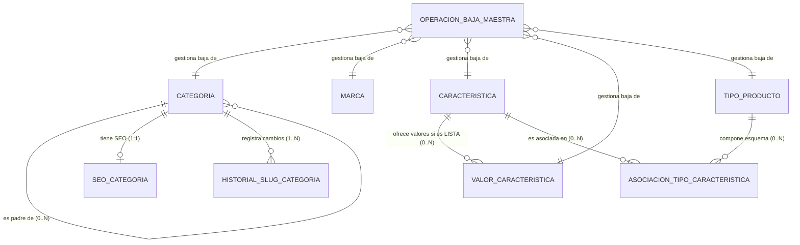

# Taxonomía — Modelo Lógico de `taxonomy-svc`

## 1. Identificación

- **Responsable:** Leonardo Lopez (`lopez`).
- **Rol transversal:** Datos y Testing.
- **Funcionalidades:**
  - 008 Gestión de categorías y subcategorías
  - 009 Gestión de características y sus valores
  - 010 Asociación entre tipos de producto y características
  - 011 Gestión de marcas
  - 012 Gestión de SEO y metadatos
- **Bounded context:** Taxonomía y Atributos (`taxonomy-svc`).
- **Schema objetivo:** `taxonomy`.
- **Owner exclusivo:** `taxonomy-svc`.
- **Fecha:** 2026-10-03.
- **Estado:** BORRADOR PARA REVISIÓN.
- **Precedencia:** Fuentes funcionales/contractuales → `Modelo_Conceptual.md` → **este documento** → `physical-model.md` → `migrations/` → `validation.sql`.

---

## 2. Fuentes y precedencia

Este modelo lógico deriva estrictamente de las fuentes funcionales, arquitectónicas y contractuales vigentes del proyecto:

| Fuente | Alcance consumido |
|---|---|
| [SPEC-008](../../specs/SPEC-008-gestion-categorias.md) | Modelo recursivo de categorías, profundidad MVP `MAX_CATEGORY_DEPTH=2`, padre opcional, slug previo obligatorio, baja lógica segura |
| [SPEC-009](../../specs/SPEC-009-gestion-caracteristicas.md) | Tipos exactos (`TEXTO`, `NUMERO`, `LISTA`), inmutabilidad del tipo, unidad de medida para NUMERO, tope de 50 valores activos para LISTA, baja segura de valor |
| [SPEC-010](../../specs/SPEC-010-asociacion-tipo-producto-caracteristica.md) | Esquema de atributos anclado a `TipoProducto` (no categorías), obligatoriedad/opcionalidad, límite configurable por tipo, versionado de esquema |
| [SPEC-011](../../specs/SPEC-011-gestion-marcas.md) | Unicidad estricta de nombre entre activas e inactivas, logo opcional máx. 5 MB, código de país ISO 3166-1, baja segura |
| [SPEC-012](../../specs/SPEC-012-seo-metadatos.md) | Normalización de slug, prevención de colisiones, contadores no bloqueantes 70/160, historial append-only de redirecciones para 301 |
| [HU-008 a HU-012](../../hu/) | Criterios de aceptación funcionales de negocio |
| [WF-008 a WF-012](../../wireframes/flows/) | Pantallas, campos editables, estados y visualización de datos |
| [FLOW-008 a FLOW-012](../../flujos/) | Secuencias de interacción y flujos alternativos |
| [Modelo_Conceptual.md §3](../../Modelo_Conceptual.md) | Ownership conceptual de datos de Taxonomía y protocolo de baja maestra segura |
| [Arquitectura.md §7.1–7.2](../../Arquitectura.md) | Schema `taxonomy` y tablas maestras asignadas |
| [api/openapi.yaml](../../api/openapi.yaml) 0.5.0 | Contrato HTTP administrativo y modelos de datos DTO |
| [asyncapi/asyncapi.yaml](../../asyncapi/asyncapi.yaml) 0.4.0 | Eventos de dominio emitidos por Taxonomía (`taxonomy.*`) |
| [bd/CONVENCIONES_BD.md](../../bd/CONVENCIONES_BD.md) | Reglas de aislamiento entre bounded contexts, naming y tipos |

Precedencia ante discrepancias: `SPEC` → `Contrato OpenAPI/AsyncAPI` → `Modelo_Conceptual.md` → **este documento**. No se agregan entidades ni atributos sin respaldo en las fuentes oficiales.

---

## 3. Propósito

Describir la estructura lógica pura de información propiedad exclusiva del bounded context **`taxonomy-svc`**.

Este documento define:
- Entidades lógicas de dominio.
- Atributos relevantes, tipos lógicos y restricciones de negocio.
- Identificadores y claves candidatas.
- Relaciones y cardinalidades lógicas.
- Invariantes de integridad.
- Referencias externas escalares (sin FK cross-service).
- Ciclos de vida y estados.
- Necesidades técnicas de persistencia (Outbox, Inbox, Historial).

Este documento **no define todavía la implementación física PostgreSQL** (eso corresponde a `physical-model.md`).

---

## 4. Alcance del bounded context

### 4.1. Datos que posee (Authority)
Taxonomía es autoridad única y fuente de verdad de:
1. **Categorías:** Identidad, jerarquía recursiva, orden, metadatos y estado.
2. **Marcas:** Identidad comercial de marca, nombre único, logotipo, país de origen ISO y estado.
3. **Características:** Catálogo maestro de atributos (`TEXTO`, `NUMERO`, `LISTA`), unidades de medida y estado.
4. **Valores de características:** Opciones predefinidas para características tipo `LISTA` y estado.
5. **Tipos de producto:** Identidad, nombre, versión de esquema y estado.
6. **Esquema de atributos:** Asociación N:M entre Tipo de Producto y Característica, con semántica de obligatoriedad/opcionalidad.
7. **SEO de categoría:** Slug canónico actual, metatítulo, metadescripción y trazabilidad de actualizaciones.
8. **Historial de slugs:** Registro append-only de redirecciones permanentes (301) para Marketplace.
9. **Operaciones de baja maestra:** Registro de solicitudes asíncronas de desactivación/desasociación (`master_deactivation_operations`).
10. **Eventos de dominio:** Bitácora de publicación transaccional (`outbox`) y recepción idempotente (`inbox`).

### 4.2. Datos que NO posee (Non-goals)
- **NO posee Productos, Variantes ni SKUs:** Pertenecen exclusivamente a `catalog-svc`.
- **NO posee Precios ni Monedas:** Pertenecen a `pricing-svc`.
- **NO posee Stock ni Ubicaciones:** Pertenecen a `inventory-svc`.
- **NO asigna características a Categorías:** Las categorías son únicamente de navegación y clasificación taxonómica. El esquema de atributos pertenece al **Tipo de Producto**.

---

## 5. Entidades lógicas y atributos

### 5.1. `CATEGORIA`
Representa una unidad de clasificación taxonómica y navegación del catálogo.
- `id`: Identificador único global (UUID lógico).
- `nombre`: Denominación comercial (Texto obligatorio, **no requiere ser único** según SPEC-008).
- `descripcion`: Resumen descriptivo de la categoría (Texto opcional).
- `categoria_padre_id`: Referencia a la categoría superior jerárquica (Identificador opcional; nulo si es categoría raíz).
- `nivel`: Profundidad jerárquica (Entero: 1 para raíz, 2 para subcategoría; en MVP `MAX_CATEGORY_DEPTH=2`).
- `orden`: Posición ordinal para ordenamiento visual en menús (Entero no negativo, por defecto 0).
- `imagen_url`: Enlace al recurso gráfico representativo (Texto opcional formato URI).
- `estado`: Estado de ciclo de vida (`ACTIVO`, `INACTIVO`, `DESACTIVACION_PENDIENTE`).
- `version`: Contador de versión para concurrencia optimista (Entero >= 0).

### 5.2. `MARCA`
Representa un fabricante o marca comercial bajo la cual se comercializan productos.
- `id`: Identificador único global (UUID lógico).
- `nombre`: Nombre oficial de la marca (Texto obligatorio, **estrictamente único** en todo el catálogo entre activas e inactivas).
- `descripcion`: Reseña informativa de la marca (Texto opcional).
- `logo_url`: Enlace a la imagen del logotipo (Texto opcional formato URI, máx. 5 MB en origen).
- `pais_origen_iso`: Código de país según estándar ISO 3166-1 alpha-2 (Texto opcional de exactamente 2 letras mayúsculas, ej. `"PE"`, `"US"`).
- `estado`: Estado de ciclo de vida (`ACTIVO`, `INACTIVO`, `DESACTIVACION_PENDIENTE`).
- `version`: Contador de versión optimista (Entero >= 0).

### 5.3. `CARACTERISTICA`
Representa un atributo abstracto que califica técnicamente a un producto.
- `id`: Identificador único global (UUID lógico).
- `nombre`: Nombre del atributo (Texto obligatorio y único, ej. `"Talla"`, `"Color"`, `"Potencia"`).
- `tipo`: Tipología de dato permitida (`TEXTO`, `NUMERO`, `LISTA`). **Inmutable tras su creación**.
- `unidad_medida`: Símbolo de la magnitud física (Texto; obligatorio si `tipo = NUMERO`, prohibido/nulo en otro caso).
- `estado`: Estado de ciclo de vida (`ACTIVO`, `INACTIVO`).
- `version`: Contador de versión optimista (Entero >= 0).

### 5.4. `VALOR_CARACTERISTICA`
Representa un elemento del catálogo predefinido de opciones para características de tipo `LISTA`.
- `id`: Identificador único global (UUID lógico).
- `caracteristica_id`: Referencia a la característica propietaria (Obligatorio, debe ser de tipo `LISTA`).
- `nombre`: Etiqueta del valor (Texto obligatorio, único dentro de la misma característica, ej. `"Rojo"`, `"Azul"`, `"XL"`).
- `estado`: Estado de ciclo de vida (`ACTIVO`, `INACTIVO`, `DESACTIVACION_PENDIENTE`).
- `version`: Contador de versión optimista (Entero >= 0).

### 5.5. `TIPO_PRODUCTO`
Representa una plantilla o familia que define el esquema de atributos técnicos requeridos para un grupo de productos.
- `id`: Identificador único global (UUID lógico).
- `nombre`: Denominación del tipo (Texto obligatorio y único, ej. `"Calzado Deportivo"`, `"Smartphone"`).
- `estado`: Estado de ciclo de vida (`ACTIVO`, `INACTIVO`).
- `schema_version`: Número de versión del esquema de atributos (Entero incremental >= 1, incrementa con cada cambio en sus asociaciones).
- `version`: Contador de versión optimista (Entero >= 0).

### 5.6. `ASOCIACION_TIPO_CARACTERISTICA`
Representa la inclusión de una característica en el esquema técnico de un tipo de producto.
- `id`: Identificador único de la asociación (UUID lógico).
- `tipo_producto_id`: Referencia al tipo de producto (Obligatorio).
- `caracteristica_id`: Referencia a la característica maestra (Obligatorio, debe estar activa).
- `obligatoria`: Indicador booleano (Verdadero = atributo requerido para activar productos; Falso = opcional).
- `estado`: Estado de la asociación (`ACTIVO`, `INACTIVO`).

### 5.7. `SEO_CATEGORIA`
Representa los metadatos de indexación y búsqueda asociados a una categoría.
- `id`: Identificador único global (UUID lógico).
- `categoria_id`: Referencia a la categoría propietaria (Obligatorio, relación 1 a 1).
- `slug`: Segmento de URL canónico normalizado (Texto obligatorio, **único globalmente** en todo el catálogo).
- `meta_titulo`: Título para motores de búsqueda (Texto opcional; recomendación visual <= 70 caracteres, no bloqueante).
- `meta_descripcion`: Resumen descriptivo para SERP (Texto opcional; recomendación visual <= 160 caracteres, no bloqueante).
- `version`: Contador de versión optimista (Entero >= 0).

### 5.8. `HISTORIAL_SLUG_CATEGORIA`
Bitácora append-only de modificaciones de URLs de categorías para soportar redirecciones 301 en Marketplace.
- `id`: Identificador único global (UUID lógico).
- `categoria_id`: Referencia a la categoría afectada (Obligatorio).
- `old_slug`: Slug previo que deja de ser canónico (Texto obligatorio).
- `new_slug`: Nuevo slug canónico asignado (Texto obligatorio).
- `changed_at`: Marca temporal de la modificación (Fecha y hora con zona horaria).

### 5.9. `OPERACION_BAJA_MAESTRA`
Entidad técnica observable que gestiona solicitudes asíncronas de desactivación de recursos maestros con dependencias.
- `id`: Identificador único de la operación (UUID lógico).
- `operation_id`: Identificador observable de la solicitud (Texto único, ej. `"op-cat-deact-789"`).
- `entity_type`: Tipo de entidad objetivo (`CATEGORY`, `BRAND`, `CHARACTERISTIC`, `CHARACTERISTIC_VALUE`, `PRODUCT_TYPE`, `PRODUCT_TYPE_CHARACTERISTIC`).
- `entity_id`: Identificador del recurso que se solicita desactivar (UUID lógico).
- `status`: Estado del proceso (`REQUESTED`, `IN_PROGRESS`, `COMPLETED`, `REJECTED`, `FAILED`).
- `reason`: Motivo o detalle explicativo de la resolución (Texto opcional).
- `correlation_id`: Identificador de trazabilidad distribuida (Texto obligatorio).

---

## 6. Relaciones y cardinalidades lógicas

| Relación | Cardinalidad | Regla de integridad |
|---|---|---|
| `CATEGORIA` (Padre) → `CATEGORIA` (Hija) | `1 : 0..N` | Opcional; una raíz no tiene padre. Si tiene padre, debe estar activo y tener `nivel = 1`. No ciclos. |
| `CATEGORIA` → `SEO_CATEGORIA` | `1 : 1` | Toda categoría tiene exactamente una configuración SEO. Al crear la categoría se crea su registro SEO inicial. |
| `CATEGORIA` → `HISTORIAL_SLUG_CATEGORIA` | `1 : 0..N` | Append-only. Cada cambio en `SEO_CATEGORIA.slug` genera una fila en esta bitácora. |
| `CARACTERISTICA` → `VALOR_CARACTERISTICA` | `1 : 0..N` | Solo permitido si `CARACTERISTICA.tipo = 'LISTA'`. Máximo 50 valores activos simultáneos por característica. |
| `TIPO_PRODUCTO` → `ASOCIACION_TIPO_CARACTERISTICA` | `1 : 0..N` | Un tipo puede asociar de 0 a 15 características activas. |
| `CARACTERISTICA` → `ASOCIACION_TIPO_CARACTERISTICA` | `1 : 0..N` | Una característica solo puede asociarse una vez por tipo de producto (`UNIQUE(tipo_producto_id, caracteristica_id)`). |

---

## 7. Invariantes y reglas de negocio del modelo lógico

1. **Aislamiento absoluto:** `taxonomy-svc` no posee ninguna clave foránea hacia tablas de `catalog`, `pricing` o `inventory`.
2. **Profundidad de categorías:** La jerarquía admite únicamente 2 niveles: raíz (`nivel = 1`) y subcategorías (`nivel = 2`).
3. **Inmutabilidad del tipo de característica:** Una vez creada una característica con tipo `TEXTO`, `NUMERO` o `LISTA`, dicho tipo jamás puede mutar.
4. **Coherencia de unidades:** Solo las características de tipo `NUMERO` admiten unidad de medida; para `TEXTO` y `LISTA` debe ser nula.
5. **Tope de valores de lista:** Ninguna característica puede tener más de 50 valores en estado `ACTIVO` concurrentemente.
6. **Esquema de atributos en Tipo de Producto:** La obligatoriedad (`obligatoria = true/false`) es propiedad exclusiva de la asociación, no de la característica maestra.
7. **Incremento de versión de esquema:** Cualquier alta, modificación de obligatoriedad o desasociación en un tipo incrementa su `schema_version`.
8. **Unicidad estricta de marcas:** El nombre de una marca es único en todo el catálogo (incluso entre marcas dadas de baja lógica).
9. **Unicidad de slug SEO:** El slug de una categoría es globalmente único y normalizado (minúsculas, números y guiones).
10. **Baja lógica segura:** La desactivación de categorías, marcas, valores o desasociación de atributos no elimina físicamente registros; cambia el estado y tramita validaciones asíncronas con Catálogo.
