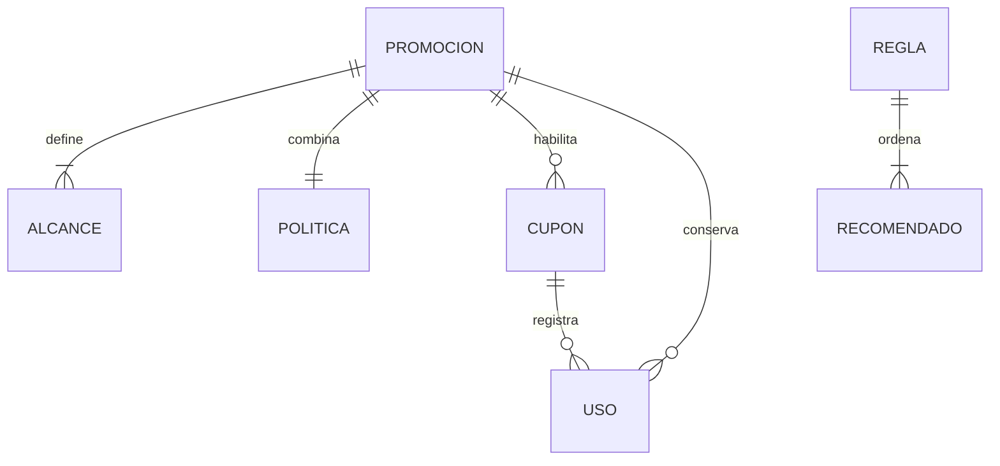

# Modelo lógico — Promociones (`promotions-svc`)

Issue [#53](https://github.com/Taller-SW-Web/Productos-y-Ofertas-docs/issues/53). Responsable: Axel Cueva. Contexto: Promociones. Schema objetivo: `promotions`. Actualizado: 2026-10-03. Estado: **EN REVISIÓN**.

## Fuentes

[Modelo conceptual §7](../../Modelo_Conceptual.md), [Arquitectura §7.2](../../Arquitectura.md), [Contrato API](../../Contrato_Api.md), [OpenAPI 0.5.0](../../api/openapi.yaml), [AsyncAPI 0.4.0](../../asyncapi/asyncapi.yaml), SPEC/HU/WF/FLOW 005–007 y [convenciones de BD](../../bd/CONVENCIONES_BD.md). Las decisiones de tipos, índices y mecanismo de migración pertenecen al [modelo físico](physical-model.md).

## 1. Propósito

Persistir configuración comercial y el historial de cupones, con lecturas locales de otros servicios y entrega fiable de mensajes. El modelo distingue configurar/validar un beneficio de consumirlo. No incorpora pagos, reservas de inventario ni simulaciones de recomendaciones en Backoffice.

## 2. Responsabilidad del bounded context

Promociones es autoridad sobre promociones, sus alcances y combinaciones, cupones, usos y restituciones, reglas Cross-sell/Upsell y sus candidatos. Catálogo mantiene productos/SKU; Taxonomía las categorías; Pricing los precios; Inventario la disponibilidad; Seguridad la identidad; Ventas los pedidos y su snapshot comercial. Las referencias externas no crean relaciones de integridad con almacenamiento de otros owners.

## 3. Entidades lógicas

### 3.1. Promoción

Identificador propio. Atributos obligatorios: nombre (texto), tipo de descuento (catálogo), valor (cantidad positiva), modalidad (catálogo), estado (catálogo), inicio/fin (fecha y hora), prioridad (entero positivo), canales habilitados (conjunto explícito no vacío). Atributos técnicos: creación/modificación. Primera activación es una fecha opcional que conserva historia.

Porcentaje hasta 100; monto fijo positivo; inicio anterior a fin. Una promoción posee al menos un alcance y exactamente una política de combinación. Puede cambiar modalidad únicamente mientras esté inactiva, nunca activada, sin cupones asociados ni usos históricos. `puedeCambiarModalidad` se deriva de estas condiciones; no se almacena una autorización enviada por el cliente.

### 3.2. Alcance de promoción

Identificador propio; promoción obligatoria; exactamente una referencia externa producto **o** SKU; creación. No repetir el mismo producto/SKU dentro de una promoción. Un alcance por producto conserva la referencia de producto: no se convierte en una lista congelada de variantes.

### 3.3. Política de combinación

Identificada por su promoción. Tres decisiones booleanas obligatorias: combinar con oferta de Pricing, promoción automática y cupón; modificación técnica. No hay una política universal implícita: la configuración debe proporcionarlas.

### 3.4. Cupón

Identificador propio; código (texto único normalizado), promoción obligatoria de modalidad CUPON, estado, política de cancelación, creación/modificación. Monto mínimo, límite global y límite por cliente son opcionales: ausencia significa sin ese límite; informados son positivos, los cupos enteros. La identidad del cliente se exige al consumir si existe límite por cliente.

El código elimina espacios extremos y convierte letras ASCII a mayúsculas; acepta letras ASCII, números, guion y guion bajo. La edición compara unicidad excluyendo el propio registro.

### 3.5. Uso de cupón

Identificador propio; cupón, promoción al consumir, referencia externa de pedido, canal, fecha efectiva del consumo y política capturada son obligatorios. Referencia del cliente opcional conforme a los límites. Fecha de restitución opcional, monotónica.

Pedido/cupón identifica un único consumo de negocio. Un duplicado con identidad, canal o fecha efectiva diferentes es conflicto. Un duplicado idéntico no crea otro uso, incluso después de restituir. Historia conservada: no borrar ni editar identidad. Consumos no restituidos cuentan contra los límites; no se mantiene otro contador autoritativo que pueda desajustarse. Cancelación con RESTAURAR libera una vez; NO_RESTAURAR conserva el consumo; pedido sin consumo no incrementa cupo.

### 3.6. Regla de recomendación

Identificador propio; nombre, tipo, origen (tipo PRODUCTO/CATEGORIA y referencia externa), prioridad, estado, inicio/fin y creación/modificación. Una regla posee uno o más recomendados. Origen único y no ambiguo. Prioridad positiva, fechas ordenadas.

### 3.7. Recomendado

Identificador propio; regla, referencia de producto y orden positivo obligatorios; criterio de superioridad y justificación comercial opcionales en el modelo general. Cada candidato UPSELL **exige** criterio controlado. Justificación hasta 500 caracteres. No repetir producto ni recomendar el propio origen cuando este sea un producto. No se deduce superioridad del precio.

### 3.8. Proyección de Catálogo

Identificada por clase de referencia PRODUCTO/SKU y referencia externa. Conserva producto relacionado, actividad, snapshot local y procedencia (identificador del mensaje, fecha del origen y versión cuando exista). No crea Catálogo dentro de Promociones. Una proyección de producto refiere al propio producto.

### 3.9. Proyección de precio

Identificada por SKU/canal, con canal ausente para precio global y canal concreto para override de Pricing. Cada ámbito mantiene un único snapshot local y procedencia del origen. No inventa un precio por producto ni selecciona variante. La semántica del snapshot corresponde al contrato/adaptador de Pricing.

### 3.10. Proyección de disponibilidad

Identificada por SKU. Estado de disponibilidad comercial, snapshot y procedencia del origen. No almacena cantidades de Kardex ni toma ownership del saldo. No agrega automáticamente múltiples SKU a disponibilidad de producto.

### 3.11. Mensaje saliente

Identificado por message_id externo opaco. Envelope obligatorio: versión del esquema del mensaje, fecha ocurrida, correlación, productor, clase, nombre y datos; causación/operación opcionales. Seguimiento técnico: creación, intentos, último error y confirmación de publicación. Envelope inmutable; puede actualizarse únicamente el seguimiento de entrega.

### 3.12. Mensaje recibido

Identificado por message_id/handler. Envelope original y recepción obligatorios; finalización/resultado conjuntamente opcionales. Duplicados idénticos reutilizan resultado; mismo identificador con contenido diferente es conflicto. Resultado final inmutable.

## 4. Catálogos de estados y valores controlados

| Concepto | Valores | Fuente |
|---|---|---|
| Estado administrativo | ACTIVO, INACTIVO | OpenAPI EstadoEntidad |
| Descuento | PORCENTAJE, MONTO_FIJO | OpenAPI TipoDescuento |
| Modalidad | AUTOMATICA, CUPON | OpenAPI ModalidadPromocion |
| Canal administrativo | MARKETPLACE, CHATBOT, RETAIL, VENTAS | OpenAPI Canal |
| Canal de consumo | MARKETPLACE, CHATBOT, RETAIL | AsyncAPI CouponConsumptionRequestedData |
| Cancelación | RESTAURAR_EN_CANCELACION, NO_RESTAURAR | SPEC-005 / OpenAPI |
| Resultado restitución | RESTORED, POLICY_KEEPS_CONSUMPTION, NO_CONSUMPTION | AsyncAPI |
| Recomendación | CROSS_SELL, UPSELL | SPEC-007 / OpenAPI |
| Origen | PRODUCTO, CATEGORIA | OpenAPI OrigenRecomendacion |
| Superioridad | MAYOR_RENDIMIENTO, MEJOR_MATERIAL, MAYOR_CAPACIDAD, FUNCIONALIDAD_ADICIONAL | SPEC-007 |
| Disponibilidad | DISPONIBLE, STOCK_BAJO, AGOTADO | SPEC-007/015 |
| Clase de mensaje | event, command, result | AsyncAPI MessageEnvelope |

## 5. Relaciones y cardinalidades

| Padre | Hijo | Cardinalidad / integridad |
|---|---|---|
| Promoción | Alcance | 1 a 1..N; obligatorio al guardar el agregado |
| Promoción | Política | 1 a 1; obligatorio al guardar |
| Promoción CUPON | Cupón | 1 a 0..N |
| Cupón | Uso | 1 a 0..N; no borrar padre con historia |
| Promoción consumida | Uso | 1 a 0..N; referencia histórica propia |
| Regla | Recomendado | 1 a 1..N; obligatorio al guardar |

Mensajes y proyecciones no tienen vínculos de integridad con entidades externas. Inbox/outbox se coordinan transaccionalmente con el cambio de negocio.

## 6. Referencias interdominio

| Referencia | Owner | Uso |
|---|---|---|
| product_id / SKU | Catálogo | Alcance, origen, recomendado, proyecciones |
| category_id (origin_id) | Taxonomía | Origen de regla |
| customer_ref | Seguridad / Ventas como portador | Límite por cliente; sub del cliente, jamás token de servicio |
| order_id | Ventas | Idempotencia y restitución |
| Mensaje / correlación / operación | Productor contractual | Reentrega y trazabilidad |

La existencia/actividad/elegibilidad comercial de referencias se valida por servicio/proyección contractual, no por una relación entre bases.

## 7. Reglas de integridad lógica

Configuraciones completas se guardan atómicamente, incluidos hijos. Los cupos se revalidan al consumir y no se reservan al validar. Cambiar cupón/promoción no reescribe el snapshot de usos existentes. Restituir no elimina historia ni duplica capacidad. Una proyección anterior no puede sustituir una posterior; orden ambiguo exige reconciliación del owner. Autorización administrativa e identidad de pedido pertenecen al servicio autenticado.

## 8. Normalización y duplicación controlada

Configuración de alcances, política y candidatos se separa de sus padres. Código normalizado es único. Totales de usos consumidos/disponibles son derivados, contando usos no restituidos; sin límite devuelve disponibilidad de usos ausente, nunca un número inventado. Primera activación y política capturada conservan hechos históricos. Proyecciones duplican solo lecturas externas; snapshots no son autoridad ni excusa para acceder directamente a otro schema.

## 9. Persistencia técnica necesaria

Inbox deduplica entrega de mensajes; outbox permite publicar después del commit. Procedencia de proyecciones permite detectar antigüedad/conflictos. Registro de migraciones es técnico del procedimiento transversal, ajeno al dominio. Retención de inbox/outbox y auditoría externa deben acordarse antes de purgar historia; esta entrega no habilita borrado de mensajes por runtime.

## 10. Diagrama entidad-relación lógico

## 11. Trazabilidad

| Funcionalidad | Fuentes | Entidades |
|---|---|---|
| Cupones | SPEC/HU/WF/FLOW-005; OpenAPI CuponAdmin; AsyncAPI consumption/restoration | Cupón, uso, inbox/outbox |
| Promociones | SPEC/HU/WF/FLOW-006; OpenAPI PromocionAdmin | Promoción, alcance, política |
| Recomendaciones | SPEC/HU/WF/FLOW-007; OpenAPI ReglaRecomendacionAdmin | Regla, recomendado, proyecciones |
| Persistencia técnica | Arquitectura §7.2; AsyncAPI MessageEnvelope; issue #53 | Tres proyecciones, inbox/outbox |

## 12. Decisiones del modelo lógico

Estado administrativo se expresa como `ACTIVO/INACTIVO`, conforme a OpenAPI; se corrigió la redacción anterior de SPEC-007. Canales administrativos y canales del comando de consumo mantienen sus conjuntos contractuales distintos. Referencias opacas de mensajes/pedidos no reciben reglas de identidad nuevas. La identidad de cliente sí respeta el formato pactado en SPEC-005. Prioridad/orden no se hacen únicos: el contrato solo exige positividad; un empate usa identificador estable como desempate técnico.

## 13. Decisiones pendientes

`D-REC-01`: disponibilidad por producto con varios SKU. `D-REC-02`: precio por producto con variantes/overrides. No se resuelven creando reglas comerciales nuevas en SQL. AsyncAPI usa GenericData para los cuatro eventos de proyección: acordar campos y versión/orden con cada owner antes de conectar consumidores. Se puede almacenar el snapshot de lectura actual, pero no declarar implementado un adaptador a eventos sin payload acordado.

La semántica tributaria, promociones sobre envío y restitución después de devoluciones no están resueltas por las fuentes de este contexto. El uso/restitución de §3.5 corresponde al contrato actual de cancelación; no define devoluciones parciales. No incorporar tablas fiscales, de despacho, ubicaciones/fulfillment, pagos o reservas. Los ejemplos de moneda/formato de presentación no son catálogos cerrados ni reglas de precisión del dominio.

## 14. Derivación esperada hacia el modelo físico

Una tabla por entidad, relaciones exclusivamente internas, unicidad de código y pedido/cupón, integridad diferida de agregados completos, historia protegida, control transaccional de cupos, almacenamiento explícito de envelopes y procedencia. Cada decisión física se detalla en `physical-model.md` y se verifica con fixtures reversibles.

## 15. Checklist de aprobación

- [x] Ownership de las doce entidades corresponde a Arquitectura.
- [x] Cardinalidades, referencias, reglas y estados vinculados a fuentes.
- [x] Separación entre autoridad de dominio y proyecciones locales.
- [x] Sin tipos SQL, índices ni implementación de triggers en el modelo lógico.
- [x] Conflictos de estados e identificadores documentados; pendientes D-REC conservados.
- [ ] Revisión del owner de BD Leonardo Lopez y QA Marco Castilla.
