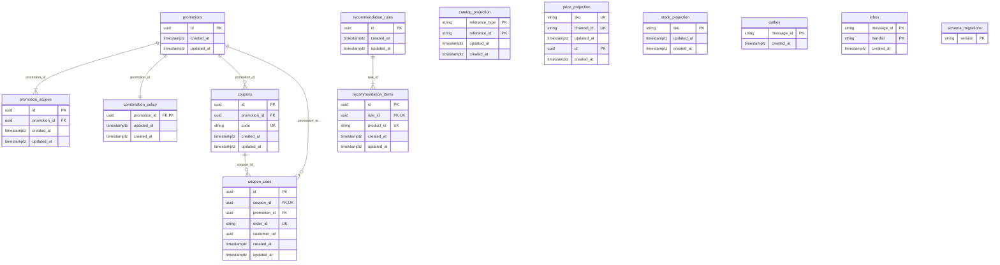

# Modelo físico — promotions-svc / schema `promotions`

## 1. Identificación

- Issue: [#53 — Persistencia de promotions-svc](https://github.com/Taller-SW-Web/Productos-y-Ofertas-docs/issues/53).
- Responsable: Axel Andree Cueva Alcalá.
- Bounded context: Promociones. Microservicio y owner exclusivo: `promotions-svc`.
- Schema: `promotions`. Owner PostgreSQL: `po_promotions_owner`; runtime: `po_promotions_runtime`.
- Última actualización: 2026-10-03. Estado: **EN REVISIÓN — REQUIERE APROBACIÓN BD/QA**.
- Modelo lógico: [logical-model.md](logical-model.md).
- Migraciones: [migrations](migrations/), versiones 0001/0002/0003.
- Validación: [validation.sql](validation.sql), [verify.py](tests/verify.py), [evidencia](validation-report.md).
- Motor objetivo: PostgreSQL/Supabase. Evidencia local: PostgreSQL 17.11; despliegue compartido pendiente.

## 2. Fuentes y precedencia

| Fuente | Uso |
|---|---|
| [Modelo conceptual](../../Modelo_Conceptual.md), [Arquitectura](../../Arquitectura.md) §7.2 | Ownership, aislamiento y doce tablas heredadas. |
| [Contrato API](../../Contrato_Api.md), [OpenAPI](../../api/openapi.yaml), [AsyncAPI](../../asyncapi/asyncapi.yaml) | Identidades, tipos, campos, eventos y límites de integración. |
| SPEC/HU/WF/FLOW-005, 006 y 007 | Fuentes específicas enlazadas en logical-model §11 y trazabilidad §21 de este documento. |
| [Modelo lógico](logical-model.md) | Entidades, cardinalidades, historia e invariantes. |
| [Convenciones](../../bd/CONVENCIONES_BD.md), [plantilla](../../bd/plantillas/physical-model.md) | Nomenclatura, timestamps, FK explícitas y estructura de esta entrega. |
| [Procedimiento de despliegue](../README.md), [runner](../migrate.py) | Roles, schema privado e historial único de migraciones. |

Precedencia: fuentes funcionales/contractuales → conceptual → lógico → físico → migraciones → validación. Las convenciones físicas no sustituyen un contrato. Contradicciones y apartamientos se registran en §5.2/§23; no se resuelven con restricciones funcionales nuevas.

## 3. Propósito

Materializar la persistencia de las doce entidades/relaciones/necesidades técnicas de Arquitectura §7.2 y del modelo lógico. Documentar columnas, constraints, índices, funciones, triggers, historia, proyecciones e idempotencia realmente implementados. El ledger adicional pertenece al mecanismo común. Este documento sigue las 28 secciones de la plantilla vigente y su diccionario deriva del catálogo local después de aplicar 0001–0003.

## 4. Alcance del bounded context

### 4.1. Datos que posee

Promociones, alcances, políticas de combinación, cupones, usos/restitución e identidad de sus reglas/candidatos. También posee el almacenamiento técnico local de inbox/outbox y sus proyecciones, conservando los owners originales de los datos proyectados.

### 4.2. Datos que NO posee

Catálogo (`catalog-svc`), precios (`pricing-svc`), stock/reservas (`inventory-svc`), identidad del cliente (Seguridad), pedido/cancelación/pago (Ventas/Postventa). No incorpora impuestos, envío, Pickup, fulfillment ni reglas de devolución/reembolso no homologadas. Una referencia o snapshot no transfiere ownership, no crea FK externa y no habilita lectura SQL cross-service.

## 5. Principios de diseño físico

### 5.1. Aislamiento

Todo objeto reside en `promotions`, propiedad de `po_promotions_owner` NOLOGIN. Runtime separado `po_promotions_runtime` NOLOGIN, sin membresías privilegiadas. Un administrador crea los roles; un deployer independiente usa SET ROLE del owner; el servicio usa otro login con membresía únicamente del runtime. No hay FK, permisos ni lecturas hacia schemas de otros owners.

Schema privado, fuera de Exposed schemas/Data API. PUBLIC sin USAGE ni EXECUTE; sin grants a anon/authenticated. No se aplica una política basada en auth.uid(): customer_ref es una referencia externa utilizada por un servicio autorizado. Una futura exposición requiere una migración de RLS y grants revisada, antes de exponer datos. [Roles de Supabase](https://supabase.com/docs/guides/database/postgres/roles).

### 5.2. Convenciones aplicadas y decisiones locales

| Tema | Aplicación / excepción justificada |
|---|---|
| Tablas | Nombres exactos de Arquitectura §7.2, aunque una convención general sugiera singular. |
| Objetos | snake_case; constraints pk_/uq_/fk_/ck_ e índices ix_; nombres explícitos excepto el ledger generado por el mecanismo común. |
| IDs propios | UUID nativo gen_random_uuid(), sin extensión ni FK externa. |
| customer_ref | UUID por SPEC-005/OpenAPI/AsyncAPI; prevalece sobre la sugerencia general de text en las nuevas convenciones. |
| Pedido/mensaje/correlación | text no vacío: AsyncAPI dice string sin formato UUID; no imponer uno. operation_id sí es UUID según MessageEnvelope. |
| Cantidades comerciales | numeric exacto, sin typmod que redondee. OpenAPI no fija escala: 100.001 debe rechazarse como porcentaje, no convertirse silenciosamente en 100; mínimo 0.001 es positivo. NaN/Infinity rechazados. Se desvía de numeric(12,2) genérico por precisión contractual. No se inventa currency para estos campos. |
| Fechas | timestamptz finito; vigencia [inicio, fin); reloj técnico del servidor para creación/modificación/primera activación. |
| Migraciones | Numeración continua de cuatro dígitos y transacción del ejecutor database/migrate.py; no añadir BEGIN/COMMIT a los archivos. CLI Supabase 2.119.0 generó el archivo original; 0001/0002 conservan sus checksums y 0003 incorpora las correcciones. Se mantiene una única historia común. |
| Canal global de precio | channel_id nullable; UNIQUE NULLS NOT DISTINCT(SKU, canal) representa un global por SKU y un override por canal, conforme al contrato de Pricing. |
| Catálogos propios | CHECK en lugar de enums nativos sugeridos por convenciones: mismos valores publicados, migración autocontenida y sin tipos extra; excepción a revisar con el owner de BD. |
| Data API | Se aplica el procedimiento database/README.md de schemas privados; la sugerencia general de exponer nueve schemas en convenciones contradice ese procedimiento. Resolver en revisión transversal antes de cualquier exposición; esta entrega conserva el acceso por backend y no concede acceso anónimo. |
| Roles | Bootstrap existente po_<schema>_owner y runtime con permisos concretos; no GRANT ALL a un rol compartido. |
| Estado de recomendación | ACTIVO/INACTIVO del contrato HTTP; SPEC-007 actualizado para quitar la discrepancia ACTIVA/INACTIVA. |

Timestamps de las doce tablas: created_at obligatorio; updated_at mantenido por trigger en diez tablas, con inbox/outbox exentos según §7.3 transversal. Las seis FK finales declaran ON DELETE RESTRICT. Triggers con prefijo trg_. Estas correcciones se incorporan en 0003 sin editar migraciones publicadas.

El ledger usa applied_at y PK natural del runner; las proyecciones catalog/stock e inbox/outbox conservan claves técnicas/naturales heredadas. Esos apartamientos de la regla general de surrogate UUID y del formato de infraestructura no se declaran aprobados: requieren resolución documental BD/QA en §23. La conservación de nombres plurales de Arquitectura sí está autorizada expresamente por CONVENCIONES_BD §5.2.

## 6. Inventario de tablas

| Tabla | Propósito | Origen | PK | Estabilidad |
|---|---|---|---|---|
| `promotions` | Regla de descuento, modalidad, vigencia, canales y antecedente de activación. | logical-model.md §3.1 — Promoción | `PRIMARY KEY (id)` | Mutable; configuración comercial protegida por invariantes. |
| `promotion_scopes` | Referencias disyuntas por producto completo o SKU; configuración del agregado. | logical-model.md §3.2 — Alcance de promoción | `PRIMARY KEY (id)` | Mutable; configuración comercial protegida por invariantes. |
| `combination_policy` | Combinaciones permitidas de la promoción; una política obligatoria por agregado. | logical-model.md §3.3 — Política de combinación | `PRIMARY KEY (promotion_id)` | Mutable; configuración comercial protegida por invariantes. |
| `coupons` | Código normalizado, estado, límites y política de cancelación configurables. | logical-model.md §3.4 — Cupón | `PRIMARY KEY (id)` | Mutable; configuración comercial protegida por invariantes. |
| `coupon_uses` | Hecho de consumo por pedido/cupón e historia de restitución única. | logical-model.md §3.5 — Uso de cupón | `PRIMARY KEY (id)` | Historia protegida; solo restitución única y timestamp técnico mutables. |
| `recommendation_rules` | Cross-sell/Upsell, origen tipado, prioridad, estado y vigencia. | logical-model.md §3.6 — Regla de recomendación | `PRIMARY KEY (id)` | Mutable; configuración comercial protegida por invariantes. |
| `recommendation_items` | Candidatos de una regla, orden y criterio de superioridad cuando corresponde. | logical-model.md §3.7 — Recomendado | `PRIMARY KEY (id)` | Mutable; configuración comercial protegida por invariantes. |
| `catalog_projection` | Snapshot reconstruible de producto/SKU y actividad, con procedencia externa. | logical-model.md §3.8 — Proyección de catálogo | `PRIMARY KEY (reference_type, reference_id)` | Mutable y reconstruible desde el owner original. |
| `price_projection` | Snapshot reconstruible de SKU/canal; global NULL y overrides independientes. | logical-model.md §3.9 — Proyección de precio | `PRIMARY KEY (id)` | Mutable y reconstruible desde el owner original. |
| `stock_projection` | Snapshot reconstruible de disponibilidad por SKU, sin stock autoritativo. | logical-model.md §3.10 — Proyección de disponibilidad | `PRIMARY KEY (sku)` | Mutable y reconstruible desde el owner original. |
| `outbox` | Envelope transaccional inmutable y seguimiento de publicación. | logical-model.md §3.11 — Outbox | `PRIMARY KEY (message_id)` | Envelope inmutable; seguimiento operativo mutable. |
| `inbox` | Deduplicación por mensaje/handler, envelope inmutable y resultado del procesamiento. | logical-model.md §3.12 — Inbox | `PRIMARY KEY (message_id, handler)` | Envelope inmutable; seguimiento operativo mutable. |
| `schema_migrations` | Ledger técnico del mecanismo común; versiones/checksums/applied_at. | Necesidad técnica: logical-model.md §9; database/migrate.py | `PRIMARY KEY (version)` | Append-only, exclusivo del runner. |

## 7. Enumeraciones y tipos propios

No se crean enums PostgreSQL propios. Los valores publicados se protegen con CHECK: descuento PORCENTAJE/MONTO_FIJO, modalidad AUTOMATICA/CUPON, estado ACTIVO/INACTIVO, CROSS_SELL/UPSELL, origen PRODUCTO/CATEGORIA, política RESTAURAR_EN_CANCELACION/NO_RESTAURAR, canales y criterios de superioridad vigentes. Los valores aparecen en el diccionario §8. El uso de CHECK en vez de ENUM es una decisión física pendiente de revisión BD, no una ampliación de valores contractuales.

## 8. Modelo por tabla

### 8.1. `promotions`

**Origen lógico:** logical-model.md §3.1 — Promoción. **Propósito:** Regla de descuento, modalidad, vigencia, canales y antecedente de activación. **Estabilidad:** Mutable; configuración comercial protegida por invariantes.

**Columnas**

| Columna | Tipo PostgreSQL | Nulo | Default | Restricciones | Origen lógico |
|---|---|---|---|---|---|
| `id` | `uuid` | No | `gen_random_uuid()` | NOT NULL; pk_promotions | logical-model.md §3.1 — Promoción |
| `name` | `text` | No | — | NOT NULL; ck_promotions_name | logical-model.md §3.1 — Promoción |
| `discount_type` | `text` | No | — | NOT NULL; ck_promotions_discount, ck_promotions_discount_type | logical-model.md §3.1 — Promoción |
| `discount_value` | `numeric` | No | — | NOT NULL; ck_promotions_discount | logical-model.md §3.1 — Promoción |
| `modality` | `text` | No | — | NOT NULL; ck_promotions_modality | logical-model.md §3.1 — Promoción |
| `state` | `text` | No | — | NOT NULL; ck_promotions_activation, ck_promotions_state | logical-model.md §3.1 — Promoción |
| `valid_from` | `timestamp with time zone` | No | — | NOT NULL; ck_promotions_period | logical-model.md §3.1 — Promoción |
| `valid_until` | `timestamp with time zone` | No | — | NOT NULL; ck_promotions_period | logical-model.md §3.1 — Promoción |
| `priority` | `integer` | No | — | NOT NULL; ck_promotions_priority | logical-model.md §3.1 — Promoción |
| `enabled_channels` | `text[]` | No | — | NOT NULL; ck_promotions_channels | logical-model.md §3.1 — Promoción |
| `first_activated_at` | `timestamp with time zone` | Sí | — | ck_promotions_activation | logical-model.md §3.1 — Promoción |
| `created_at` | `timestamp with time zone` | No | `now()` | NOT NULL | Técnico: convenciones §7 / runner |
| `updated_at` | `timestamp with time zone` | No | `now()` | NOT NULL | Técnico: convenciones §7 / runner |

**Clave primaria:** `PRIMARY KEY (id)`.

**Claves únicas**

No se requieren claves únicas adicionales a la PK.

**Foreign keys internas**

No existen FK para esta tabla; referencias externas sin integridad cruzada.

**Constraints**

| Constraint | Tipo | Expresión | Regla protegida |
|---|---|---|---|
| `ck_promotions_activation` | CHECK | `CHECK (((state <> 'ACTIVO'::text) OR (first_activated_at IS NOT NULL)))` | Invariante de Promoción conforme al modelo lógico; sin reglas externas nuevas. |
| `ck_promotions_channels` | CHECK | `CHECK (promotions.fn_valid_channels(enabled_channels))` | Invariante de Promoción conforme al modelo lógico; sin reglas externas nuevas. |
| `ck_promotions_discount` | CHECK | `CHECK (((discount_value > (0)::numeric) AND (discount_value <> ALL (ARRAY['NaN'::numeric, 'Infinity'::numeric, '-Infinity'::numeric])) AND ((discount_type <> 'PORCENTAJE'::text) OR (discount_value <= (100)::numeric))))` | Invariante de Promoción conforme al modelo lógico; sin reglas externas nuevas. |
| `ck_promotions_discount_type` | CHECK | `CHECK ((discount_type = ANY (ARRAY['PORCENTAJE'::text, 'MONTO_FIJO'::text])))` | Invariante de Promoción conforme al modelo lógico; sin reglas externas nuevas. |
| `ck_promotions_modality` | CHECK | `CHECK ((modality = ANY (ARRAY['AUTOMATICA'::text, 'CUPON'::text])))` | Invariante de Promoción conforme al modelo lógico; sin reglas externas nuevas. |
| `ck_promotions_name` | CHECK | `CHECK ((length(btrim(name)) > 0))` | Invariante de Promoción conforme al modelo lógico; sin reglas externas nuevas. |
| `ck_promotions_period` | CHECK | `CHECK ((isfinite(valid_from) AND isfinite(valid_until) AND (valid_from < valid_until)))` | Invariante de Promoción conforme al modelo lógico; sin reglas externas nuevas. |
| `ck_promotions_priority` | CHECK | `CHECK ((priority > 0))` | Invariante de Promoción conforme al modelo lógico; sin reglas externas nuevas. |
| `ck_promotions_state` | CHECK | `CHECK ((state = ANY (ARRAY['ACTIVO'::text, 'INACTIVO'::text])))` | Invariante de Promoción conforme al modelo lógico; sin reglas externas nuevas. |

**Índices**

| Índice | Columnas / definición | Tipo | Justificación |
|---|---|---|---|
| `ix_promotions_evaluation` | `CREATE INDEX ix_promotions_evaluation ON promotions.promotions USING btree (priority, valid_from, valid_until, id) WHERE (state = 'ACTIVO'::text)` | btree | Evaluación de promociones activas por prioridad/vigencia y desempate por ID. |
| `pk_promotions` | `CREATE UNIQUE INDEX pk_promotions ON promotions.promotions USING btree (id)` | btree | Acceso e integridad de la identidad física de la tabla. |

**Disparadores**

| Trigger | Evento / definición | Función | Justificación |
|---|---|---|---|
| `trg_promotions_complete` | `CREATE CONSTRAINT TRIGGER trg_promotions_complete AFTER INSERT OR UPDATE ON promotions.promotions DEFERRABLE INITIALLY DEFERRED FOR EACH ROW EXECUTE FUNCTION promotions.fn_check_promotion_complete()` | `fn_check_promotion_complete` | La completitud requiere filas hijas y puede alcanzarse al final de una transacción. |
| `trg_promotions_guard` | `CREATE TRIGGER trg_promotions_guard BEFORE INSERT OR UPDATE ON promotions.promotions FOR EACH ROW EXECUTE FUNCTION promotions.fn_guard_promotion()` | `fn_guard_promotion` | Depende del valor anterior e historia del agregado; no expresable con CHECK de una fila. |
| `trg_promotions_updated_at` | `CREATE TRIGGER trg_promotions_updated_at BEFORE UPDATE ON promotions.promotions FOR EACH ROW EXECUTE FUNCTION promotions.fn_touch_updated_at()` | `fn_touch_updated_at` | Un DEFAULT no se ejecuta al actualizar; BEFORE UPDATE evita omisiones de la aplicación. |

**Reglas de borrado**

- Estado: ACTIVO/INACTIVO como ciclo de negocio; no equivale a deleted_at.
- deleted_at: no aplica; estado ya representa baja de negocio.
- Borrado físico: Permitido solo cuando no queden dependencias ni se viole completitud/historia del agregado.
- ON DELETE: Sin FK salientes; respetar las dependencias entrantes y las restricciones de la tabla.

**Notas:** Actualizaciones y comprobaciones de agregados dentro de una transacción local.

### 8.2. `promotion_scopes`

**Origen lógico:** logical-model.md §3.2 — Alcance de promoción. **Propósito:** Referencias disyuntas por producto completo o SKU; configuración del agregado. **Estabilidad:** Mutable; configuración comercial protegida por invariantes.

**Columnas**

| Columna | Tipo PostgreSQL | Nulo | Default | Restricciones | Origen lógico |
|---|---|---|---|---|---|
| `id` | `uuid` | No | `gen_random_uuid()` | NOT NULL; fk_promotion_scopes_promotion, pk_promotion_scopes | logical-model.md §3.2 — Alcance de promoción |
| `promotion_id` | `uuid` | No | — | NOT NULL; fk_promotion_scopes_promotion | logical-model.md §3.2 — Alcance de promoción |
| `product_id` | `text` | Sí | — | ck_promotion_scopes_reference | logical-model.md §3.2 — Alcance de promoción |
| `sku` | `text` | Sí | — | ck_promotion_scopes_reference | logical-model.md §3.2 — Alcance de promoción |
| `created_at` | `timestamp with time zone` | No | `now()` | NOT NULL | Técnico: convenciones §7 / runner |
| `updated_at` | `timestamp with time zone` | No | `now()` | NOT NULL | Técnico: convenciones §7 / runner |

**Clave primaria:** `PRIMARY KEY (id)`.

**Claves únicas**

| Constraint / índice | Columnas / definición | Regla |
|---|---|---|
| `uq_promotion_scopes_product` | `CREATE UNIQUE INDEX uq_promotion_scopes_product ON promotions.promotion_scopes USING btree (promotion_id, product_id) WHERE (product_id IS NOT NULL)` | Proteger identidad de negocio; índices parciales de alcance excluyen la alternativa NULL del XOR. |
| `uq_promotion_scopes_sku` | `CREATE UNIQUE INDEX uq_promotion_scopes_sku ON promotions.promotion_scopes USING btree (promotion_id, sku) WHERE (sku IS NOT NULL)` | Proteger identidad de negocio; índices parciales de alcance excluyen la alternativa NULL del XOR. |

**Foreign keys internas**

| Constraint | Origen | Destino | ON DELETE | Justificación |
|---|---|---|---|---|
| `fk_promotion_scopes_promotion` | promotion_id | promotions.promotions.id | RESTRICT | Retener dependencias e historia; eliminación hija explícita dentro del agregado, sin cascadas. |

**Constraints**

| Constraint | Tipo | Expresión | Regla protegida |
|---|---|---|---|
| `ck_promotion_scopes_reference` | CHECK | `CHECK ((((product_id IS NOT NULL) AND (length(btrim(product_id)) > 0) AND (sku IS NULL)) OR ((sku IS NOT NULL) AND (length(btrim(sku)) > 0) AND (product_id IS NULL))))` | Invariante de Alcance de promoción conforme al modelo lógico; sin reglas externas nuevas. |

**Índices**

| Índice | Columnas / definición | Tipo | Justificación |
|---|---|---|---|
| `ix_promotion_scopes_product` | `CREATE INDEX ix_promotion_scopes_product ON promotions.promotion_scopes USING btree (product_id, promotion_id) WHERE (product_id IS NOT NULL)` | btree | Resolver promociones aplicables al producto o SKU; excluir filas de la otra alternativa. |
| `ix_promotion_scopes_promotion` | `CREATE INDEX ix_promotion_scopes_promotion ON promotions.promotion_scopes USING btree (promotion_id)` | btree | Comprobar completitud y consultar alcances de una promoción; índice de FK. |
| `ix_promotion_scopes_sku` | `CREATE INDEX ix_promotion_scopes_sku ON promotions.promotion_scopes USING btree (sku, promotion_id) WHERE (sku IS NOT NULL)` | btree | Resolver promociones aplicables al producto o SKU; excluir filas de la otra alternativa. |
| `pk_promotion_scopes` | `CREATE UNIQUE INDEX pk_promotion_scopes ON promotions.promotion_scopes USING btree (id)` | btree | Acceso e integridad de la identidad física de la tabla. |
| `uq_promotion_scopes_product` | `CREATE UNIQUE INDEX uq_promotion_scopes_product ON promotions.promotion_scopes USING btree (promotion_id, product_id) WHERE (product_id IS NOT NULL)` | btree | Proteger identidad de negocio; índices parciales de alcance excluyen la alternativa NULL del XOR. |
| `uq_promotion_scopes_sku` | `CREATE UNIQUE INDEX uq_promotion_scopes_sku ON promotions.promotion_scopes USING btree (promotion_id, sku) WHERE (sku IS NOT NULL)` | btree | Proteger identidad de negocio; índices parciales de alcance excluyen la alternativa NULL del XOR. |

**Disparadores**

| Trigger | Evento / definición | Función | Justificación |
|---|---|---|---|
| `trg_promotion_scopes_complete` | `CREATE CONSTRAINT TRIGGER trg_promotion_scopes_complete AFTER INSERT OR DELETE OR UPDATE ON promotions.promotion_scopes DEFERRABLE INITIALLY DEFERRED FOR EACH ROW EXECUTE FUNCTION promotions.fn_check_promotion_complete()` | `fn_check_promotion_complete` | La completitud requiere filas hijas y puede alcanzarse al final de una transacción. |
| `trg_promotion_scopes_lock` | `CREATE TRIGGER trg_promotion_scopes_lock BEFORE INSERT OR DELETE OR UPDATE ON promotions.promotion_scopes FOR EACH ROW EXECUTE FUNCTION promotions.fn_lock_parent('promotions', 'promotion_id')` | `fn_lock_parent` | Serializa cambios del agregado entre sesiones; un CHECK no bloquea padres. |
| `trg_promotion_scopes_updated_at` | `CREATE TRIGGER trg_promotion_scopes_updated_at BEFORE UPDATE ON promotions.promotion_scopes FOR EACH ROW EXECUTE FUNCTION promotions.fn_touch_updated_at()` | `fn_touch_updated_at` | Un DEFAULT no se ejecuta al actualizar; BEFORE UPDATE evita omisiones de la aplicación. |

**Reglas de borrado**

- Estado: No aplica estado administrativo; no inventar un estado de negocio.
- deleted_at: no aplica; configuración dependiente, proyección reconstruible o registro técnico/histórico según propósito.
- Borrado físico: Permitido solo cuando no queden dependencias ni se viole completitud/historia del agregado.
- ON DELETE: RESTRICT en las FK descritas; no borrar hijos ni historia automáticamente.

**Notas:** Actualizaciones y comprobaciones de agregados dentro de una transacción local.

### 8.3. `combination_policy`

**Origen lógico:** logical-model.md §3.3 — Política de combinación. **Propósito:** Combinaciones permitidas de la promoción; una política obligatoria por agregado. **Estabilidad:** Mutable; configuración comercial protegida por invariantes.

**Columnas**

| Columna | Tipo PostgreSQL | Nulo | Default | Restricciones | Origen lógico |
|---|---|---|---|---|---|
| `promotion_id` | `uuid` | No | — | NOT NULL; fk_combination_policy_promotion, pk_combination_policy | logical-model.md §3.3 — Política de combinación |
| `pricing_offer` | `boolean` | No | — | NOT NULL | logical-model.md §3.3 — Política de combinación |
| `automatic_promotion` | `boolean` | No | — | NOT NULL | logical-model.md §3.3 — Política de combinación |
| `coupon` | `boolean` | No | — | NOT NULL | logical-model.md §3.3 — Política de combinación |
| `updated_at` | `timestamp with time zone` | No | `now()` | NOT NULL | Técnico: convenciones §7 / runner |
| `created_at` | `timestamp with time zone` | No | `now()` | NOT NULL | Técnico: convenciones §7 / runner |

**Clave primaria:** `PRIMARY KEY (promotion_id)`.

**Claves únicas**

No se requieren claves únicas adicionales a la PK.

**Foreign keys internas**

| Constraint | Origen | Destino | ON DELETE | Justificación |
|---|---|---|---|---|
| `fk_combination_policy_promotion` | promotion_id | promotions.promotions.id | RESTRICT | Retener dependencias e historia; eliminación hija explícita dentro del agregado, sin cascadas. |

**Constraints**

Sin CHECK adicionales; PK/UNIQUE y control técnico descritos arriba.

**Índices**

| Índice | Columnas / definición | Tipo | Justificación |
|---|---|---|---|
| `pk_combination_policy` | `CREATE UNIQUE INDEX pk_combination_policy ON promotions.combination_policy USING btree (promotion_id)` | btree | Acceso e integridad de la identidad física de la tabla. |

**Disparadores**

| Trigger | Evento / definición | Función | Justificación |
|---|---|---|---|
| `trg_combination_policy_complete` | `CREATE CONSTRAINT TRIGGER trg_combination_policy_complete AFTER INSERT OR DELETE OR UPDATE ON promotions.combination_policy DEFERRABLE INITIALLY DEFERRED FOR EACH ROW EXECUTE FUNCTION promotions.fn_check_promotion_complete()` | `fn_check_promotion_complete` | La completitud requiere filas hijas y puede alcanzarse al final de una transacción. |
| `trg_combination_policy_lock` | `CREATE TRIGGER trg_combination_policy_lock BEFORE INSERT OR DELETE OR UPDATE ON promotions.combination_policy FOR EACH ROW EXECUTE FUNCTION promotions.fn_lock_parent('promotions', 'promotion_id')` | `fn_lock_parent` | Serializa cambios del agregado entre sesiones; un CHECK no bloquea padres. |
| `trg_combination_policy_updated_at` | `CREATE TRIGGER trg_combination_policy_updated_at BEFORE UPDATE ON promotions.combination_policy FOR EACH ROW EXECUTE FUNCTION promotions.fn_touch_updated_at()` | `fn_touch_updated_at` | Un DEFAULT no se ejecuta al actualizar; BEFORE UPDATE evita omisiones de la aplicación. |

**Reglas de borrado**

- Estado: No aplica estado administrativo; no inventar un estado de negocio.
- deleted_at: no aplica; configuración dependiente, proyección reconstruible o registro técnico/histórico según propósito.
- Borrado físico: Permitido solo cuando no queden dependencias ni se viole completitud/historia del agregado.
- ON DELETE: RESTRICT en las FK descritas; no borrar hijos ni historia automáticamente.

**Notas:** Actualizaciones y comprobaciones de agregados dentro de una transacción local.

### 8.4. `coupons`

**Origen lógico:** logical-model.md §3.4 — Cupón. **Propósito:** Código normalizado, estado, límites y política de cancelación configurables. **Estabilidad:** Mutable; configuración comercial protegida por invariantes.

**Columnas**

| Columna | Tipo PostgreSQL | Nulo | Default | Restricciones | Origen lógico |
|---|---|---|---|---|---|
| `id` | `uuid` | No | `gen_random_uuid()` | NOT NULL; fk_coupons_promotion, pk_coupons | logical-model.md §3.4 — Cupón |
| `promotion_id` | `uuid` | No | — | NOT NULL; fk_coupons_promotion | logical-model.md §3.4 — Cupón |
| `code` | `text` | No | — | NOT NULL; ck_coupons_code, uq_coupons_code | logical-model.md §3.4 — Cupón |
| `state` | `text` | No | — | NOT NULL; ck_coupons_state | logical-model.md §3.4 — Cupón |
| `minimum_amount` | `numeric` | Sí | — | ck_coupons_minimum | logical-model.md §3.4 — Cupón |
| `max_global_uses` | `integer` | Sí | — | ck_coupons_global | logical-model.md §3.4 — Cupón |
| `max_customer_uses` | `integer` | Sí | — | ck_coupons_customer | logical-model.md §3.4 — Cupón |
| `cancellation_policy` | `text` | No | — | NOT NULL; ck_coupons_policy | logical-model.md §3.4 — Cupón |
| `created_at` | `timestamp with time zone` | No | `now()` | NOT NULL | Técnico: convenciones §7 / runner |
| `updated_at` | `timestamp with time zone` | No | `now()` | NOT NULL | Técnico: convenciones §7 / runner |

**Clave primaria:** `PRIMARY KEY (id)`.

**Claves únicas**

| Constraint / índice | Columnas / definición | Regla |
|---|---|---|
| `uq_coupons_code` | `UNIQUE (code)` | Identidad única documentada en el origen lógico de la tabla. |

**Foreign keys internas**

| Constraint | Origen | Destino | ON DELETE | Justificación |
|---|---|---|---|---|
| `fk_coupons_promotion` | promotion_id | promotions.promotions.id | RESTRICT | Retener dependencias e historia; eliminación hija explícita dentro del agregado, sin cascadas. |

**Constraints**

| Constraint | Tipo | Expresión | Regla protegida |
|---|---|---|---|
| `ck_coupons_code` | CHECK | `CHECK (((code = promotions.fn_normalize_code(code)) AND ((code COLLATE "C") ~ '^[A-Z0-9_-]+$'::text)))` | Invariante de Cupón conforme al modelo lógico; sin reglas externas nuevas. |
| `ck_coupons_customer` | CHECK | `CHECK ((max_customer_uses > 0))` | Invariante de Cupón conforme al modelo lógico; sin reglas externas nuevas. |
| `ck_coupons_global` | CHECK | `CHECK ((max_global_uses > 0))` | Invariante de Cupón conforme al modelo lógico; sin reglas externas nuevas. |
| `ck_coupons_minimum` | CHECK | `CHECK (((minimum_amount > (0)::numeric) AND (minimum_amount <> ALL (ARRAY['NaN'::numeric, 'Infinity'::numeric, '-Infinity'::numeric]))))` | Invariante de Cupón conforme al modelo lógico; sin reglas externas nuevas. |
| `ck_coupons_policy` | CHECK | `CHECK ((cancellation_policy = ANY (ARRAY['RESTAURAR_EN_CANCELACION'::text, 'NO_RESTAURAR'::text])))` | Invariante de Cupón conforme al modelo lógico; sin reglas externas nuevas. |
| `ck_coupons_state` | CHECK | `CHECK ((state = ANY (ARRAY['ACTIVO'::text, 'INACTIVO'::text])))` | Invariante de Cupón conforme al modelo lógico; sin reglas externas nuevas. |

**Índices**

| Índice | Columnas / definición | Tipo | Justificación |
|---|---|---|---|
| `ix_coupons_promotion` | `CREATE INDEX ix_coupons_promotion ON promotions.coupons USING btree (promotion_id)` | btree | Consultar cupones del agregado e indexar su FK. |
| `pk_coupons` | `CREATE UNIQUE INDEX pk_coupons ON promotions.coupons USING btree (id)` | btree | Acceso e integridad de la identidad física de la tabla. |
| `uq_coupons_code` | `CREATE UNIQUE INDEX uq_coupons_code ON promotions.coupons USING btree (code)` | btree | Proteger identidad de negocio; índices parciales de alcance excluyen la alternativa NULL del XOR. |

**Disparadores**

| Trigger | Evento / definición | Función | Justificación |
|---|---|---|---|
| `trg_coupons_guard` | `CREATE TRIGGER trg_coupons_guard BEFORE INSERT OR DELETE OR UPDATE ON promotions.coupons FOR EACH ROW EXECUTE FUNCTION promotions.fn_guard_coupon()` | `fn_guard_coupon` | Regla entre tablas y normalización previa; UNIQUE/CHECK mantienen las invariantes declarativas. |
| `trg_coupons_updated_at` | `CREATE TRIGGER trg_coupons_updated_at BEFORE UPDATE ON promotions.coupons FOR EACH ROW EXECUTE FUNCTION promotions.fn_touch_updated_at()` | `fn_touch_updated_at` | Un DEFAULT no se ejecuta al actualizar; BEFORE UPDATE evita omisiones de la aplicación. |

**Reglas de borrado**

- Estado: ACTIVO/INACTIVO como ciclo de negocio; no equivale a deleted_at.
- deleted_at: no aplica; estado ya representa baja de negocio.
- Borrado físico: Permitido solo cuando no queden dependencias ni se viole completitud/historia del agregado.
- ON DELETE: RESTRICT en las FK descritas; no borrar hijos ni historia automáticamente.

**Notas:** Actualizaciones y comprobaciones de agregados dentro de una transacción local.

### 8.5. `coupon_uses`

**Origen lógico:** logical-model.md §3.5 — Uso de cupón. **Propósito:** Hecho de consumo por pedido/cupón e historia de restitución única. **Estabilidad:** Historia protegida; solo restitución única y timestamp técnico mutables.

**Columnas**

| Columna | Tipo PostgreSQL | Nulo | Default | Restricciones | Origen lógico |
|---|---|---|---|---|---|
| `id` | `uuid` | No | `gen_random_uuid()` | NOT NULL; fk_coupon_uses_coupon, fk_coupon_uses_promotion, pk_coupon_uses | logical-model.md §3.5 — Uso de cupón |
| `coupon_id` | `uuid` | No | — | NOT NULL; fk_coupon_uses_coupon, uq_coupon_uses_order_coupon | logical-model.md §3.5 — Uso de cupón |
| `promotion_id` | `uuid` | No | — | NOT NULL; fk_coupon_uses_promotion | logical-model.md §3.5 — Uso de cupón |
| `order_id` | `text` | No | — | NOT NULL; ck_coupon_uses_order, uq_coupon_uses_order_coupon | logical-model.md §3.5 — Uso de cupón |
| `customer_ref` | `uuid` | Sí | — | — | Contrato API §30 / SPEC-005: UUID sub de Seguridad, sin FK |
| `channel_id` | `text` | No | — | NOT NULL; ck_coupon_uses_channel | logical-model.md §3.5 — Uso de cupón |
| `consumed_at` | `timestamp with time zone` | No | — | NOT NULL; ck_coupon_uses_consumed, ck_coupon_uses_restored | logical-model.md §3.5 — Uso de cupón |
| `cancellation_policy` | `text` | No | — | NOT NULL; ck_coupon_uses_policy, ck_coupon_uses_restored | logical-model.md §3.5 — Uso de cupón |
| `restored_at` | `timestamp with time zone` | Sí | — | ck_coupon_uses_restored | logical-model.md §3.5 — Uso de cupón |
| `created_at` | `timestamp with time zone` | No | `now()` | NOT NULL | Técnico: convenciones §7 / runner |
| `updated_at` | `timestamp with time zone` | No | `now()` | NOT NULL | Técnico: convenciones §7 / runner |

**Clave primaria:** `PRIMARY KEY (id)`.

**Claves únicas**

| Constraint / índice | Columnas / definición | Regla |
|---|---|---|
| `uq_coupon_uses_order_coupon` | `UNIQUE (order_id, coupon_id)` | Identidad única documentada en el origen lógico de la tabla. |

**Foreign keys internas**

| Constraint | Origen | Destino | ON DELETE | Justificación |
|---|---|---|---|---|
| `fk_coupon_uses_coupon` | coupon_id | promotions.coupons.id | RESTRICT | Retener dependencias e historia; eliminación hija explícita dentro del agregado, sin cascadas. |
| `fk_coupon_uses_promotion` | promotion_id | promotions.promotions.id | RESTRICT | Retener dependencias e historia; eliminación hija explícita dentro del agregado, sin cascadas. |

**Constraints**

| Constraint | Tipo | Expresión | Regla protegida |
|---|---|---|---|
| `ck_coupon_uses_channel` | CHECK | `CHECK ((channel_id = ANY (ARRAY['MARKETPLACE'::text, 'CHATBOT'::text, 'RETAIL'::text])))` | Invariante de Uso de cupón conforme al modelo lógico; sin reglas externas nuevas. |
| `ck_coupon_uses_consumed` | CHECK | `CHECK (isfinite(consumed_at))` | Invariante de Uso de cupón conforme al modelo lógico; sin reglas externas nuevas. |
| `ck_coupon_uses_order` | CHECK | `CHECK ((length(btrim(order_id)) > 0))` | Invariante de Uso de cupón conforme al modelo lógico; sin reglas externas nuevas. |
| `ck_coupon_uses_policy` | CHECK | `CHECK ((cancellation_policy = ANY (ARRAY['RESTAURAR_EN_CANCELACION'::text, 'NO_RESTAURAR'::text])))` | Invariante de Uso de cupón conforme al modelo lógico; sin reglas externas nuevas. |
| `ck_coupon_uses_restored` | CHECK | `CHECK (((restored_at IS NULL) OR (isfinite(restored_at) AND (restored_at >= consumed_at) AND (cancellation_policy = 'RESTAURAR_EN_CANCELACION'::text))))` | Invariante de Uso de cupón conforme al modelo lógico; sin reglas externas nuevas. |

**Índices**

| Índice | Columnas / definición | Tipo | Justificación |
|---|---|---|---|
| `ix_coupon_uses_capacity` | `CREATE INDEX ix_coupon_uses_capacity ON promotions.coupon_uses USING btree (coupon_id, customer_ref) WHERE (restored_at IS NULL)` | btree | Contar usos no restituidos del cupón, globales o por cliente. |
| `ix_coupon_uses_coupon` | `CREATE INDEX ix_coupon_uses_coupon ON promotions.coupon_uses USING btree (coupon_id)` | btree | Consultar historia del agregado y verificar FK sin barrido global. |
| `ix_coupon_uses_promotion` | `CREATE INDEX ix_coupon_uses_promotion ON promotions.coupon_uses USING btree (promotion_id)` | btree | Consultar historia del agregado y verificar FK sin barrido global. |
| `pk_coupon_uses` | `CREATE UNIQUE INDEX pk_coupon_uses ON promotions.coupon_uses USING btree (id)` | btree | Acceso e integridad de la identidad física de la tabla. |
| `uq_coupon_uses_order_coupon` | `CREATE UNIQUE INDEX uq_coupon_uses_order_coupon ON promotions.coupon_uses USING btree (order_id, coupon_id)` | btree | Proteger identidad de negocio; índices parciales de alcance excluyen la alternativa NULL del XOR. |

**Disparadores**

| Trigger | Evento / definición | Función | Justificación |
|---|---|---|---|
| `trg_coupon_uses_guard` | `CREATE TRIGGER trg_coupon_uses_guard BEFORE INSERT OR DELETE OR UPDATE ON promotions.coupon_uses FOR EACH ROW EXECUTE FUNCTION promotions.fn_guard_coupon_use()` | `fn_guard_coupon_use` | Requiere historia y bloqueos; solo restored_at y updated_at pueden cambiar, sin permitir editar created_at. |
| `trg_coupon_uses_updated_at` | `CREATE TRIGGER trg_coupon_uses_updated_at BEFORE UPDATE ON promotions.coupon_uses FOR EACH ROW EXECUTE FUNCTION promotions.fn_touch_updated_at()` | `fn_touch_updated_at` | Un DEFAULT no se ejecuta al actualizar; BEFORE UPDATE evita omisiones de la aplicación. |

**Reglas de borrado**

- Estado: No aplica estado administrativo; no inventar un estado de negocio.
- deleted_at: no aplica; configuración dependiente, proyección reconstruible o registro técnico/histórico según propósito.
- Borrado físico: Prohibido: historia retenida y trigger/permisos de protección.
- ON DELETE: RESTRICT en las FK descritas; no borrar hijos ni historia automáticamente.

**Notas:** created_at e identidad inmutables; política capturada al consumir. Restitución modifica solo restored_at y updated_at; replay no vuelve a consumir ni restaura dos veces.

### 8.6. `recommendation_rules`

**Origen lógico:** logical-model.md §3.6 — Regla de recomendación. **Propósito:** Cross-sell/Upsell, origen tipado, prioridad, estado y vigencia. **Estabilidad:** Mutable; configuración comercial protegida por invariantes.

**Columnas**

| Columna | Tipo PostgreSQL | Nulo | Default | Restricciones | Origen lógico |
|---|---|---|---|---|---|
| `id` | `uuid` | No | `gen_random_uuid()` | NOT NULL; pk_recommendation_rules | logical-model.md §3.6 — Regla de recomendación |
| `name` | `text` | No | — | NOT NULL; ck_recommendation_rules_name | logical-model.md §3.6 — Regla de recomendación |
| `recommendation_type` | `text` | No | — | NOT NULL; ck_recommendation_rules_type | logical-model.md §3.6 — Regla de recomendación |
| `origin_type` | `text` | No | — | NOT NULL; ck_recommendation_rules_origin_type | logical-model.md §3.6 — Regla de recomendación |
| `origin_id` | `text` | No | — | NOT NULL; ck_recommendation_rules_origin | logical-model.md §3.6 — Regla de recomendación |
| `priority` | `integer` | No | — | NOT NULL; ck_recommendation_rules_priority | logical-model.md §3.6 — Regla de recomendación |
| `state` | `text` | No | — | NOT NULL; ck_recommendation_rules_state | logical-model.md §3.6 — Regla de recomendación |
| `valid_from` | `timestamp with time zone` | No | — | NOT NULL; ck_recommendation_rules_period | logical-model.md §3.6 — Regla de recomendación |
| `valid_until` | `timestamp with time zone` | No | — | NOT NULL; ck_recommendation_rules_period | logical-model.md §3.6 — Regla de recomendación |
| `created_at` | `timestamp with time zone` | No | `now()` | NOT NULL | Técnico: convenciones §7 / runner |
| `updated_at` | `timestamp with time zone` | No | `now()` | NOT NULL | Técnico: convenciones §7 / runner |

**Clave primaria:** `PRIMARY KEY (id)`.

**Claves únicas**

No se requieren claves únicas adicionales a la PK.

**Foreign keys internas**

No existen FK para esta tabla; referencias externas sin integridad cruzada.

**Constraints**

| Constraint | Tipo | Expresión | Regla protegida |
|---|---|---|---|
| `ck_recommendation_rules_name` | CHECK | `CHECK ((length(btrim(name)) > 0))` | Invariante de Regla de recomendación conforme al modelo lógico; sin reglas externas nuevas. |
| `ck_recommendation_rules_origin` | CHECK | `CHECK ((length(btrim(origin_id)) > 0))` | Invariante de Regla de recomendación conforme al modelo lógico; sin reglas externas nuevas. |
| `ck_recommendation_rules_origin_type` | CHECK | `CHECK ((origin_type = ANY (ARRAY['PRODUCTO'::text, 'CATEGORIA'::text])))` | Invariante de Regla de recomendación conforme al modelo lógico; sin reglas externas nuevas. |
| `ck_recommendation_rules_period` | CHECK | `CHECK ((isfinite(valid_from) AND isfinite(valid_until) AND (valid_from < valid_until)))` | Invariante de Regla de recomendación conforme al modelo lógico; sin reglas externas nuevas. |
| `ck_recommendation_rules_priority` | CHECK | `CHECK ((priority > 0))` | Invariante de Regla de recomendación conforme al modelo lógico; sin reglas externas nuevas. |
| `ck_recommendation_rules_state` | CHECK | `CHECK ((state = ANY (ARRAY['ACTIVO'::text, 'INACTIVO'::text])))` | Invariante de Regla de recomendación conforme al modelo lógico; sin reglas externas nuevas. |
| `ck_recommendation_rules_type` | CHECK | `CHECK ((recommendation_type = ANY (ARRAY['CROSS_SELL'::text, 'UPSELL'::text])))` | Invariante de Regla de recomendación conforme al modelo lógico; sin reglas externas nuevas. |

**Índices**

| Índice | Columnas / definición | Tipo | Justificación |
|---|---|---|---|
| `ix_recommendation_rules_origin` | `CREATE INDEX ix_recommendation_rules_origin ON promotions.recommendation_rules USING btree (origin_type, origin_id, priority, id) WHERE (state = 'ACTIVO'::text)` | btree | Buscar reglas activas por tipo/ID de origen y prioridad. |
| `pk_recommendation_rules` | `CREATE UNIQUE INDEX pk_recommendation_rules ON promotions.recommendation_rules USING btree (id)` | btree | Acceso e integridad de la identidad física de la tabla. |

**Disparadores**

| Trigger | Evento / definición | Función | Justificación |
|---|---|---|---|
| `trg_recommendation_rules_complete` | `CREATE CONSTRAINT TRIGGER trg_recommendation_rules_complete AFTER INSERT OR UPDATE ON promotions.recommendation_rules DEFERRABLE INITIALLY DEFERRED FOR EACH ROW EXECUTE FUNCTION promotions.fn_check_recommendation_complete()` | `fn_check_recommendation_complete` | Cardinalidad entre tablas, comprobada mediante constraint trigger diferido. |
| `trg_recommendation_rules_updated_at` | `CREATE TRIGGER trg_recommendation_rules_updated_at BEFORE UPDATE ON promotions.recommendation_rules FOR EACH ROW EXECUTE FUNCTION promotions.fn_touch_updated_at()` | `fn_touch_updated_at` | Un DEFAULT no se ejecuta al actualizar; BEFORE UPDATE evita omisiones de la aplicación. |

**Reglas de borrado**

- Estado: ACTIVO/INACTIVO como ciclo de negocio; no equivale a deleted_at.
- deleted_at: no aplica; estado ya representa baja de negocio.
- Borrado físico: Permitido solo cuando no queden dependencias ni se viole completitud/historia del agregado.
- ON DELETE: Sin FK salientes; respetar las dependencias entrantes y las restricciones de la tabla.

**Notas:** Actualizaciones y comprobaciones de agregados dentro de una transacción local.

### 8.7. `recommendation_items`

**Origen lógico:** logical-model.md §3.7 — Recomendado. **Propósito:** Candidatos de una regla, orden y criterio de superioridad cuando corresponde. **Estabilidad:** Mutable; configuración comercial protegida por invariantes.

**Columnas**

| Columna | Tipo PostgreSQL | Nulo | Default | Restricciones | Origen lógico |
|---|---|---|---|---|---|
| `id` | `uuid` | No | `gen_random_uuid()` | NOT NULL; fk_recommendation_items_rule, pk_recommendation_items | logical-model.md §3.7 — Recomendado |
| `rule_id` | `uuid` | No | — | NOT NULL; fk_recommendation_items_rule, uq_recommendation_items_product | logical-model.md §3.7 — Recomendado |
| `product_id` | `text` | No | — | NOT NULL; ck_recommendation_items_product, uq_recommendation_items_product | logical-model.md §3.7 — Recomendado |
| `item_order` | `integer` | No | — | NOT NULL; ck_recommendation_items_order | logical-model.md §3.7 — Recomendado |
| `superiority_criterion` | `text` | Sí | — | ck_recommendation_items_criterion | logical-model.md §3.7 — Recomendado |
| `commercial_justification` | `text` | Sí | — | ck_recommendation_items_justification | logical-model.md §3.7 — Recomendado |
| `created_at` | `timestamp with time zone` | No | `now()` | NOT NULL | Técnico: convenciones §7 / runner |
| `updated_at` | `timestamp with time zone` | No | `now()` | NOT NULL | Técnico: convenciones §7 / runner |

**Clave primaria:** `PRIMARY KEY (id)`.

**Claves únicas**

| Constraint / índice | Columnas / definición | Regla |
|---|---|---|
| `uq_recommendation_items_product` | `UNIQUE (rule_id, product_id)` | Identidad única documentada en el origen lógico de la tabla. |

**Foreign keys internas**

| Constraint | Origen | Destino | ON DELETE | Justificación |
|---|---|---|---|---|
| `fk_recommendation_items_rule` | rule_id | promotions.recommendation_rules.id | RESTRICT | Retener dependencias e historia; eliminación hija explícita dentro del agregado, sin cascadas. |

**Constraints**

| Constraint | Tipo | Expresión | Regla protegida |
|---|---|---|---|
| `ck_recommendation_items_criterion` | CHECK | `CHECK ((superiority_criterion = ANY (ARRAY['MAYOR_RENDIMIENTO'::text, 'MEJOR_MATERIAL'::text, 'MAYOR_CAPACIDAD'::text, 'FUNCIONALIDAD_ADICIONAL'::text])))` | Invariante de Recomendado conforme al modelo lógico; sin reglas externas nuevas. |
| `ck_recommendation_items_justification` | CHECK | `CHECK ((length(commercial_justification) <= 500))` | Invariante de Recomendado conforme al modelo lógico; sin reglas externas nuevas. |
| `ck_recommendation_items_order` | CHECK | `CHECK ((item_order > 0))` | Invariante de Recomendado conforme al modelo lógico; sin reglas externas nuevas. |
| `ck_recommendation_items_product` | CHECK | `CHECK ((length(btrim(product_id)) > 0))` | Invariante de Recomendado conforme al modelo lógico; sin reglas externas nuevas. |

**Índices**

| Índice | Columnas / definición | Tipo | Justificación |
|---|---|---|---|
| `ix_recommendation_items_order` | `CREATE INDEX ix_recommendation_items_order ON promotions.recommendation_items USING btree (rule_id, item_order, id)` | btree | Leer candidatos por regla/orden/ID; regla como prefijo de FK. |
| `pk_recommendation_items` | `CREATE UNIQUE INDEX pk_recommendation_items ON promotions.recommendation_items USING btree (id)` | btree | Acceso e integridad de la identidad física de la tabla. |
| `uq_recommendation_items_product` | `CREATE UNIQUE INDEX uq_recommendation_items_product ON promotions.recommendation_items USING btree (rule_id, product_id)` | btree | Proteger identidad de negocio; índices parciales de alcance excluyen la alternativa NULL del XOR. |

**Disparadores**

| Trigger | Evento / definición | Función | Justificación |
|---|---|---|---|
| `trg_recommendation_items_complete` | `CREATE CONSTRAINT TRIGGER trg_recommendation_items_complete AFTER INSERT OR DELETE OR UPDATE ON promotions.recommendation_items DEFERRABLE INITIALLY DEFERRED FOR EACH ROW EXECUTE FUNCTION promotions.fn_check_recommendation_complete()` | `fn_check_recommendation_complete` | Cardinalidad entre tablas, comprobada mediante constraint trigger diferido. |
| `trg_recommendation_items_lock` | `CREATE TRIGGER trg_recommendation_items_lock BEFORE INSERT OR DELETE OR UPDATE ON promotions.recommendation_items FOR EACH ROW EXECUTE FUNCTION promotions.fn_lock_parent('recommendation_rules', 'rule_id')` | `fn_lock_parent` | Serializa cambios del agregado entre sesiones; un CHECK no bloquea padres. |
| `trg_recommendation_items_updated_at` | `CREATE TRIGGER trg_recommendation_items_updated_at BEFORE UPDATE ON promotions.recommendation_items FOR EACH ROW EXECUTE FUNCTION promotions.fn_touch_updated_at()` | `fn_touch_updated_at` | Un DEFAULT no se ejecuta al actualizar; BEFORE UPDATE evita omisiones de la aplicación. |

**Reglas de borrado**

- Estado: No aplica estado administrativo; no inventar un estado de negocio.
- deleted_at: no aplica; configuración dependiente, proyección reconstruible o registro técnico/histórico según propósito.
- Borrado físico: Permitido solo cuando no queden dependencias ni se viole completitud/historia del agregado.
- ON DELETE: RESTRICT en las FK descritas; no borrar hijos ni historia automáticamente.

**Notas:** Actualizaciones y comprobaciones de agregados dentro de una transacción local.

### 8.8. `catalog_projection`

**Origen lógico:** logical-model.md §3.8 — Proyección de catálogo. **Propósito:** Snapshot reconstruible de producto/SKU y actividad, con procedencia externa. **Estabilidad:** Mutable y reconstruible desde el owner original.

**Columnas**

| Columna | Tipo PostgreSQL | Nulo | Default | Restricciones | Origen lógico |
|---|---|---|---|---|---|
| `reference_type` | `text` | No | — | NOT NULL; ck_catalog_projection_product_identity, ck_catalog_projection_type, pk_catalog_projection | logical-model.md §3.8 — Proyección de catálogo |
| `reference_id` | `text` | No | — | NOT NULL; ck_catalog_projection_product_identity, ck_catalog_projection_reference, pk_catalog_projection | logical-model.md §3.8 — Proyección de catálogo |
| `product_id` | `text` | No | — | NOT NULL; ck_catalog_projection_product, ck_catalog_projection_product_identity | logical-model.md §3.8 — Proyección de catálogo |
| `active` | `boolean` | No | — | NOT NULL | logical-model.md §3.8 — Proyección de catálogo |
| `snapshot` | `jsonb` | No | — | NOT NULL; ck_catalog_projection_snapshot | logical-model.md §3.8 — Proyección de catálogo |
| `source_version` | `bigint` | Sí | — | ck_catalog_projection_version | logical-model.md §3.8 — Proyección de catálogo |
| `source_occurred_at` | `timestamp with time zone` | No | — | NOT NULL; ck_catalog_projection_time | logical-model.md §3.8 — Proyección de catálogo |
| `source_message_id` | `text` | No | — | NOT NULL; ck_catalog_projection_message | logical-model.md §3.8 — Proyección de catálogo |
| `updated_at` | `timestamp with time zone` | No | `now()` | NOT NULL | Técnico: convenciones §7 / runner |
| `created_at` | `timestamp with time zone` | No | `now()` | NOT NULL | Técnico: convenciones §7 / runner |

**Clave primaria:** `PRIMARY KEY (reference_type, reference_id)`.

**Claves únicas**

No se requieren claves únicas adicionales a la PK.

**Foreign keys internas**

No existen FK para esta tabla; referencias externas sin integridad cruzada.

**Constraints**

| Constraint | Tipo | Expresión | Regla protegida |
|---|---|---|---|
| `ck_catalog_projection_message` | CHECK | `CHECK ((length(btrim(source_message_id)) > 0))` | Invariante de Proyección de catálogo conforme al modelo lógico; sin reglas externas nuevas. |
| `ck_catalog_projection_product` | CHECK | `CHECK ((length(btrim(product_id)) > 0))` | Invariante de Proyección de catálogo conforme al modelo lógico; sin reglas externas nuevas. |
| `ck_catalog_projection_product_identity` | CHECK | `CHECK (((reference_type <> 'PRODUCTO'::text) OR (reference_id = product_id)))` | Invariante de Proyección de catálogo conforme al modelo lógico; sin reglas externas nuevas. |
| `ck_catalog_projection_reference` | CHECK | `CHECK ((length(btrim(reference_id)) > 0))` | Invariante de Proyección de catálogo conforme al modelo lógico; sin reglas externas nuevas. |
| `ck_catalog_projection_snapshot` | CHECK | `CHECK ((jsonb_typeof(snapshot) = 'object'::text))` | Invariante de Proyección de catálogo conforme al modelo lógico; sin reglas externas nuevas. |
| `ck_catalog_projection_time` | CHECK | `CHECK (isfinite(source_occurred_at))` | Invariante de Proyección de catálogo conforme al modelo lógico; sin reglas externas nuevas. |
| `ck_catalog_projection_type` | CHECK | `CHECK ((reference_type = ANY (ARRAY['PRODUCTO'::text, 'SKU'::text])))` | Invariante de Proyección de catálogo conforme al modelo lógico; sin reglas externas nuevas. |
| `ck_catalog_projection_version` | CHECK | `CHECK ((source_version > 0))` | Invariante de Proyección de catálogo conforme al modelo lógico; sin reglas externas nuevas. |

**Índices**

| Índice | Columnas / definición | Tipo | Justificación |
|---|---|---|---|
| `ix_catalog_projection_product` | `CREATE INDEX ix_catalog_projection_product ON promotions.catalog_projection USING btree (product_id)` | btree | Resolver referencias de catálogo proyectadas pertenecientes al producto. |
| `pk_catalog_projection` | `CREATE UNIQUE INDEX pk_catalog_projection ON promotions.catalog_projection USING btree (reference_type, reference_id)` | btree | Acceso e integridad de la identidad física de la tabla. |

**Disparadores**

| Trigger | Evento / definición | Función | Justificación |
|---|---|---|---|
| `trg_catalog_projection_guard` | `CREATE TRIGGER trg_catalog_projection_guard BEFORE UPDATE ON promotions.catalog_projection FOR EACH ROW EXECUTE FUNCTION promotions.fn_guard_projection()` | `fn_guard_projection` | Compara procedencia nueva/anterior; no interpreta enriquecimientos comerciales pendientes. |
| `trg_catalog_projection_updated_at` | `CREATE TRIGGER trg_catalog_projection_updated_at BEFORE UPDATE ON promotions.catalog_projection FOR EACH ROW EXECUTE FUNCTION promotions.fn_touch_updated_at()` | `fn_touch_updated_at` | Un DEFAULT no se ejecuta al actualizar; BEFORE UPDATE evita omisiones de la aplicación. |

**Reglas de borrado**

- Estado: No aplica estado administrativo; no inventar un estado de negocio.
- deleted_at: no aplica; configuración dependiente, proyección reconstruible o registro técnico/histórico según propósito.
- Borrado físico: Permitido solo cuando no queden dependencias ni se viole completitud/historia del agregado.
- ON DELETE: Sin FK salientes; respetar las dependencias entrantes y las restricciones de la tabla.

**Notas:** Los IDs externos se conservan sin FK ni autoridad sobre otro owner.

### 8.9. `price_projection`

**Origen lógico:** logical-model.md §3.9 — Proyección de precio. **Propósito:** Snapshot reconstruible de SKU/canal; global NULL y overrides independientes. **Estabilidad:** Mutable y reconstruible desde el owner original.

**Columnas**

| Columna | Tipo PostgreSQL | Nulo | Default | Restricciones | Origen lógico |
|---|---|---|---|---|---|
| `sku` | `text` | No | — | NOT NULL; ck_price_projection_sku, uq_price_projection_sku_channel | logical-model.md §3.9 — Proyección de precio |
| `channel_id` | `text` | Sí | — | ck_price_projection_channel, uq_price_projection_sku_channel | logical-model.md §3.9 — Proyección de precio |
| `snapshot` | `jsonb` | No | — | NOT NULL; ck_price_projection_snapshot | logical-model.md §3.9 — Proyección de precio |
| `source_version` | `bigint` | Sí | — | ck_price_projection_version | logical-model.md §3.9 — Proyección de precio |
| `source_occurred_at` | `timestamp with time zone` | No | — | NOT NULL; ck_price_projection_time | logical-model.md §3.9 — Proyección de precio |
| `source_message_id` | `text` | No | — | NOT NULL; ck_price_projection_message | logical-model.md §3.9 — Proyección de precio |
| `updated_at` | `timestamp with time zone` | No | `now()` | NOT NULL | Técnico: convenciones §7 / runner |
| `id` | `uuid` | No | `gen_random_uuid()` | NOT NULL; pk_price_projection | logical-model.md §3.9 — Proyección de precio |
| `created_at` | `timestamp with time zone` | No | `now()` | NOT NULL | Técnico: convenciones §7 / runner |

**Clave primaria:** `PRIMARY KEY (id)`.

**Claves únicas**

| Constraint / índice | Columnas / definición | Regla |
|---|---|---|
| `uq_price_projection_sku_channel` | `UNIQUE NULLS NOT DISTINCT (sku, channel_id)` | Identidad única documentada en el origen lógico de la tabla. |

**Foreign keys internas**

No existen FK para esta tabla; referencias externas sin integridad cruzada.

**Constraints**

| Constraint | Tipo | Expresión | Regla protegida |
|---|---|---|---|
| `ck_price_projection_channel` | CHECK | `CHECK ((channel_id = ANY (ARRAY['MARKETPLACE'::text, 'CHATBOT'::text, 'RETAIL'::text, 'VENTAS'::text])))` | Invariante de Proyección de precio conforme al modelo lógico; sin reglas externas nuevas. |
| `ck_price_projection_message` | CHECK | `CHECK ((length(btrim(source_message_id)) > 0))` | Invariante de Proyección de precio conforme al modelo lógico; sin reglas externas nuevas. |
| `ck_price_projection_sku` | CHECK | `CHECK ((length(btrim(sku)) > 0))` | Invariante de Proyección de precio conforme al modelo lógico; sin reglas externas nuevas. |
| `ck_price_projection_snapshot` | CHECK | `CHECK ((jsonb_typeof(snapshot) = 'object'::text))` | Invariante de Proyección de precio conforme al modelo lógico; sin reglas externas nuevas. |
| `ck_price_projection_time` | CHECK | `CHECK (isfinite(source_occurred_at))` | Invariante de Proyección de precio conforme al modelo lógico; sin reglas externas nuevas. |
| `ck_price_projection_version` | CHECK | `CHECK ((source_version > 0))` | Invariante de Proyección de precio conforme al modelo lógico; sin reglas externas nuevas. |

**Índices**

| Índice | Columnas / definición | Tipo | Justificación |
|---|---|---|---|
| `pk_price_projection` | `CREATE UNIQUE INDEX pk_price_projection ON promotions.price_projection USING btree (id)` | btree | Acceso e integridad de la identidad física de la tabla. |
| `uq_price_projection_sku_channel` | `CREATE UNIQUE INDEX uq_price_projection_sku_channel ON promotions.price_projection USING btree (sku, channel_id) NULLS NOT DISTINCT` | btree | Proteger identidad de negocio; índices parciales de alcance excluyen la alternativa NULL del XOR. |

**Disparadores**

| Trigger | Evento / definición | Función | Justificación |
|---|---|---|---|
| `trg_price_projection_guard` | `CREATE TRIGGER trg_price_projection_guard BEFORE UPDATE ON promotions.price_projection FOR EACH ROW EXECUTE FUNCTION promotions.fn_guard_projection()` | `fn_guard_projection` | Compara procedencia nueva/anterior; no interpreta enriquecimientos comerciales pendientes. |
| `trg_price_projection_updated_at` | `CREATE TRIGGER trg_price_projection_updated_at BEFORE UPDATE ON promotions.price_projection FOR EACH ROW EXECUTE FUNCTION promotions.fn_touch_updated_at()` | `fn_touch_updated_at` | Un DEFAULT no se ejecuta al actualizar; BEFORE UPDATE evita omisiones de la aplicación. |

**Reglas de borrado**

- Estado: No aplica estado administrativo; no inventar un estado de negocio.
- deleted_at: no aplica; configuración dependiente, proyección reconstruible o registro técnico/histórico según propósito.
- Borrado físico: Permitido solo cuando no queden dependencias ni se viole completitud/historia del agregado.
- ON DELETE: Sin FK salientes; respetar las dependencias entrantes y las restricciones de la tabla.

**Notas:** Los IDs externos se conservan sin FK ni autoridad sobre otro owner.

### 8.10. `stock_projection`

**Origen lógico:** logical-model.md §3.10 — Proyección de disponibilidad. **Propósito:** Snapshot reconstruible de disponibilidad por SKU, sin stock autoritativo. **Estabilidad:** Mutable y reconstruible desde el owner original.

**Columnas**

| Columna | Tipo PostgreSQL | Nulo | Default | Restricciones | Origen lógico |
|---|---|---|---|---|---|
| `sku` | `text` | No | — | NOT NULL; ck_stock_projection_sku, pk_stock_projection | logical-model.md §3.10 — Proyección de disponibilidad |
| `availability` | `text` | No | — | NOT NULL; ck_stock_projection_availability | logical-model.md §3.10 — Proyección de disponibilidad |
| `snapshot` | `jsonb` | No | — | NOT NULL; ck_stock_projection_snapshot | logical-model.md §3.10 — Proyección de disponibilidad |
| `source_version` | `bigint` | Sí | — | ck_stock_projection_version | logical-model.md §3.10 — Proyección de disponibilidad |
| `source_occurred_at` | `timestamp with time zone` | No | — | NOT NULL; ck_stock_projection_time | logical-model.md §3.10 — Proyección de disponibilidad |
| `source_message_id` | `text` | No | — | NOT NULL; ck_stock_projection_message | logical-model.md §3.10 — Proyección de disponibilidad |
| `updated_at` | `timestamp with time zone` | No | `now()` | NOT NULL | Técnico: convenciones §7 / runner |
| `created_at` | `timestamp with time zone` | No | `now()` | NOT NULL | Técnico: convenciones §7 / runner |

**Clave primaria:** `PRIMARY KEY (sku)`.

**Claves únicas**

No se requieren claves únicas adicionales a la PK.

**Foreign keys internas**

No existen FK para esta tabla; referencias externas sin integridad cruzada.

**Constraints**

| Constraint | Tipo | Expresión | Regla protegida |
|---|---|---|---|
| `ck_stock_projection_availability` | CHECK | `CHECK ((availability = ANY (ARRAY['DISPONIBLE'::text, 'STOCK_BAJO'::text, 'AGOTADO'::text])))` | Invariante de Proyección de disponibilidad conforme al modelo lógico; sin reglas externas nuevas. |
| `ck_stock_projection_message` | CHECK | `CHECK ((length(btrim(source_message_id)) > 0))` | Invariante de Proyección de disponibilidad conforme al modelo lógico; sin reglas externas nuevas. |
| `ck_stock_projection_sku` | CHECK | `CHECK ((length(btrim(sku)) > 0))` | Invariante de Proyección de disponibilidad conforme al modelo lógico; sin reglas externas nuevas. |
| `ck_stock_projection_snapshot` | CHECK | `CHECK ((jsonb_typeof(snapshot) = 'object'::text))` | Invariante de Proyección de disponibilidad conforme al modelo lógico; sin reglas externas nuevas. |
| `ck_stock_projection_time` | CHECK | `CHECK (isfinite(source_occurred_at))` | Invariante de Proyección de disponibilidad conforme al modelo lógico; sin reglas externas nuevas. |
| `ck_stock_projection_version` | CHECK | `CHECK ((source_version > 0))` | Invariante de Proyección de disponibilidad conforme al modelo lógico; sin reglas externas nuevas. |

**Índices**

| Índice | Columnas / definición | Tipo | Justificación |
|---|---|---|---|
| `pk_stock_projection` | `CREATE UNIQUE INDEX pk_stock_projection ON promotions.stock_projection USING btree (sku)` | btree | Acceso e integridad de la identidad física de la tabla. |

**Disparadores**

| Trigger | Evento / definición | Función | Justificación |
|---|---|---|---|
| `trg_stock_projection_guard` | `CREATE TRIGGER trg_stock_projection_guard BEFORE UPDATE ON promotions.stock_projection FOR EACH ROW EXECUTE FUNCTION promotions.fn_guard_projection()` | `fn_guard_projection` | Compara procedencia nueva/anterior; no interpreta enriquecimientos comerciales pendientes. |
| `trg_stock_projection_updated_at` | `CREATE TRIGGER trg_stock_projection_updated_at BEFORE UPDATE ON promotions.stock_projection FOR EACH ROW EXECUTE FUNCTION promotions.fn_touch_updated_at()` | `fn_touch_updated_at` | Un DEFAULT no se ejecuta al actualizar; BEFORE UPDATE evita omisiones de la aplicación. |

**Reglas de borrado**

- Estado: No aplica estado administrativo; no inventar un estado de negocio.
- deleted_at: no aplica; configuración dependiente, proyección reconstruible o registro técnico/histórico según propósito.
- Borrado físico: Permitido solo cuando no queden dependencias ni se viole completitud/historia del agregado.
- ON DELETE: Sin FK salientes; respetar las dependencias entrantes y las restricciones de la tabla.

**Notas:** Los IDs externos se conservan sin FK ni autoridad sobre otro owner.

### 8.11. `outbox`

**Origen lógico:** logical-model.md §3.11 — Outbox. **Propósito:** Envelope transaccional inmutable y seguimiento de publicación. **Estabilidad:** Envelope inmutable; seguimiento operativo mutable.

**Columnas**

| Columna | Tipo PostgreSQL | Nulo | Default | Restricciones | Origen lógico |
|---|---|---|---|---|---|
| `message_id` | `text` | No | — | NOT NULL; ck_outbox_message, pk_outbox | logical-model.md §3.11 — Outbox |
| `schema_version` | `integer` | No | — | NOT NULL; ck_outbox_version | logical-model.md §3.11 — Outbox |
| `occurred_at` | `timestamp with time zone` | No | — | NOT NULL; ck_outbox_time | logical-model.md §3.11 — Outbox |
| `correlation_id` | `text` | No | — | NOT NULL; ck_outbox_correlation | logical-model.md §3.11 — Outbox |
| `causation_id` | `text` | Sí | — | — | logical-model.md §3.11 — Outbox |
| `operation_id` | `uuid` | Sí | — | — | logical-model.md §3.11 — Outbox |
| `producer` | `text` | No | — | NOT NULL; ck_outbox_producer | logical-model.md §3.11 — Outbox |
| `kind` | `text` | No | — | NOT NULL; ck_outbox_kind | logical-model.md §3.11 — Outbox |
| `name` | `text` | No | — | NOT NULL; ck_outbox_name | logical-model.md §3.11 — Outbox |
| `data` | `jsonb` | No | — | NOT NULL; ck_outbox_data | logical-model.md §3.11 — Outbox |
| `created_at` | `timestamp with time zone` | No | `now()` | NOT NULL; ck_outbox_published | Técnico: convenciones §7 / runner |
| `published_at` | `timestamp with time zone` | Sí | — | ck_outbox_published | logical-model.md §3.11 — Outbox |
| `attempts` | `integer` | No | `0` | NOT NULL; ck_outbox_attempts | logical-model.md §3.11 — Outbox |
| `last_error` | `text` | Sí | — | — | logical-model.md §3.11 — Outbox |

**Clave primaria:** `PRIMARY KEY (message_id)`.

**Claves únicas**

No se requieren claves únicas adicionales a la PK.

**Foreign keys internas**

No existen FK para esta tabla; referencias externas sin integridad cruzada.

**Constraints**

| Constraint | Tipo | Expresión | Regla protegida |
|---|---|---|---|
| `ck_outbox_attempts` | CHECK | `CHECK ((attempts >= 0))` | Invariante de Outbox conforme al modelo lógico; sin reglas externas nuevas. |
| `ck_outbox_correlation` | CHECK | `CHECK ((length(btrim(correlation_id)) > 0))` | Invariante de Outbox conforme al modelo lógico; sin reglas externas nuevas. |
| `ck_outbox_data` | CHECK | `CHECK ((jsonb_typeof(data) = 'object'::text))` | Invariante de Outbox conforme al modelo lógico; sin reglas externas nuevas. |
| `ck_outbox_kind` | CHECK | `CHECK ((kind = ANY (ARRAY['event'::text, 'command'::text, 'result'::text])))` | Invariante de Outbox conforme al modelo lógico; sin reglas externas nuevas. |
| `ck_outbox_message` | CHECK | `CHECK ((length(btrim(message_id)) > 0))` | Invariante de Outbox conforme al modelo lógico; sin reglas externas nuevas. |
| `ck_outbox_name` | CHECK | `CHECK ((length(btrim(name)) > 0))` | Invariante de Outbox conforme al modelo lógico; sin reglas externas nuevas. |
| `ck_outbox_producer` | CHECK | `CHECK ((producer = 'promotions-svc'::text))` | Invariante de Outbox conforme al modelo lógico; sin reglas externas nuevas. |
| `ck_outbox_published` | CHECK | `CHECK (((published_at IS NULL) OR (isfinite(published_at) AND (published_at >= created_at))))` | Invariante de Outbox conforme al modelo lógico; sin reglas externas nuevas. |
| `ck_outbox_time` | CHECK | `CHECK (isfinite(occurred_at))` | Invariante de Outbox conforme al modelo lógico; sin reglas externas nuevas. |
| `ck_outbox_version` | CHECK | `CHECK ((schema_version > 0))` | Invariante de Outbox conforme al modelo lógico; sin reglas externas nuevas. |

**Índices**

| Índice | Columnas / definición | Tipo | Justificación |
|---|---|---|---|
| `ix_outbox_pending` | `CREATE INDEX ix_outbox_pending ON promotions.outbox USING btree (created_at, message_id) WHERE (published_at IS NULL)` | btree | Polling de eventos sin published_at por creación/ID de mensaje. |
| `pk_outbox` | `CREATE UNIQUE INDEX pk_outbox ON promotions.outbox USING btree (message_id)` | btree | Acceso e integridad de la identidad física de la tabla. |

**Disparadores**

| Trigger | Evento / definición | Función | Justificación |
|---|---|---|---|
| `trg_outbox_history` | `CREATE TRIGGER trg_outbox_history BEFORE DELETE OR UPDATE ON promotions.outbox FOR EACH ROW EXECUTE FUNCTION promotions.fn_guard_message_history()` | `fn_guard_message_history` | Necesita comparar OLD/NEW; permisos runtime restringen columnas de seguimiento. |

**Reglas de borrado**

- Estado: No aplica estado administrativo; no inventar un estado de negocio.
- deleted_at: no aplica; configuración dependiente, proyección reconstruible o registro técnico/histórico según propósito.
- Borrado físico: Prohibido: historia retenida y trigger/permisos de protección.
- ON DELETE: Sin FK salientes; respetar las dependencias entrantes y las restricciones de la tabla.

**Notas:** Exento de updated_at por convención §7.3. created_at no se sustituye por received_at/occurred_at; envelope inmutable y seguimiento limitado por grants.

### 8.12. `inbox`

**Origen lógico:** logical-model.md §3.12 — Inbox. **Propósito:** Deduplicación por mensaje/handler, envelope inmutable y resultado del procesamiento. **Estabilidad:** Envelope inmutable; seguimiento operativo mutable.

**Columnas**

| Columna | Tipo PostgreSQL | Nulo | Default | Restricciones | Origen lógico |
|---|---|---|---|---|---|
| `message_id` | `text` | No | — | NOT NULL; ck_inbox_envelope, ck_inbox_message, pk_inbox | logical-model.md §3.12 — Inbox |
| `handler` | `text` | No | — | NOT NULL; ck_inbox_handler, pk_inbox | logical-model.md §3.12 — Inbox |
| `envelope` | `jsonb` | No | — | NOT NULL; ck_inbox_envelope | logical-model.md §3.12 — Inbox |
| `received_at` | `timestamp with time zone` | No | `now()` | NOT NULL; ck_inbox_result | logical-model.md §3.12 — Inbox |
| `completed_at` | `timestamp with time zone` | Sí | — | ck_inbox_result | logical-model.md §3.12 — Inbox |
| `result` | `jsonb` | Sí | — | ck_inbox_result | logical-model.md §3.12 — Inbox |
| `created_at` | `timestamp with time zone` | No | `now()` | NOT NULL | Técnico: convenciones §7 / runner |

**Clave primaria:** `PRIMARY KEY (message_id, handler)`.

**Claves únicas**

No se requieren claves únicas adicionales a la PK.

**Foreign keys internas**

No existen FK para esta tabla; referencias externas sin integridad cruzada.

**Constraints**

| Constraint | Tipo | Expresión | Regla protegida |
|---|---|---|---|
| `ck_inbox_envelope` | CHECK | `CHECK ((promotions.fn_valid_envelope(envelope) AND ((envelope ->> 'message_id'::text) = message_id)))` | Invariante de Inbox conforme al modelo lógico; sin reglas externas nuevas. |
| `ck_inbox_handler` | CHECK | `CHECK ((length(btrim(handler)) > 0))` | Invariante de Inbox conforme al modelo lógico; sin reglas externas nuevas. |
| `ck_inbox_message` | CHECK | `CHECK ((length(btrim(message_id)) > 0))` | Invariante de Inbox conforme al modelo lógico; sin reglas externas nuevas. |
| `ck_inbox_result` | CHECK | `CHECK ((((completed_at IS NULL) AND (result IS NULL)) OR ((completed_at IS NOT NULL) AND isfinite(completed_at) AND (completed_at >= received_at) AND (result IS NOT NULL) AND (jsonb_typeof(result) = 'object'::text))))` | Invariante de Inbox conforme al modelo lógico; sin reglas externas nuevas. |

**Índices**

| Índice | Columnas / definición | Tipo | Justificación |
|---|---|---|---|
| `pk_inbox` | `CREATE UNIQUE INDEX pk_inbox ON promotions.inbox USING btree (message_id, handler)` | btree | Acceso e integridad de la identidad física de la tabla. |

**Disparadores**

| Trigger | Evento / definición | Función | Justificación |
|---|---|---|---|
| `trg_inbox_history` | `CREATE TRIGGER trg_inbox_history BEFORE DELETE OR UPDATE ON promotions.inbox FOR EACH ROW EXECUTE FUNCTION promotions.fn_guard_message_history()` | `fn_guard_message_history` | Necesita comparar OLD/NEW; permisos runtime restringen columnas de seguimiento. |

**Reglas de borrado**

- Estado: No aplica estado administrativo; no inventar un estado de negocio.
- deleted_at: no aplica; configuración dependiente, proyección reconstruible o registro técnico/histórico según propósito.
- Borrado físico: Prohibido: historia retenida y trigger/permisos de protección.
- ON DELETE: Sin FK salientes; respetar las dependencias entrantes y las restricciones de la tabla.

**Notas:** Exento de updated_at por convención §7.3. created_at no se sustituye por received_at/occurred_at; envelope inmutable y seguimiento limitado por grants.

### 8.13. `schema_migrations`

**Origen lógico:** Necesidad técnica: logical-model.md §9; database/migrate.py. **Propósito:** Ledger técnico del mecanismo común; versiones/checksums/applied_at. **Estabilidad:** Append-only, exclusivo del runner.

**Columnas**

| Columna | Tipo PostgreSQL | Nulo | Default | Restricciones | Origen lógico |
|---|---|---|---|---|---|
| `version` | `text` | No | — | NOT NULL; schema_migrations_pkey | Necesidad técnica: logical-model.md §9; database/migrate.py |
| `checksum` | `text` | No | — | NOT NULL | Necesidad técnica: logical-model.md §9; database/migrate.py |
| `applied_at` | `timestamp with time zone` | No | `now()` | NOT NULL | Técnico: convenciones §7 / runner |

**Clave primaria:** `PRIMARY KEY (version)`.

**Claves únicas**

No se requieren claves únicas adicionales a la PK.

**Foreign keys internas**

No existen FK para esta tabla; referencias externas sin integridad cruzada.

**Constraints**

Sin CHECK adicionales; PK/UNIQUE y control técnico descritos arriba.

**Índices**

| Índice | Columnas / definición | Tipo | Justificación |
|---|---|---|---|
| `schema_migrations_pkey` | `CREATE UNIQUE INDEX schema_migrations_pkey ON promotions.schema_migrations USING btree (version)` | btree | Acceso e integridad de la identidad física de la tabla. |

**Disparadores**

No se requieren triggers específicos; el runner administra esta tabla.

**Reglas de borrado**

- Estado: No aplica estado administrativo; no inventar un estado de negocio.
- deleted_at: no aplica; configuración dependiente, proyección reconstruible o registro técnico/histórico según propósito.
- Borrado físico: Exclusivo del runner; no permitido al runtime.
- ON DELETE: Sin FK salientes; respetar las dependencias entrantes y las restricciones de la tabla.

**Notas:** Tabla del runner; versión/checksum inmutables y applied_at técnico. Excepciones de nombres/PK/timestamps deben homologarse transversalmente, no alterar aquí el runner compartido.

## 9. Referencias externas

| Tabla / columna | Tipo | Owner | Se obtiene desde | Versión / proyección |
|---|---|---|---|---|
| promotion_scopes.product_id / sku | text | catalog-svc | Contrato de Catálogo; referencias configuradas por administración | catalog_projection cuando corresponda |
| recommendation_rules.origin_id / recommendation_items.product_id | text | catalog-svc / taxonomy-svc según origen | Contrato de producto/categoría | No inferir enriquecimiento product-level pendiente |
| coupon_uses.order_id | text | Ventas/Postventa | AsyncAPI consumption/restoration | Idempotencia pedido/cupón; no proyección de pedido |
| coupon_uses.customer_ref | uuid nullable | Seguridad | sub del token de acceso; transportado por el canal | Sin FK a auth.users |
| catalog_projection.reference_id / product_id | text | catalog-svc | Snapshot/eventos product.deactivated y sku.deactivated | source_version / source_occurred_at / source_message_id |
| price_projection.sku / channel_id | text / text nullable | catalog-svc / pricing-svc | Snapshot de Pricing; price.changed | Misma procedencia; NULL representa global |
| stock_projection.sku | text | catalog-svc / inventory-svc | Snapshot / stock.changed | Misma procedencia; solo disponibilidad |
| inbox.message_id / envelope / handler | text / jsonb / text | Productor del mensaje / consumidor local | AsyncAPI MessageEnvelope | Deduplicación por mensaje/handler |
| outbox.message_id / correlation_id / causation_id / operation_id | text / text / text nullable / uuid nullable | Productor/correlación de operación | AsyncAPI MessageEnvelope | Identidad técnica; no FK externa |

Una referencia externa no es una entidad local autoritativa. Prohibidas FK hacia schemas de otros owners, auth.users, dblink y postgres_fdw.

## 10. Constraints e invariantes

| Regla lógica | Implementación física | Justificación |
|---|---|---|
| Descuento positivo/finito y porcentaje ≤100 | CHECK en promotions | numeric sin redondeo implícito; conservar precisión contractual |
| Canales explícitos, únicos y no vacíos | CHECK + fn_valid_channels | Conjunto del contrato; no default todos |
| Alcance producto XOR SKU; sin duplicados | CHECK + dos índices únicos parciales | No convertir producto completo en SKUs actuales |
| Alcance y política obligatorios | Constraint triggers diferidos | Creación del agregado en varias sentencias dentro de una transacción |
| Código normalizado único; límites positivos opcionales | Trigger + UNIQUE + CHECK de coupons | Unicidad incluye registros inactivos; NULL representa ausencia de límite |
| Un uso por pedido/cupón y restitución única | UNIQUE + locks + fn_guard_coupon_use | Retención de historia; no reconsumir replay restituido |
| Candidatos obligatorios, sin duplicado/origen, criterio UPSELL | UNIQUE/CHECK + triggers entre reglas/items | Cardinalidad y criterio por candidato; precio mayor no prueba superioridad |
| Fechas técnicas obligatorias y actualizadas | NOT NULL + DEFAULT now() + BEFORE UPDATE | Conservar creación e impedir omisión del timestamp de mutación |
| Referencias internas protegidas al borrar | Seis FK ON DELETE RESTRICT | Conservar hijos/historia; limpieza explícita de configuración |
| Eventos/snapshots no alteran historia con replay | PK + guards + funciones inbox/proyección | Identidad y orden técnico; no enriquecimientos comerciales nuevos |

Prioridad de mecanismos: constraints declarativas → triggers cuando intervienen historia, OLD/NEW, otras filas o completitud diferida → adaptador para autenticación, referencias activas y snapshot del pedido. SQL no sustituye validación del contrato completo ni permiso de cancelar el pedido.

## 11. Foreign keys

### 11.1. FK permitidas

| Origen | Destino / definición | Constraint | ON DELETE |
|---|---|---|---|
| promotion_scopes | `FOREIGN KEY (promotion_id) REFERENCES promotions.promotions(id) ON DELETE RESTRICT` | fk_promotion_scopes_promotion | RESTRICT |
| combination_policy | `FOREIGN KEY (promotion_id) REFERENCES promotions.promotions(id) ON DELETE RESTRICT` | fk_combination_policy_promotion | RESTRICT |
| coupons | `FOREIGN KEY (promotion_id) REFERENCES promotions.promotions(id) ON DELETE RESTRICT` | fk_coupons_promotion | RESTRICT |
| coupon_uses | `FOREIGN KEY (coupon_id) REFERENCES promotions.coupons(id) ON DELETE RESTRICT` | fk_coupon_uses_coupon | RESTRICT |
| coupon_uses | `FOREIGN KEY (promotion_id) REFERENCES promotions.promotions(id) ON DELETE RESTRICT` | fk_coupon_uses_promotion | RESTRICT |
| recommendation_items | `FOREIGN KEY (rule_id) REFERENCES promotions.recommendation_rules(id) ON DELETE RESTRICT` | fk_recommendation_items_rule | RESTRICT |

Las seis FK están dentro de promotions y tienen índice con columnas referenciantes como prefijo. RESTRICT conserva el comportamiento de protección previo, explicitándolo según convenciones; no aplicar CASCADE a consumos ni inventar baja comercial.

### 11.2. FK prohibidas

No existen FK hacia Catálogo, Taxonomía, Pricing, Inventario, Seguridad/auth.users ni Ventas. Referencias externas mediante contratos/snapshots y columnas escalares.

## 12. Índices

| Índice | Tabla | Columnas / definición | Tipo | Justificación |
|---|---|---|---|---|
| ix_catalog_projection_product | catalog_projection | `CREATE INDEX ix_catalog_projection_product ON promotions.catalog_projection USING btree (product_id)` | btree | Resolver referencias de catálogo proyectadas pertenecientes al producto. |
| pk_catalog_projection | catalog_projection | `CREATE UNIQUE INDEX pk_catalog_projection ON promotions.catalog_projection USING btree (reference_type, reference_id)` | btree | Acceso e integridad de la identidad física de la tabla. |
| pk_combination_policy | combination_policy | `CREATE UNIQUE INDEX pk_combination_policy ON promotions.combination_policy USING btree (promotion_id)` | btree | Acceso e integridad de la identidad física de la tabla. |
| ix_coupon_uses_capacity | coupon_uses | `CREATE INDEX ix_coupon_uses_capacity ON promotions.coupon_uses USING btree (coupon_id, customer_ref) WHERE (restored_at IS NULL)` | btree | Contar usos no restituidos del cupón, globales o por cliente. |
| ix_coupon_uses_coupon | coupon_uses | `CREATE INDEX ix_coupon_uses_coupon ON promotions.coupon_uses USING btree (coupon_id)` | btree | Consultar historia del agregado y verificar FK sin barrido global. |
| ix_coupon_uses_promotion | coupon_uses | `CREATE INDEX ix_coupon_uses_promotion ON promotions.coupon_uses USING btree (promotion_id)` | btree | Consultar historia del agregado y verificar FK sin barrido global. |
| pk_coupon_uses | coupon_uses | `CREATE UNIQUE INDEX pk_coupon_uses ON promotions.coupon_uses USING btree (id)` | btree | Acceso e integridad de la identidad física de la tabla. |
| uq_coupon_uses_order_coupon | coupon_uses | `CREATE UNIQUE INDEX uq_coupon_uses_order_coupon ON promotions.coupon_uses USING btree (order_id, coupon_id)` | btree | Proteger identidad de negocio; índices parciales de alcance excluyen la alternativa NULL del XOR. |
| ix_coupons_promotion | coupons | `CREATE INDEX ix_coupons_promotion ON promotions.coupons USING btree (promotion_id)` | btree | Consultar cupones del agregado e indexar su FK. |
| pk_coupons | coupons | `CREATE UNIQUE INDEX pk_coupons ON promotions.coupons USING btree (id)` | btree | Acceso e integridad de la identidad física de la tabla. |
| uq_coupons_code | coupons | `CREATE UNIQUE INDEX uq_coupons_code ON promotions.coupons USING btree (code)` | btree | Proteger identidad de negocio; índices parciales de alcance excluyen la alternativa NULL del XOR. |
| pk_inbox | inbox | `CREATE UNIQUE INDEX pk_inbox ON promotions.inbox USING btree (message_id, handler)` | btree | Acceso e integridad de la identidad física de la tabla. |
| ix_outbox_pending | outbox | `CREATE INDEX ix_outbox_pending ON promotions.outbox USING btree (created_at, message_id) WHERE (published_at IS NULL)` | btree | Polling de eventos sin published_at por creación/ID de mensaje. |
| pk_outbox | outbox | `CREATE UNIQUE INDEX pk_outbox ON promotions.outbox USING btree (message_id)` | btree | Acceso e integridad de la identidad física de la tabla. |
| pk_price_projection | price_projection | `CREATE UNIQUE INDEX pk_price_projection ON promotions.price_projection USING btree (id)` | btree | Acceso e integridad de la identidad física de la tabla. |
| uq_price_projection_sku_channel | price_projection | `CREATE UNIQUE INDEX uq_price_projection_sku_channel ON promotions.price_projection USING btree (sku, channel_id) NULLS NOT DISTINCT` | btree | Proteger identidad de negocio; índices parciales de alcance excluyen la alternativa NULL del XOR. |
| ix_promotion_scopes_product | promotion_scopes | `CREATE INDEX ix_promotion_scopes_product ON promotions.promotion_scopes USING btree (product_id, promotion_id) WHERE (product_id IS NOT NULL)` | btree | Resolver promociones aplicables al producto o SKU; excluir filas de la otra alternativa. |
| ix_promotion_scopes_promotion | promotion_scopes | `CREATE INDEX ix_promotion_scopes_promotion ON promotions.promotion_scopes USING btree (promotion_id)` | btree | Comprobar completitud y consultar alcances de una promoción; índice de FK. |
| ix_promotion_scopes_sku | promotion_scopes | `CREATE INDEX ix_promotion_scopes_sku ON promotions.promotion_scopes USING btree (sku, promotion_id) WHERE (sku IS NOT NULL)` | btree | Resolver promociones aplicables al producto o SKU; excluir filas de la otra alternativa. |
| pk_promotion_scopes | promotion_scopes | `CREATE UNIQUE INDEX pk_promotion_scopes ON promotions.promotion_scopes USING btree (id)` | btree | Acceso e integridad de la identidad física de la tabla. |
| uq_promotion_scopes_product | promotion_scopes | `CREATE UNIQUE INDEX uq_promotion_scopes_product ON promotions.promotion_scopes USING btree (promotion_id, product_id) WHERE (product_id IS NOT NULL)` | btree | Proteger identidad de negocio; índices parciales de alcance excluyen la alternativa NULL del XOR. |
| uq_promotion_scopes_sku | promotion_scopes | `CREATE UNIQUE INDEX uq_promotion_scopes_sku ON promotions.promotion_scopes USING btree (promotion_id, sku) WHERE (sku IS NOT NULL)` | btree | Proteger identidad de negocio; índices parciales de alcance excluyen la alternativa NULL del XOR. |
| ix_promotions_evaluation | promotions | `CREATE INDEX ix_promotions_evaluation ON promotions.promotions USING btree (priority, valid_from, valid_until, id) WHERE (state = 'ACTIVO'::text)` | btree | Evaluación de promociones activas por prioridad/vigencia y desempate por ID. |
| pk_promotions | promotions | `CREATE UNIQUE INDEX pk_promotions ON promotions.promotions USING btree (id)` | btree | Acceso e integridad de la identidad física de la tabla. |
| ix_recommendation_items_order | recommendation_items | `CREATE INDEX ix_recommendation_items_order ON promotions.recommendation_items USING btree (rule_id, item_order, id)` | btree | Leer candidatos por regla/orden/ID; regla como prefijo de FK. |
| pk_recommendation_items | recommendation_items | `CREATE UNIQUE INDEX pk_recommendation_items ON promotions.recommendation_items USING btree (id)` | btree | Acceso e integridad de la identidad física de la tabla. |
| uq_recommendation_items_product | recommendation_items | `CREATE UNIQUE INDEX uq_recommendation_items_product ON promotions.recommendation_items USING btree (rule_id, product_id)` | btree | Proteger identidad de negocio; índices parciales de alcance excluyen la alternativa NULL del XOR. |
| ix_recommendation_rules_origin | recommendation_rules | `CREATE INDEX ix_recommendation_rules_origin ON promotions.recommendation_rules USING btree (origin_type, origin_id, priority, id) WHERE (state = 'ACTIVO'::text)` | btree | Buscar reglas activas por tipo/ID de origen y prioridad. |
| pk_recommendation_rules | recommendation_rules | `CREATE UNIQUE INDEX pk_recommendation_rules ON promotions.recommendation_rules USING btree (id)` | btree | Acceso e integridad de la identidad física de la tabla. |
| schema_migrations_pkey | schema_migrations | `CREATE UNIQUE INDEX schema_migrations_pkey ON promotions.schema_migrations USING btree (version)` | btree | Acceso e integridad de la identidad física de la tabla. |
| pk_stock_projection | stock_projection | `CREATE UNIQUE INDEX pk_stock_projection ON promotions.stock_projection USING btree (sku)` | btree | Acceso e integridad de la identidad física de la tabla. |

Los índices únicos asociados a constraints figuran aquí para representar el catálogo real; no son índices duplicados creados adicionalmente. No se añaden optimizaciones sin consulta/proceso concreto.

## 13. Funciones y triggers

### 13.1. `fn_begin_inbox`

**Objetivo:** Primera entrega true, replay idéntico false, misma ID con otro envelope rechazada. **Origen:** AsyncAPI y modelo lógico §8. **Tablas:** inbox. **Justificación:** Coordina inserción/concurrencia y comparación del envelope; PK deduplica.

Firma: `fn_begin_inbox(p_envelope jsonb, p_handler text) → boolean`. Seguridad INVOKER, search_path controlado, sin acceso SQL cross-service. Triggers consumidores y eventos exactos en §8; funciones llamadas por adaptador deben participar en la transacción local.

### 13.2. `fn_check_promotion_complete`

**Objetivo:** Exigir alcance y política al confirmar el agregado. **Origen:** SPEC/HU-006. **Tablas:** promotions, promotion_scopes, combination_policy. **Justificación:** La completitud requiere filas hijas y puede alcanzarse al final de una transacción.

Firma: `fn_check_promotion_complete() → trigger`. Seguridad INVOKER, search_path controlado, sin acceso SQL cross-service. Triggers consumidores y eventos exactos en §8; funciones llamadas por adaptador deben participar en la transacción local.

### 13.3. `fn_check_recommendation_complete`

**Objetivo:** Exigir al menos un candidato por regla. **Origen:** SPEC/HU-007. **Tablas:** recommendation_rules, recommendation_items. **Justificación:** Cardinalidad entre tablas, comprobada mediante constraint trigger diferido.

Firma: `fn_check_recommendation_complete() → trigger`. Seguridad INVOKER, search_path controlado, sin acceso SQL cross-service. Triggers consumidores y eventos exactos en §8; funciones llamadas por adaptador deben participar en la transacción local.

### 13.4. `fn_consume_coupon`

**Objetivo:** Consumo atómico e idempotente por pedido/cupón. **Origen:** SPEC-005, AsyncAPI consumption.requested. **Tablas:** coupon_uses, coupons, promotions. **Justificación:** Coordina locks y replay; UNIQUE y triggers protegen la escritura final.

Firma: `fn_consume_coupon(p_order_id text, p_coupon_id uuid, p_customer_ref uuid, p_channel_id text, p_effective_at timestamp with time zone) → uuid`. Seguridad INVOKER, search_path controlado, sin acceso SQL cross-service. Triggers consumidores y eventos exactos en §8; funciones llamadas por adaptador deben participar en la transacción local.

### 13.5. `fn_guard_coupon`

**Objetivo:** Normalizar código, exigir promoción CUPON y conservar configuración válida. **Origen:** SPEC/HU-005/006. **Tablas:** coupons, promotions. **Justificación:** Regla entre tablas y normalización previa; UNIQUE/CHECK mantienen las invariantes declarativas.

Firma: `fn_guard_coupon() → trigger`. Seguridad INVOKER, search_path controlado, sin acceso SQL cross-service. Triggers consumidores y eventos exactos en §8; funciones llamadas por adaptador deben participar en la transacción local.

### 13.6. `fn_guard_coupon_use`

**Objetivo:** Preservar identidad/historia y verificar elegibilidad/cupos del consumo. **Origen:** SPEC/HU-005, AsyncAPI consumption/restoration. **Tablas:** coupon_uses, coupons, promotions. **Justificación:** Requiere historia y bloqueos; solo restored_at y updated_at pueden cambiar, sin permitir editar created_at.

Firma: `fn_guard_coupon_use() → trigger`. Seguridad INVOKER, search_path controlado, sin acceso SQL cross-service. Triggers consumidores y eventos exactos en §8; funciones llamadas por adaptador deben participar en la transacción local.

### 13.7. `fn_guard_message_history`

**Objetivo:** Impedir borrar o mutar envelope; limitar cambios al seguimiento operativo. **Origen:** AsyncAPI MessageEnvelope; historia técnica del lógico. **Tablas:** inbox, outbox. **Justificación:** Necesita comparar OLD/NEW; permisos runtime restringen columnas de seguimiento.

Firma: `fn_guard_message_history() → trigger`. Seguridad INVOKER, search_path controlado, sin acceso SQL cross-service. Triggers consumidores y eventos exactos en §8; funciones llamadas por adaptador deben participar en la transacción local.

### 13.8. `fn_guard_projection`

**Objetivo:** Descartar snapshots antiguos y rechazar identidad/orden ambiguos. **Origen:** Modelo lógico §7, AsyncAPI GenericData. **Tablas:** catalog_projection, price_projection, stock_projection. **Justificación:** Compara procedencia nueva/anterior; no interpreta enriquecimientos comerciales pendientes.

Firma: `fn_guard_projection() → trigger`. Seguridad INVOKER, search_path controlado, sin acceso SQL cross-service. Triggers consumidores y eventos exactos en §8; funciones llamadas por adaptador deben participar en la transacción local.

### 13.9. `fn_guard_promotion`

**Objetivo:** Mantener antecedente de activación y bloquear modalidad histórica. **Origen:** SPEC/HU/FLOW-006. **Tablas:** promotions, coupons, coupon_uses. **Justificación:** Depende del valor anterior e historia del agregado; no expresable con CHECK de una fila.

Firma: `fn_guard_promotion() → trigger`. Seguridad INVOKER, search_path controlado, sin acceso SQL cross-service. Triggers consumidores y eventos exactos en §8; funciones llamadas por adaptador deben participar en la transacción local.

### 13.10. `fn_lock_parent`

**Objetivo:** Bloquear el padre antes de mutar configuración hija. **Origen:** Integridad/concurrencia del modelo lógico §6. **Tablas:** promotion_scopes, combination_policy, recommendation_items. **Justificación:** Serializa cambios del agregado entre sesiones; un CHECK no bloquea padres.

Firma: `fn_lock_parent() → trigger`. Seguridad INVOKER, search_path controlado, sin acceso SQL cross-service. Triggers consumidores y eventos exactos en §8; funciones llamadas por adaptador deben participar en la transacción local.

### 13.11. `fn_normalize_code`

**Objetivo:** Normalización ASCII del código y trim Unicode. **Origen:** SPEC/HU-005. **Tablas:** coupons. **Justificación:** Transformación de entrada reutilizada por trigger; UNIQUE protege el resultado.

Firma: `fn_normalize_code(value text) → text`. Seguridad INVOKER, search_path controlado, sin acceso SQL cross-service. Triggers consumidores y eventos exactos en §8; funciones llamadas por adaptador deben participar en la transacción local.

### 13.12. `fn_restore_coupon`

**Objetivo:** Restitución única conforme a política capturada. **Origen:** SPEC-005, AsyncAPI restoration.requested. **Tablas:** coupon_uses. **Justificación:** Consulta y modifica un hecho histórico bajo lock; no autoriza cancelación ni devolución del pedido.

Firma: `fn_restore_coupon(p_order_id text, p_cancelled_at timestamp with time zone) → TABLE(coupon_id uuid, outcome text)`. Seguridad INVOKER, search_path controlado, sin acceso SQL cross-service. Triggers consumidores y eventos exactos en §8; funciones llamadas por adaptador deben participar en la transacción local.

### 13.13. `fn_touch_updated_at`

**Objetivo:** Actualizar updated_at con clock_timestamp() del servidor. **Origen:** CONVENCIONES_BD §7/§12. **Tablas:** Diez tablas mutables. **Justificación:** Un DEFAULT no se ejecuta al actualizar; BEFORE UPDATE evita omisiones de la aplicación.

Firma: `fn_touch_updated_at() → trigger`. Seguridad INVOKER, search_path controlado, sin acceso SQL cross-service. Triggers consumidores y eventos exactos en §8; funciones llamadas por adaptador deben participar en la transacción local.

### 13.14. `fn_valid_channels`

**Objetivo:** Conjunto de canales no vacío, sin NULL/duplicados y con valores publicados. **Origen:** OpenAPI PromocionWriteRequest. **Tablas:** promotions. **Justificación:** Helper inmutable dentro de CHECK para arrays; no introduce canales.

Firma: `fn_valid_channels(value text[]) → boolean`. Seguridad INVOKER, search_path controlado, sin acceso SQL cross-service. Triggers consumidores y eventos exactos en §8; funciones llamadas por adaptador deben participar en la transacción local.

### 13.15. `fn_valid_envelope`

**Objetivo:** Validar estructura mínima de MessageEnvelope. **Origen:** AsyncAPI MessageEnvelope. **Tablas:** inbox. **Justificación:** Helper inmutable dentro de CHECK; el adaptador sigue validando el contrato completo.

Firma: `fn_valid_envelope(value jsonb) → boolean`. Seguridad INVOKER, search_path controlado, sin acceso SQL cross-service. Triggers consumidores y eventos exactos en §8; funciones llamadas por adaptador deben participar en la transacción local.

## 14. Outbox e Inbox

### 14.1. Aplicabilidad

| Tabla | ¿Aplica? | Motivo |
|---|---|---|
| outbox | Sí | Publicación de resultados de consumo/restitución, almacenamiento transaccional. |
| inbox | Sí | Consumo/reentrega de comandos y otros mensajes locales; deduplicación. |

### 14.2. Outbox

Envelope por columnas de MessageEnvelope: message_id PK, schema_version, occurred_at, correlation_id, causation_id, operation_id, producer, kind, name y data jsonb. created_at obligatorio; published_at nullable, attempts y last_error para seguimiento. No se inventan campos aggregate_type/aggregate_id/status sin contrato; la estructura por columnas difiere del ejemplo transversal y está pendiente de homologación BD/QA. Dictamen no aprobado.

BEGIN → mutación de negocio + INSERT outbox → COMMIT → publisher → confirmación del broker → published_at. El publisher/backend no se implementan con estas migraciones. Un resultado incierto no se comunica como publicación confirmada.

### 14.3. Inbox

PK (message_id,handler), envelope jsonb, received_at, created_at, completed_at y result. El envelope conserva el operation_id contractual cuando exista; deduplicación por mensaje/handler no reemplaza idempotencia funcional pedido/cupón. La primera entrega reserva la identidad local; replay idéntico devuelve false y se recupera el resultado; otro contenido con igual identidad se rechaza. Adaptador completa result/fecha en la misma transacción del efecto y confirma RabbitMQ después del commit. Excepción de updated_at autorizada; created_at continúa obligatorio.

## 15. Idempotencia y concurrencia

### 15.1. Idempotencia

| Operación / tabla | Identificador | Restricción | Replay |
|---|---|---|---|
| Consumo coupon_uses | order_id + coupon_id | uq_coupon_uses_order_coupon | Mismo cliente/canal conserva ID y hecho; identidad diferente rechazada; restituido no se consume otra vez. |
| Restitución | Uso del pedido, política capturada | Guard + lock + restored_at único | Conserva fecha anterior y resultado, sin liberar cupo dos veces. |
| Inbox | message_id + handler | PK compuesta + comparación envelope | Replay idéntico false; distinto envelope conflicto. |
| Outbox | message_id | PK + envelope inmutable | No duplicar registro; consumidor deduplica entregas del broker. |
| Proyecciones | Clave natural + message_id/versión/instante | PK/UNIQUE + guard | Snapshot antiguo se ignora; identidad/orden ambiguo se rechaza. |

### 15.2. Concurrencia

Cupón bloqueado antes de comprobar cupos e insertar uso; advisory lock por pedido para consumir/restituir. Hijos bloquean padre antes de mutar configuración. Constraint triggers comprueban completitud al commit, permitiendo escritura transaccional del agregado. Usar READ COMMITTED y retry de la transacción completa ante 40P01/40001; no repetir una sentencia aislada. Carrera real de dos sesiones sobre último cupo y reentrega comprobada en verify.py.

## 16. Proyecciones locales

| Tabla / dato | Owner original | Actualización desde | Versionado | Reconstruible |
|---|---|---|---|---|
| catalog_projection: identidad/actividad de producto/SKU | catalog-svc | Snapshot y product.deactivated / sku.deactivated | source_version nullable; source_occurred_at; source_message_id | Sí, desde owner |
| price_projection: snapshot por SKU/canal/global | pricing-svc | Snapshot y price.changed | Misma procedencia | Sí, desde owner |
| stock_projection: disponibilidad por SKU | inventory-svc | Snapshot y stock.changed | Misma procedencia | Sí, desde owner |

Duplicar para leer no comparte ownership. GenericData todavía no fija payload/versión definitiva de eventos: pendiente acordar adaptadores con los owners. D-REC-01/02 impiden afirmar precio/disponibilidad agregados por producto; no elegir SKU ni inventar cero. created_at representa recepción técnica y no el occurred_at del owner. El backfill de 0003 usa timestamps existentes como aproximación documentada, sin afirmar recuperar la creación histórica desconocida.

## 17. Reglas de escritura

| Regla | Implementación física / frontera |
|---|---|
| Idempotencia | UNIQUE pedido/cupón; PK de mensajes y helpers de replay. |
| Concurrencia | Locks de cupón/padre/pedido; transacciones completas y comprobaciones diferidas. |
| Ciclo de vida | CHECK de estados y periodos; primer instante de activación persistente. |
| Transición histórica | Modalidad bloqueada después de activación/cupones/usos; política capturada al consumir. |
| Auditoría técnica | created_at obligatorio; updated_at por trigger salvo inbox/outbox; historia y envelope protegidos. |
| Outbox transaccional | Adaptador inserta efecto y outbox/inbox en la misma transacción; worker externo pendiente. |

El backend valida autenticación, autorización, actividad de referencias y snapshot comercial de Ventas. Consumo no recibe subtotal/líneas y no puede comprobar monto/alcance final del pedido por sí solo. No añadir fiscalidad, envío o devoluciones no homologadas como reglas SQL.

## 18. Excepciones de timestamps y borrado

| Tabla | Excepción | Motivo / fuente |
|---|---|---|
| inbox | Sin updated_at ni deleted_at | Exenta expresamente en CONVENCIONES_BD §7.3; received_at/completed_at son operativos, created_at obligatorio. |
| outbox | Sin updated_at ni deleted_at | Exenta expresamente en §7.3; published_at/attempts/last_error para seguimiento, created_at obligatorio. |
| promotions/coupons/recommendation_rules | Sin deleted_at | Estado ACTIVO/INACTIVO representa baja de negocio; §14.3 transversal. |
| promotion_scopes/combination_policy/recommendation_items | Sin estado/deleted_at | Configuración dependiente del agregado; completitud/FK controlan eliminación explícita. |
| coupon_uses | Sin estado/deleted_at | Hecho de consumo, política y restitución retenidos; borrado prohibido. Sí posee created_at/updated_at. |
| catalog/price/stock_projection | Sin estado administrativo/deleted_at | Snapshot reconstruible; actividad/disponibilidad procede del owner, no nuevo ciclo de negocio. |
| schema_migrations | applied_at en lugar de created_at; sin updated_at/deleted_at | Ledger del runner compartido. Apartamiento técnico pendiente de homologación BD, no una exención ya aprobada. |

promotion_scopes y coupon_uses no se declaran exentos de updated_at. Las seis tablas corregidas poseen created_at con NOT NULL/default now(). En registros previos, combinación/proyecciones usan updated_at conocido; uso usa consumed_at (y restored_at para updated_at); inbox usa received_at; scope usa created_at para updated_at. No se confunde esta aproximación con una auditoría histórica recuperada.

## 19. Diagrama entidad-relación físico

Únicamente se dibujan las seis FK locales reales. Proyecciones/mensajes/ledger no crean FK externas; las claves únicas parciales por alcance se detallan en §8.

## 20. Trazabilidad lógico → físico

| Elemento lógico / técnico | Materialización física |
|---|---|
| logical-model.md §3.1 — Promoción | `promotions` — detalle §8.1; migraciones 0001–0003 y validation.sql |
| logical-model.md §3.2 — Alcance de promoción | `promotion_scopes` — detalle §8.2; migraciones 0001–0003 y validation.sql |
| logical-model.md §3.3 — Política de combinación | `combination_policy` — detalle §8.3; migraciones 0001–0003 y validation.sql |
| logical-model.md §3.4 — Cupón | `coupons` — detalle §8.4; migraciones 0001–0003 y validation.sql |
| logical-model.md §3.5 — Uso de cupón | `coupon_uses` — detalle §8.5; migraciones 0001–0003 y validation.sql |
| logical-model.md §3.6 — Regla de recomendación | `recommendation_rules` — detalle §8.6; migraciones 0001–0003 y validation.sql |
| logical-model.md §3.7 — Recomendado | `recommendation_items` — detalle §8.7; migraciones 0001–0003 y validation.sql |
| logical-model.md §3.8 — Proyección de catálogo | `catalog_projection` — detalle §8.8; migraciones 0001–0003 y validation.sql |
| logical-model.md §3.9 — Proyección de precio | `price_projection` — detalle §8.9; migraciones 0001–0003 y validation.sql |
| logical-model.md §3.10 — Proyección de disponibilidad | `stock_projection` — detalle §8.10; migraciones 0001–0003 y validation.sql |
| logical-model.md §3.11 — Outbox | `outbox` — detalle §8.11; migraciones 0001–0003 y validation.sql |
| logical-model.md §3.12 — Inbox | `inbox` — detalle §8.12; migraciones 0001–0003 y validation.sql |
| Necesidad técnica: logical-model.md §9; database/migrate.py | `schema_migrations` — detalle §8.13; migraciones 0001–0003 y validation.sql |

Campos derivados puedeCambiarModalidad/usosGlobalesConsumidos/usosDisponibles no se duplican; se obtienen de configuración e historia. Referencias externas permanecen escalares.

## 21. Trazabilidad funcional

| Fuente | Objetos / protección |
|---|---|
| SPEC/HU/WF/FLOW-005, OpenAPI Cupon*, AsyncAPI consumo/restitución | coupons, coupon_uses, inbox/outbox; código/cupos/identidad/idempotencia/restitución. |
| SPEC/HU/WF/FLOW-006, OpenAPI Promocion*, AlcancePromocionInput/PoliticaCombinacion | promotions, promotion_scopes, combination_policy; valores/canales/alcance/completitud/modalidad/historia. |
| SPEC/HU/WF/FLOW-007, OpenAPI Regla*/RecomendadoRegla | recommendation_rules y recommendation_items; origen/candidatos/criterios/orden/periodo. |
| Arquitectura §7.2 / AsyncAPI GenericData y MessageEnvelope | Tres proyecciones privadas, inbox/outbox y aislamiento. |

Fuentes funcionales: [SPEC-005](../../specs/SPEC-005-gestion-cupones-descuento.md), [HU-005](../../hu/HU-005-gestion-cupones-descuento.md), [WF-005](../../wireframes/flows/WF-005-gestion-cupones-descuento.md), [FLOW-005](../../flujos/FLOW-005-gestion-cupones-descuento.md); [SPEC-006](../../specs/SPEC-006-gestion-ofertas-promociones.md), [HU-006](../../hu/HU-006-gestion-ofertas-promociones.md), [WF-006](../../wireframes/flows/WF-006-gestion-ofertas-promociones.md), [FLOW-006](../../flujos/FLOW-006-gestion-ofertas-promociones.md); [SPEC-007](../../specs/SPEC-007-reglas-venta-cruzada-upselling.md), [HU-007](../../hu/HU-007-reglas-venta-cruzada-upselling.md), [WF-007](../../wireframes/flows/WF-007-reglas-venta-cruzada-upselling.md), [FLOW-007](../../flujos/FLOW-007-reglas-venta-cruzada-upselling.md).

## 22. Decisiones físicas

| ID | Decisión | Alternativa | Justificación | Impacto |
|---|---|---|---|---|
| D-PHY-01 | Conservar nombres de Arquitectura | Renombrar entidades a singular | Excepción explícita en convenciones §5.2 vigente; no alterar silenciosamente | Nombres/funciones/tests coherentes |
| D-PHY-02 | customer_ref UUID, sin FK | Text por sugerencia transversal | Contrato API §30 y SPEC/HU/FLOW-005/AsyncAPI prevalecen | Identidad del cliente sub; null según contrato |
| D-PHY-03 | CHECK para catálogos controlados | ENUM PostgreSQL | Semántica publicada preservada; decisión pendiente de revisión BD | Sin valores nuevos; dictamen pendiente |
| D-PHY-04 | numeric sin escala y finitud | numeric(12,2) genérico | Evitar redondeo de 100.001 y pérdida de 0.001 que el contrato admite | Precisiones y límites preservados |
| D-PHY-05 | Seis FK RESTRICT | NO ACTION implícito / cascadas | Cumplir cláusula explícita manteniendo retención de dependencias e historia | Borrado hijo deliberado, nunca cascada de consumos |
| D-PHY-06 | 0003 con backfill de timestamps | Editar 0001/0002 publicados | Conservar ledger/checksums y upgrade de bases locales existentes | Fuentes técnicas aproximadas documentadas; defaults para nuevas filas |
| D-PHY-07 | Timestamps actualizados por triggers | Aplicación escribe updated_at | Impedir omisión accidental; excluir updated_at de comparación de historia | Restitución sigue protegida y operativa |
| D-PHY-08 | Schema privado y roles separados | Exponer en Data API/rol compartido | Procedimiento database/README y dominio backend; revisión transversal pendiente | Sin PUBLIC/anon/authenticated ni SECURITY DEFINER |

 PEN y visualización con dos decimales pueden representar ejemplos de Hito 2, pero no originan CHECK de moneda única ni redondeo de columnas. Las cantidades comerciales propias son numeric sin escala fija; la moneda explícita que provea Pricing se conserva en snapshot, no se reemplaza ni deduce. Los fixtures de validación comprueban snapshots en PEN y USD sin declarar conversión monetaria implementada.

No se añaden datos de IGV/base imponible, costo de envío, Pickup, ubicación/terminal Retail, pedido/pago ni reservas. Su propiedad y orquestación se mantienen fuera de promotions según Arquitectura/Contrato API. La restitución persiste el contrato de **cancelación** vigente; ninguna constraint fija cómo repartir descuentos en devoluciones parciales ni restaurar cupones después de una devolución. Los enriquecimientos abiertos de SPEC-007 mantienen sus límites de §16.

## 23. Decisiones pendientes

| ID | Pregunta / fuente | Impacto | ¿Bloquea? |
|---|---|---|---|
| P-PHY-01 | D-REC-01/02: disponibilidad/precio por producto, SPEC-007 | No afirmar agregado product-level ni inventar SKU/cero | Integración/enriquecimiento y su aprobación; configuración local no |
| P-PHY-02 | Payload/versión de GenericData con cada owner | Adaptadores de proyecciones todavía no acreditados | Conexión de consumidores |
| P-PHY-03 | Homologar claves heredadas y estructura inbox/outbox con convenciones §6/§10 | Catalog/stock y mensajes sin surrogate id; estructura MessageEnvelope implementada difiere de ejemplo | Aprobación BD y despliegue; no declarar excepción autorizada |
| P-PHY-04 | Ledger compartido: PK/nombres/applied_at, runner transversal | No modificar mecanismo de otros schemas desde promotions | Dictamen transversal sobre excepciones |
| P-PHY-05 | Resolver CHECK vs ENUM y exposición/roles contradictorios | Decisiones documentadas, no alterar contratos ni conceder permisos por inercia | Aprobación BD/seguridad previa al despliegue |
| P-PHY-06 | Reunir SQL de todo el sistema y dictamen BD/QA | Despliegue conjunto pendiente por indicación de Axel | Despliegue compartido y cierre #53 |

No se cambia customer_ref a text ni se renombra un nombre heredado sin modificar primero la fuente transversal que contiene la contradicción.

## 24. Migraciones

| Versión | Cambio | Compatibilidad |
|---|---|---|
| [0001](migrations/0001_promotions_persistence.sql) | Persistencia inicial, funciones/grants/protecciones. | Publicada; checksum conservado. |
| [0002](migrations/0002_promotions_global_price_projection.sql) | Canal global NULL, surrogate ID y UNIQUE NULLS NOT DISTINCT para precio. | Upgrade conserva snapshots. |
| [0003](migrations/0003_promotions_timestamps_and_delete_rules.sql) | Seis created_at, dos updated_at, seis RESTRICT, triggers convencionales y guard histórico compatible. | Backfill atómico de registros existentes; no eliminar tablas/filas ni cambiar UUID. |

Administrador ejecuta bootstrap/provisión; deployer usa database/migrate.py promotions. Runner por schema con advisory lock, transacción DDL+ledger, checksum canónico UTF-8/LF, numeración continua y rollback ante fallo. 0003 suspende temporalmente solo triggers de usuario afectados para backfill, dentro de la transacción del runner, y los habilita antes de confirmar; pruebas comprueban restauración y datos históricos. Nunca se editan 0001/0002. No hay cambios destructivos de modelo ni segundo historial Supabase.

## 25. Validación

[validation.sql](validation.sql): **122 assertions PASS**. [verify.py](tests/verify.py): **47 comprobaciones PASS**.

Cobertura: inventario de doce tablas/ledger; tipos/NOT NULL/defaults de timestamps por tabla; diez triggers de updated_at; UUID de customer_ref; seis FK RESTRICT e índices; aislamiento/grants/invoker; invariantes/idempotencia/restitución; proyecciones y rollback inbox/outbox. El diccionario se coteja con 116 columnas, 94 constraints, 31 índices, 15 funciones y 26 triggers de usuario.

Pruebas negativas alteran esquema solo en transacciones locales: columna ausente, null permitido, timestamp sin zona, default/trigger ausentes, FK implícita, customer_ref text y nombre fuera del inventario; el validador debe fallar con el diagnóstico esperado. Todas las alteraciones se revierten. Upgrade sembrado en 0001 conserva siete tablas afectadas y fechas/snapshots/cliente; comprobaciones de concurrencia con sesiones reales en base efímera. Los fixtures de validación usan ROLLBACK y el schema principal termina sin datos comerciales. Evidencia y límites en [validation-report](validation-report.md). No se confunde PASS local con aprobación BD o integración backend.

## 26. Despliegue en Supabase

**PENDIENTE.** Axel indicó reunir primero el SQL de todo el sistema. Antes de ejecutar: cerrar dictamen BD/QA y decisiones transversales bloqueantes, comprobar proyecto/versión, preparar roles privados, ejecutar runner y validation, verificar permisos/exposición/advisors e integración real.

| Evidencia requerida | Estado |
|---|---|
| Entorno/schema/versión PostgreSQL real | Pendiente de proyecto compartido. |
| Commit de entrega y PR asociado | Pendientes de entrega/revisión formal; no atribuir 0003 a un commit anterior. |
| Versiones 0001–0003 y checksums | Locales, capturados en validation-result.json; falta ledger del proyecto. |
| Fecha/resultado validation y smoke test del servicio | Evidencia local disponible; proyecto/backend pendientes. |
| Seguridad del proyecto: schema privado, grants/advisors | Pendiente de comprobación real. |

No guardar secretos, tokens, connection strings ni credenciales. El despliegue deberá coincidir con la revisión versionada completa. No cerrar #53 por validación local.

## 27. Checklist de aprobación

### 27.1. Correspondencia lógica

- [x] Doce entidades/necesidades técnicas y ledger trazables, sin reglas funcionales nuevas.
- [x] Referencias externas sin ownership ni FK cruzados; cardinalidades protegidas.

### 27.2. Aislamiento

- [x] Sin SQL/FK/grants cross-service ni FK a auth.users; funciones INVOKER y schema privado.

### 27.3. Identificadores

- [x] customer_ref UUID contractual; identidades externas sin validación física cruzada.
- [ ] Homologar excepciones de PK heredadas/ledger en P-PHY-03/04 antes de dictamen aprobado.

### 27.4. Tipos y timestamps

- [x] Sin float/money/timestamp sin zona para valores e instantes.
- [x] Doce tablas con created_at; updated_at y triggers salvo inbox/outbox exentos.
- [ ] Resolver decisión de tipos CHECK/ENUM y excepción técnica del ledger.

### 27.5. Integridad

- [x] Seis FK locales con RESTRICT e índices; PK/UNIQUE/CHECK y completitud comprobadas.
- [x] Triggers propios con prefijo trg_; constraints/índices propios nombrados.
- [ ] Homologar nombres/PK del ledger común; no afirmar cumplimiento sin dictamen.

### 27.6. Borrado y ciclo de vida

- [x] Estados y excepciones documentados; historia/envelope protegidos y sin cascadas.

### 27.7. Rendimiento

- [x] Cada índice vinculado a identidad, consulta, FK, evaluación o polling real.

### 27.8. Mensajería

- [x] Persistencia transaccional/deduplicación local e inmutabilidad comprobadas.
- [ ] Homologar estructura y ejecutar adaptador/consumidor/publicador real.

### 27.9. Implementación

- [x] DDL/diccionario cotejados, instalación limpia y upgrade con datos, repetición segura.
- [x] Fixtures y pruebas negativas revertidos; sin secretos en evidencia.

### 27.10. Trazabilidad

- [x] Todas las tablas y reglas tienen origen; decisiones pendientes declaradas.

### 27.11. Evidencia

- [x] Validación local, upgrade y concurrencia satisfactorios.
- [ ] Dictamen BD/QA, PR y evidencia del despliegue Supabase.

## 28. Resultado de revisión

Resultado: **REQUIERE CAMBIOS**; dictamen formal BD/QA pendiente.

Correcciones de timestamps, FK, plantilla y cobertura completadas con evidencia local. Mantener abiertos dictamen de Leonardo Lopez/Marco Castilla, homologaciones de §23, integración de consumidores/backend y despliegue conjunto. Las verificaciones locales no resuelven decisiones transversales ni representan aprobación externa.

Revisor BD/QA: **pendiente**. Fecha de dictamen: **pendiente**. Revisión técnica local registrada por Axel: 2026-10-03, con alcance y resultados de validation-report.
