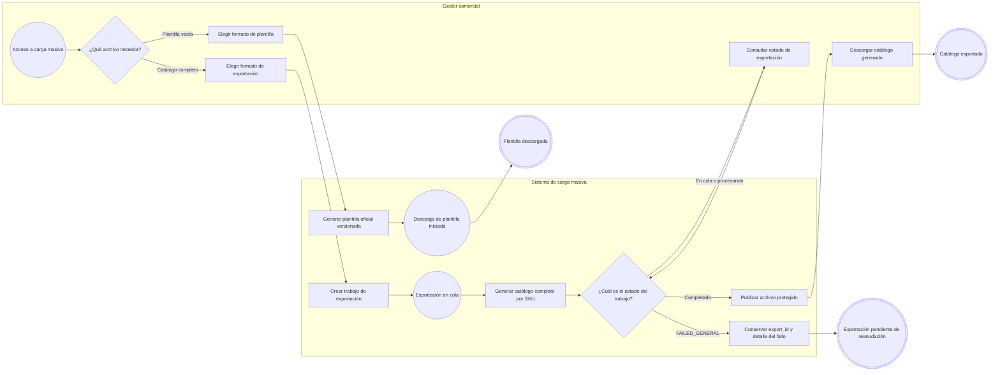
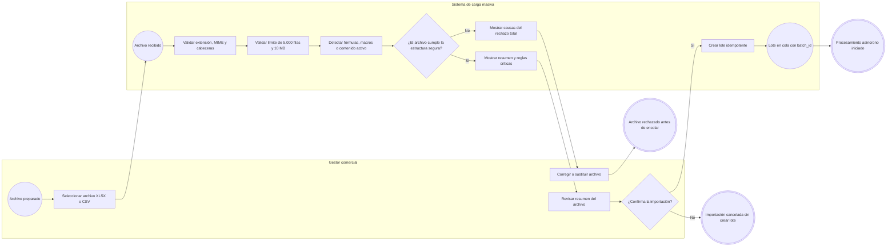
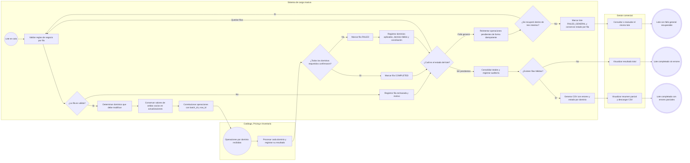

# FLOW-001 — Carga y exportación masiva de productos

## 1. Identificación

- **Código:** FLOW-001
- **Funcionalidad:** Carga y exportación masiva de productos
- **Relacionado con:** [HU-001](../hu/HU-001-carga-exportacion-masiva-productos.md) / [SPEC-001](../specs/SPEC-001-carga-exportacion-masiva-productos.md) / [WF-001](../wireframes/flows/WF-001-carga-exportacion-masiva-productos.md)
- **Responsable:** Marco Renato Castilla Huanca
- **Última actualización:** 2026-09-23

---

## 2. Objetivo del flujo

Representar la descarga de la plantilla oficial, la exportación asíncrona del catálogo y la importación masiva de productos y variantes. El flujo incluye la prevalidación del archivo, el procesamiento por fila en los dominios correspondientes y la presentación de resultados totales, parciales o generales sin asumir una reversión distribuida.

---

## 3. Actores participantes

- **Gestor comercial:** descarga archivos, prepara y confirma importaciones y consulta sus resultados.
- **Sistema de carga masiva:** valida archivos, administra lotes y exportaciones y consolida resultados.
- **Catálogo:** crea o actualiza productos y variantes y valida su identidad y versión.
- **Pricing:** aplica precios y valida su versión.
- **Inventario:** aplica conteos por ubicación con control de versión y registra el ajuste.

---

## 4. Diagramas de flujo

### 4.1 Descarga de plantilla y exportación del catálogo

### 4.2 Selección, prevalidación y confirmación de una importación

### 4.3 Procesamiento del lote y consolidación del resultado

