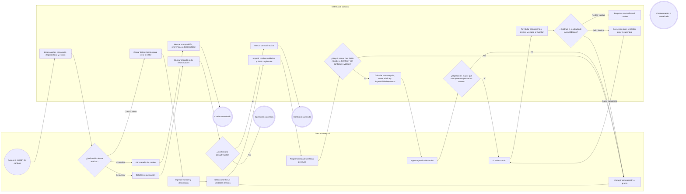
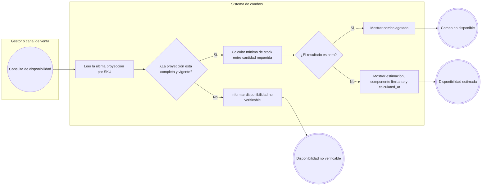
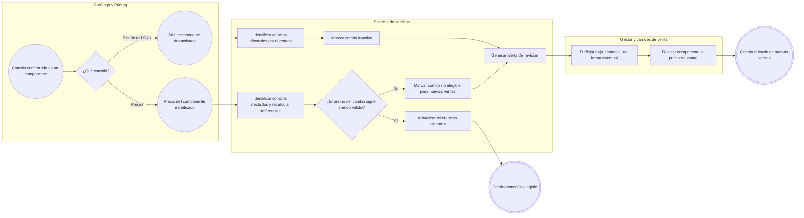
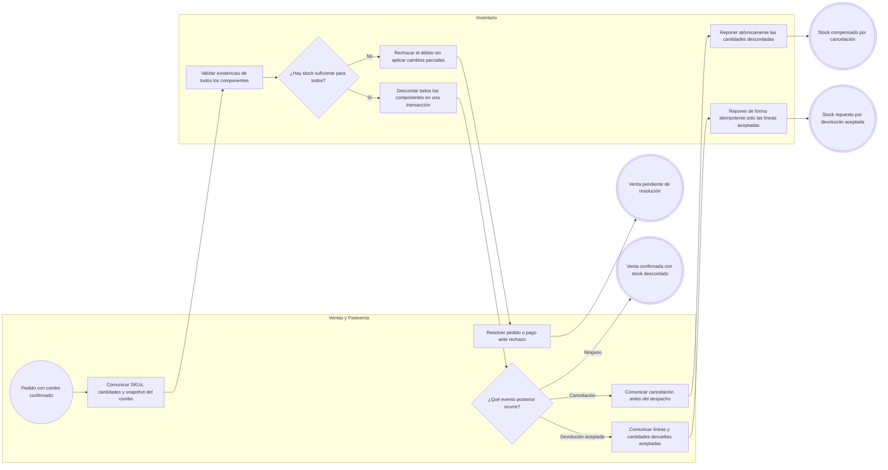

# FLOW-002 — Gestión de combos de productos

## 1. Identificación

- **Código:** FLOW-002
- **Funcionalidad:** Gestión de combos de productos
- **Relacionado con:** [HU-002](../hu/HU-002-gestion-combos-productos.md) / [SPEC-002](../specs/SPEC-002-gestion-combos-productos.md) / [WF-002](../wireframes/flows/WF-002-gestion-combos-productos.md)
- **Responsable:** Marco Renato Castilla Huanca
- **Última actualización:** 2026-09-23

---

## 2. Objetivo del flujo

Representar la consulta, creación, edición y desactivación de combos compuestos por SKUs vendibles directos. El flujo contempla la validación de componentes, cantidades y precio, el cálculo informativo de disponibilidad, la reacción ante cambios en los componentes y los movimientos atómicos de inventario derivados del ciclo de una venta confirmada.

---

## 3. Actores participantes

- **Gestor comercial:** consulta, crea, edita y desactiva combos.
- **Sistema de combos:** valida la composición y el precio, calcula la disponibilidad y mantiene el estado comercial del combo.
- **Catálogo y Pricing:** informan elegibilidad, estado y precios vigentes de los SKUs.
- **Inventario:** proporciona la proyección de existencias y ejecuta débitos o reposiciones atómicas.
- **Ventas y Postventa:** comunican ventas confirmadas, cancelaciones y devoluciones aceptadas.
- **Canales de venta:** consultan la disponibilidad y reflejan el estado comercial del combo.

---

## 4. Diagramas de flujo

### 4.1 Consulta, creación, edición y desactivación manual

### 4.2 Cálculo de disponibilidad informativa

> La disponibilidad es una estimación y no reserva ni garantiza stock. Inventario realiza la validación vinculante únicamente al confirmar la venta.

### 4.3 Reacción ante cambios en componentes y precios

### 4.4 Débito, compensación y devolución de inventario

