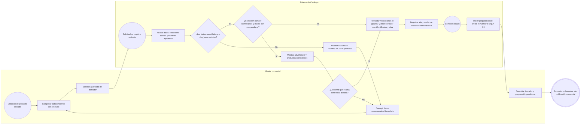
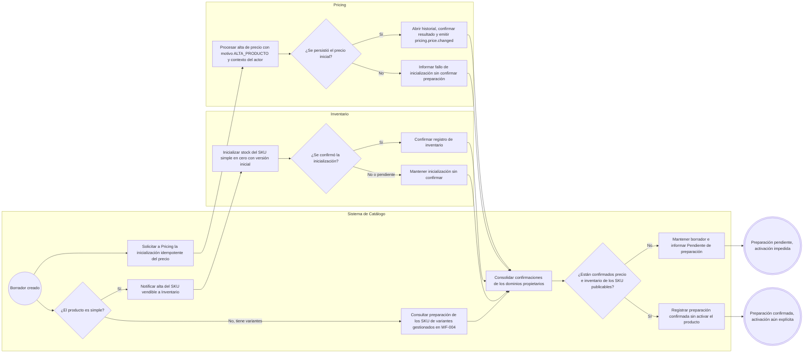
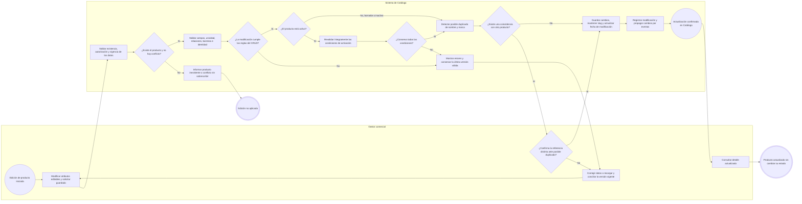
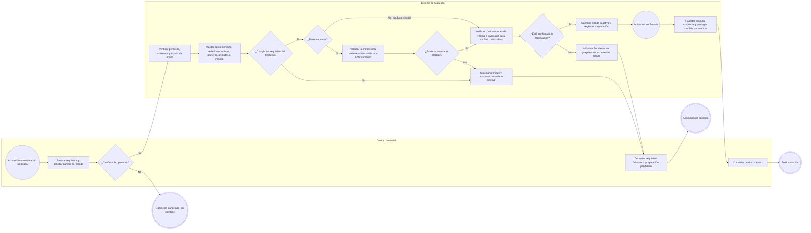
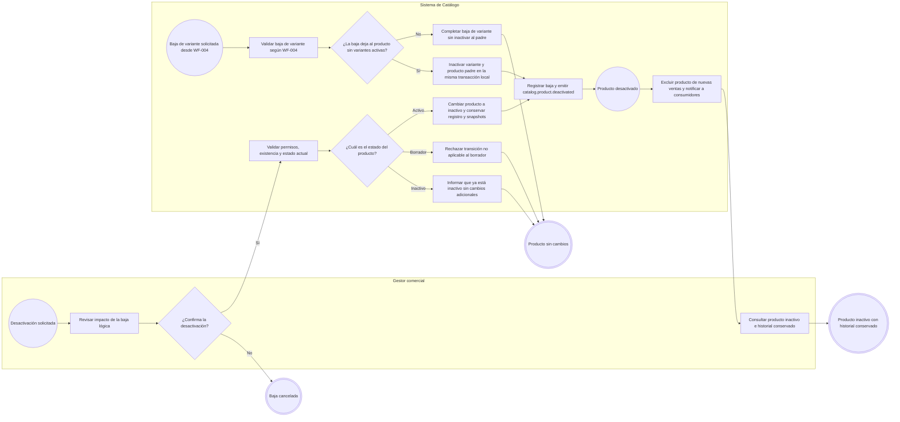
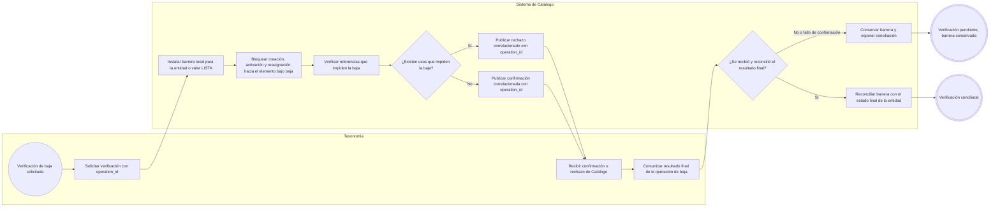
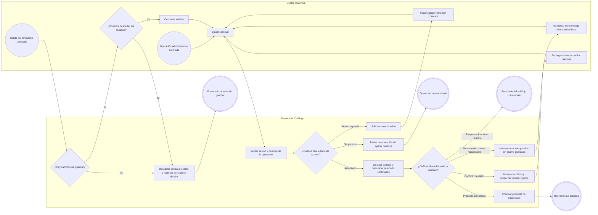

# FLOW-003 — Gestión de productos (CRUD principal)

## 1. Identificación

- **Código:** FLOW-003
- **Funcionalidad:** Gestión de productos (CRUD principal)
- **Relacionado con:** [HU-003](../hu/HU-003-gestion-productos-crud.md) / [SPEC-003](../specs/SPEC-003-gestion-productos-crud.md) / [WF-003](../wireframes/flows/WF-003-gestion-productos-crud.md)
- **Prototipo de referencia:** [WF-003 — Prototipo HTML](../wireframes/prototipos/WF-003-gestion-productos-crud/index.html)
- **Responsable:** Gabriel Poma Gutierrez
- **Última actualización:** 2026-09-23

---

## 2. Objetivo del flujo

Representar la consulta, creación en borrador, actualización, activación, desactivación y reactivación de productos. Incluye las validaciones según el estado, la preparación de precio e inventario, la conservación del historial y los caminos de rechazo, cancelación y recuperación.

La baja es lógica. La gestión de variantes pertenece a WF-004; el CRUD solo configura sus características identificadoras antes de la primera variante, verifica su elegibilidad para activar el producto y recibe el efecto de la baja de la última variante activa. El precio posterior al alta y el stock se gestionan en sus funcionalidades correspondientes.

**Criterio de lectura de las fuentes:** se aplica la prioridad SPEC → HU → WF establecida en WF-003. Por ello, nombre y marca coincidentes generan una advertencia confirmable, aunque el escenario 5 de la HU todavía mencione un rechazo; los atributos provienen del tipo de producto, no de la categoría; y los cambios se confirman en Catálogo y se propagan por eventos, sin garantizar visibilidad instantánea global. Los controles de simulación del HTML no representan acciones reales del gestor.

---

## 3. Actores participantes

- **Gestor comercial:** consulta productos, completa sus datos, confirma operaciones y corrige requisitos pendientes.
- **Sistema de Catálogo:** autoriza operaciones, valida datos y estados, mantiene el producto y su slug, registra trazabilidad y comunica cambios.
- **Pricing:** registra y confirma el precio inicial y abre su historial de auditoría.
- **Inventario:** inicializa y confirma el registro de inventario de los SKU vendibles; es propietario del stock.
- **Canales de venta:** consultan el catálogo comercial y la disponibilidad vigente.
- **Taxonomía:** coordina con Catálogo la verificación de bajas de categorías, marcas y valores LISTA.

---

## 4. Diagramas de flujo

Los subflujos siguen las convenciones de [FLOW_TEMPLATE](FLOW_TEMPLATE.md). Cada solicitud administrativa valida sesión y permisos en el sistema, aunque el prototipo oculte una acción. Los rechazos y las operaciones de escritura dejan trazabilidad con usuario, fecha/hora y resultado; los cambios exitosos registran también la modificación realizada. Los errores transversales se desarrollan en 4.8.

### 4.1 Consulta de listado y detalle

El listado administrativo permite consultar borradores, activos e inactivos mediante filtros por categoría, marca y estado. La consulta comercial solo expone productos activos y verifica las condiciones vigentes del SKU ofrecido.

```mermaid
flowchart LR
    subgraph GESTOR["Gestor comercial"]
        direction TB
        INICIO((Consulta administrativa solicitada))
        G1["Consultar listado por categoría, marca o estado"]
        G2["Seleccionar producto o consultar identificador o slug"]
        G3["Revisar detalle y acciones según estado y permiso"]
        G4["Limpiar o ajustar filtros"]
    end

    subgraph CANAL["Canales de venta"]
        direction TB
        IC((Consulta comercial solicitada))
        C1["Solicitar listado o detalle comercial"]
        C2["Consultar productos y disponibilidad vigente"]
    end

    subgraph CATALOGO["Sistema de Catálogo"]
        direction TB
        S1["Validar acceso y consultar productos administrativos"]
        D1{"¿Hay resultados?"}
        S2["Mostrar catálogo vacío o filtros sin coincidencias"]
        S3["Mostrar listado y conservar filtros y página"]
        S4["Consultar detalle del producto"]
        D2{"¿Existe el producto?"}
        S5["Informar producto no encontrado"]
        S6["Mostrar datos, estado y requisitos pendientes"]
        S7["Consultar solo productos activos y verificar preparación y disponibilidad vigente"]
        S8["Devolver listado o detalle comercial elegible"]
    end

    FIN_ADMIN(((Consulta administrativa completada)))
    FIN_NO_EXISTE(((Producto no encontrado)))
    FIN_CANAL(((Consulta comercial completada)))

    INICIO --> G1 --> S1 --> D1
    D1 -->|"No"| S2 --> G4 --> G1
    D1 -->|"Sí"| S3 --> G2
    INICIO --> G2
    G2 --> S4 --> D2
    D2 -->|"No"| S5 --> FIN_NO_EXISTE
    D2 -->|"Sí"| S6 --> G3 --> FIN_ADMIN
    IC --> C1 --> S7 --> S8 --> C2 --> FIN_CANAL
```

Un listado sin coincidencias es una respuesta exitosa, no un error. Desde el detalle se inicia la edición (4.4) o el cambio de estado correspondiente (4.5–4.6); al regresar al listado se conserva el contexto de consulta. La comprobación de acceso también aplica a la consulta directa del detalle.

### 4.2 Creación de producto en borrador

Los ocho datos mínimos son nombre, descripción, `categoria_id`, `tipo_producto_id`, `marca_id`, precio base referencial, `sku_base` y `tiene_variantes`. No se exige imagen ni completar valores obligatorios del tipo para guardar un borrador.

`sku_base` es único frente a productos en cualquier estado. Categoría, tipo y marca deben existir y estar activos; una barrera de baja impide crear vínculos con la entidad afectada. La revalidación al guardar puede rechazar el registro por las mismas causas, sin crear el producto.

Si `tiene_variantes=true`, se configuran las características identificadoras LISTA activas permitidas por el tipo antes de crear la primera variante. Su conjunto queda fijo desde esa primera variante, aunque luego se inactive. Cambiar categoría no altera el esquema ni las identidades existentes. Un producto simple utiliza `sku_base` como su único SKU vendible.

### 4.3 Preparación posterior al alta

Crear el borrador no confirma la preparación comercial. Este subflujo representa responsabilidades y resultados; no impone un orden entre las confirmaciones de Pricing e Inventario.

La solicitud a Pricing contiene `product_id`, `sku_base` y precio base. Solo Pricing emite `pricing.price.changed`, después de persistir. La ausencia de respuesta también deja la preparación pendiente; una confirmación posterior permite reevaluarla. No se fija aquí una política de reintentos no definida en SPEC-003.

El padre con variantes no tiene stock propio. La inicialización de sus SKU pertenece a la gestión de variantes y a Inventario. Inventario inicializado no significa stock positivo ni disponibilidad asegurada para una venta.

### 4.4 Actualización de producto

El formulario mantiene `tiene_variantes` de solo lectura y no permite cambiar el precio posterior al alta ni el stock. Cambiar `tipo_producto_id` cuando afecta identidad publicada o variantes requiere migración controlada, fuera de este CRUD. No se modifican por edición ordinaria las características identificadoras fijadas por la primera variante.

Una edición inválida de un activo se rechaza completa: no lo convierte en borrador ni sustituye su última versión válida. Guardar un inactivo no lo reactiva. El mantenimiento del slug pertenece a Catálogo; la política de redirección de enlaces anteriores y el mecanismo concreto de concurrencia siguen pendientes en WF-003.

### 4.5 Activación y reactivación

Este subflujo aplica a **borrador → activo** y **inactivo → activo**. La reactivación repite todas las validaciones, incluidas las confirmaciones de preparación; no reutiliza como garantía las condiciones de una activación anterior.

Se exige al menos una imagen y todos los valores obligatorios definidos por el tipo activo. Si no hay atributos obligatorios, ese requisito se considera cumplido sin inventar uno. La prevalidación del detalle puede mostrar faltantes antes de confirmar; el sistema vuelve a validar al ejecutar la solicitud. Los fallos de autorización, existencia o conflicto siguen 4.8.

Para resolver faltantes, el gestor edita el producto (4.4), gestiona variantes en WF-004 o espera la preparación de 4.3 y vuelve a solicitar activación. Una variante activa con padre borrador no es comercialmente vendible.

### 4.6 Desactivación manual y baja por última variante activa

La baja de la variante se valida y audita en WF-004; aquí se representa su efecto sobre el padre y se emiten los eventos correspondientes a ambas bajas. Promociones, Combos y otros consumidores reaccionan a la notificación para nuevas operaciones. Los pedidos confirmados conservan sus snapshots. Reactivar al padre requiere una variante elegible y volver a ejecutar 4.5.

### 4.7 Verificación asíncrona de bajas de entidades maestras

Este subflujo cubre la coordinación exigida por CA-14 y CA-17, sin incorporar la administración de categorías, marcas o características al CRUD.

Para un valor LISTA se comprueba si lo usa un SKU activo como identidad o un producto activo como valor requerido. Las reglas de baja de categorías y marcas pertenecen a SPEC-008 y SPEC-011. La comprobación de barrera y la escritura del producto se coordinan transaccionalmente; una proyección conocida como obsoleta no autoriza la operación. Un fallo de confirmación no autoriza la baja ni altera SKU o pedidos históricos.

### 4.8 Autorización, errores recuperables y cancelación

Aplica a los subflujos administrativos anteriores. No define endpoints, códigos de error ni mecanismos de concurrencia que siguen pendientes en WF-003.

Durante una solicitud se evita el envío repetido. Crear o cambiar estado solo se presenta como exitoso tras confirmación del sistema; después se refrescan detalle y listado. Un rechazo funcional conserva los datos para corregirlos según el subflujo correspondiente. Ante errores de conexión no se afirma que la operación haya sido guardada.
