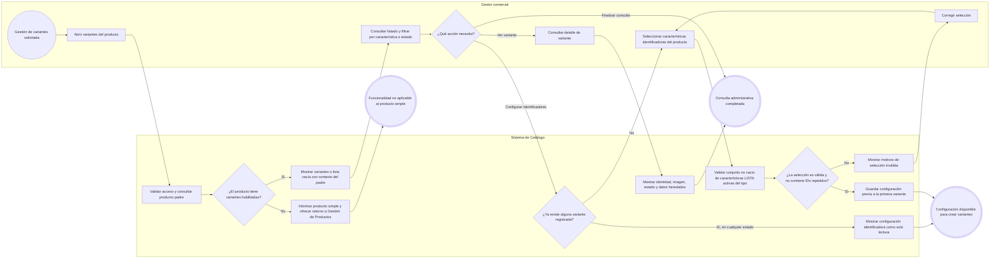
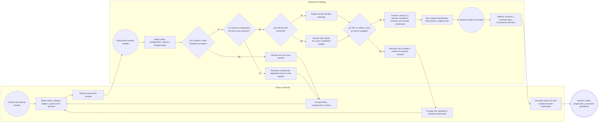
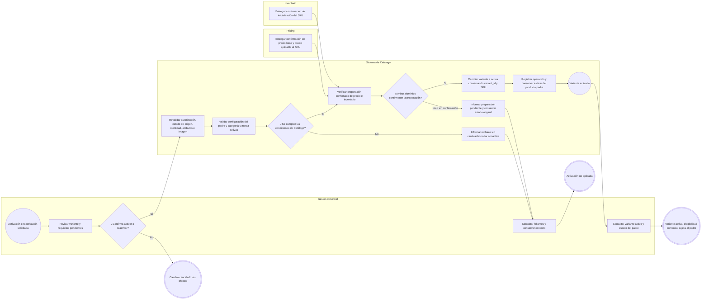
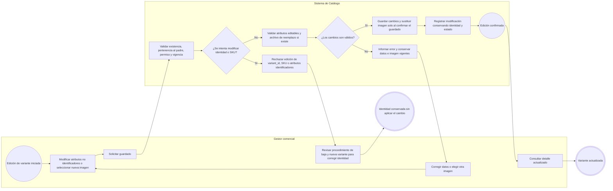
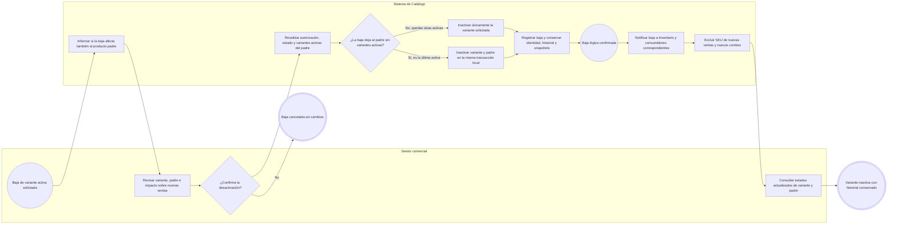
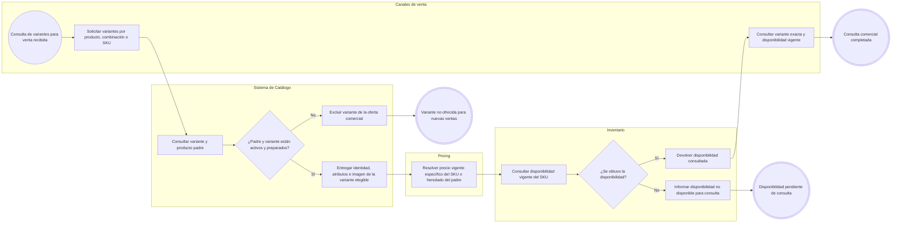
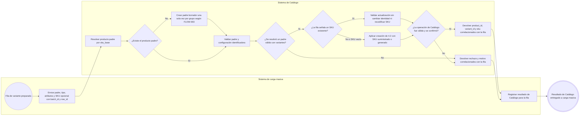
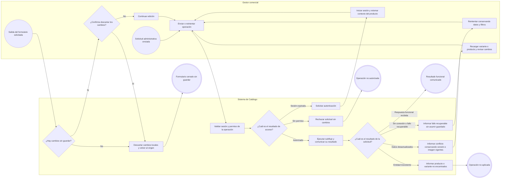

# FLOW-004 — Gestión avanzada de variantes (SKUs)

## 1. Identificación

- **Código:** FLOW-004
- **Funcionalidad:** Gestión avanzada de variantes (SKUs)
- **Relacionado con:** [HU-004](../hu/HU-004-gestion-variantes-skus.md) / [SPEC-004](../specs/SPEC-004-gestion-variantes-skus.md) / [WF-004](../wireframes/flows/WF-004-gestion-variantes-skus.md)
- **Prototipo de referencia:** [WF-004 — Prototipo HTML](../wireframes/prototipos/WF-004-gestion-variantes-skus/index.html)
- **Flujos relacionados:** [FLOW-003 — Productos](FLOW-003-gestion-productos-crud.md) / [FLOW-001 — Carga masiva](FLOW-001-carga-exportacion-masiva-productos.md)
- **Responsable:** Gabriel Poma Gutierrez
- **Última actualización:** 2026-09-23

---

## 2. Objetivo del flujo

Representar la configuración de características identificadoras, consulta, creación en borrador, edición, activación, reactivación y desactivación de variantes para productos con `tiene_variantes=true`. El flujo contempla un `variant_id` interno inmutable, SKU comercial suministrado o generado, combinación única de valores e imagen propia, así como la preparación en Pricing e Inventario y el efecto de la baja de la última variante activa sobre el producto padre.

El producto padre aporta sus datos generales; cada variante identifica una combinación comercial concreta. El stock pertenece exclusivamente a Inventario y el precio a Pricing. Las variantes se conservan mediante baja lógica, sin eliminación física ni alteración de snapshots de pedidos confirmados.

**Criterio de lectura de las fuentes:** se aplica SPEC → HU → WF, conforme a WF-004. El HTML se toma como referencia de navegación y estados, no como contrato completo: su validación de activación no verifica todas las preparaciones, su baja no inactiva todavía al padre y su ejemplo genera SKU a partir de etiquetas. Este FLOW conserva las reglas normativas: identidad basada en IDs estables, preparación confirmada y baja del padre junto con la última variante activa.

---

## 3. Actores participantes

- **Gestor comercial:** configura identificadores del producto, consulta y administra las variantes y confirma cambios de estado.
- **Sistema de Catálogo:** valida autorización, identidad y reglas; genera `variant_id`; valida o genera SKU; guarda variantes y registra trazabilidad.
- **Inventario:** inicializa el stock por SKU en cero, confirma su registro y entrega disponibilidad vigente.
- **Pricing:** confirma preparación del precio y determina el precio específico por SKU o la herencia del precio base.
- **Canales de venta:** consultan variantes comercialmente elegibles y su disponibilidad.
- **Sistema de carga masiva:** entrega filas de creación o actualización y recibe resultados correlacionados.

---

## 4. Diagramas de flujo

Se siguen las convenciones de [FLOW_TEMPLATE](FLOW_TEMPLATE.md). Toda operación administrativa valida sesión y permiso en el sistema, incluso si la interfaz oculta la acción. Cada creación, edición, cambio de imagen o estado deja trazabilidad con usuario, fecha/hora, modificación y resultado. Los errores de autorización, conexión, existencia y concurrencia son transversales y se detallan en 4.8.

### 4.1 Acceso, consulta administrativa y configuración de identificadores

La entrada habitual es **Gestionar variantes** desde el detalle del producto. El contexto del padre se conserva al consultar, crear o editar; el listado incluye variantes en borrador, activas e inactivas y permite filtrar por característica o estado.

La configuración pertenece al producto y puede completarse desde WF-003 antes de la primera variante; no implica una pantalla nueva obligatoria. Solo admite `caracteristica_id` distintos, de tipo LISTA, activos y aplicables al `tipo_producto_id`. NUMERO y TEXTO no identifican variantes en este alcance.

Desde la primera variante, el conjunto queda fijo aunque todas se desactiven después. Cambiar la categoría de navegación o renombrar etiquetas no cambia identidad ni SKU. Un cambio incompatible de tipo requiere migración fuera del CRUD; no reescribe identidades existentes y bloquea nuevas creaciones o activaciones con configuración inválida.

La ausencia de variantes o de coincidencias con los filtros produce una lista vacía exitosa. Sin variantes, el gestor puede iniciar 4.2; el padre no puede activarse hasta contar con al menos una variante activa válida y cumplir FLOW-003.

### 4.2 Creación de variante con SKU suministrado o generado

La creación individual parte de un producto existente en borrador o activo con `tiene_variantes=true`. Cada variante requiere exactamente un `valor_id` activo, perteneciente a cada LISTA identificadora configurada, y al menos una imagen propia; la imagen general del padre no sustituye este requisito.

La combinación no admite identificadores faltantes ni extra y se compara por IDs estables, no por etiquetas. Su unicidad se comprueba dentro del padre frente a todas sus variantes; la del SKU se comprueba globalmente frente a productos y variantes. Ambas restricciones se confirman al persistir, incluso ante solicitudes concurrentes.

`variant_id` se genera siempre y no es el SKU comercial. Si el gestor aporta un SKU válido, se conserva; si lo omite, se aplica la convención vigente sin inventar aquí una nomenclatura nueva. Un rechazo de creación no expone una variante parcial. La imagen se valida por formato, tamaño y contenido, sin fijar límites que aún están pendientes en WF-004.

### 4.3 Preparación, activación y reactivación

Inventario inicializa el SKU recién creado en cero y confirma su registro. Catálogo no almacena ni calcula esa cantidad. Pricing confirma el precio base del padre y el precio aplicable al SKU: específico si existe, o heredado del precio base vigente. La preparación puede quedar pendiente después de crear el borrador.

Las transiciones son **BORRADOR → ACTIVA** e **INACTIVA → ACTIVA**, mediante acción explícita y las mismas validaciones. La prevalidación de pantalla no sustituye la comprobación al ejecutar. Tras corregir datos o recibir la preparación pendiente se vuelve a solicitar la operación; la llegada de una confirmación no activa por sí sola la variante.

Una variante preparada puede activarse con padre borrador o inactivo: el padre no se activa ni reactiva automáticamente. Su activación corresponde a FLOW-003 y la elegibilidad comercial se comprueba en 4.6. Inventario inicializado en cero cumple la preparación del registro, pero no garantiza existencias para vender.

### 4.4 Edición de atributos no identificadores e imagen

El formulario presenta identidad y SKU como solo lectura, sin controles de precio, stock ni cambio de estado. La imagen vigente permanece asociada si el archivo nuevo es inválido o el guardado falla; un reemplazo no confirmado no se presenta como aplicado. Los mensajes distinguen formato no permitido y tamaño excedido cuando el contrato lo informa.

Los atributos identificadores son inmutables desde la creación, incluso con SKU externo. Para corregir una combinación se sigue la baja y el registro de una nueva combinación, sin reutilizar una identidad ya registrada. La recodificación de un SKU publicado exige migración explícita fuera de este flujo; no se ofrece edición ordinaria del SKU.

### 4.5 Desactivación y efecto sobre la última variante activa

La confirmación advierte explícitamente la baja del padre cuando corresponda. El sistema vuelve a comprobar el contexto al ejecutar; un conflicto se trata según 4.8. Si quedan otras variantes activas, el padre mantiene su estado. Si era la última, ambas bajas se confirman en la misma transacción de Catálogo y se emiten las notificaciones correspondientes, incluida `catalog.product.deactivated` para el padre según FLOW-003.

No se modifican los stocks de las demás variantes ni se borran pedidos confirmados. La reactivación posterior conserva SKU y `variant_id`, ejecuta 4.3 y no reactiva al padre; este debe pasar por FLOW-003.

### 4.6 Consulta comercial y disponibilidad por SKU

La elegibilidad requiere simultáneamente padre activo, variante activa, precio preparado y SKU inicializado. Un fallo de consulta de Inventario no equivale a stock cero; tampoco se infiere disponibilidad a partir del estado ACTIVA. El orden del diagrama es funcional y no prescribe la arquitectura de consulta entre servicios. Si precio o disponibilidad se muestran en el detalle administrativo, son datos informativos de sus dominios propietarios.

Los combos utilizan el SKU vendible de la variante, no el identificador genérico del padre. La creación de pedidos, reservas, precios y combos queda fuera de este flujo.

### 4.7 Entrada desde carga masiva

Este subflujo corresponde al requisito 4.2 de SPEC-004. La selección del archivo, validación estructural, procesamiento del lote y reporte global pertenecen a FLOW-001; aquí se representa únicamente la operación de Catálogo sobre la variante.

Si el SKU informado ya existe, la fila representa una actualización de esa identidad, no la creación de otra variante con código duplicado. Se rechaza cualquier intento de cambiar sus atributos identificadores o recodificarla. Para el alta con SKU vacío, Catálogo genera el SKU; siempre genera el `variant_id` de una nueva variante.

Las creaciones conservan los requisitos de combinación e imagen propios de la variante y quedan en BORRADOR. La respuesta exitosa de Catálogo no significa que Pricing e Inventario hayan completado sus operaciones ni garantiza éxito total de la fila: la consolidación por dominio pertenece a FLOW-001.

### 4.8 Autorización, recuperación de errores y cancelación

Las validaciones de combinación, SKU, imagen y preparación se muestran en su subflujo y permiten corregir sin perder el contexto. Se conserva el archivo seleccionado cuando sea posible y seguro; en edición nunca se elimina la imagen vigente por un fallo. Durante el envío se bloquea la repetición de la solicitud y el éxito se muestra solo después de la confirmación.

Tras crear, editar o cambiar estado se refrescan listado, detalle y resumen del padre. Los contratos exactos de API, formatos y límites de archivo, permisos granulares y estrategia de concurrencia permanecen pendientes en WF-004; este flujo no los convierte en decisiones de implementación.
