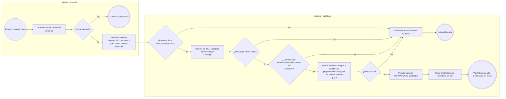
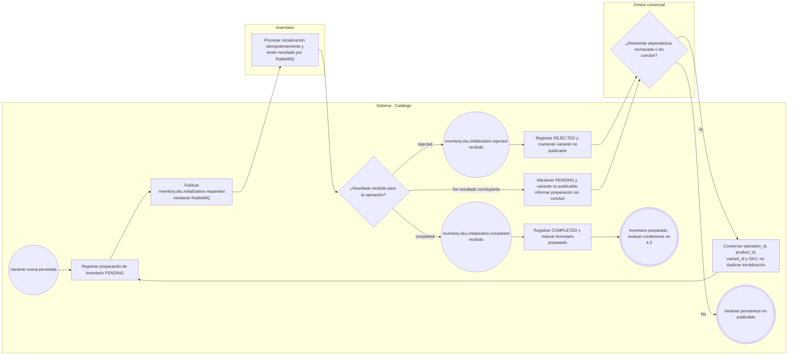
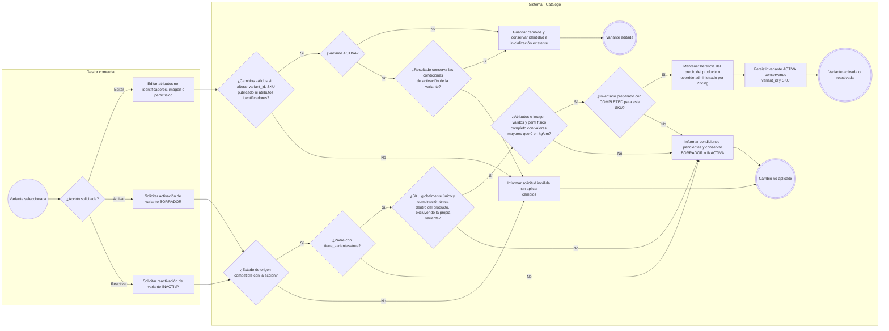
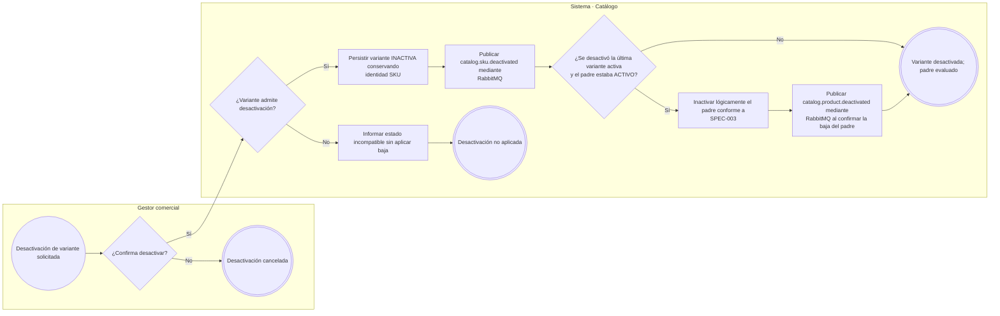

# FLOW-004 — Gestión de variantes y SKU

## 1. Identificación

- **Código:** FLOW-004.
- **Funcionalidad:** Gestión de variantes y SKU.
- **Relacionado con:** [SPEC-004](../specs/SPEC-004-gestion-variantes-skus.md) / [WF-004](../wireframes/flows/WF-004-gestion-variantes-skus.md) / [índice WF-004](../wireframes/prototipos/WF-004-gestion-variantes-skus/index.html) / [HU-004](../hu/HU-004-gestion-variantes-skus.md) / [FLOW-003](FLOW-003-gestion-productos-crud.md).
- **Responsable:** Gabriel Poma Gutierrez.
- **Última actualización:** 2026-10-02.
- **Contratos consultados:** [OpenAPI vigente 0.5.0](../api/openapi.yaml) y [AsyncAPI 0.4.0](../asyncapi/asyncapi.yaml). La ruta de reactivación se mantiene en el contrato vigente.

## 2. Objetivo del flujo

Representar consulta, creación, preparación de inventario, edición, activación, desactivación y reactivación de las unidades vendibles de un producto con variantes, conservando su identidad SKU y la herencia de precio.

## 3. Actores participantes

- **Gestor comercial:** administra variantes y solicita cambios de estado o reintentos.
- **Sistema (Catálogo):** valida identidad y perfil físico, persiste variantes y coordina mensajes mediante RabbitMQ.
- **Inventario:** inicializa cada SKU idempotentemente y emite el resultado por RabbitMQ.

## 4. Diagrama de flujo

### 4.1. Consulta y creación

```mermaid
flowchart LR
    subgraph G["Gestor comercial"]
        direction TB
        INICIO(("Producto seleccionado"))
        CONSULTAR["Consultar lista o detalle de variantes"]
        ACCION{"¿Crear variante?"}
        DATOS["Completar atributos, imagen, SKU opcional y<br/>perfil físico; solicitar creación"]
        FIN_CONSULTA((("Consulta completada")))
    end
    subgraph S["Sistema · Catálogo"]
        direction TB
        MODELO{"¿Producto tiene tiene_variantes=true?"}
        SKU["Determinar SKU solicitado o generado por<br/>Catálogo"]
        UNICO{"¿SKU globalmente único?"}
        COMBINACION{"¿Combinación identificadora única dentro del<br/>producto?"}
        VALIDAR["Validar atributos, imagen y perfil físico<br/>proporcionado en kg/cm con valores mayores<br/>que 0"]
        VALIDO{"¿Datos válidos?"}
        GUARDAR["Persistir variante BORRADOR no publicable"]
        PREPARAR["Iniciar preparación de Inventario en 4.2"]
        RECHAZAR["Informar errores sin crear variante"]
        FIN_OK((("Variante guardada; preparación en curso")))
        FIN_ERROR((("Alta rechazada")))
    end
    INICIO --> CONSULTAR --> ACCION
    ACCION -->|"No"| FIN_CONSULTA
    ACCION -->|"Sí"| DATOS --> MODELO
    MODELO -->|"No"| RECHAZAR
    MODELO -->|"Sí"| SKU --> UNICO
    UNICO -->|"No"| RECHAZAR
    UNICO -->|"Sí"| COMBINACION
    COMBINACION -->|"No"| RECHAZAR
    COMBINACION -->|"Sí"| VALIDAR --> VALIDO
    VALIDO -->|"No"| RECHAZAR
    VALIDO -->|"Sí"| GUARDAR --> PREPARAR --> FIN_OK
    RECHAZAR --> FIN_ERROR
```

El perfil físico pertenece al SKU de variante: `pesoKg > 0`, `largoCm > 0`, `anchoCm > 0`, `altoCm > 0`, con kg y cm como unidades contractuales. El padre no representa una unidad física ni crea saldo propio. El contrato permite omitir el perfil al crear; completarlo forma parte de la preparación antes de activar.

Crear una variante **no ejecuta** `pricing.product.initialization.requested` ni crea precio base propio. Sin override hereda el precio vigente del producto; un override posterior lo administra Pricing desde Gestión de precios.

### 4.2. Inicialización de Inventario y reintento

```mermaid
flowchart LR
    subgraph S["Sistema · Catálogo"]
        direction TB
        INICIO(("Variante nueva persistida"))
        PENDING["Registrar preparación de Inventario PENDING"]
        REQUEST["Publicar<br/>inventory.sku.initialization.requested<br/>mediante RabbitMQ"]
        RESULTADO{"¿Resultado recibido para la operación?"}
        COMPLETED(("inventory.sku.initialization.completed<br/>recibido"))
        REJECTED(("inventory.sku.initialization.rejected<br/>recibido"))
        LISTO["Registrar COMPLETED y marcar Inventario<br/>preparado"]
        RECHAZO["Registrar REJECTED y mantener variante no<br/>publicable"]
        ESPERA["Mantener PENDING y variante no publicable;<br/>informar preparación sin concluir"]
        CONSERVAR["Conservar operation_id, product_id,<br/>variant_id y SKU; no duplicar inicialización"]
        FIN_OK((("Inventario preparado; evaluar condiciones en<br/>4.3")))
        FIN_PENDIENTE((("Variante permanece no publicable")))
    end
    subgraph I["Inventario"]
        direction TB
        PROCESAR["Procesar inicialización idempotentemente y<br/>emitir resultado por RabbitMQ"]
    end
    subgraph G["Gestor comercial"]
        direction TB
        RETRY{"¿Reintentar dependencia rechazada o sin<br/>concluir?"}
    end
    INICIO --> PENDING --> REQUEST --> PROCESAR --> RESULTADO
    RESULTADO -->|"completed"| COMPLETED --> LISTO --> FIN_OK
    RESULTADO -->|"rejected"| REJECTED --> RECHAZO --> RETRY
    RESULTADO -->|"Sin resultado concluyente"| ESPERA --> RETRY
    RETRY -->|"Sí"| CONSERVAR --> PENDING
    RETRY -->|"No"| FIN_PENDIENTE
```

El comando contiene `sku`, `product_id`, `variant_id` y `default_location_id` opcional. `requested` solo inicia la preparación; `completed` confirma que terminó. Un rechazo no borra la variante ni supone rollback distribuido. El reintento conserva la identidad de operación y no crea otro SKU.

### 4.3. Edición, activación y reactivación

```mermaid
flowchart LR
    subgraph G["Gestor comercial"]
        direction TB
        INICIO(("Variante seleccionada"))
        ACCION{"¿Acción solicitada?"}
        EDITAR["Editar atributos no identificadores, imagen o<br/>perfil físico"]
        ACTIVAR["Solicitar activación de variante BORRADOR"]
        REACTIVAR["Solicitar reactivación de variante INACTIVA"]
    end
    subgraph S["Sistema · Catálogo"]
        direction TB
        EDICION{"¿Cambios válidos sin alterar variant_id, SKU<br/>publicado ni atributos identificadores?"}
        EDIT_ACTIVA{"¿Variante ACTIVA?"}
        EDIT_CONDICIONES{"¿Resultado conserva las condiciones<br/>de activación de la variante?"}
        GUARDAR["Guardar cambios y conservar identidad e<br/>inicialización existente"]
        ESTADO{"¿Estado de origen compatible con la acción?"}
        MODELO{"¿Padre con tiene_variantes=true?"}
        IDENTIDAD{"¿SKU globalmente único y combinación única<br/>dentro del producto, excluyendo la propia<br/>variante?"}
        DATOS{"¿Atributos e imagen válidos y perfil físico<br/>completo con valores mayores que 0 en kg/cm?"}
        INVENTARIO{"¿Inventario preparado con COMPLETED para este<br/>SKU?"}
        PRECIO["Mantener herencia del precio del producto o<br/>override administrado por Pricing"]
        PUBLICAR["Persistir variante ACTIVA conservando<br/>variant_id y SKU"]
        BLOQUEAR["Informar condiciones pendientes y conservar<br/>BORRADOR o INACTIVA"]
        RECHAZAR["Informar solicitud inválida sin aplicar<br/>cambios"]
        FIN_EDICION((("Variante editada")))
        FIN_OK((("Variante activada o reactivada")))
        FIN_ERROR((("Cambio no aplicado")))
    end
    INICIO --> ACCION
    ACCION -->|"Editar"| EDITAR --> EDICION
    EDICION -->|"Sí"| EDIT_ACTIVA
    EDIT_ACTIVA -->|"No"| GUARDAR
    EDIT_ACTIVA -->|"Sí"| EDIT_CONDICIONES
    EDIT_CONDICIONES -->|"Sí"| GUARDAR --> FIN_EDICION
    EDIT_CONDICIONES -->|"No"| RECHAZAR
    EDICION -->|"No"| RECHAZAR --> FIN_ERROR
    ACCION -->|"Activar"| ACTIVAR --> ESTADO
    ACCION -->|"Reactivar"| REACTIVAR --> ESTADO
    ESTADO -->|"Sí"| MODELO
    ESTADO -->|"No"| RECHAZAR
    MODELO -->|"Sí"| IDENTIDAD
    MODELO -->|"No"| BLOQUEAR
    IDENTIDAD -->|"Sí"| DATOS
    IDENTIDAD -->|"No"| BLOQUEAR
    DATOS -->|"Sí"| INVENTARIO
    DATOS -->|"No"| BLOQUEAR
    INVENTARIO -->|"Sí"| PRECIO --> PUBLICAR --> FIN_OK
    INVENTARIO -->|"No"| BLOQUEAR
    BLOQUEAR --> FIN_ERROR
```

La edición valida el perfil proporcionado con `pesoKg`, `largoCm`, `anchoCm` y `altoCm` mayores que cero. Reactivar aplica las mismas condiciones de activación, conserva el SKU y no repite una inicialización completada. Si la preparación no concluyó, se utiliza el reintento idempotente de 4.2 sobre la operación existente.

La edición actualiza la misma variante, sin crear otra; si está activa y el resultado completo incumple sus requisitos de activación, se rechaza toda la edición conservando datos y estado anteriores. El perfil puede estar incompleto en borrador, con valores informados positivos; activar/reactivar exige los cuatro valores completos. El padre no registra peso ni dimensiones y el volumen de la variante es derivado. El padre no necesita estar activo para activar/reactivar una variante; los hijos en borrador o inactivos no bloquean por sí solos al padre ni se ofrecen comercialmente. Reactivar al padre no reactiva hijos inactivos.

OpenAPI denomina el estado de variante `ACTIVA` (producto: `ACTIVO`) y expone `POST /productos/{productoId}/variantes/{variantId}/reactivar`, con estado de ruta `provisional-internal`. Reactivar una variante no reactiva automáticamente al padre: el producto se revalida desde FLOW-003. Una variante activa con padre no comercialmente vendible no habilita resolución comercial; la disponibilidad de stock se consulta separadamente.

### 4.4. Desactivación y efecto sobre el padre

```mermaid
flowchart LR
    subgraph G["Gestor comercial"]
        direction TB
        INICIO(("Desactivación de variante solicitada"))
        CONFIRMAR{"¿Confirma desactivar?"}
        FIN_CANCELAR((("Desactivación cancelada")))
    end
    subgraph S["Sistema · Catálogo"]
        direction TB
        VALIDAR{"¿Variante admite desactivación?"}
        BAJA["Persistir variante INACTIVA conservando<br/>identidad SKU"]
        EVENTO["Publicar catalog.sku.deactivated mediante<br/>RabbitMQ"]
        ULTIMA{"¿Se desactivó la última variante activa<br/>y el padre estaba ACTIVO?"}
        PADRE["Inactivar lógicamente el padre conforme a<br/>SPEC-003"]
        EVENTO_PADRE["Publicar catalog.product.deactivated mediante<br/>RabbitMQ al confirmar la baja del padre"]
        ERROR["Informar estado incompatible sin aplicar baja"]
        FIN_OK((("Variante desactivada; padre evaluado")))
        FIN_ERROR((("Desactivación no aplicada")))
    end
    INICIO --> CONFIRMAR
    CONFIRMAR -->|"No"| FIN_CANCELAR
    CONFIRMAR -->|"Sí"| VALIDAR
    VALIDAR -->|"Sí"| BAJA --> EVENTO --> ULTIMA
    VALIDAR -->|"No"| ERROR --> FIN_ERROR
    ULTIMA -->|"No"| FIN_OK
    ULTIMA -->|"Sí"| PADRE --> EVENTO_PADRE --> FIN_OK
```

RabbitMQ distribuye `catalog.sku.deactivated` a los consumidores declarados en AsyncAPI 0.4.0 (`inventory-svc`, `pricing-svc`, `promotions-svc`, `combos-svc`). La baja del padre publica `catalog.product.deactivated` conforme a FLOW-003. Catálogo no realiza llamadas directas a esos consumidores ni inventa un evento de reactivación.

Si el padre estaba en `BORRADOR` o `INACTIVO`, conserva su estado al desactivar la última variante activa. Desactivar al padre conserva los estados individuales de los hijos y bloquea su exposición comercial; reactivar uno no reactiva automáticamente a los demás.

## 5. Reglas de preparación y trazabilidad

| Estado de preparación | Evidencia | Resultado funcional |
|---|---|---|
| `PENDING` | Se publicó `inventory.sku.initialization.requested`, sin resultado concluyente. | Mantener variante no publicable. |
| `COMPLETED` | Se recibió `inventory.sku.initialization.completed` de la operación correspondiente. | Permitir evaluar activación o reactivación. |
| `REJECTED` | Se recibió `inventory.sku.initialization.rejected` de la operación correspondiente. | Mantener variante no publicable y permitir reintento idempotente. |

- Estos estados pertenecen a la preparación; el estado funcional de variante es `BORRADOR`, `ACTIVA` o `INACTIVA`.
- Los reintentos conservan `operation_id`; se deduplican mensajes por `message_id` según AsyncAPI. No duplican SKU, precio ni inicializaciones.
- Los mensajes y estados técnicos se documentan aquí; la interfaz muestra mensajes operativos conforme a WF-004.
- Se conserva la prioridad solicitada: SPEC → documentación WF → índice WF → HU; los contratos vigentes respaldan las rutas y los mensajes.
