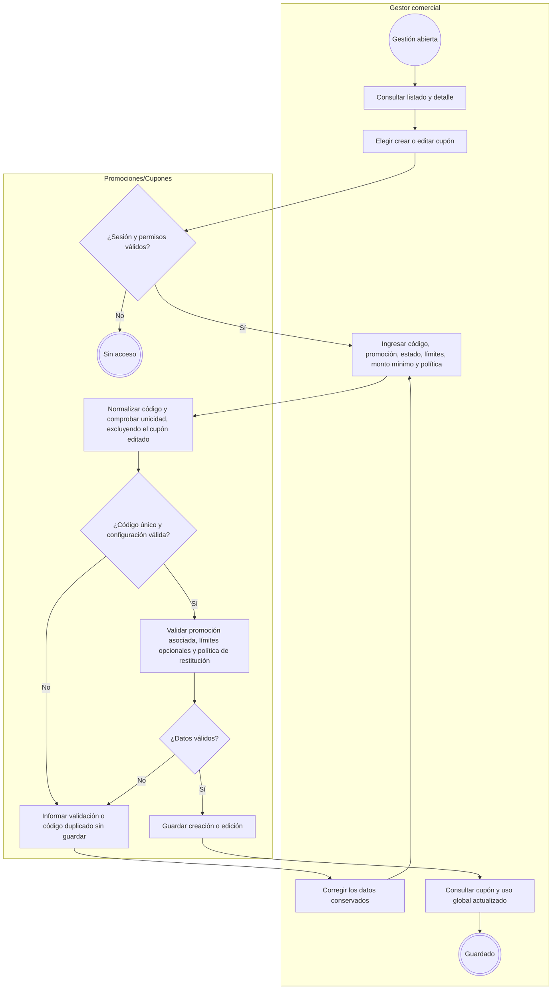
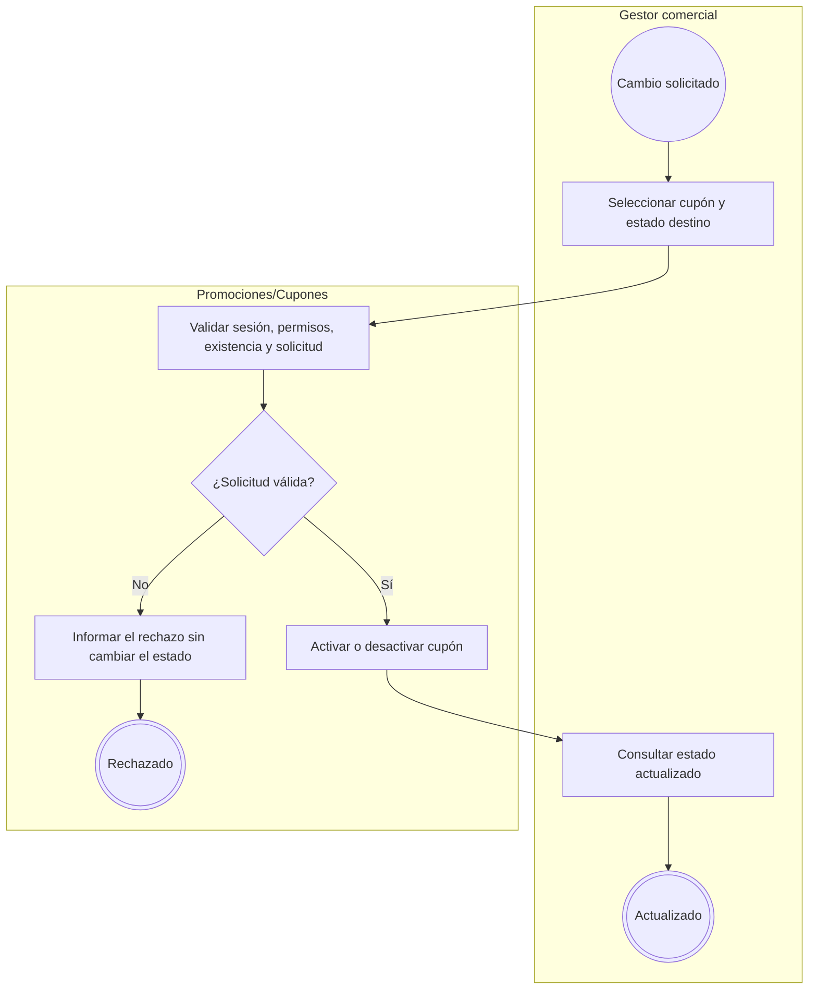
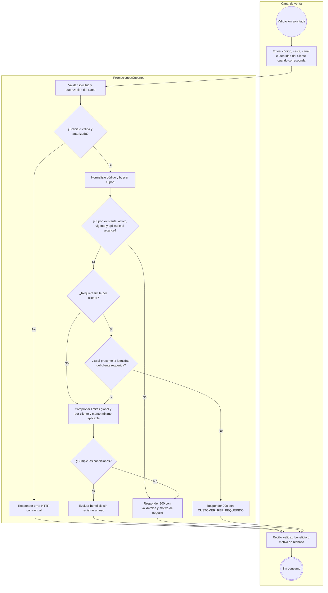
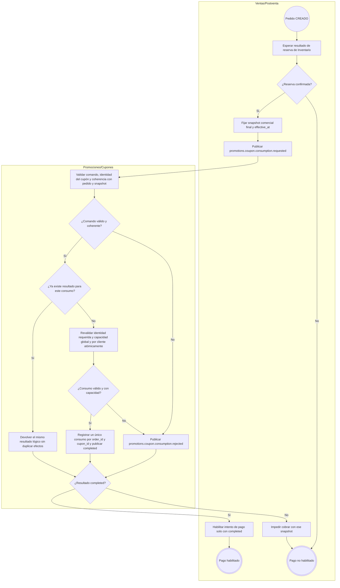
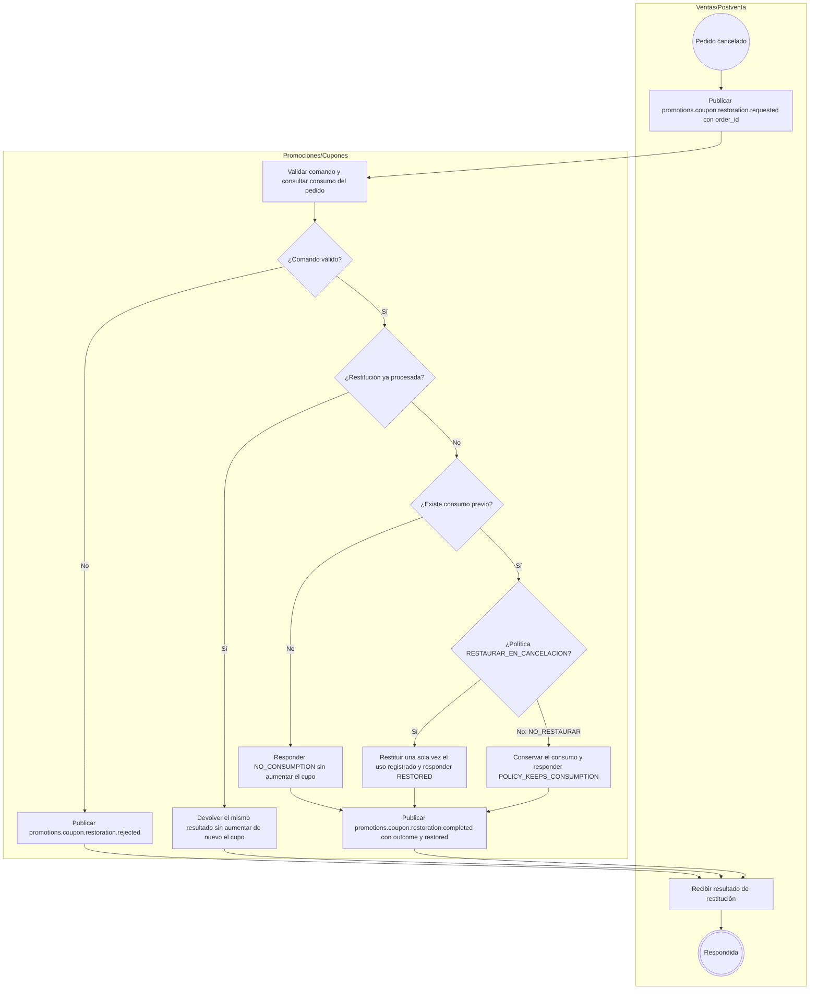

# FLOW-005 — Gestión de cupones de descuento

## 1. Identificación

- **Código:** FLOW-005
- **Funcionalidad:** Gestión de cupones de descuento
- **Relacionado con:** [SPEC-005](../specs/SPEC-005-gestion-cupones-descuento.md) / [HU-005](../hu/HU-005-gestion-cupones-descuento.md) / [WF-005](../wireframes/flows/WF-005-gestion-cupones-descuento.md)
- **Responsable:** Axel Andree Cueva Alcalá
- **Última actualización:** 2026-10-02
- **Contratos consultados:** [OpenAPI 0.5.0](../api/openapi.yaml), [AsyncAPI 0.4.0](../asyncapi/asyncapi.yaml), [catálogo de eventos](../api/catalogo-eventos.md) y [Contrato API, §§31.4–31.5](../Contrato_Api.md).

## 2. Objetivo del flujo

Representar la creación, edición y activación/desactivación de cupones asociados a promociones, su validación sin consumo y su consumo y restitución automáticos vinculados al pedido. La administración configura límites y política; Ventas/Postventa coordina el ciclo comercial y conserva el ownership del pedido y del pago.

## 3. Actores participantes

- **Gestor comercial:** consulta, crea, edita y cambia el estado de cupones con autorización de Seguridad.
- **Canal de venta:** Marketplace, Chatbot o Retail; solicita validación y transmite la identidad del cliente autenticado.
- **Promociones/Cupones (`promotions-svc`):** administra cupones, evalúa beneficios y controla usos atómicos e idempotentes.
- **Ventas/Postventa:** crea el pedido, espera la reserva confirmada, conserva el snapshot comercial y solicita consumo o restitución.

Inventario confirma la reserva al flujo de Ventas; ese proceso se documenta en su propio dominio. Seguridad proporciona identidad y permisos, sin incorporar una llamada remota adicional en cada paso del FLOW.

## 4. Diagramas de flujo

Los subflujos usan orientación `TB` para conservar la legibilidad al renderizar en GitHub. Se mantienen actores separados, decisiones etiquetadas e inicio y fin explícitos conforme a [FLOW_TEMPLATE](FLOW_TEMPLATE.md).

### 4.1 Creación y edición

- El código normalizado es único (HU-005 CA-01). El FLOW no define un algoritmo de normalización adicional al contrato.
- Los límites global y por cliente son opcionales: vacío representa «Sin límite»; si se informan, son enteros positivos. El monto mínimo opcional debe ser positivo, conforme a OpenAPI.
- La política es `RESTAURAR_EN_CANCELACION` o `NO_RESTAURAR`.
- Crear y editar usan `POST /api/v1/cupones` y `PATCH /api/v1/cupones/{cuponId}`; listado y detalle usan las consultas del mismo recurso. Los payloads se mantienen en OpenAPI.

### 4.2 Activación y desactivación

Se utilizan `POST /api/v1/cupones/{cuponId}/activar` y `POST /api/v1/cupones/{cuponId}/desactivar`. La administración no ofrece acciones «Consumir» o «Restituir» (WF-005).

### 4.3 Validación sin consumo

La consulta usa `POST /api/v1/cupones/validar`. Un cupón no aplicable es un resultado de negocio HTTP 200 con `valid=false` y `code`; los errores de solicitud, autorización o infraestructura usan los errores HTTP publicados en OpenAPI 0.5.0. `customer_ref = sub` UUID del usuario autenticado en Seguridad; Ventas persiste ese mismo UUID. El `sub` del token de servicio no identifica al cliente. Se permite anónimo (`null`) solo si no se requiere límite por cliente; un UUID mal formado se trata como solicitud inválida conforme al contrato.

Validar o evaluar no consume cupón, no crea pedido, no reserva stock ni reserva el último uso. Una respuesta positiva no garantiza capacidad al consumir (SPEC-005 §3; HU-005 CA-02–04).

### 4.4 Consumo después de reserva confirmada y antes del pago

Los resultados son `promotions.coupon.consumption.completed` y `promotions.coupon.consumption.rejected`. La identidad de negocio `(order_id, cupon_id)` admite como máximo un consumo; dos pedidos por el último uso producen como máximo un ganador. Los reintentos conservan el mismo efecto lógico (HU-005 CA-05–08).

`effective_at` conserva el instante de elegibilidad comercial. El consumo revalida identidad, cupos y coherencia sin recalcular ni sustituir el snapshot monetario del pedido (Contrato API §31.4). Los resultados de consumo permanecen `provisional-external` en AsyncAPI; este FLOW no los declara homologados definitivamente.

### 4.5 Restitución idempotente

`RESTORED` corresponde a `restored=true`; `POLICY_KEEPS_CONSUMPTION` y `NO_CONSUMPTION` a `restored=false`. Un pedido sin consumo previo no genera cupo y la restitución nunca supera el uso realmente registrado (HU-005 CA-09–11). Promociones no decide cancelación, pago ni reembolso (CA-12).

## 5. Coherencia y trazabilidad

| Reglas | Fuente | Representación |
|---|---|---|
| Administración, código único, límites y política | HU-005 CA-01; WF-005; OpenAPI CuponCreateRequest/CuponUpdateRequest | §§4.1–4.2 |
| Identidad y validación sin consumo | SPEC-005 §§2–3; HU-005 CA-02–04 | §4.3 |
| Reserva → consumo → pago; atomicidad e idempotencia | SPEC-005 §4; HU-005 CA-05–08; Contrato API §31.4 | §4.4 |
| Restitución y límites de ownership | SPEC-005 §§5–6; HU-005 CA-09–12; Contrato API §31.5 | §4.5 |

Los comandos/resultados de consumo y restitución pertenecen al proceso del pedido. Los eventos de catálogo, stock y precio actualizan proyecciones internas como se representa en [FLOW-006 §4.4](FLOW-006-gestion-ofertas-promociones.md#44-actualización-de-proyecciones-locales); su recepción no equivale a una acción administrativa del gestor ni a un consumo/restitución de cupón.
