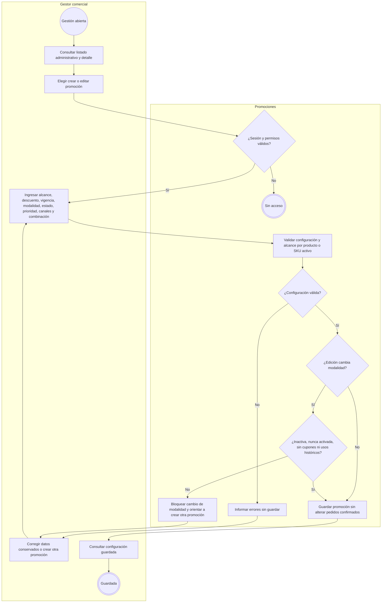
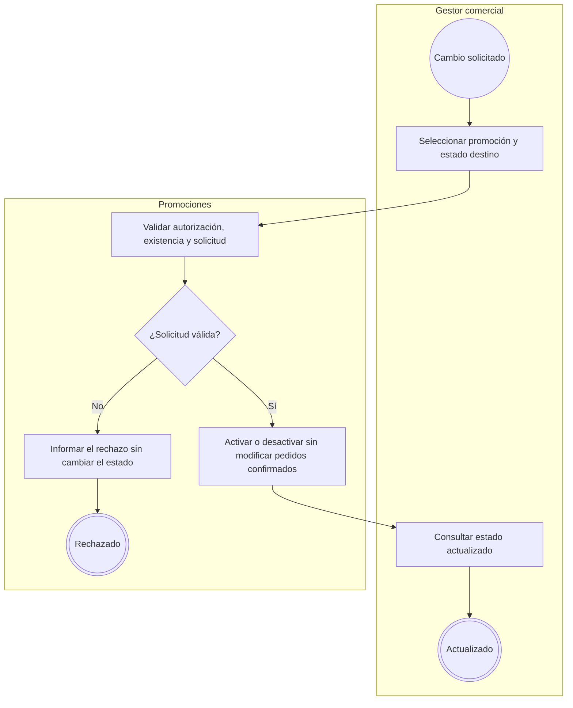
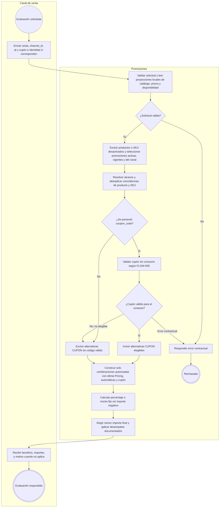
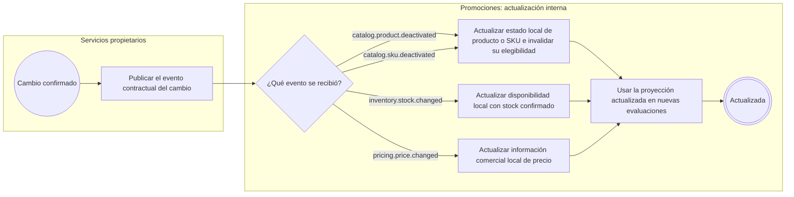

# FLOW-006 — Gestión de ofertas y promociones

## 1. Identificación

- **Código:** FLOW-006
- **Funcionalidad:** Gestión de ofertas y promociones
- **Relacionado con:** [SPEC-006](../specs/SPEC-006-gestion-ofertas-promociones.md) / [HU-006](../hu/HU-006-gestion-ofertas-promociones.md) / [WF-006](../wireframes/flows/WF-006-gestion-ofertas-promociones.md)
- **Responsable:** Axel Andree Cueva Alcalá
- **Última actualización:** 2026-10-02
- **Contratos consultados:** [OpenAPI 0.5.0](../api/openapi.yaml), [AsyncAPI 0.4.0](../asyncapi/asyncapi.yaml), [catálogo de eventos](../api/catalogo-eventos.md) y [Arquitectura, §§17, 35 y extensión HTTP 0.5.0](../Arquitectura.md).

## 2. Objetivo del flujo

Representar la creación, edición y activación/desactivación de promociones y la evaluación comercial de combinaciones autorizadas para un canal. Promociones utiliza precios, estado comercial y disponibilidad de sus proyecciones locales, actualizadas mediante eventos publicados por los servicios propietarios. La evaluación conserva el precio maestro de Pricing y no ejecuta operaciones de pedido, inventario ni consumo de cupón.

## 3. Actores participantes

- **Gestor comercial:** consulta y administra configuración promocional con autorización de Seguridad.
- **Canal de venta:** Marketplace, Chatbot o Retail; consulta promociones y solicita evaluación en el proceso real de compra.
- **Promociones (`promotions-svc`):** administra promociones, evalúa beneficios y mantiene proyecciones locales reconstruibles.
- **Servicios publicadores:** Catálogo, Inventario y Pricing publican cambios confirmados que actualizan esas proyecciones. No son invocados síncronamente en los pasos de evaluación aquí representados.

La validación de cupones es una capacidad del mismo bounded context; su ciclo de consumo y restitución se representa en [FLOW-005](FLOW-005-gestion-cupones-descuento.md).

## 4. Diagramas de flujo

Los subflujos extensos usan orientación `TB` para conservar la legibilidad al renderizar en GitHub; el flujo independiente de proyecciones usa `LR`. Se mantienen actores separados, decisiones etiquetadas e inicio y fin explícitos conforme a [FLOW_TEMPLATE](FLOW_TEMPLATE.md).

### 4.1 Creación y edición

Validaciones (HU-006 CA-02–03, CA-11–13):

- Nombre y alcance con al menos un producto o SKU vendible activo; deduplicar coincidencias de producto completo y SKU.
- Porcentaje: `0 < valor <= 100`; monto fijo: `valor > 0`.
- Vigencia: `inicio < fin`, correspondientes a `validFrom` y `validUntil` contractuales.
- Modalidad obligatoria `AUTOMATICA` o `CUPON`; estado inicial, prioridad positiva, canales habilitados y política de combinación.
- La política controla combinación con oferta propia de Pricing, promoción automática y cupón. Por defecto no se combinan; todas las combinaciones deshabilitadas representan exclusividad.
- Cambiar modalidad solo se permite si se cumplen simultáneamente las cuatro condiciones de la decisión del diagrama. Si ya fue activada/utilizada o tiene cupones asociados, se crea una nueva promoción.

La administración usa `GET /api/v1/promociones/administracion`, `GET /api/v1/promociones/{promocionId}`, `POST /api/v1/promociones` y `PATCH /api/v1/promociones/{promocionId}`. La consulta administrativa está publicada como `provisional-internal`; no se confunde con `GET /api/v1/promociones`, que sirve la consulta del canal. Los cuerpos y errores se consultan en OpenAPI.

### 4.2 Activación y desactivación

Se usan `POST /api/v1/promociones/{promocionId}/activar` y `POST /api/v1/promociones/{promocionId}/desactivar`. Una promoción desactivada no participa en nuevas evaluaciones; los pedidos históricos mantienen su snapshot (HU-006 CA-04, CA-09).

### 4.3 Evaluación comercial del canal

- Ruta: `POST /api/v1/promociones/evaluar`. El esquema contractual define `lines`, `channel_id`, `at`, `coupon_code` y `customer_ref`; no se copian ni redefinen payloads en este FLOW.
- Solo participa una promoción activa, vigente en `at`, coincidente con el alcance y habilitada para el canal. La modalidad `CUPON` exige código válido; nunca se aplica automáticamente sin él.
- Pricing es propietario del regular/oferta propia. La evaluación lee la información comercial proyectada y aplica combinaciones permitidas sin sobrescribir el precio maestro ni descontar dos veces sobre beneficios incompatibles.
- El monto fijo se aplica una vez al subtotal elegible y se limita a ese subtotal; cualquier descuento deja un importe final no negativo.
- Se elige la alternativa válida de menor importe final. En empate exacto: **alternativa que no requiere consumir cupón → menor prioridad numérica → identificador estable** (HU-006). El desempate no realiza consumo; compara las alternativas.
- Se informa el motivo contractual si no aplica beneficio. La evaluación no consume cupón, no crea pedido y no reserva stock. Una alternativa ganadora con cupón debe pasar luego por el consumo atómico de FLOW-005; validar no reserva cupo.
- La información de disponibilidad usada por Promociones se actualiza desde la proyección; el FLOW no añade una regla de stock para descuentos distinta de las fuentes vigentes.

No existe pantalla administrativa «Evaluar compra» ni simulador de checkout (HU-006 CA-16; WF-006).

### 4.4 Actualización de proyecciones locales

Los cuatro eventos están publicados en AsyncAPI/catálogo 0.4.0 con `promotions-svc` como consumidor. Las proyecciones son locales y reconstruibles a partir de los eventos publicados, sin ownership sobre las tablas de los servicios externos.

Un producto o SKU desactivado deja de ser candidato válido en nuevas evaluaciones. Stock confirmado actualiza la disponibilidad; precio confirmado actualiza el insumo comercial. Estos eventos no crean/editan promociones ni representan una operación del gestor. Tampoco son comandos/resultados de consumo de cupón. No se representa una dependencia síncrona permanente con Catálogo, Inventario o Pricing para esos datos proyectados.

## 5. Coherencia y trazabilidad

| Reglas | Fuente | Representación |
|---|---|---|
| Autorización, gestión y configuración completa | HU-006 CA-01–04; WF-006; OpenAPI | §§4.1–4.2 |
| Alcance, fechas, modalidad y restricción de cambio | HU-006 CA-03, CA-11–13 | §4.1 |
| Elegibilidad, cálculo, combinación, resultado y desempate | SPEC-006 §§2–5; HU-006 CA-05–08, CA-10, CA-14–15 y reglas consolidadas | §4.3 |
| Preservar pedidos confirmados y evitar simulador administrativo | HU-006 CA-09, CA-16–17; WF-006 | §§4.1–4.3 |
| Proyecciones y consumidores publicados | Arquitectura §35; AsyncAPI y catálogo 0.4.0 | §4.4 |

La referencia HTTP de este FLOW es OpenAPI 0.5.0 vigente en `master`; la mensajería continúa en AsyncAPI 0.4.0. La actualización del FLOW no altera contratos ni crea eventos administrativos nuevos.

### Precisiones administrativas de la corrección 2026-10-02

El alcance administrativo distingue `productIds` y `skus`; la selección por producto completo conserva esa identidad. `canalesHabilitados` requiere al menos un canal explícito y no interpreta vacío/omisión al crear como todos. El servicio publica `puedeCambiarModalidad` de solo lectura y revalida HU-006 CA-13 al modificar; la UI no infiere esa elegibilidad del estado inactivo. La activación previa permanece aunque luego se desactive. Estas precisiones no introducen rutas ni eventos nuevos.
