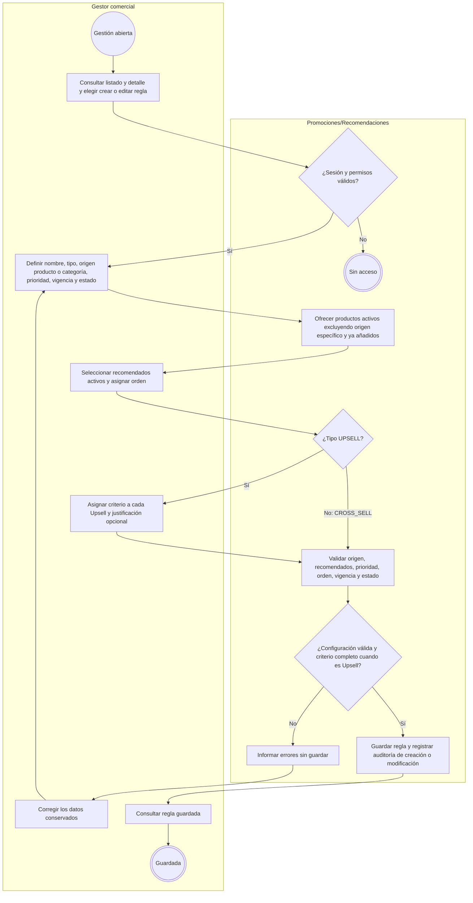
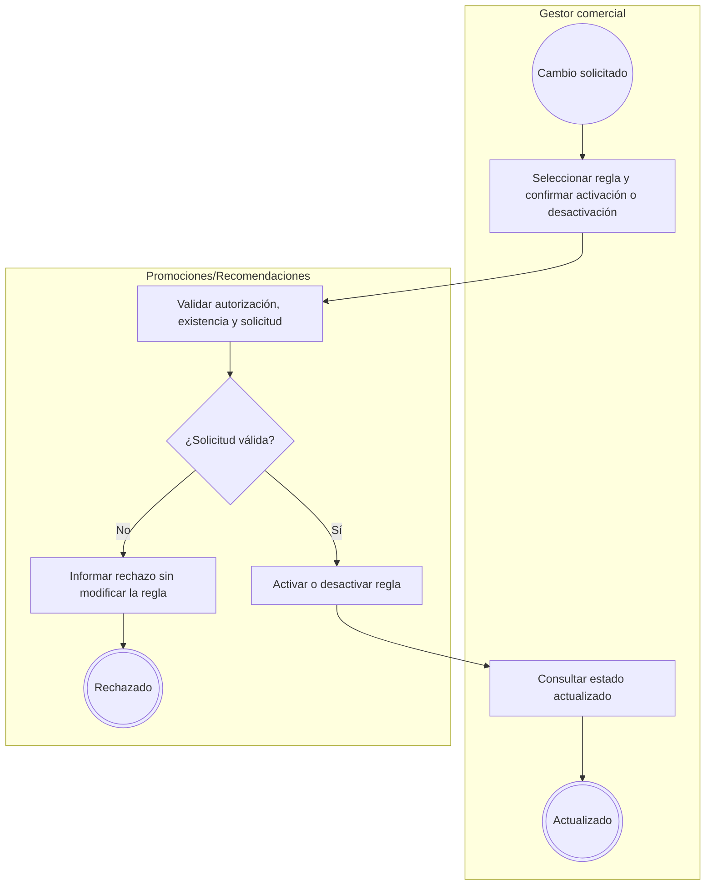
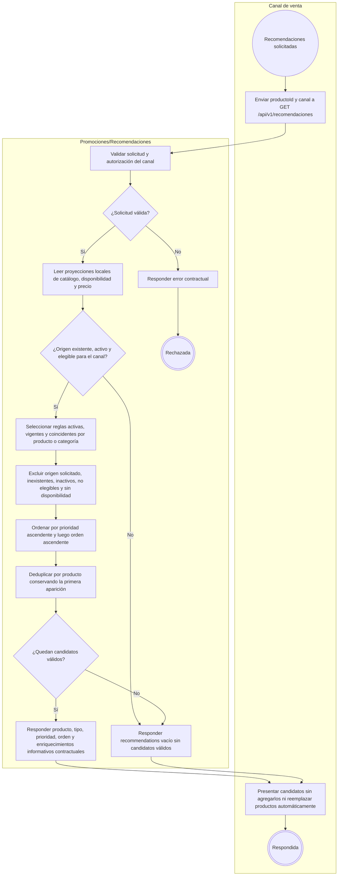
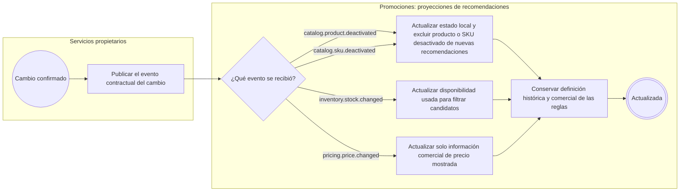

# FLOW-007 — Reglas de venta cruzada y upselling

## 1. Identificación

- **Código:** FLOW-007
- **Funcionalidad:** Reglas de venta cruzada y upselling
- **Relacionado con:** [SPEC-007](../specs/SPEC-007-reglas-venta-cruzada-upselling.md) / [HU-007](../hu/HU-007-reglas-venta-cruzada-upselling.md) / [WF-007](../wireframes/flows/WF-007-reglas-venta-cruzada-upselling.md)
- **Responsable:** Axel Andree Cueva Alcalá
- **Última actualización:** 2026-10-02
- **Contratos consultados:** [OpenAPI 0.5.0](../api/openapi.yaml), [AsyncAPI 0.4.0](../asyncapi/asyncapi.yaml), [catálogo de eventos](../api/catalogo-eventos.md) y [Arquitectura, §35 y extensión HTTP 0.5.0](../Arquitectura.md).

## 2. Objetivo del flujo

Representar la creación, edición y cambio de estado de reglas manuales de Cross-sell (complementos) y Upsell (alternativas superiores clasificadas por el gestor), y la consulta de candidatos válidos por producto/categoría para un canal. Las recomendaciones se filtran y ordenan usando proyecciones locales actualizadas por eventos; no agregan ni reemplazan productos automáticamente.

## 3. Actores participantes

- **Gestor comercial:** configura y consulta reglas con autorización de Seguridad.
- **Canal de venta:** Marketplace, Chatbot o Retail; consulta candidatos para un producto y canal.
- **Promociones/Recomendaciones (`promotions-svc`):** administra reglas, selecciona candidatos y mantiene las proyecciones requeridas.
- **Servicios publicadores:** Catálogo, Inventario y Pricing publican cambios confirmados para actualizar estado, disponibilidad e información de precio.

Chatbot interpreta necesidades y lenguaje natural; Productos y Ofertas entrega candidatos comerciales y no realiza esa interpretación.

## 4. Diagramas de flujo

Los subflujos extensos usan orientación `TB` para conservar la legibilidad al renderizar en GitHub; el flujo independiente de proyecciones usa `LR`. Se mantienen actores separados, decisiones etiquetadas e inicio y fin explícitos conforme a [FLOW_TEMPLATE](FLOW_TEMPLATE.md).

### 4.1 Creación y edición de reglas

Validaciones (SPEC-007 §5; HU-007 CA-01–08):

- Origen por producto o categoría existente/activo; al menos un producto recomendado existente y activo.
- No recomendar el propio origen específico ni duplicar productos en la misma regla. En consulta también se excluye el producto solicitado cuando coincide con una regla de categoría.
- Prioridad y orden son enteros positivos; prioridad `1` es la mayor. Inicio < fin; la regla está funcionalmente activa o inactiva. SPEC-007 denomina esos estados `ACTIVA | INACTIVA`; el campo administrativo `estado` usa los valores contractuales `ACTIVO | INACTIVO` de `EstadoEntidad` en OpenAPI. El FLOW conserva la misma regla funcional sin cambiar el enum HTTP.
- Cada recomendado Upsell exige un criterio controlado: `MAYOR_RENDIMIENTO`, `MEJOR_MATERIAL`, `MAYOR_CAPACIDAD` o `FUNCIONALIDAD_ADICIONAL`. La justificación comercial es opcional; no sustituye el criterio.
- Cross-sell configura complementos; Upsell configura alternativas clasificadas manualmente. El sistema no verifica automáticamente superioridad ni deduce que un precio mayor sea suficiente.

La administración usa `GET /api/v1/recomendaciones/reglas`, `POST /api/v1/recomendaciones/reglas`, `GET /api/v1/recomendaciones/reglas/{reglaId}` y `PATCH /api/v1/recomendaciones/reglas/{reglaId}`. El selector y detalle siguen WF-007; los criterios se muestran con etiquetas humanas y los payloads permanecen en OpenAPI.

### 4.2 Activación y desactivación

Se utilizan `POST /api/v1/recomendaciones/reglas/{reglaId}/activar` y `POST /api/v1/recomendaciones/reglas/{reglaId}/desactivar`. Solo reglas activas, vigentes y coincidentes participan en la consulta (HU-007 CA-09).

### 4.3 Consulta de recomendaciones del canal

La ruta es `GET /api/v1/recomendaciones?productoId=...&canal=...`. La respuesta contractual es un objeto `RecomendacionesResponse`: sin candidatos, `recommendations: []`; el FLOW no sustituye ese objeto por un array raíz.

La salida se mantiene a nivel `product_id`, sin seleccionar SKU/variante ni exponer saldos internos. Cada producto aparece una sola vez y conserva la prioridad y orden de su primera aparición. El precio es informativo, regular u oferta pública vigente de Pricing; no congela precio de pedido, no demuestra superioridad y no reserva stock. La resolución definitiva del SKU elegido corresponde al proceso posterior del canal.

**Límites provisionales vigentes:** la consulta está publicada como `provisional` en OpenAPI 0.5.0. `D-REC-01` (disponibilidad por producto con múltiples SKU) y `D-REC-02` (significado de `current_price` con variantes/overrides) siguen abiertas en SPEC/HU-007. El FLOW representa el filtrado comercial requerido, sin definir una agregación nueva de stock ni seleccionar un precio de variante. Los enriquecimientos `availability` y `current_price` conservan ese carácter provisional. Si se expone disponibilidad, utiliza los estados contractuales `DISPONIBLE`, `STOCK_BAJO`, `AGOTADO`.

No existe simulador administrativo ni pantalla «Probar recomendaciones». La consulta de canal no incorpora IA/ML, personalización histórica o reemplazo automático de productos.

### 4.4 Actualización automática de elegibilidad e información comercial

Los cuatro consumidores de `promotions-svc` existen en AsyncAPI/catálogo 0.4.0. Las proyecciones son locales y reconstruibles mediante los eventos publicados; Catálogo, Inventario y Pricing conservan ownership. No hay llamadas síncronas permanentes ni joins sobre sus schemas para estos datos proyectados.

Un producto/SKU desactivado deja de ser elegible sin editar manualmente reglas históricas. Stock confirmado modifica la elegibilidad de salida, sin alterar la definición comercial. Precio confirmado actualiza la información mostrada, sin redefinir Cross-sell/Upsell ni su criterio. El efecto product-level de cambios por SKU sigue sujeto a `D-REC-01/02`; la recepción del evento no resuelve esas decisiones abiertas.

Estos eventos actualizan proyecciones internas: no equivalen a crear/editar una regla por el gestor ni a comandos/resultados de consumo de cupón.

## 5. Coherencia y trazabilidad

| Reglas | Fuente | Representación |
|---|---|---|
| Administración, origen, recomendados y auditoría | SPEC-007 §§3, 5–6; HU-007 CA-01–04; WF-007 | §§4.1–4.2 |
| Upsell manual, criterio y justificación | SPEC-007 §5 req. 2; HU-007 CA-05–07; WF-007 | §4.1 |
| Prioridad, orden, vigencia, filtrado y deduplicación | SPEC-007 §§4–5; HU-007 CA-08–10 | §4.3 |
| Consulta contractual, precio informativo y ausencia de simulador | SPEC-007 §5 req. 9–10 y §7; HU-007 CA-11–12; OpenAPI | §4.3 |
| Proyecciones y preservación de reglas | Arquitectura §35 y extensión HTTP 0.5.0; AsyncAPI y catálogo 0.4.0 | §4.4 |
| Multicanal, nivel producto y decisiones abiertas | Extensiones 0.5.0 de SPEC/HU-007; OpenAPI | §§4.3–4.4 |
