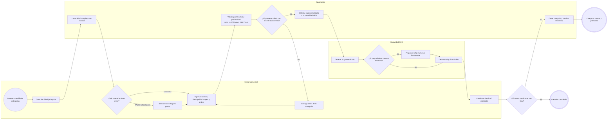
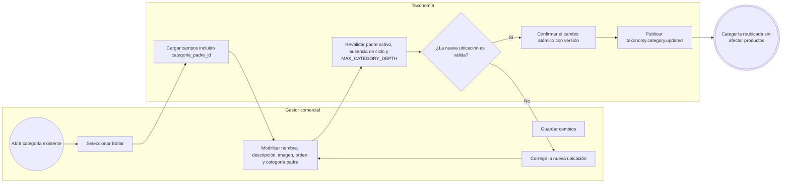
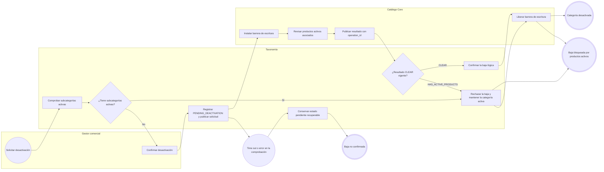
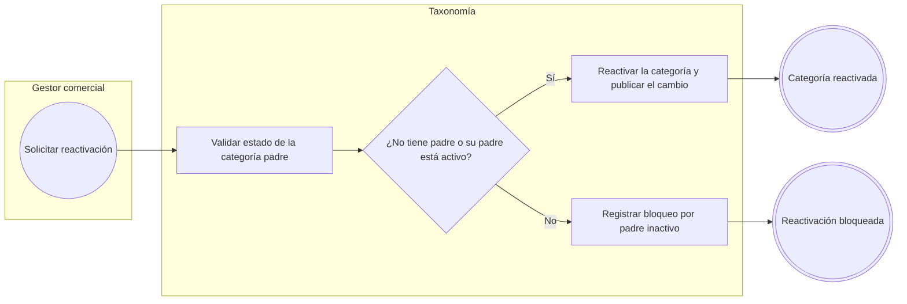

# FLOW-008 — Gestión de categorías y subcategorías

## 1. Identificación

- **Código:** FLOW-008
- **Funcionalidad:** Gestión de categorías y subcategorías
- **Relacionado con:** [HU-008](../hu/HU-008-gestion-categorias.md) / [SPEC-008](../specs/SPEC-008-gestion-categorias.md) / [WF-008](../wireframes/flows/WF-008-gestion-categorias.md)
- **Responsable:** Leonardo Lopez
- **Última actualización:** 2026-09-24

---

## 2. Objetivo del flujo

Representar la consulta del árbol jerárquico, la creación de categorías raíz y subcategorías, la edición con reasignación de padre y la baja lógica asíncrona con confirmación de Catálogo. El flujo incluye la validación de profundidad máxima (`MAX_CATEGORY_DEPTH = 2`), la ausencia de ciclos, la confirmación del slug generado por la capacidad SEO antes de publicar y la reactivación condicionada al estado del padre.

---

## 3. Actores participantes

- **Gestor comercial:** consulta el árbol, crea, edita, desactiva y reactiva categorías.
- **Capacidad SEO:** normaliza y genera el slug final ante colisiones.
- **Taxonomía:** administra la jerarquía y ejecuta la baja lógica bajo verificación asíncrona.
- **Catálogo Core:** verifica productos activos, instala la barrera de escritura y responde por `operation_id`.

---

## 4. Diagramas de flujo

### 4.1 Consulta y creación de categoría raíz o subcategoría

> El slug final autogenerado siempre se muestra antes de confirmar; no se permite un cambio silencioso de URL. La edición posterior del slug y los metadatos pertenece a la capacidad SEO (WF-012).

### 4.2 Edición y reasignación de categoría padre

> Reubicar una categoría no recalcula el esquema de atributos de los productos: el esquema se resuelve por `tipo_producto_id`, no por la jerarquía de navegación.

### 4.3 Baja lógica con verificación asíncrona de Catálogo

> La desactivación es una operación asíncrona de dos fases: Taxonomía solo confirma la baja lógica ante un resultado `CLEAR` vigente. Un timeout, error o verificación pendiente nunca autoriza la baja.

### 4.4 Reactivación de una categoría

