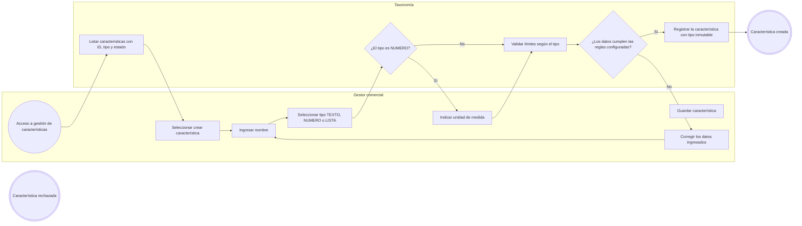
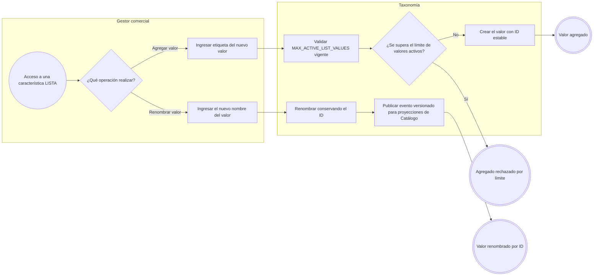
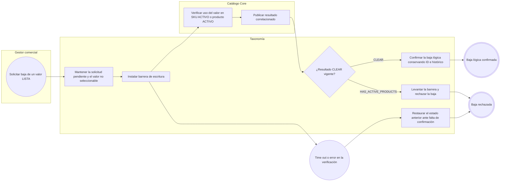

# FLOW-009 — Gestión de características y sus valores

## 1. Identificación

- **Código:** FLOW-009
- **Funcionalidad:** Gestión de características y sus valores
- **Relacionado con:** [HU-009](../hu/HU-009-gestion-caracteristicas.md) / [SPEC-009](../specs/SPEC-009-gestion-caracteristicas.md) / [WF-009](../wireframes/flows/WF-009-gestion-caracteristicas.md)
- **Responsable:** Leonardo Lopez
- **Última actualización:** 2026-09-24

---

## 2. Objetivo del flujo

Representar la creación de características tipadas (`TEXTO`, `NUMERO`, `LISTA`), la gestión de valores de tipo `LISTA` (agregar, renombrar por ID y baja lógica) y la protección del tipo inmutable. El flujo contempla los límites operativos configurables (`MAX_TEXT_ATTRIBUTE_LENGTH = 100` y `MAX_ACTIVE_LIST_VALUES = 50`) y la verificación asíncrona con Catálogo antes de dar de baja un valor en uso.

---

## 3. Actores participantes

- **Gestor comercial:** crea, consulta, renombra y da de baja características y sus valores.
- **Taxonomía:** administra características tipadas, valores y sus límites operativos.
- **Catálogo Core:** verifica el uso de un valor en SKUs o productos activos y confirma la baja segura.

---

## 4. Diagramas de flujo

### 4.1 Creación de una característica tipada

> El tipo de una característica es inmutable desde su creación; intentar cambiarlo se rechaza y se indica crear otra característica con un ID distinto.

### 4.2 Gestión de valores de tipo LISTA

> Renombrar un valor conserva su ID y la actualización de las vistas de Catálogo es por eventos; no se reescriben SKUs existentes ni snapshots de pedidos.

### 4.3 Baja lógica de un valor LISTA

> Durante la comprobación no se asigna el valor a nuevos productos o variantes. Un fallo o la ausencia de respuesta no autoriza la baja; los productos inactivos y pedidos históricos conservan sus referencias y snapshots.