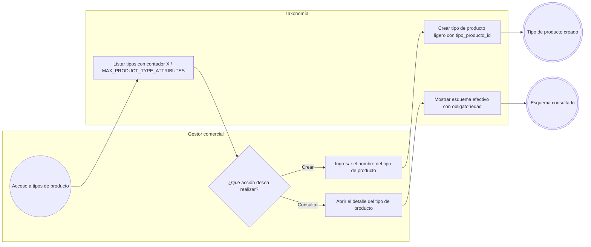
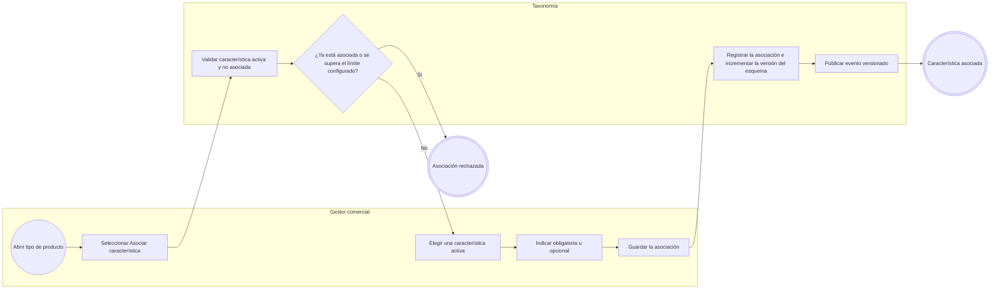
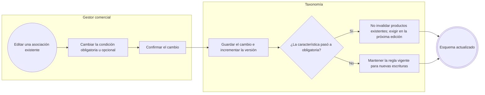
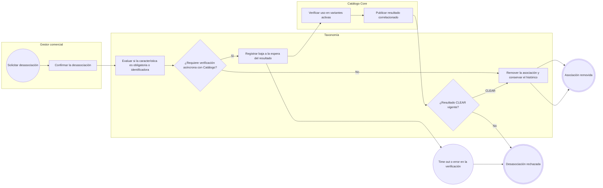
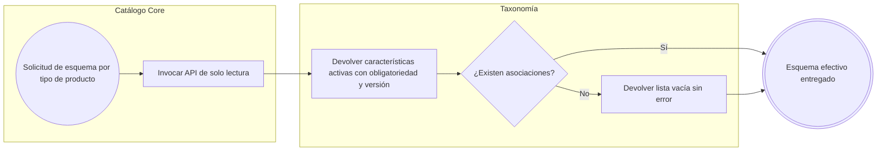

# FLOW-010 — Asociación entre tipos de producto y características

## 1. Identificación

- **Código:** FLOW-010
- **Funcionalidad:** Asociación entre tipos de producto y características
- **Relacionado con:** [HU-010](../hu/HU-010-asociacion-tipo-producto-caracteristica.md) / [SPEC-010](../specs/SPEC-010-asociacion-tipo-producto-caracteristica.md) / [WF-010](../wireframes/flows/WF-010-asociacion-tipo-producto-caracteristica.md)
- **Responsable:** Leonardo Lopez
- **Última actualización:** 2026-09-24

---

## 2. Objetivo del flujo

Representar la gestión de tipos de producto ligeros y su asociación con características activas, indicando obligatoriedad y respetando el límite configurable (`MAX_PRODUCT_TYPE_ATTRIBUTES = 20`). El flujo contempla la consulta del esquema efectivo, el cambio de obligatoriedad sin invalidar productos preexistentes y la desasociación segura con verificación asíncrona cuando la característica es obligatoria o identificadora.

---

## 3. Actores participantes

- **Gestor comercial:** crea tipos de producto y administra las asociaciones.
- **Taxonomía:** mantiene el esquema de asociación, su versión y el límite configurable.
- **Catálogo Core:** consulta el esquema efectivo y verifica el uso de una característica antes de desasociarla.

---

## 4. Diagramas de flujo

### 4.1 Creación y consulta de tipos de producto

### 4.2 Asociar una característica a un tipo de producto

> Las categorías de navegación no definen ni heredan características: el esquema de atributos se resuelve únicamente a través de `tipo_producto_id`.

### 4.3 Cambio de obligatoriedad

### 4.4 Desasociación segura de una característica

### 4.5 Consulta del esquema por tipo de producto

