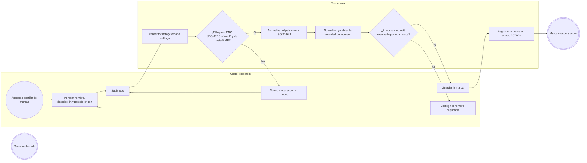
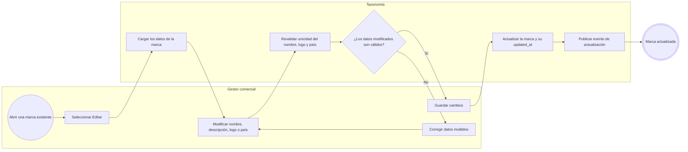
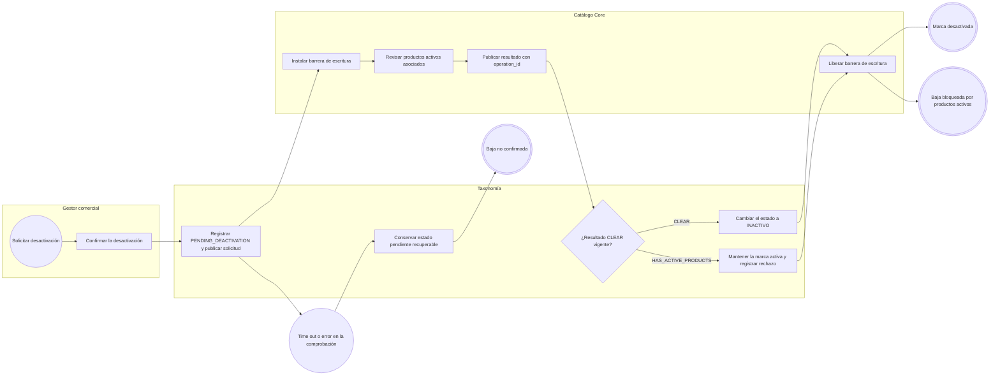
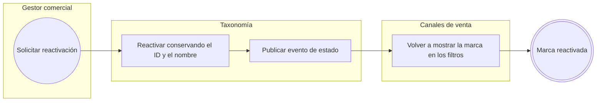
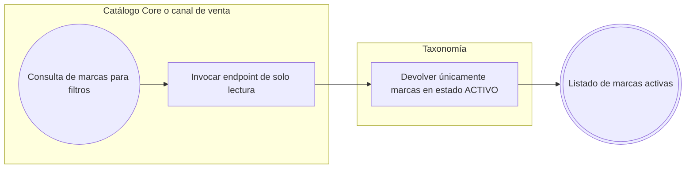

# FLOW-011 — Gestión de marcas

## 1. Identificación

- **Código:** FLOW-011
- **Funcionalidad:** Gestión de marcas
- **Relacionado con:** [HU-011](../hu/HU-011-gestion-marcas.md) / [SPEC-011](../specs/SPEC-011-gestion-marcas.md) / [WF-011](../wireframes/flows/WF-011-gestion-marcas.md)
- **Responsable:** Leonardo Lopez
- **Última actualización:** 2026-09-24

---

## 2. Objetivo del flujo

Representar la creación, consulta, actualización, desactivación y reactivación de las marcas del catálogo. El flujo contempla la unicidad global del nombre normalizado (activas e inactivas), las validaciones del logo (PNG, JPG/JPEG o WebP de hasta 5 MB) y del país ISO 3166-1, la baja lógica asíncrona bajo barrera de Catálogo y la exposición de marcas activas a los canales.

---

## 3. Actores participantes

- **Gestor comercial:** crea, consulta, edita, desactiva y reactiva marcas.
- **Taxonomía:** administra las marcas, sus validaciones y la baja lógica.
- **Catálogo Core:** verifica productos activos asociados y responde por `operation_id`.
- **Canales de venta:** consumen el listado de marcas activas para sus filtros.

---

## 4. Diagramas de flujo

### 4.1 Creación de una marca

> El nombre normalizado de la marca es único entre todas las marcas, incluidas las inactivas. La unicidad se protege además con una restricción de base de datos.

### 4.2 Consulta y actualización de una marca

### 4.3 Baja lógica con verificación asíncrona de Catálogo

> La desactivación solo concluye tras una confirmación asíncrona `CLEAR` bajo barrera concurrente; un rechazo o la falta de respuesta no desactiva la marca. El nombre y el ID se conservan para una posible reactivación.

### 4.4 Reactivación de una marca

### 4.5 Consulta de marcas activas

