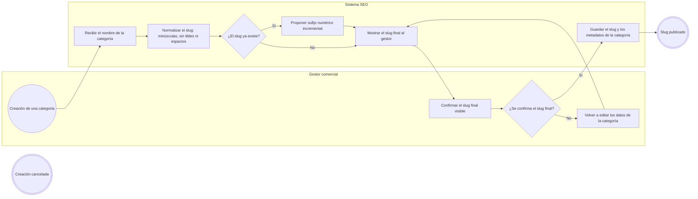
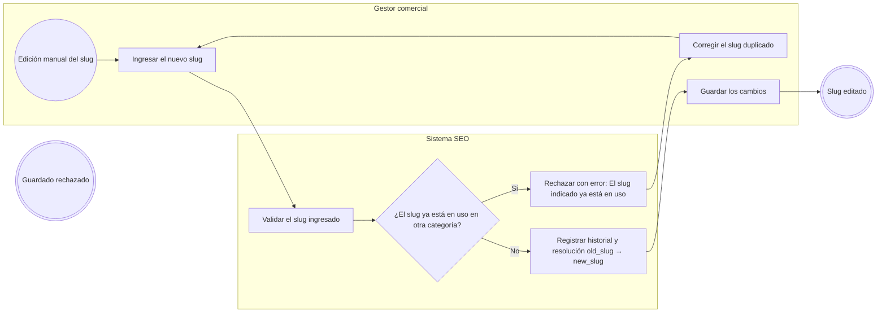
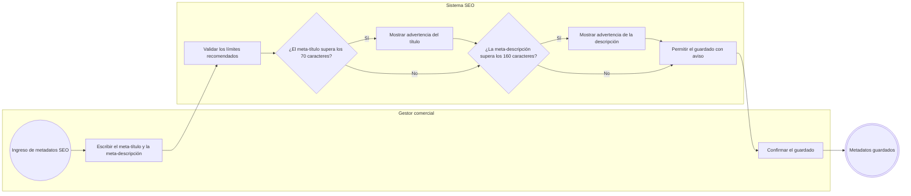
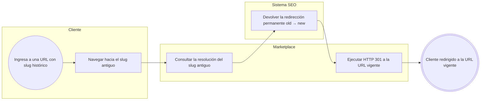
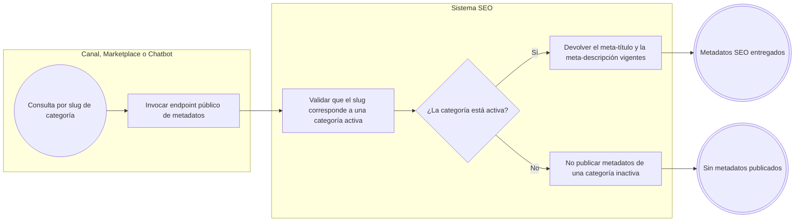

# FLOW-012 — Gestión de SEO y metadatos

## 1. Identificación

- **Código:** FLOW-012
- **Funcionalidad:** Gestión de SEO y metadatos
- **Relacionado con:** [HU-012](../hu/HU-012-seo-metadatos.md) / [SPEC-012](../specs/SPEC-012-seo-metadatos.md) / [WF-012](../wireframes/flows/WF-012-seo-metadatos.md)
- **Responsable:** Leonardo Lopez
- **Última actualización:** 2026-09-24

---

## 2. Objetivo del flujo

Representar la generación automática y la edición manual del slug de cada categoría, la política de duplicados (sufijo incremental en la creación y error explícito en la edición manual), las advertencias de longitud de metadatos y el historial de redirecciones. El flujo contempla la resolución `old_slug -> new_slug` que el Marketplace ejecuta como HTTP 301 y el endpoint público de metadatos por slug activo.

---

## 3. Actores participantes

- **Gestor comercial:** configura el slug y los metadatos SEO de cada categoría.
- **Sistema SEO:** normaliza slugs, resuelve colisiones, registra el historial y expone el endpoint público.
- **Marketplace:** canal que sirve la URL pública y ejecuta el HTTP 301.
- **Consumidor externo:** canal que consulta los metadatos SEO por slug activo.

---

## 4. Diagramas de flujo

### 4.1 Generación automática de slug al crear una categoría

> En la creación, la colisión de slugs se resuelve con un sufijo incremental, pero el slug final siempre se muestra al gestor antes de publicar; no hay cambios silenciosos de URL.

### 4.2 Edición manual de un slug

> En la edición manual no se autogeneran sufijos: el duplicado se rechaza con un error visible exigiendo un valor distinto.

### 4.3 Advertencias de longitud de metadatos

> Los límites de 70 y 160 caracteres son recomendados: se advierte al superarlos, pero no se bloquea el guardado.

### 4.4 Resolución de redirección de slug histórico

> Productos y Ofertas solo expone la resolución `old_slug -> new_slug`; la ejecución del HTTP 301 corresponde al capa web del Marketplace.

### 4.5 Endpoint público de metadatos por slug activo

