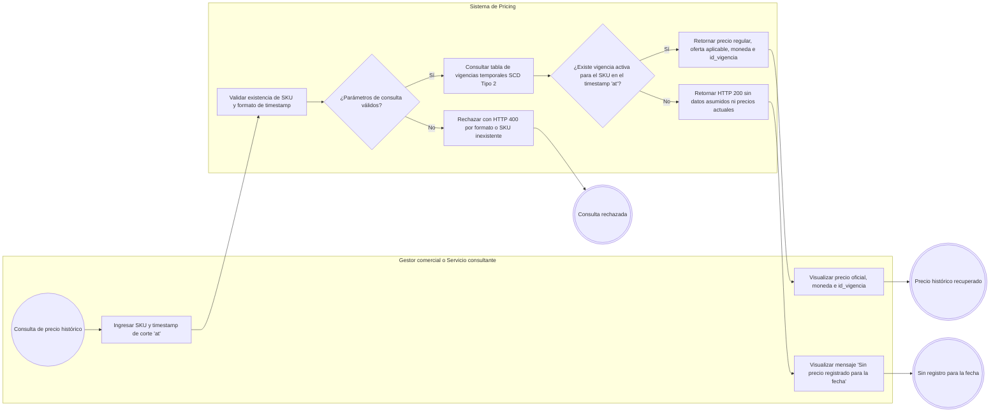
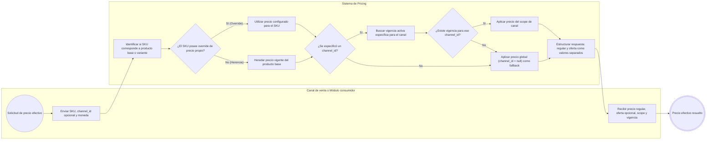

# FLOW-013 — Gestión de precios individuales y masivos

## 1. Identificación

- **Código:** FLOW-013
- **Funcionalidad:** Gestión de precios individuales y masivos
- **Relacionado con:** [HU-013](../hu/HU-013-gestion-precios-individuales-masivos.md) / [SPEC-013](../specs/SPEC-013-gestion-precios-individuales-masivos.md) / [WF-013](../wireframes/flows/WF-013-gestion-precios-individuales-masivos.md)
- **Responsable:** Leonardo Vera Rodríguez
- **Última actualización:** 2026-09-23

---

## 2. Objetivo del flujo

Representar el ciclo operativo integral para la actualización individual y programación futura de precios, la resolución de precios efectivos por SKU y canal, la consulta de precios históricos oficiales (*As-Of*) y la carga masiva mediante archivos tabulares (CSV/XLSX). El flujo detalla las validaciones comerciales de rango, el motivo de cambio obligatorio, el control de concurrencia optimista mediante versionado (`price_version`), la prevención de solapamientos de vigencia temporal, los guardrails ante variaciones porcentuales extraordinarias, la semántica de oferta opcional y la garantía de procesamiento atómico (*All-or-Nothing*) o tolerante (*allow_partial=true*) restringida al dominio de Pricing.

---

## 3. Actores participantes

- **Gestor comercial:** consulta precios, ingresa actualizaciones inmediatas o programadas, evalúa advertencias de variación y confirma cargas masivas.
- **Sistema de Pricing (API / Servicio):** valida reglas comerciales, controla concurrencia optimista, resuelve herencias de catálogo y scopes de canal, preanaliza archivos y ejecuta transacciones de precios.
- **Worker de Pricing:** procesa lotes masivos asíncronos, activa automáticamente precios programados al cumplirse su vigencia y genera reportes de errores.
- **Catálogo de productos:** informa la existencia, tipo y estado activo de los SKUs y solicita la inicialización idempotente del primer precio base.
- **Bus de eventos (Outbox / Auditoría):** propaga de manera asíncrona el evento `pricing.price.changed` únicamente tras confirmarse el commit transaccional en Pricing.

---

## 4. Diagramas de flujo

### 4.1 Actualización individual y programación futura de precios

```mermaid
flowchart LR

    subgraph GESTOR["Gestor comercial"]
        direction TB
        INICIO((Acceso a gestión de precio))
        G1["Consultar detalle de precio del SKU"]
        G2["Ingresar nuevo precio regular, oferta y motivo obligatorio"]
        G3["Especificar price_version y definir vigencia"]
        D1{"¿Qué tipo de vigencia define?"}
        G4["Confirmar actualización inmediata"]
        G5["Indicar valid_from futuro, canal y moneda"]
        D2{"¿Acepta advertencia por variación extraordinaria?"}
        G6["Corregir importe o cancelar"]
    end

    subgraph PRICING["Sistema de Pricing"]
        direction TB
        S1["Resolver precio vigente, origen y price_version"]
        S2["Validar motivo presente, regular > 0 y oferta < regular"]
        D3{"¿Valores comerciales válidos?"}
        S3["Calcular variación porcentual frente al precio vigente"]
        D4{"¿Variación supera umbral extraordinario?"}
        S4["Mostrar advertencia reforzada"]
        S5["Verificar coincidencia de price_version"]
        D5{"¿Versión vigente coincide?"}
        S6["Persistir nuevo precio en product_prices y SCD Tipo 2"]
        S7["Incrementar price_version y commit local"]
        S8["Rechazar por conflicto y devolver versión vigente"]
        S9["Verificar que valid_from sea futuro y sin solapamiento"]
        D6{"¿Intervalo temporal disponible y válido?"}
        S10["Guardar vigencia en estado SCHEDULED"]
        S11["Rechazar programación e indicar conflicto"]
    end

    subgraph WORKER["Worker de Pricing"]
        direction TB
        W1["Verificar reloj del sistema frente a valid_from"]
        D7{"¿Timestamp actual alcanzó vigencia programada?"}
        W2["Actualizar tabla operativa product_prices a ACTIVE"]
    end

    subgraph BUS["Bus de eventos"]
        direction TB
        E1(("Emitir pricing.price.changed post-commit"))
    end

    FIN_INMEDIATO(((Precio individual actualizado)))
    FIN_PROGRAMADO(((Precio futuro programado)))
    FIN_ACTIVADO(((Precio programado activado automáticamente)))
    FIN_RECHAZO(((Operación rechazada por validación o conflicto)))

    INICIO --> G1
    G1 --> S1
    S1 --> G2
    G2 --> G3
    G3 --> S2
    S2 --> D3
    D3 -->|"No"| FIN_RECHAZO
    D3 -->|"Sí"| S3
    S3 --> D4
    D4 -->|"Sí"| S4
    S4 --> D2
    D2 -->|"No"| G6
    G6 --> FIN_RECHAZO
    D2 -->|"Sí"| D1
    D4 -->|"No"| D1

    D1 -->|"Inmediata"| G4
    G4 --> S5
    S5 --> D5
    D5 -->|"No"| S8
    S8 --> FIN_RECHAZO
    D5 -->|"Sí"| S6
    S6 --> S7
    S7 --> E1
    E1 --> FIN_INMEDIATO

    D1 -->|"Programada"| G5
    G5 --> S9
    S9 --> D6
    D6 -->|"No"| S11
    S11 --> FIN_RECHAZO
    D6 -->|"Sí"| S10
    S10 --> FIN_PROGRAMADO

    FIN_PROGRAMADO -.-> W1
    W1 --> D7
    D7 -->|"No"| W1
    D7 -->|"Sí"| W2
    W2 --> E1
    E1 --> FIN_ACTIVADO
```

---

### 4.2 Consulta de precio histórico oficial (As-Of Query)

---

### 4.3 Prevalidación, confirmación y procesamiento de carga masiva de precios

```mermaid
flowchart LR

    subgraph GESTOR["Gestor comercial"]
        direction TB
        INICIO((Archivo masivo preparado))
        G1["Seleccionar archivo CSV o XLSX"]
        G2["Elegir modo: Atómico (defecto) o Tolerante (allow_partial=true)"]
        G3["Revisar prevalidación y reglas críticas"]
        D1{"¿Confirma la importación masiva?"}
        G4["Corregir archivo o sustituir fuente"]
        G5["Consultar estado del lote con batch_id"]
        G6["Descargar reporte CSV de filas rechazadas"]
    end

    subgraph PRICING_API["Pricing · API y Prevalidación"]
        direction TB
        A1["Validar formato, MIME y tamaño <= 10 MB"]
        A2["Verificar cabeceras: sku, precio_regular, motivo_cambio obligatorias"]
        D2{"¿Estructura de archivo válida y segura?"}
        A3["Rechazar archivo con HTTP 422 antes de encolar"]
        A4["Mostrar resumen de prevalidación"]
        A5["Crear lote idempotente con batch_id"]
        E1((Lote en cola con HTTP 202 Accepted))
    end

    subgraph PRICING_WORKER["Pricing · Worker asíncrono"]
        direction TB
        W1["Leer filas y validar existencia de SKU en Catálogo"]
        W2["Validar precio_regular > 0 y motivo obligatorio"]
        W3["Evaluar accion_precio_oferta: CONSERVAR, ESTABLECER o ELIMINAR"]
        W4["Validar concurrencia optimista (price_version) y solapamiento"]
        D3{"¿La fila cumple todas las reglas?"}
        W5["Marcar fila como VÁLIDA"]
        W6["Registrar fila RECHAZADA con causa específica"]
        D4{"¿Cuál es la política del lote?"}
        D5{"¿Existen filas rechazadas en el lote?"}
        W7["Commit atómico de todas las filas en Pricing"]
        W8["Rollback total: abortar aplicación y marcar lote FAILED"]
        W9["Persistir solo filas válidas en transacción local"]
        W10["Generar reporte descargable CSV con errores por fila"]
        W11["Marcar lote COMPLETED o PARTIAL_SUCCESS"]
    end

    subgraph BUS["Bus de eventos"]
        direction TB
        E2(("Emitir pricing.price.changed por SKU aplicado"))
    end

    FIN_CANCELADO(((Carga cancelada por usuario)))
    FIN_ESTRUCTURA_RECHAZADA(((Archivo rechazado en prevalidación)))
    FIN_LOTE_OK(((Lote completado sin errores)))
    FIN_LOTE_PARCIAL(((Lote completado con éxito parcial)))
    FIN_LOTE_RECHAZADO(((Lote descartado totalmente en Pricing)))

    INICIO --> G1
    G1 --> G2
    G2 --> A1
    A1 --> A2
    A2 --> D2
    D2 -->|"No"| A3
    A3 --> G4
    G4 --> FIN_ESTRUCTURA_RECHAZADA
    D2 -->|"Sí"| A4
    A4 --> G3
    G3 --> D1
    D1 -->|"No"| FIN_CANCELADO
    D1 -->|"Sí"| A5
    A5 --> E1

    E1 --> W1
    W1 --> W2
    W2 --> W3
    W3 --> W4
    W4 --> D3
    D3 -->|"Sí"| W5
    D3 -->|"No"| W6

    W5 --> D4
    W6 --> D4

    D4 -->|"Atómico (allow_partial=false)"| D5
    D5 -->|"Al menos un error"| W8
    W8 --> W10
    W10 --> G5
    G5 --> G6
    G6 --> FIN_LOTE_RECHAZADO

    D5 -->|"Cero errores"| W7
    W7 --> E2
    E2 --> W11
    W11 --> G5
    G5 --> FIN_LOTE_OK

    D4 -->|"Tolerante (allow_partial=true)"| W9
    W9 --> E2
    E2 --> W10
    W10 --> W11
    W11 --> G5
    G5 --> G6
    G6 --> FIN_LOTE_PARCIAL
```

---

### 4.4 Resolución de precio efectivo por SKU y canal

> **Delimitación comercial:** Pricing entrega el precio regular y la oferta propia por separado. Promociones y Cupones aplican sus propias políticas de combinación o exclusión sin sobrescribir los precios de Pricing. Combos consume el precio regular y el precio público vigente para verificar que el paquete resulte comercialmente conveniente frente a la compra individual.
