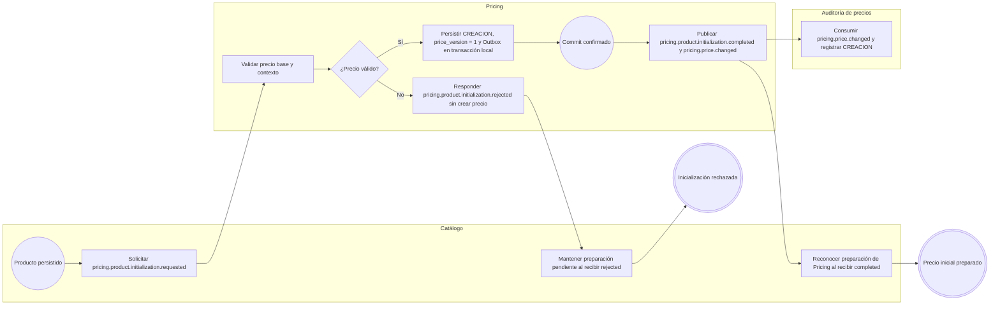
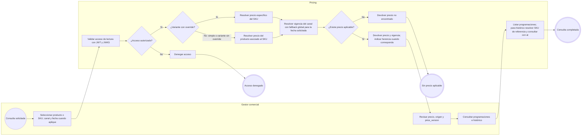
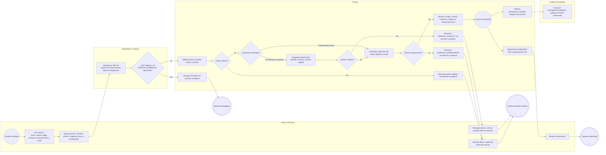
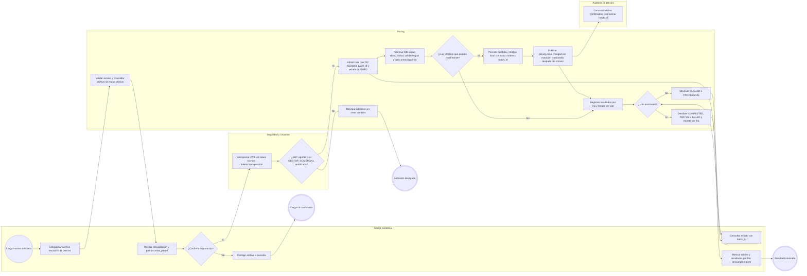

# FLOW-013 — Gestión de precios individuales y masivos

## 1. Identificación

- **Código:** FLOW-013
- **Funcionalidad:** Gestión de precios individuales y masivos
- **Relacionado con:** [HU-013](../hu/HU-013-gestion-precios-individuales-masivos.md) / [SPEC-013](../specs/SPEC-013-gestion-precios-individuales-masivos.md) / [WF-013](../wireframes/flows/WF-013-gestion-precios-individuales-masivos.md)
- **Responsable:** Leonardo Vera Rodríguez
- **Última actualización:** 2026-10-01

## 2. Objetivo del flujo

Representar la inicialización, consulta e histórico, actualización individual, programación futura y carga masiva exclusiva de Pricing, con autorización, conflictos de versión y vigencias. Pricing es propietario de precios, moneda, canales, vigencias, versiones e histórico.

## 3. Actores participantes

- **Gestor comercial:** consulta y administra precios y cargas.
- **Catálogo:** solicita la preparación del primer precio del producto.
- **Pricing:** valida, persiste y publica hechos confirmados.
- **Seguridad y Usuarios:** proporciona JWKS y valida mutaciones sensibles mediante introspección.
- **Auditoría de precios:** consume `pricing.price.changed` y registra la bitácora según [FLOW-014](FLOW-014-historial-auditoria-precios.md).

> **Autorización:** La administración humana usa JWT de usuario con rol global `GESTOR_COMERCIAL`. Las lecturas se validan localmente mediante JWKS. Antes de ejecutar/admitir actualizaciones, programaciones e importaciones, se consulta `POST /api/v1/auth/introspeccion` con token técnico y scope `tokens:introspeccion`, según el [kit de integración 0.4.0](../api/kit-integracion.md). `PRICING_READ`, `PRICING_WRITE` y `PRICING_BULK`, si se conservan, son capacidades internas; no permisos externos pendientes de Seguridad.

## 4. Diagramas de flujo

### 4.1 Inicialización del precio del producto

```mermaid
flowchart LR
    subgraph CATALOGO["Catálogo"]
        direction TB
        I(("Producto persistido"))
        C1["Solicitar pricing.product.initialization.requested"]
        C2["Reconocer preparación de Pricing al recibir completed"]
        C3["Mantener preparación pendiente al recibir rejected"]
    end
    subgraph PRICING["Pricing"]
        direction TB
        P1["Validar precio base y contexto"]
        D1{"¿Precio válido?"}
        P2["Persistir CREACION, price_version = 1 y Outbox en transacción local"]
        E1(("Commit confirmado"))
        P3["Publicar pricing.product.initialization.completed y pricing.price.changed"]
        P4["Responder pricing.product.initialization.rejected sin crear precio"]
    end
    subgraph AUDIT["Auditoría de precios"]
        direction TB
        A1["Consumir pricing.price.changed y registrar CREACION"]
    end
    F1((("Precio inicial preparado")))
    F2((("Inicialización rechazada")))
    I --> C1 --> P1 --> D1
    D1 -->|"Sí"| P2 --> E1 --> P3
    P3 --> C2 --> F1
    P3 --> A1
    D1 -->|"No"| P4 --> C3 --> F2
```

La solicitud inicial contiene `product_id`, `sku_base`, precio regular, moneda, `channel_id=null` y `motivo_cambio=ALTA_PRODUCTO`. `CREACION` conserva `precio_anterior=null` y `variacion_porcentual=null`. Crear una variante no repite la inicialización de Pricing: hereda el precio del producto mientras no exista override posterior. `completed` confirma únicamente la preparación de Pricing; la activación también depende de las demás condiciones de Catálogo.

### 4.2 Consulta del precio vigente, programaciones e histórico

```mermaid
flowchart LR
    subgraph GESTOR["Gestor comercial"]
        direction TB
        I(("Consulta solicitada"))
        G1["Seleccionar producto o SKU; canal y fecha cuando aplique"]
        G2["Revisar precio, origen y price_version"]
        G3["Consultar programaciones e histórico"]
    end
    subgraph PRICING["Pricing"]
        direction TB
        P1["Validar acceso de lectura con JWT y JWKS"]
        D1{"¿Acceso autorizado?"}
        D2{"¿Variante con override?"}
        P2["Resolver precio específico del SKU"]
        P3["Resolver precio del producto asociado al SKU"]
        P4["Resolver vigencia del canal con fallback global para la fecha solicitada"]
        D3{"¿Existe precio aplicable?"}
        P5["Devolver precio y vigencia; indicar herencia cuando corresponda"]
        P6["Devolver precio no encontrado"]
        P7["Listar programaciones; para histórico resolver SKU de referencia y consultar con at"]
        P8["Denegar acceso"]
    end
    F1((("Consulta completada")))
    F2((("Sin precio aplicable")))
    F3((("Acceso denegado")))
    I --> G1 --> P1 --> D1
    D1 -->|"No"| P8 --> F3
    D1 -->|"Sí"| D2
    D2 -->|"Sí"| P2 --> P4
    D2 -->|"No: simple o variante sin override"| P3 --> P4
    P4 --> D3
    D3 -->|"No"| P6 --> F2
    D3 -->|"Sí"| P5 --> G2 --> G3 --> P7 --> F1
```

La consulta histórica utiliza `GET /api/v1/precios/skus/{sku}` con el parámetro `at`. Cuando el Gestor Comercial selecciona un producto, el sistema resuelve el SKU de referencia correspondiente para efectuar la consulta histórica: para un producto simple utiliza su `sku_base`; para un producto con variantes utiliza el SKU vendible seleccionado o resuelto por la interfaz. `GET /api/v1/precios/productos/{productoId}` devuelve el precio base administrativo del producto y, en OpenAPI 0.4.0, no publica `at`. Las rutas `/programaciones` listan las vigencias programadas de SKU o producto. La bitácora de quién cambió el precio se consulta mediante FLOW-014, separada del histórico de vigencias de Pricing.

### 4.3 Actualización individual y programación futura

```mermaid
flowchart LR
    subgraph GESTOR["Gestor comercial"]
        direction TB
        I(("Cambio solicitado"))
        G1["Leer precio y price_version; elegir producto o override SKU y canal"]
        G2["Ingresar precio, moneda, motivo y vigencia futura si corresponde"]
        G3["Revisar confirmación"]
        G4["Recargar precio y revisar cambio antes de reenviar"]
        G5["Corregir datos o vigencias antes de reenviar"]
    end
    subgraph SEGURIDAD["Seguridad y Usuarios"]
        direction TB
        S1["Introspectar JWT de usuario con token técnico tokens:introspeccion"]
        D1{"¿JWT vigente y rol GESTOR_COMERCIAL autorizado?"}
    end
    subgraph PRICING["Pricing"]
        direction TB
        P1["Validar precios, moneda, motivo y fechas"]
        D2{"¿Datos válidos?"}
        D3{"¿Operación solicitada?"}
        P2["Comparar priceVersion recibido con price_version vigente"]
        D4{"¿Versión vigente?"}
        P3["Comprobar vigencias del mismo objetivo y canal"]
        D5{"¿Existe superposición?"}
        P4["Persistir cambio, versión, contexto y Outbox en transacción local"]
        E1(("Commit confirmado"))
        P5["Publicar pricing.price.changed después del commit"]
        P6["Responder actualización 200 o programación 201"]
        P7["Rechazar VERSION_CONFLICT sin persistir ni publicar"]
        P8["Rechazar VIGENCIA_SUPERPUESTA sin persistir ni publicar"]
        P9["Rechazar datos inválidos sin persistir ni publicar"]
        P10["Denegar mutación sin persistir ni publicar"]
    end
    subgraph AUDIT["Auditoría de precios"]
        direction TB
        A1["Consumir pricing.price.changed y registrar el hecho confirmado"]
    end
    F1((("Cambio confirmado")))
    F2((("Cambio requiere revisión")))
    F3((("Mutación denegada")))
    I --> G1 --> G2 --> S1 --> D1
    D1 -->|"No"| P10 --> F3
    D1 -->|"Sí"| P1 --> D2
    D2 -->|"No"| P9 --> G5 --> F2
    D2 -->|"Sí"| D3
    D3 -->|"Actualización individual"| P2 --> D4
    D4 -->|"No"| P7 --> G4 --> F2
    D4 -->|"Sí"| P3
    D3 -->|"Programación futura"| P3
    P3 --> D5
    D5 -->|"Sí"| P8 --> G5
    D5 -->|"No"| P4 --> E1
    E1 --> P5 --> A1
    E1 --> P6 --> G3 --> F1
```

- El precio regular debe ser mayor que cero; si existe oferta, `0 < precio_oferta < precio_regular`. La actualización permite conservar, establecer o eliminar oferta mediante `accionPrecioOferta`; el retiro se audita como `RETIRO_OFERTA`.
- El PATCH de producto/SKU envía `priceVersion` de la lectura previa. Las programaciones POST usan `validFrom` futuro y `validUntil` opcional, con inicio anterior al fin cuando exista; no se agrega un campo de versión obligatorio que el contrato de programación no define.
- Un cambio del producto afecta a variantes que heredan; un cambio específico del SKU constituye un override administrado por Pricing. El canal específico tiene fallback global.
- La programación conserva su vigencia futura; no reemplaza anticipadamente el precio efectivo actual.
- Pricing guarda el cambio y Outbox en la transacción local, publica después del commit y no escribe directamente la bitácora de `price-audit-svc` ni espera su consumo para responder.

### 4.4 Carga masiva exclusiva de Pricing y resultado

```mermaid
flowchart LR
    subgraph GESTOR["Gestor comercial"]
        direction TB
        I(("Carga masiva solicitada"))
        G1["Seleccionar archivo exclusivo de precios"]
        G2["Revisar prevalidación y política allow_partial"]
        D1{"¿Confirma importación?"}
        G3["Corregir archivo o cancelar"]
        G4["Consultar estado con batch_id"]
        G5["Revisar totales y resultados por fila; descargar reporte"]
    end
    subgraph SEGURIDAD["Seguridad y Usuarios"]
        direction TB
        S1["Introspectar JWT con token técnico tokens:introspeccion"]
        D2{"¿JWT vigente y rol GESTOR_COMERCIAL autorizado?"}
    end
    subgraph PRICING["Pricing"]
        direction TB
        P1["Validar acceso y prevalidar archivo sin mutar precios"]
        P2["Admitir lote con 202 Accepted, batch_id y estado QUEUED"]
        P3["Procesar lote según allow_partial; validar reglas y concurrencia por fila"]
        D4{"¿Hay cambios que pueden confirmarse?"}
        P4["Persistir cambios y Outbox local con actor, motivo y batch_id"]
        P5["Publicar pricing.price.changed por mutación confirmada después del commit"]
        P6["Registrar resultados por fila y estado del lote"]
        D3{"¿Lote terminado?"}
        P7["Devolver QUEUED o PROCESSING"]
        P8["Devolver COMPLETED, PARTIAL o FAILED y reporte por fila"]
        P9["Denegar admisión sin crear cambios"]
    end
    subgraph AUDIT["Auditoría de precios"]
        direction TB
        A1["Consumir hechos confirmados y conservar batch_id"]
    end
    F1((("Resultado revisado")))
    F2((("Carga no confirmada")))
    F3((("Admisión denegada")))
    I --> G1 --> P1 --> G2 --> D1
    D1 -->|"No"| G3 --> F2
    D1 -->|"Sí"| S1 --> D2
    D2 -->|"No"| P9 --> F3
    D2 -->|"Sí"| P2
    P2 --> P3 --> D4
    D4 -->|"Sí"| P4 --> P5 --> P6
    D4 -->|"No"| P6
    P5 --> A1
    P2 --> G4 --> D3
    P6 --> D3
    D3 -->|"No"| P7 --> G4
    D3 -->|"Sí"| P8 --> G5 --> F1
```

La prevalidación usa `POST /api/v1/precios/importaciones/prevalidar`; la admisión usa `POST /api/v1/precios/importaciones`. Se consulta `/api/v1/precios/importaciones/{batchId}` y se descarga su `/reporte`. `202 Accepted` confirma admisión, no éxito final. Las filas rechazadas no producen cambios ni eventos; su resultado conserva código y detalle, incluidos conflictos de versión o vigencia cuando correspondan.

Esta carga pertenece exclusivamente a Pricing y no promete atomicidad con Catálogo ni Inventario; la carga general coordinada corresponde a SPEC-001. Las rutas provisionales internas se describen conforme a OpenAPI 0.4.0 sin promoverlas a contratos estables.
