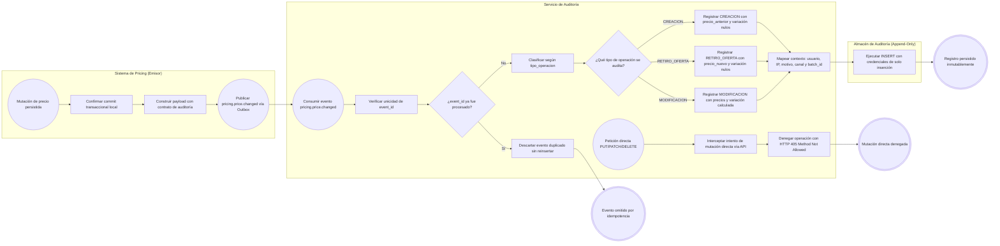
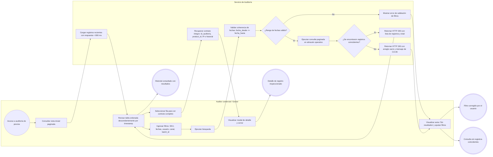
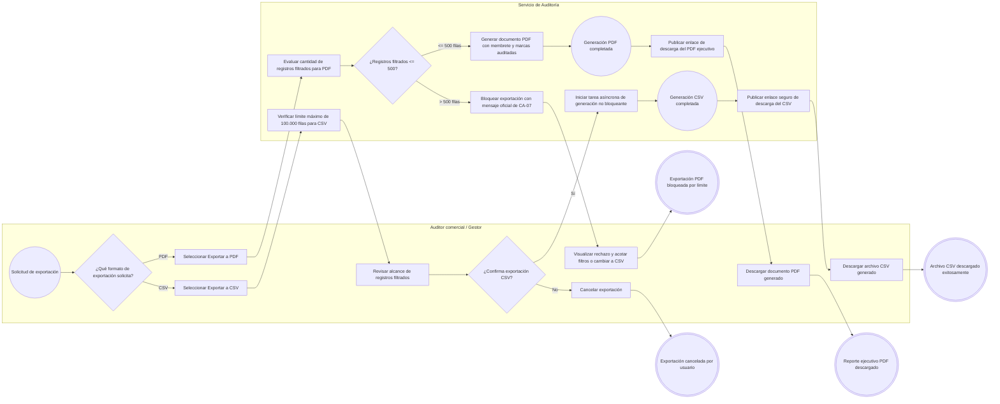
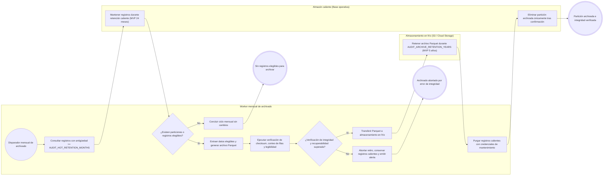

# FLOW-014 — Historial de auditoría de precios

## 1. Identificación

- **Código:** FLOW-014
- **Funcionalidad:** Historial de auditoría de precios
- **Relacionado con:** [HU-014](../hu/HU-014-historial-auditoria-precios.md) / [SPEC-014](../specs/SPEC-014-historial-auditoria-precios.md) / [WF-014](../wireframes/flows/WF-014-historial-auditoria-precios.md)
- **Responsable:** Leonardo Vera Rodríguez
- **Última actualización:** 2026-09-23

---

## 2. Objetivo del flujo

Representar la captura asíncrona desacoplada de eventos de cambio de precios mediante una bitácora inmutable (*Append-Only*), la consulta cronológica descendente con filtrado multicriterio, la visualización del contrato completo de auditoría, la exportación controlada en formatos CSV (hasta 100.000 filas) y PDF (hasta 500 filas con rechazo explícito por exceso) y el ciclo de vida de archivado verificado a almacenamiento en frío en formato Parquet según los parámetros configurables de retención.

---

## 3. Actores participantes

- **Auditor comercial / Gestor:** consulta registros cronológicos, aplica filtros combinables, visualiza detalles completos y solicita exportaciones en CSV o PDF.
- **Sistema de Pricing (Emisor):** procesa mutaciones operativas de precios y publica el evento desacoplado `pricing.price.changed` solo tras confirmar transacciones exitosas (las operaciones fallidas no emiten eventos).
- **Servicio de auditoría de precios:** consume eventos asíncronos del broker, deduplica por `event_id`, valida inmutabilidad estricta y expone endpoints de consulta y exportación.
- **Almacén de auditoría (Base operativa / Almacenamiento caliente):** base relacional configurada exclusivamente con permisos `INSERT` y `SELECT`, que retiene las mutaciones durante el período caliente configurado (`AUDIT_HOT_RETENTION_MONTHS`, MVP 24 meses).
- **Worker de archivado y Almacenamiento en frío:** tarea batch mensual que genera particiones Parquet, valida checksum y recuperabilidad antes del retiro, y conserva los datos en frío durante `AUDIT_ARCHIVE_RETENTION_YEARS` (MVP 5 años).

---

## 4. Diagramas de flujo

### 4.1 Ingesta asíncrona de eventos y garantía de inmutabilidad (Append-Only)

> **Aclaración operativa:** Si una actualización de precio es rechazada en Pricing por reglas de negocio, falta de motivo obligatorio o conflicto de concurrencia, Pricing no persiste la entidad ni emite el evento, por lo que la bitácora no genera ningún registro de operaciones no ocurridas.

---

### 4.2 Consulta cronológica, filtrado multicriterio y detalle de registro

---

### 4.3 Exportación estructurada de auditoría (CSV y PDF con control de límites)

---

### 4.4 Ciclo de vida y archivado verificado a almacenamiento en frío

> **Garantía de integridad de auditoría:** La conexión estándar del Servicio de Auditoría solo dispone de permisos `INSERT` y `SELECT`. El proceso de retiro a almacenamiento en frío utiliza credenciales de mantenimiento aisladas y nunca elimina registros de la base caliente si la verificación del archivo Parquet falla o no se comprueba su recuperabilidad.
