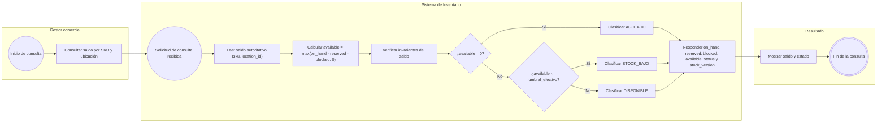
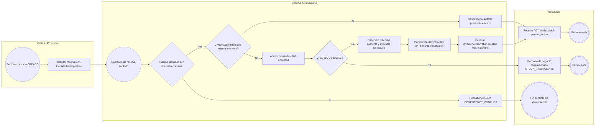
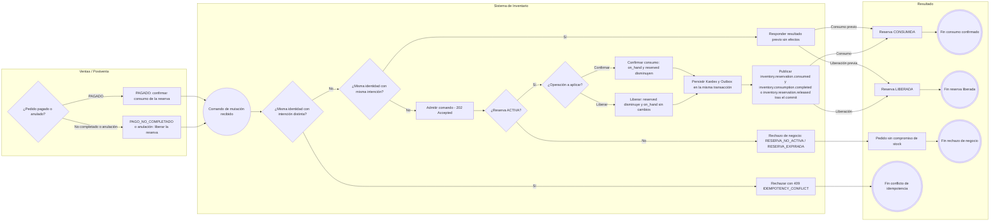
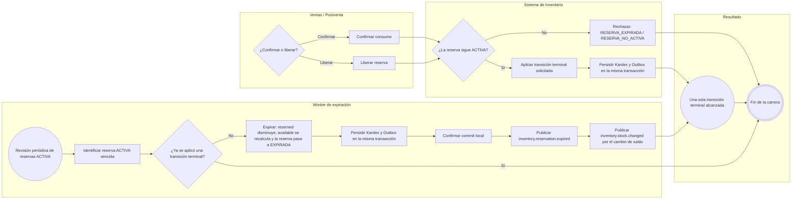
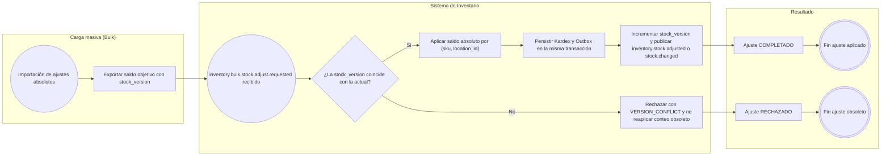
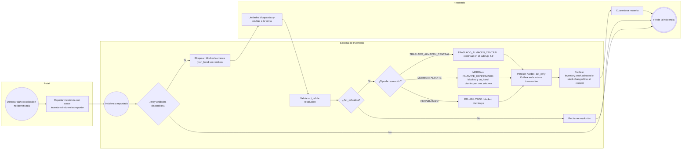
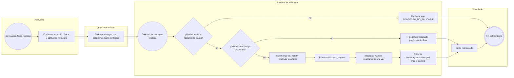
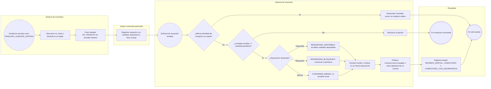
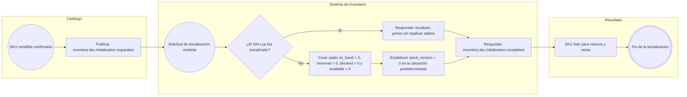

# FLOW-015 — Control de stock y disponibilidad

---

## 1. Identificación

- **Código:** FLOW-015
- **Funcionalidad:** Control de stock y disponibilidad
- **Relacionado con:** HU-015 / SPEC-015 / WF-015
- **Responsable:** Miguel Ángel Taco Zavala
- **Última actualización:** 2026-10-01

---

## 2. Objetivo del flujo

Representar el ciclo de inventario por `(sku, location_id)`: consulta determinística del saldo y su estado, reserva, consumo definitivo, liberación, expiración por TTL, ajustes masivos, incidencias físicas, reintegros, conciliación de ventas offline y recepción de traslados, garantizando en cada mutación las invariantes del saldo, el registro de Kardex, la idempotencia y la publicación de eventos posterior al commit.

---

## 3. Actores participantes

- Gestor comercial con capacidades de inventario
- Ventas/Postventa
- Retail
- Carga masiva (Bulk)
- Worker de expiración
- Sistema de Inventario
- Catálogo

---

## 4. Diagramas de flujo

### 4.1 Consulta y determinación de estado



> Marketplace y Chatbot solo consultan Inventario; la consulta nunca modifica saldos (HU-015 CA-06).

### 4.2 Reserva de unidades



### 4.3 Consumo definitivo y liberación



### 4.4 Expiración por TTL y carrera hacia una única terminal



### 4.5 Ajuste absoluto masivo (Bulk)



### 4.6 Incidencia física (bloqueo y resolución)



### 4.7 Reintegro por devolución física aceptada



### 4.8 Venta Retail offline y conciliación

```mermaid
flowchart LR
    subgraph RET["Retail"]
        direction TB
        INICIO((Venta realizada sin conectividad))
        A1["Registrar venta offline en Ventas/Postventa"]
    end

    subgraph VENT["Ventas / Postventa"]
        direction TB
        A2["Solicitar conciliación offline con scope inventario:conciliar-offline"]
    end

    subgraph INV["Sistema de Inventario"]
        direction TB
        E1(("Conciliación recibida"))
        D1{"¿Misma identidad ya procesada?"}
        A3["Aplicar min(requested, available) sin tocar reserved ni blocked"]
        D2{"¿Puede aplicarse todo lo solicitado?"}
        A4["Calcular unresolved_quantity conservando saldos no negativos"]
        A5["Persistir Kardex y Outbox en la misma transacción"]
        A6["Publicar inventory.stock.adjusted o stock.changed tras el commit"]
    end

    subgraph RES["Resultado"]
        direction TB
        B1["Conciliación COMPLETED"]
        B2["Conciliación REQUIRES_REVIEW con unresolved_quantity > 0"]
        FIN_OK(((Fin conciliado)))
        FIN_REV(((Fin con revisión)))
    end

    INICIO --> A1
    A1 --> A2
    A2 --> E1
    E1 --> D1
    D1 -->|"Sí"| B1
    D1 -->|"No"| A3
    A3 --> D2
    D2 -->|"Sí"| A5
    D2 -->|"No"| A4
    A4 --> A5
    A5 --> A6
    A6 -->|"COMPLETED"| B1
    A6 -->|"REQUIRES_REVIEW"| B2
    B1 --> FIN_OK
    B2 --> FIN_REV
```



### 4.9 Traslado a almacén central y recepción



### 4.10 Inicialización de SKU



---

## 5. Notas generales

- **Actor humano:** el usuario del backoffice en este flujo es el `GESTOR_COMERCIAL`; la granularidad de inventario se expresa mediante capacidades locales asociadas a su `sub`, no mediante un rol global independiente.
- **Idempotencia:** repetir un comando con la misma identidad y la misma intención responde el resultado previo sin efectos secundarios; reutilizar la identidad con otra intención produce `409 IDEMPOTENCY_CONFLICT` (HU-015 CA-14, SPEC-015 §30).
- **202 Accepted:** es la admisión del comando, no el resultado final. Los resultados asíncronos se correlacionan mediante `order_id`, `operation_id`, `correlation_id` y `reservation_id` (SPEC-015 §30).
- **Kardex y Outbox:** toda mutación autoritativa registra Kardex con saldos anterior/posterior, operación, SKU y ubicación, y persiste el Outbox en la misma transacción local; la publicación de eventos ocurre después del commit (HU-015 CA-16/CA-19, SPEC-015 §27).
- **Invariantes:** en toda operación se cumple `on_hand >= 0`, `reserved >= 0`, `blocked >= 0`, `reserved + blocked <= on_hand` y `available >= 0` (HU-015 CA-04).
- **Concurrencia:** confirmar, liberar y expirar la misma reserva produce una única transición terminal; dos operaciones concurrentes nunca comprometen las mismas unidades disponibles (HU-015 CA-13/CA-15).
- **Consulta:** el subflujo 4.1 es de solo lectura y nunca modifica saldos ni registra eventos (HU-015 CA-06).

### Contratos de referencia

| Endpoint (OpenAPI 0.5.0) | Subflujo |
|---|---|
| `POST /api/v1/inventario/reservas` | 4.2 — Reserva de unidades |
| `POST /api/v1/inventario/reservas/{reservaId}/confirmar` | 4.3 — Consumo definitivo |
| `POST /api/v1/inventario/reservas/{reservaId}/liberar` | 4.3 — Liberación |
| `POST /api/v1/inventario/incidencias` | 4.6 — Reportar incidencia |
| `POST /api/v1/inventario/incidencias/{incidenciaId}/resolver` | 4.6 — Resolución (incluye traslado) |
| `POST /api/v1/inventario/reintegros` | 4.7 — Reintegro |
| `POST /api/v1/inventario/conciliaciones-offline` | 4.8 — Venta offline |
| `GET /api/v1/inventario/traslados` | 4.9 — Consulta de traslados |
| `POST /api/v1/inventario/traslados/{trasladoId}/recepciones` | 4.9 — Recepción de traslado |

Los eventos publicados corresponden al catálogo de AsyncAPI (`inventory.reservation.*`, `inventory.consumption.*`, `inventory.stock.changed`, `inventory.stock.adjusted`, `inventory.bulk.stock.adjust.*`, `inventory.sku.initialization.*`).

---

<!-- HOMOLOGACION-HTTP-0.5.0:START -->
## Flujos de lectura 0.5.0

### Consulta detallada

```text
Gestor/Ventas autorizado
→ leer (sku, location_id)
→ calcular available
→ validar invariantes
→ determinar status
→ devolver saldo detallado
```

### Consulta comercial

```text
Marketplace/Chatbot/Retail
→ solicitar skus + canal
→ inventory-svc obtiene disponibilidad autoritativa
→ resolver disponibilidad comercial según política
→ proyectar sku + status
→ responder
```

La política multiubicación sigue marcada `D-INV-01`; no se inventa suma, máximo ni ubicación por defecto.

Ambas consultas son de solo lectura.
<!-- HOMOLOGACION-HTTP-0.5.0:END -->
