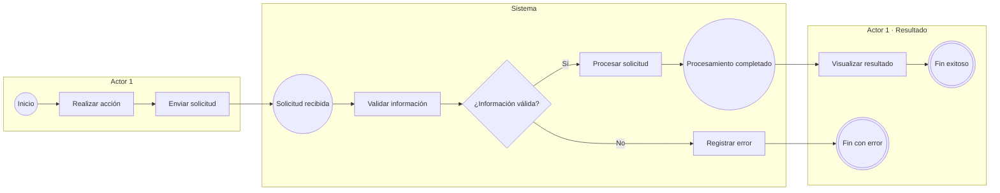

# _TEMPLATE — Diagrama de Flujo Funcional

> Plantilla estándar para documentar los flujos de las funcionalidades del proyecto mediante Mermaid.

---

## 1. Identificación

- **Código:** FLOW-XXX
- **Funcionalidad:** [Nombre de la funcionalidad]
- **Relacionado con:** HU-XXX / SPEC-XXX / WF-XXX
- **Responsable:** [Nombre del desarrollador]
- **Última actualización:** YYYY-MM-DD

---

## 2. Objetivo del flujo

Describir de forma breve qué proceso representa el diagrama, desde el evento que lo inicia hasta sus posibles resultados finales.

Ejemplo:

> Representar el flujo de carga masiva de productos, incluyendo la selección del archivo, sus validaciones, el procesamiento de la información y la presentación del resultado al usuario.

---

## 3. Actores participantes

Indicar únicamente los actores o participantes que intervienen realmente en el flujo.

Ejemplo:

- Administrador
- Sistema
- Servicio externo

### Criterio para definir actores

Un actor debe representar a quien ejecuta o es responsable de una acción dentro del proceso.

Evitar agregar componentes técnicos innecesarios.

Por ejemplo:

- Si el flujo es funcional, puede utilizarse **Sistema** en lugar de separar Frontend y Backend.
- Si la interacción técnica es importante para comprender la funcionalidad, pueden utilizarse actores como **Frontend**, **Backend**, **Microservicio** o **Servicio externo**.

---

## 4. Convenciones del diagrama

Todos los diagramas FLOW del proyecto deben respetar las siguientes convenciones:

| Elemento | Uso |
|---|---|
| `((Evento))` | Evento de inicio o evento intermedio |
| `["Actividad"]` | Acción o tarea realizada por un actor |
| `{"¿Condición?"}` | Decisión o validación |
| `(((Fin)))` | Finalización del flujo |
| `-->|"Sí"|` / `-->|"No"|` | Resultado de una condición |
| `subgraph` | Agrupación de actividades por actor |

### Reglas de redacción

- Las **actividades** deben expresarse mediante verbo + objeto.
  - Correcto: `Validar archivo`
  - Evitar: `Archivo válido`
- Las **decisiones** deben formularse como preguntas.
  - Correcto: `¿El archivo es válido?`
- Los **eventos** describen algo que ocurrió.
  - Ejemplo: `Archivo recibido`
- Las ramas de una decisión deben indicar explícitamente su resultado:
  - `Sí`
  - `No`
  - `Aprobado`
  - `Rechazado`
  - u otra condición equivalente.
- Todo flujo debe tener al menos un evento de inicio y un final claramente identificable.
- Los caminos alternativos y de error deben representarse cuando formen parte de la funcionalidad documentada.
- Evitar incluir detalles de interfaz que ya pertenezcan al wireframe.
- Evitar incluir detalles de arquitectura que correspondan a diagramas C4 o diagramas de secuencia.

---

## 5. Diagrama de flujo

Reemplazar el siguiente ejemplo por el flujo correspondiente a la funcionalidad.



---

## 6. Reglas para adaptar la plantilla

Al crear un nuevo FLOW:

1. Cambiar `FLOW-XXX` por el código correspondiente.
2. Indicar la HU, SPEC y WF relacionadas cuando existan.
3. Sustituir los actores genéricos por los participantes reales.
4. Eliminar actores, eventos o caminos que no correspondan.
5. Añadir las condiciones y caminos alternativos documentados en la HU y la SPEC.
6. Mantener nombres concisos y consistentes.
7. No inventar comportamientos que no estén respaldados por la documentación funcional.
8. Mantener el diagrama legible; si se vuelve excesivamente grande, dividirlo en flujo principal y subflujos.
9. Utilizar preferentemente orientación `LR` (izquierda a derecha).
10. Usar `TB` dentro de cada actor para ordenar verticalmente sus actividades.

---

## 7. Estructura recomendada del archivo final

Cada archivo de flujo debería seguir este formato:

```text
FLOW-XXX-nombre-de-la-funcionalidad.md

1. Identificación
2. Objetivo del flujo
3. Actores participantes
4. Diagrama de flujo
```

Las convenciones y reglas generales no necesitan copiarse completas en cada FLOW si ya están definidas en este `_TEMPLATE.md`.

---

## 8. Criterios mínimos de aceptación

Antes de considerar terminado un FLOW, verificar que:

- [ ] Tiene código y nombre de funcionalidad.
- [ ] Está relacionado con la HU y SPEC correspondientes.
- [ ] Los actores están claramente separados.
- [ ] Existe un evento de inicio.
- [ ] Las actividades indican quién las ejecuta.
- [ ] Las decisiones están representadas mediante rombos.
- [ ] Las ramas de las decisiones tienen etiquetas.
- [ ] Los eventos intermedios relevantes están representados.
- [ ] Se muestran los caminos alternativos o de error importantes.
- [ ] Existe al menos un final claramente definido.
- [ ] El flujo coincide con la HU y la SPEC.
- [ ] No contradice el wireframe.
- [ ] No contiene detalles técnicos innecesarios.
- [ ] Mermaid se renderiza correctamente en GitHub.

---

## 9. Nomenclatura recomendada

```text
FLOW-001-carga-exportacion-masiva-productos.md
FLOW-002-gestion-combos-productos.md
FLOW-003-nombre-funcionalidad.md
...
FLOW-016-nombre-funcionalidad.md
```

Todos los archivos deben utilizar:

- Prefijo `FLOW`.
- Número de tres dígitos.
- Nombre en minúsculas.
- Palabras separadas mediante guiones.
