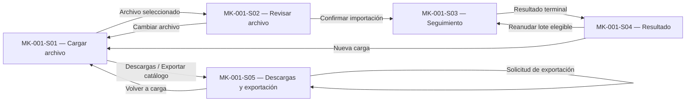

# Component Spec — MK-001

> **Propósito y rol documental:**  
> Este documento es la especificación principal del resultado esperado del mockup de MK-001.
>
> Subordinado a las fuentes de verdad (SPEC, HU, WF, FLOW, API Contract y Design System), define qué pantallas existen, el propósito de cada pantalla, su estructura, componentes, acciones, estados, contenido, jerarquía de información, decisiones UX locales, fixtures y criterios de aceptación.
>
> Consume la UX transversal del módulo y no introduce una propuesta UX paralela.
>
> Este documento especifica **qué debe existir**. El orden de ejecución corresponde a `plan.md` y la descomposición del trabajo a `tasks.md`.

---

## 1. Identificación

- **Mockup:** MK-001
- **Funcionalidad:** Carga y exportación masiva de productos
- **Responsable:** Marco Renato Castilla Huanca
- **Rama funcional:** `castilla`
- **Versión:** v0.1
- **Estado:** En revisión
- **Plataforma:** Web desktop
- **Viewport canónico:** 1440 px

---

## 2. Trazabilidad

| Fuente | Referencia | Alcance consumido |
|---|---|---|
| SPEC | `specs/SPEC-001-carga-exportacion-masiva-productos.md` | Importación multidominio, fallos parciales, stock inicial, idempotencia, reanudación, estados y exportación |
| HU | `hu/HU-001-carga-exportacion-masiva-productos.md` | CA-01 a CA-15 y escenarios de carga, fallo parcial, reintento y exportación |
| WF | `wireframes/flows/WF-001-carga-exportacion-masiva-productos.md` | S-01 a S-05, contenido visible, recorrido de importación y exportación |
| FLOW | `flujos/FLOW-001-carga-exportacion-masiva-productos.md` | Importación, reanudación idempotente y exportación asíncrona |
| Propuesta UX | `mockups/ux/propuesta-ux.md`, versión 2.0 | UX-P01, UX-P02 y UX-P03; aplicabilidad Alta para MK-001 |
| UX Decisions | `mockups/ux/ux-decisions.md`, versión 2.0 | UXD-003, UXD-004, UXD-005, UXD-007, UXD-008, UXD-009 y UXD-012 |
| UX Guidelines | `mockups/ux/ux-guidelines.md`, versión 2.0 | UXG-007, UXG-008, UXG-009, UXG-011, UXG-012, UXG-013, UXG-015 y reglas generales de accesibilidad/trazabilidad |
| API Contract | `api/openapi.yaml`, OpenAPI 3.1.0, `info.version: 0.5.0` | Bulk HTTP bajo `/api/v1/carga-masiva/productos/*` |
| Contrato humano | `Contrato_Api.md` | Ownership, Bulk, ausencia de rollback distribuido y prefijo `/api/v1` |
| Design System | `mockups/DESIGN.md`, versión 1.0.0 | Foundations, shell desktop, estados, DS-C01/06/14/17/19/22/24/25/28 y reglas de tablas/progreso/accesibilidad |

### 2.1. Operaciones HTTP relevantes

El mockup puede representar exclusivamente capacidades respaldadas por las siguientes operaciones vigentes:

```text
GET  /api/v1/carga-masiva/productos/plantilla
POST /api/v1/carga-masiva/productos/importaciones
GET  /api/v1/carga-masiva/productos/importaciones/{batchId}
GET  /api/v1/carga-masiva/productos/importaciones/{batchId}/reporte
POST /api/v1/carga-masiva/productos/importaciones/{batchId}/reanudar

POST /api/v1/carga-masiva/productos/exportaciones
GET  /api/v1/carga-masiva/productos/exportaciones/{exportId}
GET  /api/v1/carga-masiva/productos/exportaciones/{exportId}/archivo
```

No existe en OpenAPI 0.5.0 una operación:

```text
POST /api/v1/carga-masiva/productos/importaciones/prevalidar
```

Por tanto, cualquier prevalidación previa al envío mostrada por MK-001 se limita explícitamente a comprobaciones locales de archivo y estructura y no se presenta como validación completa de negocio.

---

## 3. Objetivo funcional

- **Usuario:** Gestor comercial.
- **Objetivo:** cargar productos masivamente y exportar la totalidad del catálogo activo de forma comprensible, trazable y recuperable.
- **Contexto:** administración de grandes volúmenes de productos, variantes, precios iniciales y stock inicial que requieren coordinación entre Catálogo, Pricing e Inventario.
- **Resultado exitoso de importación:** el gestor puede conocer el estado del lote, diferenciar filas completadas y fallidas, identificar el dominio afectado y recuperar únicamente operaciones reconciliables sin duplicar datos.
- **Resultado exitoso de exportación:** el gestor solicita CSV o XLSX, distingue solicitud aceptada de exportación terminada y descarga el archivo únicamente después de confirmarse `COMPLETED`.

---

## 4. Alcance

### Incluido

- Selección de archivo CSV o XLSX.
- Descarga de plantilla oficial.
- Revisión preliminar del archivo antes de confirmar la importación.
- Admisión de importación asíncrona.
- Seguimiento del lote.
- Visualización de:
  - filas totales;
  - filas completadas;
  - filas fallidas;
  - resultado por fila;
  - estado por dominio cuando la información esté disponible;
  - necesidad de reconciliación.
- Diferenciación entre:
  - solicitud recibida;
  - procesamiento;
  - completado;
  - completado con observaciones;
  - fallo general.
- Descarga del reporte CSV de filas fallidas.
- Reanudación del mismo lote cuando existan operaciones pendientes o reconciliables.
- Descarga de plantilla CSV/XLSX.
- Solicitud de exportación completa de catálogo en CSV o XLSX.
- Seguimiento del trabajo de exportación.
- Descarga del archivo exportado una vez completado.
- Estados de carga, error, vacío, parcial y resultado desconocido necesarios para el mockup.

### Fuera de alcance

- Edición manual de productos desde MK-001.
- Edición de precios individuales.
- Modificación manual de inventario.
- Gestión de ubicaciones.
- Selección de filtros para exportar subconjuntos del catálogo.
- Exportación PDF.
- Rollback manual o automático entre Catálogo, Pricing e Inventario.
- Exposición de colas RabbitMQ, `message_id`, `operation_id` o detalles internos de servicios.
- Un endpoint ficticio de prevalidación de carga general.
- Reintentos técnicos individuales de Pricing o Inventario.
- Definición manual de porcentajes o tiempos estimados que el contrato no publique.
- Adaptaciones mobile o tablet.

---

## 5. Inventario de pantallas

| ID | Pantalla | Propósito | Entrada | Acción principal | Salida | Prioridad | Ruta |
|---|---|---|---|---|---|---|---|
| MK-001-S01 | Cargar archivo | Iniciar una importación y acceder a recursos de carga/exportación | Navegación del módulo | Seleccionar archivo | S02 | P0 | `/MK001/S01` |
| MK-001-S02 | Revisar archivo | Revisar formato y estructura local antes del envío | S01 con archivo seleccionado | Confirmar importación | S03 | P0 | `/MK001/S02` |
| MK-001-S03 | Seguimiento de importación | Diferenciar admisión, procesamiento y avance verificable | Importación aceptada | Consultar seguimiento | S04 | P0 | `/MK001/S03` |
| MK-001-S04 | Resultado del lote | Mostrar resultado completo, parcial o fallido y recuperación disponible | Lote terminal | Descargar reporte / Reanudar lote | S03 o permanencia | P0 | `/MK001/S04` |
| MK-001-S05 | Descargas y exportación | Descargar plantilla y generar exportación completa del catálogo | S01 o navegación del módulo | Generar exportación | S05, cambio de estado | P0 | `/MK001/S05` |

### Reglas de modelado

El elemento `S-04-E` definido por WF-001 se representa como **estado “Completado con observaciones” de MK-001-S04**, no como una segunda pantalla independiente.

Los estados de una pantalla se reproducen mediante fixtures deterministas sin introducir nuevas rutas funcionales.

---

## 6. Relación entre pantallas



La exportación utiliza la misma pantalla S05 durante `QUEUED`, `PROCESSING`, `COMPLETED` o `FAILED_GENERAL`.

---

## 7. Jerarquía de información

### Primaria

- Estado actual de la importación o exportación.
- Archivo seleccionado.
- Acción principal disponible.
- Resultado confirmado del lote.
- Cantidad de filas completadas y fallidas.
- Advertencia de reconciliación cuando corresponda.
- Disponibilidad real de descarga.

### Secundaria

- Total de filas.
- Estado por dominio:
  - Catálogo;
  - Pricing presentado al usuario como **Precios**;
  - Inventario.
- Referencia del lote.
- Formato de exportación.
- Detalle por fila.
- Mensajes recuperables.

### Complementaria

- Identificador técnico de seguimiento cuando resulte útil para soporte.
- Metadatos de generación publicados por el contrato.
- Explicaciones sobre qué datos se conservan ante un fallo parcial.

No se muestran como contenido principal identificadores internos de mensajería ni nombres de eventos.

---

## 8. Componentes compartidos

| Componente | Pantallas | Uso | Variante | Estados |
|---|---|---|---|---|
| DS-C01 `PO/Button` | S01-S05 | Acciones principales y secundarias | filled primary / outline secondary / tertiary | default, hover, focus, disabled, loading |
| DS-C06 `PO/Select` | S05 | Formato CSV/XLSX | md | default, focus, open, selected, error |
| DS-C14 `PO/Badge` | S03-S05 | Estados de lote, fila, dominio y exportación | info, success, warning, error, neutral | según estado funcional |
| DS-C17 `PO/Table` | S03-S04 | Resultado por fila y por dominio | default | loading, default, empty, error |
| DS-C19 `PO/Card` | S01-S05 | Agrupar archivo, resumen y exportación | flat | default |
| DS-C22 `PO/Alert / PO/Result` | S02-S05 | Advertencias, resultados parciales, éxito y fallo | info, success, warning, error | persistentes según criticidad |
| DS-C24 `PO/Skeleton / PO/Loader` | S03-S05 | Consultas y operaciones asíncronas | localizado | loading |
| DS-C25 `PO/EmptyState` | S03-S04 | Ausencia real de detalle disponible | default | empty |
| DS-C28 `PO/Breadcrumbs` | S01-S05 | Jerarquía del backoffice | default | focus |

### Reglas comunes

- No se utiliza un spinner global como único seguimiento del lote.
- No se muestra porcentaje si no se dispone de medición suficiente.
- Las acciones incompatibles con un envío en curso permanecen bloqueadas sin ocultar el contexto.
- Badge y color nunca son el único mecanismo para comunicar estado.
- Los errores parciales utilizan alert y detalle localizado; no se colorea toda la tabla de rojo.
- La descarga de exportación permanece indisponible hasta `COMPLETED`.

---

## 9. Componentes específicos

### MK-001-C01 — Selector de archivo masivo

**Propósito**  
Permitir al gestor seleccionar de forma accesible un archivo CSV o XLSX antes de iniciar la importación.

**Pantallas**
- MK-001-S01.

**Contenido estructurado**
- Etiqueta de selección.
- Nombre del archivo seleccionado.
- Tipo/formato reconocido.
- Acción de seleccionar/reemplazar archivo.
- Mensaje de validación local.
- Ayuda para descargar la plantilla oficial.

**Propiedades conceptuales**

| Propiedad | Tipo | Obligatoria | Regla |
|---|---|---:|---|
| archivo | Archivo | Sí | CSV o XLSX |
| nombre | Texto | Sí al seleccionar | Nombre visible del archivo |
| formato | CSV / XLSX | Sí | Derivado del archivo seleccionado |
| estadoLocal | Estado | Sí | vacío, válido preliminarmente o inválido |
| mensaje | Texto | No | Explicación comprensible del problema |

**Estados**

| Estado | Disparador | Representación | Acción |
|---|---|---|---|
| Default | No se seleccionó archivo | Zona de selección y ayuda | Seleccionar archivo |
| Selected | Archivo reconocido localmente | Nombre y formato visibles | Continuar / Reemplazar |
| Error local | Formato o estructura básica no reconocida | Error junto al selector | Reemplazar archivo |
| Disabled temporal | Envío incompatible ya iniciado | Contexto conservado | Sin nuevo envío |

**Accesibilidad**
- Input de archivo con nombre accesible.
- Activable con teclado.
- Drag-and-drop, si existe visualmente, nunca es la única forma de seleccionar.
- El error se asocia al selector.
- El estado no depende exclusivamente del color.

---

### MK-001-C02 — Resumen de revisión preliminar

**Propósito**  
Permitir revisar el archivo antes de enviarlo sin presentar una validación local como aceptación de negocio del backend.

**Pantallas**
- MK-001-S02.

**Contenido**
- Nombre del archivo.
- Formato.
- Filas detectadas.
- Filas con estructura localmente revisable.
- Observaciones estructurales locales.
- Aviso de alcance de la revisión.

**Regla principal**

La interfaz debe comunicar:

> Esta revisión comprueba el archivo y su estructura antes del envío. El resultado definitivo se confirma durante el procesamiento del lote.

No usar:

> Archivo validado correctamente por el sistema.

cuando todavía no se ha realizado `POST /importaciones`.

**Estados**

| Estado | Condición | Representación | Acción |
|---|---|---|---|
| Sin observaciones locales | Estructura reconocible | Resumen neutro/info | Confirmar importación |
| Con observaciones locales | Existen problemas detectables localmente | Alert warning/error | Corregir o cambiar archivo |
| No interpretable | Archivo no puede revisarse | Alert error | Reemplazar archivo |

---

### MK-001-C03 — Panel de seguimiento del lote

**Propósito**  
Representar el estado real de la importación sin confundir admisión con finalización.

**Pantallas**
- MK-001-S03.
- MK-001-S04.

**Datos contractuales**

| Propiedad | Fuente |
|---|---|
| `batch_id` | `ImportacionGeneralAceptada` / `EstadoImportacionGeneral` |
| `status` | `EstadoImportacionGeneral` |
| `total_rows` | `EstadoImportacionGeneral` |
| `completed_rows` | `EstadoImportacionGeneral` |
| `failed_rows` | `EstadoImportacionGeneral` |
| `needs_reconciliation` | `EstadoImportacionGeneral` |
| `rows[]` | `EstadoImportacionGeneral`, cuando esté presente |

**Mapeo de estados**

| Estado contractual | Texto principal |
|---|---|
| `QUEUED` | Solicitud recibida |
| `PROCESSING` | Procesando importación |
| `COMPLETED` sin errores | Importación completada |
| `COMPLETED` + `failed_rows > 0` o reconciliación | Completado con observaciones |
| `FAILED_GENERAL` | No se pudo completar la importación |

`Completado con observaciones` es representación UX de un `COMPLETED` con fallos parciales/reconciliación. **No constituye un enum adicional del backend.**

**Progreso visible**

Cuando estén disponibles:

```text
Filas totales: N
Concluidas correctamente: X
Con observaciones: Y
```

El mockup puede expresar:

```text
X + Y de N filas concluidas
```

porque los contadores están publicados.

No se inventan:

- porcentaje de Pricing;
- porcentaje de Inventario;
- tiempo restante;
- ETA;
- progreso temporal ficticio.

**Accesibilidad**
- Cambios de estado anunciables sin mover el foco.
- Texto visible junto al indicador.
- Loader nunca aparece sin texto.
- Foco permanece en contexto mientras cambia el estado.

---

### MK-001-C04 — Estado por fila y dominio

**Propósito**  
Mostrar dónde ocurrió un fallo parcial y qué dominios ya conservaron resultados confirmados.

**Pantallas**
- MK-001-S03 cuando exista detalle disponible.
- MK-001-S04.

**Datos**

| Propiedad | Presentación |
|---|---|
| `row_id` | Referencia de fila |
| `status` | Estado textual |
| `applied_domains[]` | Dominios confirmados |
| `failed_domain` | Dominio afectado |
| `needs_reconciliation` | Requiere reconciliación |
| `code` | No se usa como mensaje principal |
| `detail` | Explicación contextual cuando sea apropiada |
| `steps[]` | Estado por Catálogo, Precios e Inventario |

**Etiquetas de dominio**

```text
CATALOGO   → Catálogo
PRICING    → Precios
INVENTARIO → Inventario
```

No exponer como mensaje de interfaz:

```text
pricing.product.initialization.requested
inventory.sku.initialization.requested
inventory.bulk.stock.adjust.requested
```

**Resultado parcial ejemplo**

```text
Fila 18
Catálogo: Completado
Precios: Completado
Inventario: Con error

Se conservaron los datos confirmados en Catálogo y Precios.
Esta fila requiere reconciliación.
```

---

### MK-001-C05 — Panel de exportación de catálogo

**Propósito**  
Solicitar y seguir la exportación completa del catálogo.

**Pantallas**
- MK-001-S05.

**Propiedades**

| Propiedad | Tipo | Obligatoria |
|---|---|---:|
| formato | CSV / XLSX | Sí |
| export_id | Texto | Después de admisión |
| status | Estado | Después de admisión |
| created_at | Fecha/hora | Si está disponible |
| completed_at | Fecha/hora/null | Si está disponible |
| download_url | URI/null | Si está disponible |

**Mapeo de estados**

| Estado | Presentación |
|---|---|
| Sin solicitud | Selector CSV/XLSX + CTA |
| `QUEUED` | Solicitud recibida |
| `PROCESSING` | Preparando archivo |
| `COMPLETED` | Exportación lista |
| `FAILED_GENERAL` | No se pudo generar la exportación |
| Consulta no disponible | No se pudo confirmar el estado actual |

El botón:

```text
Descargar archivo
```

solo aparece habilitado cuando el trabajo está `COMPLETED`.

---

## 10. Especificación por pantalla

### MK-001-S01 — Cargar archivo

**Propósito**  
Iniciar una carga masiva o acceder a descargas/exportación.

**Estructura**
1. Breadcrumbs.
2. H1 `Carga masiva de productos`.
3. Texto breve de contexto.
4. Card principal de carga.
5. MK-001-C01 Selector de archivo.
6. Ayuda sobre plantilla oficial.
7. Acciones.
8. Acceso secundario a `Descargas y exportación`.

**Acción primaria**
- `Continuar`.

Permanece deshabilitada hasta existir un archivo localmente reconocible.

**Acciones secundarias**
- `Descargar plantilla`.
- `Exportar catálogo`.

**Estados**
- Default.
- Archivo seleccionado.
- Error local.
- Error al descargar plantilla.
- Loading localizado durante una descarga solicitada.

**Microtexto**

| Elemento | Texto |
|---|---|
| H1 | Carga masiva de productos |
| Ayuda | Importa productos mediante un archivo CSV o XLSX basado en la plantilla oficial. |
| CTA | Continuar |
| Secundaria | Descargar plantilla |
| Secundaria | Exportar catálogo |

---

### MK-001-S02 — Revisar archivo

**Propósito**  
Revisar información local verificable antes de iniciar una operación asíncrona.

**Estructura**
1. Breadcrumbs.
2. H1 `Revisar archivo`.
3. Resumen del archivo.
4. MK-001-C02.
5. Observaciones locales.
6. Alert informativo sobre alcance de la revisión.
7. Barra de acciones.

**Acción primaria**
- `Confirmar importación`.

Ejecuta conceptualmente:

```text
POST /api/v1/carga-masiva/productos/importaciones
```

**Acciones secundarias**
- `Cambiar archivo`.
- `Volver`.

**Estados**
- Archivo revisable.
- Con observaciones locales.
- Error local bloqueante.
- Envío en curso.
- Rechazo HTTP del archivo:
  - archivo inválido;
  - archivo por encima del límite;
  - plantilla incompatible;
  - contenido activo no permitido.

**Mensajes de servidor**

Los códigos pueden mapearse a lenguaje de negocio:

```text
ARCHIVO_INVALIDO
→ No pudimos procesar el archivo seleccionado. Revisa su formato e inténtalo nuevamente.

ARCHIVO_EXCEDE_LIMITE
→ El archivo supera el límite permitido.

PLANTILLA_INCOMPATIBLE
→ El archivo no corresponde a la versión de plantilla admitida.

CONTENIDO_ACTIVO_NO_PERMITIDO
→ El archivo contiene contenido que no puede procesarse de forma segura.
```

El código técnico puede conservarse en detalle de soporte, pero no sustituye el mensaje principal.

---

### MK-001-S03 — Seguimiento de importación

**Propósito**  
Permitir saber si una solicitud fue recibida, sigue procesándose o ya tiene un resultado confirmado.

**Estructura**
1. Breadcrumbs.
2. H1 `Importación de productos`.
3. MK-001-C03.
4. Resumen de contadores.
5. Detalle de filas, si `rows[]` está disponible.
6. Alert de estado parcial/error de consulta cuando corresponda.

**Acción primaria**
No se introduce una acción de escritura mientras el lote está procesándose.

**Acciones secundarias**
- `Actualizar estado`, únicamente como nueva consulta segura si se representa explícitamente.
- Navegación de retorno cuando no interrumpa una acción necesaria.

**Estados requeridos**

#### Solicitud recibida

```text
Solicitud recibida
El lote fue aceptado y está pendiente de procesamiento.
```

No mostrar:

```text
Importación exitosa
```

tras recibir únicamente `202 Accepted`.

#### Procesando

```text
Procesando importación
82 de 120 filas han concluido.
```

si los contadores permiten afirmarlo.

#### Error al consultar estado

```text
No se pudo confirmar el estado actual del lote.
Conservamos la última información conocida.
```

No convertir esta situación en `FAILED_GENERAL`.

---

### MK-001-S04 — Resultado del lote

**Propósito**  
Mostrar el resultado confirmado y permitir la recuperación respaldada por contrato.

**Estructura**
1. Breadcrumbs.
2. H1.
3. `PO/Result`.
4. Resumen:
   - total;
   - completadas;
   - fallidas.
5. Alert de reconciliación, si aplica.
6. Tabla por fila cuando exista detalle.
7. Acciones disponibles.

#### Estado: éxito

**Título**
`Importación completada`

**Contenido**
- Filas procesadas.
- Sin errores informados.
- Sin reconciliación pendiente.

#### Estado: completado con observaciones

**Título**
`Completado con observaciones`

**Contenido**
- Cantidad de filas correctas.
- Cantidad de filas fallidas.
- Dominios afectados.
- Explicación de conservación de resultados confirmados.

**Acciones**
- `Descargar reporte`.
- `Reanudar lote`, exclusivamente cuando el estado publicado lo permita y exista reconciliación/pending correspondiente.

La reanudación utiliza:

```text
POST /api/v1/carga-masiva/productos/importaciones/{batchId}/reanudar
```

y se presenta como continuidad del **mismo lote**, nunca como una segunda importación independiente.

#### Estado: fallo general

**Título**
`No se pudo completar la importación`

**Contenido**
- Mensaje recuperable.
- Referencia del lote si existe.
- No afirmar que todas las filas individuales fueron revertidas.

#### Tabla

Columnas base:

| Columna | Contenido |
|---|---|
| Fila | `row_id` |
| Estado | status textual |
| Catálogo | estado si está disponible |
| Precios | estado si está disponible |
| Inventario | estado si está disponible |
| Reconciliación | requerida / no requerida |
| Detalle | explicación disponible |

No implementar selección masiva ni toolbar de edición.

---

### MK-001-S05 — Descargas y exportación de catálogo

**Propósito**  
Centralizar la plantilla de importación y la exportación completa del catálogo.

**Estructura**
1. Breadcrumbs.
2. H1 `Descargas y exportación`.
3. Card `Plantilla de importación`.
4. Card `Exportar catálogo`.
5. Selector CSV/XLSX.
6. MK-001-C05.
7. Acción de descarga cuando corresponda.

### Bloque de plantilla

**Contenido**
- Explicación breve.
- Selector o acciones admitidas de CSV/XLSX.
- `Descargar plantilla`.

### Bloque de exportación

**Contenido**
- Selector `Formato`.
- CSV.
- XLSX.
- CTA `Generar exportación`.

No incorporar:
- filtros;
- categorías;
- marcas;
- rangos de fechas;
- PDF;

porque `CrearExportacionProductosRequest` solo requiere `formato`.

### Estado aceptado

```text
Solicitud recibida
Estamos preparando la exportación del catálogo.
```

### Estado procesando

```text
Preparando archivo
La exportación continúa en segundo plano.
```

### Estado completado

```text
Exportación lista
El archivo ya está disponible.
```

CTA:

```text
Descargar archivo
```

### Estado fallido

```text
No se pudo generar la exportación.
```

No habilitar descarga.

---

## 11. Decisiones UX locales

### LUX-01 — S-04-E como estado de resultado

**Problema**  
WF-001 diferencia `S-04 Resultado` y `S-04-E Resultado con errores`, aunque ambas representan el mismo momento funcional del lote.

**Alternativas**
- A: dos pantallas y rutas diferentes.
- B: una pantalla con variantes de resultado.

**Decisión**
Adoptar B.

MK-001-S04 posee estados:

```text
éxito
completado con observaciones
fallo general
```

**Justificación**  
Mantiene una única jerarquía y ruta para un mismo resultado funcional y permite representar fielmente la semántica de OpenAPI.

**Trade-off**  
Las variantes deben poder reproducirse directamente mediante fixtures para su revisión.

**Validación**  
Todos los resultados de WF-001 S-04/S-04-E pueden representarse sin una segunda pantalla.

---

### LUX-02 — Progreso verificable en lugar de barra ficticia por fases

**Problema**  
WF-001 menciona una barra de avance por fases, pero OpenAPI 0.5.0 publica contadores de filas y estados por dominio y no publica un porcentaje temporal de cada fase interna.

**Alternativas**
- A: representar porcentajes estimados o una barra temporal.
- B: representar contadores y estados contractualmente disponibles.

**Decisión**
Adoptar B.

**Justificación**
UX-P01, UXD-004 y UXG-007/008 prohíben aparentar progreso no verificable.

**Representación**

```text
Procesando importación
82 de 120 filas concluidas

Catálogo
Precios
Inventario
```

solo cuando esos estados se encuentran disponibles en los datos.

**Trade-off**
La interfaz puede resultar menos visual que una barra porcentual, pero comunica únicamente evidencia real.

---

### LUX-03 — Prevalidación preliminar explícitamente local

**Problema**  
WF-001 requiere S-02, pero OpenAPI 0.5.0 no publica un endpoint de prevalidación general equivalente al disponible para la importación exclusiva de Pricing.

**Alternativas**
- A: inventar una validación remota previa.
- B: limitar S-02 a información local verificable y explicar sus límites.

**Decisión**
Adoptar B.

**Justificación**
Respeta el hallazgo documentado por UX transversal y evita prometer una capacidad backend inexistente.

**Trade-off**
Algunas observaciones de negocio solo aparecerán después de iniciar el lote.

**Validación**
Ningún mensaje de S02 afirma aceptación de negocio antes de `POST /importaciones`.

---

## 12. Reglas de layout PC

- Web desktop exclusivamente.
- Viewport canónico: 1440 px.
- Altura inicial de revisión: 900 px como referencia, sin restringir scroll vertical.
- Utilizar el shell administrativo definido en `mockups/DESIGN.md`.
- Grid interior de 12 columnas cuando corresponda.
- Cards y formularios sin sombras decorativas.
- Tablas con header `cloud-subtle`.
- Fila estándar mínima de 48 px.
- Evitar scroll horizontal de página.
- Si una tabla requiere ancho adicional, el scroll se limita a su región etiquetada.
- No implementar breakpoints mobile/tablet.
- Oswald exclusivamente para headings H1-H3.
- Inter para operación, controles y tablas.
- Foco visible mediante el token del Design System.
- No usar color como única señal de éxito, warning o error.

---

## 13. Fixtures

Todos los valores siguientes son **datos ficticios deterministas para prototipado** y no ejemplos de producción.

| Fixture | Caso | Pantalla / estado | Datos representativos |
|---|---|---|---|
| `upload-empty` | Sin archivo | S01 / Default | Sin selección |
| `upload-selected-csv` | Archivo CSV seleccionado | S01 / Selected | `catalogo_octubre.csv` |
| `upload-invalid-format` | Archivo no admitido | S01 / Error | `catalogo_octubre.zip` |
| `precheck-ok` | Revisión local sin observaciones | S02 / Default | 120 filas detectadas |
| `precheck-warning` | Observaciones estructurales | S02 / Warning | 120 detectadas, 4 observadas localmente |
| `batch-queued` | Importación aceptada | S03 / QUEUED | `status=QUEUED` |
| `batch-processing` | Lote en ejecución | S03 / PROCESSING | total 120, completed 82, failed 4 |
| `batch-completed` | Éxito completo | S04 / Success | total 120, completed 120, failed 0, reconciliation false |
| `batch-partial` | Fallo parcial | S04 / Warning | total 120, completed 114, failed 6, reconciliation true |
| `batch-catalog-failed` | Fila rechazada por Catálogo | S04 / Row error | Catálogo fallido; Pricing/Inventario no iniciados |
| `batch-inventory-failed` | Catálogo y Pricing confirmados, Inventario fallido | S04 / Partial | applied_domains Catálogo + Pricing |
| `batch-pricing-failed` | Catálogo e Inventario confirmados, Pricing fallido | S04 / Partial | applied_domains Catálogo + Inventario |
| `batch-failed-general` | Fallo general | S04 / Error | `FAILED_GENERAL` |
| `batch-status-unavailable` | Error al consultar | S03 / Error de lectura | último estado conocido conservado |
| `batch-resume-accepted` | Reanudación aceptada | S03 / QUEUED | mismo `batch_id` |
| `export-empty` | Sin exportación solicitada | S05 / Default | CSV seleccionado |
| `export-queued` | Solicitud aceptada | S05 / QUEUED | formato CSV |
| `export-processing` | Generación en curso | S05 / PROCESSING | formato XLSX |
| `export-completed` | Archivo disponible | S05 / COMPLETED | descarga habilitada |
| `export-failed` | Trabajo fallido | S05 / FAILED_GENERAL | descarga no disponible |
| `export-status-unavailable` | Consulta fallida | S05 / Unknown | último estado conservado |

### Dataset parcial de referencia

```text
Total: 120
Completadas: 114
Fallidas: 6
Necesita reconciliación: Sí
```

Ejemplo de fila:

```text
Fila: 018
Estado: Con error

Catálogo: Completado
Precios: Completado
Inventario: Con error

Resultado confirmado:
Catálogo y Precios conservaron sus datos.

Siguiente acción:
Reanudar lote cuando corresponda.
```

---

## 14. Preguntas y supuestos

### Preguntas abiertas

| ID | Pregunta | Bloquea ejecución | Responsable | Estado |
|---|---|---:|---|---|
| Q-01 | SPEC-001 §4 todavía denomina su referencia como OpenAPI 0.4.0 aunque el contrato HTTP vigente es 0.5.0. ¿Se actualizará esa mención documental? | No | Owner SPEC-001 | Abierta |
| Q-02 | ¿Las reglas exactas de revisión local de S02 quedarán formalizadas en otro artefacto o se limitarán a formato/estructura visible sin afirmar validez de negocio? | No | Castilla / integración | Abierta |

### Supuestos adoptados

| ID | Supuesto | Riesgo | Condición de revisión |
|---|---|---|---|
| A-01 | La fuente HTTP vigente para el mockup es OpenAPI 0.5.0 | Una SPEC conserva mención histórica 0.4.0 | Si cambia `info.version` o contrato |
| A-02 | S02 representa únicamente prevalidación local preliminar | El usuario podría interpretarla como aceptación de negocio | Revisar microcopy si se publica prevalidación general backend |
| A-03 | `S-04-E` es un estado de MK-001-S04 | Diferencia respecto al nombre del wireframe | Revisar si FLOW exige navegación independiente |
| A-04 | Los detalles por fila se muestran cuando `rows[]` está disponible | El esquema no exige `rows` en toda respuesta | Degradar a resumen + reporte cuando esté ausente |
| A-05 | `Completado con observaciones` es etiqueta UX derivada y no enum backend | Confusión entre UI y contrato | Mantener mapeo explícito a `COMPLETED` |

---

## 15. Criterios de aceptación

- [ ] Las cinco pantallas P0 están inventariadas con rutas `/MK001/S01` a `/MK001/S05`.
- [ ] `S-04-E` puede reproducirse como estado de MK-001-S04.
- [ ] S02 no inventa una operación HTTP `/prevalidar`.
- [ ] La revisión preliminar explica que no equivale a aceptación definitiva de negocio.
- [ ] Un `202 Accepted` nunca se presenta como importación/exportación completada.
- [ ] `QUEUED`, `PROCESSING`, `COMPLETED` y `FAILED_GENERAL` tienen representación diferenciada.
- [ ] `COMPLETED` con errores/reconciliación se presenta como `Completado con observaciones` sin inventar un nuevo enum.
- [ ] No se muestran porcentajes o ETAs sin datos contractuales suficientes.
- [ ] El resultado parcial conserva y comunica los dominios ya confirmados.
- [ ] La tabla de resultado distingue Catálogo, Precios e Inventario.
- [ ] Los códigos técnicos no constituyen el mensaje principal para el usuario.
- [ ] No se muestran nombres de eventos RabbitMQ ni identificadores internos innecesarios.
- [ ] La reanudación utiliza el mismo lote y solo aparece cuando la capacidad contractual es aplicable.
- [ ] Reanudar no se presenta como volver a importar todas las filas.
- [ ] La descarga de reporte utiliza la capacidad publicada para el lote.
- [ ] La exportación admite únicamente CSV o XLSX.
- [ ] La exportación representa la totalidad del catálogo; no añade filtros inexistentes.
- [ ] La descarga del catálogo solo está habilitada después de `COMPLETED`.
- [ ] Los errores de consulta conservan el último contexto conocido sin transformarlo en fallo confirmado.
- [ ] Los componentes compartidos reutilizan `mockups/DESIGN.md` 1.0.0.
- [ ] La pantalla utiliza `DS-C17 PO/Table` sin acciones masivas inventadas.
- [ ] Los estados parciales/críticos utilizan feedback persistente mediante `DS-C22`.
- [ ] Los loaders son localizados y siempre están acompañados por texto.
- [ ] Los fixtures están identificados como datos ficticios y no crean capacidades backend.
- [ ] El layout se valida en 1440 px sin overflow horizontal de página.
- [ ] No existen variantes mobile/tablet.
- [ ] El foco es visible.
- [ ] Las acciones son operables mediante teclado.
- [ ] Los estados no dependen exclusivamente del color.
- [ ] Los mensajes asíncronos pueden anunciarse sin desplazar innecesariamente el foco.
- [ ] Toda acción visible puede trazarse a SPEC/HU/FLOW o al contrato HTTP vigente.
