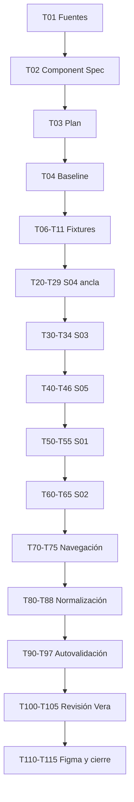

# Tasks — MK-001

> **Propósito:**  
> Descomponer la ejecución de MK-001 en unidades de trabajo atómicas, trazables y verificables.
>
> Cada tarea debe poder cerrarse únicamente cuando exista evidencia objetiva de su cumplimiento.
>
> Este documento no redefine el resultado esperado ni la estrategia general:
>
> - `component-spec.md` define **qué debe existir**.
> - `plan.md` define **cómo debe construirse**.
> - `tasks.md` define **qué acciones concretas deben ejecutarse y verificarse**.

---

## 1. Identificación

- **Mockup:** MK-001
- **Funcionalidad:** Carga y exportación masiva de productos
- **Responsable:** Marco Renato Castilla Huanca
- **Rama funcional:** `castilla`
- **Component Spec:** `mockups/MK-001/component-spec.md`
- **Plan:** `mockups/MK-001/plan.md`
- **Design System:** `mockups/DESIGN.md` v1.0.0
- **UX transversal:** v2.0
- **Contrato HTTP:** OpenAPI 0.5.0
- **Estado general:** Pendiente

### Prioridades

- `P0`: obligatorio para validar y aprobar MK-001.
- `P1`: necesario para refinamiento y cierre formal.
- `P2`: mejora no bloqueante.

### Estados

- `TODO`: pendiente.
- `DOING`: en ejecución.
- `BLOCKED`: detenido por una condición de bloqueo.
- `REVIEW`: terminado y pendiente de verificación.
- `DONE`: verificado con evidencia objetiva.

### Regla de cierre

Una tarea solo puede marcarse `DONE` cuando su campo **Verificación** pueda comprobarse objetivamente.

Si una tarea pasa a `BLOCKED`, debe registrarse en la sección **11. Registro de bloqueos**.

---

# 2. Preparación y Gate 0

## MK-001-T01 — P0 — Confirmar fuentes vigentes `[TODO]`

**Entrada**

- `SPEC-001`.
- `HU-001`.
- `WF-001`.
- `FLOW-001`.
- OpenAPI 0.5.0.
- UX 2.0.
- `DESIGN.md` 1.0.0.

**Acción**

Comprobar que las versiones utilizadas por `component-spec.md` y `plan.md` siguen vigentes antes de iniciar implementación.

**Salida esperada**

Registro sin discrepancias bloqueantes entre las fuentes consumidas.

**Verificación**

- OpenAPI mantiene `info.version: 0.5.0`.
- UX transversal continúa en versión 2.0.
- Design System continúa en versión 1.0.0 o se registra explícitamente una nueva versión.

---

## MK-001-T02 — P0 — Cerrar Component Spec `[TODO]`

**Entrada**

`mockups/MK-001/component-spec.md`.

**Acción**

Revisar y cerrar las preguntas o hallazgos que impidan implementar MK-001.

Confirmar específicamente:

- LUX-01.
- LUX-02.
- LUX-03.
- S04-E como estado de S04.
- prevalidación de S02 exclusivamente preliminar/local.
- OpenAPI 0.5.0 como contrato vigente.

**Salida esperada**

`component-spec.md` en estado:

```text
Aprobado
```

**Verificación**

No existen preguntas abiertas marcadas como bloqueantes.

---

## MK-001-T03 — P0 — Confirmar Plan `[TODO]`

**Entrada**

`mockups/MK-001/plan.md`.

**Acción**

Comprobar:

- pantalla ancla S04;
- orden constructivo;
- restricciones;
- riesgos;
- Quality Gates;
- estrategia de fixtures.

**Salida esperada**

Plan listo para ejecución.

**Verificación**

No existe contradicción entre `plan.md` y `component-spec.md`.

---

## MK-001-T04 — P0 — Verificar baseline transversal del prototipo `[TODO]`

**Entrada**

`mockups/prototipo/README.md` y código disponible del prototipo.

**Acción**

Confirmar existencia o disponibilidad de:

- React;
- TypeScript;
- Mantine;
- Tabler Icons;
- routing;
- tema central;
- componentes compartidos.

**Salida esperada**

Entorno común utilizable por MK-001.

**Verificación**

MK-001 puede implementarse bajo:

```text
mockups/prototipo/src/pantallas/MK001/
```

sin crear una aplicación paralela.

**Condición de bloqueo**

Si la baseline común no existe y continuar exige crear infraestructura propia:

```text
BLOCKED
```

---

## MK-001-T05 — P0 — Identificar componentes Design System `[TODO]`

**Entrada**

`component-spec.md` §8 y `DESIGN.md`.

**Acción**

Confirmar reutilización de:

- DS-C01 `PO/Button`.
- DS-C06 `PO/Select`.
- DS-C14 `PO/Badge`.
- DS-C17 `PO/Table`.
- DS-C19 `PO/Card`.
- DS-C22 `PO/Alert / PO/Result`.
- DS-C24 `PO/Skeleton / PO/Loader`.
- DS-C25 `PO/EmptyState`.
- DS-C28 `PO/Breadcrumbs`.

**Salida esperada**

Mapa componente → pantalla.

**Verificación**

No existe un componente compartido redefinido localmente sin necesidad.

---

# 3. Fixtures deterministas

## MK-001-T06 — P0 — Crear estructura de fixtures `[TODO]`

**Entrada**

`component-spec.md` §13.

**Acción**

Crear la estructura local necesaria para datasets de MK-001.

**Salida esperada**

Fixtures importables desde las pantallas de MK-001.

**Verificación**

No dependen de red, backend, aleatoriedad ni datos personales reales.

---

## MK-001-T07 — P0 — Crear fixtures de carga de archivo `[TODO]`

**Entrada**

Component Spec §13.

**Acción**

Crear:

```text
upload-empty
upload-selected-csv
upload-invalid-format
```

**Salida esperada**

Estados reproducibles para MK-001-S01.

**Verificación**

Cada fixture produce exactamente el estado documentado.

---

## MK-001-T08 — P0 — Crear fixtures de revisión preliminar `[TODO]`

**Acción**

Crear:

```text
precheck-ok
precheck-warning
```

**Salida esperada**

Estados de MK-001-S02.

**Verificación**

Ningún fixture simula una respuesta de un endpoint `/prevalidar` inexistente.

---

## MK-001-T09 — P0 — Crear fixtures de importación `[TODO]`

**Acción**

Crear como mínimo:

```text
batch-queued
batch-processing
batch-completed
batch-partial
batch-catalog-failed
batch-inventory-failed
batch-pricing-failed
batch-failed-general
batch-status-unavailable
batch-resume-accepted
```

**Salida esperada**

Cobertura determinista de S03 y S04.

**Verificación**

Propiedades compatibles con:

- `ImportacionGeneralAceptada`.
- `EstadoImportacionGeneral`.
- `FilaBulk`.
- `PasoDominioBulk`.

---

## MK-001-T10 — P0 — Crear fixtures de exportación `[TODO]`

**Acción**

Crear:

```text
export-empty
export-queued
export-processing
export-completed
export-failed
export-status-unavailable
```

**Salida esperada**

Cobertura de MK-001-S05.

**Verificación**

- formatos únicamente CSV/XLSX;
- descarga únicamente disponible en `COMPLETED`.

---

## MK-001-T11 — P0 — Auditar fixtures contra OpenAPI `[TODO]`

**Entrada**

Todos los fixtures y `api/openapi.yaml`.

**Acción**

Comparar:

- campos;
- enums;
- nullabilidad;
- relaciones;
- estados.

**Salida esperada**

Fixtures contractualmente coherentes.

**Verificación**

Ningún fixture necesita un campo o estado backend inventado.

---

# 4. Pantalla ancla — MK-001-S04

## MK-001-T20 — P0 — Implementar estructura de S04 `[TODO]`

**Entrada**

Component Spec §10 — S04.

**Acción**

Implementar:

1. breadcrumbs;
2. H1;
3. resultado principal;
4. resumen de filas;
5. alert de reconciliación;
6. tabla;
7. acciones disponibles.

**Salida esperada**

Ruta:

```text
/MK001/S04
```

operativa directamente.

**Verificación**

La pantalla puede renderizarse sin transitar por S01-S03.

---

## MK-001-T21 — P0 — Implementar resultado parcial como caso base `[TODO]`

**Entrada**

Fixture:

```text
batch-partial
```

**Acción**

Representar:

- `COMPLETED`;
- filas fallidas;
- reconciliación;
- dominios confirmados;
- dominio fallido.

**Salida esperada**

Resultado visual:

```text
Completado con observaciones
```

sin crear un nuevo enum backend.

**Verificación**

La UI no presenta ni éxito total ni fallo total.

---

## MK-001-T22 — P0 — Implementar tabla por fila y dominio `[TODO]`

**Entrada**

MK-001-C04.

**Acción**

Implementar columnas:

- Fila.
- Estado.
- Catálogo.
- Precios.
- Inventario.
- Reconciliación.
- Detalle.

**Salida esperada**

Tabla semántica basada en DS-C17.

**Verificación**

No existe:

- selección masiva;
- edición;
- borrado;
- rollback;
- toolbar de mutación.

---

## MK-001-T23 — P0 — Implementar fallo parcial de Inventario `[TODO]`

**Entrada**

`batch-inventory-failed`.

**Acción**

Mostrar:

```text
Catálogo: Completado
Precios: Completado
Inventario: Con error
```

y explicar que los datos confirmados se conservan.

**Salida esperada**

Resultado parcial correcto.

**Verificación**

No se afirma que Catálogo o Pricing fueron revertidos.

---

## MK-001-T24 — P0 — Implementar fallo parcial de Pricing `[TODO]`

**Entrada**

`batch-pricing-failed`.

**Salida esperada**

Catálogo e Inventario permanecen visualmente confirmados cuando el fixture así lo establece.

**Verificación**

No se ejecuta ni representa rollback ficticio.

---

## MK-001-T25 — P0 — Implementar fallo de Catálogo `[TODO]`

**Entrada**

`batch-catalog-failed`.

**Acción**

Representar que las dependencias posteriores no fueron aplicadas cuando corresponde.

**Verificación**

Pricing e Inventario no aparecen falsamente como completados.

---

## MK-001-T26 — P0 — Implementar éxito total `[TODO]`

**Entrada**

`batch-completed`.

**Salida esperada**

`PO/Result` en estado success.

**Verificación**

- `failed_rows = 0`.
- `needs_reconciliation = false`.
- no se muestra CTA de reanudación.

---

## MK-001-T27 — P0 — Implementar fallo general `[TODO]`

**Entrada**

`batch-failed-general`.

**Salida esperada**

Resultado general de error.

**Verificación**

La UI no deduce que cada fila individual fue revertida.

---

## MK-001-T28 — P0 — Implementar descarga de reporte `[TODO]`

**Entrada**

Capacidad:

```text
GET /api/v1/carga-masiva/productos/importaciones/{batchId}/reporte
```

**Acción**

Representar CTA:

```text
Descargar reporte
```

en los estados donde corresponda.

**Verificación**

La acción se traza al contrato publicado.

---

## MK-001-T29 — P0 — Implementar reanudación contractual `[TODO]`

**Entrada**

```text
POST /api/v1/carga-masiva/productos/importaciones/{batchId}/reanudar
```

**Acción**

Habilitar `Reanudar lote` exclusivamente cuando el fixture represente pendientes/reconciliación aplicable.

**Salida esperada**

Transición S04 → S03.

**Verificación**

La nueva visualización conserva la identidad del mismo lote.

No se crea un batch nuevo.

---

# 5. MK-001-S03 — Seguimiento

## MK-001-T30 — P0 — Implementar estructura de S03 `[TODO]`

**Entrada**

Component Spec S03.

**Salida esperada**

Ruta directa:

```text
/MK001/S03
```

**Verificación**

Pantalla operativa independientemente del recorrido anterior.

---

## MK-001-T31 — P0 — Implementar `QUEUED` `[TODO]`

**Entrada**

`batch-queued`.

**Acción**

Mostrar:

```text
Solicitud recibida
```

**Verificación**

No aparece:

```text
Importación completada
```

---

## MK-001-T32 — P0 — Implementar `PROCESSING` `[TODO]`

**Entrada**

`batch-processing`.

**Acción**

Representar contadores disponibles.

Ejemplo:

```text
82 de 120 filas han concluido
```

**Verificación**

No se muestra:

- ETA inventada;
- porcentaje temporal inventado;
- progreso de dominio no publicado.

---

## MK-001-T33 — P0 — Implementar consulta no disponible `[TODO]`

**Entrada**

`batch-status-unavailable`.

**Acción**

Conservar contexto previamente conocido.

**Salida esperada**

Alert:

```text
No se pudo confirmar el estado actual del lote.
Conservamos la última información conocida.
```

**Verificación**

El lote no pasa visualmente a `FAILED_GENERAL`.

---

## MK-001-T34 — P0 — Implementar actualización segura `[TODO]`

**Acción**

Añadir una acción de consulta/actualización únicamente como lectura segura.

**Salida esperada**

Loader localizado.

**Verificación**

La actualización:

- no vacía toda la pantalla;
- no duplica importaciones;
- no cambia el estado por anticipado.

---

# 6. MK-001-S05 — Descargas y exportación

## MK-001-T40 — P0 — Implementar estructura de S05 `[TODO]`

**Salida esperada**

Ruta:

```text
/MK001/S05
```

con:

- plantilla;
- selector CSV/XLSX;
- seguimiento de exportación.

---

## MK-001-T41 — P0 — Implementar selección de formato `[TODO]`

**Entrada**

`CrearExportacionProductosRequest`.

**Acción**

Implementar selector con:

```text
CSV
XLSX
```

**Verificación**

No existe PDF.

---

## MK-001-T42 — P0 — Implementar solicitud de exportación `[TODO]`

**Entrada**

```text
POST /api/v1/carga-masiva/productos/exportaciones
```

**Salida esperada**

Estado:

```text
Solicitud recibida
```

**Verificación**

`202` no habilita descarga.

---

## MK-001-T43 — P0 — Implementar exportación en procesamiento `[TODO]`

**Entrada**

`export-processing`.

**Salida esperada**

```text
Preparando archivo
La exportación continúa en segundo plano.
```

**Verificación**

Botón de descarga no disponible.

---

## MK-001-T44 — P0 — Implementar exportación completada `[TODO]`

**Entrada**

`export-completed`.

**Salida esperada**

CTA:

```text
Descargar archivo
```

habilitado.

**Verificación**

Solo `COMPLETED` habilita la descarga.

---

## MK-001-T45 — P0 — Implementar exportación fallida `[TODO]`

**Entrada**

`export-failed`.

**Verificación**

- mensaje persistente;
- descarga deshabilitada;
- no se presenta archivo inexistente.

---

## MK-001-T46 — P0 — Eliminar capacidades no contractuales `[TODO]`

**Acción**

Verificar que S05 no contenga:

- filtros por categoría;
- filtros por marca;
- fechas;
- selección de subconjunto;
- PDF.

**Verificación**

`CrearExportacionProductosRequest` se representa únicamente mediante `formato`.

---

# 7. MK-001-S01 — Cargar archivo

## MK-001-T50 — P0 — Implementar estructura de S01 `[TODO]`

**Salida esperada**

Ruta:

```text
/MK001/S01
```

con:

- H1;
- selector de archivo;
- ayuda;
- descarga de plantilla;
- acceso a exportación.

---

## MK-001-T51 — P0 — Implementar selector de archivo `[TODO]`

**Entrada**

MK-001-C01.

**Acción**

Permitir selección de CSV/XLSX.

**Verificación**

Puede operarse con mouse y teclado.

---

## MK-001-T52 — P0 — Implementar archivo seleccionado `[TODO]`

**Entrada**

`upload-selected-csv`.

**Salida esperada**

Nombre y formato visibles.

**Verificación**

CTA `Continuar` puede habilitarse.

---

## MK-001-T53 — P0 — Implementar error local `[TODO]`

**Entrada**

`upload-invalid-format`.

**Salida esperada**

Error asociado directamente al selector.

**Verificación**

No depende de toast ni color.

---

## MK-001-T54 — P0 — Implementar descarga de plantilla `[TODO]`

**Entrada**

```text
GET /api/v1/carga-masiva/productos/plantilla
```

**Acción**

Representar descarga de plantilla oficial.

**Verificación**

CSV/XLSX según capacidad publicada.

---

## MK-001-T55 — P0 — Verificar ausencia de dependencia propia de upload `[TODO]`

**Acción**

Comprobar que MK-001 no haya agregado una librería de drag-and-drop únicamente para esta pantalla.

**Verificación**

Si drag-and-drop existe, proviene de la baseline común aprobada.

La selección convencional de archivo continúa disponible.

---

# 8. MK-001-S02 — Revisar archivo

## MK-001-T60 — P0 — Implementar estructura de S02 `[TODO]`

**Salida esperada**

Ruta:

```text
/MK001/S02
```

con:

- archivo;
- resumen;
- observaciones;
- aviso de alcance;
- acciones.

---

## MK-001-T61 — P0 — Implementar revisión preliminar `[TODO]`

**Entrada**

`precheck-ok`.

**Acción**

Mostrar información local verificable:

- nombre;
- formato;
- filas detectadas;
- estructura reconocida.

**Verificación**

Se muestra explícitamente:

```text
Esta revisión comprueba el archivo y su estructura antes del envío.
El resultado definitivo se confirma durante el procesamiento del lote.
```

---

## MK-001-T62 — P0 — Implementar observaciones locales `[TODO]`

**Entrada**

`precheck-warning`.

**Salida esperada**

Alert localizado.

**Verificación**

El mensaje explica qué debe corregirse sin afirmar que el backend ya rechazó el lote.

---

## MK-001-T63 — P0 — Implementar confirmación de importación `[TODO]`

**Entrada**

```text
POST /api/v1/carga-masiva/productos/importaciones
```

**Acción**

Conectar conceptualmente:

```text
S02 → S03
```

**Verificación**

La primera respuesta aceptada conduce a estado `QUEUED`.

---

## MK-001-T64 — P0 — Implementar errores iniciales del archivo `[TODO]`

**Entrada**

Errores publicados:

```text
ARCHIVO_INVALIDO
ARCHIVO_EXCEDE_LIMITE
PLANTILLA_INCOMPATIBLE
CONTENIDO_ACTIVO_NO_PERMITIDO
```

**Acción**

Mapear a mensajes entendibles para el Gestor Comercial.

**Verificación**

Los códigos técnicos no constituyen el mensaje principal.

---

## MK-001-T65 — P0 — Auditar ausencia de prevalidación inventada `[TODO]`

**Acción**

Buscar en interfaz y código referencias a:

```text
/prevalidar
```

para la carga general MK-001.

**Salida esperada**

Ninguna capacidad ficticia.

**Verificación**

S02 continúa siendo una revisión preliminar/local.

---

# 9. Navegación y estados reproducibles

## MK-001-T70 — P0 — Implementar rutas directas `[TODO]`

**Acción**

Garantizar:

```text
/MK001/S01
/MK001/S02
/MK001/S03
/MK001/S04
/MK001/S05
```

**Verificación**

Todas cargan directamente.

---

## MK-001-T71 — P0 — Implementar flujo principal `[TODO]`

**Acción**

Conectar:

```text
S01 → S02 → S03 → S04
```

**Verificación**

El recorrido puede completarse con fixtures.

---

## MK-001-T72 — P0 — Implementar flujo de exportación `[TODO]`

**Acción**

Conectar:

```text
S01 → S05
```

**Verificación**

No requiere pasar por importación.

---

## MK-001-T73 — P0 — Implementar recuperación `[TODO]`

**Acción**

Conectar:

```text
S04 → S03
```

cuando se reanuda un lote.

**Verificación**

Se mantiene el mismo `batch_id`.

---

## MK-001-T74 — P0 — Implementar nueva carga `[TODO]`

**Acción**

Permitir:

```text
S04 → S01
```

como nueva intención explícita.

**Verificación**

No se confunde con `Reanudar lote`.

---

## MK-001-T75 — P0 — Implementar reproducción determinista de estados `[TODO]`

**Entrada**

Fixtures de MK-001.

**Acción**

Añadir un mecanismo estable para abrir estados concretos.

Puede utilizarse:

- query parameter;
- selector de fixture;
- configuración equivalente.

**Salida esperada**

Por ejemplo, conceptualmente:

```text
/MK001/S04?estado=partial
/MK001/S04?estado=completed
/MK001/S03?estado=processing
/MK001/S05?estado=completed
```

**Verificación**

Un revisor puede reproducir estados sin editar código.

---

# 10. Normalización y Quality Assurance

## MK-001-T80 — P0 — Normalizar arquitectura `[TODO]`

**Acción**

Eliminar:

- componentes duplicados;
- utilidades innecesarias;
- lógica visual repetida.

**Verificación**

Código de MK-001 modular y contenido en su alcance.

---

## MK-001-T81 — P0 — Normalizar Design System `[TODO]`

**Acción**

Reemplazar valores arbitrarios por tokens oficiales.

**Verificación**

No existen colores, radios, spacing o tipografías inconsistentes con `DESIGN.md`.

---

## MK-001-T82 — P0 — Normalizar iconografía `[TODO]`

**Acción**

Utilizar únicamente Tabler Icons cuando corresponda.

**Verificación**

No existen librerías de iconos alternativas introducidas por MK-001.

---

## MK-001-T83 — P0 — Limpiar terminología técnica `[TODO]`

**Acción**

Buscar en contenido visible:

```text
pricing.product.initialization.requested
inventory.sku.initialization.requested
inventory.bulk.stock.adjust.requested
operation_id
message_id
```

**Salida esperada**

Lenguaje de negocio.

**Verificación**

Ninguno aparece como contenido principal para el Gestor Comercial.

---

## MK-001-T84 — P0 — Validar 1440 px `[TODO]`

**Acción**

Revisar todas las pantallas y estados en viewport canónico.

**Verificación**

No existe overflow horizontal de página.

Si una tabla necesita scroll, queda limitado a su región.

---

## MK-001-T85 — P0 — Validar teclado `[TODO]`

**Acción**

Recorrer:

- navegación;
- selección de archivo;
- botones;
- selects;
- tabla cuando corresponda.

**Verificación**

Todas las acciones esenciales son accesibles mediante teclado.

---

## MK-001-T86 — P0 — Validar foco `[TODO]`

**Verificación**

- foco visible;
- no oculto por elementos sticky;
- cierre de capas devuelve foco al activador;
- ningún elemento decorativo recibe foco.

---

## MK-001-T87 — P0 — Validar estados sin color `[TODO]`

**Acción**

Revisar success/warning/error/info.

**Verificación**

Todos incluyen texto y/o símbolo además del color.

---

## MK-001-T88 — P0 — Validar feedback asíncrono `[TODO]`

**Acción**

Inspeccionar:

- importación;
- reanudación;
- exportación.

**Verificación**

Se mantiene la secuencia conceptual:

```text
Solicitud recibida
→ Procesando
→ Resultado confirmado
```

---

# 11. Autovalidación funcional

## MK-001-T90 — P0 — Validar SPEC-001 `[TODO]`

**Acción**

Comparar todas las pantallas contra reglas de SPEC-001.

**Verificación**

No existe capacidad o regla de negocio inventada.

---

## MK-001-T91 — P0 — Validar HU-001 `[TODO]`

**Acción**

Contrastar CA-01 a CA-15.

**Salida esperada**

Matriz criterio → pantalla/estado.

**Verificación**

Cada criterio visualizable tiene evidencia.

---

## MK-001-T92 — P0 — Validar WF-001 `[TODO]`

**Verificación**

S01-S05 cubiertas y S04-E representada correctamente como estado.

---

## MK-001-T93 — P0 — Validar FLOW-001 `[TODO]`

**Verificación**

Importación, reanudación y exportación pueden recorrerse sin transiciones inventadas.

---

## MK-001-T94 — P0 — Validar contrato HTTP `[TODO]`

**Acción**

Contrastar acciones visibles con OpenAPI 0.5.0.

**Verificación**

Cada acción de backend tiene operación publicada correspondiente.

---

## MK-001-T95 — P0 — Validar UX transversal `[TODO]`

**Acción**

Revisar especialmente:

- UXD-003.
- UXD-004.
- UXD-005.
- UXD-007.
- UXD-008.
- UXD-009.
- UXD-012.

**Verificación**

No existe violación de UXG aplicable.

---

## MK-001-T96 — P0 — Validar decisiones locales `[TODO]`

**Acción**

Comprobar:

- LUX-01.
- LUX-02.
- LUX-03.

**Verificación**

Las tres se reflejan en el prototipo.

---

## MK-001-T97 — P0 — Registrar autovalidación `[TODO]`

**Entrada**

Resultados de T90-T96.

**Acción**

Completar secciones correspondientes de:

```text
mockups/MK-001/validation-report.md
```

**Salida esperada**

Evidencia de:

```text
Task → Pantalla → Estado → Evidencia → Resultado
```

**Verificación**

Cero hallazgos bloqueantes o importantes requeridos abiertos.

---

# 12. Revisión transversal

## MK-001-T100 — P0 — Confirmar readiness para revisión UX `[TODO]`

**Entrada**

Autovalidación completa.

**Verificación**

Todas las tareas P0 previas aplicables se encuentran `DONE`.

---

## MK-001-T101 — P0 — Solicitar revisión transversal `[TODO]`

**Revisor**

Leonardo Vera Rodríguez.

**Entrada**

- prototipo MK-001;
- component-spec;
- plan;
- tasks;
- validation-report.

**Salida esperada**

Hallazgos documentados.

---

## MK-001-T102 — P0 — Corregir hallazgos bloqueantes `[TODO]`

**Acción**

Resolver cualquier hallazgo clasificado como bloqueante.

**Verificación**

Cero bloqueantes abiertos.

---

## MK-001-T103 — P0 — Corregir hallazgos importantes requeridos `[TODO]`

**Verificación**

Cero hallazgos importantes requeridos abiertos.

---

## MK-001-T104 — P0 — Obtener visto bueno `[TODO]`

**Salida esperada**

Revisión formal aprobatoria de Leonardo Vera Rodríguez.

**Verificación**

Resultado registrado en `validation-report.md`.

---

## MK-001-T105 — P0 — Registrar APROBADO PARA FIGMA `[TODO]`

**Salida esperada**

```text
APROBADO PARA FIGMA
```

**Verificación**

Fecha y evidencia del visto bueno registradas.

---

# 13. Figma y cierre

## MK-001-T110 — P0 — Trasladar versión aprobada a Figma `[TODO]`

**Entrada**

Únicamente la versión del prototipo con estado:

```text
APROBADO PARA FIGMA
```

**Acción**

Representar las cinco pantallas.

**Verificación**

No se incorporan decisiones nuevas durante el traslado.

---

## MK-001-T111 — P0 — Verificar pantallas Figma `[TODO]`

**Verificación**

Existen:

```text
MK-001-S01
MK-001-S02
MK-001-S03
MK-001-S04
MK-001-S05
```

---

## MK-001-T112 — P0 — Validar fidelidad visual `[TODO]`

**Comparar**

- estructura;
- jerarquía;
- componentes;
- tokens;
- tipografía;
- espaciado;
- estados;
- contenido;
- acciones;
- fixtures representativos.

**Verificación**

No existen divergencias funcionales o UX entre el prototipo aprobado y Figma.

---

## MK-001-T113 — P0 — Registrar enlace canónico de Figma `[TODO]`

**Salida esperada**

Enlace registrado en `validation-report.md`.

**Verificación**

El enlace resuelve al archivo/frame correspondiente.

---

## MK-001-T114 — P0 — Cerrar Quality Gates `[TODO]`

**Acción**

Verificar:

- Gate A0.
- Gate A1.
- Gate A2.
- Gate A3.
- Gate A4.
- Gate A5.
- Gate A6.
- Gate B.
- Gate C.
- Gate D.
- Gate E0.
- Gate E.
- Gate F.

**Verificación**

Todos se encuentran PASS.

---

## MK-001-T115 — P0 — Declarar MK-001 APROBADO `[TODO]`

**Entrada**

Todos los gates cerrados.

**Acción**

Actualizar `validation-report.md`.

**Salida esperada**

```text
Resultado general = APROBADO
```

**Verificación**

- cero bloqueos activos;
- cero hallazgos requeridos abiertos;
- Figma registrado;
- fidelidad comprobada.

---

# 14. Dependencias críticas



### Dependencias relevantes

- S04 depende de fixtures.
- S03 reutiliza decisiones resueltas en S04.
- S05 reutiliza el patrón asíncrono de S03/S04.
- S02 no debe implementarse antes de cerrar LUX-03.
- revisión transversal depende de autovalidación.
- Figma depende de `APROBADO PARA FIGMA`.

---

# 15. Registro de bloqueos

| Tarea | Fecha | Causa | Fuente a resolver | Responsable | Condición de desbloqueo | Estado |
|---|---|---|---|---|---|---|
| — | — | — | — | — | — | — |

### Regla

Una tarea bloqueada nunca se resuelve mediante:

- datos ficticios que creen una capacidad;
- estados backend nuevos;
- botones no contractuales;
- bypass temporal que termine formando parte del resultado;
- modificación silenciosa de fuentes oficiales.

---

# 16. Checklist de cierre de Tasks

- [ ] Todas las tareas P0 necesarias están `DONE`.
- [ ] Ninguna tarea permanece `BLOCKED`.
- [ ] Fixtures contractuales completos.
- [ ] Cinco pantallas implementadas.
- [ ] Cinco rutas directas operativas.
- [ ] Estados deterministas reproducibles.
- [ ] S04 validada como pantalla ancla.
- [ ] `202 Accepted` diferenciado de éxito.
- [ ] Resultado parcial preserva dominios confirmados.
- [ ] Reanudación conserva el mismo lote.
- [ ] S02 no inventa prevalidación backend.
- [ ] Exportación no añade filtros ni PDF.
- [ ] Descarga de exportación solo existe al completar.
- [ ] Navegación respeta FLOW-001.
- [ ] Design System respetado.
- [ ] Sin dependencia local innecesaria.
- [ ] Desktop 1440 px validado.
- [ ] Teclado y foco validados.
- [ ] Autovalidación registrada.
- [ ] Revisión de Vera cerrada.
- [ ] `APROBADO PARA FIGMA` registrado.
- [ ] Figma validado.
- [ ] `validation-report.md` registra `APROBADO`.
