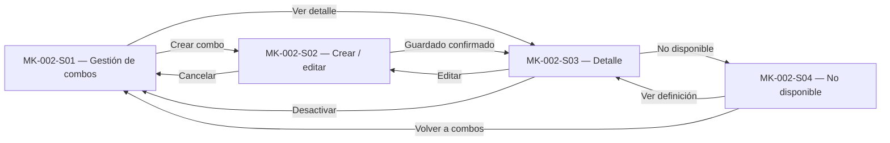

# Component Spec — MK-002

> **Propósito y rol documental:**  
> Este documento es la especificación principal del resultado esperado del mockup de MK-002.
>
> Subordinado a las fuentes de verdad (SPEC, HU, WF, FLOW, API Contract y Design System), define qué pantallas existen, su propósito, estructura, componentes, acciones, estados, contenido, jerarquía de información, decisiones UX locales, fixtures y criterios de aceptación.
>
> Consume la UX transversal del módulo y no crea una propuesta UX paralela.
>
> Este documento especifica **qué debe existir**. El orden constructivo corresponde a `plan.md` y las unidades de ejecución a `tasks.md`.

---

## 1. Identificación

- **Mockup:** MK-002
- **Funcionalidad:** Gestión de combos de productos
- **Responsable:** Marco Renato Castilla Huanca
- **Rama funcional:** `castilla`
- **Versión:** v0.1
- **Estado:** En revisión
- **Plataforma:** Web desktop
- **Viewport canónico:** 1440 px

---

## 2. Trazabilidad

| Fuente | Referencia | Alcance consumido |
|---|---|---|
| SPEC | `specs/SPEC-002-gestion-combos-productos.md` | Composición, precio, disponibilidad, ownership de Inventario/Pricing, desactivación y límites con Checkout |
| HU | `hu/HU-002-gestion-combos-productos.md` | CA-01 a CA-11 y escenarios de creación, rechazo y no elegibilidad |
| WF | `wireframes/flows/WF-002-gestion-combos-productos.md` | Lista, crear/editar, detalle y estado no disponible |
| FLOW | `flujos/FLOW-002-gestion-combos-productos.md` | Creación/edición, consulta a Pricing/Inventario, reacción a Catálogo y límites con Ventas |
| Propuesta UX | `mockups/ux/propuesta-ux.md`, v2.0 | UX-P01 Media, UX-P02 Alta y UX-P03 Media |
| UX Decisions | `mockups/ux/ux-decisions.md`, v2.0 | UXD-002, UXD-005, UXD-006, UXD-010, UXD-011 y UXD-012 cuando corresponda |
| UX Guidelines | `mockups/ux/ux-guidelines.md`, v2.0 | UXG-003, UXG-006, UXG-011, UXG-017, UXG-018 y reglas generales de comprensión/accesibilidad |
| API Contract | `api/openapi.yaml`, OpenAPI 0.5.0 | CRUD administrativo de combos, disponibilidad, Pricing y Catálogo |
| Contrato humano | `Contrato_Api.md` | Ownership, consultas Pricing y semántica de integración |
| Design System | `mockups/DESIGN.md`, v1.0.0 | Formularios, tablas, estados, feedback y componentes DS-CXX |

### 2.1. Operaciones HTTP relevantes

MK-002 puede representar las siguientes capacidades de Combos:

```text
GET   /api/v1/combos
POST  /api/v1/combos

GET   /api/v1/combos/{comboId}
PATCH /api/v1/combos/{comboId}

POST  /api/v1/combos/{comboId}/desactivar

GET   /api/v1/combos/{comboId}/disponibilidad
```

Para resolver precios de componentes:

```text
GET /api/v1/precios?skus=...
GET /api/v1/precios/skus/{sku}
```

Pricing publica:

```text
sku
precio_regular
precio_oferta
currency
channel_id
valid_from
valid_until
price_version
vigencia_id
origen
```

Para localizar componentes vendibles se utilizan las capacidades de Catálogo:

```text
GET /api/v1/productos
GET /api/v1/productos/{productoId}
```

Conceptualmente:

```text
producto simple
→ sku_base = SKU vendible

producto con variantes
→ variants[].sku = SKU vendible
```

### 2.2. Capacidades que no deben inventarse

OpenAPI 0.5.0 no publica:

```text
POST /combos/{comboId}/reactivar
POST /combos/{comboId}/reservar
POST /combos/{comboId}/comprar
POST /combos/{comboId}/validar-precio
GET  /skus?q=...
```

Tampoco existe campo `estado` dentro de `ComboCreateRequest`.

Por tanto:

- no incorporar switch Activo/Inactivo en creación;
- no incorporar `Reactivar`;
- no incorporar reserva de stock;
- no incorporar Checkout;
- no incorporar cupón/promoción;
- no inventar una búsqueda global de SKU;
- no inventar un endpoint de prevalidación del combo.

---

## 3. Objetivo funcional

- **Usuario:** Gestor comercial.
- **Objetivo:** crear, editar, consultar y desactivar combos compuestos por SKUs vendibles directos que cumplan reglas estructurales y de ventaja económica.
- **Contexto:** configuración administrativa de ofertas agrupadas sin transferir ownership de precios, stock, reservas o cupones a Combos.
- **Resultado exitoso:** el gestor puede seleccionar al menos dos SKUs distintos, definir sus cantidades, comprobar la ventaja económica del precio propuesto, guardar una configuración válida y consultar posteriormente estado y disponibilidad estimada.

---

## 4. Alcance

### Incluido

- Listado administrativo de combos.
- Paginación.
- Filtro por estado.
- Creación.
- Edición de:
  - nombre;
  - descripción;
  - componentes;
  - cantidades;
  - precio.
- Selección de al menos dos SKUs vendibles directos.
- Selección de SKU mediante Catálogo:
  - producto simple → `sku_base`;
  - producto con variantes → variante/SKU comercialmente activa.
- Prevención de componentes duplicados.
- Prohibición de combos anidados.
- Consulta de precios vigentes.
- Comparación entre:
  - precio del combo;
  - suma regular;
  - suma pública vigente.
- Consulta de disponibilidad informativa.
- Distinción entre:
  - estado administrativo;
  - disponibilidad positiva;
  - agotamiento;
  - información desactualizada;
  - información incompleta/no verificable.
- Detalle administrativo.
- Edición con control de versión.
- Tratamiento de `VERSION_CONFLICT`.
- Desactivación explícita.
- Estado no disponible/no comprable.
- Conservación de entradas ante errores.

### Fuera de alcance

- Checkout.
- Carrito.
- Pedido.
- Pago.
- Reserva de inventario.
- Consumo de stock.
- Liberación de reserva.
- Validación/consumo/restitución de cupones.
- Aplicación de promociones.
- Edición de precios maestros.
- Edición de stock.
- Creación de productos/SKUs.
- Stock propio del combo.
- Garantía futura de disponibilidad.
- Combos anidados.
- Reactivación de combos mientras no exista operación contractual.
- Mobile/tablet.

---

## 5. Inventario de pantallas

| ID | Pantalla | Propósito | Entrada | Acción principal | Salida | Prioridad | Ruta |
|---|---|---|---|---|---|---|---|
| MK-002-S01 | Gestión de combos | Consultar combos y acceder a operaciones administrativas | Navegación | Crear combo / Ver detalle | S02 / S03 | P0 | `/MK002/S01` |
| MK-002-S02 | Crear o editar combo | Configurar componentes, cantidades y precio | S01 o S03 | Guardar | S03 | P0 | `/MK002/S02` |
| MK-002-S03 | Detalle del combo | Consultar definición, estado, precio y disponibilidad | S01 o guardado de S02 | Editar / Desactivar | S02 / S01 | P0 | `/MK002/S03` |
| MK-002-S04 | Combo no disponible | Representar indisponibilidad sin borrar definición administrativa | S01 / S03 | Volver | S03 / S01 | P0 | `/MK002/S04` |

### Modos de S02

S02 reutiliza una misma estructura:

```text
crear
editar
```

Puede reproducirse mediante un mecanismo equivalente a:

```text
/MK002/S02?modo=crear
/MK002/S02?modo=editar
```

La sintaxis concreta pertenece a la implementación.

---

## 6. Relación entre pantallas



MK-002 no navega hacia Checkout, Ventas o Inventario para realizar mutaciones.

---

## 7. Jerarquía de información

### Primaria

- Nombre.
- Estado administrativo.
- Precio del combo.
- Componentes SKU.
- Cantidades.
- Cumplimiento de la regla económica.
- Disponibilidad estimada.
- Acción principal.

### Secundaria

- Descripción.
- Suma regular.
- Suma pública vigente.
- Diferencia económica.
- Fecha de cálculo de disponibilidad.
- Calidad/frescura de disponibilidad.
- Número de componentes.
- Contexto de conflicto cuando corresponda.

### Complementaria

- Nota de disponibilidad informativa.
- Mensajes de recuperación.
- Identificadores técnicos únicamente para soporte cuando aporten valor.

---

## 8. Componentes compartidos

| Componente | Pantallas | Uso | Variante | Estados |
|---|---|---|---|---|
| DS-C01 `PO/Button` | S01-S04 | Crear, guardar, editar, volver, desactivar | primary / secondary / tertiary / destructive | default, focus, disabled, loading |
| DS-C02 `PO/ActionIcon` | S01-S03 | Acciones compactas cuando correspondan | estándar | default, focus |
| DS-C03 `PO/TextInput` | S02 | Nombre | md | default, filled, error |
| DS-C04 `PO/NumberInput` | S02 | Cantidad y precio | md | default, filled, error |
| DS-C05 `PO/Textarea` | S02 | Descripción | md | default, filled, error |
| DS-C06 `PO/Select` | S02 | Selección cuando corresponda | searchable | loading, default, error |
| DS-C12 `PO/Search` | S02 | Buscar productos candidatos | estándar | loading, empty, error |
| DS-C13 `PO/FilterBar` | S01 | Estado | compacto | default, applied |
| DS-C14 `PO/Badge` | S01-S04 | Estado administrativo/informativo | neutral, success, warning, error | — |
| DS-C17 `PO/Table` | S01-S03 | Listado y componentes | default | loading, empty, error |
| DS-C18 `PO/Pagination` | S01 | Página de combos | default | — |
| DS-C19 `PO/Card` | S02-S04 | Resúmenes | flat | default |
| DS-C21 `PO/Modal` | S03 | Confirmación de desactivación | confirmación | open/focus |
| DS-C22 `PO/Alert / PO/Result` | S02-S04 | Validaciones, conflicto e indisponibilidad | info, success, warning, error | persistente según criticidad |
| DS-C24 `PO/Skeleton / PO/Loader` | S01-S03 | Lecturas/guardado | localizado | loading |
| DS-C25 `PO/EmptyState` | S01-S02 | Sin combos/candidatos | default | empty |
| DS-C28 `PO/Breadcrumbs` | S01-S04 | Jerarquía | estándar | focus |

### Regla de uso

La existencia de un componente en el Design System no obliga a usarlo.

MK-002 no introduce por conveniencia:

- wizard;
- Stepper;
- switch de estado;
- selección masiva;
- tabs sin necesidad funcional.

---

## 9. Componentes específicos

### MK-002-C01 — Selector de componentes SKU

**Propósito**  
Seleccionar SKUs vendibles directos y establecer cantidad requerida.

**Pantalla**
- MK-002-S02.

### Resolución canónica

La búsqueda parte de Catálogo:

```text
GET /api/v1/productos?q=...&estado=ACTIVO
```

Para producto simple:

```text
tiene_variantes = false
→ usar sku_base
```

Para producto con variantes:

```text
tiene_variantes = true
→ GET /api/v1/productos/{productoId}
→ seleccionar variants[].sku
```

No se inventa un `GET /skus`.

### Contenido

- producto;
- SKU vendible;
- atributos identificadores si corresponden;
- cantidad;
- precio regular;
- precio público vigente;
- disponibilidad informativa cuando exista;
- acción de quitar.

### Propiedades

| Propiedad | Tipo | Obligatoria | Regla |
|---|---|---:|---|
| sku | Texto | Sí | SKU vendible directo |
| cantidad | Entero | Sí | `>= 1` |
| precioRegular | Número | Para comparación | Fuente Pricing |
| precioPublicoVigente | Número | Para comparación | Fuente Pricing |
| disponibilidad | Número/null | No | Informativa |
| estado | Estado | Cuando sea verificable | No inferir causas |

### Reglas

- mínimo 2 SKUs;
- sin duplicados;
- cantidad >= 1;
- no permitir combo como componente;
- no seleccionar automáticamente una variante;
- un producto con variantes exige selección explícita de SKU;
- no editar Pricing/Inventario.

### Estados

| Estado | Representación |
|---|---|
| Sin componentes | EmptyState instructivo |
| Un componente | “Agrega al menos un componente más” |
| Dos o más válidos | Tabla/lista |
| SKU duplicado | Error localizado |
| Producto/SKU no válido | No permitir selección |
| Producto con variantes | Solicitar elección explícita de variante/SKU |
| Consulta en curso | Loader localizado |
| Consulta fallida | Conservar selección previa |

---

### MK-002-C02 — Comparador económico

**Propósito**  
Mostrar si el precio propuesto mantiene ventaja frente a comprar los componentes por separado.

**Pantallas**
- S02.
- Resumen informativo en S03.

### Referencias

Mostrar:

```text
Suma regular
Suma pública vigente
Precio del combo
```

### Suma regular

```text
sumaRegular
=
Σ(precio_regular_i × cantidad_i)
```

### Precio público vigente

Para MK-002 se adopta la siguiente regla operativa:

```text
precioPublicoVigente_i
=
precio_oferta_i
si existe una oferta efectiva vigente

en caso contrario
=
precio_regular_i
```

La consulta se realiza para el instante vigente.

MK-002 no utiliza `at` histórico.

### Alcance Pricing adoptado

Mientras la documentación contractual superior no especifique otro contexto, MK-002 consume el **precio efectivo vigente de alcance global**:

```text
canal omitido
→ channel_id efectivo = null
```

Por tanto:

```text
sumaPublicaVigente
=
Σ(precioPublicoVigente_i × cantidad_i)
```

### Regla económica

Debe cumplirse:

```text
precioCombo > 0

precioCombo < sumaRegular

precioCombo < sumaPublicaVigente
```

### Autoridad de validación

El comparador del mockup es feedback preventivo.

La validación definitiva corresponde a `combos-svc`.

No mostrar:

```text
Precio aprobado definitivamente
```

antes de que el servidor confirme creación/actualización.

### Estados

| Estado | Representación |
|---|---|
| Datos insuficientes | Comparación no disponible |
| Consultando Pricing | Loader localizado |
| Cumple | Confirmación textual |
| No cumple | Error junto al precio |
| Pricing no disponible | Comparación no verificable |
| Falta precio aplicable | No afirmar cumplimiento |

### Copy de éxito

```text
El precio propuesto es menor que ambas referencias actuales.
```

### Copy de rechazo

```text
El precio del combo debe ser menor que la suma regular y que la suma pública vigente de sus componentes.
```

`COMBO_PRECIO_INVALIDO` queda como referencia técnica secundaria.

---

### MK-002-C03 — Disponibilidad informativa

**Propósito**  
Mostrar disponibilidad estimada sin confundirla con reserva o garantía.

**Fuente**

```text
comboId
verificable
cantidadInformativa
calculated_at
estadoActualizacion
```

Estados contractuales relevantes:

```text
ACTUALIZADA
DESACTUALIZADA
INCOMPLETA
```

### Presentación

| Condición | Representación |
|---|---|
| verificable + cantidad > 0 + ACTUALIZADA | `Disponibilidad estimada: N combos` |
| verificable + cantidad = 0 | `Agotado actualmente` |
| DESACTUALIZADA | `Disponibilidad desactualizada` |
| INCOMPLETA | `Disponibilidad incompleta` |
| verificable = false | `Disponibilidad no verificable` |
| cantidad = null | No convertir a cero |
| Error HTTP | `Disponibilidad no disponible` |

### Nota visible

```text
La disponibilidad es una estimación. Las existencias se verifican y reservan durante el pedido.
```

No usar:

```text
Stock reservado
Stock garantizado
N combos almacenados
```

---

### MK-002-C04 — Tabla de componentes

**Propósito**  
Revisar composición y referencias comerciales.

**Pantallas**
- S02.
- S03.

### Columnas

- SKU.
- Producto / variante.
- Cantidad.
- Precio regular.
- Precio público vigente.
- Disponibilidad informativa cuando corresponda.
- Quitar, únicamente en edición.

### Reglas

- moneda proveniente de Pricing;
- precios alineados numéricamente;
- SKU como identidad comercial;
- no mostrar `variant_id` como sustituto de SKU;
- sin acciones de modificar Pricing o Inventario.

---

## 10. Especificación por pantalla

### MK-002-S01 — Gestión de combos

**Propósito**  
Consultar combos y acceder a creación/detalle/edición/desactivación.

### Estructura

1. Breadcrumbs.
2. H1 `Gestión de combos`.
3. Contexto breve.
4. CTA `Crear combo`.
5. Filtro por estado.
6. Tabla.
7. Paginación.
8. Estados loading/empty/error.

### Tabla

| Columna | Fuente |
|---|---|
| Combo | `Combo.name` |
| Precio | `Combo.price` |
| Componentes | `Combo.components.length` |
| Disponibilidad | informativa |
| Estado | `Combo.status` |
| Acciones | capacidad administrativa |

### Acciones

- Ver detalle.
- Editar.
- Desactivar cuando corresponda.

No mostrar:

```text
Reactivar
Reservar
Comprar
Aplicar cupón
```

### Filtro

Estados contractuales:

```text
ACTIVO
INACTIVO
```

No inventar búsqueda de combos si el contrato no la publica.

---

### MK-002-S02 — Crear o editar combo

**Propósito**  
Configurar la definición administrativa.

### Estructura

1. Breadcrumbs.
2. H1.
3. Datos generales.
4. Búsqueda/selección de producto.
5. Selección explícita de SKU cuando existan variantes.
6. Tabla de componentes.
7. Precio del combo.
8. Comparador económico.
9. Disponibilidad informativa complementaria.
10. Feedback.
11. Acciones.

### H1

Crear:

```text
Crear combo
```

Editar:

```text
Editar combo
```

### Datos generales

- Nombre.
- Descripción.

### Componentes

Cada componente contiene:

```text
sku
quantity
```

Restricciones:

- mínimo 2;
- SKU distintos;
- cantidad >= 1;
- sin anidamiento.

### Precio

Campo:

```text
Precio del combo
```

Restricción inicial:

```text
> 0
```

Comparación:

```text
precioCombo < sumaRegular
precioCombo < sumaPublicaVigente
```

### No mostrar

- estado editable;
- precio regular editable;
- oferta del SKU editable;
- canal;
- fecha histórica;
- inventario editable;
- promociones;
- cupones.

### Acciones

Crear:

```text
Crear combo
```

Editar:

```text
Guardar cambios
```

Secundaria:

```text
Cancelar
```

### Estados

- create-empty;
- un componente;
- composición válida;
- duplicado;
- SKU no válido;
- Pricing loading;
- Pricing unavailable;
- precio válido;
- precio inválido;
- saving;
- server error;
- `VERSION_CONFLICT`;
- success.

### `COMBO_PRECIO_INVALIDO`

Mantener todos los datos ingresados.

No limpiar:

- nombre;
- descripción;
- componentes;
- cantidades;
- precio.

### `VERSION_CONFLICT`

Mostrar:

```text
Este combo cambió desde que comenzaste a editarlo.
Revisa la versión actual antes de volver a guardar tus cambios.
```

Acción:

```text
Consultar versión actual
```

No sobrescribir automáticamente.

---

### MK-002-S03 — Detalle del combo

**Propósito**  
Consultar la definición vigente y sus datos informativos.

### Estructura

1. Breadcrumbs.
2. Nombre.
3. Badge estado.
4. Descripción.
5. Precio del combo.
6. Comparación económica.
7. Componentes.
8. Disponibilidad.
9. Nota informativa.
10. Acciones.

### Comparación

Cuando estén disponibles las lecturas actuales de Pricing:

```text
Precio del combo
Suma regular
Suma pública vigente
```

Estas referencias son informativas y pueden cambiar posteriormente junto con los precios de los componentes.

### Acciones ACTIVO

```text
Editar
Desactivar
```

### Acciones INACTIVO

```text
Editar
```

No mostrar `Reactivar`.

### Desactivación

Utilizar confirmación antes de:

```text
POST /api/v1/combos/{comboId}/desactivar
```

La confirmación explica:

- combo afectado;
- que dejará de ofrecerse;
- que su definición se conserva.

Respuesta `200` implica estado confirmado.

No introducir estado pendiente ficticio.

---

### MK-002-S04 — Combo no disponible

**Propósito**  
Expresar indisponibilidad comercial sin eliminar definición administrativa.

### Caso A — Agotado

Si:

```text
verificable = true
cantidadInformativa = 0
```

mostrar:

```text
Agotado actualmente

La disponibilidad estimada del combo es 0.
Su configuración administrativa se conserva.
```

No cambiar automáticamente a INACTIVO.

### Caso B — Combo INACTIVO

Mostrar:

```text
No disponible para nuevas ventas
```

No afirmar la causa exacta.

### Caso C — Disponibilidad incompleta/no verificable

Mostrar:

```text
No se puede confirmar la disponibilidad actual.
```

Nunca:

```text
null → 0
```

### Límite contractual sobre la causa

Aunque SPEC/FLOW establecen que desactivar un producto/SKU componente inhabilita el combo para nuevas ventas, el contrato HTTP actual de `Combo` no publica:

```text
eligibility_reason
disabled_sku
disabled_product_id
status_reason
```

Los eventos AsyncAPI de desactivación también utilizan actualmente `GenericData`.

Por tanto, MK-002 no afirma qué componente concreto causó la indisponibilidad.

Puede decir:

```text
Este combo no está disponible para nuevas ventas.
```

No:

```text
El SKU ABC-123 fue desactivado.
```

sin una fuente contractual futura que lo confirme.

---

## 11. Decisiones UX locales

### LUX-01 — Crear/editar en vista completa

**Problema**  
La tarea combina información general, selección de productos/SKUs, cantidades y comparación económica.

**Alternativas**

- Modal/drawer.
- Vista completa.

**Decisión**

Vista completa.

**Justificación**

Permite comparar componentes y referencias de precio sin ocultar errores o contexto.

---

### LUX-02 — Comparación económica persistente

**Problema**  
El gestor necesita comprender la ventaja económica antes de enviar, pero la validación definitiva corresponde al backend.

**Decisión**

Mostrar permanentemente:

```text
Suma regular
Suma pública vigente
Precio del combo
```

### Regla de resolución utilizada por MK-002

```text
consulta vigente
+
alcance global de Pricing
+
precio_oferta si existe
+
fallback a precio_regular
```

No mostrar una comparación positiva si Pricing no pudo resolver todos los componentes.

---

### LUX-03 — Estado administrativo separado de disponibilidad

Siempre representar independientemente:

```text
Estado administrativo
Disponibilidad estimada
```

Ejemplo:

```text
Estado: Activo
Disponibilidad estimada: 0
Agotado actualmente
```

Stock cero no transforma automáticamente el estado administrativo.

---

### LUX-04 — Confirmación de desactivación

**Problema**  
Desactivar impide nuevas ventas y OpenAPI actual no publica una reactivación.

**Decisión**

Solicitar confirmación explícita.

**Contenido**

- nombre del combo;
- consecuencia;
- Cancelar;
- Desactivar combo.

---

### LUX-05 — Selección producto → SKU

**Problema**  
El contrato no ofrece búsqueda global de SKU, y un producto puede representar uno o varios SKU vendibles.

**Decisión**

Resolver componentes en dos niveles:

```text
buscar producto
↓
resolver SKU vendible
```

Producto simple:

```text
sku_base
```

Producto con variantes:

```text
selección explícita de variants[].sku
```

**Justificación**

Evita inventar endpoints y evita seleccionar automáticamente una variante arbitraria.

---

## 12. Reglas de layout PC

- Web desktop.
- Viewport canónico 1440 px.
- 900 px de altura como referencia de revisión.
- Scroll vertical permitido.
- Sin mobile/tablet.
- Shell de `DESIGN.md`.
- Oswald para H1-H3.
- Inter para operación, tablas y controles.
- Cards sin sombras decorativas.
- Inputs estándar de 40 px.
- Tabla con filas mínimas de 48 px.
- Valores monetarios alineados a la derecha.
- Cifras tabulares.
- SKU tratado como identidad textual.
- Comparación económica comprensible sin color.
- Sin overflow horizontal de página.
- Foco visible.
- Modal devuelve foco al activador.

---

## 13. Fixtures

Todos los datos son deterministas y ficticios.

| Fixture | Caso | Pantalla/estado |
|---|---|---|
| `list-default` | Lista normal | S01 |
| `list-empty` | Sin combos | S01 |
| `list-loading` | Loading | S01 |
| `list-error` | Error | S01 |
| `create-empty` | Crear vacío | S02 |
| `create-simple-product` | Producto simple seleccionado | S02 |
| `create-variant-product` | Producto con variantes | S02 |
| `create-variant-selected` | SKU de variante elegido | S02 |
| `create-one-component` | 1 SKU | S02 |
| `create-valid-two-components` | 2 SKU distintos | S02 |
| `create-duplicate` | SKU duplicado | S02 |
| `create-price-valid` | Cumple ambas referencias | S02 |
| `create-price-invalid-regular` | Falla suma regular | S02 |
| `create-price-invalid-public` | Falla suma pública | S02 |
| `create-pricing-unavailable` | Pricing no disponible | S02 |
| `create-server-price-rejected` | `COMBO_PRECIO_INVALIDO` | S02 |
| `edit-default` | Edición normal | S02 |
| `edit-version-conflict` | Conflicto de versión | S02 |
| `detail-active` | Activo disponible | S03 |
| `detail-active-zero` | Activo agotado | S03 |
| `detail-stale` | Disponibilidad desactualizada | S03 |
| `detail-incomplete` | Disponibilidad incompleta | S03 |
| `detail-unverifiable` | No verificable | S03 |
| `detail-inactive` | Inactivo | S03 |
| `deactivate-confirm` | Confirmación | S03 |
| `unavailable-zero-stock` | Agotado | S04 |
| `unavailable-inactive` | Inactivo genérico | S04 |
| `unavailable-unknown` | Disponibilidad desconocida | S04 |

### Fixture económico

```text
SKU: CAM-NEG-M
Cantidad: 1
Precio regular: PEN 100
Precio oferta vigente global: PEN 90

SKU: PAN-GRI-32
Cantidad: 1
Precio regular: PEN 80
Precio oferta vigente global: PEN 75

Suma regular: PEN 180
Suma pública vigente: PEN 165
Precio del combo: PEN 150

Resultado:
Cumple ambas comparaciones.
```

Los números son exclusivamente demostrativos.

---

## 14. Preguntas, decisiones derivadas y supuestos

### Preguntas abiertas

No existen preguntas abiertas bloqueantes para la construcción de MK-002.

### Decisiones derivadas de las fuentes vigentes

| ID | Decisión |
|---|---|
| D-01 | La suma regular utiliza `Σ(precio_regular × cantidad)`. |
| D-02 | La referencia pública vigente utiliza `precio_oferta` cuando existe una oferta efectiva vigente; en caso contrario utiliza `precio_regular`. |
| D-03 | La comparación utiliza el instante vigente. MK-002 no utiliza consulta histórica mediante `at`. |
| D-04 | La causa concreta de no elegibilidad no se muestra mientras `Combo` no publique dicha información. |
| D-05 | Los componentes se resuelven desde Catálogo mediante producto → SKU vendible. |
| D-06 | Producto simple utiliza `sku_base`; producto con variantes requiere selección explícita de `variants[].sku`. |
| D-07 | No existe búsqueda contractual global de SKU, por lo que MK-002 no inventa `/skus`. |

### Supuestos adoptados

| ID | Supuesto | Riesgo | Condición de revisión |
|---|---|---|---|
| A-01 | OpenAPI 0.5.0 es la fuente HTTP vigente. | Cambio contractual. | Nueva versión OpenAPI. |
| A-02 | S02 reutiliza estructura para crear/editar. | Divergencia futura. | Cambio WF/FLOW. |
| A-03 | S04 conserva ruta propia porque WF la define como pantalla. | Código puede compartir composición con S03. | Cambio WF. |
| A-04 | INACTIVO permite afirmar no disponibilidad comercial, no su causa concreta. | Mensaje genérico. | HTTP publica causa. |
| A-05 | Disponibilidad cero no equivale a INACTIVO. | Bajo. | Cambio explícito de regla. |
| A-06 | Para MK-002, la comparación económica utiliza el **precio efectivo vigente de alcance global de Pricing**, omitiendo `canal`; `channel_id = null` representa ese alcance. | La regla aún no está explicitada literalmente en SPEC-002/FLOW-002. | Formalización contractual futura. |
| A-07 | La edición conserva `version` leída para `PATCH`. | Conflicto si se pierde. | Cambio OpenAPI. |
| A-08 | No existe reactivación administrativa en OpenAPI 0.5.0. | Puede incorporarse posteriormente. | Nuevo endpoint. |

---

## 15. Criterios de aceptación

- [ ] Existen S01-S04.
- [ ] Existen rutas `/MK002/S01` a `/MK002/S04`.
- [ ] S02 reproduce crear y editar.
- [ ] La creación requiere mínimo 2 SKUs.
- [ ] Los SKUs son vendibles directos.
- [ ] Producto simple se resuelve mediante `sku_base`.
- [ ] Producto con variantes exige elección explícita de SKU.
- [ ] No existe `/skus` ficticio.
- [ ] No se permiten duplicados.
- [ ] No se permiten combos anidados.
- [ ] Cantidad >= 1.
- [ ] El formulario no tiene switch Activo/Inactivo.
- [ ] No existe Reactivar.
- [ ] Precio combo > 0.
- [ ] Se muestran suma regular y suma pública vigente.
- [ ] Suma regular utiliza `precio_regular × cantidad`.
- [ ] Referencia pública utiliza oferta vigente cuando exista y regular en caso contrario.
- [ ] MK-002 utiliza consulta vigente, no histórica.
- [ ] Para MK-002 se representa alcance global de Pricing.
- [ ] Precio combo debe ser menor que ambas referencias.
- [ ] La comparación visual no sustituye validación backend.
- [ ] `COMBO_PRECIO_INVALIDO` conserva datos.
- [ ] `VERSION_CONFLICT` conserva intención del usuario.
- [ ] Precios de componentes no se editan desde MK-002.
- [ ] Moneda proviene de Pricing.
- [ ] Combo no posee stock.
- [ ] Disponibilidad se etiqueta como estimada/informativa.
- [ ] Disponibilidad 0 no cambia `status`.
- [ ] `null` no se convierte a cero.
- [ ] ACTUALIZADA/DESACTUALIZADA/INCOMPLETA se distinguen.
- [ ] No verificable no se representa como agotado.
- [ ] No existe Reserva.
- [ ] No existe Checkout.
- [ ] No existe Cupón.
- [ ] No se exponen eventos RabbitMQ.
- [ ] Desactivar conserva definición.
- [ ] Desactivar exige confirmación.
- [ ] No se inventa el SKU causante de una indisponibilidad.
- [ ] Filtro de estado respaldado por contrato.
- [ ] No se inventa búsqueda de combos.
- [ ] Fixtures P0 deterministas.
- [ ] Componentes reutilizan `DESIGN.md`.
- [ ] No se introduce wizard innecesario.
- [ ] Layout 1440 px.
- [ ] Sin overflow horizontal de página.
- [ ] Foco visible.
- [ ] Operable por teclado.
- [ ] Estados comprensibles sin depender del color.
- [ ] Errores localizados junto a la corrección.
- [ ] Toda acción es trazable a fuentes oficiales.
