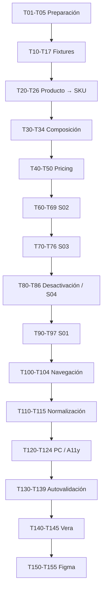

# Tasks — MK-002

> **Propósito y rol documental:**  
> Checklist de unidades de trabajo ejecutables para MK-002.
>
> Descompone `plan.md` en tareas atómicas, trazables y verificables.
>
> No redefine el contenido de las pantallas ni las decisiones UX establecidas en `component-spec.md`.

---

## 1. Identificación

- **Mockup:** MK-002
- **Funcionalidad:** Gestión de combos de productos
- **Responsable:** Marco Renato Castilla Huanca
- **Rama funcional:** `castilla`
- **Plan de referencia:** `plan.md`
- **Component Spec:** `component-spec.md`
- **Estado general:** Pendiente
- **Contrato HTTP:** OpenAPI 0.5.0
- **Design System:** `mockups/DESIGN.md` v1.0.0
- **UX transversal:** v2.0

---

## 2. Convenciones y reglas de ejecución

### Prioridades

- `P0`: obligatorio para validar MK-002.
- `P1`: necesario para cierre/refinamiento.
- `P2`: mejora no bloqueante.

### Estados de tarea

- `TODO`: pendiente.
- `DOING`: en ejecución.
- `BLOCKED`: impedida.
- `REVIEW`: completada y pendiente de verificación.
- `DONE`: verificada con evidencia.

### Regla de cierre

Una tarea solo pasa a `DONE` cuando su criterio de verificación puede comprobarse objetivamente.

### Regla de bloqueo

Si una tarea queda `BLOCKED`:

1. no inventar una solución;
2. registrar el bloqueo en §11;
3. identificar la fuente que debe resolverlo;
4. continuar únicamente tareas independientes.

### Restricciones obligatorias

Durante la ejecución:

- no inventar endpoints;
- no inventar búsqueda global de SKU;
- no añadir canal al formulario;
- no añadir estado al alta;
- no añadir Reactivar;
- no reservar stock;
- no modificar Pricing;
- no modificar Inventario;
- no introducir Checkout;
- no seleccionar automáticamente variantes;
- no convertir `null` en cero;
- no convertir agotamiento en `INACTIVO`;
- no mostrar causa de no elegibilidad sin evidencia;
- no instalar dependencias exclusivamente para MK-002;
- no modificar otros MK.

---

# 3. Preparación

## MK-002-T01 — P0 — Confirmar fuentes vigentes `[TODO]`

**Entrada**

- SPEC-002.
- HU-002.
- WF-002.
- FLOW-002.
- OpenAPI 0.5.0.
- UX 2.0.
- `DESIGN.md` 1.0.0.

**Acción**

Verificar que siguen siendo las fuentes vigentes utilizadas por el Component Spec y el Plan.

**Salida esperada**

Conjunto documental consistente.

**Verificación**

- OpenAPI continúa en 0.5.0.
- UX y Design System no han introducido cambios incompatibles.
- No existe una modificación posterior de SPEC/HU/FLOW que invalide MK-002.

---

## MK-002-T02 — P0 — Confirmar Component Spec aprobado `[TODO]`

**Entrada**

`component-spec.md`.

**Acción**

Confirmar:

- LUX-01 a LUX-05;
- A-06 conocido;
- ninguna pregunta abierta bloqueante;
- cuatro pantallas P0;
- selector producto → SKU;
- comportamiento de Pricing;
- disponibilidad separada del estado administrativo.

**Salida esperada**

```text
Estado = Aprobado
```

**Verificación**

El documento no contiene una decisión necesaria pendiente de resolución antes de implementar.

---

## MK-002-T03 — P0 — Confirmar Plan aprobado `[TODO]`

**Entrada**

`plan.md`.

**Acción**

Revisar:

- orden constructivo;
- pantalla ancla S02;
- gates;
- riesgos;
- restricciones;
- estrategia de fixtures.

**Verificación**

Plan y Component Spec no se contradicen.

---

## MK-002-T04 — P0 — Verificar baseline transversal `[TODO]`

**Entrada**

`mockups/prototipo/README.md` y código común disponible.

**Acción**

Confirmar:

- React;
- TypeScript;
- Mantine;
- Tabler Icons;
- routing;
- tema central;
- componentes compartidos.

**Salida esperada**

MK-002 puede implementarse bajo:

```text
mockups/prototipo/src/pantallas/MK002/
```

**Condición de bloqueo**

Si continuar exige crear app/router/theme propio:

```text
BLOCKED
```

---

## MK-002-T05 — P0 — Mapear componentes Design System `[TODO]`

**Acción**

Confirmar reutilización de:

- DS-C01 Button.
- DS-C02 ActionIcon.
- DS-C03 TextInput.
- DS-C04 NumberInput.
- DS-C05 Textarea.
- DS-C06 Select.
- DS-C12 Search.
- DS-C13 FilterBar.
- DS-C14 Badge.
- DS-C17 Table.
- DS-C18 Pagination.
- DS-C19 Card.
- DS-C21 Modal.
- DS-C22 Alert/Result.
- DS-C24 Skeleton/Loader.
- DS-C25 EmptyState.
- DS-C28 Breadcrumbs.

**Verificación**

No se redefine localmente un componente ya disponible.

---

# 4. Fixtures deterministas

## MK-002-T10 — P0 — Crear infraestructura de fixtures `[TODO]`

**Entrada**

Component Spec §13.

**Acción**

Crear estructura local de fixtures.

**Salida esperada**

Fixtures consumibles directamente por MK-002.

**Verificación**

- sin red;
- sin aleatoriedad;
- sin datos personales;
- importables;
- reproducibles.

---

## MK-002-T11 — P0 — Crear fixtures de listado `[TODO]`

Crear:

```text
list-default
list-empty
list-loading
list-error
```

**Verificación**

Cada estado puede inspeccionarse directamente en S01.

---

## MK-002-T12 — P0 — Crear fixtures de Catálogo `[TODO]`

Crear como mínimo:

```text
catalog-simple-product
catalog-product-with-variants
catalog-variant-selected
catalog-query-loading
catalog-query-empty
catalog-query-error
```

**Verificación**

Representan únicamente capacidades compatibles con Catálogo.

---

## MK-002-T13 — P0 — Crear fixtures de creación `[TODO]`

Crear:

```text
create-empty
create-simple-product
create-variant-product
create-variant-selected
create-one-component
create-valid-two-components
create-duplicate
```

**Verificación**

- producto simple usa `sku_base`;
- producto con variantes exige selección;
- duplicado usa exactamente el mismo SKU.

---

## MK-002-T14 — P0 — Crear fixtures económicos `[TODO]`

Crear:

```text
create-price-valid
create-price-invalid-regular
create-price-invalid-public
create-pricing-unavailable
create-server-price-rejected
```

**Verificación**

Los fixtures respetan:

```text
precioPublico =
precio_oferta ?? precio_regular
```

bajo el alcance global de A-06.

---

## MK-002-T15 — P0 — Crear fixtures de edición `[TODO]`

Crear:

```text
edit-default
edit-version-conflict
```

**Verificación**

`edit-version-conflict` conserva:

- versión leída;
- versión actual distinta;
- propuesta local del usuario.

---

## MK-002-T16 — P0 — Crear fixtures de detalle/disponibilidad `[TODO]`

Crear:

```text
detail-active
detail-active-zero
detail-stale
detail-incomplete
detail-unverifiable
detail-inactive
deactivate-confirm
unavailable-zero-stock
unavailable-inactive
unavailable-unknown
```

**Verificación**

Cero, null, inactivo y consulta fallida son estados distintos.

---

## MK-002-T17 — P0 — Auditar fixtures contra OpenAPI `[TODO]`

**Entrada**

Todos los fixtures y `api/openapi.yaml`.

**Acción**

Validar:

- enums;
- propiedades;
- nullabilidad;
- versión;
- estados;
- tipos.

**Verificación**

Ningún fixture requiere un campo backend inventado.

---

# 5. Resolución producto → SKU

## MK-002-T20 — P0 — Implementar búsqueda de productos `[TODO]`

**Entrada**

```text
GET /api/v1/productos?q=...&estado=ACTIVO
```

**Acción**

Construir búsqueda mediante `PO/Search`.

**Salida esperada**

Resultados de productos candidatos.

**Verificación**

No se invoca ni representa:

```text
GET /api/v1/skus
```

---

## MK-002-T21 — P0 — Resolver producto simple `[TODO]`

**Entrada**

Fixture `create-simple-product`.

**Acción**

Cuando:

```text
tiene_variantes = false
```

resolver:

```text
sku_base
```

como SKU vendible.

**Verificación**

El componente añadido usa `sku_base`, no `product_id`.

---

## MK-002-T22 — P0 — Resolver producto con variantes `[TODO]`

**Entrada**

Fixture `create-variant-product`.

**Acción**

Cuando:

```text
tiene_variantes = true
```

consultar conceptualmente:

```text
GET /api/v1/productos/{productoId}
```

y presentar `variants[]`.

**Verificación**

El producto padre no se añade directamente al combo.

---

## MK-002-T23 — P0 — Implementar selección explícita de variante `[TODO]`

**Entrada**

`variants[].sku`.

**Acción**

Permitir elegir explícitamente un SKU.

**Salida esperada**

SKU seleccionado añadido al formulario.

**Verificación**

No existe auto-selección de primera variante.

---

## MK-002-T24 — P0 — Evitar uso de `variant_id` como SKU `[TODO]`

**Acción**

Inspeccionar props, columnas, fixtures y formularios.

**Verificación**

La identidad comercial visible/guardada es:

```text
sku
```

Nunca:

```text
variant_id
```

---

## MK-002-T25 — P0 — Implementar prevención de duplicados `[TODO]`

**Entrada**

`create-duplicate`.

**Acción**

Detectar SKU ya existente en la composición.

**Salida esperada**

Error localizado:

```text
Este SKU ya forma parte del combo.
```

**Verificación**

No se añade una segunda fila para el mismo SKU.

---

## MK-002-T26 — P0 — Implementar fallo de Catálogo `[TODO]`

**Entrada**

`catalog-query-error`.

**Acción**

Mostrar error localizado en el selector.

**Verificación**

Los componentes ya añadidos permanecen intactos.

---

# 6. Composición y cantidades

## MK-002-T30 — P0 — Implementar MK-002-C01 `[TODO]`

**Entrada**

Component Spec §9.

**Acción**

Construir selector/composición con:

- SKU;
- identificación comercial;
- cantidad;
- quitar.

**Salida esperada**

Composición editable.

**Verificación**

Cumple todas las reglas del Component Spec.

---

## MK-002-T31 — P0 — Implementar mínimo dos componentes `[TODO]`

**Entrada**

`create-one-component`.

**Salida esperada**

Mensaje:

```text
Agrega al menos un componente más.
```

**Verificación**

No permite guardar como configuración válida.

---

## MK-002-T32 — P0 — Implementar cantidad válida `[TODO]`

**Acción**

Usar `NumberInput`.

Regla:

```text
cantidad >= 1
cantidad entera
```

**Verificación**

0, negativo o decimal inválido muestran error localizado.

---

## MK-002-T33 — P0 — Implementar quitar componente `[TODO]`

**Acción**

Eliminar una fila explícitamente.

**Verificación**

- solo se elimina el SKU solicitado;
- foco permanece en un lugar predecible;
- comparación económica se recalcula.

---

## MK-002-T34 — P0 — Auditar ausencia de combos anidados `[TODO]`

**Acción**

Revisar datos y selector.

**Verificación**

No existe una opción que permita incorporar otro combo como componente.

---

# 7. Pricing y comparación económica

## MK-002-T40 — P0 — Implementar lectura conceptual de Pricing `[TODO]`

**Entrada**

```text
GET /api/v1/precios?skus=...
```

**Acción**

Preparar para cada SKU:

```text
precio_regular
precio_oferta
currency
channel_id
```

**Verificación**

No se modifica Pricing.

---

## MK-002-T41 — P0 — Aplicar alcance global de A-06 `[TODO]`

**Acción**

Representar Pricing vigente sin canal solicitado.

**Salida esperada**

Contexto:

```text
canal omitido
alcance global
```

**Verificación**

No existe selector de canal en S02.

---

## MK-002-T42 — P0 — Implementar cálculo de suma regular `[TODO]`

**Acción**

Calcular:

```text
Σ(precio_regular × cantidad)
```

**Verificación**

Cambiar una cantidad actualiza la suma.

---

## MK-002-T43 — P0 — Implementar precio público vigente `[TODO]`

**Acción**

Resolver:

```text
precioPublico =
precio_oferta vigente
si existe

en caso contrario
precio_regular
```

**Verificación**

Caso con y sin oferta cubiertos por fixtures.

---

## MK-002-T44 — P0 — Implementar suma pública vigente `[TODO]`

Calcular:

```text
Σ(precioPublico × cantidad)
```

**Verificación**

Resultado coincide con fixtures documentados.

---

## MK-002-T45 — P0 — Centralizar resolución económica `[TODO]`

**Acción**

Crear una única utilidad/composición local para:

- precio público;
- suma regular;
- suma pública;
- resultado comparativo.

**Verificación**

La regla no aparece duplicada en S02 y S03.

---

## MK-002-T46 — P0 — Implementar MK-002-C02 `[TODO]`

Mostrar:

```text
Suma regular
Suma pública vigente
Precio del combo
```

**Verificación**

Las tres referencias son visibles simultáneamente.

---

## MK-002-T47 — P0 — Implementar precio válido `[TODO]`

**Entrada**

`create-price-valid`.

**Verificación**

Cumple:

```text
precioCombo > 0
precioCombo < sumaRegular
precioCombo < sumaPublicaVigente
```

y muestra feedback preventivo positivo.

---

## MK-002-T48 — P0 — Implementar rechazo contra suma regular `[TODO]`

**Entrada**

`create-price-invalid-regular`.

**Verificación**

Error localizado junto a precio/comparador.

---

## MK-002-T49 — P0 — Implementar rechazo contra suma pública `[TODO]`

**Entrada**

`create-price-invalid-public`.

**Verificación**

Aunque el precio sea menor a la suma regular, no se considera válido si no es menor a la pública.

---

## MK-002-T50 — P0 — Implementar Pricing no disponible `[TODO]`

**Entrada**

`create-pricing-unavailable`.

**Salida esperada**

Alert localizada.

**Verificación**

No mostrar:

```text
Suma pública = 0
```

ni afirmar cumplimiento.

---

# 8. Pantalla ancla S02 — Crear/editar

## MK-002-T60 — P0 — Implementar estructura S02 `[TODO]`

**Salida esperada**

Ruta:

```text
/MK002/S02
```

directamente accesible.

**Verificación**

Contiene todas las zonas definidas en Component Spec.

---

## MK-002-T61 — P0 — Implementar modo crear `[TODO]`

**Entrada**

`create-empty`.

**Acción**

Implementar:

- nombre;
- descripción;
- componentes;
- precio;
- comparador;
- acciones.

**Verificación**

No contiene:

- estado;
- canal;
- vigencia;
- cupón;
- promoción;
- stock editable.

---

## MK-002-T62 — P0 — Implementar creación válida `[TODO]`

**Entrada**

`create-valid-two-components` + `create-price-valid`.

**Salida esperada**

CTA:

```text
Crear combo
```

habilitable.

**Verificación**

La configuración cumple las reglas visibles.

---

## MK-002-T63 — P0 — Implementar guardando `[TODO]`

**Acción**

Mostrar loader localizado en CTA/sección.

**Verificación**

El formulario permanece visible.

---

## MK-002-T64 — P0 — Implementar `COMBO_PRECIO_INVALIDO` `[TODO]`

**Entrada**

`create-server-price-rejected`.

**Acción**

Mostrar error persistente en sección de precio.

**Verificación**

Se conservan:

- nombre;
- descripción;
- componentes;
- cantidades;
- precio propuesto.

---

## MK-002-T65 — P0 — Implementar error general de creación `[TODO]`

**Acción**

Mostrar feedback accionable sin resetear formulario.

**Verificación**

No se transforma automáticamente en éxito ni se vacía el estado.

---

## MK-002-T66 — P0 — Implementar modo editar `[TODO]`

**Entrada**

`edit-default`.

**Salida esperada**

Formulario precargado.

**Verificación**

`version` permanece asociada a la edición.

---

## MK-002-T67 — P0 — Implementar `VERSION_CONFLICT` `[TODO]`

**Entrada**

`edit-version-conflict`.

**Salida esperada**

Mensaje:

```text
Este combo cambió desde que comenzaste a editarlo.
Revisa la versión actual antes de volver a guardar tus cambios.
```

**Verificación**

La propuesta local continúa visible.

---

## MK-002-T68 — P0 — Implementar consulta de versión actual `[TODO]`

**Entrada**

```text
GET /api/v1/combos/{comboId}
```

**Acción**

Representar acción:

```text
Consultar versión actual
```

**Verificación**

No ejecuta automáticamente un segundo PATCH.

---

## MK-002-T69 — P0 — Auditar ausencia de sobrescritura forzada `[TODO]`

**Verificación**

No existe:

```text
Forzar guardado
Sobrescribir versión
Ignorar conflicto
```

sin respaldo contractual.

---

# 9. S03 — Detalle del combo

## MK-002-T70 — P0 — Implementar estructura S03 `[TODO]`

**Salida esperada**

```text
/MK002/S03
```

directamente accesible.

---

## MK-002-T71 — P0 — Implementar detalle activo `[TODO]`

**Entrada**

`detail-active`.

**Verificación**

Muestra:

- nombre;
- estado ACTIVO;
- precio;
- componentes;
- referencias económicas;
- disponibilidad.

---

## MK-002-T72 — P0 — Implementar activo agotado `[TODO]`

**Entrada**

`detail-active-zero`.

**Salida esperada**

```text
Estado: Activo
Disponibilidad estimada: 0
Agotado actualmente
```

**Verificación**

No cambia el estado a INACTIVO.

---

## MK-002-T73 — P0 — Implementar disponibilidad desactualizada `[TODO]`

**Entrada**

`detail-stale`.

**Salida esperada**

```text
Disponibilidad desactualizada
```

**Verificación**

Se mantiene la fecha disponible sin afirmar actualidad.

---

## MK-002-T74 — P0 — Implementar disponibilidad incompleta `[TODO]`

**Entrada**

`detail-incomplete`.

**Verificación**

No se muestra una cantidad inventada.

---

## MK-002-T75 — P0 — Implementar no verificable `[TODO]`

**Entrada**

`detail-unverifiable`.

**Verificación**

`null` no se convierte a cero.

---

## MK-002-T76 — P0 — Implementar detalle inactivo `[TODO]`

**Entrada**

`detail-inactive`.

**Salida esperada**

Badge INACTIVO.

**Verificación**

No aparece Reactivar.

---

# 10. Desactivación y S04

## MK-002-T80 — P0 — Implementar modal de desactivación `[TODO]`

**Entrada**

`deactivate-confirm`.

**Acción**

Mostrar:

- nombre;
- consecuencia comercial;
- conservación de configuración;
- Cancelar;
- Desactivar combo.

**Verificación**

Modal accesible y foco controlado.

---

## MK-002-T81 — P0 — Implementar desactivación síncrona `[TODO]`

**Entrada**

```text
POST /api/v1/combos/{comboId}/desactivar
```

**Verificación**

Respuesta confirmada no introduce QUEUED/PROCESSING.

---

## MK-002-T82 — P0 — Implementar estructura S04 `[TODO]`

**Salida esperada**

```text
/MK002/S04
```

directamente accesible.

---

## MK-002-T83 — P0 — Implementar agotado `[TODO]`

**Entrada**

`unavailable-zero-stock`.

**Verificación**

```text
status = ACTIVO
cantidadInformativa = 0
```

se muestra como agotado, no como inactivo.

---

## MK-002-T84 — P0 — Implementar inactivo genérico `[TODO]`

**Entrada**

`unavailable-inactive`.

**Salida esperada**

```text
No disponible para nuevas ventas
```

**Verificación**

No se identifica SKU causante.

---

## MK-002-T85 — P0 — Implementar indisponibilidad desconocida `[TODO]`

**Entrada**

`unavailable-unknown`.

**Salida esperada**

```text
No se puede confirmar la disponibilidad actual.
```

**Verificación**

No se representa como agotado.

---

## MK-002-T86 — P0 — Auditar ausencia de causa inventada `[TODO]`

Buscar en UI/fixtures textos como:

```text
El SKU X fue desactivado
El producto X causó la inactividad
```

**Verificación**

No aparecen salvo que exista una futura fuente contractual explícita.

---

# 11. S01 — Gestión de combos

## MK-002-T90 — P0 — Implementar estructura S01 `[TODO]`

**Salida esperada**

```text
/MK002/S01
```

directamente accesible.

---

## MK-002-T91 — P0 — Implementar tabla `[TODO]`

Columnas:

- combo;
- precio;
- componentes;
- disponibilidad;
- estado;
- acciones.

**Verificación**

Sin columnas contractualmente inventadas.

---

## MK-002-T92 — P0 — Implementar filtro por estado `[TODO]`

Opciones:

```text
ACTIVO
INACTIVO
```

**Verificación**

Respaldado por `GET /combos`.

---

## MK-002-T93 — P0 — Auditar ausencia de búsqueda inventada `[TODO]`

**Acción**

Comprobar que no exista búsqueda textual de combos si el contrato actual no la respalda.

**Verificación**

No se genera query `q` ficticia para `/combos`.

---

## MK-002-T94 — P0 — Implementar paginación `[TODO]`

**Verificación**

Representa los parámetros/respuesta paginada publicados.

---

## MK-002-T95 — P0 — Implementar lista vacía `[TODO]`

**Entrada**

`list-empty`.

**Salida esperada**

EmptyState con CTA para crear combo.

---

## MK-002-T96 — P0 — Implementar loading `[TODO]`

**Entrada**

`list-loading`.

**Verificación**

Skeleton, no spinner de página completa.

---

## MK-002-T97 — P0 — Implementar error `[TODO]`

**Entrada**

`list-error`.

**Salida esperada**

Error localizado y acción segura de consulta.

---

# 12. Navegación y reproducibilidad

## MK-002-T100 — P0 — Implementar rutas directas `[TODO]`

Garantizar:

```text
/MK002/S01
/MK002/S02
/MK002/S03
/MK002/S04
```

**Verificación**

Todas cargan independientemente.

---

## MK-002-T101 — P0 — Implementar flujo de creación `[TODO]`

Conectar:

```text
S01 → S02 → S03
```

---

## MK-002-T102 — P0 — Implementar flujo de edición `[TODO]`

Conectar:

```text
S01 → S03 → S02 → S03
```

---

## MK-002-T103 — P0 — Implementar flujo de indisponibilidad `[TODO]`

Conectar:

```text
S03 → S04
S04 → S03
S04 → S01
```

---

## MK-002-T104 — P0 — Implementar reproducción determinista `[TODO]`

Permitir inspeccionar estados mediante mecanismo equivalente a:

```text
/MK002/S02?estado=price-invalid-public
/MK002/S02?estado=version-conflict
/MK002/S03?estado=active-zero
/MK002/S04?estado=inactive
/MK002/S01?estado=empty
```

**Verificación**

No requiere editar código.

---

# 13. Normalización

## MK-002-T110 — P0 — Normalizar arquitectura `[TODO]`

**Acción**

Eliminar duplicaciones y componentes ad hoc innecesarios.

**Verificación**

Código confinado a MK002 salvo shared existentes.

---

## MK-002-T111 — P0 — Centralizar regla económica `[TODO]`

**Acción**

Verificar que A-06 y cálculo económico estén implementados en un único punto.

**Verificación**

Una futura modificación contractual puede aplicarse sin editar todas las pantallas.

---

## MK-002-T112 — P0 — Normalizar tokens `[TODO]`

**Verificación**

Sin colores, radios o spacing arbitrarios.

---

## MK-002-T113 — P0 — Normalizar tipografía `[TODO]`

**Verificación**

Oswald/Inter conforme a Design System.

---

## MK-002-T114 — P0 — Normalizar iconografía `[TODO]`

**Verificación**

Solo Tabler Icons cuando corresponda.

---

## MK-002-T115 — P0 — Eliminar lenguaje técnico indebido `[TODO]`

Buscar:

```text
channel_id
price_version
variant_id
COMBO_PRECIO_INVALIDO
VERSION_CONFLICT
```

**Verificación**

Solo aparecen como información secundaria cuando realmente aportan soporte; nunca como mensaje principal.

---

# 14. Accesibilidad y PC

## MK-002-T120 — P0 — Validar 1440 px `[TODO]`

**Verificación**

Sin overflow horizontal de página.

---

## MK-002-T121 — P0 — Validar teclado `[TODO]`

Probar:

- búsqueda;
- selección;
- variantes;
- cantidades;
- eliminar;
- filtros;
- botones;
- modal.

**Verificación**

Todas las acciones P0 son operables por teclado.

---

## MK-002-T122 — P0 — Validar foco `[TODO]`

**Verificación**

- visible;
- no oculto;
- modal contiene foco;
- cierre devuelve foco al activador.

---

## MK-002-T123 — P0 — Validar estados sin color `[TODO]`

**Verificación**

Activo, inactivo, agotado, warning y error contienen texto/símbolo además de color.

---

## MK-002-T124 — P0 — Validar errores asociados `[TODO]`

**Verificación**

Errores de:

- cantidad;
- duplicado;
- precio;
- conflicto;

aparecen junto a la sección/control relevante.

---

# 15. Autovalidación funcional

## MK-002-T130 — P0 — Validar SPEC-002 `[TODO]`

**Verificación**

No existen reglas de negocio inventadas.

---

## MK-002-T131 — P0 — Validar HU-002 `[TODO]`

**Acción**

Contrastar CA-01 a CA-11.

**Salida esperada**

Matriz criterio → pantalla/fixture.

---

## MK-002-T132 — P0 — Validar WF-002 `[TODO]`

**Verificación**

S01-S04 cubiertas.

---

## MK-002-T133 — P0 — Validar FLOW-002 `[TODO]`

**Verificación**

Creación, edición, disponibilidad y desactivación representadas correctamente.

---

## MK-002-T134 — P0 — Validar OpenAPI `[TODO]`

**Acción**

Trazar cada acción visible a una operación publicada.

**Verificación**

No existen endpoints ficticios.

---

## MK-002-T135 — P0 — Validar regla producto → SKU `[TODO]`

**Verificación**

- simple → `sku_base`;
- variantes → `variants[].sku`;
- nunca `variant_id`;
- nunca producto padre con variantes.

---

## MK-002-T136 — P0 — Validar Pricing `[TODO]`

**Verificación**

- suma regular correcta;
- suma pública correcta;
- oferta/fallback correcto;
- alcance global A-06 aplicado;
- no histórico.

---

## MK-002-T137 — P0 — Validar disponibilidad `[TODO]`

**Verificación**

Se distinguen:

```text
Disponible
Agotado
Inactivo
Desactualizado
Incompleto
No verificable
Error
```

---

## MK-002-T138 — P0 — Validar UX transversal `[TODO]`

Comprobar decisiones relevantes y LUX-01 a LUX-05.

---

## MK-002-T139 — P0 — Registrar autovalidación `[TODO]`

**Acción**

Completar `validation-report.md`.

**Verificación**

Cero hallazgos bloqueantes o importantes requeridos abiertos.

---

# 16. Revisión transversal

## MK-002-T140 — P0 — Confirmar readiness `[TODO]`

**Verificación**

Todas las tareas P0 previas necesarias están `DONE`.

---

## MK-002-T141 — P0 — Solicitar revisión a Leonardo Vera Rodríguez `[TODO]`

**Entrada**

- prototipo;
- component-spec;
- plan;
- tasks;
- validation-report.

---

## MK-002-T142 — P0 — Corregir hallazgos bloqueantes `[TODO]`

**Verificación**

Cero bloqueantes abiertos.

---

## MK-002-T143 — P0 — Corregir hallazgos importantes requeridos `[TODO]`

**Verificación**

Cero importantes requeridos abiertos.

---

## MK-002-T144 — P0 — Obtener visto bueno `[TODO]`

**Salida esperada**

Revisión aprobatoria.

---

## MK-002-T145 — P0 — Registrar APROBADO PARA FIGMA `[TODO]`

**Salida esperada**

```text
APROBADO PARA FIGMA
```

registrado en `validation-report.md`.

---

# 17. Figma y cierre

## MK-002-T150 — P0 — Trasladar versión aprobada a Figma `[TODO]`

**Regla**

Solo trasladar la versión aprobada para Figma.

---

## MK-002-T151 — P0 — Confirmar cuatro pantallas `[TODO]`

Verificar existencia de:

```text
MK-002-S01
MK-002-S02
MK-002-S03
MK-002-S04
```

---

## MK-002-T152 — P0 — Validar fidelidad `[TODO]`

Comparar:

- jerarquía;
- componentes;
- tokens;
- copy;
- estados;
- fixtures;
- acciones;
- precios;
- disponibilidad.

---

## MK-002-T153 — P0 — Registrar enlace Figma `[TODO]`

**Verificación**

Enlace canónico registrado en `validation-report.md`.

---

## MK-002-T154 — P0 — Cerrar Quality Gates `[TODO]`

Verificar:

- Gate 0.
- Gate A1-A6.
- Gate B.
- Gate C.
- Gate D.
- Gate E.
- Gate F.

---

## MK-002-T155 — P0 — Declarar MK-002 APROBADO `[TODO]`

**Salida esperada**

```text
Resultado general = APROBADO
```

**Verificación**

- cero bloqueos;
- cero hallazgos requeridos;
- Figma validado;
- fidelidad cerrada.

---

# 18. Dependencias críticas



### Dependencias críticas

- T20-T26 deben cerrarse antes del comparador económico.
- Pricing solo trabaja con SKUs ya resueltos.
- S02 depende de composición y Pricing.
- S03 reutiliza componentes estabilizados de S02.
- S04 depende de la distinción estado/disponibilidad.
- S01 se implementa al final para reutilizar patrones.
- Figma depende obligatoriamente de `APROBADO PARA FIGMA`.

---

# 19. Registro de bloqueos

| Tarea | Fecha | Causa | Fuente a resolver | Responsable | Condición de desbloqueo | Estado |
|---|---|---|---|---|---|---|
| — | — | — | — | — | — | — |

### No resolver bloqueos mediante

- endpoint ficticio;
- campo ficticio;
- SKU ficticio;
- canal inventado;
- conversión de null a cero;
- selección automática arbitraria;
- causa de error inventada;
- bypass temporal incluido después en el resultado final.

---

# 20. Checklist de cierre

- [ ] Component Spec aprobado.
- [ ] Plan aprobado.
- [ ] Baseline transversal disponible.
- [ ] Fixtures contractuales completos.
- [ ] Producto simple resuelve `sku_base`.
- [ ] Producto con variantes exige SKU explícito.
- [ ] No existe búsqueda `/skus` ficticia.
- [ ] No se usa `variant_id` como identidad comercial.
- [ ] No existen duplicados.
- [ ] Mínimo dos componentes.
- [ ] Cantidades enteras >= 1.
- [ ] Suma regular correcta.
- [ ] Suma pública vigente correcta.
- [ ] A-06 encapsulado.
- [ ] Pricing no disponible no produce cero.
- [ ] `COMBO_PRECIO_INVALIDO` conserva formulario.
- [ ] `VERSION_CONFLICT` conserva propuesta.
- [ ] S02 completa.
- [ ] S03 completa.
- [ ] S04 diferencia agotado/inactivo/desconocido.
- [ ] S01 completa.
- [ ] No existe Reactivar.
- [ ] No existe Checkout/reserva/cupón.
- [ ] Desactivación es síncrona.
- [ ] No se inventa causa de no elegibilidad.
- [ ] Cuatro rutas directas.
- [ ] Estados P0 reproducibles.
- [ ] Design System respetado.
- [ ] Sin dependencias locales innecesarias.
- [ ] Desktop 1440 validado.
- [ ] Teclado/foco validados.
- [ ] Autovalidación cerrada.
- [ ] Revisión de Vera cerrada.
- [ ] `APROBADO PARA FIGMA`.
- [ ] Figma validado.
- [ ] `Resultado general = APROBADO`.
