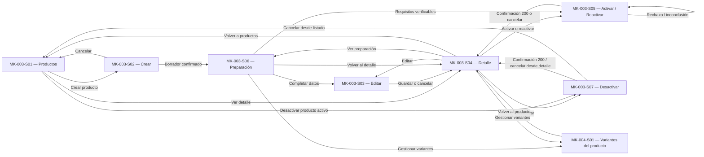

# Component Spec — MK-003

> **Propósito y rol documental:** especificación del resultado esperado de Gestión de productos. Define pantallas, componentes, contenido, estados, decisiones locales y fixtures, subordinados a las fuentes oficiales. Consume la UX del módulo; no crea una propuesta paralela. El orden constructivo corresponde a [plan.md](plan.md) y las unidades ejecutables a [tasks.md](tasks.md).

## 1. Identificación

- **Mockup:** MK-003.
- **Funcionalidad:** Gestión de productos (CRUD principal) — `productos_crud`.
- **Responsable:** Gabriel Poma Gutierrez.
- **Rama funcional:** `poma`.
- **Versión:** v0.2 · **Fecha:** 2026-10-03.
- **Estado:** En revisión; hallazgos contractuales en §14 pendientes de alineación antes de aprobar los estados afectados.
- **Plataforma:** Web desktop; viewport canónico de 1440 px.
- **Referencias consumidas:** UX 2.0, Design System 1.0.0, OpenAPI HTTP 0.5.0 y AsyncAPI 0.4.0.

## 2. Trazabilidad

| Fuente | Referencia | Alcance |
|---|---|---|
| SPEC | [SPEC-003](../../specs/SPEC-003-gestion-productos-crud.md) §§1–8 y extensión 0.5.0 | Identidad, borrador, preparación independiente, activación, perfil simple, edición y baja lógica |
| HU | [HU-003](../../hu/HU-003-gestion-productos-crud.md) CA-01–CA-15 | Criterios de usuario completos |
| WF | [WF-003](../../wireframes/flows/WF-003-gestion-productos-crud.md) | Lista, crear, editar, detalle, confirmación y preparación |
| Antecedente interactivo | [Índice WF-003](../../wireframes/prototipos/WF-003-gestion-productos-crud/index.html) | Recorrido ilustrativo; sus fixtures y controles no amplían el contrato |
| Flow | [FLOW-003](../../flujos/FLOW-003-gestion-productos-crud.md) §§4.1–4.5 y §5 | Alta, preparación, edición, activación/reactivación y desactivación |
| Dependencia de variantes | [SPEC-004](../../specs/SPEC-004-gestion-variantes-skus.md), [FLOW-004](../../flujos/FLOW-004-gestion-variantes-skus.md), [MK-004](../MK-004/component-spec.md) | Al menos una variante activa; preparación de todas las activas; efectos padre/hijos |
| Características y tipos | [SPEC-009](../../specs/SPEC-009-gestion-caracteristicas.md) §4; [SPEC-010](../../specs/SPEC-010-asociacion-tipo-producto-caracteristica.md) §4 | Características tipadas, valores por ID y esquema del tipo; categoría no define atributos; corrección de tipo condicionada por Requisito 10 y Q-06 |
| Propuesta UX módulo | [propuesta-ux.md](../ux/propuesta-ux.md), v2.0 §§3–6, 9–11 | UX-P01/P02/P03: aplicabilidad Alta; estado verificable y conservación del borrador |
| UX Decisions | [ux-decisions.md](../ux/ux-decisions.md), v2.0 | UXD-001–012 según condición; no se aplican recuperaciones exclusivas de otros MK |
| UX Guidelines | [ux-guidelines.md](../ux/ux-guidelines.md), v2.0 §§2–5 | UXG-001–013, 017–018 y 020–022; limitaciones de preparación |
| API Contract | [OpenAPI](../../api/openapi.yaml), HTTP 0.5.0 | Productos, maestros y esquemas administrativos/comerciales; diferencias registradas en §2.2 |
| Mensajería | [AsyncAPI](../../asyncapi/asyncapi.yaml), v0.4.0; [catálogo de eventos](../../api/catalogo-eventos.md) | Inicialización de Pricing/Inventario y desactivación; no son APIs del navegador |
| Contrato humano | [Contrato_Api.md](../../Contrato_Api.md) §§31.6–31.7 y extensión HTTP 0.5.0; [kit de integración](../../api/kit-integracion.md) | Ownership, unidad vendible, proyección comercial segura y límites de canal |
| Arquitectura y modelo | [Arquitectura.md](../../Arquitectura.md) §§1.1–1.2.1; [Modelo_Conceptual.md](../../Modelo_Conceptual.md) §§4.3–4.5 | Gestor Comercial; Catálogo, Pricing e Inventario separados; físico por SKU |
| Design System | [DESIGN.md](../DESIGN.md), v1.0.0 §§4–13 y 15–16 | Tokens, shell, formularios, tablas, estados y DS-C indicados en §8 |
| Entorno y pipeline | [prototipo/README.md](../prototipo/README.md), [mockups/README.md](../README.md) | Rutas directas, modularidad, DoR/DoD y revisión antes de Figma |

### 2.1. Operaciones y esquemas consumidos

Todas las rutas HTTP incluyen el prefijo relativo `/api/v1`. Las mutaciones de producto son `provisional-internal` y usan `userBearer`; no se inventa un rol de administrador ni un scope de mutación.

| Método y ruta | Entrada / respuesta publicada | Uso y límite |
|---|---|---|
| `GET /productos` | `q`, `categoriaId`, `marcaId`, `estado`, `pagina`, `tamanio`, `orden`; respuesta `PaginaProductosComercial` | Consulta y filtros; `NOMBRE_ASC`/`NOMBRE_DESC`. La respuesta comercial no acredita el estado administrativo |
| `GET /productos/{productoId}` | `ProductoDetalleComercial` | Lectura comercial; no sustituye una lectura administrativa completa |
| `POST /productos` | `ProductoCreateRequest` → `201 ProductoDetalle` | Confirma borrador persistido; no confirma todas las preparaciones |
| `PATCH /productos/{productoId}` | `ProductoUpdateRequest` → `200 ProductoDetalle` | Edición; conservar `catalogVersion` cuando se dispone de la versión leída; corrección del tipo pendiente de alineación Q-06 |
| `POST /productos/{productoId}/activar` | `EstadoMutationRequest` → `200 ProductoDetalle` | Activación tras validación del servidor |
| `POST /productos/{productoId}/desactivar` | `EstadoMutationRequest` → `200 ProductoDetalle` | Baja lógica confirmada |
| `POST /productos/{productoId}/reactivar` | `EstadoMutationRequest` → `200 ProductoDetalle` | Revalidación del mismo producto, sin reactivar hijos |
| `GET /categorias`, `GET /marcas`, `GET /tipos-producto` | Esquemas de Taxonomía publicados | Selección de entidades existentes y válidas; no creación desde este formulario |
| `GET /tipos-producto/{tipoProductoId}/caracteristicas` | `EsquemaTipoProducto` | Campos y obligatoriedad por tipo, con versión del esquema |
| `GET /caracteristicas/{caracteristicaId}/valores` | Valores LISTA publicados | Selección por ID; no escritura de valores maestros |

`canal` y filtros monetarios existen en lectura comercial, pero este mockup no los incorpora: no administra elegibilidad de canal ni agrega precios de variantes. `tamanio` admite 1–100, con default 20; `pagina` comienza en 1.

### 2.2. Diferencias contractuales que condicionan el resultado

1. Los `GET` de producto declaran `ProductoResumenComercial`/`ProductoDetalleComercial`, sin `status`, `catalog_version`, preparación ni físico. `estado` se documenta como filtro de backoffice, pero no publica una respuesta administrativa alternativa. S01/S03/S04 requieren alinear esa lectura, no asumirla por el token. **Q-01**.
2. `ProductoDetalle` de las mutaciones sí incluye estado y booleanos opcionales de preparación. `true` acredita únicamente el indicador informado; `false` significa preparación no confirmada y no distingue pendiente de rechazada. Ausente significa información no disponible. No se sintetiza una causa. El esquema `Variante` tampoco publica preparación por hijo. **Q-02**.
3. SPEC/FLOW/WF requieren reintento idempotente, pero no existe ruta administrativa publicada para reintentar una inicialización. AsyncAPI publica mensajes internos, no un endpoint ni una suscripción del navegador. **Q-03**.
4. El comando de Pricing exige `moneda`, mientras `ProductoCreateRequest` solo publica `precioBaseInicial`. No se añade un campo de moneda al request mediante `additionalProperties`; se debe confirmar la fuente de moneda del entorno. **Q-04**.
5. `PerfilFisicoInput` permite datos parciales en borrador; las lecturas físicas usan `DatosFisicosSku`, que requiere perfil completo y fecha. Un input parcial no se presenta como respuesta de ese esquema. Su lectura administrativa debe aclararse junto a Q-01. **Q-05**.
6. SPEC-010 §4, Requisito 10 permite corregir `tipo_producto_id` mediante CRUD ordinario solo si el producto permanece en BORRADOR, no tiene variantes y no tiene identidad comercial publicada. `ProductoUpdateRequest` de OpenAPI 0.5.0 no expone `tipoProductoId`. La ausencia del campo no se convierte en una prohibición funcional absoluta ni `additionalProperties` en una autorización de envío. La corrección en S03 queda bloqueada hasta alinear ambas fuentes. **Q-06**.

Estas diferencias no impiden redactar la especificación. Los estados funcionales exigidos quedan definidos con su fuente y condición de habilitación; no se acredita su implementación ni aprobación mediante fixtures ilustrativos.

### 2.3. Integración documentada y correspondencia de resultados

Esta tabla especifica trazabilidad técnica para revisión; los nombres de mensajes, payloads, versiones e IDs no son contenido visible ni comandos del navegador.

| Hecho / comando interno | Datos y efecto normativo | Correspondencia de revisión |
|---|---|---|
| `pricing.product.initialization.requested` | Tras persistir borrador: `product_id`, `sku_base`, `precio_regular`, `moneda`, `channel_id=null`, `motivo_cambio=ALTA_PRODUCTO` | FLOW PENDING; preparación a nivel de producto, no de variante |
| `pricing.product.initialization.completed` / `.rejected` | Resultado de Pricing; payload `status=READY` / `REJECTED`, con campos publicados de resultado | Completed recibido equivale a preparación COMPLETED de FLOW; no se cambia el enum del payload a COMPLETED |
| `inventory.sku.initialization.requested` | Solo simple: `sku=sku_base`, `product_id`, `variant_id=null`; ubicación predeterminada según contrato, sin selector/stock inicial en MK-003 | Inicializar identidad no equivale a ingreso de unidades |
| `inventory.sku.initialization.completed` / `.rejected` | Resultado para SKU simple; payload `status=INITIALIZED` / `REJECTED` | Confirmación de esa dependencia; no completa Pricing |
| `catalog.product.deactivated` | Hecho tras baja lógica confirmada; fan-out RabbitMQ a `promotions-svc`, `combos-svc`, `api-gateway/bff` según AsyncAPI | Bloqueo comercial sin borrar identidad ni cambiar estados individuales de hijos |

La identidad de operación `operation_id` se conserva en reintentos; `message_id` permite deduplicación de entregas `at-least-once` según AsyncAPI. Son responsabilidades de integración, no campos editables del formulario. Un `rejected` conserva el borrador y lo ya confirmado por otra dependencia; no hay rollback distribuido. No se inventa un evento de reactivación.

Para Despacho existe `POST /api/v1/productos/datos-fisicos/consulta`, con `sub=modulo-despacho`, `aud=api-productos`, `scope=productos:fisicos:leer`: consume físico por SKU en kg/cm, sin stock/precio/pedido. Se traza documentalmente a HU-003 CA-12; no es una acción humana adicional en este mockup.

## 3. Objetivo funcional

- **Usuario:** Gestor Comercial.
- **Objetivo:** crear, consultar, editar y cambiar el estado de productos conservando su identidad y publicándolos solo tras cumplir sus requisitos.
- **Contexto:** alta de un producto simple o de un padre que agrupa variantes; mantenimiento del catálogo existente.
- **Resultado exitoso:** borrador persistido con datos mínimos; requisitos pendientes comprensibles; preparación confirmada por dependencia; activación solicitada explícitamente y validada por Catálogo. La baja y reactivación conservan identidad y respetan los estados individuales de las variantes.

## 4. Alcance

### Incluido

- Listado, búsqueda, filtros de categoría/marca/estado, orden por nombre y paginación contractual.
- Crear borrador con nombre, descripción, categoría, tipo, marca, SKU base, modelo de venta y precio base inicial.
- Imagen y características opcionales al guardar el alta en borrador; obligatorias cuando lo requiera la activación.
- Perfil físico simple opcional/incompleto en borrador, con valores informados positivos.
- Edición de campos de `ProductoUpdateRequest`; SKU base y modelo de venta en lectura. SPEC-010 admite corregir el tipo en BORRADOR, sin variantes y sin identidad comercial publicada; la implementación de esa excepción depende de Q-06.
- Detalle y revisión de preparación de precio y, para simples, inventario; para padres, preparación de unidades vendibles desde MK-004.
- Activación/reactivación, rechazo con conservación del estado anterior y desactivación lógica confirmada.
- Error corregible, conflicto de versión, resultado desconocido y éxito parcial de preparación.
- Rutas independientes para todas las pantallas y confirmaciones; fixtures controlados para revisión.

### Fuera de alcance

- Cambio ordinario de `sku_base` o `tiene_variantes`; sustitución comercial del producto y migración de tipo fuera de las condiciones de SPEC-010 §4, Requisito 10. La excepción de corrección del tipo queda pendiente de alineación contractual Q-06.
- Alta/edición de variantes dentro del formulario del padre; se navega a MK-004.
- Edición de precio vigente/override, saldo, stock inicial, reservas, empaque, pedido o checkout.
- Administración de códigos de barras y elegibilidad por canal: sus decisiones `D-CAT-01..06` siguen abiertas.
- Edición de SEO/slug desde esta capacidad; gestión de maestros o importación masiva.
- Eliminación física, selección/acciones masivas no publicadas, notificaciones externas o rollback distribuido.
- Reintento HTTP inventado, polling con duración fija, avance porcentual ficticio y variantes mobile/tablet.

## 5. Inventario de pantallas

| ID | Pantalla | Propósito | Entrada | Acción principal | Salida | Prioridad | Ruta del prototipo |
|---|---|---|---|---|---|---|---|
| MK-003-S01 | Productos | Consultar y localizar un producto | Catálogo | Crear producto / Ver detalle | S02 / S04 | P0 | `/MK003/S01` |
| MK-003-S02 | Crear producto | Guardar datos mínimos en borrador | S01 | Guardar borrador | S06 tras `201` | P0 | `/MK003/S02` |
| MK-003-S03 | Editar producto | Mantener el mismo producto | S04 / S06 | Guardar cambios | S04 tras `200` | P0 | `/MK003/S03` |
| MK-003-S04 | Detalle del producto | Revisar datos, estado y acciones | S01 / S03 / S05 / S07 | Acción según estado | S03 / S05 / S06 / S07 | P0 | `/MK003/S04` |
| MK-003-S05 | Confirmar activación o reactivación | Revisar requisitos e impacto | S04 / S06 | Activar producto / Reactivar producto | S04 confirmado / permanencia si rechazo | P0 | `/MK003/S05` |
| MK-003-S06 | Preparación del producto | Distinguir persistencia y dependencias | S02 / S04 | Revisar requisitos / Consultar información disponible | S03 / S05 / MK-004 | P0 | `/MK003/S06` |
| MK-003-S07 | Confirmar desactivación | Confirmar baja lógica y efecto sobre hijos | S01 / S04 | Desactivar producto | S04 / S01 | P0 | `/MK003/S07` |

**Reglas de acceso y enrutamiento:** cada ID tiene acceso directo reproducible aunque sea modal. S05/S07 abren su diálogo sobre S04 con un producto de fixture determinado, sin visita previa. S05 admite escenarios de borrador/inactivo en la misma ruta; no crea otra pantalla. El contexto de producto y la selección de fixture se resuelven por mecanismos del prototipo sin fijar dominio, puerto o biblioteca de routing.

Regresar conserva `q`, filtros, orden y página válidos. Un producto inexistente tiene resultado de no encontrado; una respuesta fallida no equivale a una lista vacía. Cambios de inventario/precio no activan automáticamente al producto.

## 6. Relación entre pantallas

La edición rechazada permanece en S03 con valores propuestos y error visible. La baja no se representa confirmada hasta el resultado de Catálogo. El vínculo con MK-004 conserva `product_id` internamente y muestra nombre/SKU base al gestor.

## 7. Jerarquía de información

1. **Primaria:** nombre/SKU base, modelo simple/con variantes, estado confirmado, requisitos para la acción actual y CTA específico.
2. **Secundaria:** clasificación, descripción, imagen, características, perfil simple y preparación independiente de precio/unidades vendibles.
3. **Complementaria:** ayuda de herencia de precios, volumen derivado cuando calculable y metadatos realmente publicados. Versiones e identificadores de correlación son internos; no aparecen como contenido operativo.

El precio inicial solo se captura en el alta. La edición informa «El precio vigente se administra desde Gestión de precios». No se calcula precio/disponibilidad del padre a partir de una variante arbitraria.

## 8. Componentes compartidos

Se consumen las medidas y tokens de [DESIGN.md](../DESIGN.md) v1.0.0; la composición específica no redefine sus componentes.

| Componente | Pantallas | Uso | Variante / size | Estados |
|---|---|---|---|---|
| DS-C01 `PO/Button` | S01–S07 | Guardar, confirmar, cancelar, regresar | filled primary / outline / subtle, md; destructive para baja | default, hover, focus, pressed, disabled con causa, loading |
| DS-C02 `PO/ActionIcon` y DS-C29 `PO/Menu` | S01/S04 | Acciones de fila autorizadas | 32/40 px; menú de acciones | focus, open, disabled |
| DS-C03 `PO/TextInput` | S02/S03 | Nombre, SKU base y URL de imagen | md, read-only para identidad en edición | filled, error, read-only, focus |
| DS-C04 `PO/NumberInput` | S02/S03 | Precio inicial, peso/dimensiones y atributos NUMERO | md; unidad visible | default, filled, error, focus |
| DS-C05 `PO/Textarea` | S02/S03 | Descripción | md | filled, error, focus |
| DS-C06 `PO/Select` | S01–S03 | Maestros y valores LISTA | md en formularios; sm en filtros | loading, open, selected, error |
| DS-C09 `PO/RadioGroup` | S02 | Simple / Con variantes | md; leyenda Modelo de venta | selected, focus, error |
| DS-C12 `PO/Search` y DS-C13 `PO/FilterBar` | S01 | Búsqueda y filtros admitidos | md/sm | loading, applied, error |
| DS-C14 `PO/Badge` | S01/S04–S07 | Estado de producto y preparación distinguibles | md neutral/info/success/warning/error según evidencia | Informativo, sin click |
| DS-C17 `PO/Table`, DS-C18 `PO/Pagination` | S01/S04/S06 | Productos, resumen de hijos y páginas | default, filas ≥48 px; paginación 32 px | loading, empty, error, default |
| DS-C19 `PO/Card` | S02–S06 | Grupos de datos y requisitos | padding 24 px, sin sombra | default, sección no disponible |
| DS-C21 `PO/Modal` | S05/S07 y aviso de salida | Confirmación breve | 480 px, radio 16 | open, loading, error |
| DS-C22 `PO/Alert / PO/Result` | S01–S07 | Error y resultado persistentes | info/success/warning/error | Confirmado, parcial o desconocido |
| DS-C23 `PO/Toast` | S02/S03 | Complemento de guardado confirmado | Estándar DS | dismissible; sin acción imprescindible |
| DS-C24 `PO/Skeleton / PO/Loader` | S01–S07 | Carga inicial/local | Estructura conocida / localizado | loading; movimiento reducido |
| DS-C25 `PO/EmptyState`, DS-C28 `PO/Breadcrumbs` | S01–S06 | Vacíos y contexto | Estándar DS | empty / focus |

No hay switch Activo/Inactivo: activar requiere validaciones y solicitud explícita. No se incluyen checkbox de selección masiva, wizard, drawer obligatorio ni un control universal de reintento.

## 9. Componentes específicos

### MK-003-C01 — Datos e identidad del producto

**Propósito:** capturar datos mínimos sin confundir alta y edición. **Pantallas:** S02/S03; lectura en S04.

**Contenido estructurado:** nombre, descripción, categoría, tipo, marca, SKU base, modelo de venta y precio inicial solo en alta.

| Propiedad conceptual | Tipo | Obligatoria | Regla / restricción |
|---|---|---:|---|
| nombre / descripcion | Texto | Sí en alta | No vacíos; sin longitud máxima inventada |
| categoriaId / marcaId | Referencia | Sí en alta | Entidades válidas |
| tipoProductoId | Referencia | Sí en alta | Define atributos; corrección ordinaria solo en BORRADOR, sin variantes y sin identidad comercial publicada según SPEC-010; request de edición pendiente Q-06 |
| skuBase | Texto | Sí en alta | Único; read-only en edición |
| tieneVariantes | Booleano | Sí en alta | Elección explícita; identidad publicada no cambia |
| precioBaseInicial | Número | Sí en alta | `>0`; moneda debe provenir de fuente confirmada, Q-04 |
| catalogVersion | Entero | Según lectura | Mantener valor leído; nunca incrementar para forzar guardado |

| Estado | Disparador | Representación | Acción permitida |
|---|---|---|---|
| Default | Alta o edición cargada | Campos por contexto; identidad legible en edición | Completar / guardar |
| Loading | Consulta de maestros o guardado | Loader de región/CTA; entradas conservadas | Cancelar consulta o esperar escritura |
| Error | Duplicado, maestro inválido o fallo de guardado | Mensaje junto al campo/sección | Corregir sin recrear producto |
| Conflicto | `VERSION_CONFLICT` | Aviso persistente con intención preservada | Revisar versión actual cuando Q-01 se resuelva |

**Interacciones:** elegir modelo revela físico solo en simple (FLOW-003 §4.1); cambiar categoría conserva tipo y atributos (SPEC-010); guardar ejecuta alta o edición según contexto (FLOW-003 §§4.1/4.4). Salir con cambios ofrece continuar editando o descartar explícitamente.

La corrección explícita del tipo es distinta del cambio de categoría. Su control y envío en edición dependen de resolver Q-06 y disponer de evidencia de las tres precondiciones. BORRADOR por sí solo no demuestra ausencia de variantes ni de identidad comercial publicada. Si existen variantes o identidad publicada, el cambio requiere migración controlada fuera de este CRUD, sin reescribir identidades SKU ni snapshots históricos (SPEC-010 §4, Requisito 10).

**Accesibilidad:** labels visibles; leyenda para modelo; SKU de lectura copiable; foco al primer error y mensajes asociados al control. Tab/Shift+Tab recorren el orden del formulario; Enter no confirma una baja.

### MK-003-C02 — Imagen y características del tipo

**Propósito:** completar información de publicación a partir del esquema de Taxonomía. **Pantallas:** S02/S03/S04/S05.

**Contenido:** características activas del tipo, obligatoriedad y unidad; URL de imagen y vista previa accesible. `ImagenRef` contiene `url` y `principal` opcional; no se afirma disponer de subida de archivos.

| Propiedad | Tipo | Obligatoria | Regla / restricción |
|---|---|---:|---|
| esquema | `EsquemaTipoProducto` | Para conocer requisitos | Conservar versión interna; no derivar de categoría |
| atributos | Lista de `Atributo` | Para activar según esquema | `caracteristica_id`, `valor_id` LISTA y valor; no IDs basados en etiquetas |
| imagenes | Lista de `ImagenRef` | Para activar | Una imagen basta si es válida; alta en borrador admite ausencia |

| Estado | Disparador | Representación | Acción permitida |
|---|---|---|---|
| Default | Esquema disponible | TEXTO/NUMERO/LISTA con controles DS y requisitos visibles | Completar |
| Loading | Consulta de esquema | Loader del grupo; preservar datos independientes | Esperar / consultar de nuevo |
| Empty | Tipo sin asociaciones | «Este tipo no tiene características asociadas» | Continuar según demás requisitos |
| Error | Maestro/imagen/consulta inválidos | Error localizado; no inventar atributos | Corregir / consultar lectura disponible |

**Interacciones:** escribir valores o seleccionar por ID; URL válida alimenta `imagenes[].url`; previsualización fallida se distingue de rechazo contractual de la imagen. No se agrega una regla fija categoría→tipo ni «Material» obligatorio universal del índice ilustrativo. En una siguiente edición, una nueva obligatoriedad se valida sin inactivar automáticamente productos existentes (SPEC-010 §4).

**Accesibilidad:** etiqueta y unidad en cada campo; texto alternativo de imagen; no depender de miniatura/color para saber si existe. Errores abren el grupo y llevan foco al control afectado.

### MK-003-C03 — Perfil físico del producto simple

**Propósito:** describir la unidad vendible simple. **Pantallas:** S02/S03/S04/S05.

| Propiedad | Tipo | Obligatoria | Regla / restricción |
|---|---|---:|---|
| pesoKg | Número/null | Para activar/reactivar simple | Informado `>0`, kg |
| dimensionesCm.largo / ancho / alto | Número/null | Para activar/reactivar simple | Informados `>0`, cm |
| tieneVariantes | Booleano | Sí | Si true, grupo no aplicable y sin perfil propio |
| volumenCalculado | Número derivado | No | Solo con tres dimensiones válidas; no se envía como campo |

| Estado | Disparador | Representación | Acción permitida |
|---|---|---|---|
| Default | Simple con valores | Cuatro campos con unidades | Guardar valores permitidos |
| Incompleto | Alta en borrador | Pendientes explícitos; no error por mera ausencia | Guardar borrador |
| Error | Cero/negativo o activación incompleta | Error del campo y lista de requisitos | Corregir |
| No aplicable | Padre con variantes | «Las medidas se registran en cada variante» | Gestionar variantes |

**Interacciones:** ingreso mapea a `perfilFisico.pesoKg` y `perfilFisico.dimensionesCm`; volumen de ayuda = largo×ancho×alto en cm³. Una edición activa que quite una medida requerida se rechaza íntegramente, conservando datos persistidos y estado (FLOW-003 §4.4). La lectura de un perfil parcial queda condicionada por Q-05.

**Accesibilidad:** DS-C04 con unidades en labels; errores asociados; ausencia no se transforma en cero. Campos recorribles por teclado y ayuda del volumen anunciable sin robar foco.

### MK-003-C04 — Preparación y requisitos de activación

**Propósito:** separar estado del producto de preparación de cada dependencia. **Pantallas:** S04/S05/S06; resumen en S01 solo con fuente administrativa.

| Propiedad | Tipo | Obligatoria | Regla / restricción |
|---|---|---:|---|
| estadoProducto | Estado confirmado | Sí para acciones | `BORRADOR`, `ACTIVO`, `INACTIVO` |
| pricing_preparado / inventario_inicializado | Booleano opcional | No | Interpretación limitada a lo publicado; `false` no implica rechazo |
| resultadosPreparacion | Evidencia interna de escenario | Solo en revisión conceptual | No se añade a respuesta HTTP; detalle pendiente Q-02 |
| variantesActivas | Lista de hijos | Para evaluar padre | Al menos una; todas las activas deben cumplir SPEC-004 |
| requisitos | Lista explicativa | Sí | Validez mínima/maestros, características, imagen, precio y unidades vendibles |

| Estado / evidencia | Representación visual | Acción permitida |
|---|---|---|
| Booleano true informado | «Precio preparado» / «Inventario preparado», limitado a su alcance | Evaluar demás condiciones con servidor |
| Booleano false informado | «Preparación no confirmada» | Completar datos; no afirmar causa |
| Ausente / lectura fallida | «Estado de preparación no disponible» | Conservar borrador y resultados previamente confirmados |
| `PENDING` de evidencia funcional | «Preparando precio» / «Preparando inventario» | Esperar; estado conceptual condicionado por Q-02 |
| `REJECTED` de evidencia funcional | «La preparación no pudo completarse. El borrador se conserva» | Reintento solo después de resolver Q-03 |
| `COMPLETED` de evidencia funcional | Dependencia confirmada; otras separadas | No activar automáticamente |
| Padre con variantes | Precio y resumen de unidades vendibles; inventario del padre «No aplicable» | Gestionar variantes |

**Interacciones:** consultar solo con lectura respaldada; resolver datos lleva a S03; gestionar unidades lleva a MK-004-S01. Si un reintento llega a formalizarse, afecta únicamente la dependencia pendiente/rechazada, mantiene identidad de operación y no repite la completada (FLOW-003 §§4.2–4.3). Ningún control escribe directamente en Pricing/Inventario.

**Accesibilidad:** regiones con encabezado y estado textual; actualización en `aria-live="polite"`; error persistente accesible. Los requisitos del CTA deshabilitado aparecen próximos, no solo en tooltip.

### MK-003-C05 — Confirmación de cambio de estado

**Propósito:** explicar la acción y conservar el último estado confirmado. **Pantallas:** S05/S07.

| Propiedad | Tipo | Obligatoria | Regla / restricción |
|---|---|---:|---|
| producto | Identidad/nombre/estado | Sí | Producto seleccionado; SKU base legible |
| accion | Activar / Reactivar / Desactivar | Sí | Corresponde al estado de origen y capacidad publicada |
| requisitos / impacto | Texto/lista | Sí | No garantiza publicación en todos los canales |
| catalogVersion / motivo | Versión / texto opcional | No obligatorios por UI | Solo conforme a `EstadoMutationRequest`; no se exige motivo inventado |

| Estado | Disparador | Representación | Acción permitida |
|---|---|---|---|
| Default | Acción seleccionada | Nombre, SKU, impacto y cancelar/confirmar | Confirmar si precondiciones conocidas lo permiten |
| Loading | Escritura enviada | Loader de CTA y sin doble envío | Esperar |
| Error | Rechazo del servidor | Motivo publicado, estado anterior conservado | Corregir / cancelar |
| Resultado desconocido | Timeout | «No se pudo confirmar el cambio» | Consultar antes de repetir; Q-01 condiciona recuperación |

**Interacciones:** `200` con resultado esperado actualiza estado y lleva a S04; cancelar no muta. Desactivar padre conserva estados de hijos y bloquea exposición comercial. Reactivar padre revalida sin reactivar hijos inactivos (FLOW-003 §§4.4–4.5).

**Accesibilidad:** diálogo con título, foco inicial en contenido/alternativa segura, foco contenido y restitución al activador/origen. S07 cancelada desde listado regresa a S01; desde detalle a S04. En ruta directa, restitución a la acción correspondiente de S04 del fixture. Escape cancela sin producir mutación.

## 10. Especificación por pantalla

### MK-003-S01 — Productos

**Propósito y objetivo:** localizar productos y acceder a su mantenimiento.

**Estructura y layout:** breadcrumbs; H1 y Crear producto; barra de búsqueda/filtros; estado de consulta; tabla; paginación. Tabla: Producto, SKU base, Modelo de venta, Estado y Acciones. Preparación es complementaria y solo aparece con fuente confirmada; no hay columnas de saldo del padre ni precio agregado.

**Componentes presentes:** DS-C01/02/06/12/13/14/17/18/22/24/25/28/29 y resumen C04 si Q-01/Q-02 se resuelven.

**Acción primaria:** Crear producto → S02. **Secundarias:** Ver detalle; Editar; Desactivar activo con confirmación S07. Los cambios de estado también se ofrecen desde detalle; no se muestran acciones cuya disponibilidad dependa de un `status` no publicado.

**Estados requeridos:** default administrativo (Q-01); loading inicial; actualización conservando última consulta identificada; empty global; sin coincidencias; error con filtros preservados; ausencia de estado administrativo sin badge inventado. UXD-001/003/004/006/010/012; UXG-001/005–008/011/017/020–022.

| Elemento | Texto / patrón | Fuente |
|---|---|---|
| H1 / CTA | «Productos» / «Crear producto» | WF-003; DESIGN §13 |
| Búsqueda | «Buscar productos» | OpenAPI `q`; UXG-006 |
| Vacío | «Aún no hay productos»; Crear producto | WF-003; UXG-017 |
| Sin coincidencias | «No hay productos con estos filtros»; Limpiar filtros | UXG-017 |
| Error | «No se pudieron consultar los productos. Los filtros se conservan» | UXG-011/012 |

No se presenta como búsqueda global por SKU una semántica no declarada de `q`. Orden y filtros provienen del contrato; respuesta tardía no reemplaza una consulta más nueva.

### MK-003-S02 — Crear producto

**Propósito y objetivo:** guardar un borrador con sus propios requisitos.

**Estructura y layout:** breadcrumbs y H1; datos generales; modelo de venta; características/imagen para publicar; físico simple condicional; resumen de errores; acciones finales. Formulario completo hasta 880 px, sin wizard obligatorio.

**Componentes presentes:** C01/C02/C03 y DS-C01/03/04/05/06/09/19/21/22/24/28.

**Acción primaria:** Guardar borrador. **Secundarias:** Cancelar; continuar editando ante aviso de salida. No Activar en el mismo envío de alta.

**Estados requeridos:** default vacío; maestros/esquema loading/error; modelo simple/con variantes; datos físicos incompletos válidos; datos informados no positivos; guardando; SKU duplicado; `201` en borrador; error corregible; resultado desconocido sin repetir POST. UXD-001/002/004/005/006/009/012; UXG-002–004/006–007/011/013/017/020–022.

| Elemento | Texto / patrón | Fuente |
|---|---|---|
| H1 / CTA | «Crear producto» / «Guardar borrador» | WF-003; SPEC-003 §2 |
| Requisito | «La imagen, las características obligatorias y las medidas completas se requieren para activar» | SPEC-003 §§2/5 |
| Modelo con variantes | «El padre agrupa variantes. Sus unidades vendibles se preparan por separado» | SPEC-003 §4 |
| Éxito | «Borrador guardado. Completa los requisitos antes de activar» | HU-003 CA-01/08 |
| SKU duplicado | «Este SKU base ya está registrado. Usa uno diferente» | OpenAPI `SKU_DUPLICADO` |

El precio inicial `>0` se conserva al corregir. Se muestra moneda solo si el entorno la suministra; PEN en fixtures no constituye default definitivo, Q-04. La persistencia precede las solicitudes independientes de preparación.

### MK-003-S03 — Editar producto

**Propósito y objetivo:** modificar los datos permitidos del mismo producto.

**Estructura y layout:** identidad/estado de lectura; grupos reutilizados de S02; nombre, descripción, categoría, marca, atributos, imágenes y perfil simple editables; SKU base y modelo legibles en lectura. El tipo se presenta según elegibilidad para la corrección de SPEC-010; el diseño operativo de esa excepción y su request están pendientes de Q-06. Acciones y error persistente.

**Componentes presentes:** C01/C02/C03, DS-C01/03/04/05/06/19/21/22/24/28.

**Acción primaria:** Guardar cambios. **Secundarias:** Cancelar; revisar versión actual si lectura administrativa publicada. Sin campo de precio vigente ni checkbox obligatorio de «mismo producto»: esa condición la valida el negocio, no una declaración del gestor.

**Estados requeridos:** default cargado (Q-01); loading; no encontrado; error de lectura/guardado; `VERSION_CONFLICT`; cambio estructural rechazado; edición de activo que pierde requisitos; corrección de tipo elegible, no elegible y con precondiciones no verificables (Q-06); éxito `200`; resultado desconocido. UXD-001/002/005/009/012; UXG-002/003/006/011/013/020–022.

| Elemento | Texto / patrón | Fuente |
|---|---|---|
| H1 / CTA | «Editar producto» / «Guardar cambios» | WF-003 |
| Identidad | «El SKU base y el modelo de venta se conservan» | SPEC-003 §7; `ProductoUpdateRequest` |
| Tipo: condiciones de corrección | «El tipo puede corregirse mientras el producto siga en borrador, sin variantes y sin identidad comercial publicada» | SPEC-010 §4, Requisito 10; patrón funcional pendiente de Q-06, sin control operativo hasta alinear contrato |
| Activo inválido | «No se guardaron los cambios. El producto conserva sus datos y estado anteriores» + causa disponible | SPEC-003 §7 |
| Conflicto | «Este producto cambió desde que comenzaste a editarlo. Revisa la versión actual» | OpenAPI `VERSION_CONFLICT`; UXG-013 |

Los valores propuestos permanecen en el formulario, distinguidos del último registro confirmado. Cambiar categoría no cambia tipo ni recalcula atributos por la categoría. Una nueva obligatoriedad del tipo se atiende antes de guardar conforme a SPEC-010, sin desactivar por consulta.

No se define el tipo como read-only universal: SPEC-010 permite la corrección bajo las tres condiciones indicadas. La falta de `tipoProductoId` en el request vigente es el bloqueo Q-06, no una decisión de negocio. Hasta su resolución no se envía ese campo ni se simula un guardado contractual del cambio. Cuando una condición no se cumple, no se ofrece corrección ordinaria; con variantes o identidad publicada, la migración queda fuera de alcance. Si falta evidencia de las condiciones, no se presume elegibilidad ni se inventa un flag de publicación.

### MK-003-S04 — Detalle del producto

**Propósito y objetivo:** revisar información persistida y elegir una acción pertinente.

**Estructura y layout:** breadcrumbs; nombre/SKU base/modelo y badge de estado; descripción/clasificación; imagen/características; perfil simple o resumen de variantes; preparación/requisitos; acciones. No tarjetas ficticias de precio/stock agregados.

**Componentes presentes:** C02/C03/C04; DS-C01/14/17/19/22/24/25/28/29.

**Acción primaria por estado:** BORRADOR → Activar producto; INACTIVO → Reactivar producto; ACTIVO → Editar. **Secundarias:** Ver preparación; Volver a productos; Gestionar variantes solo en padre; Desactivar activo → S07. Los botones de activación muestran requisitos faltantes/no verificables próximos; no deducen preparación total de la condición `ACTIVO` ni de un booleano aislado.

**Estados requeridos:** simple y padre; borrador/activo/inactivo; imagen ausente; variantes vacías; loading/error/no encontrado; preparación no confirmada/no disponible. Lectura administrativa y preparación detallada condicionadas por Q-01/Q-02. UXD-001/002/008/010/011/012; UXG-001/003/011/012/017/018/020–022.

| Elemento | Texto / patrón | Fuente |
|---|---|---|
| H1 | «Detalle del producto»; nombre como identidad visible | WF-003; UXG-020 |
| Padre | «Las medidas y el inventario corresponden a cada variante» | SPEC-003 §§4–6 |
| Exposición | «La visibilidad comercial también depende de la elegibilidad del canal» | Extensión SPEC-003 0.5.0 |
| Inactivo | «El producto no se ofrece comercialmente. Los estados de sus variantes se conservan» | SPEC-003 §7 |

### MK-003-S05 — Confirmar activación o reactivación

**Propósito y objetivo:** confirmar un cambio de estado tras revisar sus requisitos.

**Estructura y layout:** modal 480 px sobre detalle; título según acción; nombre/SKU; checklist de datos mínimos, maestros, características, imagen, precio, unidades vendibles y físico simple; impacto; Cancelar y acción específica. En padre: al menos una variante activa y preparada, inventario confirmado en todas las activas; borradores/inactivas no bloquean.

**Componentes presentes:** C04/C05; DS-C01/14/21/22/24.

**Acción primaria:** Activar producto o Reactivar producto según origen. **Secundarias:** Cancelar; volver a completar datos/preparación. Confirmar no sustituye validación autoritativa de Catálogo; nunca se envía un cambio cuando hay una precondición conocida incumplida.

**Estados requeridos:** requisitos completos; faltantes; preparación desconocida; enviando; `422` conservando borrador/inactivo; `409` de versión; `200` confirmado; timeout sin estado optimista. UXD-007/009/011/012; UXG-009–011/013/018/020–022. La comprobación detallada previa sigue Q-01/Q-02; el servidor conserva la validación final.

| Elemento | Texto / patrón | Fuente |
|---|---|---|
| Título / CTA | «Activar producto» o «Reactivar producto» | WF-003; FLOW-003 §4.4 |
| Reactivación del padre | «Esta acción no reactiva variantes inactivas» | HU-003 CA-15 |
| Rechazo | «No se pudo activar el producto. Conserva su estado anterior» + requisitos publicados | SPEC-003 §5/7 |
| Confirmación | «Producto activo» solo tras `200` con `status=ACTIVO` | OpenAPI; UXG-018 |

### MK-003-S06 — Preparación del producto

**Propósito y objetivo:** entender qué quedó guardado y qué falta antes de activar.

**Estructura y layout:** identidad y estado; resultado «Borrador guardado» cuando lo confirma alta; card Precio; card Inventario solo simple o Unidades vendibles para padre; requisitos editables; feedback persistente y acciones.

**Componentes presentes:** C04, DS-C01/14/17/19/22/24/25/28.

**Acción primaria:** Completar datos o Gestionar variantes según requisito. **Secundarias:** Volver al detalle; consultar información mediante lectura respaldada. Reintentar preparación es capacidad requerida por FLOW/WF que permanece bloqueada por Q-03; no existe botón operativo con ruta ficticia.

**Estados requeridos:** true/false/ausente de preparación del producto, carga/error de lectura, éxito de una dependencia conservado ante fallo de la otra; estados funcionales pendiente/rechazada/completada con evidencia interna, pendientes de fuente HTTP Q-02. No hay estado vacío que elimine un producto persistido: ausencia de información significa no disponible. UXD-004/005/007/008/009/010/012; UXG-007–013/017/020–022.

| Elemento | Texto / patrón | Fuente |
|---|---|---|
| H1 | «Preparación del producto» | WF-003 |
| Simple, solicitud acreditada | «Preparando precio e inventario» | WF-003; FLOW-003 §§4.2–4.3; condicionado Q-02 |
| Parcial | «El borrador se conserva. La activación aún no puede confirmarse» | UX-P03; SPEC-003 §5 |
| Sin detalle | «Estado de preparación no disponible» | DESIGN §13; UXG-017 |
| Padre sin hijos activos | «Crea y activa al menos una variante desde Gestión de variantes» | SPEC-003 §5; MK-004 |

### MK-003-S07 — Confirmar desactivación

**Propósito y objetivo:** confirmar la baja lógica del producto seleccionado.

**Estructura y layout:** modal 480 px sobre detalle determinista; nombre/SKU; estado actual; consecuencia; Cancelar; Desactivar producto destructivo.

**Componentes presentes:** C05, DS-C01/21/22/24.

**Acción primaria:** Desactivar producto. **Secundaria:** Cancelar sin cambios. Para padre se explica el bloqueo comercial de hijos sin modificar sus estados individuales. La definición se conserva y puede reactivarse previa revalidación.

**Estados requeridos:** confirmación, enviando, error/versión incompatible, timeout y `200 INACTIVO`; no recibe una espera asíncrona ficticia después de respuesta síncrona. UXD-009/011/012; UXG-011/013/018/020–022.

| Elemento | Texto / patrón | Fuente |
|---|---|---|
| Título / CTA | «Desactivar producto» | FLOW-003 §4.5 |
| Impacto | «El producto dejará de ofrecerse comercialmente. Su definición se conserva» | SPEC-003 §7 |
| Padre | «Sus variantes conservan su estado, pero dejan de ofrecerse mientras el padre esté inactivo» | HU-003 CA-15 |
| Éxito | «Producto desactivado» solo tras confirmación | OpenAPI; UXG-018 |

## 11. Decisiones UX locales

### LUX-01 — Separar alta y edición como pantallas del producto

**Problema:** alta requiere precio inicial, SKU y modelo; edición los conserva. **Alternativas consideradas:** una vista sin distinguir operaciones; dos pantallas con grupos reutilizados. **Decisión adoptada:** S02/S03 separadas conforme a WF-003, compartiendo C01–C03. **Justificación:** evita enviar campos de alta en PATCH y comunica las restricciones de identidad. **Trade-off:** dos rutas con más estados de revisión; no duplican componentes. **Criterio de validación:** edición no ofrece precio inicial, cambio de SKU/modelo ni alta de variantes; la corrección del tipo respeta las condiciones de SPEC-010 §4, Requisito 10 y permanece bloqueada por Q-06 hasta alinear el request o la SPEC. Aplica UXD-001/002; no introduce un patrón transversal nuevo.

### LUX-02 — Preparación del padre organizada por unidades vendibles

**Problema:** mostrar Inventario del padre con variantes atribuiría una unidad física inexistente. **Alternativas consideradas:** card de saldo del padre; card Unidades vendibles y enlace a MK-004. **Decisión adoptada:** segunda opción; precio del producto separado. **Justificación:** SPEC-003 §§3–5 y UXD-008/010. **Trade-off:** revisión por SKU requiere visitar Variantes y resolver Q-02. **Criterio de validación:** ningún saldo/perfil del padre; hijos en borrador/inactivos no bloquean; todas las activas deben estar preparadas.

### LUX-03 — Confirmación de activación/reactivación con requisitos del producto

**Problema:** un alta guardada puede parecer publicable antes de completar dependencias. **Alternativas consideradas:** switch inmediato; confirmación S05 con requisitos e impacto. **Decisión adoptada:** S05 con acción explícita, compartida por borrador e inactivo. **Justificación:** WF-003 y FLOW-003 §4.4, UXD-011; mantiene distintas persistencia, preparación y activación. **Trade-off:** añade revisión antes del cambio; necesita fuente verificable Q-01/Q-02. **Criterio de validación:** no activa por `201`, por `requested`, por tiempo transcurrido ni al reactivar una variante.

Estas decisiones concretan UXD vigentes en este producto. Si una nueva solución exclusiva empieza a repetirse en otros MK, debe proponerse su promoción a [ux-decisions.md](../ux/ux-decisions.md); aquí no se redefine una regla transversal.

## 12. Reglas de layout PC

- Web desktop, tema claro; revisión a 1440×900 px con desplazamiento vertical permitido.
- Shell DS: header 64 px, sidebar 240 px, padding 32 px; área útil de referencia 1136 px y grid interior de 12 columnas con gutter 24 px.
- Formulario amplio hasta 880 px, alineado a izquierda; pares equivalentes en dos columnas; descripción, errores y atributos extensos ocupan el ancho disponible.
- Oswald para H1–H3, Inter para operación; `type/heading/h1` 32/40 y `type/body/small` 14/20 en tablas. SKU legible y copiable.
- Espacios 4/8/16/24/32 px según rol; inputs/botones md 40 px; fila de tabla mínimo 48 px; cards radio 12 y sin sombra; modales radio 16.
- Tokens `color/surface/cloud`, `color/text/primary`, `color/action/primary`, variantes semánticas y foco del DS; no colores ni tipografías locales arbitrarios.
- No overflow horizontal de página. Tabla solo usa scroll en región etiquetada si indispensable; controles/filtros envuelven.
- Footer sticky solo si respeta reserva de espacio y no cubre foco/error. Sin adaptaciones mobile/tablet.
- Mensajes y estados comprensibles sin color; controles etiquetados y diálogos con devolución del foco.

## 13. Fixtures

Datos ficticios y deterministas, documentados para revisión. Los siguientes nombres son identificadores de escenarios, no enums ni campos añadidos al contrato.

**Clases de evidencia:** `HTTP` = esquema/request/respuesta publicados; `UI` = estado de interacción local; `FUNCIONAL` = regla SPEC/FLOW que aún necesita lectura/comando HTTP alineado. Un escenario FUNCIONAL no se anuncia como integración disponible ni cierra un gate.

| Fixture | Caso y datos representativos | Pantalla / estado | Evidencia y condición |
|---|---|---|---|
| `list-default` | Productos simple y padre; nombres/SKUs; estados en dataset administrativo | S01/default | FUNCIONAL, Q-01 |
| `list-loading` | Lectura inicial sin datos | S01/loading | UI + consulta publicada |
| `list-empty` | `items=[]`, total=0, sin filtros | S01/empty | HTTP; no sintetizar estados |
| `list-no-results` | `items=[]` con `q`/filtros aplicados | S01/sin coincidencias | HTTP/UI |
| `list-error` | Consulta fallida con filtros preservados | S01/error | HTTP `SERVICIO_NO_DISPONIBLE` |
| `create-empty` | Datos mínimos aún vacíos | S02/default | UI |
| `create-simple-draft` | Mochila de entrenamiento; SKU `MOCH-ENT-001`, precio 129.90, sin imagen/atributos/físico | S02/alta; S06 | HTTP request + `201 BORRADOR`; Q-04 para moneda |
| `create-variant-parent` | Camiseta de entrenamiento; base `CAM-ENT`, `tieneVariantes=true`, precio 79.90, sin físico | S02/alta; S06/padre | HTTP; no inventario del padre |
| `create-partial-physical` | peso 0.45, largo 30, ancho/alto null | S02/borrador | HTTP input; no respuesta `DatosFisicosSku` parcial, Q-05 |
| `create-invalid-physical` | peso 0 o dimensión negativa | S02/error | HTTP `PERFIL_FISICO_INVALIDO` |
| `create-duplicate-sku` | SKU base ya registrado | S02/error | HTTP `409 SKU_DUPLICADO` |
| `create-invalid-master` | Categoría/marca/tipo rechazado | S02/error | HTTP códigos de maestro inválido |
| `saving` | Una escritura en curso, sin doble envío | S02/S03/S05/S07/loading | UI |
| `write-unknown` | POST/PATCH/cambio sin respuesta concluyente | S02/S03/S05/S07/desconocido | UI; consultar antes de repetir |
| `edit-default` | Misma identidad; versión leída 3 | S03/default | FUNCIONAL lectura Q-01; HTTP PATCH |
| `edit-type-correction-eligible` | BORRADOR, sin variantes y sin identidad comercial publicada; propuesta de corrección del tipo | S03/corrección elegible | FUNCIONAL, SPEC-010 §4, Requisito 10; Q-06 y fuente de precondiciones coordinada con Q-01; no PATCH de tipo publicado |
| `edit-type-correction-ineligible` | Casos con estado distinto de BORRADOR, variantes existentes o identidad comercial publicada | S03/corrección no elegible | FUNCIONAL, SPEC-010 §4, Requisito 10; no corrección ordinaria; variantes/identidad publicada requieren migración fuera de alcance; Q-06 |
| `edit-type-correction-unverifiable` | BORRADOR sin evidencia suficiente de ausencia de variantes o de identidad publicada | S03/precondiciones no verificables | FUNCIONAL/UI, Q-06/Q-01; no inferir elegibilidad ni inventar datos para habilitar cambio |
| `edit-active-rejected` | Propuesta quita imagen o medida requerida | S03/error | SPEC-003 §7; estado persistido ACTIVO intacto |
| `edit-version-conflict` | `409 VERSION_CONFLICT`, propuesta preservada | S03/error | HTTP; relectura administrativa Q-01 |
| `category-change` | Cambia categoría conservando tipo y atributos | S03/default | SPEC-010; HTTP PATCH |
| `detail-simple-active` | Físico completo, imagen y atributos válidos | S04/default | HTTP mutación; lectura independiente Q-01 |
| `detail-parent-inactive` | Padre inactivo con hijo ACTIVA y otro INACTIVA | S04/default | SPEC-003/004; lectura Q-01 |
| `product-not-found` | Producto inexistente | S03/S04/error | HTTP `PRODUCTO_NO_ENCONTRADO` |
| `prep-confirmed` | `pricing_preparado=true`, `inventario_inicializado=true` del simple | S06/default; S05 | HTTP `ProductoDetalle`; no deducir demás requisitos |
| `prep-unconfirmed` | Booleano false informado | S06/no confirmado | HTTP; sin causa atribuida |
| `prep-unavailable` | Booleano ausente o detalle fallido | S06/no disponible | HTTP/UI |
| `prep-partial` | Precio confirmado; inventario no informado | S06/parcial | HTTP; conserva borrador |
| `prep-pending` | Operación solicitada sin resultado recibido | S06/pendiente | FUNCIONAL, Q-02 |
| `prep-rejected` | Resultado interno rejected de una dependencia | S06/rechazada | FUNCIONAL, Q-02; reintento Q-03 |
| `parent-no-active-variants` | Padre con hijos BORRADOR/INACTIVA | S05/S06/bloqueo | SPEC-003 §5; no puede activar |
| `parent-active-and-draft-child` | Un hijo ACTIVA preparado, otro BORRADOR rechazado | S05/requisitos | SPEC-003/004; hijo no activo no bloquea; Q-02 |
| `activate-missing-requirements` | Faltan imagen, atributo o físico simple | S05/error | SPEC-003; HTTP `DATOS_INCOMPLETOS` |
| `activate-success` | `200` con producto ACTIVO | S05→S04 | HTTP; no exposición universal por canal |
| `reactivate-parent` | INACTIVO→ACTIVO, hijo inactivo permanece INACTIVA | S05→S04 | SPEC-003; HTTP |
| `deactivate-parent` | ACTIVO→INACTIVO, estados individuales intactos | S07→S04 | SPEC-003; HTTP; efecto sobre hijos no incluido en snapshot comercial |
| `cancel-confirmation` | Cerrar S05/S07 sin confirmar | S05/S07 | UI, cero mutación |

**Dataset base:** producto simple `PROD-MOCH-001`/`MOCH-ENT-001`; padre `PROD-CAM-001`/`CAM-ENT`; variantes `CAM-ENT-NEG-M` y `CAM-ENT-AZU-L` con identidades de variante distintas del SKU. Maestros y valores de características son ficticios con IDs estables. El perfil completo simple usa 0.45 kg y 30×20×10 cm; volumen de ayuda 6000 cm³.

PEN y dos decimales se utilizan exclusivamente para la demostración monetaria, sin crear restricción de moneda ni afirmar semántica de IGV. El request de producto no recibe `moneda`, `barcode`, stock ni campos tributarios nuevos. Requests, respuestas y evidencia de escenario se mantienen separados; una respuesta comercial nunca se completa artificialmente con datos administrativos.

## 14. Preguntas y supuestos

### Preguntas abiertas

| ID | Pregunta / hallazgo | Bloquea ejecución | Responsable | Estado / condición de cierre |
|---|---|---:|---|---|
| Q-01 | ¿Cuál es la lectura administrativa de lista/detalle que entrega estado, versión y perfil, incluidos borradores/inactivos? GET actual declara proyección comercial | Sí: lectura administrativa independiente, edición y recuperación de versión | Gabriel Poma + integración API/BFF | Abierta; contrato o respuesta administrativa oficial alineada |
| Q-02 | ¿Cómo se consultan preparación por dominio y por variantes activas, causa y resultado de la operación? Los booleanos no cubren el ciclo | Sí: seguimiento detallado y revisión verificable del padre | Gabriel Poma + Pricing/Inventario + integración | Abierta; fuente de lectura publicada y contrastada con AsyncAPI |
| Q-03 | ¿Qué operación administrativa permite reintentar sin cambiar la identidad de operación ni repetir lo completado? | Sí: reintento requerido por WF/FLOW | Gabriel Poma + integración | Abierta; comando/operación formalizado; sin ruta inventada |
| Q-04 | ¿Qué fuente suministra la moneda de `pricing.product.initialization.requested` al alta con `precioBaseInicial`? | Sí: integración completa del alta de precio; no formulario/demostración | Gabriel Poma + Leonardo Vera / Pricing | Abierta; fuente/configuración contractual confirmada |
| Q-05 | ¿Cómo se recupera para edición el perfil parcial persistido en borrador sin representarlo como `DatosFisicosSku` completo? | Sí: lectura/edición reproducible del perfil parcial | Gabriel Poma + integración | Abierta; representación administrativa oficial, coordinada con Q-01 |
| Q-06 | SPEC-010 §4, Requisito 10 permite corregir `tipo_producto_id` mientras el producto siga en BORRADOR, sin variantes y sin identidad comercial publicada, pero `ProductoUpdateRequest` de OpenAPI 0.5.0 no expone `tipoProductoId`. ¿Debe ampliarse el request administrativo o ajustarse SPEC-010? | Sí: corrección del tipo en S03 y aprobación de esa regla de edición | Gabriel Poma + Taxonomía / integración API | Abierta; decisión oficial y fuentes alineadas, con precondiciones verificables coordinadas con Q-01; sin campo inferido por `additionalProperties` |

El gate transversal #59+#60 dispone de UX/DS para redactar. Su disponibilidad no resuelve estos hallazgos ni implica visto bueno de MK-003. Solo las tareas afectadas se detienen; el resto del trabajo documental es revisable.

### Supuestos adoptados

| ID | Supuesto | Riesgo asociado | Condición de revisión |
|---|---|---|---|
| A-01 | Datos, IDs, imágenes por referencia y moneda de fixtures son ficticios | Confundir demostración con capacidad publicada | Revisión de fixtures y formalización de Q-01–Q-06 |
| A-02 | S05 agrupa activar/reactivar y S07 es modal con ruta propia | Cambio futuro de WF o alcance de confirmación | Nueva versión WF/FLOW |
| A-03 | La imagen se referencia mediante URL conforme a `ImagenRef` | Futuro mecanismo de carga de activos | Contrato de imágenes oficialmente publicado |

**Límites de coordinación:** la documentación temporal de trabajo no sustituye SPEC/OpenAPI ni introduce campos o restricciones. La extensión oficial 0.5.0 ya asigna a Catálogo la resolución código de barras→SKU; la administración/cardinalidad inversa siguen abiertas. Por tanto, no se agrega un campo contractual de código de barras aquí. Ubicaciones, fiscalidad y fulfillment pertenecen a sus capacidades; no condicionan formularios de Catálogo mediante supuestos privados.

## 15. Criterios de aceptación

Checklist de revisión de esta especificación y del resultado que deberá demostrar el plan; las casillas no acreditan implementación actual.

- [ ] S01–S07 inventariadas, con propósito, acciones y rutas `/MK003/S01`–`/MK003/S07` sincronizadas; modales accesibles directamente.
- [ ] Alta nace BORRADOR con datos mínimos y precio inicial positivo; no exige imagen, características completas ni físico completo para guardar borrador.
- [ ] SKU base único; simple lo usa como unidad vendible y padre no genera saldo/físico propios.
- [ ] Precio inicial se prepara una vez a nivel de producto; no se crea precio base por variante.
- [ ] Preparación de Pricing/Inventario es independiente y posterior a persistencia; `requested` nunca acredita éxito.
- [ ] Booleanos false/ausentes no se interpretan como rechazo ni se inventa causa, fecha o porcentaje.
- [ ] Activar/reactivar valida mínimos/maestros, características, imagen, precio y físico simple completo o al menos una variante activa conforme a SPEC-004 con todas las activas preparadas.
- [ ] Hijos en borrador/inactivos no bloquean al padre ni se ofrecen comercialmente.
- [ ] Perfil físico usa kg/cm, valores informados positivos, volumen derivado y sin datos de empaque/pedido.
- [ ] Edición mantiene identidad/naturaleza comercial, no cambia SKU/modelo ni crea variantes; rechazo de edición activa conserva datos y estado persistidos.
- [ ] La corrección ordinaria del tipo sigue las tres condiciones de SPEC-010 §4, Requisito 10, sujetas a la resolución oficial de Q-06; no se impone read-only universal ni se envía un campo no publicado. Variantes o identidad publicada derivan el cambio a migración fuera de alcance, sin reescribir SKU/snapshots; condiciones no verificables no habilitan corrección.
- [ ] Cambiar categoría conserva tipo/esquema; nueva obligatoriedad se atiende en la siguiente edición conforme a SPEC-010.
- [ ] Desactivación lógica bloquea comercialmente hijos sin cambiar sus estados; reactivar padre no reactiva hijos ni viceversa.
- [ ] ACTIVO no se presenta como visibilidad garantizada en todos los canales; stock ausente no cambia identidad.
- [ ] Se distinguen vacío, sin coincidencias, no encontrado, dato ausente, error y resultado desconocido; filtros y propuestas se conservan.
- [ ] `VERSION_CONFLICT` no se resuelve sobrescribiendo ni inventando versión; timeout no produce segundo POST automático.
- [ ] Q-01–Q-06 tienen fuente/responsable/condición de cierre antes de aprobar los estados afectados; no hay endpoint o respuesta simulada presentada como publicada.
- [ ] UX-P01/P02/P03, UXD/UXG aplicables y LUX-01–03 son trazables a pantallas/fixtures.
- [ ] Componentes DS, propiedades/estados/interacciones y accesibilidad están especificados sin duplicación de tokens.
- [ ] Todos los estados P0 son reproducibles de manera determinista; los funcionales pendientes se identifican como tales.
- [ ] Layout desktop 1440 px sin overflow horizontal de página, foco visible, teclado y estados comprensibles sin color.
