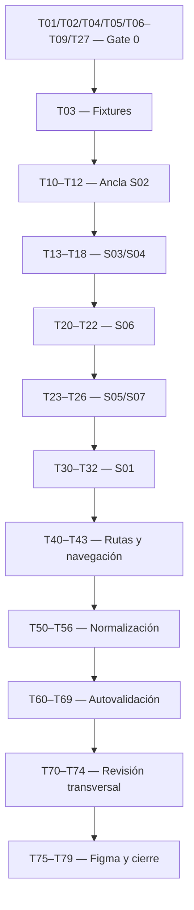

# Tasks — MK-003

> **Propósito y rol documental:** unidades de trabajo ejecutables, trazables y verificables para [plan.md](plan.md). [component-spec.md](component-spec.md) define qué debe existir; estas tareas no duplican su diseño. Se registran como trabajo futuro, sin acreditar implementación o aprobación.

## 1. Identificación

- **Mockup:** MK-003 · **Funcionalidad:** `productos_crud`.
- **Responsable:** Gabriel Poma Gutierrez · **Rama funcional:** `poma`.
- **Plan de referencia:** [plan.md](plan.md), v0.2.
- **Component Spec:** [component-spec.md](component-spec.md), v0.2.
- **Fecha:** 2026-10-03.
- **Baseline documental:** UX 2.0, [DS](../DESIGN.md) 1.0.0, OpenAPI HTTP 0.5.0 y AsyncAPI 0.4.0.
- **Estado general:** Pendiente; dependencias conocidas `BLOCKED` en §9. No hay tareas de implementación marcadas DONE.

## 2. Convenciones y reglas de ejecución

### Prioridades

- `P0`: obligatorio para alcance mínimo/gates; incluye estados críticos, revisión y cierre.
- `P1`: refinamiento requerido; no se omite si figura como hallazgo importante de revisión.
- `P2`: mejora incremental no bloqueante; no hay tareas P2 en esta versión.

### Estados de tarea

- `TODO`: pendiente de iniciar.
- `DOING`: trabajo en ejecución.
- `BLOCKED`: impedimento documentado, sin sustitución por datos/comandos inventados.
- `REVIEW`: salida lista, pendiente de verificación.
- `DONE`: verificación satisfecha con evidencia objetiva.

### Reglas obligatorias de ejecución

1. Cada tarea contiene **Entrada / Acción / Salida esperada / Verificación** y solo pasa a DONE con evidencia comprobable.
2. Registrar bloqueos y resolución en §9; una dependencia resuelta no marca automáticamente DONE la tarea de implementación.
3. Conservar trazabilidad `Task → Pantalla/estado → Fuente/UXG → Fixture/ruta → Evidencia → Resultado` en el validation-report futuro.
4. Respetar restricciones del plan §2. No modificar otras funcionalidades/fuentes oficiales, inventar HTTP, campos, moneda, permisos o tema/router por MK.
5. Los escenarios FUNCIONAL de component-spec §13 no son respuestas HTTP ni cierran gates mientras falte su fuente/operación.
6. Revisión de Leonardo Vera y Figma ocurren después de autovalidación; no solicitar/publicar cambios externos desde la preparación documental.

### Dependencias principales

El diagrama representa el cierre del alcance completo; análisis y tareas sin dependencia bloqueada pueden avanzar. T20 admite booleanos/ausencia publicados; T21 exige resolver Q-02/Q-03. T13/T16/T18/T30 dependen de Q-01; T12 de moneda Q-04; físico parcial persistido de Q-05. T13 y los fixtures/verificaciones de corrección del tipo dependen también de Q-06/T27; no se aprueba S03 con esa discrepancia abierta.

## 3. Preparación

- [ ] **MK-003-T01 — P0 — Confirmar fuentes y versiones vigentes** `[TODO]`
  - **Entrada:** plan §§2–3, component-spec §2, UX/DS/contratos.
  - **Acción:** contrastar fuentes, versiones independientes y condiciones del gate transversal #59+#60.
  - **Salida esperada:** baseline documental registrada para MK003.
  - **Verificación:** enlaces/IDs válidos; cambios de fuente identificados y ninguna discrepancia ignorada.

- [ ] **MK-003-T02 — P0 — Alinear lectura administrativa de producto** `[BLOCKED]`
  - **Entrada:** component-spec Q-01; GET `/productos` y detalle comercial de OpenAPI 0.5.0.
  - **Acción:** acordar con integración la fuente oficial de estado, versión, físico y lectura de borradores/inactivos, sin modificar el contrato por inferencia.
  - **Salida esperada:** referencia contractual administrativa documentada y aprobada por responsables.
  - **Verificación:** S01/S03/S04 y relectura de versión pueden consumir datos publicados; `ProductoDetalleComercial` no se completa artificialmente.

- [ ] **MK-003-T03 — P0 — Preparar fixtures deterministas** `[TODO]`
  - **Entrada:** component-spec §13 y resoluciones contractuales de tareas dependientes.
  - **Acción:** crear datasets/scenarios en `mockups/prototipo/src/pantallas/MK003/fixtures/`, separando requests/responses HTTP, UI y evidencia funcional; fijar IDs/fechas ficticias donde sean requeridos.
  - **Salida esperada:** catálogo de fixtures importable, reproducible y sin datos personales reales.
  - **Verificación:** cada estado P0 tiene fixture/ruta y fuente; campos ausentes no se inventan y inputs físicos parciales no se tipan como responses completos.

- [ ] **MK-003-T04 — P0 — Disponer de baseline común de prototipo** `[BLOCKED]`
  - **Entrada:** [prototipo README](../prototipo/README.md); en esta revisión solo existe ese archivo.
  - **Acción:** coordinar disponibilidad del entorno compartido con React/TypeScript/Mantine/Tabler, tema, routing y mecanismo de escenarios.
  - **Salida esperada:** aplicación común ejecutable y versiones/lockfile registrados.
  - **Verificación:** se puede construir bajo `src/pantallas/MK003/` sin aplicación/tema/router nuevos exclusivos del MK.

- [ ] **MK-003-T05 — P0 — Confirmar Component Spec, plan, ancla y mapa DS** `[TODO]`
  - **Entrada:** component-spec §§5/8/11/14/15; plan §§5–6/8/13; resoluciones T02/T06–T09/T27.
  - **Acción:** revisar inventario, LUX-01–03, criterios, ancla S02 y variantes/tokens del DS; registrar aprobación documental antes de construir alcance dependiente.
  - **Salida esperada:** especificación/plan aprobados y mapa DS-C→pantalla.
  - **Verificación:** sin Q bloqueantes abiertas para el alcance autorizado y siete pantallas/rutas consistentes; no aprobación implícita por este checklist.

- [ ] **MK-003-T06 — P0 — Alinear lectura de preparación por dominio e hijos activos** `[BLOCKED]`
  - **Entrada:** Q-02, `ProductoDetalle`/`Variante`, FLOW-003 §5 y AsyncAPI 0.4.0.
  - **Acción:** acordar fuente publicada para resultados/causas y preparación de cada variante activa del padre.
  - **Salida esperada:** datos de preparación verificables con alcance por dependencia/SKU.
  - **Verificación:** `false` no se interpreta como rejected; ausencia no se interpreta como pending; preparación detallada no se deduce de un estado comercial.

- [ ] **MK-003-T07 — P0 — Formalizar operación de reintento administrativo** `[BLOCKED]`
  - **Entrada:** Q-03, FLOW-003 §§4.2–4.3, UXG-013 y AsyncAPI.
  - **Acción:** coordinar operación oficial que preserve identidad y solo reintente dependencias pendientes/rechazadas.
  - **Salida esperada:** operación/semántica contractual trazable para el control de recuperación.
  - **Verificación:** no endpoint inventado ni publicación desde navegador; operación completada no se repite, alta/precio/SKU no se duplican.

- [ ] **MK-003-T08 — P0 — Confirmar moneda del alta de Pricing** `[BLOCKED]`
  - **Entrada:** Q-04, `ProductoCreateRequest`, comando `pricing.product.initialization.requested` y Contrato API §31.6.
  - **Acción:** confirmar con Pricing/integración la fuente de moneda que acompaña `precioBaseInicial` sin agregar un campo no publicado al request.
  - **Salida esperada:** moneda del entorno/contrato conocida para el alta y su representación.
  - **Verificación:** PEN solo fixture; no default, restricción de moneda o desglose tributario inferido.

- [ ] **MK-003-T09 — P0 — Alinear lectura de perfil parcial de borrador** `[BLOCKED]`
  - **Entrada:** Q-05, `PerfilFisicoInput`, `DatosFisicosSku`, SPEC-003 §6.
  - **Acción:** acordar representación administrativa del perfil incompleto persistido y coordinar con MK-004 Q-04.
  - **Salida esperada:** lectura/edición del perfil parcial con fuente formal.
  - **Verificación:** no fecha/medida inventadas para satisfacer esquema completo; null no se transforma en cero.

- [ ] **MK-003-T27 — P0 — Alinear SPEC-010 y OpenAPI para la corrección del tipo** `[BLOCKED]`
  - **Entrada:** component-spec Q-06; SPEC-010 §4, Requisito 10; `ProductoUpdateRequest` de OpenAPI 0.5.0; plan Gate 0 para S03 y Q-01/T02 para lectura de precondiciones.
  - **Acción:** acordar con Taxonomía/integración API si se amplía el request administrativo con `tipoProductoId` o se ajusta SPEC-010; obtener resolución oficial y fuente verificable de BORRADOR, ausencia de variantes y ausencia de identidad comercial publicada, sin decidir el contrato desde el mockup.
  - **Salida esperada:** regla funcional y request administrativo oficialmente alineados, con referencia de resolución y precondiciones trazables para S03; component-spec/plan/tasks actualizados según esa decisión.
  - **Verificación:** no read-only universal impuesto ni envío por `additionalProperties`; los casos elegible, no elegible y no verificable tienen regla/fuente acordadas. El cambio con variantes o identidad publicada no se convierte en corrección ordinaria, y no reescribe identidades SKU ni snapshots históricos.

## 4. Implementación por pantalla

### MK-003-S02 — Crear producto (ancla)

- [ ] **MK-003-T10 — P0 — Implementar estructura y componentes de S02** `[TODO]`
  - **Entrada:** component-spec §§8–10, C01–C03, T03–T05.
  - **Acción:** componer grupos del formulario, maestros, modelo e imagen/físico con DS.
  - **Salida esperada:** `/MK003/S02` accesible directamente, con modelo simple/con variantes.
  - **Verificación:** jerarquía completa, físico solo simple y sin wizard, estado editable o campo contractual inventado.

- [ ] **MK-003-T11 — P0 — Implementar validaciones del borrador y errores de alta** `[TODO]`
  - **Entrada:** SPEC-003 §§2/6, `ProductoCreateRequest`, fixtures `create-empty`, `create-partial-physical`, `create-invalid-physical`, `create-duplicate-sku`, `create-invalid-master`.
  - **Acción:** validar mínimos/precio positivo, maestros, SKU y valores informados; localizar errores preservando entradas.
  - **Salida esperada:** borrador incompleto permitido y errores corregibles del alta.
  - **Verificación:** no exige imagen/características/físico completos para alta; cero/negativo sí rechazado; categoría no impone tipo/atributos.

- [ ] **MK-003-T12 — P0 — Implementar guardado del alta y salida a preparación** `[TODO]`
  - **Entrada:** FLOW-003 §4.1, POST/`201 ProductoDetalle`, T08, fixtures de alta simple/padre, `saving`, `write-unknown`.
  - **Acción:** simular request/respuesta acordados, bloqueo de doble envío y transición al borrador persistido.
  - **Salida esperada:** S02→S06 con mismo producto BORRADOR y contexto.
  - **Verificación:** `201` no activa ni acredita dependencias; error conserva formulario y timeout no ejecuta segundo POST automático.

### MK-003-S03 — Editar producto

- [ ] **MK-003-T13 — P0 — Implementar edición y corrección condicionada del tipo** `[TODO]`
  - **Entrada:** T02/T09/T27, request de edición oficialmente alineado, component-spec S03/C01–C03 y fixtures `edit-type-correction-eligible`, `edit-type-correction-ineligible`, `edit-type-correction-unverifiable`.
  - **Acción:** reutilizar grupos del ancla y restringir campos al request publicado; aplicar a la corrección del tipo la regla resuelta por Q-06, verificando sus precondiciones con fuente administrativa.
  - **Salida esperada:** `/MK003/S03` con datos editables, SKU/modelo copiable en lectura y tipo según elegibilidad confirmada; sin asumir elegibilidad por BORRADOR únicamente.
  - **Verificación:** PATCH no contiene precio inicial, cambio de SKU/modelo o creación de variantes; mismo `product_id`. No se envía `tipoProductoId` antes de su formalización; la excepción de SPEC-010 y los casos no elegibles/no verificables siguen la resolución oficial de Q-06, sin migración de modelo desde S03.

- [ ] **MK-003-T14 — P0 — Implementar rechazo activo y cambio de categoría** `[TODO]`
  - **Entrada:** SPEC-003 §7, SPEC-010 §4; fixtures `edit-active-rejected`, `category-change` y lectura del esquema del tipo.
  - **Acción:** representar resultado inválido del activo y categoría cambiada manteniendo tipo; atender nuevas obligaciones del esquema antes de guardado.
  - **Salida esperada:** propuesta preservada y datos/estado persistidos anteriores intactos ante rechazo.
  - **Verificación:** no inactivación automática, no compatibilidad categoría→tipo fija ni checkbox obligatorio de declaración de identidad.

- [ ] **MK-003-T15 — P0 — Implementar guardado de edición y conflicto de versión** `[TODO]`
  - **Entrada:** PATCH/`200`, `VERSION_CONFLICT`, T02, fixtures `edit-default`, `edit-version-conflict`, `saving`, `write-unknown`.
  - **Acción:** usar versión leída, mantener intención y permitir revisar datos actuales antes de nueva confirmación.
  - **Salida esperada:** guardado confirmado lleva a S04; conflicto permanece en S03 con recuperación trazable.
  - **Verificación:** no versión fabricada ni sobrescritura/reenvío automático; no repetición de alta/inicializaciones completadas.

### MK-003-S04 — Detalle del producto

- [ ] **MK-003-T16 — P0 — Implementar detalle simple/padre y estados de lectura** `[TODO]`
  - **Entrada:** T02, component-spec S04, fixtures `detail-simple-active`, `detail-parent-inactive`, `product-not-found`.
  - **Acción:** componer datos persistidos, estado, imagen, atributos y físico/resumen de hijos; incorporar carga y error de región.
  - **Salida esperada:** `/MK003/S04` completo y reproducible.
  - **Verificación:** sin saldo/perfil del padre, precio agregado o estado inventado a partir de respuesta comercial.

- [ ] **MK-003-T17 — P0 — Implementar acciones según estado y vínculo a variantes** `[TODO]`
  - **Entrada:** component-spec §§6/10 S04, SPEC-003 §7 y contrato documental MK-004.
  - **Acción:** enlazar editar, preparación, confirmaciones y gestionar variantes con padre seleccionado.
  - **Salida esperada:** destinos S03/S05/S06/S07/MK-004-S01 coherentes.
  - **Verificación:** estado ACTIVO no garantiza canal; reactivar padre no reactiva hijos ni viceversa; sin activar automático.

- [ ] **MK-003-T18 — P0 — Implementar actualización segura del detalle** `[TODO]`
  - **Entrada:** T02, UXG-008/012/017, estados loading/error del detalle.
  - **Acción:** refrescar lectura respaldada conservando última información identificada y separando fallos parciales solo con fuentes independientes.
  - **Salida esperada:** resultado actual o aviso de última consulta, sin vaciar datos válidos.
  - **Verificación:** fallo no produce borrado, cero, timestamp ficticio ni evidencia nueva de preparación.

### MK-003-S06 — Preparación del producto

- [ ] **MK-003-T20 — P0 — Implementar preparación con indicadores publicados** `[TODO]`
  - **Entrada:** C04/S06 y fixtures `prep-confirmed`, `prep-unconfirmed`, `prep-unavailable`, `prep-partial`.
  - **Acción:** distinguir true, false y ausencia por dependencia y conservar borrador/resultados confirmados.
  - **Salida esperada:** `/MK003/S06` con feedback persistente y acciones respaldadas.
  - **Verificación:** false solo «Preparación no confirmada»; ausente «No disponible»; éxito de precio no completa inventario.

- [ ] **MK-003-T21 — P0 — Implementar estados detallados y reintento formalizado** `[TODO]`
  - **Entrada:** T06/T07 cerradas, FLOW-003 §§4.2–4.3, fixtures `prep-pending`/`prep-rejected` con evidencia de operación.
  - **Acción:** conectar simulación de la fuente/operación oficial acordadas y recuperación de la dependencia afectada.
  - **Salida esperada:** pendiente/rechazo/completado verificables y recuperación idempotente.
  - **Verificación:** misma operación/producto/SKU, sin repetir completada; ningún endpoint o campo HTTP inventado. Mantener BLOCKED si falta fuente/comando.

- [ ] **MK-003-T22 — P0 — Implementar preparación del padre por hijos activos** `[TODO]`
  - **Entrada:** T06, SPEC-003 §5 y SPEC-004; fixtures `parent-no-active-variants`, `parent-active-and-draft-child`.
  - **Acción:** mostrar precio del padre y requisitos de unidades vendibles; navegación a MK-004.
  - **Salida esperada:** al menos una activa preparada y revisión de todas las activas, sin inventario propio del padre.
  - **Verificación:** hijo borrador/inactivo rechazado no bloquea por sí solo; detalle de preparación de cada activa con fuente publicada.

### MK-003-S05 — Confirmar activación o reactivación

- [ ] **MK-003-T23 — P0 — Implementar confirmación y requisitos** `[TODO]`
  - **Entrada:** T02/T06, component-spec S05/C04/C05, fixtures de requisitos y reactivación.
  - **Acción:** componer modal directo con producto/acción/impacto y checklist según simple/padre.
  - **Salida esperada:** `/MK003/S05` en escenarios BORRADOR/INACTIVO con cancelación segura.
  - **Verificación:** mínimos/maestros/atributos/imagen/precio/físico o hijos activos comprobables; no envío cuando requisito conocido incumplido.

- [ ] **MK-003-T24 — P0 — Implementar resultado de activación/reactivación** `[TODO]`
  - **Entrada:** POST activar/reactivar y `EstadoMutationRequest`, fixtures `activate-success`, `activate-missing-requirements`, `reactivate-parent`, `write-unknown`.
  - **Acción:** representar loading, `200`, `422`, `409` y respuesta desconocida con conservación de estado.
  - **Salida esperada:** ACTIVO solo tras confirmación o permanencia con motivos y acción disponible.
  - **Verificación:** reactivación mantiene identidad y no activa hijos inactivos; sin retry automático tras timeout.

### MK-003-S07 — Confirmar desactivación

- [ ] **MK-003-T25 — P0 — Implementar confirmación de baja lógica** `[TODO]`
  - **Entrada:** FLOW-003 §4.5, component-spec S07/C05, `deactivate-parent`/`cancel-confirmation`.
  - **Acción:** componer modal directo con SKU/nombre, conservación de definición e impacto sobre variantes.
  - **Salida esperada:** `/MK003/S07`, cancelar y Desactivar producto accesibles.
  - **Verificación:** cancelar no muta; foco inicial seguro, contenido/restauración de foco y acción destructiva DS.

- [ ] **MK-003-T26 — P0 — Implementar confirmación, rechazo y efecto de baja** `[TODO]`
  - **Entrada:** POST desactivar/`200 ProductoDetalle`, SPEC-003 §7, fixtures `deactivate-parent`, `saving`, `write-unknown`.
  - **Acción:** aplicar INACTIVO solo tras resultado; representar error/timeout y bloqueo comercial de hijos con estados conservados.
  - **Salida esperada:** S04 actualizado con misma identidad o estado anterior si cambio no confirmado.
  - **Verificación:** no eliminación física, cascada de estados de hijos, espera inventada tras `200` ni llamada directa a consumidores RabbitMQ.

### MK-003-S01 — Productos

- [ ] **MK-003-T30 — P0 — Implementar estructura, tabla y acciones del listado** `[TODO]`
  - **Entrada:** T02, component-spec S01/C04, fixture `list-default` y DS tabla/badges/acciones.
  - **Acción:** componer columnas de producto/SKU/modelo/estado/acciones y creación.
  - **Salida esperada:** `/MK003/S01` reproducible con dataset administrativo oficial alineado.
  - **Verificación:** no estado/versión/preparación agregado a proyección comercial, selección masiva, saldo o precio ficticio del padre.

- [ ] **MK-003-T31 — P0 — Implementar búsqueda, filtros y paginación admitidos** `[TODO]`
  - **Entrada:** GET productos, component-spec §2.1/S01, UXG-001/006, `PaginaProductosComercial` y lectura administrativa alineada T02.
  - **Acción:** usar q/categoría/marca/estado, orden por nombre y página/tamaño contractuales; ignorar respuestas antiguas.
  - **Salida esperada:** filtros aplicados visibles y retorno con consulta/página válidas.
  - **Verificación:** sin `tipoProductoId` como filtro inventado, orden por precio ni búsqueda global SKU prometida; tamaño 1–100 y página ≥1.

- [ ] **MK-003-T32 — P0 — Implementar estados alternativos del listado** `[TODO]`
  - **Entrada:** fixtures `list-loading`, `list-empty`, `list-no-results`, `list-error`; UXG-007/011/017.
  - **Acción:** distinguir carga inicial, catálogo vacío, filtro sin coincidencias y consulta fallida.
  - **Salida esperada:** estados de región accionables, contexto preservado.
  - **Verificación:** vacío ofrece crear; sin coincidencias permite limpiar; error conserva filtros y no se transforma en cero/vacío.

### Navegación y escenarios integrales

- [ ] **MK-003-T40 — P0 — Resolver todas las rutas directas y fixtures** `[TODO]`
  - **Entrada:** inventario §5/fixtures §13 del component-spec y prototipo README.
  - **Acción:** registrar S01–S07 en router común y mecanismo determinista de estados; diálogos con detalle subyacente.
  - **Salida esperada:** siete rutas inspeccionables sin historial previo ni hostname/puerto fijo.
  - **Verificación:** cada ruta carga por separado con identidad/escenario válido; ID documental/ruta estrictamente sincronizados.

- [ ] **MK-003-T41 — P0 — Conectar FLOW-003 y retorno desde MK-004** `[TODO]`
  - **Entrada:** component-spec §6, FLOW-003/004 y rutas del prototipo.
  - **Acción:** recorrer alta→preparación→edición→activación, baja/reactivación y vínculo padre→variantes→padre.
  - **Salida esperada:** navegación completa, cancelaciones y retornos sin rutas huérfanas.
  - **Verificación:** conserva identidad y filtros/página; sin crear o sustituir variante desde formulario del padre.

- [ ] **MK-003-T42 — P0 — Conservar trabajo al salir o ante fallo corregible** `[TODO]`
  - **Entrada:** UXG-002, formularios S02/S03 y escenarios de guardado fallido.
  - **Acción:** implementar aviso de salida modificado, continuar editando/descartar y errores sin limpiar entradas.
  - **Salida esperada:** trabajo compatible preservado y descarte explícito.
  - **Verificación:** cancelar navegación mantiene valores; cambiar modelo no descarta físico compatible silenciosamente; lectura y propuesta diferenciadas.

- [ ] **MK-003-T43 — P0 — Verificar recuperación de escritura desconocida** `[TODO]`
  - **Entrada:** fixture `write-unknown`, UXG-013, fuentes alineadas T02/T07.
  - **Acción:** representar timeout de alta/edición/estado y consultar/reconciliar según capacidad publicada antes de repetir.
  - **Salida esperada:** sin doble efecto ni falsa confirmación/rechazo definitivo.
  - **Verificación:** si alta no devolvió ID ni mecanismo de reconciliación, no se promete recuperarlo con una búsqueda/endpoint inventados ni se reenvía automáticamente.

## 5. Normalización

- [ ] **MK-003-T50 — P0 — Normalizar arquitectura y tipos** `[TODO]`
  - **Entrada:** código MK003, plan §9 y baseline común.
  - **Acción:** modularizar pantallas/composiciones/fixtures y separar tipos comerciales/administrativos/estados UI.
  - **Salida esperada:** React/TypeScript/Mantine compartidos, sin infraestructura MK paralela.
  - **Verificación:** build y comprobación de tipos sin errores/warnings atribuibles al MK; warnings preexistentes registrados.

- [ ] **MK-003-T51 — P0 — Normalizar color y estados semánticos** `[TODO]`
  - **Entrada:** DESIGN §4.1/§6 y componentes construidos.
  - **Acción:** sustituir valores arbitrarios por roles de tema central.
  - **Salida esperada:** tokens/contrastes coherentes en default, foco, error, loading y disabled.
  - **Verificación:** sin blanco sobre primary vivo ni preparación/estado comunicado solo por color.

- [ ] **MK-003-T52 — P0 — Normalizar layout, spacing, radios y capas** `[TODO]`
  - **Entrada:** DESIGN §§4.3–5/7–9, component-spec §12.
  - **Acción:** aplicar shell, 880 px de formulario máximo, gaps/tamaños DS y capas de diálogos/footer.
  - **Salida esperada:** composición desktop uniforme.
  - **Verificación:** no overflow de página, fuentes cortadas, estilos inline huérfanos o footer que cubra contenido.

- [ ] **MK-003-T53 — P0 — Aplicar tipografía centralizada** `[TODO]`
  - **Entrada:** DESIGN §4.2; S01–S07.
  - **Acción:** usar Oswald H1–H3 e Inter operativa, unidades y cifras tabulares pertinentes.
  - **Salida esperada:** jerarquía consistente con DS.
  - **Verificación:** SKU/estados/errores legibles; fuentes cargadas y fallbacks revisados sin recortes.

- [ ] **MK-003-T54 — P0 — Normalizar iconografía** `[TODO]`
  - **Entrada:** DESIGN §4.6 y acciones/feedback.
  - **Acción:** utilizar Tabler 16/20/24 según rol y nombres accesibles en acciones solo icono.
  - **Salida esperada:** iconos DS con texto cuando sea necesario.
  - **Verificación:** sin set adicional, click suelto sin botón o icono como única información crítica.

- [ ] **MK-003-T55 — P1 — Ajustar copy y eliminar detalles internos visibles** `[TODO]`
  - **Entrada:** microtexto component-spec §10, DESIGN §13, UXG-020.
  - **Acción:** revisar labels/CTAs y mensajes de ocurrido/conservado/acción disponible.
  - **Salida esperada:** lenguaje de negocio consistente.
  - **Verificación:** no nombres de eventos/endpoints/tablas, `operation_id`, `price_version` ni códigos como mensaje principal; sin afirmación tributaria/canal inventada.

- [ ] **MK-003-T56 — P0 — Normalizar semántica, teclado y foco** `[TODO]`
  - **Entrada:** DESIGN §12, UXG-021, todas las pantallas/diálogos.
  - **Acción:** asociar labels/ayudas/errores, ordenar Tab y gestionar foco/aria-live/modal.
  - **Salida esperada:** navegación accesible con foco perceptible/restaurado y estado textual.
  - **Verificación:** completar tareas con teclado; diálogo no interactúa con fondo; error se reconoce sin color y foco no queda cubierto.

## 6. Autovalidación local (Owner funcional)

- [ ] **MK-003-T60 — P0 — Validar SPEC y ownership** `[TODO]`
  - **Entrada:** SPEC-003/004/009/010, component-spec §15, fixtures y código.
  - **Acción:** comprobar reglas de borrador/activación, identidad y reparto Catálogo/Pricing/Inventario; verificar corrección del tipo de SPEC-010 §4, Requisito 10 contra la resolución Q-06/T27.
  - **Salida esperada:** matriz fuente→pantalla/estado→evidencia.
  - **Verificación:** cero reglas nuevas; no precio/saldo/empaque/pedido incorporados indebidamente; corrección del tipo con condiciones verificadas, sin read-only absoluto impuesto ni modificación de SKU/snapshots.

- [ ] **MK-003-T61 — P0 — Validar HU-003 CA-01–CA-15** `[TODO]`
  - **Entrada:** HU-003 y tabla de cobertura inferior.
  - **Acción:** verificar cada criterio con fixture/recorrido, separando conducta UI de evidencia de integración no ejecutada.
  - **Salida esperada:** criterio con PASS o hallazgo trazable; ninguna cobertura declarada por inferencia.
  - **Verificación:** todos los CA demostrados en su alcance y ninguna Q requerida abierta al aprobar.

- [ ] **MK-003-T62 — P0 — Validar correspondencia WF** `[TODO]`
  - **Entrada:** WF-003, inventario S01–S07 y antecedente interactivo.
  - **Acción:** contrastar estructura, contenido y confirmaciones con fuentes vigentes.
  - **Salida esperada:** siete pantallas completas sin heredar controles ilustrativos no normativos.
  - **Verificación:** lista/alta/edición/detalle/preparación/confirmaciones presentes, sin restricciones de categoría o checkbox de identidad inventados.

- [ ] **MK-003-T63 — P0 — Validar FLOW y contratos HTTP/AsyncAPI** `[TODO]`
  - **Entrada:** FLOW-003/004, OpenAPI/AsyncAPI, tareas T40–T43 y resolución Q-06/T27 con fixtures de corrección del tipo.
  - **Acción:** recorrer caminos éxito/rechazo/timeout y auditar request/response/resultados por dependencia.
  - **Salida esperada:** transiciones y operaciones trazables, sin rutas huérfanas.
  - **Verificación:** `requested` no completa; eventos documentan transporte interno, no operación UI; respuesta `200` no recibe espera ficticia; request de corrección del tipo coincide con el contrato alineado, sin propiedad inferida por `additionalProperties`.

- [ ] **MK-003-T64 — P0 — Validar UX Guidelines aplicables** `[TODO]`
  - **Entrada:** UXG-001–013/017–018/020–022 y fixtures.
  - **Acción:** comprobar contexto, revelación, carga, error/ausencia/parcial/confirmación y recuperación segura.
  - **Salida esperada:** evidencia por regla/pantalla/estado.
  - **Verificación:** sin regla aplicable omitida; UXG exclusivas de otras capacidades no generan controles nuevos.

- [ ] **MK-003-T65 — P0 — Validar UX Decisions y propuesta integral** `[TODO]`
  - **Entrada:** UX-P01/P02/P03, UXD de component-spec y matriz de aplicabilidad.
  - **Acción:** comprobar estado verificable, complejidad pertinente y conservación de lo confirmado.
  - **Salida esperada:** justificación fuente→UXD/UXG→pantalla documentada.
  - **Verificación:** sin propuesta UX paralela, drawer/wizard/toast universales o éxito anticipado.

- [ ] **MK-003-T66 — P0 — Validar decisiones locales** `[TODO]`
  - **Entrada:** component-spec LUX-01–03 y recorridos correspondientes.
  - **Acción:** contrastar alternativas, decisión, trade-off y criterio objetivo.
  - **Salida esperada:** decisiones verificadas o hallazgos justificados.
  - **Verificación:** LUX no modifica negocio/contrato ni repite una nueva regla transversal sin promoción.

- [ ] **MK-003-T67 — P0 — Validar fidelidad DS** `[TODO]`
  - **Entrada:** DESIGN 1.0.0, T50–T56, mapa DS.
  - **Acción:** inspeccionar variantes/tokens/estados y contrastes efectivos.
  - **Salida esperada:** Gate C evidenciado.
  - **Verificación:** sin tokens/componentes compartidos duplicados, estilos huérfanos o contraste atribuido sin revisión.

- [ ] **MK-003-T68 — P0 — Validar desktop y accesibilidad práctica** `[TODO]`
  - **Entrada:** S01–S07 con contenido largo/errores, 1440×900 de referencia.
  - **Acción:** revisar overflow, texto ampliado, teclado, foco, labels y anuncios.
  - **Salida esperada:** Gate D con capturas y recorrido registrado.
  - **Verificación:** ninguna acción/mensaje/SKU requerido truncado ni foco oculto; sin variantes mobile/tablet.

- [ ] **MK-003-T69 — P0 — Registrar autovalidación y hallazgos** `[TODO]`
  - **Entrada:** tareas T60–T68 y [validation-report.template.md](../_plantillas/mockup/validation-report.template.md).
  - **Acción:** crear validation-report futuro y registrar Task→Pantalla→Fixture/ruta→Evidencia→Resultado, Gates A–D y bloqueos.
  - **Salida esperada:** reporte local revisable con evidencias y versiones reales.
  - **Verificación:** cero bloqueantes/importantes requeridos abiertos antes de solicitar visto bueno; no PASS basado solo en documentación o fixture funcional pendiente.

### Cobertura de criterios de HU-003

| Criterios | Pantallas / fixtures principales | Tareas de construcción / verificación |
|---|---|---|
| CA-01/02/03 | S02/S06; `create-simple-draft`, `create-duplicate-sku` | T10–T12, T60–T61 |
| CA-04/10 | S02/S04/S06; `create-variant-parent`, `parent-active-and-draft-child` | T10/T16/T22, T60–T61 |
| CA-05/06/07 | S06; `prep-pending`, `prep-rejected`, `prep-confirmed` | T06–T08/T20–T21, T63 |
| CA-08/09 | S05/S06; requisitos padre, preparación parcial/rechazada | T20–T24, T60–T61 |
| CA-11/12 | S02/S03/S04; perfil parcial/completo/inválido | T09–T11/T13/T16, T60/T63; consulta física externa se valida documentalmente sin nueva pantalla |
| CA-13 | S07; `deactivate-parent`, `cancel-confirmation` | T25–T26, T61/T63 |
| CA-14 | S03; `edit-active-rejected`, `edit-version-conflict`, `category-change` | T13–T15, T61 |
| CA-15 | S04/S05/S07 + MK-004; `reactivate-parent`, `detail-parent-inactive` | T17/T22/T24/T26/T41, T61/T63 |

El mockup comprueba la interacción y la simulación acordada, no certifica idempotencia o fan-out de servicios reales. La validación de integración requiere evidencia de backend/contratos fuera de esta construcción visual.

Cobertura complementaria de SPEC-010 (sin añadir criterios a HU-003): §4, Requisito 10 se verifica en S03 con `edit-type-correction-eligible`, `edit-type-correction-ineligible` y `edit-type-correction-unverifiable`, mediante T27/T13/T60/T63. Esta cobertura sigue bloqueada por Q-06 hasta contar con fuentes oficialmente alineadas.

## 7. Revisión transversal y visto bueno

- [ ] **MK-003-T70 — P0 — Confirmar readiness de revisión transversal** `[TODO]`
  - **Entrada:** validation-report, T69 y plan Gates A–D.
  - **Acción:** comprobar autovalidación, enlaces de evidencias y resolución de bloqueos requeridos.
  - **Salida esperada:** entrega revisable con versión identificada.
  - **Verificación:** cero hallazgos requeridos abiertos; todas las rutas/fixtures P0 inspeccionables.

- [ ] **MK-003-T71 — P0 — Solicitar revisión a Leonardo Vera Rodríguez** `[TODO]`
  - **Entrada:** T70 y reporte/versiones/rutas.
  - **Acción:** el owner presenta formalmente la versión autovalidada y evidencia según pipeline.
  - **Salida esperada:** revisión transversal sobre versión concreta.
  - **Verificación:** responsable y alcance de revisión registrados; no solicitar antes de readiness.

- [ ] **MK-003-T72 — P0 — Corregir hallazgos bloqueantes/importantes requeridos** `[TODO]`
  - **Entrada:** observaciones del revisor.
  - **Acción:** corregir cada hallazgo, actualizar evidencia afectada y someter a reinspección.
  - **Salida esperada:** observaciones requeridas cerradas.
  - **Verificación:** cierre confirmado por revisión; sin declarar resuelto un hallazgo por ocultar control/dato.

- [ ] **MK-003-T73 — P0 — Obtener visto bueno formal** `[TODO]`
  - **Entrada:** revisión y correcciones cerradas.
  - **Acción:** obtener confirmación formal de Leonardo Vera sobre versión inspeccionada.
  - **Salida esperada:** visto bueno fechado para Figma.
  - **Verificación:** evidencia explícita del revisor, sin inferir aprobación de ausencia de comentarios.

- [ ] **MK-003-T74 — P0 — Registrar APROBADO PARA FIGMA** `[TODO]`
  - **Entrada:** T73.
  - **Acción:** registrar estado, fecha, versión y evidencia en revisión transversal del validation-report.
  - **Salida esperada:** Gate E completo, versión de referencia fijada.
  - **Verificación:** visto bueno real y cero bloqueantes/importantes requeridos abiertos.

## 8. Figma y cierre

- [ ] **MK-003-T75 — P0 — Trasladar versión con visto bueno a Figma** `[TODO]`
  - **Entrada:** T74 y versión exacta aprobada para Figma.
  - **Acción:** representar pantallas/componentes/estados y contenido con variables/styles DS.
  - **Salida esperada:** diseño Figma de la versión aprobada.
  - **Verificación:** sin nuevas reglas/campos/tokens ni divergencias ocultas de biblioteca central.

- [ ] **MK-003-T76 — P0 — Verificar fidelidad punto por punto** `[TODO]`
  - **Entrada:** prototipo con visto bueno y frames Figma.
  - **Acción:** comparar layout, fuentes, tokens, variantes, copy, fixtures y estados.
  - **Salida esperada:** matriz de fidelidad y correcciones cerradas.
  - **Verificación:** todas las comprobaciones requeridas PASS sobre misma versión.

- [ ] **MK-003-T77 — P0 — Confirmar siete pantallas y estados P0 en Figma** `[TODO]`
  - **Entrada:** inventario component-spec §5, estados plan §10 y frames.
  - **Acción:** comprobar S01–S07, activar/reactivar y casos simple/padre requeridos.
  - **Salida esperada:** cobertura completa del diseño aprobado.
  - **Verificación:** ningún diálogo, modo o estado requerido omitido.

- [ ] **MK-003-T78 — P0 — Registrar enlace canónico de Figma** `[TODO]`
  - **Entrada:** archivo/frames realmente disponibles y validados.
  - **Acción:** guardar enlace y versión de referencia en validation-report.
  - **Salida esperada:** acceso a evidencia final.
  - **Verificación:** enlace abre la versión correcta; sin URL placeholder.

- [ ] **MK-003-T79 — P0 — Cerrar Quality Gates y resultado general** `[TODO]`
  - **Entrada:** Gates A–F, T69/T74/T76–T78, registro de bloqueos.
  - **Acción:** comprobar todos los gates y registrar resultado general APROBADO.
  - **Salida esperada:** validation-report completo y tareas verificadas cerradas.
  - **Verificación:** ningún bloqueo/hallazgo requerido abierto, Figma fiel y aprobación explícita; no cerrar por terminar solo documentación.

## 9. Registro de bloqueos

Impedimentos identificados en revisión de fuentes del 2026-10-02 y corrección Q-06 del 2026-10-03. Las tareas de alineación/baseline están BLOCKED; las de implementación dependientes permanecen TODO hasta cumplir su entrada. Solo registrar una resolución cuando exista evidencia oficial, no un fixture sustituto.

| Tarea | Fecha | Causa del bloqueo | Fuente / documento a resolver | Responsable de resolución | Condición de desbloqueo | Estado |
|---|---|---|---|---|---|---|
| MK-003-T02 | 2026-10-02 | GET comercial sin estado/versión/perfil administrativo | OpenAPI 0.5.0, Q-01; extensión Contrato API | Gabriel Poma + integración API/BFF | Lectura administrativa publicada/coherente | Activo |
| MK-003-T04 | 2026-10-02 | Prototipo solo tiene README; no baseline ejecutable | prototipo README; plan Gate 0 | Responsable del entorno común; coordina Gabriel Poma | App/tema/router/fixtures compartidos disponibles | Activo |
| MK-003-T06 | 2026-10-02 | Booleanos opcionales sin ciclo/causa; variantes sin preparación publicada | OpenAPI/AsyncAPI, Q-02, UXG §4 | Gabriel Poma + Pricing/Inventario + integración | Fuente de preparación por dominio/SKU formalizada | Activo |
| MK-003-T07 | 2026-10-02 | Reintento exigido funcionalmente sin operación HTTP administrativa | SPEC/WF/FLOW-003, OpenAPI; Q-03 | Gabriel Poma + integración | Operación idempotente oficial con alcance/identidad | Activo |
| MK-003-T08 | 2026-10-02 | Moneda del comando inicial no tiene origen explicitado en request de alta | ProductoCreateRequest / AsyncAPI; Q-04 | Gabriel Poma + Leonardo Vera / Pricing | Fuente de moneda confirmada contractualmente | Activo |
| MK-003-T09 | 2026-10-02 | Input parcial admitido; response físico requiere completo | PerfilFisicoInput / DatosFisicosSku; Q-05 | Gabriel Poma + integración | Lectura administrativa de perfil parcial publicada | Activo |
| MK-003-T27 | 2026-10-03 | SPEC-010 permite corrección del tipo en BORRADOR, sin variantes ni identidad publicada; `ProductoUpdateRequest` no expone `tipoProductoId` | SPEC-010 §4, Requisito 10 / OpenAPI 0.5.0; Q-06; plan Gate 0 S03 | Gabriel Poma + Taxonomía / integración API | Resolución oficial: request ampliado o SPEC ajustada; fuentes alineadas y precondiciones verificables para S03 | Activo |

No resolver bloqueos mediante `additionalProperties`, flags falsos, endpoints inventados, escritura directa en otro servicio o restricciones provenientes únicamente de notas temporales. Documentar cambios de fuentes y actualizar component-spec/plan/tasks afectados antes de reanudar.
