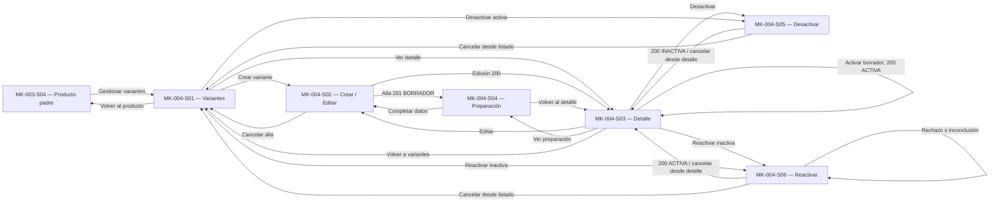

# Component Spec — MK-004

> **Propósito y rol documental:** especificación del resultado esperado de Gestión de variantes y SKU. Define pantallas, componentes, estados, contenido, fixtures y decisiones locales a partir de las fuentes oficiales y la UX del módulo. No especifica el orden de construcción ni tareas: esas responsabilidades corresponden a [plan.md](plan.md) y [tasks.md](tasks.md).

## 1. Identificación

- **Mockup:** MK-004.
- **Funcionalidad:** Gestión avanzada de variantes (SKUs) — `variantes_skus`.
- **Responsable:** Gabriel Poma Gutierrez.
- **Rama funcional:** `poma`.
- **Versión:** v0.1 · **Fecha:** 2026-10-02.
- **Estado:** En revisión; seguimiento/reintento y datos administrativos del padre condicionados por §14.
- **Plataforma:** Web desktop, viewport canónico de 1440 px.
- **Versiones consumidas:** UX 2.0, Design System 1.0.0, OpenAPI HTTP 0.5.0 y AsyncAPI 0.4.0.

## 2. Trazabilidad

| Fuente | Referencia | Alcance |
|---|---|---|
| SPEC | [SPEC-004](../../specs/SPEC-004-gestion-variantes-skus.md) §§1–7 y extensión 0.5.0 | Identidad SKU, atributos, herencia de precio, preparación y ciclo de estados |
| HU | [HU-004](../../hu/HU-004-gestion-variantes-skus.md) CA-01–CA-15 | Todos los criterios de aceptación |
| WF | [WF-004](../../wireframes/flows/WF-004-gestion-variantes-skus.md) | Lista, crear/editar, detalle, preparación, confirmación de baja/reactivación |
| Antecedente interactivo | [Índice WF-004](../../wireframes/prototipos/WF-004-gestion-variantes-skus/index.html) | Recorrido ilustrativo de alta/preparación; no publica operaciones adicionales |
| Flow | [FLOW-004](../../flujos/FLOW-004-gestion-variantes-skus.md) §§4.1–4.4 y §5 | Creación, preparación, edición, activación/reactivación y efecto de baja sobre padre |
| Producto padre | [SPEC-003](../../specs/SPEC-003-gestion-productos-crud.md), [HU-003](../../hu/HU-003-gestion-productos-crud.md), [FLOW-003](../../flujos/FLOW-003-gestion-productos-crud.md), [MK-003](../MK-003/component-spec.md) | Modelo con variantes, preparación del precio y reactivación independiente del padre |
| Características y tipos | [SPEC-009](../../specs/SPEC-009-gestion-caracteristicas.md) §4; [SPEC-010](../../specs/SPEC-010-asociacion-tipo-producto-caracteristica.md) §4 | Valores tipados, IDs y esquema efectivo del tipo; categoría no define atributos |
| Pricing | [SPEC-013](../../specs/SPEC-013-gestion-precios-individuales-masivos.md); [Contrato_Api.md](../../Contrato_Api.md) §§7 y 31.6 | Precio heredado del producto y override posterior; esta capacidad no edita precios |
| Propuesta UX módulo | [propuesta-ux.md](../ux/propuesta-ux.md), v2.0 §§3–6 y 9–11 | UX-P01 Alta, UX-P02 Media, UX-P03 Alta |
| UX Decisions | [ux-decisions.md](../ux/ux-decisions.md), v2.0 | UXD-001–012 según condición; preparación y baja con evidencia |
| UX Guidelines | [ux-guidelines.md](../ux/ux-guidelines.md), v2.0 §§2–5 | UXG-001–013, 017–018 y 020–022; precio propio no obligatorio |
| API Contract | [OpenAPI](../../api/openapi.yaml), HTTP 0.5.0 | `PaginaVariantes`, `Variante`, create/update y activar/desactivar/reactivar |
| Mensajería | [AsyncAPI](../../asyncapi/asyncapi.yaml), v0.4.0; [catálogo de eventos](../../api/catalogo-eventos.md) | Inicialización de SKU y hechos de baja; no suscripción del navegador |
| Contrato humano | [Contrato_Api.md](../../Contrato_Api.md) §§31.6–31.7 y extensión HTTP 0.5.0; [kit](../../api/kit-integracion.md) | SKU vendible, perfil físico, exposición comercial y ownership |
| Arquitectura y datos | [Arquitectura.md](../../Arquitectura.md) §§1.1–1.2.1; [Modelo_Conceptual.md](../../Modelo_Conceptual.md) §§4.3–4.5 | Gestor Comercial; variante/SKU diferentes; padre sin saldo físico |
| Design System | [DESIGN.md](../DESIGN.md), v1.0.0 §§4–13 y 15–16 | DS-C, foundations, tablas/formularios y gestión de foco |
| Entorno y pipeline | [prototipo/README.md](../prototipo/README.md), [mockups/README.md](../README.md) | Paquete MK004, rutas directas y revisión previa a Figma |

### 2.1. Operaciones HTTP relevantes

Rutas bajo `/api/v1`; todas las operaciones administrativas de variantes figuran como `provisional-internal` y utilizan `userBearer`. No se inventan roles globales ni scopes administrativos.

| Método y ruta | Entrada / respuesta | Uso |
|---|---|---|
| `GET /productos/{productoId}/variantes` | `pagina`, `tamanio`, `estado` → `PaginaVariantes` | Lista administrativa con `items` y `meta` |
| `POST /productos/{productoId}/variantes` | `VarianteCreateRequest` → `201 Variante` | Alta en BORRADOR; inventario se solicita después de persistir |
| `GET /productos/{productoId}/variantes/{variantId}` | `200 Variante` | Detalle y relectura de versión de variante |
| `PATCH /productos/{productoId}/variantes/{variantId}` | `VarianteUpdateRequest` → `200 Variante` | Atributos no identificadores, imagen y físico; versión leída cuando disponible |
| `POST /productos/{productoId}/variantes/{variantId}/activar` | Parámetros publicados → `200 Variante` | BORRADOR→ACTIVA tras validación final |
| `POST /productos/{productoId}/variantes/{variantId}/desactivar` | Parámetros publicados → `200 Variante` | ACTIVA→INACTIVA; evaluar efecto sobre padre |
| `POST /productos/{productoId}/variantes/{variantId}/reactivar` | Parámetros publicados → `200 Variante` | INACTIVA→ACTIVA conservando identidad |
| `GET /productos/{productoId}` | `ProductoDetalleComercial` | Identidad/modelo del padre; no entrega su estado administrativo ni versión |
| `GET /tipos-producto/{tipoProductoId}/caracteristicas` | `EsquemaTipoProducto` | Características y obligatoriedad del tipo del padre |
| `GET /caracteristicas/{caracteristicaId}/valores` | Valores LISTA publicados | Referencias por ID, sin crear/editar maestros |

Los POST de cambios de estado de variante no publican `EstadoMutationRequest` como body; no se les agrega `motivo` o `catalogVersion` por analogía con producto. La versión `catalogVersion` pertenece al request PATCH de variante. `correlationId` y los identificadores técnicos se conservan internamente conforme a los parámetros del contrato.

No existe búsqueda `q`, ordenamiento ni acciones masivas en la lista administrativa de variantes. No se inventan `/skus`, `/generar-combinaciones`, `/preparacion` ni `/reintentar`. La lista utiliza estado y paginación publicados; no se filtra una página local presentándola como búsqueda global.

### 2.2. Límites y diferencias que requieren alineación

- `Variante` publica identidad, estado, atributos, imágenes, físico y versión; no publica `inventario_inicializado`, estado de operación ni causa de rechazo. `ACTIVA` es un estado funcional, no una respuesta detallada de preparación. Seguimiento de S04: **Q-01**.
- SPEC/FLOW/WF exigen reintento idempotente para preparación pendiente/rechazada, pero OpenAPI no declara la operación administrativa. AsyncAPI no habilita al navegador a publicar mensajes. Reintento de S04/S06: **Q-02**.
- GET del padre declara proyección comercial sin `status`; la respuesta de baja de variante tampoco devuelve el estado actualizado del padre. No se afirma que era la última variante activa basándose solo en una página/estado filtrado. Contexto y confirmación del efecto sobre padre: **Q-03**, coordinada con MK-003 Q-01.
- `PerfilFisicoInput` admite borrador parcial; `physical_profile` usa un `DatosFisicosSku` completo o null. La lectura de un perfil parcial persistido requiere alineación, sin inventar respuesta completa: **Q-04**.

Las capacidades existentes de alta/edición/cambio de estado pueden especificarse con sus respuestas publicadas. Los escenarios funcionales de preparación y efecto sobre padre se identifican aparte hasta resolver su evidencia de lectura. No se aprueba la funcionalidad completa mientras falte un estado P0 requerido.

### 2.3. Integración documentada y correspondencia de resultados

Los nombres de mensajes y payloads sirven para auditoría técnica; no aparecen como controles ni texto del Gestor Comercial.

| Hecho / comando interno | Datos y efecto normativo | Correspondencia de revisión |
|---|---|---|
| `inventory.sku.initialization.requested` | Tras persistir: `sku`, `product_id`, `variant_id`, `default_location_id` opcional | FLOW PENDING; identidad por SKU, sin saldo ficticio del padre |
| `inventory.sku.initialization.completed` | Resultado payload `status=INITIALIZED` para el mismo SKU; campos de resultado según AsyncAPI | Preparación COMPLETED de FLOW; no reemplazar el enum del payload por COMPLETED |
| `inventory.sku.initialization.rejected` | Resultado payload `status=REJECTED` | Variante no publicable conservada; causa solo si una fuente la publica |
| `catalog.sku.deactivated` | Hecho tras baja confirmada; fan-out a `inventory-svc`, `pricing-svc`, `promotions-svc`, `combos-svc` | Conserva identidad SKU; Catálogo no llama directamente a consumidores |
| `catalog.product.deactivated` | Si baja del último hijo activo inactiva a padre que estaba ACTIVO, publicar el hecho del padre conforme a FLOW-003/004 | El efecto no se deduce de HTTP Variante ni se afirma para padre BORRADOR/INACTIVO |

Crear/reactivar variante no emite `pricing.product.initialization.requested` ni crea precio base propio. Los reintentos de inventario mantienen `operation_id`, producto/variante/SKU y deduplicación por `message_id`; lo completado no se repite. Los hechos de baja usan actualmente `GenericData` en AsyncAPI: no se atribuye un detalle de causa/estado del padre que ese payload no formaliza. No se inventa evento de reactivación ni suscripción del navegador a RabbitMQ.

Despacho consulta el SKU vendible mediante `POST /api/v1/productos/datos-fisicos/consulta`, con las mismas unidades kg/cm y autorización técnica de SPEC-003. La consulta externa no incorpora saldo, precio o pedido ni añade una pantalla de Despacho a MK-004.

## 3. Objetivo funcional

- **Usuario:** Gestor Comercial.
- **Objetivo:** administrar unidades vendibles de un producto con variantes, conservando SKU y combinación identificadora.
- **Contexto:** diferenciación por atributos y perfil físico de cada unidad, preparación de inventario y mantenimiento del catálogo.
- **Resultado exitoso:** variante BORRADOR persistida; atributos y físico válidos; activación/reactivación tras inventario confirmado; herencia de precio del producto salvo override administrado por Pricing; baja lógica con impacto correcto sobre padre y conservación de identidad.

## 4. Alcance

### Incluido

- Listar por producto, filtrar estado y paginar; conservar el contexto del padre.
- Crear una variante individual con combinación identificadora, imagen URI, SKU opcional solicitado y datos físicos opcionales en borrador.
- Catálogo genera SKU si se omite; el gestor no recibe un SKU supuesto antes de `201`.
- Editar datos no identificadores, imagen y físico de la misma variante; identidad y combinación en lectura.
- Detalle administrativo; preparación por SKU con estados conocidos, ausentes o inconclusos claramente diferenciados.
- Activar desde detalle, confirmar desactivación y confirmar reactivación desde lista/detalle.
- Rechazo de edición activa, errores de SKU/combinación, conflicto de versión y conservación de entradas.
- Efecto de última variante activa sobre padre activo; independencia de reactivaciones padre/hijo.
- Rutas directas, fixtures deterministas, teclado/foco y trazabilidad a todas las fuentes.

### Fuera de alcance

- Generación masiva/cartesiana de variantes; recodificación de SKU, cambio de identidad o edición de atributos identificadores publicados.
- Precio base propio obligatorio en alta, duplicación de inicialización de Pricing o edición del override desde MK-004.
- Saldo, reservas, stock inicial, ajuste de inventario, ubicaciones, empaque, pedido, checkout o fulfillment.
- Cambio de modelo/estado del padre mediante controles de variante; reactivación automática del padre.
- Administración de barcode o elegibilidad de canal pendiente de `D-CAT-01..06`; disponibilidad cero no cambia identidad SKU.
- Escritura de Taxonomía, configuración de qué atributos son obligatorios por categoría o nuevos permisos globales.
- Lectura de preparación/reintento inventados; eventos internos como controles de usuario; mobile/tablet.

## 5. Inventario de pantallas

| ID | Pantalla | Propósito | Entrada | Acción principal | Salida | Prioridad | Ruta del prototipo |
|---|---|---|---|---|---|---|---|
| MK-004-S01 | Variantes del producto | Consultar unidades vendibles y sus estados | MK-003 / Catálogo | Crear variante / Ver detalle | S02 / S03 | P0 | `/MK004/S01` |
| MK-004-S02 | Crear o editar variante | Capturar datos por contexto conservando identidad | S01 / S03 | Guardar variante / Guardar cambios | S04 tras alta / S03 tras edición | P0 | `/MK004/S02` |
| MK-004-S03 | Detalle de la variante | Consultar unidad y acciones de estado | S01 / S02 / S05 / S06 | Acción según estado | S02 / S04 / S05 / S06 | P0 | `/MK004/S03` |
| MK-004-S04 | Preparación de inventario | Revisar inicialización del SKU sin duplicarla | S02 / S03 | Completar datos / Consultar información disponible | S02 / S03 | P0 | `/MK004/S04` |
| MK-004-S05 | Confirmar desactivación | Explicar baja y posible efecto sobre padre | S01 / S03 | Desactivar variante | S03 / S01 | P0 | `/MK004/S05` |
| MK-004-S06 | Confirmar reactivación | Revalidar una variante inactiva | S01 / S03 | Reactivar variante | S03 confirmado / permanencia si rechazo | P0 | `/MK004/S06` |

**Reglas de acceso y enrutamiento:** S02 tiene modos crear/editar reproducibles directamente mediante escenario o parámetro local, sin nueva ruta de pantalla. S05/S06 son modales con ruta propia y detalle subyacente resuelto por fixture; no necesitan navegación previa. Cada ruta resuelve padre y variante ficticios válidos o un escenario no encontrado de manera determinista. No se fija hostname, puerto ni router.

Activar una variante BORRADOR es una acción de S03, con requisitos y resultado persistente, no otra pantalla: WF-004 exige confirmación de desactivación/reactivación, no un wizard de activación. Volver conserva padre, filtro de estado y página válidos. El filtro no convierte una lista parcial en evidencia de todas las variantes activas.

## 6. Relación entre pantallas

Errores de alta/edición permanecen en S02 con entradas. Fallo de inicialización conserva BORRADOR y no duplica variante. Reactivar un hijo no conduce a un resultado «Producto activo».

## 7. Jerarquía de información

1. **Primaria:** producto padre, SKU vendible de variante, combinación identificadora, estado confirmado y acción pertinente.
2. **Secundaria:** imagen, atributos no identificadores, cuatro medidas con unidades y preparación del SKU; impacto de baja/reactivación.
3. **Complementaria:** explicación de herencia de precio y exposición comercial subordinada al padre/canal; volumen derivado. Versiones/IDs de operación se conservan internamente.

`variant_id` identifica el registro para routing; no se presenta como SKU. «Activa» describe el estado de la variante y no garantiza venta si el padre no es comercialmente vendible. No se convierten ausencia de stock o fallos de lectura en `INACTIVA`.

## 8. Componentes compartidos

| Componente | Pantallas | Uso | Variante / size | Estados |
|---|---|---|---|---|
| DS-C01 `PO/Button` | S01–S06 | Guardar, activar, confirmar, cancelar y volver | filled primary / outline / subtle, md; destructive para baja | default, hover, focus, pressed, disabled con causa, loading |
| DS-C02 `PO/ActionIcon`, DS-C29 `PO/Menu` | S01/S03 | Acciones por variante | Área 32/40 px; menú autorizado | focus, open, disabled |
| DS-C03 `PO/TextInput` | S02 | SKU opcional, valores TEXTO y URL de imagen | md; read-only para identidad en edición | filled, error, focus, read-only |
| DS-C04 `PO/NumberInput` | S02 | Valores NUMERO, peso y dimensiones | md con unidades | filled, error, focus |
| DS-C06 `PO/Select` | S01/S02 | Estado, característica y valor LISTA | sm filtros / md formulario | loading, open, selected, error |
| DS-C13 `PO/FilterBar` | S01 | Filtro de estado contractual | Estándar DS | applied, error |
| DS-C14 `PO/Badge` | S01/S03–S06 | Estado de variante/padre y preparación diferenciados | md neutral/info/success/warning/error con evidencia | Informativo |
| DS-C17 `PO/Table`, DS-C18 `PO/Pagination` | S01 | Unidades vendibles y páginas | Filas default ≥48 px; botones 32 px | loading, empty, error, default |
| DS-C19 `PO/Card` | S02–S04 | Identidad, atributos, físico y preparación | padding 24, radio 12, sin sombra | default, no disponible |
| DS-C21 `PO/Modal` | S05/S06 y salida con cambios | Confirmación breve | 480 px, radio 16 | open, loading, error |
| DS-C22 `PO/Alert / PO/Result` | S01–S06 | Error, requisitos e impacto | info/success/warning/error | Persistente según tarea |
| DS-C23 `PO/Toast` | S02 | Complemento de guardado confirmado | Estándar DS | Cierre accesible |
| DS-C24 `PO/Skeleton / PO/Loader` | S01–S06 | Carga inicial/local | Estructura conocida / localizado | loading; movimiento reducido |
| DS-C25 `PO/EmptyState`, DS-C28 `PO/Breadcrumbs` | S01–S04 | Vacíos y contexto producto→variante | Estándar DS | empty, focus |

No se añade Search porque no hay búsqueda publicada de variantes. Los componentes se componen con las variantes del DS; no existe tema propio ni control genérico de Activo/Inactivo. No se agrega Stepper por la preparación asíncrona.

## 9. Componentes específicos

### MK-004-C01 — Contexto del padre y listado de unidades vendibles

**Propósito:** mantener el producto seleccionado y comparar variantes. **Pantallas:** S01; cabecera contextual en S02–S06.

**Contenido:** nombre/SKU base del padre, modelo con variantes y estado del padre si existe evidencia administrativa; tabla de SKU, combinación, estado y acciones; filtro/paginación.

| Propiedad | Tipo | Obligatoria | Regla / restricción |
|---|---|---:|---|
| productoId / tieneVariantes | Referencia / booleano | Sí | Creación solo si padre admite variantes; no exigir padre ACTIVO |
| variantes | Lista de `Variante` | Sí | Unidad comercial identificada por `sku`, no `variant_id` |
| estadoFiltro | Estado opcional | No | BORRADOR/ACTIVA/INACTIVA; sin filtro equivale a todos |
| meta | `PageMeta` | Sí en lista | pagina, tamanio, total y totalPaginas provenientes de respuesta |
| estadoPadre | Estado opcional | Para afirmar impacto/exposición | No está en GET comercial; Q-03 |

| Estado | Disparador | Representación | Acción permitida |
|---|---|---|---|
| Default | Lista cargada | Tabla legible y filtro aplicado | Ver, crear, editar o cambio permitido |
| Loading | Consulta inicial/actualización | Skeleton o loader localizado; contexto conservado | Esperar |
| Empty | Sin variantes | «Aún no hay variantes para este producto» | Crear variante si `tieneVariantes=true` |
| Sin coincidencias | Filtro sin resultados | Vacío con filtro visible | Limpiar filtro |
| Error | Consulta/parent no disponible | Error de región; no lista vacía ficticia | Reconsultar lectura disponible |
| Modelo incompatible | Padre simple confirmado | Aviso «Este producto no admite variantes» | Volver al producto; sin alta |

**Interacciones:** filtrar/paginar usa GET de variantes; detalle/volver conserva contexto (FLOW-004 §4.1). No hay cálculo de «última variante activa» a partir de `items.length` o `meta.total` de una consulta parcial.

**Accesibilidad:** tabla semántica con headers; menú nombrado por SKU; breadcrumbs reales; foco visible y paginación por teclado. Nombre/combinación largos envuelven, sin cortar SKU.

### MK-004-C02 — Identidad y atributos de la variante

**Propósito:** diferenciar la combinación identificadora de los datos editables. **Pantallas:** S02; lectura S03/S06.

| Propiedad | Tipo | Obligatoria | Regla / restricción |
|---|---|---:|---|
| sku | Texto/null | No en alta | Si se omite, lo genera Catálogo; único globalmente |
| atributosIdentificadores | Lista de `Atributo` | Sí en alta | Mínimo 1; combinación única dentro del padre |
| atributosNoIdentificadores | Lista de `Atributo` | No | Editables conforme al esquema vigente |
| esquemaTipo | `EsquemaTipoProducto` | Para validar valores | No se deriva de categoría ni convierte obligatoria en identificadora automáticamente |
| catalogVersion | Entero | Según lectura PATCH | Mantener `catalog_version` recibido; no fabricar versión |

**Contenido estructurado:** grupo de atributos identificadores en alta y lectura en edición; grupo no identificador editable; controles TEXTO/NUMERO/LISTA según Taxonomía, IDs estables y unidad cuando corresponda. La combinación se captura explícitamente; no hay generación de todas las combinaciones posibles.

| Estado | Disparador | Representación | Acción permitida |
|---|---|---|---|
| Default | Crear | SKU opcional y captura explícita de atributos | Completar y guardar |
| Read-only | Editar registro existente | SKU y combinación legibles/copiables | Editar solo no identificadores |
| Loading | Consulta de esquema/valores | Loader del grupo | Esperar / reconsultar lectura |
| Error | SKU/combinación/atributo inválido | Error junto al dato; combinación completa preservada | Corregir alta sin perder demás valores |
| Conflicto | `VERSION_CONFLICT` | Aviso con propuesta preservada | Consultar variante actual antes de confirmar nueva intención |

**Interacciones:** omitir SKU envía ausencia/null permitido, no una cadena vacía como SKU; duplicado global o combinación ya existente se trata con el código correspondiente. En edición no se envían atributos identificadores ni SKU, aunque el schema admita propiedades adicionales (FLOW-004 §§4.1/4.3).

**Accesibilidad:** leyendas por grupo, labels y nombres para quitar entradas de atributos; foco al primer error; teclado para Select/LISTA. Identidad read-only se muestra legible, no con estilo disabled.

### MK-004-C03 — Imagen y perfil físico por SKU

**Propósito:** preparar datos intrínsecos de la unidad vendible. **Pantallas:** S02/S03/S06.

| Propiedad | Tipo | Obligatoria | Regla / restricción |
|---|---|---:|---|
| imagenUrl | URI | Sí en alta y validez para activar | `VarianteCreateRequest` requiere imagen; no se extiende la excepción de borrador del producto |
| perfilFisico.pesoKg | Número/null | Para activar/reactivar | Informado `>0`, kg |
| perfilFisico.dimensionesCm | Largo/ancho/alto o null | Para activar/reactivar | Cada valor informado `>0`, cm; cuatro medidas completas para activar |
| volumenCalculado | Derivado | No | Largo×ancho×alto en cm³, sin entrada/request independiente |

| Estado | Disparador | Representación | Acción permitida |
|---|---|---|---|
| Default | Imagen/físico válido | URL y vista previa; cuatro controles con unidades | Guardar valores permitidos |
| Incompleto | Borrador sin todas las medidas | Pendientes visibles; imagen sigue requerida en alta | Guardar variante BORRADOR |
| Error | URI inválida o medida no positiva | Error de campo/grupo | Corregir |
| Rechazo activo | Edición quitaría condición requerida | Alerta persistente, propuesta y persistido separados | Corregir sin desactivar automáticamente |

**Interacciones:** URL mapea a `imagenUrl`, no a un endpoint de upload. Perfil mapea a `perfilFisico.pesoKg` y `dimensionesCm`. Padre nunca recibe estas medidas. Lectura de perfil parcial requiere Q-04; un valor null no se convierte en cero. Datos físicos externos son consultados por Despacho mediante su contrato, sin añadir una pantalla logística (FLOW-004 §§4.1/4.3).

**Accesibilidad:** imagen con texto alternativo y estado textual; peso/dimensiones con labels y unidades; errores asociados. Volumen no toma foco al recalcular; entradas físicas no se restringen a dos decimales por la presentación de dinero.

### MK-004-C04 — Preparación de Inventario y requisitos de activación

**Propósito:** reconocer inicialización del SKU sin confundirla con stock/precio. **Pantallas:** S03/S04/S06.

| Propiedad | Tipo | Obligatoria | Regla / restricción |
|---|---|---:|---|
| variante | `Variante` | Sí | Identidad persistida y último estado confirmado |
| requisitosLocales | Lista | Sí | Imagen/atributos/físico y modelo padre; no sustituyen unicidad/validación servidor |
| resultadoInicializacion | Evidencia de operación | Para afirmar preparación | No existe en HTTP Variante; Q-01 |
| capacidadReintento | Operación oficial | Para reintentar | Aún no publicada; Q-02 |

| Estado / evidencia | Representación visual | Acción permitida |
|---|---|---|
| Sin fuente de preparación | «Estado de preparación de inventario no disponible» | Ver datos y completar; no afirmar rechazo/completado |
| Alta `201` confirmada | «Variante guardada en borrador»; preparación aún no acreditada por el HTTP | Conservar SKU recibido; no repetir alta |
| `PENDING` interno | «Preparando inventario» | Escenario funcional; consulta detallada condicionada Q-01 |
| `REJECTED` interno | «No se completó la preparación. La variante se conserva» | Reintento condicionado Q-02 |
| `COMPLETED` interno | «Inventario preparado» | Evaluar restantes requisitos; no activa automáticamente |
| Lectura fallida | Último dato identificado y alerta local | Reconsultar fuente disponible, sin inventar cero |
| Medidas/imagen faltantes | Requisitos localizables | Editar S02; sin activación inválida |

**Interacciones:** activar S03 utiliza POST publicado y su validación final; un `200 ACTIVA` confirma el estado de variante. No exige padre activo. No se afirma detalle de inicialización por ese estado ni se permite saltar un requisito conocido incumplido. La revisión completa de inventario anterior al envío depende de Q-01. Tras un reintento formalizado, conservar operación/producto/variante/SKU y no repetir lo ya completado (FLOW-004 §§4.2–4.3).

**Accesibilidad:** encabezados por región y estados textuales; mensajes anunciables sin foco intrusivo; causa visible junto a acción deshabilitada. No porcentaje ficticio ni loader indefinido como única explicación.

### MK-004-C05 — Confirmación y efecto del cambio de estado

**Propósito:** confirmar baja/reactivación con impacto verificable. **Pantallas:** S05/S06; resultado en S03.

| Propiedad | Tipo | Obligatoria | Regla / restricción |
|---|---|---:|---|
| nombrePadre / sku / estadoVariante | Identidad y estado | Sí | SKU comercial visible; `variant_id` interno |
| accion | Desactivar / Reactivar | Sí | Compatible con estado confirmado |
| estadoPadre / ultimaActiva | Evidencia opcional | Para afirmar impacto concreto | Q-03; no deducir de una página filtrada |
| requisitosReactivacion | Lista | En S06 | Padre admite variantes, unicidad excluyendo propia variante, imagen/atributos/físico y preparación confirmada |

| Estado | Disparador | Representación | Acción permitida |
|---|---|---|---|
| Default | Confirmación abierta | SKU, impacto y botones específicos | Confirmar / cancelar |
| Loading | POST enviado | Loader, doble envío bloqueado | Esperar |
| Error | `409`/`422`/fallo de servicio | Motivo publicado y estado previo | Corregir / consultar / cancelar |
| Desconocido | Respuesta no concluyente | «No se pudo confirmar el cambio» | Releer variante antes de repetir |
| Confirmado | `200` con estado esperado | «Variante inactiva» o «Variante activa» | Detalle S03 |

**Interacciones:** desactivar última activa inactiva padre solo si estaba ACTIVO; BORRADOR/INACTIVO se conserva. Sin fuente suficiente se explica la consecuencia condicional, no se declara ocurrida. Reactivar mantiene SKU/ID, no crea precio ni reactiva padre; una inicialización completada no se repite (FLOW-004 §§4.3–4.4).

**Accesibilidad:** modal etiquetado, foco inicial seguro, foco contenido; Escape cancela, regresa al origen (S01 o S03) y devuelve al activador. En acceso directo, el origen y activador equivalentes son el detalle de fixture. Confirmación no cambia datos hasta respuesta.

## 10. Especificación por pantalla

### MK-004-S01 — Variantes del producto

**Propósito y objetivo:** localizar unidades vendibles del padre y elegir una acción.

**Estructura y layout:** breadcrumbs Productos→padre→Variantes; H1 y contexto nombre/SKU base; Crear variante; filtro de estado; tabla con SKU, Combinación identificadora, Estado, Acciones; paginación con `meta`. Imagen y datos físicos completos se revisan en detalle para evitar ancho excesivo.

**Componentes presentes:** C01, DS-C01/02/06/13/14/17/18/22/24/25/28/29.

**Acción primaria:** Crear variante si padre admite variantes. **Secundarias:** Ver detalle, Editar, Desactivar activa (S05), Reactivar inactiva (S06), Volver al producto. BORRADOR accede a activación desde S03.

**Estados requeridos:** default con BORRADOR/ACTIVA/INACTIVA; loading; empty; filtro sin coincidencias; error preservando padre/filtro; producto simple incompatible; contexto administrativo del padre no disponible. UXD-001/003/004/006/010/012; UXG-001/005–008/011/017/020–022.

| Elemento | Texto / patrón | Fuente |
|---|---|---|
| H1 / CTA | «Variantes del producto» / «Crear variante» | WF-004 |
| Vacío | «Aún no hay variantes para este producto» | WF-004; UXG-017 |
| Modelo inválido | «Este producto no admite variantes» | OpenAPI `PRODUCTO_NO_ADMITE_VARIANTES` |
| Ayuda | «El SKU identifica cada unidad vendible» | SPEC-004 §2; UXG-020 |

No buscar/ordenar variantes ni seleccionar filas para mutación masiva. Un padre inactivo puede conservar hijos activos; no se cambian sus badges para simular el bloqueo comercial.

### MK-004-S02 — Crear o editar variante

**Propósito y objetivo:** guardar una variante individual o mantener sus datos permitidos.

**Estructura y layout:** contexto del padre; H1 según modo; identidad/atributos identificadores; atributos no identificadores; URL/imagen; perfil físico; nota de precio heredado; errores; acciones. Vista completa hasta 880 px, sin wizard ni generación cartesiana.

**Componentes presentes:** C01/C02/C03; DS-C01/03/04/06/19/21/22/24/28.

**Acción primaria:** Guardar variante en alta; Guardar cambios en edición. **Secundarias:** Cancelar; continuar editando o descartar explícitamente ante salida.

**Estados requeridos:** crear vacío; SKU omitido/generado o solicitado; atributos/esquema loading/error; físico incompleto válido; imagen faltante/inválida; medida no positiva; SKU/combinación duplicados; guardando; `201 BORRADOR`; editar cargado; activo inválido; `VERSION_CONFLICT`; `200` guardado; resultado desconocido. UXD-001/002/004/005/006/009/012; UXG-002–004/006–007/011/013/017/020–022.

| Elemento | Texto / patrón | Fuente |
|---|---|---|
| H1 | «Crear variante» / «Editar variante» | WF-004 |
| SKU alta | «SKU (opcional)»; «Si lo dejas vacío, Catálogo asignará uno al guardar» | `VarianteCreateRequest` |
| Identidad edición | «El SKU y los atributos identificadores se conservan» | SPEC-004 §6 |
| Medidas | «Puedes completar las medidas antes de activar; los valores informados deben ser mayores que cero» | SPEC-004 §5 |
| Precio | «Esta variante hereda el precio del producto salvo que exista un precio específico gestionado en Precios» | SPEC-004 §3 |
| Duplicado | «Esta combinación de atributos ya existe en el producto» | OpenAPI `COMBINACION_DUPLICADA` |

Alta exige `atributosIdentificadores` con al menos un atributo e `imagenUrl` URI; perfil completo no es obligatorio para guardar BORRADOR. Edición no habilita SKU/combinación; imagen y no identificadores/físico se actualizan con PATCH. Si activa perdería requisitos, se rechaza toda edición conservando registro/estado y propuesta del formulario.

### MK-004-S03 — Detalle de la variante

**Propósito y objetivo:** consultar la unidad persistida, sus requisitos y acciones disponibles.

**Estructura y layout:** breadcrumbs y contexto padre; SKU/combinación y badge; imagen; atributos no identificadores; peso/dimensiones/volumen derivado cuando calculable; preparación/requisitos; nota de herencia/exposición; acciones.

**Componentes presentes:** C01/C02/C03/C04; DS-C01/14/19/22/24/25/28/29.

**Acción primaria por estado:** BORRADOR → Activar variante; ACTIVA → Editar; INACTIVA → Reactivar variante (S06). **Secundarias:** Ver preparación (S04), Editar, Volver a variantes, Desactivar activa (S05), Volver al producto para gestionar al padre.

**Estados requeridos:** detalle por estado; físico ausente; carga/error/no encontrado; preparación no disponible; requisitos incumplidos; activando; `200 ACTIVA`; rechazo y timeout conservando BORRADOR. Preparación previa completa condicionada Q-01. UXD-001/005/007/010/011/012; UXG-001/009–011/013/017/018/020–022.

| Elemento | Texto / patrón | Fuente |
|---|---|---|
| H1 | «Detalle de la variante» | WF-004 |
| Activación | «Completa atributos, imagen y medidas. El inventario debe estar preparado» | SPEC-004 §6 |
| Padre | «El estado activo de una variante no activa automáticamente al producto padre» | HU-004 CA-14/15 |
| Éxito activar | «Variante activa» solo tras `200 status=ACTIVA` | OpenAPI; UXG-018 |
| No encontrado | «No se encontró esta variante»; Volver a variantes | OpenAPI `VARIANTE_NO_ENCONTRADA` |

No mostrar importe o etiqueta «Precio específico aplicado» sin lectura de Pricing; la explicación de herencia es una regla, no un dato de precio resuelto. No mostrar saldo, reserva ni estado comercial garantizado.

### MK-004-S04 — Preparación de inventario

**Propósito y objetivo:** distinguir alta persistida, inicialización y preparación para activar.

**Estructura y layout:** nombre del padre y SKU recibido; resultado de guardado; card de preparación; requisitos de imagen/atributos/físico; acciones y error persistente.

**Componentes presentes:** C04, DS-C01/14/19/22/24/28.

**Acción primaria:** Completar datos (S02) o Volver al detalle para evaluar activación. **Secundarias:** Consultar información disponible. No hay «Reintentar inicialización» operativo hasta Q-02; reconsultar GET Variante no confirma inventario que no publica.

**Estados requeridos:** borrador confirmado con detalle de preparación ausente; carga/error de lectura; pendiente/rechazada/completada/parcial de requisitos como estados funcionales condicionados Q-01; no hay vacío que elimine variante guardada. UXD-004/005/007/008/009/010/012; UXG-007–013/017/020–022.

| Elemento | Texto / patrón | Fuente |
|---|---|---|
| H1 | «Preparación de inventario» | WF-004 |
| Alta | «Variante guardada en borrador» | FLOW-004 §4.1; `201 Variante` |
| Pendiente acreditado | «Preparando inventario» | FLOW-004 §4.2; Q-01 |
| Rechazo acreditado | «No se completó la preparación. La variante y su SKU se conservan» | SPEC-004 §4; Q-01 |
| Ausencia | «Estado de preparación de inventario no disponible» | UXG-017/022; DESIGN §13 |

Sin `default_location_id`, inicializar identidad no implica saldo en ubicación ficticia. No se solicita ubicación o stock inicial desde este formulario ni se muestra una inicialización como ingreso de unidades. Precio base se prepara en MK-003, no en esta pantalla.

### MK-004-S05 — Confirmar desactivación

**Propósito y objetivo:** confirmar la baja de una unidad y explicar el posible efecto sobre padre.

**Estructura y layout:** modal 480 px sobre detalle; SKU y combinación; padre; impacto según evidencia; Cancelar y Desactivar variante.

**Componentes presentes:** C05, DS-C01/21/22/24.

**Acción primaria:** Desactivar variante. **Secundaria:** Cancelar sin mutación.

**Estados requeridos:** padre activo y última variante activa; padre activo con otras activas; padre borrador/inactivo; estado del padre no disponible; enviando; `200 INACTIVA`; conflicto/error; resultado desconocido. Variante tiene respuesta HTTP; afirmación concreta del cambio del padre depende de Q-03. UXD-009/011/012; UXG-011/013/018/020–022.

| Elemento | Texto / patrón | Fuente |
|---|---|---|
| Título / CTA | «Desactivar variante» | WF-004 |
| Impacto siempre | «La variante dejará de ofrecerse. Su SKU y definición se conservan» | SPEC-004 §6 |
| Última con padre activo acreditados | «Es la última variante activa. El producto padre también quedará inactivo» | FLOW-004 §4.4; Q-03 |
| Sin evidencia completa | «Si es la última variante activa y el producto padre está activo, el padre también quedará inactivo» | SPEC-004 §6; UXG-022 |
| Éxito | «Variante inactiva»; estado del padre solo si confirmado | OpenAPI; UXG-018 |

La respuesta de variante no acredita por sí sola el estado resultante del padre. No cambiarlo optimistamente ni publicar un mensaje de baja confirmada del padre sin evidencia. No existe rollback global.

### MK-004-S06 — Confirmar reactivación

**Propósito y objetivo:** recuperar el estado ACTIVA de la misma variante si cumple condiciones.

**Estructura y layout:** modal 480 px sobre detalle; SKU conservado; checklist de padre con variantes, unicidad SKU/combinación excluyendo propia variante, atributos/imagen válidos, perfil completo e inventario confirmado; explicación de independencia del padre; botones.

**Componentes presentes:** C02/C03/C04/C05, DS-C01/14/21/22/24.

**Acción primaria:** Reactivar variante. **Secundarias:** Cancelar; corregir datos en S02; consultar preparación cuando exista fuente. Reintento pendiente Q-02; no se repite una inicialización completada.

**Estados requeridos:** INACTIVA válida; imagen/atributos/físico faltantes; inventario pendiente/rechazado/desconocido con evidencia pertinente; enviando; `422` conservando INACTIVA; `409`; `200 ACTIVA`; timeout sin repetición automática. UXD-007/009/011/012; UXG-009–011/013/018/020–022.

| Elemento | Texto / patrón | Fuente |
|---|---|---|
| Título / CTA | «Reactivar variante» | WF-004; ruta OpenAPI vigente |
| Identidad | «La variante conserva su SKU» | HU-004 CA-13 |
| Padre | «Esta acción no reactiva el producto padre. Gestiona su estado desde Productos» | SPEC-004 §6 |
| Rechazo | «No se pudo reactivar la variante. Permanece inactiva» + requisitos conocidos | SPEC-004 §6 |
| Éxito | «Variante activa» solo con confirmación | WF-004; OpenAPI |

El padre no necesita estar ACTIVO para preparar/activar/reactivar una variante. Activar o reactivar el padre exige su propio flujo; sus hijos inactivos/borrador no se reactivan automáticamente.

## 11. Decisiones UX locales

### LUX-01 — Alta y edición de variante como modos de una vista

**Problema:** el WF agrupa crear/editar, pero la identidad es editable solo al alta. **Alternativas consideradas:** rutas de pantallas separadas; S02 con modo explícito y grupos reutilizados. **Decisión adoptada:** segunda opción, ambos modos accesibles directamente. **Justificación:** WF-004 y UXD-001/002, manteniendo request create/update diferentes. **Trade-off:** la misma ruta debe resolver correctamente estado y fixture; no oculta identidad en edición. **Criterio de validación:** alta admite SKU omitido y combinación; edición envía únicamente campos permitidos y versión leída.

### LUX-02 — Combinación y SKU como identificación principal de la unidad

**Problema:** el gestor debe reconocer unidades del mismo padre sin interpretar `variant_id`. **Alternativas consideradas:** columna de ID técnico; SKU y combinación resumida con detalle consultable. **Decisión adoptada:** segunda opción en S01/S03 y confirmaciones. **Justificación:** SPEC-004 §2 y UXD-003/012. **Trade-off:** combinaciones largas aumentan altura de fila; se resuelve envolviendo y con detalle, sin cortar SKU. **Criterio de validación:** dos variantes del mismo padre son distinguibles y los IDs técnicos no sustituyen identidad comercial.

### LUX-03 — Impacto de baja condicionado al estado verificable del padre

**Problema:** baja de última activa tiene efecto distinto según padre, y la lista paginada no prueba que sea la última. **Alternativas consideradas:** afirmar impacto a partir de la página visible; usar evidencia completa o explicación condicional. **Decisión adoptada:** S05 muestra impacto concreto solo si Q-03 aporta fuente suficiente; mientras tanto, regla condicional visible. **Justificación:** FLOW-004 §4.4 y UXD-011/012; no altera la regla de negocio. **Trade-off:** mensaje menos específico hasta alinear lectura. **Criterio de validación:** padre activo/última activa, otras activas, padre borrador/inactivo y evidencia ausente producen textos distintos sin actualización ficticia.

Las decisiones aplican las UXD existentes. Una solución nueva que se reutilice transversalmente debe proponerse a [ux-decisions.md](../ux/ux-decisions.md), no mantenerse como excepción repetida en varios MK.

## 12. Reglas de layout PC

- Web desktop, tema claro, revisión 1440×900 px; scroll vertical permitido, sin mobile/tablet.
- Shell DESIGN v1.0.0: header 64 px, sidebar 240, padding 32; contenido útil de referencia 1136 px, grid 12 columnas/gutter 24.
- Formulario hasta 880 px; identidad/atributos y errores con espacio suficiente; dos columnas solo para campos equivalentes, sin mini inputs ilegibles.
- Oswald H1–H3 e Inter operativa; tabla 14/20, SKU seleccionable; números comparables alineados con unidades y cifras tabulares.
- Inputs/acciones md 40 px; filas ≥48 px; cards padding 24/radio 12 sin sombra; modal 480/radio 16.
- Usar `color/surface/cloud`, roles primary/semánticos y anillo `color/focus/default`; spacing 4/8/16/24/32 y variantes DS, sin tema por MK.
- Sin overflow horizontal de página. Si una tabla requiere desplazamiento, solo en región etiquetada y recorrible con teclado; no truncar SKU/estado crítico.
- Footer largo reserva espacio y no cubre foco; botones/labels envuelven sin recortar acción.
- Dialogs contienen/restauran foco; error y estado se comprenden con texto, sin depender solo de color.

## 13. Fixtures

Todos los datos son ficticios y deterministas. `HTTP` identifica esquema/request/respuesta publicados; `UI` identifica interacción local; `FUNCIONAL` identifica evidencia SPEC/FLOW aún condicionada por fuente de lectura/comando. Los últimos no acreditan integración ni cierran gates.

| Fixture | Caso y datos representativos | Pantalla / estado | Evidencia y condición |
|---|---|---|---|
| `list-default` | Padre `PROD-CAM-001`, SKU base `CAM-ENT`; tres variantes en los tres estados | S01/default | HTTP `PaginaVariantes`; estado administrativo padre Q-03 |
| `list-loading` | Carga inicial con padre conservado | S01/loading | UI |
| `list-empty` | `items=[]`, total=0, sin filtro | S01/empty | HTTP/UI |
| `list-no-results` | `estado=INACTIVA` sin coincidencias | S01/empty filtrado | HTTP/UI |
| `list-error` | Servicio no disponible | S01/error | HTTP, filtros preservados |
| `parent-simple` | Padre `tiene_variantes=false` | S01/S02/bloqueo | HTTP contexto + SPEC-004 §2 |
| `parent-draft` | Padre BORRADOR con variantes | S01/S03/S06 | FUNCIONAL estado padre Q-03; permite preparar/reactivar hijo |
| `create-empty` | Sin atributos/imagen | S02/default | UI, envío inválido |
| `create-generated-sku` | Atributos Color Negro/Talla M, imagen URI; sku omitido | S02→S04 | HTTP `201`, SKU asignado por Catálogo |
| `create-explicit-sku` | SKU `CAM-ENT-NEG-M` solicitado | S02→S04 | HTTP, validación global |
| `create-partial-physical` | peso 0.20; largo/ancho/alto null | S02/borrador | HTTP input; lectura parcial Q-04 |
| `create-duplicate-sku` | SKU global repetido | S02/error | HTTP `409 SKU_DUPLICADO` |
| `create-duplicate-combination` | Negro/M ya existe en padre | S02/error | HTTP `409 COMBINACION_DUPLICADA` |
| `create-invalid-attribute` | Valor identificador rechazado | S02/error | HTTP `ATRIBUTO_IDENTIFICADOR_INVALIDO` |
| `create-invalid-image` | Imagen ausente o URI inválida | S02/error | UI/HTTP `IMAGEN_INVALIDA` |
| `create-invalid-physical` | Peso 0 o dimensión negativa | S02/error | HTTP `PERFIL_FISICO_INVALIDO` |
| `saving` | POST/PATCH/cambio en curso | S02/S03/S05/S06/loading | UI, doble envío bloqueado |
| `write-unknown` | Escritura sin respuesta | S02/S03/S05/S06/desconocido | UI; releer variante cuando se conoce ID; no repetir alta a ciegas |
| `edit-default` | SKU/combinación read-only; versión 4 | S02/editar | HTTP Variante/VarianteUpdateRequest |
| `edit-active-rejected` | Propuesta elimina imagen o medida necesaria | S02/error | SPEC-004 §6; ACTIVA y datos persistidos intactos |
| `edit-version-conflict` | `409 VERSION_CONFLICT` | S02/error | HTTP; GET Variante para revisión antes de guardar |
| `detail-draft` | BORRADOR con perfil null | S03/default | HTTP; sin preparación deducida |
| `detail-active` | ACTIVA, físico completo e imagen | S03/default | HTTP; no garantiza comercialización padre/canal |
| `detail-inactive` | INACTIVA con misma identidad | S03/default; S06 | HTTP |
| `variant-not-found` | ID de variante inexistente | S02/S03/error | HTTP `VARIANTE_NO_ENCONTRADA` |
| `prep-unavailable` | Variante sin campo de preparación | S04/no disponible | HTTP, no se inventa el campo |
| `prep-loading` | Consulta del registro en curso | S04/loading | UI; no consulta ficticia de operación |
| `prep-error` | GET de variante falla, registro previo conservado | S04/error | HTTP/UI |
| `prep-pending` | Resultado interno aún sin concluir | S04/pendiente | FUNCIONAL Q-01 |
| `prep-rejected` | Inventario rejected; identidad intacta | S04/rechazada; S06 | FUNCIONAL Q-01; reintento Q-02 |
| `prep-completed` | Inventario completed para mismo SKU | S04/preparada; S03 | FUNCIONAL Q-01; no crea precio ni activa automáticamente |
| `activate-missing-physical` | Falta alto o peso | S03/requisitos | SPEC-004; HTTP `DATOS_INCOMPLETOS` |
| `activate-success` | `200 status=ACTIVA`, padre borrador en escenario | S03/resultado | HTTP variante; estado padre FUNCIONAL Q-03 |
| `deactivate-other-active` | Padre activo conserva otra activa | S05→S03 | HTTP variante; impacto padre FUNCIONAL Q-03 |
| `deactivate-last-active-parent` | Última activa de padre ACTIVO | S05→S03 | SPEC/FLOW; padre pasa INACTIVO; Q-03 |
| `deactivate-last-draft-parent` | Última activa de padre BORRADOR | S05→S03 | SPEC/FLOW; padre sigue BORRADOR; Q-03 |
| `deactivate-last-inactive-parent` | Última activa de padre INACTIVO | S05→S03 | SPEC/FLOW; padre sigue INACTIVO; Q-03 |
| `deactivate-parent-unknown` | Lista filtrada/página parcial o estado padre ausente | S05/default | UI; impacto condicional, no causa confirmada |
| `reactivate-valid` | INACTIVA, imagen/atributos/físico válidos, inventario confirmado | S06→S03 | HTTP cambio; preparación detallada Q-01 |
| `reactivate-invalid` | Perfil incompleto/atributo o imagen rechazados | S06/error | HTTP `422`, permanece INACTIVA |
| `reactivate-no-parent-change` | Hijo pasa ACTIVA, padre INACTIVO permanece | S06→S03 | SPEC-004; lectura padre Q-03 |
| `cancel-confirmation` | Cancela S05/S06 | S05/S06 | UI, cero mutación |

**Dataset de referencia:** padre Camiseta de entrenamiento (`PROD-CAM-001`, base `CAM-ENT`); variantes `VAR-CAM-NEG-M` / `CAM-ENT-NEG-M` (Negro/M), `VAR-CAM-AZU-L` / `CAM-ENT-AZU-L` (Azul/L) y `VAR-CAM-NEG-L` / `CAM-ENT-NEG-L` (Negro/L). Color/Talla son ejemplos con IDs de característica/valor ficticios, no requisitos universales. Atributo no identificador de ejemplo: Material. Medidas completas: 0.20 kg, 25×18×2 cm, volumen derivado 900 cm³.

Responses completas de físico incluyen los campos requeridos de `DatosFisicosSku`, incluida una fecha ficticia fija documentada; borrador parcial solo se modela como input hasta resolver Q-04. No añadir `inventario_inicializado`, barcode, stock, moneda o precio a `Variante` como si estuvieran publicados. La herencia se explica sin precio base nuevo; cualquier importe de demostración de otra capacidad debe llevar moneda proveniente de su fixture, sin semántica tributaria inferida.

## 14. Preguntas y supuestos

### Preguntas abiertas

| ID | Pregunta / hallazgo | Bloquea ejecución | Responsable | Estado / condición de cierre |
|---|---|---:|---|---|
| Q-01 | ¿Qué lectura administrativa devuelve resultado/causa de inicialización por SKU y su operación? `Variante` no contiene preparación | Sí: seguimiento completo y revisión previa verificable de inventario | Gabriel Poma + Miguel Ángel Taco / Inventario + integración | Abierta; fuente de lectura oficial alineada con AsyncAPI |
| Q-02 | ¿Qué operación permite reintentar pendiente/rechazada preservando identidad y omitiendo las completadas? | Sí: reintento exigido en SPEC/WF/FLOW | Gabriel Poma + integración | Abierta; operación administrativa formalizada, sin ruta inventada |
| Q-03 | ¿Cómo leer estado administrativo del padre y confirmar que la baja afectó a la última variante activa y su resultado? | Sí: impacto concreto y resultado padre/hijos verificables | Gabriel Poma + integración API/BFF | Abierta; resolver junto a MK-003 Q-01; no inferir de lista paginada |
| Q-04 | ¿Cómo leer perfil parcial persistido en borrador cuando `physical_profile` referencia perfil completo/null? | Sí: edición reproducible de perfil parcial | Gabriel Poma + integración | Abierta; representación administrativa oficial; coordinar MK-003 Q-05 |

No se marca la ruta de reactivación como ausente: está publicada en OpenAPI 0.5.0 con estado `provisional-internal`. Las preguntas se limitan a datos/comandos efectivamente faltantes. El gate UX/DS disponible habilita documentación, no resuelve estos hallazgos ni acredita un prototipo.

### Supuestos adoptados

| ID | Supuesto | Riesgo asociado | Condición de revisión |
|---|---|---|---|
| A-01 | S02 conserva crear/editar como modos de una pantalla con acceso directo | Divergencia futura del WF | Nueva versión WF/FLOW |
| A-02 | Imágenes se referencian por URI; no se implementa upload no publicado | Cambio en contrato de activos | Publicación de capacidad de carga |
| A-03 | El contexto de padre/variante para rutas directas proviene de fixtures ficticios de revisión | Confundir evidencia de escenario con lectura administrativa | Revisión de fixture y cierre Q-01–Q-04 |

**Límites de coordinación:** las notas temporales del Hito 2 orientan escenarios, sin convertirse en reglas oficiales o campos de API. Catálogo ya tiene ownership oficial de resolución código de barras→SKU en la extensión 0.5.0, pero la administración/cardinalidad inversa siguen abiertas. MK-004 no agrega barcode. Inventario se identifica por SKU/ubicación conforme a su fuente oficial; esto no añade ubicación, stock inicial, restricciones de fulfillment ni campos fiscales al formulario de variante.

## 15. Criterios de aceptación

Checklist del resultado especificado, pendiente de revisión/implementación y evidencia posterior.

- [ ] S01–S06 inventariadas con rutas `/MK004/S01`–`/MK004/S06`; S02 crear/editar y S05/S06 modales reproducibles directamente.
- [ ] Solo padre con `tiene_variantes=true` admite variantes; estar inactivo/borrador no impide preparar/activar/reactivar un hijo.
- [ ] SKU globalmente único; combinación identificadora única dentro de producto; alta admite SKU omitido y muestra el devuelto por Catálogo.
- [ ] Alta requiere atributos identificadores e imagen válidos, nace BORRADOR y solicita preparación solo después de persistir.
- [ ] Perfil físico puede estar incompleto en borrador; valores informados positivos; activar/reactivar exige peso/largo/ancho/alto completos en kg/cm.
- [ ] Físico pertenece a cada variante; padre sin medidas/saldo; volumen derivado sin entrada independiente.
- [ ] Crear variante no inicializa precio base propio; herencia/override se explica sin editar Pricing.
- [ ] Preparación solo se afirma con fuente verificable; no se añade un booleano a HTTP Variante ni se interpreta `requested` como completado.
- [ ] Activar/reactivar valida modelo del padre, unicidad excluyendo propia variante, imagen/atributos/físico e inventario confirmado.
- [ ] Edición mantiene `variant_id`, SKU y atributos identificadores; modifica solo no identificadores, imagen y físico permitido.
- [ ] Edición activa inválida se rechaza íntegramente conservando registro/estado y propuesta del usuario.
- [ ] `VERSION_CONFLICT` conserva intención y permite relectura publicada de variante; no sobrescribe automáticamente.
- [ ] Confirmaciones muestran SKU e impacto; `200` confirma estado y un timeout no permite doble escritura automática.
- [ ] Baja de última activa inactiva padre solo si estaba ACTIVO; padre BORRADOR/INACTIVO conserva estado.
- [ ] Sin lectura completa del padre/lista, impacto se explica condicionalmente; no se deduce de una página filtrada.
- [ ] Desactivar padre conserva estados individuales de hijos y bloquea comercialización; reactivar padre no reactiva hijos inactivos, ni viceversa.
- [ ] Reactivación conserva identidad, no repite inventario completado ni crea precio base; ruta vigente no se trata como ausente.
- [ ] Stock temporalmente ausente no cambia SKU; ACTIVA no garantiza comercialización por padre/canal.
- [ ] Vacío, filtro sin coincidencias, ausencia de dato, no encontrado y error se diferencian; no se inventan búsqueda/orden/acciones masivas.
- [ ] Q-01–Q-04 tienen responsable/fuente/condición de cierre; escenarios pendientes no acreditan operación publicada.
- [ ] UX-P01/P02/P03, UXD/UXG y LUX-01–03 trazables a pantallas/fixtures; sin patrones transversales paralelos.
- [ ] DS reutilizado, propiedades/estados/interacciones/accesibilidad especificados y estados P0 deterministas.
- [ ] Desktop 1440 px sin overflow horizontal de página; labels, teclado, foco restituido y estados comprensibles sin color.
