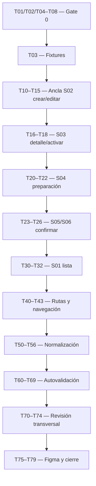

# Tasks — MK-004

> **Propósito y rol documental:** unidades ejecutables y verificables de [plan.md](plan.md), trazadas a [component-spec.md](component-spec.md). No duplica diseño ni concede aprobación anticipada. Las tareas describen construcción/validación futuras.

## 1. Identificación

- **Mockup:** MK-004 · **Funcionalidad:** `variantes_skus`.
- **Responsable:** Gabriel Poma Gutierrez · **Rama:** `poma`.
- **Plan de referencia:** [plan.md](plan.md), v0.1.
- **Component Spec:** [component-spec.md](component-spec.md), v0.1.
- **Fecha:** 2026-10-02.
- **Baseline documental:** UX 2.0, [DS](../DESIGN.md) 1.0.0, OpenAPI HTTP 0.5.0 y AsyncAPI 0.4.0.
- **Estado general:** Pendiente, con dependencias conocidas `BLOCKED` en §9. No hay implementación declarada DONE.

## 2. Convenciones y reglas de ejecución

### Prioridades

- `P0`: obligatorio para alcance funcional/gates, incluida revisión y cierre.
- `P1`: refinamiento requerido; no se omite un hallazgo importante de revisión.
- `P2`: mejora no bloqueante; no hay tareas P2 en esta versión.

### Estados de tarea

- `TODO`: pendiente de inicio.
- `DOING`: ejecución activa.
- `BLOCKED`: impedimento conocido/documentado.
- `REVIEW`: salida terminada pendiente de revisión.
- `DONE`: verificada con evidencia comprobable.

### Reglas obligatorias de ejecución

1. Toda tarea contiene **Entrada / Acción / Salida esperada / Verificación**; DONE requiere evidencia objetiva.
2. Cualquier bloqueo/resolución se registra en §9 con fuente/owner; no se sustituye una operación por otra no equivalente.
3. Mantener `Task → Pantalla/estado → Fuente/UXG → Fixture/ruta → Evidencia → Resultado` en validation-report futuro.
4. Respetar plan §2: identidad SKU/combinación inmutables en edición; no precio base por variante, saldo del padre, generación masiva, scopes o endpoints nuevos.
5. Escenario FUNCIONAL de preparación/padre no es respuesta HTTP. No aprobarlo mediante datos añadidos a `Variante`.
6. POST de estado de variante no recibe body de producto por analogía; PATCH mantiene versión leída cuando publicada.
7. Leonardo Vera revisa tras autovalidación; Figma depende del visto bueno, sin comunicación/publicación externa en esta fase documental.

### Dependencias principales

El diagrama refleja cierre integral. T20 puede representar ausencia de preparación del schema publicado; T21/T22 requieren T02/T06. Impacto concreto del padre y resultado independiente requieren T07; lectura parcial de físico T08. El trabajo independiente no exige inventar datos para saltar esas entradas.

## 3. Preparación

- [ ] **MK-004-T01 — P0 — Confirmar fuentes/versiones y ruta de reactivación** `[TODO]`
  - **Entrada:** plan §§2–3, component-spec §2, OpenAPI/AsyncAPI/UX/DS.
  - **Acción:** contrastar versiones, reglas padre/hijos y operaciones administrativas de variantes vigentes.
  - **Salida esperada:** baseline documental de MK004 registrada.
  - **Verificación:** reactivación `provisional-internal` identificada como publicada; HTTP 0.5.0 y AsyncAPI 0.4.0 no se confunden.

- [ ] **MK-004-T02 — P0 — Alinear lectura de preparación de Inventario** `[BLOCKED]`
  - **Entrada:** Q-01, `Variante`, FLOW-004 §5 y AsyncAPI.
  - **Acción:** acordar fuente de resultado/causa de inicialización por SKU y su operación.
  - **Salida esperada:** seguimiento administrativo formalizado y trazable.
  - **Verificación:** no `inventario_inicializado` añadido por fixture a Variante, ni preparación detallada deducida de `ACTIVA`.

- [ ] **MK-004-T03 — P0 — Preparar catálogo de fixtures deterministas** `[TODO]`
  - **Entrada:** component-spec §13, schemas create/update/Variante/PaginaVariantes/Problem y resoluciones de tareas dependientes.
  - **Acción:** crear datasets/scenarios en `mockups/prototipo/src/pantallas/MK004/fixtures/` con padre/SKUs de referencia, separando HTTP/UI/evidencia funcional.
  - **Salida esperada:** fixtures importables y reproducibles, con IDs/fechas ficticios fijos cuando el schema los requiere.
  - **Verificación:** todo estado P0 tiene ruta/fixture/fuente; no booleanos/precio/saldo/campos fiscales/barcode inventados ni respuesta física parcial tipada como completa.

- [ ] **MK-004-T04 — P0 — Disponer de baseline común del prototipo** `[BLOCKED]`
  - **Entrada:** [prototipo README](../prototipo/README.md); actualmente solo existe ese archivo.
  - **Acción:** coordinar disponibilidad de React/TypeScript/Mantine/Tabler, tema, router, componentes y escenarios comunes.
  - **Salida esperada:** entorno ejecutable compartido y versiones/lockfile registrados.
  - **Verificación:** construir MK004 bajo `src/pantallas/MK004/` sin aplicación/tema/router exclusivos.

- [ ] **MK-004-T05 — P0 — Confirmar Component Spec, plan, ancla y DS** `[TODO]`
  - **Entrada:** component-spec §§5/8/11/14/15, plan §§5–6/8/13 y resoluciones T02/T06–T08.
  - **Acción:** revisar LUX-01–03, ancla S02, seis rutas, modos y variantes/tokens DS; registrar aprobación documental antes de construcción dependiente.
  - **Salida esperada:** documentos aprobados y mapa DS-C→pantalla.
  - **Verificación:** sin preguntas bloqueantes para alcance dependiente; ninguna aprobación inferida por completar archivos.

- [ ] **MK-004-T06 — P0 — Formalizar reintento idempotente administrativo** `[BLOCKED]`
  - **Entrada:** Q-02, SPEC-004 §§4/6, FLOW-004 §4.2 y OpenAPI/AsyncAPI.
  - **Acción:** acordar operación oficial para pendientes/rechazadas con identidad preservada y sin repetir completadas.
  - **Salida esperada:** contrato de recuperación documentado para S04/S06.
  - **Verificación:** no POST de alta repetido ni publicación desde navegador; misma operación/producto/variante/SKU.

- [ ] **MK-004-T07 — P0 — Alinear lectura del padre y efecto de última activa** `[BLOCKED]`
  - **Entrada:** Q-03, MK-003 Q-01, respuesta de GET comercial del padre y POST desactivar variante.
  - **Acción:** coordinar evidencia oficial del estado administrativo del padre, conjunto de variantes activas y resultado del efecto de baja.
  - **Salida esperada:** impacto concreto verificable antes/después de baja cuando corresponda.
  - **Verificación:** no deducir última activa de página/filtro, ni inactivación del padre de un `200 Variante` que no lo devuelve.

- [ ] **MK-004-T08 — P0 — Alinear lectura del perfil físico parcial** `[BLOCKED]`
  - **Entrada:** Q-04, `PerfilFisicoInput`, `DatosFisicosSku`, SPEC-004 §5, MK-003 Q-05.
  - **Acción:** acordar representación de perfil incompleto persistido para posterior edición.
  - **Salida esperada:** lectura administrativa de borrador físico parcial formalizada.
  - **Verificación:** sin medidas/fecha inventadas, null→0 ni uso de response completo para input parcial.

## 4. Implementación por pantalla

### MK-004-S02 — Crear o editar variante (ancla)

- [ ] **MK-004-T10 — P0 — Implementar estructura y grupos de S02** `[TODO]`
  - **Entrada:** component-spec S02/C01–C03, DS y T03–T05.
  - **Acción:** componer contexto padre, identidad, grupos de atributos, imagen y físico en vista completa.
  - **Salida esperada:** `/MK004/S02` accesible en modo crear/editar.
  - **Verificación:** sin precio propio, wizard, campos del padre o generación cartesiana; mismo DS que resto del módulo.

- [ ] **MK-004-T11 — P0 — Implementar alta con SKU opcional y atributos identificadores** `[TODO]`
  - **Entrada:** `VarianteCreateRequest`, SPEC-004 §2, fixtures `create-generated-sku`, `create-explicit-sku`.
  - **Acción:** capturar combinación/imagen y SKU solicitado u omitido; mostrar SKU recibido tras respuesta.
  - **Salida esperada:** request de alta individual válido, sin SKU predicho por el cliente.
  - **Verificación:** mínimo un atributo identificador, imagen URI requerida; SKU vacío se omite/null conforme al contrato; padre admite variantes.

- [ ] **MK-004-T12 — P0 — Implementar errores de identidad, imagen y físico** `[TODO]`
  - **Entrada:** fixtures `create-duplicate-sku`, `create-duplicate-combination`, `create-invalid-attribute`, `create-invalid-image`, `create-partial-physical`, `create-invalid-physical`.
  - **Acción:** localizar errors por código/dato y conservar atributos/SKU/imagen/medidas propuestos.
  - **Salida esperada:** corrección sin reiniciar formulario; borrador admite medidas incompletas válidas.
  - **Verificación:** no exigir precio o físico completo al alta; imagen sí requerida; valores informados físicos `>0` en kg/cm y volumen no enviado.

- [ ] **MK-004-T13 — P0 — Implementar guardado de alta y transición a preparación** `[TODO]`
  - **Entrada:** POST variante/`201 Variante`, FLOW-004 §4.1, `saving`, `write-unknown`.
  - **Acción:** enviar/simular alta, bloquear doble envío y pasar a S04 tras persistencia confirmada.
  - **Salida esperada:** mismo padre y variante BORRADOR con SKU devuelto.
  - **Verificación:** `201` no confirma inventario ni activa, no crea precio base por variante y timeout no produce segunda alta automática.

- [ ] **MK-004-T14 — P0 — Implementar modo edición conservando identidad** `[TODO]`
  - **Entrada:** `VarianteUpdateRequest`, GET Variante, component-spec S02/C02/C03, T08 para lectura parcial.
  - **Acción:** mostrar SKU/combinación en lectura y editar solo no identificadores, imagen/físico con versión leída.
  - **Salida esperada:** PATCH del mismo `variant_id` con campos permitidos.
  - **Verificación:** no envía SKU/atributos identificadores ni sustituye variante; TEXTO/NUMERO/LISTA consumen definiciones e IDs válidos de Taxonomía.

- [ ] **MK-004-T15 — P0 — Implementar conflicto y rechazo de edición activa** `[TODO]`
  - **Entrada:** `edit-active-rejected`, `edit-version-conflict`, `edit-default`, PATCH/GET, SPEC-004 §6.
  - **Acción:** preservar propuesta, comparar/revisar lectura vigente tras conflicto y representar rechazo completo del activo inválido.
  - **Salida esperada:** guardado `200` o corrección con datos/estado persistidos intactos.
  - **Verificación:** no versión inventada, sobrescritura automática, cambio a INACTIVA por error ni inicialización completada repetida.

### MK-004-S03 — Detalle de la variante

- [ ] **MK-004-T16 — P0 — Implementar detalle y estados de lectura** `[TODO]`
  - **Entrada:** GET Variante, component-spec S03, fixtures `detail-draft`, `detail-active`, `detail-inactive`, `variant-not-found`.
  - **Acción:** mostrar SKU/combinación/estado, imagen, atributos, físico y requisitos; carga/error localizados.
  - **Salida esperada:** `/MK004/S03` completo y reproducible.
  - **Verificación:** `variant_id` no sustituye SKU; null se explica; sin precio/saldo/preparación añadidos al response.

- [ ] **MK-004-T17 — P0 — Implementar acciones de detalle y activación del borrador** `[TODO]`
  - **Entrada:** FLOW-004 §4.3, POST activar variante y fixtures `activate-missing-physical`, `activate-success`; T02 para revisión detallada previa de preparación.
  - **Acción:** ofrecer acciones por estado y activar BORRADOR validando requisitos conocidos y resultado autoritativo.
  - **Salida esperada:** ACTIVA solo con `200` esperado, o BORRADOR conservado con motivo.
  - **Verificación:** padre con variantes no necesita ACTIVO; no omitir requisito conocido, no nueva pantalla/wizard de activación ni body de producto agregado.

- [ ] **MK-004-T18 — P0 — Implementar actualización y herencia de precio informativa** `[TODO]`
  - **Entrada:** SPEC-004 §3/extensión 0.5.0, UXG-008/012, lectura Variante.
  - **Acción:** conservar última consulta identificada al refrescar y mostrar regla de herencia sin importe/override no consultado.
  - **Salida esperada:** detalle con contexto comprensible y datos de lectura confirmados.
  - **Verificación:** ACTIVA no garantiza venta padre/canal; disponibilidad temporal no cambia SKU; sin «precio específico aplicado» sin fuente Pricing.

### MK-004-S04 — Preparación de inventario

- [ ] **MK-004-T20 — P0 — Implementar borrador persistido y preparación no disponible** `[TODO]`
  - **Entrada:** C04/S04, HTTP Variante, fixtures `prep-unavailable`, `prep-loading`, `prep-error`.
  - **Acción:** distinguir registro guardado de ausencia de detalle de inicialización, carga y error de consulta.
  - **Salida esperada:** `/MK004/S04` con SKU recibido y feedback persistente.
  - **Verificación:** GET Variante no se presenta como seguimiento de operación que no publica; sin enum/booleano/cero inventados.

- [ ] **MK-004-T21 — P0 — Implementar preparación con fuente alineada** `[TODO]`
  - **Entrada:** T02 cerrada, FLOW-004 §4.2/§5 y `prep-pending`, `prep-rejected`, `prep-completed`.
  - **Acción:** consumir/simular resultados publicados para el mismo SKU y distinguir pendiente/rechazo/completado.
  - **Salida esperada:** preparación conocida por unidad sin activar automáticamente.
  - **Verificación:** `requested` no completa; rechazo conserva BORRADOR/identidad; evidencia de escenario no se disfraza de campo HTTP. BLOCKED si falta fuente.

- [ ] **MK-004-T22 — P0 — Implementar reintento formalizado y no repetición de completadas** `[TODO]`
  - **Entrada:** T06 cerrada, SPEC-004 §§4/6, estado/operación confirmados T21.
  - **Acción:** recuperar solo pendientes/rechazadas mediante la operación oficial, conservando identidad de operación/SKU.
  - **Salida esperada:** preparación recuperable sin variante/inventario duplicados.
  - **Verificación:** completada no se repite; no publicación desde navegador, stock inicial, ubicación ficticia o inicialización de precio.

### MK-004-S05 — Confirmar desactivación

- [ ] **MK-004-T23 — P0 — Implementar confirmación e impacto según evidencia** `[TODO]`
  - **Entrada:** component-spec S05/C05/LUX-03, fixtures `deactivate-other-active`, `deactivate-last-active-parent`, `deactivate-parent-unknown`; T07 para impacto concreto.
  - **Acción:** componer modal directo con SKU/padre y efecto concreto o explicación condicional según fuente.
  - **Salida esperada:** `/MK004/S05` con cancelar/Desactivar variante y foco seguro.
  - **Verificación:** no deducir última activa de página/filtro ni estado padre de respuesta comercial; cancelación no muta.

- [ ] **MK-004-T24 — P0 — Implementar baja confirmada y efecto sobre padre** `[TODO]`
  - **Entrada:** POST desactivar/`200 Variante`, FLOW-004 §4.4, T07, escenarios padre activo/borrador/inactivo y `write-unknown`.
  - **Acción:** actualizar variante solo tras resultado y representar resultado del padre solo con evidencia publicada.
  - **Salida esperada:** INACTIVA conservando SKU; padre evaluado conforme a fuente.
  - **Verificación:** padre se inactiva solo si era ACTIVO y última activa; BORRADOR/INACTIVO conserva estado; `200 Variante` no acredita por sí solo estado padre.

### MK-004-S06 — Confirmar reactivación

- [ ] **MK-004-T25 — P0 — Implementar confirmación y requisitos de reactivación** `[TODO]`
  - **Entrada:** S06/C02–C05, SPEC-004 §6, Q-01 resuelta para inventario y fixtures `reactivate-valid`/`reactivate-invalid`.
  - **Acción:** componer modal directo con SKU conservado y condiciones de modelo/identidad/imagen/atributos/físico/inventario.
  - **Salida esperada:** `/MK004/S06` con revalidación y corrección localizada.
  - **Verificación:** no exigir padre ACTIVO, no omitir unicidad excluyendo propia variante, no aceptar inventario sin confirmación.

- [ ] **MK-004-T26 — P0 — Implementar reactivación confirmada, rechazo y timeout** `[TODO]`
  - **Entrada:** POST reactivar publicado, `reactivate-no-parent-change`, `saving`, `write-unknown`, T22 si inventario necesita recuperación.
  - **Acción:** representar `200 ACTIVA`, `422`, `409` y desconocido manteniendo estado previo hasta resultado.
  - **Salida esperada:** misma variante/SKU activos o INACTIVA conservada con motivo.
  - **Verificación:** no precio base nuevo, reinicialización completada ni padre automáticamente reactivado; no segundo POST tras timeout sin relectura.

### MK-004-S01 — Variantes del producto

- [ ] **MK-004-T30 — P0 — Implementar listado y acciones por estado** `[TODO]`
  - **Entrada:** S01/C01, `PaginaVariantes`, fixture `list-default` y DS tabla/badges/menú.
  - **Acción:** componer contexto padre, SKU/combinación/estado/acciones y creación individual.
  - **Salida esperada:** `/MK004/S01` reproducible con BORRADOR/ACTIVA/INACTIVA.
  - **Verificación:** sin SKU técnico, Search, generación masiva, toolbar mutante ni saldo del padre.

- [ ] **MK-004-T31 — P0 — Implementar filtro y paginación contractuales** `[TODO]`
  - **Entrada:** GET variantes, `PageMeta`, UXG-001/006 y fixture de lista filtrada.
  - **Acción:** aplicar `estado`/`pagina`/`tamanio`, mantener contexto y descartar respuestas antiguas.
  - **Salida esperada:** filtro aplicado/página y retorno coherentes.
  - **Verificación:** totales provienen de meta; ninguna búsqueda/orden global inventado ni última activa deducida de resultado parcial.

- [ ] **MK-004-T32 — P0 — Implementar vacío, error y padre incompatible** `[TODO]`
  - **Entrada:** `list-loading`, `list-empty`, `list-no-results`, `list-error`, `parent-simple`; UXG-017.
  - **Acción:** distinguir estados de región y bloquear alta solo ante modelo incompatible confirmado.
  - **Salida esperada:** mensajes/acciones pertinentes con contexto preservado.
  - **Verificación:** vacío permite crear solo si padre con variantes; error no equivale a ausencia; padre borrador/inactivo no bloquea por su estado.

### Navegación y escenarios integrales

- [ ] **MK-004-T40 — P0 — Registrar rutas directas, modos y estados** `[TODO]`
  - **Entrada:** component-spec §§5/13 y prototipo README.
  - **Acción:** resolver S01–S06 en router común; crear/editar S02 y modales con fixture/detalle subyacente determinista.
  - **Salida esperada:** seis rutas inspeccionables sin pasos anteriores ni URL de entorno fija.
  - **Verificación:** ID/ruta sincronizados; todos los estados P0 reproducibles por mecanismo controlado, sin depender solo de sesión previa.

- [ ] **MK-004-T41 — P0 — Conectar FLOW-004 y retorno al padre** `[TODO]`
  - **Entrada:** component-spec §6, FLOW-004/003 y rutas MK-003.
  - **Acción:** recorrer lista→alta→preparación→detalle, editar/activar/baja/reactivar y retorno a producto.
  - **Salida esperada:** navegación completa con identidad/contexto preservados.
  - **Verificación:** filtro/página válidos al volver; sin modificación del padre por formulario de variante ni reactivación automática.

- [ ] **MK-004-T42 — P0 — Preservar entradas y gestionar salida con cambios** `[TODO]`
  - **Entrada:** UXG-002, errores S02 y fixtures de alta/edición.
  - **Acción:** implementar continuar editando/descartar explícitamente y conservar entradas compatibles ante fallo.
  - **Salida esperada:** trabajo del usuario recuperable sin ocultar identidad/read-only.
  - **Verificación:** cancelar salida mantiene valores; duplicado o edición rechazada no vacía formulario ni cambia dato persistido.

- [ ] **MK-004-T43 — P0 — Recuperar escritura desconocida sin doble efecto** `[TODO]`
  - **Entrada:** `write-unknown`, GET Variante, UXG-013 y operación T06 si corresponde.
  - **Acción:** releer registro con ID conocido antes de repetir PATCH/cambio; reconocer falta de ID/reconciliación del alta cuando no hay respuesta.
  - **Salida esperada:** estado desconocido explícito, con siguiente acción realmente disponible.
  - **Verificación:** no segundo alta/POST de estado automático ni supuesto éxito/rechazo; no endpoint ficticio para encontrar un SKU generado cuyo resultado se desconoce.

## 5. Normalización

- [ ] **MK-004-T50 — P0 — Normalizar arquitectura y modelos** `[TODO]`
  - **Entrada:** código MK004, plan §9, baseline común.
  - **Acción:** modularizar pantallas/composiciones/fixtures y separar HTTP Variante de evidencia UI/preparación/padre.
  - **Salida esperada:** código tipado con request por modo/operación y router/tema compartidos.
  - **Verificación:** build y tipos sin errores/warnings atribuibles al MK; preexistentes registrados; no body de producto en POST de variante.

- [ ] **MK-004-T51 — P0 — Normalizar color y estados DS** `[TODO]`
  - **Entrada:** DESIGN §§4.1/6 y componentes.
  - **Acción:** utilizar roles de tema central y variantes de estado con texto.
  - **Salida esperada:** presentación coherente de estado/feedback/foco.
  - **Verificación:** contraste de estados efectivo; color no único indicador, sin tokens ad hoc.

- [ ] **MK-004-T52 — P0 — Normalizar layout, spacing y capas** `[TODO]`
  - **Entrada:** DESIGN §§4.3–5/7–9, component-spec §12.
  - **Acción:** aplicar shell, max-width formulario, tabla, modales y footer sin cubrir contenido.
  - **Salida esperada:** composición desktop uniforme.
  - **Verificación:** no overflow de página, recorte de SKU/estado o gap/radio/capa arbitrarios.

- [ ] **MK-004-T53 — P0 — Aplicar tipografía y unidades centrales** `[TODO]`
  - **Entrada:** DESIGN §4.2 y C02/C03/lista.
  - **Acción:** usar Oswald headings e Inter operativa; unidades kg/cm y cifras tabulares pertinentes.
  - **Salida esperada:** texto, SKU y medidas legibles.
  - **Verificación:** SKU copiable; fuentes/fallbacks sin recortes; peso/dimensiones no restringidos a dos decimales por ejemplo monetario.

- [ ] **MK-004-T54 — P0 — Normalizar iconografía Tabler** `[TODO]`
  - **Entrada:** DESIGN §4.6, tabla/acciones/feedback.
  - **Acción:** usar iconos de tamaños DS y nombres accesibles por acción/SKU.
  - **Salida esperada:** set único coherente.
  - **Verificación:** sin click en icono sin control ni estado crítico indicado solo por icono.

- [ ] **MK-004-T55 — P1 — Revisar copy de variante/preparación/padre** `[TODO]`
  - **Entrada:** microtexto component-spec §10, DESIGN §13 y UXG-020/022.
  - **Acción:** unificar nombres/CTAs y separar confirmación de variante, preparación y efecto de padre.
  - **Salida esperada:** lenguaje operativo comprensible.
  - **Verificación:** no eventos, endpoints, IDs de operación/versiones técnicas visibles; no «Producto activo» por reactivar hijo ni «Inventario preparado» sin fuente.

- [ ] **MK-004-T56 — P0 — Normalizar accesibilidad y foco** `[TODO]`
  - **Entrada:** UXG-021, DESIGN §12, controles/diálogos de todas las pantallas.
  - **Acción:** asociar labels/errores/ayudas, gestionar teclado, foco contenido/restaurado y anuncios de estado.
  - **Salida esperada:** flujo operable por teclado y feedback perceptible.
  - **Verificación:** errores/disabled con explicación visible, dialog sin fondo interactivo y foco no cubierto por capas/scroll.

## 6. Autovalidación local (Owner funcional)

- [ ] **MK-004-T60 — P0 — Validar SPEC-004 y límites de ownership** `[TODO]`
  - **Entrada:** SPEC-004/003/009/010/013, código/fixtures y component-spec §15.
  - **Acción:** contrastar identidad, atributos, físico, precio e inventario con fuentes.
  - **Salida esperada:** matriz fuente→pantalla/estado→evidencia.
  - **Verificación:** sin precio base, saldo padre, empaque/pedido/ubicación o generación masiva no publicados.

- [ ] **MK-004-T61 — P0 — Validar HU-004 CA-01–CA-15** `[TODO]`
  - **Entrada:** HU-004 y cobertura inferior.
  - **Acción:** demostrar cada criterio con fixture/recorrido y registrar límites de integración real.
  - **Salida esperada:** PASS o hallazgo por CA con referencia verificable.
  - **Verificación:** sin criterios omitidos ni preparación/resultado del padre inferidos; Q requeridas cerradas al aprobar.

- [ ] **MK-004-T62 — P0 — Validar correspondencia WF y modos** `[TODO]`
  - **Entrada:** WF-004, inventario y S02 crear/editar, S05/S06.
  - **Acción:** contrastar contenido/estructura/confirmaciones y representación de identidad/medidas.
  - **Salida esperada:** seis pantallas completas con modos y acciones previstos.
  - **Verificación:** no precio requerido, identidad editable en PATCH o activación con wizard inventado.

- [ ] **MK-004-T63 — P0 — Validar FLOW y HTTP/AsyncAPI** `[TODO]`
  - **Entrada:** FLOW-004/003, OpenAPI/AsyncAPI, T40–T43 y contratos alineados.
  - **Acción:** recorrer alta/preparación/edición/estados y auditar requests/responses/resultados.
  - **Salida esperada:** transiciones/operaciones correctas con evidencia.
  - **Verificación:** no publicación de eventos por navegador, evento de reactivación inventado ni respuesta de variante que acredita ficticiamente padre.

- [ ] **MK-004-T64 — P0 — Validar UX Guidelines aplicables** `[TODO]`
  - **Entrada:** UXG-001–013/017–018/020–022 y estados del prototipo.
  - **Acción:** verificar contexto/carga/error/ausencia/confirmación y recuperación segura.
  - **Salida esperada:** evidencia por regla/pantalla/fixture.
  - **Verificación:** no operación faltante presentada como publicada, error convertido en vacío/cero o filtro parcial presentado como conjunto global.

- [ ] **MK-004-T65 — P0 — Validar propuesta integral y UX Decisions** `[TODO]`
  - **Entrada:** UX-P01 Alta/P02 Media/P03 Alta, UXD aplicables.
  - **Acción:** comprobar estado verificable, complejidad pertinente y conservación de lo confirmado.
  - **Salida esperada:** cadena fuente→UXD/UXG→pantalla documentada.
  - **Verificación:** sin propuesta paralela, wizard/drawer universal, toast como único error o reintento genérico inseguro.

- [ ] **MK-004-T66 — P0 — Validar LUX-01–03** `[TODO]`
  - **Entrada:** decisiones locales del component-spec y criterios de validación.
  - **Acción:** revisar modos S02, identificación SKU/combinación e impacto condicional del padre.
  - **Salida esperada:** decisiones verificadas o hallazgo explícito.
  - **Verificación:** no cambian negocio/contrato ni crean regla transversal nueva repetida sin promoción.

- [ ] **MK-004-T67 — P0 — Validar fidelidad DS** `[TODO]`
  - **Entrada:** DESIGN 1.0.0 y T50–T56.
  - **Acción:** inspeccionar tokens/componentes/estados y contrastes efectivos.
  - **Salida esperada:** Gate C evidenciado.
  - **Verificación:** sin tema propio, componentes compartidos duplicados, defaults divergentes o contraste sin revisión.

- [ ] **MK-004-T68 — P0 — Validar desktop y accesibilidad práctica** `[TODO]`
  - **Entrada:** S01–S06, combinaciones largas/errores, viewport 1440×900 de referencia.
  - **Acción:** recorrer con teclado, ampliar texto y comprobar scroll/foco/labels/diálogos.
  - **Salida esperada:** Gate D con capturas/recorridos y fallos corregidos.
  - **Verificación:** no overflow horizontal de página ni SKU/acción/estado crítico recortado; foco visible/restaurado, sin dependencia del color.

- [ ] **MK-004-T69 — P0 — Registrar autovalidación y trazabilidad** `[TODO]`
  - **Entrada:** T60–T68 y [plantilla validation-report](../_plantillas/mockup/validation-report.template.md).
  - **Acción:** crear reporte futuro con evidencias Task→Pantalla→Fixture/ruta→Resultado y Gates A–D/hallazgos.
  - **Salida esperada:** autovalidación revisable y versión identificada.
  - **Verificación:** cero bloqueantes/importantes requeridos abiertos; ningún PASS basado solo en documentación o escenario funcional aún sin contrato.

### Cobertura de criterios de HU-004

| Criterios | Pantallas / fixtures principales | Tareas de construcción / verificación |
|---|---|---|
| CA-01/02/03 | S01/S02; `parent-simple`, SKU y combinación duplicados | T10–T12/T30–T32, T60–T61 |
| CA-04/10 | S04; `prep-pending`, `prep-rejected`, `prep-completed` | T02/T06/T13/T20–T22, T61/T63 |
| CA-05/06 | S02/S03/S04; alta y texto de herencia | T10/T13/T18/T22, T60–T61 |
| CA-07/08/09 | S02/S03/S04; padre borrador, físico parcial/inválido y activación | T07–T08/T12/T16–T17/T21, T61 |
| CA-11 | S02 editar; `edit-active-rejected`, `edit-version-conflict` | T14–T15, T61 |
| CA-12 | S05 y MK-003; baja última activa con padre activo/borrador/inactivo | T07/T23–T24/T41, T61/T63 |
| CA-13/14 | S06; `reactivate-valid`, `reactivate-invalid`, `reactivate-no-parent-change` | T02/T06/T22/T25–T26, T61/T63 |
| CA-15 | S03/S06 y MK-003; padre/hijos en estados distintos | T17/T23–T26/T41, T61/T63 |

La evidencia visual comprueba interacción/simulación contractual, sin certificar idempotencia real, unicidad concurrente o fan-out RabbitMQ de servicios no ejecutados. Esas verificaciones de backend se registran como alcance de integración externo al mockup.

## 7. Revisión transversal y visto bueno

- [ ] **MK-004-T70 — P0 — Confirmar readiness de revisión** `[TODO]`
  - **Entrada:** validation-report, T69 y Gates A–D.
  - **Acción:** comprobar cobertura/evidencias y resolución de bloqueos/hallazgos requeridos.
  - **Salida esperada:** versión autovalidada lista para revisión.
  - **Verificación:** todas las rutas/modos/fixtures inspeccionables y ningún hallazgo requerido abierto.

- [ ] **MK-004-T71 — P0 — Solicitar revisión de Leonardo Vera Rodríguez** `[TODO]`
  - **Entrada:** T70 y versión/rutas/reporte.
  - **Acción:** el owner entrega formalmente versión y evidencia conforme al pipeline.
  - **Salida esperada:** revisión transversal sobre versión específica.
  - **Verificación:** solicitud/revisor/alcance registrados, sin revisión anticipada a autovalidación.

- [ ] **MK-004-T72 — P0 — Corregir hallazgos requeridos y reinspeccionar** `[TODO]`
  - **Entrada:** observaciones bloqueantes/importantes del revisor.
  - **Acción:** corregir, actualizar evidencia afectada y presentar a reinspección.
  - **Salida esperada:** hallazgos requeridos cerrados.
  - **Verificación:** cierre confirmado, sin ocultar dato/acción para declarar cumplido un requisito.

- [ ] **MK-004-T73 — P0 — Obtener visto bueno formal** `[TODO]`
  - **Entrada:** revisión/correcciones cerradas.
  - **Acción:** obtener confirmación expresa de Leonardo Vera para versión revisada.
  - **Salida esperada:** visto bueno fechado.
  - **Verificación:** evidencia real, sin aprobación inferida del silencio o de finalizar documentos.

- [ ] **MK-004-T74 — P0 — Registrar APROBADO PARA FIGMA** `[TODO]`
  - **Entrada:** T73.
  - **Acción:** registrar estado, fecha, versión y evidencia en validation-report.
  - **Salida esperada:** Gate E cerrado con versión fijada.
  - **Verificación:** cero bloqueantes/importantes requeridos abiertos y aprobación explícita.

## 8. Figma y cierre

- [ ] **MK-004-T75 — P0 — Reflejar versión con visto bueno en Figma** `[TODO]`
  - **Entrada:** T74 y versión exacta del prototipo.
  - **Acción:** representar seis pantallas/modos/estados con componentes/variables/styles DS.
  - **Salida esperada:** diseño Figma fiel al aprobado para Figma.
  - **Verificación:** sin nuevos campos/reglas/tokens ni instancias divergentes ocultas.

- [ ] **MK-004-T76 — P0 — Verificar fidelidad punto por punto** `[TODO]`
  - **Entrada:** Figma y prototipo con visto bueno.
  - **Acción:** comparar estructura, tokens, fuentes, variantes, copy, fixtures y feedback.
  - **Salida esperada:** matriz de fidelidad con correcciones cerradas.
  - **Verificación:** verificaciones requeridas PASS sobre la misma versión.

- [ ] **MK-004-T77 — P0 — Confirmar seis pantallas, modos y estados P0** `[TODO]`
  - **Entrada:** inventario/estados de component-spec y plan §10, frames Figma.
  - **Acción:** verificar S01–S06, alta/edición y confirmaciones/efectos padre requeridos.
  - **Salida esperada:** cobertura completa del diseño aprobado.
  - **Verificación:** ningún modo, diálogo, requisito o estado P0 omitido.

- [ ] **MK-004-T78 — P0 — Registrar enlace canónico Figma** `[TODO]`
  - **Entrada:** archivo/frames existentes y fidelidad validada.
  - **Acción:** guardar enlace y versión de referencia en validation-report.
  - **Salida esperada:** acceso verificable a evidencia final.
  - **Verificación:** URL real abre versión correcta; sin placeholder.

- [ ] **MK-004-T79 — P0 — Cerrar Gates A–F y resultado general APROBADO** `[TODO]`
  - **Entrada:** T69/T74/T76–T78, gates completos y registro de bloqueos.
  - **Acción:** comprobar cierre integral y registrar APROBADO en validation-report.
  - **Salida esperada:** funcionalidad cerrada con tareas verificadas y evidencia completa.
  - **Verificación:** cero bloqueos/hallazgos requeridos abiertos; Figma fiel y aprobación formal, sin cierre basado solo en documentación.

## 9. Registro de bloqueos

Hallazgos conocidos de revisión documental del 2026-10-02. Tareas dependientes de construcción siguen TODO hasta completar sus entradas; las de alineación/baseline permanecen BLOCKED. Resolución requiere evidencia oficial y actualización documental, no un fixture sustituto.

| Tarea | Fecha | Causa del bloqueo | Fuente / documento a resolver | Responsable de resolución | Condición de desbloqueo | Estado |
|---|---|---|---|---|---|---|
| MK-004-T02 | 2026-10-02 | Variante no publica resultado/causa de preparación | OpenAPI/AsyncAPI, Q-01; UXG §4 | Gabriel Poma + Miguel Ángel Taco / Inventario + integración | Lectura de preparación por SKU formalizada | Activo |
| MK-004-T04 | 2026-10-02 | Prototipo solo contiene README, sin aplicación común | prototipo README; Gate 0 del plan | Responsable del entorno común; coordina Gabriel Poma | React/tema/router/escenarios compartidos disponibles | Activo |
| MK-004-T06 | 2026-10-02 | Reintento funcional sin operación administrativa publicada | SPEC/WF/FLOW-004, OpenAPI; Q-02 | Gabriel Poma + integración | Operación idempotente con identidad/alcance formalizados | Activo |
| MK-004-T07 | 2026-10-02 | Estado del padre no está en GET comercial ni respuesta de baja variante; lista parcial no acredita última activa | Q-03; MK-003 Q-01; OpenAPI | Gabriel Poma + integración API/BFF | Fuente administrativa/resultado completo del padre alineados | Activo |
| MK-004-T08 | 2026-10-02 | Input físico parcial sin lectura equivalente de borrador | PerfilFisicoInput / DatosFisicosSku; Q-04; MK-003 Q-05 | Gabriel Poma + integración | Lectura administrativa del perfil parcial publicada | Activo |

No desbloquear con campos bajo `additionalProperties`, identidad/precio/saldo falsos, restricción de padre ACTIVO, página filtrada como prueba global, endpoint/evento inventado ni reglas tomadas únicamente de notas temporales. La reactivación HTTP publicada no constituye un bloqueo por ausencia de ruta.
