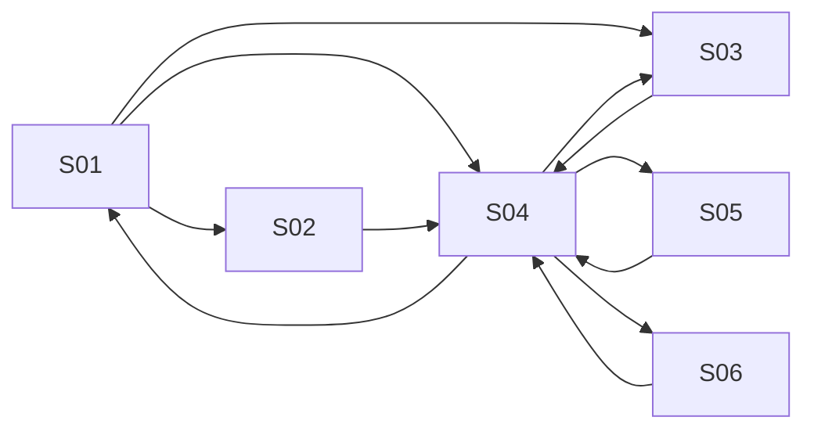

# Component Spec — MK-005

## 1. Identificación

Funcionalidad: **Gestión de cupones de descuento**. Owner: Axel Andree Cueva Alcalá. Issue: [#64](https://github.com/Taller-SW-Web/Productos-y-Ofertas-docs/issues/64). Versión **1.2**, fecha **2026-10-03**, estado **EN REVISIÓN — APROBACIÓN DOCUMENTAL PENDIENTE**. Rama documental `cueva`; construcción/iteración futura en `lab/cueva`. La implementación está bloqueada hasta aprobar este component-spec y confirmar las entradas oficiales. No hay mockup implementado, autovalidación visual ni visto bueno.

## 2. Trazabilidad

| Fuente | Referencia | Uso |
|---|---|---|
| SPEC | [SPEC-005](../../specs/SPEC-005-gestion-cupones-descuento.md) | Reglas de negocio, campos y límites. |
| HU | [HU-005](../../hu/HU-005-gestion-cupones-descuento.md) | Criterios de aceptación y actor Gestor Comercial. |
| Wireframe | [WF-005](../../wireframes/flows/WF-005-gestion-cupones-descuento.md) | Inventario/estructura/copy; no constituye el mockup de alta fidelidad. |
| Navegación | [FLOW-005](../../flujos/FLOW-005-gestion-cupones-descuento.md) | Entradas, retornos, guardado y estados. |
| Contratos | [OpenAPI 0.5.0](../../api/openapi.yaml), [AsyncAPI 0.4.0](../../asyncapi/asyncapi.yaml), [Contrato API](../../Contrato_Api.md) | Campos/operaciones vigentes; mensajería solo contexto, no botones técnicos. |
| UX | [Propuesta 2.0](../ux/propuesta-ux.md), [UXD](../ux/ux-decisions.md), [UXG](../ux/ux-guidelines.md) | Patrones/normas transversales; aplicabilidad por pantalla y estado. |
| Design System | [DESIGN 1.0.0](../DESIGN.md) | Tokens, tipografía, shell y DS-C aplicables. |
| Pipeline | [Mockups](../README.md), [prototipo](../prototipo/README.md), [INDEX](../../wireframes/INDEX.md), [equipo](../../EQUIPO_Y_RESPONSABILIDADES.md) | Rutas, DoR/DoD, ownership y revisión. |

SPEC/HU/contratos prevalecen sobre artefactos visuales. Una propuesta visual exploratoria no es una fuente funcional ni una aprobación documental. El wireframe previo guía estructura; los valores visuales de alta fidelidad proceden de DESIGN. Consumir versiones vigentes en la rama del equipo al iniciar laboratorio, sin congelar un hash antiguo de master como autoridad.

## 3. Objetivo funcional

El Gestor Comercial consulta y configura cupones, límites y política de restitución; conoce el uso global confirmado y cambia el estado sin operar un pedido.

## 4. Alcance

**Incluido:** 6 pantallas P0 de §5, estados/fixtures de §10/13, lectura/alta/edición/cambio de estado documentados, navegación y accesibilidad desktop. Documentación funcional pendiente de aprobación; después el owner implementa/refina, normaliza y autovalida conforme a #61/#64.

**Fuera de alcance:** Sin validar una cesta, consumir/restaurar manualmente, checkout, pagos, historial por cliente no publicado ni vigencia independiente del cupón. SPEC-005 CA/flujo comercial se explica como contexto; la administración no lo ejecuta. La integración backend no se acredita mediante fixtures. No crear nuevos endpoints/permisos/maestros ni pantallas fuera del inventario.

## 5. Inventario de pantallas

| ID | Pantalla | Propósito | Entrada | Acción principal | Salida | Prioridad | Ruta |
| --- | --- | --- | --- | --- | --- | --- | --- |
| MK-005-S01 | Listado de cupones | Consultar estado/configuración y elegir un cupón. | Sidebar o ruta directa. | Crear cupón | S02 o S03/S04 del registro elegido. | P0 | `/MK005/S01` |
| MK-005-S02 | Crear cupón | Registrar una configuración válida. | S01 / Crear cupón. | Crear cupón | S04 del cupón creado solo tras guardado confirmado; cancelar vuelve a S01. | P0 | `/MK005/S02` |
| MK-005-S03 | Editar cupón | Modificar el cupón seleccionado sin perder identidad ni entradas. | S01 o S04 con cuponId. | Guardar cambios | S04 del mismo cupón; cancelar conserva registro anterior. | P0 | `/MK005/S03` |
| MK-005-S04 | Detalle de cupón | Leer configuración, promoción y uso confirmado. | S01 o guardado confirmado. | Editar cupón | S03; Límites y uso a S05; Cambiar estado a S06; volver a S01. | P0 | `/MK005/S04` |
| MK-005-S05 | Límites y uso | Consultar cupos derivados y política sin actuar sobre pedidos. | S04 / Límites y uso. | Volver al detalle | S04 del mismo cupón. | P0 | `/MK005/S05` |
| MK-005-S06 | Cambiar estado | Confirmar Activar o Desactivar el cupón seleccionado. | S04 / Cambiar estado; entrada directa reproduce detalle + diálogo. | Activar cupón / Desactivar cupón | Confirmado: S04 con nuevo estado; cancelar/rechazo conserva el anterior. | P0 | `/MK005/S06` |

Cada pantalla mantiene una ruta individual; un diálogo S06 se reproduce con su detalle de fondo. Query `estado` controla fixtures reproducibles, sin aparecer como un selector técnico al usuario. Entrada directa inicializa registro/contexto estable; navegación real conserva el contexto elegido.

## 6. Relación entre pantallas

Todos los nodos son SXX del inventario, no pantallas adicionales. Guardado exitoso va al detalle del registro guardado; fallo corregible conserva formulario. Volver a listado conserva filtros/página. Selector (cuando exista) recuerda pantalla/borrador de origen, confirma selección explícita y vuelve a ese mismo formulario; cancelar no modifica el borrador original. Cerrar con cambios pide Seguir editando/Descartar. Confirmación de estado vuelve al detalle y restituye foco.

## 7. Jerarquía de información

Primaria: tarea, nombre/código de entidad y estado en palabras. Secundaria: configuración/alcance/vigencia/límites pertinentes. Complementaria: ayudas e impacto de acciones, timestamps solo con dato publicado. No inventar KPI/historial o rellenar ausencia con cero. Error de campo aparece junto a etiqueta y un resumen permite localizarlo; rechazo de operación es persistente.

## 8. Componentes compartidos

| ID | Variante / tamaño / uso | Estados y tokens |
|---|---|---|
| DS-C01/02 | Button filled primary / outline secondary md 40 px; ActionIcon 32/40 px con nombre accesible | default/hover/focus/disabled/loading; color/action y color/focus de DESIGN. |
| DS-C03/04/05 | Texto/número md 40 px; textarea solo justificación cuando aplique | label visible, helper/error/read-only; border/control y semánticos de error. |
| DS-C06/07/08/09/11 | Select/MultiSelect/check/radio/fecha-hora según cardinalidad contractual | selección explícita, foco, error y carga localizada; ningún criterio/canal universal por defecto. |
| DS-C13/17/18 | FilterBar padding16, Table filas48/header40, Pagination32 | loading/empty/sin-resultados/error por región; filtros/cuenta contractuales. |
| DS-C14/15/19 | Badge estado textual, Pill seleccionada removible, Card padding24/radio12 sin sombra | estado no depende de color; lectura conocida/ausente diferenciadas. |
| DS-C21 | Modal confirmación 480 px, padding24/radio16 | impacto/cancelar/acción específica; focus trap, Escape y retorno. |
| DS-C22/24/25/28 | Alert persistente, Loader/Skeleton, EmptyState y Breadcrumbs | error/carga/ausencia/retorno real; sin progreso ni éxito ficticios. |

Tema compartido en `prototipo/src/tema/`; composición reutilizable en `src/componentes/`. Tipos/estados no justifican estilos ad hoc; solo instanciar componentes que la pantalla requiera. Inputs y botones de escritura no aparecen en vistas exclusivamente de lectura.

## 9. Componentes específicos

C01 Formulario de cupón agrupa Identificación, Límites y Restitución (DS-C03/04/06/09); C02 Resumen de usos es lectura (DS-C19/22); C03 Confirmación de estado conserva contexto (DS-C21). Ninguno agrega controles de consumo o restitución.

### Campos, props y validaciones

| Etiqueta visible | Campo contractual | Regla / representación |
| --- | --- | --- |
| Código | codigo | Texto obligatorio; trim y mayúsculas ASCII; solo A–Z, 0–9, guion y guion bajo; único, excluyendo el propio registro al editar. |
| Promoción asociada | promocionId | Obligatoria; promoción de modalidad CUPON; obtener nombre/vigencia con la consulta de Promoción, no inventarlos en CuponAdmin. |
| Estado | estado | ACTIVO/INACTIVO; etiqueta humana Activo/Inactivo. Elegir al crear; cambiar una entidad existente siguiendo confirmación de S06. |
| Monto mínimo | montoMinimo | Opcional; null significa Sin monto mínimo; si existe, mayor que cero; no convertir vacío en cero ni añadir campo moneda ausente del request. |
| Límite global | maxUsosGlobal | Opcional; null significa Sin límite; entero positivo si se informa. |
| Límite por cliente | maxUsosPorCliente | Opcional; null significa Sin límite; entero positivo. Ayuda: requiere identificar al cliente en el canal; no pedir customer_ref al gestor. |
| Política de restitución | politicaCancelacion | Obligatoria; Restaurar uso al cancelar / No restaurar. Solo cancelación contractual, sin extender a devoluciones. |
| Uso global y disponibles | usosGlobalesConsumidos / usosDisponibles | Solo lectura, nunca request de escritura. Datos de CuponAdmin; disponible null con cupo ilimitado se representa Sin límite; si falta información no mostrar cero. |

El formulario conserva su draft, registro editado, errores y selección de referencias. Props de lectura y capacidades no se mandan como autorización. Guardar enfoca primer error y no comunica éxito hasta resultado; durante envío impide doble click. Labels son humanos; constantes contractuales viven en datos/adaptador, no en copy.

### Operaciones disponibles

| Acción | Operación OpenAPI (relativa al servidor `/api/v1`) | Límite |
|---|---|---|
| Listar | GET `/cupones` | estado, pagina, tamanio; sin búsqueda de código ni filtros por cliente inventados. |
| Crear | POST `/cupones` | CuponCreateRequest. |
| Leer / editar | GET/PATCH `/cupones/{cuponId}` | CuponAdmin / CuponUpdateRequest. |
| Estado | POST `/cupones/{cuponId}/activar` o `/desactivar` | Confirmación explícita; respuesta contractual. |
| Promoción asociada | GET `/promociones/administracion` y `/promociones/{promocionId}` | Selección de modalidad CUPON; nombre/vigencia provienen de PromocionAdmin. |

Los filtros son parámetros publicados, no sugerencias visuales de búsqueda. Los contratos internos administrativos conservan su condición provisional; la documentación no promete backend productivo.

## 10. Especificación por pantalla

### MK-005-S01 — Listado de cupones

- **Propósito y entrada:** Consultar estado/configuración y elegir un cupón. Sidebar o ruta directa.
- **Estructura/contenido:** Filtro Estado; columnas Código, Promoción asociada, Estado, Uso global y Límite global; acciones Ver detalle/Editar y paginación contractual. No buscador remoto de código.
- **Jerarquía y componentes:** título/tarea primero; estado/contexto después; datos editables o lectura central; acciones al final. DS-C13/17/18 para consulta; DS-C25/24/22 para vacío/carga/error. No incluir componentes irrelevantes por completar catálogo.
- **Acción primaria / salida:** Crear cupón. S02 o S03/S04 del registro elegido.
- **Acciones secundarias:** Volver/Cancelar con destino explícito; conservar filtros/página o borrador según §6.
- **Estados requeridos:** default, loading, empty, sin-resultados, error, sesion, permisos; sumar los fixtures específicos de §13 aplicables a esta pantalla. Empty y sin-resultados solo en colecciones; no se representan como una ficha inexistente.
- **Copy propio:** «Todavía no hay cupones. Crea el primero.»; botones con nombre de acción y entidad, sin MK/WF/UUID/eventos/códigos internos visibles.
- **Reglas y accesibilidad:** fuentes SPEC/HU/WF/FLOW-005, campos/operaciones de §9; UXG-001/006/011/017/020/021/022. Label y error asociados; foco al primer campo inválido; diálogo controla/restaura foco; estado anunciado sin depender del color. Un fallo conserva valores y estado previo.
- **Verificación futura:** entrada directa `/MK005/S01` + `?estado=<fixture>`, interacción del destino, regreso sin pérdida, captura 1440×900 y teclado. Estas rutas son contrato de implementación, **todavía no páginas construidas**.
### MK-005-S02 — Crear cupón

- **Propósito y entrada:** Registrar una configuración válida. S01 / Crear cupón.
- **Estructura/contenido:** Campos de §9, grupos Identificación/Límites/Restitución y ayuda de null. Selección de promoción CUPON dentro del formulario; sin una pantalla P0 extra.
- **Jerarquía y componentes:** título/tarea primero; estado/contexto después; datos editables o lectura central; acciones al final. DS-C19/03/04/06/09/11 para grupos pertinentes; DS-C21 solo para confirmación/descarte; DS-C22 para feedback. No incluir componentes irrelevantes por completar catálogo.
- **Acción primaria / salida:** Crear cupón. S04 del cupón creado solo tras guardado confirmado; cancelar vuelve a S01.
- **Acciones secundarias:** Volver/Cancelar con destino explícito; conservar filtros/página o borrador según §6.
- **Estados requeridos:** default, guardando, validacion, guardar-error, resultado-desconocido, salida-con-cambios, sesion, permisos; sumar los fixtures específicos de §13 aplicables a esta pantalla. Empty y sin-resultados solo en colecciones; no se representan como una ficha inexistente.
- **Copy propio:** «Deja el límite vacío para permitir usos sin límite.»; botones con nombre de acción y entidad, sin MK/WF/UUID/eventos/códigos internos visibles.
- **Reglas y accesibilidad:** fuentes SPEC/HU/WF/FLOW-005, campos/operaciones de §9; UXG-001/002/003/006/011/018/020/021/022. Label y error asociados; foco al primer campo inválido; diálogo controla/restaura foco; estado anunciado sin depender del color. Un fallo conserva valores y estado previo.
- **Verificación futura:** entrada directa `/MK005/S02` + `?estado=<fixture>`, interacción del destino, regreso sin pérdida, captura 1440×900 y teclado. Estas rutas son contrato de implementación, **todavía no páginas construidas**.
### MK-005-S03 — Editar cupón

- **Propósito y entrada:** Modificar el cupón seleccionado sin perder identidad ni entradas. S01 o S04 con cuponId.
- **Estructura/contenido:** Precargar los campos del cupón elegido, excluir su propio código de unicidad; mostrar asociación, límites y política. Uso es de lectura, no contador editable.
- **Jerarquía y componentes:** título/tarea primero; estado/contexto después; datos editables o lectura central; acciones al final. DS-C19/03/04/06/09/11 para grupos pertinentes; DS-C21 solo para confirmación/descarte; DS-C22 para feedback. No incluir componentes irrelevantes por completar catálogo.
- **Acción primaria / salida:** Guardar cambios. S04 del mismo cupón; cancelar conserva registro anterior.
- **Acciones secundarias:** Volver/Cancelar con destino explícito; conservar filtros/página o borrador según §6.
- **Estados requeridos:** default, loading, error, no-encontrado, guardando, validacion, guardar-error, resultado-desconocido, salida-con-cambios, sesion, permisos; sumar los fixtures específicos de §13 aplicables a esta pantalla. Empty y sin-resultados solo en colecciones; no se representan como una ficha inexistente.
- **Copy propio:** «No pudimos guardar los cambios. Revisa la información e inténtalo de nuevo.»; botones con nombre de acción y entidad, sin MK/WF/UUID/eventos/códigos internos visibles.
- **Reglas y accesibilidad:** fuentes SPEC/HU/WF/FLOW-005, campos/operaciones de §9; UXG-001/002/003/006/011/018/020/021/022. Label y error asociados; foco al primer campo inválido; diálogo controla/restaura foco; estado anunciado sin depender del color. Un fallo conserva valores y estado previo.
- **Verificación futura:** entrada directa `/MK005/S03` + `?estado=<fixture>`, interacción del destino, regreso sin pérdida, captura 1440×900 y teclado. Estas rutas son contrato de implementación, **todavía no páginas construidas**.
### MK-005-S04 — Detalle de cupón

- **Propósito y entrada:** Leer configuración, promoción y uso confirmado. S01 o guardado confirmado.
- **Estructura/contenido:** Código, Estado, promoción/vigencia consultada, límites, mínimo y política; fechas de creación/modificación solo si recibidas. Acciones explícitas, sin UUID/eventos visibles.
- **Jerarquía y componentes:** título/tarea primero; estado/contexto después; datos editables o lectura central; acciones al final. DS-C19/03/04/06/09/11 para grupos pertinentes; DS-C21 solo para confirmación/descarte; DS-C22 para feedback. No incluir componentes irrelevantes por completar catálogo.
- **Acción primaria / salida:** Editar cupón. S03; Límites y uso a S05; Cambiar estado a S06; volver a S01.
- **Acciones secundarias:** Volver/Cancelar con destino explícito; conservar filtros/página o borrador según §6.
- **Estados requeridos:** default, loading, error, no-encontrado, sesion, permisos; sumar los fixtures específicos de §13 aplicables a esta pantalla. Empty y sin-resultados solo en colecciones; no se representan como una ficha inexistente.
- **Copy propio:** «Validar un cupón en una compra no consume un uso.»; botones con nombre de acción y entidad, sin MK/WF/UUID/eventos/códigos internos visibles.
- **Reglas y accesibilidad:** fuentes SPEC/HU/WF/FLOW-005, campos/operaciones de §9; UXG-001/006/011/017/020/021/022. Label y error asociados; foco al primer campo inválido; diálogo controla/restaura foco; estado anunciado sin depender del color. Un fallo conserva valores y estado previo.
- **Verificación futura:** entrada directa `/MK005/S04` + `?estado=<fixture>`, interacción del destino, regreso sin pérdida, captura 1440×900 y teclado. Estas rutas son contrato de implementación, **todavía no páginas construidas**.
### MK-005-S05 — Límites y uso

- **Propósito y entrada:** Consultar cupos derivados y política sin actuar sobre pedidos. S04 / Límites y uso.
- **Estructura/contenido:** Uso global confirmado, límite global, disponibles conocidos o Sin límite, límite por cliente y política. No desglose de clientes o historial de pedidos inventados.
- **Jerarquía y componentes:** título/tarea primero; estado/contexto después; datos editables o lectura central; acciones al final. DS-C19/03/04/06/09/11 para grupos pertinentes; DS-C21 solo para confirmación/descarte; DS-C22 para feedback. No incluir componentes irrelevantes por completar catálogo.
- **Acción primaria / salida:** Volver al detalle. S04 del mismo cupón.
- **Acciones secundarias:** Volver/Cancelar con destino explícito; conservar filtros/página o borrador según §6.
- **Estados requeridos:** default, loading, error, no-encontrado, sesion, permisos; sumar los fixtures específicos de §13 aplicables a esta pantalla. Empty y sin-resultados solo en colecciones; no se representan como una ficha inexistente.
- **Copy propio:** «El consumo y la restitución se procesan desde el pedido.»; botones con nombre de acción y entidad, sin MK/WF/UUID/eventos/códigos internos visibles.
- **Reglas y accesibilidad:** fuentes SPEC/HU/WF/FLOW-005, campos/operaciones de §9; UXG-001/006/011/017/020/021/022. Label y error asociados; foco al primer campo inválido; diálogo controla/restaura foco; estado anunciado sin depender del color. Un fallo conserva valores y estado previo.
- **Verificación futura:** entrada directa `/MK005/S05` + `?estado=<fixture>`, interacción del destino, regreso sin pérdida, captura 1440×900 y teclado. Estas rutas son contrato de implementación, **todavía no páginas construidas**.
### MK-005-S06 — Cambiar estado

- **Propósito y entrada:** Confirmar Activar o Desactivar el cupón seleccionado. S04 / Cambiar estado; entrada directa reproduce detalle + diálogo.
- **Estructura/contenido:** Detalle detrás de diálogo 480 px; código, estado actual/destino e impacto. Desactivar no borra usos ni cambia pedidos históricos; esperar respuesta antes de cambiar badge.
- **Jerarquía y componentes:** título/tarea primero; estado/contexto después; datos editables o lectura central; acciones al final. DS-C19/03/04/06/09/11 para grupos pertinentes; DS-C21 solo para confirmación/descarte; DS-C22 para feedback. No incluir componentes irrelevantes por completar catálogo.
- **Acción primaria / salida:** Activar cupón / Desactivar cupón. Confirmado: S04 con nuevo estado; cancelar/rechazo conserva el anterior.
- **Acciones secundarias:** Cancelar; cerrar con Escape devuelve foco al disparador.
- **Estados requeridos:** default, loading, guardando, rechazo, resultado-desconocido, sesion, permisos; sumar los fixtures específicos de §13 aplicables a esta pantalla. Empty y sin-resultados solo en colecciones; no se representan como una ficha inexistente.
- **Copy propio:** «Desactivar este cupón impide nuevos usos. Sus usos registrados se conservan.»; botones con nombre de acción y entidad, sin MK/WF/UUID/eventos/códigos internos visibles.
- **Reglas y accesibilidad:** fuentes SPEC/HU/WF/FLOW-005, campos/operaciones de §9; UXG-001/002/003/006/011/018/020/021/022. Label y error asociados; foco al primer campo inválido; diálogo controla/restaura foco; estado anunciado sin depender del color. Un fallo conserva valores y estado previo.
- **Verificación futura:** entrada directa `/MK005/S06` + `?estado=<fixture>`, interacción del destino, regreso sin pérdida, captura 1440×900 y teclado. Estas rutas son contrato de implementación, **todavía no páginas construidas**.

## 11. Decisiones UX locales

### LUX-01 — Composición propia de gestión de cupones de descuento

Formulario completo breve (hasta 640 px) y vista de uso separada. Fuente WF-005 Campos/Pantallas. Alternativa: límites ocultos en un panel breve; descartada por legibilidad y lectura conjunta de límites/política. Trade-off: una navegación adicional a S05. Verificar regreso al mismo cupón/contexto y lectura sin controles de compra. Se subordina a UXD-001/002 y UXG-001/002/003; no modifica tokens ni un patrón transversal. Validación de la elección visual pendiente de implementación, autovalidación y revisión UX.

## 12. Reglas de layout PC

Viewport canónico **1440×900**, scroll vertical. Header64, sidebar240 y padding32 de DESIGN §5; contenido útil1136 antes del scrollbar. Formulario máximo **640 px** alineado a izquierda, gaps24 y separación de secciones32. Inter para cuerpo, Oswald H1 según DESIGN; no uppercase global. Tokens exactos centralizados; iconos Tabler16/20/24. Tabla limita su scroll a la región, página sin overflow horizontal. Alcance web desktop de mockups: la antigua indicación móvil de WF-007 no crea una variante móvil en esta entrega. Responsive desktop no altera reglas del formulario.

## 13. Fixtures

Cupón BIENVENIDA15 asociado a Bienvenida, ACTIVO, maxUsosGlobal=100, maxUsosPorCliente=1, usosGlobalesConsumidos=28, usosDisponibles=72, montoMinimo=null y RESTAURAR_EN_CANCELACION. Cupón RUN10: límites null, consumidos 0, disponibles null y NO_RESTAURAR. Promoción asociada: CUPON, inicio 2026-10-01T00:00:00-05:00 y fin 2026-11-01T00:00:00-05:00. Los identificadores de muestra son estables y se resuelven al registro correcto; no confundir los dos cupones al abrir edición.

### Estados comunes, aplicados según §10

| Fixture | Entrada controlada | Resultado / fuente |
|---|---|---|
| default | Registro/colección válida de este MK | Datos ficticios identificados, referencias resueltas al registro correcto; UXG-022. |
| loading / guardando | Lectura/envío pendiente | Skeleton/loader localizado, texto accesible, sin porcentaje; UXG-007/008/011. |
| empty | Colección vacía antes de filtrar | Acción Crear cuando existe; nunca convertir detalle 404 en vacío; UXG-006/011. |
| sin-resultados | Filtros aplicados sin coincidencias | Limpiar filtros; conservar filtros al abrir/regresar; UXG-001/006. |
| error / no-encontrado | Lectura fallida / 404 de recurso | Reintentar consulta / Volver a listado; sin cifras ficticias; contrato GET, UXG-011/017. |
| sesion / permisos | 401 / 403 | Mensaje comprensible, escritura bloqueada; no inventar login ni scopes; contrato y UXG-020. |
| validacion / guardar-error | Campos inválidos / rechazo conocido | Errores localizados, conservar entradas y corregir; SPEC/HU, UXG-002/006/011/021. |
| salida-con-cambios | Cancelar con draft distinto al inicial | Seguir editando/Descartar; retorno/foco; UXG-002/021. |
| rechazo | Cambio de estado rechazado | Estado previo intacto y explicación; UXG-018. |
| resultado-desconocido | Respuesta perdida/no confirmada | No afirmar éxito ni reenviar mutación automáticamente; consultar/reconciliar resultado por contrato; UXG-011/018. |

### Casos específicos

| Fixture | Pantallas | Resultado esperado |
| --- | --- | --- |
| codigo-duplicado | S02/S03 | Ingresar " bienvenida15 ": normalizar BIENVENIDA15; rechazar si otro registro ya lo tiene, conservar campos. |
| edicion-propia | S03 | Conservar el código del propio registro permite guardar; otro cupón equivalente se rechaza. |
| limites-invalidos | S02/S03 | Cero, negativo o fracción en límites, mínimo cero/negativo y código no ASCII: error localizado; corregir permite guardar. |
| sin-limite | S05 | Límites null: mostrar Sin límite y uso global real, sin inventar disponibilidad numérica. |
| uso-no-disponible | S05 | Dato no recibido: No disponible; nunca 0 ni éxito de carga. |

Todos son escenarios por implementar y verificar; un dato fixture no certifica una integración ni aprobación. Los ejemplos monetarios no fijan moneda/precisión del sistema por composición visual.

## 14. Preguntas y supuestos

No hay vacío funcional que impida documentar estos formularios. La integración futura debe devolver CuponAdmin y consultar PromocionAdmin para nombre/vigencia; aquí no se acredita esa integración. Restitución tras devoluciones no forma parte del contrato vigente de cancelación.

La propuesta exploratoria está **pendiente de Vera**, confirmada por Axel. No se solicita otra búsqueda ni se sustituye por el HTML de wireframes. La revisión UX transversal y la fidelidad Figma siguen pendientes. Supuesto de representación: gestor autorizado salvo fixture 401/403; fixtures no conceden permisos reales. Base futura debe venir identificada con MK/pantallas/ancla/supuestos/dudas.

## 15. Criterios de aceptación

- 6 pantallas/rutas P0 de §5 y estados aplicables reproducibles, sin rutas ya declaradas construidas.
- Campos/operaciones/validaciones de §9 fieles a SPEC/HU/WF/FLOW/contratos; ningún botón técnico ni acción de otro módulo.
- Formularios/selecciones/registros y retorno contextual preservados; guardado/estado solo confirmados con resultado.
- Aplicación de DS/UX y accesibilidad desktop1440: tokens compartidos, labels, foco, error localizable y sin overflow.
- Tareas ejecutables y evidencia propia del mockup antes de revisión de Vera; visto bueno verificable antes de Figma/promoción del código.
- Cierre de #64 solo con revisión, Figma/fidelidad y reporte final; la redacción de este paquete no acredita aprobación ni cierra el issue.
