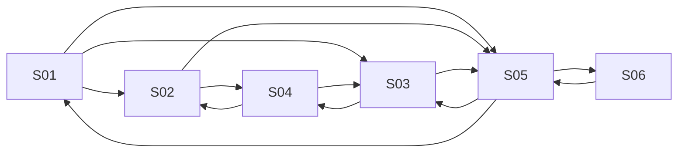

# Component Spec — MK-006

## 1. Identificación

Funcionalidad: **Gestión de ofertas y promociones**. Owner: Axel Andree Cueva Alcalá. Issue: [#64](https://github.com/Taller-SW-Web/Productos-y-Ofertas-docs/issues/64). Versión **1.2**, fecha **2026-10-03**, estado **EN REVISIÓN — APROBACIÓN DOCUMENTAL PENDIENTE**. Rama documental `cueva`; construcción/iteración futura en `lab/cueva`. La implementación está bloqueada hasta aprobar este component-spec y confirmar las entradas oficiales. No hay mockup implementado, autovalidación visual ni visto bueno.

## 2. Trazabilidad

| Fuente | Referencia | Uso |
|---|---|---|
| SPEC | [SPEC-006](../../specs/SPEC-006-gestion-ofertas-promociones.md) | Reglas de negocio, campos y límites. |
| HU | [HU-006](../../hu/HU-006-gestion-ofertas-promociones.md) | Criterios de aceptación y actor Gestor Comercial. |
| Wireframe | [WF-006](../../wireframes/flows/WF-006-gestion-ofertas-promociones.md) | Inventario/estructura/copy; no constituye el mockup de alta fidelidad. |
| Navegación | [FLOW-006](../../flujos/FLOW-006-gestion-ofertas-promociones.md) | Entradas, retornos, guardado y estados. |
| Contratos | [OpenAPI 0.5.0](../../api/openapi.yaml), [AsyncAPI 0.4.0](../../asyncapi/asyncapi.yaml), [Contrato API](../../Contrato_Api.md) | Campos/operaciones vigentes; mensajería solo contexto, no botones técnicos. |
| UX | [Propuesta 2.0](../ux/propuesta-ux.md), [UXD](../ux/ux-decisions.md), [UXG](../ux/ux-guidelines.md) | Patrones/normas transversales; aplicabilidad por pantalla y estado. |
| Design System | [DESIGN 1.0.0](../DESIGN.md) | Tokens, tipografía, shell y DS-C aplicables. |
| Pipeline | [Mockups](../README.md), [prototipo](../prototipo/README.md), [INDEX](../../wireframes/INDEX.md), [equipo](../../EQUIPO_Y_RESPONSABILIDADES.md) | Rutas, DoR/DoD, ownership y revisión. |

SPEC/HU/contratos prevalecen sobre artefactos visuales. Una propuesta visual exploratoria no es una fuente funcional ni una aprobación documental. El wireframe previo guía estructura; los valores visuales de alta fidelidad proceden de DESIGN. Consumir versiones vigentes en la rama del equipo al iniciar laboratorio, sin congelar un hash antiguo de master como autoridad.

## 3. Objetivo funcional

El Gestor Comercial configura promociones automáticas o con cupón, beneficio, vigencia, canales, alcance y combinaciones, conservando restricciones de modalidad e historia.

## 4. Alcance

**Incluido:** 6 pantallas P0 de §5, estados/fixtures de §10/13, lectura/alta/edición/cambio de estado documentados, navegación y accesibilidad desktop. Documentación funcional pendiente de aprobación; después el owner implementa/refina, normaliza y autovalida conforme a #61/#64.

**Fuera de alcance:** Sin sobrescribir precio maestro/oferta de Pricing, evaluar cesta desde Backoffice, simular checkout, crear cupón dentro de la promoción, pagar o reservar stock. La integración backend no se acredita mediante fixtures. No crear nuevos endpoints/permisos/maestros ni pantallas fuera del inventario.

## 5. Inventario de pantallas

| ID | Pantalla | Propósito | Entrada | Acción principal | Salida | Prioridad | Ruta |
| --- | --- | --- | --- | --- | --- | --- | --- |
| MK-006-S01 | Listado de promociones | Consultar promociones administrativas por estado/modalidad. | Sidebar o ruta directa. | Crear promoción | S02 o S03/S05 de la entidad elegida. | P0 | `/MK006/S01` |
| MK-006-S02 | Crear promoción | Definir promoción y alcance válidos. | S01 / Crear promoción. | Crear promoción | S05 tras resultado confirmado; S04 para elegir alcance; cancelar a S01. | P0 | `/MK006/S02` |
| MK-006-S03 | Editar promoción | Editar campos permitidos del registro elegido. | S01/S05 con promocionId. | Guardar cambios | S05 del mismo registro; S04 conserva borrador de edición. | P0 | `/MK006/S03` |
| MK-006-S04 | Seleccionar alcance | Elegir productos completos o SKU específicos activos. | S02/S03 con borrador y selección; ruta directa usa origen reproducible. | Confirmar alcance | Mismo S02/S03 con borrador y productIds/skus preservados; cancelar descarta solo cambios del selector. | P0 | `/MK006/S04` |
| MK-006-S05 | Detalle de promoción | Leer configuración comercial y acciones permitidas. | S01 o guardado confirmado. | Editar promoción | S03; cambiar estado a S06; volver a S01 con filtros. | P0 | `/MK006/S05` |
| MK-006-S06 | Cambiar estado | Confirmar Activar/Desactivar sin borrar historial. | S05 / Cambiar estado; entrada directa reproduce detalle + diálogo. | Activar promoción / Desactivar promoción | S05 con estado confirmado; rechazo/cancelar conserva estado y foco. | P0 | `/MK006/S06` |

Cada pantalla mantiene una ruta individual; un diálogo S06 se reproduce con su detalle de fondo. Query `estado` controla fixtures reproducibles, sin aparecer como un selector técnico al usuario. Entrada directa inicializa registro/contexto estable; navegación real conserva el contexto elegido.

## 6. Relación entre pantallas

Todos los nodos son SXX del inventario, no pantallas adicionales. Guardado exitoso va al detalle del registro guardado; fallo corregible conserva formulario. Volver a listado conserva filtros/página. Selector (cuando exista) recuerda pantalla/borrador de origen, confirma selección explícita y vuelve a ese mismo formulario; cancelar no modifica el borrador original. Cerrar con cambios pide Seguir editando/Descartar. Confirmación de estado vuelve al detalle y restituye foco.

## 7. Jerarquía de información

Primaria: tarea, nombre/código de entidad y estado en palabras. Secundaria: configuración/alcance/vigencia/límites pertinentes. Complementaria: ayudas e impacto de acciones, timestamps solo con dato publicado. No inventar KPI/historial o rellenar ausencia con cero. Error de campo aparece junto a etiqueta y un resumen permite localizarlo; rechazo de operación es persistente.

## 8. Componentes compartidos

| ID | Variante / tamaño / uso | Estados y tokens |
|---|---|---|
| DS-C01/02 | Button filled primary / outline secondary md 40 px; ActionIcon 32/40 px con nombre accesible | default/hover/focus/disabled/loading; color/action y color/focus de DESIGN. |
| DS-C03/04/05 | Texto/número md 40 px; textarea solo justificación cuando aplique | label visible, helper/error/read-only; border/control y semánticos de error. |
| DS-C06/07/08/09/11 | Select/MultiSelect/check/radio/fecha-hora según cardinalidad contractual | selección explícita, foco, error y carga localizada; ningún criterio/canal universal por defecto. |
| DS-C13/17/18 | FilterBar padding16, Table filas48/header40, Pagination32 | loading/empty/sin-resultados/error por región; filtros/cuenta contractuales. |
| DS-C14/15/19 | Badge estado textual, Pill seleccionada removible, Card padding24/radio12 sin sombra | estado no depende de color; lectura conocida/ausente diferenciadas. |
| DS-C21 | Modal confirmación 480 px, padding24/radio16 | impacto/cancelar/acción específica; focus trap, Escape y retorno. |
| DS-C22/24/25/28 | Alert persistente, Loader/Skeleton, EmptyState y Breadcrumbs | error/carga/ausencia/retorno real; sin progreso ni éxito ficticios. |

Tema compartido en `prototipo/src/tema/`; composición reutilizable en `src/componentes/`. Tipos/estados no justifican estilos ad hoc; solo instanciar componentes que la pantalla requiera. Inputs y botones de escritura no aparecen en vistas exclusivamente de lectura.

## 9. Componentes específicos

C01 Formulario de promoción (DS-C03/04/06/07/08/09/11) conserva borrador y campos condicionales; C02 Selector de alcance (DS-C17/18/15) distingue Producto completo/SKU específico; C03 Resumen de alcance/beneficio es lectura (DS-C19); C04 Confirmación de estado (DS-C21) no altera historia.

### Campos, props y validaciones

| Etiqueta visible | Campo contractual | Regla / representación |
| --- | --- | --- |
| Nombre | nombre | Obligatorio, no vacío. |
| Modalidad | modalidad | AUTOMATICA/CUPON. Crear: elegir explícitamente. Editar: solo habilitada si puedeCambiarModalidad=true; condición revalidada por servicio. |
| Beneficio | tipoDescuento / valor | PORCENTAJE >0 y <=100; MONTO_FIJO >0. Etiquetas Porcentaje/Monto fijo; no redondear antes de validar ni añadir moneda al request. |
| Vigencia | validFrom / validUntil | Inicio y fin obligatorios, inicio < fin; fecha/hora legibles y zona America/Lima indicada. |
| Prioridad | prioridad | Entero positivo; 1 es mayor prioridad. Sin unicidad nueva. |
| Canales | canalesHabilitados | Conjunto explícito no vacío y único: Marketplace, Chatbot, Retail, Ventas. PATCH omitido conserva; vacío no significa todos. |
| Alcance | alcance.productIds / alcance.skus | Al menos una referencia; producto completo conserva productId, SKU específico conserva sku; no congelar todas las variantes del producto. |
| Combinación | politicaCombinacion | Tres booleanos explícitos: ofertaPricing, promocionAutomatica, cupon; no inferir combinabilidad por modalidad. |
| Estado / capacidad | estado / puedeCambiarModalidad | Estado ACTIVO/INACTIVO; capacidad solo lectura recibida del servicio, no enviada ni deducida de estado. Inactiva, nunca activada, sin cupones/uso para permitir cambio. |

El formulario conserva su draft, registro editado, errores y selección de referencias. Props de lectura y capacidades no se mandan como autorización. Guardar enfoca primer error y no comunica éxito hasta resultado; durante envío impide doble click. Labels son humanos; constantes contractuales viven en datos/adaptador, no en copy.

### Operaciones disponibles

| Acción | Operación OpenAPI (relativa al servidor `/api/v1`) | Límite |
|---|---|---|
| Listar | GET `/promociones/administracion` | estado, modalidad, pagina, tamanio; no sustituir por consulta comercial `/promociones`. |
| Crear | POST `/promociones` | PromocionWriteRequest. |
| Leer / editar | GET/PATCH `/promociones/{promocionId}` | PromocionAdmin / PromocionUpdateRequest. |
| Estado | POST `/promociones/{promocionId}/activar` o `/desactivar` | Respuesta confirmada. |
| Alcance | GET `/productos`; GET `/productos/{productoId}/variantes` | Solo referencias activas; q/estado/paginación de Catálogo y variantes del producto elegido. |

Los filtros son parámetros publicados, no sugerencias visuales de búsqueda. Los contratos internos administrativos conservan su condición provisional; la documentación no promete backend productivo.

## 10. Especificación por pantalla

### MK-006-S01 — Listado de promociones

- **Propósito y entrada:** Consultar promociones administrativas por estado/modalidad. Sidebar o ruta directa.
- **Estructura/contenido:** Filtros Estado y Modalidad, columnas Nombre/Modalidad/Beneficio/Vigencia/Estado/Prioridad; Ver detalle/Editar y paginación. No filtro tipoDescuento ni canal inventado.
- **Jerarquía y componentes:** título/tarea primero; estado/contexto después; datos editables o lectura central; acciones al final. DS-C13/17/18 para consulta; DS-C25/24/22 para vacío/carga/error. No incluir componentes irrelevantes por completar catálogo.
- **Acción primaria / salida:** Crear promoción. S02 o S03/S05 de la entidad elegida.
- **Acciones secundarias:** Volver/Cancelar con destino explícito; conservar filtros/página o borrador según §6.
- **Estados requeridos:** default, loading, empty, sin-resultados, error, sesion, permisos; sumar los fixtures específicos de §13 aplicables a esta pantalla. Empty y sin-resultados solo en colecciones; no se representan como una ficha inexistente.
- **Copy propio:** «No hay promociones que coincidan con los filtros.»; botones con nombre de acción y entidad, sin MK/WF/UUID/eventos/códigos internos visibles.
- **Reglas y accesibilidad:** fuentes SPEC/HU/WF/FLOW-006, campos/operaciones de §9; UXG-001/006/011/017/020/021/022. Label y error asociados; foco al primer campo inválido; diálogo controla/restaura foco; estado anunciado sin depender del color. Un fallo conserva valores y estado previo.
- **Verificación futura:** entrada directa `/MK006/S01` + `?estado=<fixture>`, interacción del destino, regreso sin pérdida, captura 1440×900 y teclado. Estas rutas son contrato de implementación, **todavía no páginas construidas**.
### MK-006-S02 — Crear promoción

- **Propósito y entrada:** Definir promoción y alcance válidos. S01 / Crear promoción.
- **Estructura/contenido:** Campos de §9, secciones Identificación/Beneficio/Vigencia/Canales/Alcance/Combinación; selección explícita de modalidad/estado/canales. Alcance muestra tipo y referencia legible.
- **Jerarquía y componentes:** título/tarea primero; estado/contexto después; datos editables o lectura central; acciones al final. DS-C19/03/04/06/09/11 para grupos pertinentes; DS-C21 solo para confirmación/descarte; DS-C22 para feedback. No incluir componentes irrelevantes por completar catálogo.
- **Acción primaria / salida:** Crear promoción. S05 tras resultado confirmado; S04 para elegir alcance; cancelar a S01.
- **Acciones secundarias:** Volver/Cancelar con destino explícito; conservar filtros/página o borrador según §6.
- **Estados requeridos:** default, guardando, validacion, guardar-error, resultado-desconocido, salida-con-cambios, sesion, permisos; sumar los fixtures específicos de §13 aplicables a esta pantalla. Empty y sin-resultados solo en colecciones; no se representan como una ficha inexistente.
- **Copy propio:** «Selecciona al menos un canal y un producto o SKU para el alcance.»; botones con nombre de acción y entidad, sin MK/WF/UUID/eventos/códigos internos visibles.
- **Reglas y accesibilidad:** fuentes SPEC/HU/WF/FLOW-006, campos/operaciones de §9; UXG-001/002/003/006/011/018/020/021/022. Label y error asociados; foco al primer campo inválido; diálogo controla/restaura foco; estado anunciado sin depender del color. Un fallo conserva valores y estado previo.
- **Verificación futura:** entrada directa `/MK006/S02` + `?estado=<fixture>`, interacción del destino, regreso sin pérdida, captura 1440×900 y teclado. Estas rutas son contrato de implementación, **todavía no páginas construidas**.
### MK-006-S03 — Editar promoción

- **Propósito y entrada:** Editar campos permitidos del registro elegido. S01/S05 con promocionId.
- **Estructura/contenido:** Precarga real de fixture; capacidad true/false/desconocida en modalidad; campos guardables mantienen acciones Guardar/Cancelar tras cambios y errores. Un PATCH no vacía canales por omisión.
- **Jerarquía y componentes:** título/tarea primero; estado/contexto después; datos editables o lectura central; acciones al final. DS-C19/03/04/06/09/11 para grupos pertinentes; DS-C21 solo para confirmación/descarte; DS-C22 para feedback. No incluir componentes irrelevantes por completar catálogo.
- **Acción primaria / salida:** Guardar cambios. S05 del mismo registro; S04 conserva borrador de edición.
- **Acciones secundarias:** Volver/Cancelar con destino explícito; conservar filtros/página o borrador según §6.
- **Estados requeridos:** default, loading, error, no-encontrado, guardando, validacion, guardar-error, resultado-desconocido, salida-con-cambios, sesion, permisos; sumar los fixtures específicos de §13 aplicables a esta pantalla. Empty y sin-resultados solo en colecciones; no se representan como una ficha inexistente.
- **Copy propio:** «Esta promoción no permite cambiar de modalidad. Crea una nueva promoción para usar otra.»; botones con nombre de acción y entidad, sin MK/WF/UUID/eventos/códigos internos visibles.
- **Reglas y accesibilidad:** fuentes SPEC/HU/WF/FLOW-006, campos/operaciones de §9; UXG-001/002/003/006/011/018/020/021/022. Label y error asociados; foco al primer campo inválido; diálogo controla/restaura foco; estado anunciado sin depender del color. Un fallo conserva valores y estado previo.
- **Verificación futura:** entrada directa `/MK006/S03` + `?estado=<fixture>`, interacción del destino, regreso sin pérdida, captura 1440×900 y teclado. Estas rutas son contrato de implementación, **todavía no páginas construidas**.
### MK-006-S04 — Seleccionar alcance

- **Propósito y entrada:** Elegir productos completos o SKU específicos activos. S02/S03 con borrador y selección; ruta directa usa origen reproducible.
- **Estructura/contenido:** Listado de productos activos y variantes del producto elegido; identificar Producto completo o SKU específico. Selección temporal, evitar duplicados dentro de cada tipo; aplicar selección explícita sin modificar precio/stock.
- **Jerarquía y componentes:** título/tarea primero; estado/contexto después; datos editables o lectura central; acciones al final. DS-C13/17/18 para consulta; DS-C25/24/22 para vacío/carga/error. No incluir componentes irrelevantes por completar catálogo.
- **Acción primaria / salida:** Confirmar alcance. Mismo S02/S03 con borrador y productIds/skus preservados; cancelar descarta solo cambios del selector.
- **Acciones secundarias:** Volver/Cancelar con destino explícito; conservar filtros/página o borrador según §6.
- **Estados requeridos:** default, loading, empty, sin-resultados, error, salida-con-cambios, sesion, permisos; sumar los fixtures específicos de §13 aplicables a esta pantalla. Empty y sin-resultados solo en colecciones; no se representan como una ficha inexistente.
- **Copy propio:** «Un producto completo incluye sus variantes elegibles; un SKU limita el alcance a esa variante.»; botones con nombre de acción y entidad, sin MK/WF/UUID/eventos/códigos internos visibles.
- **Reglas y accesibilidad:** fuentes SPEC/HU/WF/FLOW-006, campos/operaciones de §9; UXG-001/002/003/006/011/018/020/021/022. Label y error asociados; foco al primer campo inválido; diálogo controla/restaura foco; estado anunciado sin depender del color. Un fallo conserva valores y estado previo.
- **Verificación futura:** entrada directa `/MK006/S04` + `?estado=<fixture>`, interacción del destino, regreso sin pérdida, captura 1440×900 y teclado. Estas rutas son contrato de implementación, **todavía no páginas construidas**.
### MK-006-S05 — Detalle de promoción

- **Propósito y entrada:** Leer configuración comercial y acciones permitidas. S01 o guardado confirmado.
- **Estructura/contenido:** Nombre/modalidad/beneficio/estado, fecha/hora y zona, prioridad, canales, alcance tipado y tres combinaciones. No botón Evaluar cesta ni consumo de cupón.
- **Jerarquía y componentes:** título/tarea primero; estado/contexto después; datos editables o lectura central; acciones al final. DS-C19/03/04/06/09/11 para grupos pertinentes; DS-C21 solo para confirmación/descarte; DS-C22 para feedback. No incluir componentes irrelevantes por completar catálogo.
- **Acción primaria / salida:** Editar promoción. S03; cambiar estado a S06; volver a S01 con filtros.
- **Acciones secundarias:** Volver/Cancelar con destino explícito; conservar filtros/página o borrador según §6.
- **Estados requeridos:** default, loading, error, no-encontrado, sesion, permisos; sumar los fixtures específicos de §13 aplicables a esta pantalla. Empty y sin-resultados solo en colecciones; no se representan como una ficha inexistente.
- **Copy propio:** «Los cambios se aplican a nuevas evaluaciones; no modifican pedidos anteriores.»; botones con nombre de acción y entidad, sin MK/WF/UUID/eventos/códigos internos visibles.
- **Reglas y accesibilidad:** fuentes SPEC/HU/WF/FLOW-006, campos/operaciones de §9; UXG-001/006/011/017/020/021/022. Label y error asociados; foco al primer campo inválido; diálogo controla/restaura foco; estado anunciado sin depender del color. Un fallo conserva valores y estado previo.
- **Verificación futura:** entrada directa `/MK006/S05` + `?estado=<fixture>`, interacción del destino, regreso sin pérdida, captura 1440×900 y teclado. Estas rutas son contrato de implementación, **todavía no páginas construidas**.
### MK-006-S06 — Cambiar estado

- **Propósito y entrada:** Confirmar Activar/Desactivar sin borrar historial. S05 / Cambiar estado; entrada directa reproduce detalle + diálogo.
- **Estructura/contenido:** Diálogo 480 px con nombre/estado/impacto; activar deja antecedente persistente y desactivar no habilita automáticamente cambio de modalidad.
- **Jerarquía y componentes:** título/tarea primero; estado/contexto después; datos editables o lectura central; acciones al final. DS-C19/03/04/06/09/11 para grupos pertinentes; DS-C21 solo para confirmación/descarte; DS-C22 para feedback. No incluir componentes irrelevantes por completar catálogo.
- **Acción primaria / salida:** Activar promoción / Desactivar promoción. S05 con estado confirmado; rechazo/cancelar conserva estado y foco.
- **Acciones secundarias:** Cancelar; cerrar con Escape devuelve foco al disparador.
- **Estados requeridos:** default, loading, guardando, rechazo, resultado-desconocido, sesion, permisos; sumar los fixtures específicos de §13 aplicables a esta pantalla. Empty y sin-resultados solo en colecciones; no se representan como una ficha inexistente.
- **Copy propio:** «Desactivar deja de ofrecer esta promoción en nuevas evaluaciones. Los pedidos históricos no cambian.»; botones con nombre de acción y entidad, sin MK/WF/UUID/eventos/códigos internos visibles.
- **Reglas y accesibilidad:** fuentes SPEC/HU/WF/FLOW-006, campos/operaciones de §9; UXG-001/002/003/006/011/018/020/021/022. Label y error asociados; foco al primer campo inválido; diálogo controla/restaura foco; estado anunciado sin depender del color. Un fallo conserva valores y estado previo.
- **Verificación futura:** entrada directa `/MK006/S06` + `?estado=<fixture>`, interacción del destino, regreso sin pérdida, captura 1440×900 y teclado. Estas rutas son contrato de implementación, **todavía no páginas construidas**.

## 11. Decisiones UX locales

### LUX-01 — Composición propia de gestión de ofertas y promociones

Selector de alcance en vista completa S04 con retorno al formulario de hasta 880 px. Fuente WF-006 Alcance y HU-006. Alternativa: todas las referencias en un modal breve; descartada por comparación producto/SKU y contexto. Trade-off: navegación adicional; conservar borrador y etiqueta del tipo seleccionado. No transforma productos en variantes ni crea wizard. Se subordina a UXD-001/002 y UXG-001/002/003; no modifica tokens ni un patrón transversal. Validación de la elección visual pendiente de implementación, autovalidación y revisión UX.

## 12. Reglas de layout PC

Viewport canónico **1440×900**, scroll vertical. Header64, sidebar240 y padding32 de DESIGN §5; contenido útil1136 antes del scrollbar. Formulario máximo **880 px** alineado a izquierda, gaps24 y separación de secciones32. Inter para cuerpo, Oswald H1 según DESIGN; no uppercase global. Tokens exactos centralizados; iconos Tabler16/20/24. Tabla limita su scroll a la región, página sin overflow horizontal. Alcance web desktop de mockups: la antigua indicación móvil de WF-007 no crea una variante móvil en esta entrega. Responsive desktop no altera reglas del formulario.

## 13. Fixtures

Carrera de octubre: AUTOMATICA, PORCENTAJE=15, ACTIVO, prioridad=1, Marketplace/Retail, alcance productIds=[producto Running Essential], skus=[RUN-PRO-42], combinaciones todas false, puedeCambiarModalidad=false. Bienvenida: CUPON, PORCENTAJE=15, INACTIVO. Ambas con inicio 2026-10-01T00:00:00-05:00 y fin 2026-11-01T00:00:00-05:00. Definir además Inactiva nueva: sin activación/cupones/usos, capacidad=true; Inactiva histórica: capacidad=false. Solo el caso de capacidad desconocida omite el dato como fixture de contrato incompleto, no como respuesta válida normal.

### Estados comunes, aplicados según §10

| Fixture | Entrada controlada | Resultado / fuente |
|---|---|---|
| default | Registro/colección válida de este MK | Datos ficticios identificados, referencias resueltas al registro correcto; UXG-022. |
| loading / guardando | Lectura/envío pendiente | Skeleton/loader localizado, texto accesible, sin porcentaje; UXG-007/008/011. |
| empty | Colección vacía antes de filtrar | Acción Crear cuando existe; nunca convertir detalle 404 en vacío; UXG-006/011. |
| sin-resultados | Filtros aplicados sin coincidencias | Limpiar filtros; conservar filtros al abrir/regresar; UXG-001/006. |
| error / no-encontrado | Lectura fallida / 404 de recurso | Reintentar consulta / Volver a listado; sin cifras ficticias; contrato GET, UXG-011/017. |
| sesion / permisos | 401 / 403 | Mensaje comprensible, escritura bloqueada; no inventar login ni scopes; contrato y UXG-020. |
| validacion / guardar-error | Campos inválidos / rechazo conocido | Errores localizados, conservar entradas y corregir; SPEC/HU, UXG-002/006/011/021. |
| salida-con-cambios | Cancelar con draft distinto al inicial | Seguir editando/Descartar; retorno/foco; UXG-002/021. |
| rechazo | Cambio de estado rechazado | Estado previo intacto y explicación; UXG-018. |
| resultado-desconocido | Respuesta perdida/no confirmada | No afirmar éxito ni reenviar mutación automáticamente; consultar/reconciliar resultado por contrato; UXG-011/018. |

### Casos específicos

| Fixture | Pantallas | Resultado esperado |
| --- | --- | --- |
| modalidad-permitida | S03 | Recibir capacidad=true en promoción inactiva nunca activada sin cupones/usos; permitir elección y revalidación al guardar. |
| modalidad-bloqueada | S03 | Activa, activación previa o cupones/usos: capacidad=false, bloqueo y ayuda para crear otra promoción. |
| modalidad-desconocida | S03 | Falta capacidad: mostrar que no se pudo comprobar; mantener modalidad sin inferir permiso de INACTIVO. |
| beneficio-invalido | S02/S03 | Porcentaje 0/100.001/101 o monto fijo <=0; conservar campo, bloquear guardado y corregir. |
| canales-vacios | S02/S03 | No seleccionar canal: error; null/vacío no activa todos. |
| alcance-vacio | S02/S03/S04 | Sin productIds ni skus: error; selector devuelve borrador y selección. |
| producto-con-sku-nuevo | S04/S05 | Producto completo mantiene productId cuando aparece una variante nueva; no reemplazar por lista congelada de SKU. |
| coincidencias-alcance | S04 | Producto y SKU superpuesto se conservan con tipos distintos; no duplicar beneficio al evaluar, sin simulación de cesta. |

Todos son escenarios por implementar y verificar; un dato fixture no certifica una integración ni aprobación. Los ejemplos monetarios no fijan moneda/precisión del sistema por composición visual.

## 14. Preguntas y supuestos

Canales explícitos y puedeCambiarModalidad ya están definidos en las fuentes locales vigentes. Un consumidor con respuesta incompleta conserva el bloqueo de modalidad; no declarar que la API carece de esa capacidad. Los endpoints administrativos son provisionales de OpenAPI: el mockup usa fixtures, sin integrar producción.

La propuesta exploratoria está **pendiente de Vera**, confirmada por Axel. No se solicita otra búsqueda ni se sustituye por el HTML de wireframes. La revisión UX transversal y la fidelidad Figma siguen pendientes. Supuesto de representación: gestor autorizado salvo fixture 401/403; fixtures no conceden permisos reales. Base futura debe venir identificada con MK/pantallas/ancla/supuestos/dudas.

## 15. Criterios de aceptación

- 6 pantallas/rutas P0 de §5 y estados aplicables reproducibles, sin rutas ya declaradas construidas.
- Campos/operaciones/validaciones de §9 fieles a SPEC/HU/WF/FLOW/contratos; ningún botón técnico ni acción de otro módulo.
- Formularios/selecciones/registros y retorno contextual preservados; guardado/estado solo confirmados con resultado.
- Aplicación de DS/UX y accesibilidad desktop1440: tokens compartidos, labels, foco, error localizable y sin overflow.
- Tareas ejecutables y evidencia propia del mockup antes de revisión de Vera; visto bueno verificable antes de Figma/promoción del código.
- Cierre de #64 solo con revisión, Figma/fidelidad y reporte final; la redacción de este paquete no acredita aprobación ni cierra el issue.
