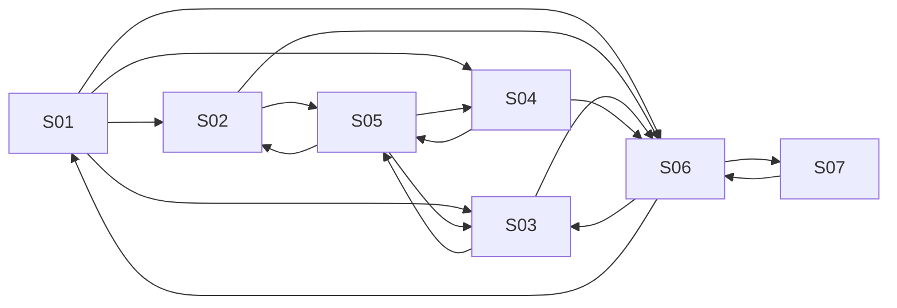

# Component Spec — MK-007

## 1. Identificación

Funcionalidad: **Reglas de venta cruzada y upselling**. Owner: Axel Andree Cueva Alcalá. Issue: [#64](https://github.com/Taller-SW-Web/Productos-y-Ofertas-docs/issues/64). Versión **1.2**, fecha **2026-10-03**, estado **EN REVISIÓN — APROBACIÓN DOCUMENTAL PENDIENTE**. Rama documental `cueva`; construcción/iteración futura en `lab/cueva`. La implementación está bloqueada hasta aprobar este component-spec y confirmar las entradas oficiales. No hay mockup implementado, autovalidación visual ni visto bueno.

## 2. Trazabilidad

| Fuente | Referencia | Uso |
|---|---|---|
| SPEC | [SPEC-007](../../specs/SPEC-007-reglas-venta-cruzada-upselling.md) | Reglas de negocio, campos y límites. |
| HU | [HU-007](../../hu/HU-007-reglas-venta-cruzada-upselling.md) | Criterios de aceptación y actor Gestor Comercial. |
| Wireframe | [WF-007](../../wireframes/flows/WF-007-reglas-venta-cruzada-upselling.md) | Inventario/estructura/copy; no constituye el mockup de alta fidelidad. |
| Navegación | [FLOW-007](../../flujos/FLOW-007-reglas-venta-cruzada-upselling.md) | Entradas, retornos, guardado y estados. |
| Contratos | [OpenAPI 0.5.0](../../api/openapi.yaml), [AsyncAPI 0.4.0](../../asyncapi/asyncapi.yaml), [Contrato API](../../Contrato_Api.md) | Campos/operaciones vigentes; mensajería solo contexto, no botones técnicos. |
| UX | [Propuesta 2.0](../ux/propuesta-ux.md), [UXD](../ux/ux-decisions.md), [UXG](../ux/ux-guidelines.md) | Patrones/normas transversales; aplicabilidad por pantalla y estado. |
| Design System | [DESIGN 1.0.0](../DESIGN.md) | Tokens, tipografía, shell y DS-C aplicables. |
| Pipeline | [Mockups](../README.md), [prototipo](../prototipo/README.md), [INDEX](../../wireframes/INDEX.md), [equipo](../../EQUIPO_Y_RESPONSABILIDADES.md) | Rutas, DoR/DoD, ownership y revisión. |

SPEC/HU/contratos prevalecen sobre artefactos visuales. Una propuesta visual exploratoria no es una fuente funcional ni una aprobación documental. El wireframe previo guía estructura; los valores visuales de alta fidelidad proceden de DESIGN. Consumir versiones vigentes en la rama del equipo al iniciar laboratorio, sin congelar un hash antiguo de master como autoridad.

## 3. Objetivo funcional

El Gestor Comercial define Cross-sell/Upsell por producto o categoría, candidatos, orden, prioridad y vigencia; cada candidato Upsell conserva su criterio de superioridad explícito.

## 4. Alcance

**Incluido:** 7 pantallas P0 de §5, estados/fixtures de §10/13, lectura/alta/edición/cambio de estado documentados, navegación y accesibilidad desktop. Documentación funcional pendiente de aprobación; después el owner implementa/refina, normaliza y autovalida conforme a #61/#64.

**Fuera de alcance:** Sin IA, inferencia por precio, seleccionar automáticamente una variante, agregar/reemplazar productos del comprador, “Probar recomendaciones”, stock físico ni enriquecimientos product-level inventados. La integración backend no se acredita mediante fixtures. No crear nuevos endpoints/permisos/maestros ni pantallas fuera del inventario.

## 5. Inventario de pantallas

| ID | Pantalla | Propósito | Entrada | Acción principal | Salida | Prioridad | Ruta |
| --- | --- | --- | --- | --- | --- | --- | --- |
| MK-007-S01 | Listado de reglas | Comparar reglas y abrir configuración. | Sidebar o ruta directa. | Crear venta cruzada | S02; Crear upselling a S04; editar S03; detalle S06. | P0 | `/MK007/S01` |
| MK-007-S02 | Crear venta cruzada | Relacionar origen con productos complementarios. | S01 / Crear venta cruzada. | Crear regla | S06 tras guardado; S05 para recomendados; cancelar a S01. | P0 | `/MK007/S02` |
| MK-007-S03 | Editar regla | Editar la regla elegida y aplicar requisitos de su tipo. | S01/S06 con reglaId. | Guardar cambios | S06 del mismo registro; S05 regresa al borrador de edición. | P0 | `/MK007/S03` |
| MK-007-S04 | Crear upselling | Configurar alternativas superiores con criterio explícito por producto. | S01 / Crear upselling. | Crear regla de upselling | S06 tras guardado; S05 regresa a esta alta con borrador; cancelar a S01. | P0 | `/MK007/S04` |
| MK-007-S05 | Seleccionar recomendado | Elegir productos activos elegibles para configuración. | S02/S03/S04 con borrador; ruta directa reproduce origen de retorno. | Confirmar selección | Formulario de origen con candidatos preservados; cancelar solo descarta selección temporal. | P0 | `/MK007/S05` |
| MK-007-S06 | Detalle de regla | Leer tipo, origen, prioridad/vigencia y candidatos ordenados. | S01 o guardado confirmado. | Editar regla | S03; Cambiar estado a S07; volver a S01 con contexto. | P0 | `/MK007/S06` |
| MK-007-S07 | Cambiar estado | Confirmar participación de la regla en futuras consultas. | S06 / Cambiar estado; entrada directa reproduce detalle + diálogo. | Activar regla / Desactivar regla | S06 con estado confirmado; cancelación/rechazo no altera badge ni datos. | P0 | `/MK007/S07` |

Cada pantalla mantiene una ruta individual; un diálogo S07 se reproduce con su detalle de fondo. Query `estado` controla fixtures reproducibles, sin aparecer como un selector técnico al usuario. Entrada directa inicializa registro/contexto estable; navegación real conserva el contexto elegido.

## 6. Relación entre pantallas

Todos los nodos son SXX del inventario, no pantallas adicionales. Guardado exitoso va al detalle del registro guardado; fallo corregible conserva formulario. Volver a listado conserva filtros/página. Selector (cuando exista) recuerda pantalla/borrador de origen, confirma selección explícita y vuelve a ese mismo formulario; cancelar no modifica el borrador original. Cerrar con cambios pide Seguir editando/Descartar. Confirmación de estado vuelve al detalle y restituye foco.

## 7. Jerarquía de información

Primaria: tarea, nombre/código de entidad y estado en palabras. Secundaria: configuración/alcance/vigencia/límites pertinentes. Complementaria: ayudas e impacto de acciones, timestamps solo con dato publicado. No inventar KPI/historial o rellenar ausencia con cero. Error de campo aparece junto a etiqueta y un resumen permite localizarlo; rechazo de operación es persistente.

## 8. Componentes compartidos

| ID | Variante / tamaño / uso | Estados y tokens |
|---|---|---|
| DS-C01/02 | Button filled primary / outline secondary md 40 px; ActionIcon 32/40 px con nombre accesible | default/hover/focus/disabled/loading; color/action y color/focus de DESIGN. |
| DS-C03/04/05 | Texto/número md 40 px; textarea solo justificación cuando aplique | label visible, helper/error/read-only; border/control y semánticos de error. |
| DS-C06/07/08/09/11 | Select/MultiSelect/check/radio/fecha-hora según cardinalidad contractual | selección explícita, foco, error y carga localizada; ningún criterio/canal universal por defecto. |
| DS-C13/17/18 | FilterBar padding16, Table filas48/header40, Pagination32 | loading/empty/sin-resultados/error por región; filtros/cuenta contractuales. |
| DS-C14/15/19 | Badge estado textual, Pill seleccionada removible, Card padding24/radio12 sin sombra | estado no depende de color; lectura conocida/ausente diferenciadas. |
| DS-C21 | Modal confirmación 480 px, padding24/radio16 | impacto/cancelar/acción específica; focus trap, Escape y retorno. |
| DS-C22/24/25/28 | Alert persistente, Loader/Skeleton, EmptyState y Breadcrumbs | error/carga/ausencia/retorno real; sin progreso ni éxito ficticios. |

Tema compartido en `prototipo/src/tema/`; composición reutilizable en `src/componentes/`. Tipos/estados no justifican estilos ad hoc; solo instanciar componentes que la pantalla requiera. Inputs y botones de escritura no aparecen en vistas exclusivamente de lectura.

## 9. Componentes específicos

C01 Formulario de regla (DS-C03/04/06/09/11) distingue tipo/origen; C02 Editor de candidatos (DS-C17/04/06/05) muestra orden, criterio y justificación por producto; C03 Selector de producto activo (DS-C17/18/15) excluye origen/repetidos; C04 Confirmación (DS-C21). Criterio se pide por candidato, no global para toda la regla.

### Campos, props y validaciones

| Etiqueta visible | Campo contractual | Regla / representación |
| --- | --- | --- |
| Nombre / tipo | nombre / tipo | Nombre no vacío; CROSS_SELL/UPSELL con etiquetas Venta cruzada/Upselling. S02 y S04 son entradas diferenciadas. |
| Origen | origen.tipo / origen.id | Elegir PRODUCTO o CATEGORIA y referencia válida activa. Nunca mezclar IDs ni recomendar el mismo producto origen. |
| Prioridad | prioridad | Entero positivo; 1 es mayor prioridad. |
| Estado | estado | ACTIVO/INACTIVO, etiquetas Activa/Inactiva para regla; payload no cambia el catálogo EstadoEntidad. |
| Vigencia | validFrom / validUntil | Ambas fechas/horas obligatorias; inicio < fin; zona America/Lima. |
| Recomendados | recomendados[].productId / orden | Uno o más productos activos, sin repetidos ni origen específico; orden entero positivo. Candidatos a nivel producto, no SKU. |
| Criterio | recomendados[].criterioSuperioridad | Cada UPSELL exige MAYOR_RENDIMIENTO, MEJOR_MATERIAL, MAYOR_CAPACIDAD o FUNCIONALIDAD_ADICIONAL; mostrar etiquetas humanas, sin preselección ni inferencia. |
| Justificación | recomendados[].justificacionComercial | Opcional; máximo 500 caracteres. No es una validación automática de superioridad. |
| Precio / disponibilidad | Enriquecimientos informativos | Solo lectura; mientras D-REC-01/02 sigan abiertas: No disponible, sin precio/cantidad ficticios ni agregación SKU. |

El formulario conserva su draft, registro editado, errores y selección de referencias. Props de lectura y capacidades no se mandan como autorización. Guardar enfoca primer error y no comunica éxito hasta resultado; durante envío impide doble click. Labels son humanos; constantes contractuales viven en datos/adaptador, no en copy.

### Operaciones disponibles

| Acción | Operación OpenAPI (relativa al servidor `/api/v1`) | Límite |
|---|---|---|
| Listar | GET `/recomendaciones/reglas` | estado, tipo, pagina, tamanio; sin filtros de prioridad/origen/búsqueda remota no publicados. |
| Crear | POST `/recomendaciones/reglas` | ReglaRecomendacionWriteRequest. |
| Leer / editar | GET/PATCH `/recomendaciones/reglas/{reglaId}` | ReglaRecomendacionAdmin / ReglaRecomendacionUpdateRequest. |
| Estado | POST `/recomendaciones/reglas/{reglaId}/activar` o `/desactivar` | Confirmación explícita. |
| Referencias | GET `/productos`; GET `/categorias/administracion` y `/categorias/{categoriaId}` | Leer entidades activas; categorías con filtros publicados, no inventar búsqueda q. |

Los filtros son parámetros publicados, no sugerencias visuales de búsqueda. Los contratos internos administrativos conservan su condición provisional; la documentación no promete backend productivo.

## 10. Especificación por pantalla

### MK-007-S01 — Listado de reglas

- **Propósito y entrada:** Comparar reglas y abrir configuración. Sidebar o ruta directa.
- **Estructura/contenido:** Filtros Estado/Tipo, tabla Nombre/Tipo/Origen/Prioridad/Vigencia/Estado; Ver detalle/Editar y paginación conocida. Dos acciones de creación claramente nombradas.
- **Jerarquía y componentes:** título/tarea primero; estado/contexto después; datos editables o lectura central; acciones al final. DS-C13/17/18 para consulta; DS-C25/24/22 para vacío/carga/error. No incluir componentes irrelevantes por completar catálogo.
- **Acción primaria / salida:** Crear venta cruzada. S02; Crear upselling a S04; editar S03; detalle S06.
- **Acciones secundarias:** Volver/Cancelar con destino explícito; conservar filtros/página o borrador según §6.
- **Estados requeridos:** default, loading, empty, sin-resultados, error, sesion, permisos; sumar los fixtures específicos de §13 aplicables a esta pantalla. Empty y sin-resultados solo en colecciones; no se representan como una ficha inexistente.
- **Copy propio:** «Todavía no hay reglas de recomendación.»; botones con nombre de acción y entidad, sin MK/WF/UUID/eventos/códigos internos visibles.
- **Reglas y accesibilidad:** fuentes SPEC/HU/WF/FLOW-007, campos/operaciones de §9; UXG-001/006/011/017/020/021/022. Label y error asociados; foco al primer campo inválido; diálogo controla/restaura foco; estado anunciado sin depender del color. Un fallo conserva valores y estado previo.
- **Verificación futura:** entrada directa `/MK007/S01` + `?estado=<fixture>`, interacción del destino, regreso sin pérdida, captura 1440×900 y teclado. Estas rutas son contrato de implementación, **todavía no páginas construidas**.
### MK-007-S02 — Crear venta cruzada

- **Propósito y entrada:** Relacionar origen con productos complementarios. S01 / Crear venta cruzada.
- **Estructura/contenido:** Campos comunes con tipo CROSS_SELL, origen producto/categoría, prioridad/estado/vigencia, uno o más recomendados y orden; no exige criterio de Upsell.
- **Jerarquía y componentes:** título/tarea primero; estado/contexto después; datos editables o lectura central; acciones al final. DS-C19/03/04/06/09/11 para grupos pertinentes; DS-C21 solo para confirmación/descarte; DS-C22 para feedback. No incluir componentes irrelevantes por completar catálogo.
- **Acción primaria / salida:** Crear regla. S06 tras guardado; S05 para recomendados; cancelar a S01.
- **Acciones secundarias:** Volver/Cancelar con destino explícito; conservar filtros/página o borrador según §6.
- **Estados requeridos:** default, guardando, validacion, guardar-error, resultado-desconocido, salida-con-cambios, sesion, permisos; sumar los fixtures específicos de §13 aplicables a esta pantalla. Empty y sin-resultados solo en colecciones; no se representan como una ficha inexistente.
- **Copy propio:** «Selecciona al menos un producto recomendado distinto del origen.»; botones con nombre de acción y entidad, sin MK/WF/UUID/eventos/códigos internos visibles.
- **Reglas y accesibilidad:** fuentes SPEC/HU/WF/FLOW-007, campos/operaciones de §9; UXG-001/002/003/006/011/018/020/021/022. Label y error asociados; foco al primer campo inválido; diálogo controla/restaura foco; estado anunciado sin depender del color. Un fallo conserva valores y estado previo.
- **Verificación futura:** entrada directa `/MK007/S02` + `?estado=<fixture>`, interacción del destino, regreso sin pérdida, captura 1440×900 y teclado. Estas rutas son contrato de implementación, **todavía no páginas construidas**.
### MK-007-S03 — Editar regla

- **Propósito y entrada:** Editar la regla elegida y aplicar requisitos de su tipo. S01/S06 con reglaId.
- **Estructura/contenido:** Precarga origen/tipo/fechas/candidatos reales del fixture. Cambiar tipo/origen confirma valores descartados; UPSELL exige criterio en cada fila. No enlazar siempre a la primera regla.
- **Jerarquía y componentes:** título/tarea primero; estado/contexto después; datos editables o lectura central; acciones al final. DS-C19/03/04/06/09/11 para grupos pertinentes; DS-C21 solo para confirmación/descarte; DS-C22 para feedback. No incluir componentes irrelevantes por completar catálogo.
- **Acción primaria / salida:** Guardar cambios. S06 del mismo registro; S05 regresa al borrador de edición.
- **Acciones secundarias:** Volver/Cancelar con destino explícito; conservar filtros/página o borrador según §6.
- **Estados requeridos:** default, loading, error, no-encontrado, guardando, validacion, guardar-error, resultado-desconocido, salida-con-cambios, sesion, permisos; sumar los fixtures específicos de §13 aplicables a esta pantalla. Empty y sin-resultados solo en colecciones; no se representan como una ficha inexistente.
- **Copy propio:** «Los cambios se conservan mientras corriges los errores.»; botones con nombre de acción y entidad, sin MK/WF/UUID/eventos/códigos internos visibles.
- **Reglas y accesibilidad:** fuentes SPEC/HU/WF/FLOW-007, campos/operaciones de §9; UXG-001/002/003/006/011/018/020/021/022. Label y error asociados; foco al primer campo inválido; diálogo controla/restaura foco; estado anunciado sin depender del color. Un fallo conserva valores y estado previo.
- **Verificación futura:** entrada directa `/MK007/S03` + `?estado=<fixture>`, interacción del destino, regreso sin pérdida, captura 1440×900 y teclado. Estas rutas son contrato de implementación, **todavía no páginas construidas**.
### MK-007-S04 — Crear upselling

- **Propósito y entrada:** Configurar alternativas superiores con criterio explícito por producto. S01 / Crear upselling.
- **Estructura/contenido:** Tipo UPSELL explícito, campos comunes y tabla de candidatos con orden, Select de criterio sin default y justificación opcional. Mayor precio no basta.
- **Jerarquía y componentes:** título/tarea primero; estado/contexto después; datos editables o lectura central; acciones al final. DS-C19/03/04/06/09/11 para grupos pertinentes; DS-C21 solo para confirmación/descarte; DS-C22 para feedback. No incluir componentes irrelevantes por completar catálogo.
- **Acción primaria / salida:** Crear regla de upselling. S06 tras guardado; S05 regresa a esta alta con borrador; cancelar a S01.
- **Acciones secundarias:** Volver/Cancelar con destino explícito; conservar filtros/página o borrador según §6.
- **Estados requeridos:** default, guardando, validacion, upsell-incompleto, guardar-error, resultado-desconocido, salida-con-cambios, sesion, permisos; sumar los fixtures específicos de §13 aplicables a esta pantalla. Empty y sin-resultados solo en colecciones; no se representan como una ficha inexistente.
- **Copy propio:** «Indica por qué cada producto recomendado es superior.»; botones con nombre de acción y entidad, sin MK/WF/UUID/eventos/códigos internos visibles.
- **Reglas y accesibilidad:** fuentes SPEC/HU/WF/FLOW-007, campos/operaciones de §9; UXG-001/002/003/006/011/018/020/021/022. Label y error asociados; foco al primer campo inválido; diálogo controla/restaura foco; estado anunciado sin depender del color. Un fallo conserva valores y estado previo.
- **Verificación futura:** entrada directa `/MK007/S04` + `?estado=<fixture>`, interacción del destino, regreso sin pérdida, captura 1440×900 y teclado. Estas rutas son contrato de implementación, **todavía no páginas construidas**.
### MK-007-S05 — Seleccionar recomendado

- **Propósito y entrada:** Elegir productos activos elegibles para configuración. S02/S03/S04 con borrador; ruta directa reproduce origen de retorno.
- **Estructura/contenido:** Productos a nivel productId; filtros contractuales de Catálogo; origen específico, inactivos y añadidos excluidos. Etiqueta humana y selección explícita; no SKU/variante automática ni stock ficticio.
- **Jerarquía y componentes:** título/tarea primero; estado/contexto después; datos editables o lectura central; acciones al final. DS-C13/17/18 para consulta; DS-C25/24/22 para vacío/carga/error. No incluir componentes irrelevantes por completar catálogo.
- **Acción primaria / salida:** Confirmar selección. Formulario de origen con candidatos preservados; cancelar solo descarta selección temporal.
- **Acciones secundarias:** Volver/Cancelar con destino explícito; conservar filtros/página o borrador según §6.
- **Estados requeridos:** default, loading, empty, sin-resultados, error, salida-con-cambios, sesion, permisos; sumar los fixtures específicos de §13 aplicables a esta pantalla. Empty y sin-resultados solo en colecciones; no se representan como una ficha inexistente.
- **Copy propio:** «El producto de origen y los ya añadidos no aparecen como opciones.»; botones con nombre de acción y entidad, sin MK/WF/UUID/eventos/códigos internos visibles.
- **Reglas y accesibilidad:** fuentes SPEC/HU/WF/FLOW-007, campos/operaciones de §9; UXG-001/002/003/006/011/018/020/021/022. Label y error asociados; foco al primer campo inválido; diálogo controla/restaura foco; estado anunciado sin depender del color. Un fallo conserva valores y estado previo.
- **Verificación futura:** entrada directa `/MK007/S05` + `?estado=<fixture>`, interacción del destino, regreso sin pérdida, captura 1440×900 y teclado. Estas rutas son contrato de implementación, **todavía no páginas construidas**.
### MK-007-S06 — Detalle de regla

- **Propósito y entrada:** Leer tipo, origen, prioridad/vigencia y candidatos ordenados. S01 o guardado confirmado.
- **Estructura/contenido:** Orden ascendente, criterio/justificación por candidato con etiquetas humanas. Precio/Disponibilidad: No disponible mientras decisión abierta; no simulador ni carrito.
- **Jerarquía y componentes:** título/tarea primero; estado/contexto después; datos editables o lectura central; acciones al final. DS-C19/03/04/06/09/11 para grupos pertinentes; DS-C21 solo para confirmación/descarte; DS-C22 para feedback. No incluir componentes irrelevantes por completar catálogo.
- **Acción primaria / salida:** Editar regla. S03; Cambiar estado a S07; volver a S01 con contexto.
- **Acciones secundarias:** Volver/Cancelar con destino explícito; conservar filtros/página o borrador según §6.
- **Estados requeridos:** default, loading, error, no-encontrado, sesion, permisos; sumar los fixtures específicos de §13 aplicables a esta pantalla. Empty y sin-resultados solo en colecciones; no se representan como una ficha inexistente.
- **Copy propio:** «Las recomendaciones no agregan ni reemplazan productos automáticamente.»; botones con nombre de acción y entidad, sin MK/WF/UUID/eventos/códigos internos visibles.
- **Reglas y accesibilidad:** fuentes SPEC/HU/WF/FLOW-007, campos/operaciones de §9; UXG-001/006/011/017/020/021/022. Label y error asociados; foco al primer campo inválido; diálogo controla/restaura foco; estado anunciado sin depender del color. Un fallo conserva valores y estado previo.
- **Verificación futura:** entrada directa `/MK007/S06` + `?estado=<fixture>`, interacción del destino, regreso sin pérdida, captura 1440×900 y teclado. Estas rutas son contrato de implementación, **todavía no páginas construidas**.
### MK-007-S07 — Cambiar estado

- **Propósito y entrada:** Confirmar participación de la regla en futuras consultas. S06 / Cambiar estado; entrada directa reproduce detalle + diálogo.
- **Estructura/contenido:** Diálogo 480 px con nombre, estado destino y efecto en consultas. Sin borrar candidatos ni sustituir productos; esperar resultado para comunicar éxito.
- **Jerarquía y componentes:** título/tarea primero; estado/contexto después; datos editables o lectura central; acciones al final. DS-C19/03/04/06/09/11 para grupos pertinentes; DS-C21 solo para confirmación/descarte; DS-C22 para feedback. No incluir componentes irrelevantes por completar catálogo.
- **Acción primaria / salida:** Activar regla / Desactivar regla. S06 con estado confirmado; cancelación/rechazo no altera badge ni datos.
- **Acciones secundarias:** Cancelar; cerrar con Escape devuelve foco al disparador.
- **Estados requeridos:** default, loading, guardando, rechazo, resultado-desconocido, sesion, permisos; sumar los fixtures específicos de §13 aplicables a esta pantalla. Empty y sin-resultados solo en colecciones; no se representan como una ficha inexistente.
- **Copy propio:** «Desactivar excluye esta regla de nuevas recomendaciones; su configuración se conserva.»; botones con nombre de acción y entidad, sin MK/WF/UUID/eventos/códigos internos visibles.
- **Reglas y accesibilidad:** fuentes SPEC/HU/WF/FLOW-007, campos/operaciones de §9; UXG-001/002/003/006/011/018/020/021/022. Label y error asociados; foco al primer campo inválido; diálogo controla/restaura foco; estado anunciado sin depender del color. Un fallo conserva valores y estado previo.
- **Verificación futura:** entrada directa `/MK007/S07` + `?estado=<fixture>`, interacción del destino, regreso sin pérdida, captura 1440×900 y teclado. Estas rutas son contrato de implementación, **todavía no páginas construidas**.

## 11. Decisiones UX locales

### LUX-01 — Composición propia de reglas de venta cruzada y upselling

Entrada propia para crear Upselling S04, conforme al S-02-U de WF-007; formulario hasta 880 px y criterio junto a cada recomendado. Alternativa: un campo global de superioridad; descartada porque SPEC-007 exige un criterio por candidato. Trade-off: segunda ruta de alta, compartiendo formulario base; verificar cada fila y estado upsell-incompleto. Se subordina a UXD-001/002 y UXG-001/002/003; no modifica tokens ni un patrón transversal. Validación de la elección visual pendiente de implementación, autovalidación y revisión UX.

## 12. Reglas de layout PC

Viewport canónico **1440×900**, scroll vertical. Header64, sidebar240 y padding32 de DESIGN §5; contenido útil1136 antes del scrollbar. Formulario máximo **880 px** alineado a izquierda, gaps24 y separación de secciones32. Inter para cuerpo, Oswald H1 según DESIGN; no uppercase global. Tokens exactos centralizados; iconos Tabler16/20/24. Tabla limita su scroll a la región, página sin overflow horizontal. Alcance web desktop de mockups: la antigua indicación móvil de WF-007 no crea una variante móvil en esta entrega. Responsive desktop no altera reglas del formulario.

## 13. Fixtures

Completa tu carrera: CROSS_SELL, origen PRODUCTO Running Essential, recomendado Medias técnicas con orden=1, prioridad=1, ACTIVO. Mejora tu rendimiento: UPSELL, origen PRODUCTO Running Essential, recomendado Running Pro con orden=1, criterio MAYOR_RENDIMIENTO y justificación opcional de hasta 500 caracteres, prioridad=2, INACTIVO. Variante de origen CATEGORIA Running. Vigencia 2026-10-01T00:00:00-05:00 a 2026-11-01T00:00:00-05:00. Precio/disponibilidad ausentes, visibles como No disponible. Estos nombres/criterios son datos ficticios, no catálogo real ni certificación de superioridad.

### Estados comunes, aplicados según §10

| Fixture | Entrada controlada | Resultado / fuente |
|---|---|---|
| default | Registro/colección válida de este MK | Datos ficticios identificados, referencias resueltas al registro correcto; UXG-022. |
| loading / guardando | Lectura/envío pendiente | Skeleton/loader localizado, texto accesible, sin porcentaje; UXG-007/008/011. |
| empty | Colección vacía antes de filtrar | Acción Crear cuando existe; nunca convertir detalle 404 en vacío; UXG-006/011. |
| sin-resultados | Filtros aplicados sin coincidencias | Limpiar filtros; conservar filtros al abrir/regresar; UXG-001/006. |
| error / no-encontrado | Lectura fallida / 404 de recurso | Reintentar consulta / Volver a listado; sin cifras ficticias; contrato GET, UXG-011/017. |
| sesion / permisos | 401 / 403 | Mensaje comprensible, escritura bloqueada; no inventar login ni scopes; contrato y UXG-020. |
| validacion / guardar-error | Campos inválidos / rechazo conocido | Errores localizados, conservar entradas y corregir; SPEC/HU, UXG-002/006/011/021. |
| salida-con-cambios | Cancelar con draft distinto al inicial | Seguir editando/Descartar; retorno/foco; UXG-002/021. |
| rechazo | Cambio de estado rechazado | Estado previo intacto y explicación; UXG-018. |
| resultado-desconocido | Respuesta perdida/no confirmada | No afirmar éxito ni reenviar mutación automáticamente; consultar/reconciliar resultado por contrato; UXG-011/018. |

### Casos específicos

| Fixture | Pantallas | Resultado esperado |
| --- | --- | --- |
| upsell-incompleto | S03/S04 | Cada recomendado sin criterio genera error en esa fila; no rellenar automáticamente con Mayor rendimiento. |
| origen-categoria | S02/S03/S04 | Cambiar tipo de origen exige una categoría válida y confirmación si descarta selección; persistir tipo e ID coherentes. |
| origen-como-recomendado | S05 | Excluir producto origen; categoría origen no se confunde con productId. |
| duplicado-inactivo | S05 | Excluir productos ya añadidos/inactivos; no limpiar recomendaciones silenciosamente ante error de consulta. |
| regla-invalida | S02/S03/S04 | Fechas ausentes/invertidas, prioridad/orden cero-negativo-fraccionario, lista vacía y justificación de 501: conservar y corregir. |
| enriquecimiento-ausente | S06 | No disponible para precio/disponibilidad por producto; no inventar cero ni elegir SKU para completar datos. |
| cambio-tipo | S03 | Cambiar a UPSELL muestra criterio obligatorio en cada candidato; cambiar origen/tipo no descarta campos sin advertir. |

Todos son escenarios por implementar y verificar; un dato fixture no certifica una integración ni aprobación. Los ejemplos monetarios no fijan moneda/precisión del sistema por composición visual.

## 14. Preguntas y supuestos

D-REC-01/02 siguen abiertas en SPEC-007 y contrato: disponibilidad/precio agregados por producto no se inventan. Su ausencia no bloquea documentar ni construir la configuración administrativa; bloquea afirmar esos enriquecimientos como resueltos. Los estados se alinean con EstadoEntidad de OpenAPI, aunque la etiqueta de una regla use femenino.

La propuesta exploratoria está **pendiente de Vera**, confirmada por Axel. No se solicita otra búsqueda ni se sustituye por el HTML de wireframes. La revisión UX transversal y la fidelidad Figma siguen pendientes. Supuesto de representación: gestor autorizado salvo fixture 401/403; fixtures no conceden permisos reales. Base futura debe venir identificada con MK/pantallas/ancla/supuestos/dudas.

## 15. Criterios de aceptación

- 7 pantallas/rutas P0 de §5 y estados aplicables reproducibles, sin rutas ya declaradas construidas.
- Campos/operaciones/validaciones de §9 fieles a SPEC/HU/WF/FLOW/contratos; ningún botón técnico ni acción de otro módulo.
- Formularios/selecciones/registros y retorno contextual preservados; guardado/estado solo confirmados con resultado.
- Aplicación de DS/UX y accesibilidad desktop1440: tokens compartidos, labels, foco, error localizable y sin overflow.
- Tareas ejecutables y evidencia propia del mockup antes de revisión de Vera; visto bueno verificable antes de Figma/promoción del código.
- Cierre de #64 solo con revisión, Figma/fidelidad y reporte final; la redacción de este paquete no acredita aprobación ni cierra el issue.
