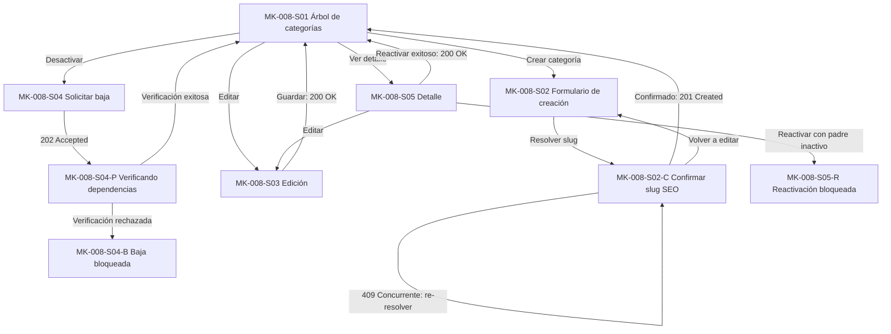

# MK-008 — Component Spec: gestión de categorías y subcategorías

## 1. Identificación y estado

| Campo | Valor |
|---|---|
| Issue / coordinación | Ejecución general #61; entradas transversales #59 y #60 |
| Responsable / rama | Leonardo Lopez (`lopez`) / `lopez` |
| Versión / fecha | 1.0.0 / 2026-10-03 |
| Estado documental | En revisión; no acredita aprobación funcional, implementación ni visto bueno para Figma |
| Funcionalidad / actor | Taxonomía de catálogo: árbol recursivo, categorías raíz y subcategorías / Gestor Comercial |
| Plataforma | Web desktop; revisión canónica a 1440 × 900 px, con scroll vertical |

Este documento define la especificación formal del resultado esperado de MK-008. [Plan](plan.md) establece cómo construirlo y [Tasks](tasks.md) define las unidades ejecutables y verificaciones. Subordinado a las fuentes de verdad, no redefine reglas de negocio ni introduce una propuesta UX paralela.

---

## 2. Fuentes y trazabilidad

| Fuente | Alcance consumido |
|---|---|
| [SPEC-008](../../specs/SPEC-008-gestion-categorias.md) | Modelo recursivo, profundidad MVP `MAX_CATEGORY_DEPTH=2`, resolución/confirmación de slug, baja lógica segura asíncrona, prohibición de ciclos |
| [HU-008](../../hu/HU-008-gestion-categorias.md) | Criterios de aceptación CA-01 a CA-16: navegación, creación, edición, desactivación con dependencias y reactivación |
| [WF-008](../../wireframes/flows/WF-008-gestion-categorias.md) | Pantallas S-01 a S-05 (con variantes S-02-C, S-04-P, S-04-B, S-05-R), jerarquía y distribución visual |
| [FLOW-008](../../flujos/FLOW-008-gestion-categorias.md) | §4.1 consulta de árbol; §4.2 creación con slug SEO; §4.3 actualización y jerarquía; §4.4 baja lógica con Catálogo |
| [OpenAPI 0.5.0](../../api/openapi.yaml) | `CategoriaAdmin`, `CategoriaWriteRequest`, `CategoriaTreeNode`, `/categorias`, `/categorias/arbol`, `/categorias/{id}`, `/categorias/{id}/desactivar`, `/categorias/{id}/reactivar`, `/seo/categorias/slug/resolver` |
| [AsyncAPI](../../asyncapi/asyncapi.yaml), [Contrato API](../../Contrato_Api.md) | Protocolo transversal de baja de entidad maestra (`taxonomy.master.deactivation.check.requested`, `catalog.master.deactivation.checked`, etc.) |
| [Propuesta UX](../ux/propuesta-ux.md) | UX 2.0; matriz de aplicabilidad: UX-P01 Alta (visibilidad de estado/árbol), UX-P02 Media (revelación de jerarquía), UX-P03 Alta (recuperación de slug y baja segura) |
| [UX Decisions](../ux/ux-decisions.md) | UXD-001 (contexto), UXD-005 (feedback situado), UXD-007 (confirmación de slug), UXD-008 (estados transitorios), UXD-009 (recuperación concurrente), UXD-011 (acciones críticas) |
| [UX Guidelines](../ux/ux-guidelines.md) | UXG-001, UXG-002, UXG-007 a UXG-015, UXG-018, UXG-020 a UXG-022 |
| [Design System](../DESIGN.md) | Versión 1.0.0: layout desktop, foundations, DS-C01, DS-C02, DS-C03, DS-C05, DS-C06, DS-C14, DS-C17, DS-C19, DS-C21, DS-C22, DS-C24, DS-C25, DS-C28 |
| [Gobernanza](../../EQUIPO_Y_RESPONSABILIDADES.md) | Ownership funcional de `taxonomy-svc`, revisión transversal UX por Leonardo Vera Rodríguez |

---

## 3. Objetivo funcional, alcance y límites

### 3.1. Objetivo
Permitir al Gestor Comercial administrar la taxonomía del catálogo mediante un árbol de navegación recursivo, facilitando la creación de categorías con slug SEO confirmado, la actualización de su jerarquía (hasta profundidad 2 en MVP) y la desactivación segura coordinada con Catálogo para no romper productos activos.

### 3.2. Alcance incluido
- Consulta visual del árbol jerárquico de categorías (raíz y subcategorías).
- Creación de categorías solicitando resolución de slug a SEO (`POST /seo/categorias/slug/resolver`), mostrando la propuesta al gestor y confirmándola antes de persistir (`POST /categorias`).
- Manejo determinista de colisión de slug (sufijo `-2`) y recuperación ante carrera concurrente (`409 SLUG_DUPLICADO`).
- Edición de nombre, descripción, orden, imagen y categoría padre con validación de ciclos y profundidad.
- Desactivación lógica con estado intermedio `Verificando dependencias en productos` (202 Accepted) y resolución segura (Confirmada o Rechazada por productos vinculados).
- Detalle de categoría y reactivación (bloqueada si la categoría padre continúa inactiva).

### 3.3. Fuera de alcance
- Las categorías **NO definen ni asignan atributos/características de producto** (responsabilidad exclusiva de `TipoProducto` en MK-010).
- No existe eliminación física de categorías (únicamente baja lógica / desactivación).
- No se edita la configuración SEO ni metatítulos desde esta interfaz (corresponde a MK-012).
- No se permiten jerarquías de más de 2 niveles en MVP (`MAX_CATEGORY_DEPTH=2`).

---

## 4. Inventario completo de pantallas P0

| ID | Correspondencia WF / Propósito | Entrada y acción principal / salida | Ruta directa |
|---|---|---|---|
| MK-008-S01 | WF S-01; Árbol y listado de categorías | Vista del árbol jerárquico; colapsar/expandir nodos, filtrar por texto/estado; abrir creación, edición, detalle o baja | `/MK008/S01` |
| MK-008-S02 | WF S-02; Formulario de creación de categoría | Entrada de nombre, descripción, imagen, orden y padre opcional; «Continuar a revisión de slug» | `/MK008/S02` |
| MK-008-S02-C | WF S-02-C; Diálogo de confirmación de slug SEO | Slug resuelto por SEO (`/categoria/{slug}`); advertencia si hubo sufijo (`colisionResuelta: true`); «Confirmar creación» / «Volver a editar» | `/MK008/S02-C` |
| MK-008-S03 | WF S-03; Formulario de edición de categoría | Selección de categoría; edición de datos y categoría padre (con validación de profundidad y ciclo); «Guardar cambios» | `/MK008/S03` |
| MK-008-S04 | WF S-04; Diálogo de solicitud de desactivación | Explicación del impacto; confirmación de inicio de verificación; «Solicitar desactivación» | `/MK008/S04` |
| MK-008-S04-P | WF S-04-P; Estado transitorio verificando dependencias | Estado `DESACTIVACION_PENDIENTE` (202 Accepted); mensaje informativo sin timeout ficticio | `/MK008/S04-P` |
| MK-008-S04-B | WF S-04-B; Desactivación rechazada / bloqueada | Notificación de rechazo por Catálogo debido a productos activos vinculados; «Entendido» | `/MK008/S04-B` |
| MK-008-S05 | WF S-05; Vista de detalle de categoría | Lectura completa de metadatos, categoría padre, subcategorías hijas, estado y slug; acciones de edición o reactivación | `/MK008/S05` |
| MK-008-S05-R | WF S-05-R; Reactivación bloqueada por padre inactivo | Intento de reactivar subcategoría cuyo padre está `INACTIVO`; mensaje explicativo y bloqueo de acción | `/MK008/S05-R` |

---

## 5. Navegación y jerarquía de pantallas

---

## 6. Contratos de datos y operaciones admitidas

Base HTTP: `/api/v1`.

| Operación / Endpoint | Uso en MK-008 | Contrato / DTO | Regla de representación en interfaz |
|---|---|---|---|
| `GET /categorias/arbol` | S01 | Array de `CategoriaTreeNode` | Carga el árbol completo; representación con sangría/jerarquía; indicador de profundidad actual |
| `GET /categorias` | S01, S02, S03 | Array de `CategoriaAdmin` | Listado plano para selectores de categoría padre (solo categorías activas) |
| `POST /seo/categorias/slug/resolver` | S02 → S02C | Req: `SlugCategoriaResolveRequest { nombre }` Res: `SlugCategoriaResolveResponse { slug, colisionResuelta }` | Pre-resolución de slug; muestra el slug final propuesto y alerta si hubo colisión con sufijo numérico |
| `POST /categorias` | S02C | Req: `CategoriaWriteRequest { nombre, descripcion, categoriaPadreId, orden, imagenUrl, slugConfirmado }` Res: 201 `CategoriaAdmin` | Creación atómica; envía exactamente el `slugConfirmado`; ante `409 SLUG_DUPLICADO`, bloquea y obliga a re-resolver |
| `GET /categorias/{categoriaId}` | S03, S05 | Res: 200 `CategoriaAdmin` | Carga datos de la categoría para edición o detalle |
| `PUT /categorias/{categoriaId}` | S03 | Req: `CategoriaWriteRequest` Res: 200 `CategoriaAdmin` | Actualización; slug no es editable; validar que el padre seleccionado no genere ciclos ni exceda profundidad 2 |
| `POST /categorias/{categoriaId}/desactivar` | S04 → S04P | Res: 202 `Accepted` con `OperacionMaestra` | Admisión de la solicitud; UI transiciona a S-04-P; no asumir desactivación inmediata |
| `POST /categorias/{categoriaId}/reactivar` | S05 | Res: 200 `CategoriaAdmin` (o 400 si padre inactivo) | Reactivación síncrona; si padre está inactivo, UI muestra advertencia y bloquea el botón |

### Reglas críticas de interacción:
1. **Resolución de slug SEO:** El slug nunca se genera en el cliente. Se consulta a SEO, se muestra al usuario en S02-C con formato `/categoria/{slug}`. Si `colisionResuelta: true`, se muestra alerta informativa: *"El slug propuesto incluye un sufijo incremental para evitar colisiones con URLs existentes"*.
2. **Carrera concurrente (409):** Si al confirmar en S02-C el backend responde `409`, la interfaz informa: *"El slug fue ocupado por otra operación simultánea"*, solicita una nueva resolución a SEO y requiere nueva confirmación del gestor.
3. **Profundidad de jerarquía:** Solo se permite seleccionar categorías padre de nivel 1 (raíz). Las subcategorías no pueden ser seleccionadas como padre de otras categorías (`MAX_CATEGORY_DEPTH=2`).

---

## 7. Componentes del Design System utilizados

| Componente DS | Identificador | Pantallas | Uso específico |
|---|---|---|---|
| Botón principal y secundario | DS-C01 | S01–S05R | Acciones de crear, guardar, confirmar, volver y cancelar |
| Iconos de acción | DS-C02 | S01, S05 | Expandir/colapsar nodo, acciones rápidas de fila (ver, editar, desactivar) |
| Input de texto | DS-C03 | S01, S02, S03 | Nombre de categoría, buscador en árbol, URL de imagen |
| Área de texto | DS-C05 | S02, S03 | Descripción de categoría |
| Selector desplegable | DS-C06 | S02, S03 | Selección de categoría padre (muestra solo categorías activas raíz) |
| Badge / Etiqueta de estado | DS-C14 | S01, S05 | Estado `ACTIVO`, `INACTIVO`, `VERIFICANDO_BAJA` y badge de nivel jerárquico |
| Tabla y árbol | DS-C17 | S01 | Representación tabular/árbol con nodos hijos indentados |
| Card de contenedor | DS-C19 | S01, S02, S03, S05 | Contenedor principal de datos y metadatos |
| Modal de diálogo | DS-C21 | S02C, S04, S04B, S05R | Confirmación de slug, diálogo de baja y avisos de bloqueo |
| Alerta contextual | DS-C22 | S02C, S04P, S04B, S05R | Alertas de colisión resuelta, dependencias en verificación y errores concurrentes |
| Skeleton / Loader | DS-C24 | S01, S03, S05 | Estados de carga inicial y resolución asíncrona de slug |
| Estado vacío | DS-C25 | S01 | Árbol sin categorías configuradas o sin coincidencias de filtro |
| Migas de pan | DS-C28 | S01–S05 | Navegación contextual: `Inicio > Taxonomía > Categorías` |

---

## 8. Componentes locales (`MK-008-CXX`)

| ID | Nombre | Pantallas | Props principales | Comportamiento y accesibilidad |
|---|---|---|---|---|
| MK-008-C01 | ArbolCategorias | S01 | `nodos: CategoriaTreeNode[]`, `onSelect`, `onAction` | Renderiza árbol accesible con `aria-expanded`, sangría por nivel y conteo de subcategorías |
| MK-008-C02 | SelectorPadreJerarquico | S02, S03 | `categorias: CategoriaAdmin[]`, `categoriaActualId?: string`, `padreId?: string`, `onChange` | Filtra autorreferencias y categorías de nivel 2 (máxima profundidad alcanzada); muestra nivel |
| MK-008-C03 | ConfirmacionSlugModal | S02-C | `isOpen: boolean`, `nombre: string`, `slug: string`, `colision: boolean`, `onConfirm`, `onCancel` | Modal accesible (focus trap) con vista previa de URL canónica `/categoria/{slug}` y badge explicativo |
| MK-008-C04 | BannerEstadoBaja | S04-P, S04-B | `estado: 'verificando'\|'rechazado'`, `detalle?: string`, `onClose` | Banner no intrusivo con icono y descripción clara del estado del proceso de desactivación |

---

## 9. Decisiones UX locales (`LUX-08`)

* **LUX-08-01: Visualización explicativa de profundidad máxima:**  
  En el selector de categoría padre (`MK-008-C02`), las subcategorías existentes se muestran deshabilitadas con el texto explicativo *(Nivel máximo de anidación alcanzado: 2)* en lugar de ocultarlas, para evitar confusión en el gestor sobre su existencia.
* **LUX-08-02: Vista previa de URL en confirmación de slug:**  
  En el diálogo S02-C, el slug propuesto no se muestra como un campo de texto simple, sino dentro de una caja estilizada que simula la URL pública final (`https://marketplace.com/categoria/calzado-deportivo-2`), con resaltado visual sobre el sufijo si hubo colisión resuelta.

---

## 10. Fixtures deterministas para prototipo

| Fixture ID | Escenario representado | Datos mock |
|---|---|---|
| `FX-008-01` | Árbol completo con 2 niveles | Raíz: `Calzado` (activa, nivel 1), `Ropa` (activa, nivel 1); Subcategorías: `Running` (padre: Calzado, nivel 2), `Casual` (padre: Calzado, nivel 2) |
| `FX-008-02` | Slug resuelto sin colisión | Nombre: `Deportes de Montaña` → slug: `deportes-de-montana`, `colisionResuelta: false` |
| `FX-008-03` | Slug resuelto con colisión | Nombre: `Fútbol` → slug: `futbol-2`, `colisionResuelta: true` |
| `FX-008-04` | Carrera concurrente 409 | Confirmar `futbol-2` → error `409 SLUG_DUPLICADO` → re-resolver a `futbol-3` |
| `FX-008-05` | Desactivación en verificación (202) | Categoría `Running` en proceso de verificación asíncrona de dependencias |
| `FX-008-06` | Desactivación rechazada por productos | Rechazo con 34 productos asociados activos en Catálogo |
| `FX-008-07` | Reactivación bloqueada por padre inactivo | Subcategoría `Running` inactiva con padre `Calzado` en estado `INACTIVO` |

---

## 11. Criterios de aceptación (Coverage HU-008)

- [ ] **CA-01 (Árbol jerárquico):** S01 muestra categorías raíz y subcategorías ordenadas con estado visual.
- [ ] **CA-02 (Creación y SEO):** S02 y S02-C resuelven y muestran slug final antes de crear.
- [ ] **CA-03 (Colisión de slug):** S02-C resalta el sufijo cuando `colisionResuelta: true`.
- [ ] **CA-04 (Concurrencia 409):** S02-C reacciona a colisión en persistencia solicitando nueva propuesta.
- [ ] **CA-05 (Profundidad máxima):** S02 y S03 restringen la jerarquía a máximo 2 niveles.
- [ ] **CA-06 (Prevención de ciclos):** S03 no permite seleccionar la propia categoría ni sus descendientes como padre.
- [ ] **CA-07 (Baja segura):** S04 transiciona a S04-P con 202 Accepted y muestra S04-B si hay productos asociados.
- [ ] **CA-08 (Reactivación controlada):** S05 valida el estado del padre antes de permitir reactivar.
