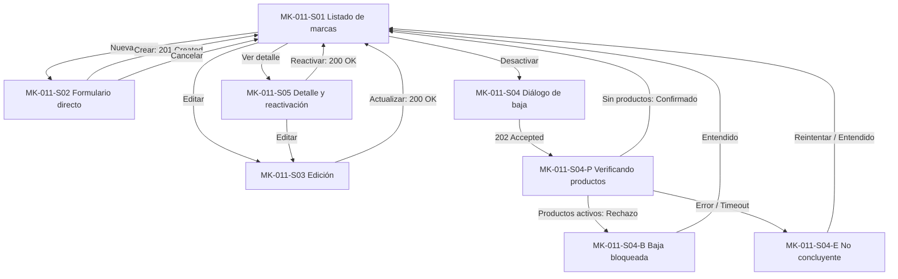

# MK-011 — Component Spec: gestión de marcas

## 1. Identificación y estado

| Campo | Valor |
|---|---|
| Issue / coordinación | Ejecución general #61; entradas transversales #59 y #60 |
| Responsable / rama | Leonardo Lopez (`lopez`) / `lopez` |
| Versión / fecha | 1.0.0 / 2026-10-03 |
| Estado documental | En revisión; no acredita aprobación funcional, implementación ni visto bueno para Figma |
| Funcionalidad / actor | Catálogo maestro de marcas comerciales / Gestor Comercial |
| Plataforma | Web desktop; revisión canónica a 1440 × 900 px, con scroll vertical |

Este documento define la especificación formal del resultado esperado de MK-011. [Plan](plan.md) define la estrategia constructiva y [Tasks](tasks.md) las acciones ejecutables. Subordinado a las fuentes normativas, no redefine reglas de negocio ni introduce una propuesta UX paralela.

---

## 2. Fuentes y trazabilidad

| Fuente | Alcance consumido |
|---|---|
| [SPEC-011](../../specs/SPEC-011-gestion-marcas.md) | Unicidad estricta de nombre (entre activas e inactivas), formatos de logo (PNG/JPG/JPEG/WebP <=5 MB), código de país ISO 3166-1, baja segura mediante protocolo transversal de entidad maestra |
| [HU-011](../../hu/HU-011-gestion-marcas.md) | Criterios CA-01 a CA-10: alta con campos opcionales, validación de archivos, selector de país ISO, baja asíncrona y reactivación |
| [WF-011](../../wireframes/flows/WF-011-gestion-marcas.md) | Pantallas S-01 a S-05 (con S-04-P, S-04-B y S-04-E), formulario directo sin wizard y copy normativo |
| [FLOW-011](../../flujos/FLOW-011-gestion-marcas.md) | §4.1 consulta de marcas; §4.2 creación directa; §4.3 actualización; §4.4 baja segura con Catálogo |
| [OpenAPI 0.5.0](../../api/openapi.yaml) | `MarcaAdmin`, `MarcaMultipart`, `/marcas`, `/marcas/{id}`, `/marcas/{id}/desactivar`, `/marcas/{id}/reactivar`, `/marcas/administracion` |
| [AsyncAPI](../../asyncapi/asyncapi.yaml), [Contrato API](../../Contrato_Api.md) | Protocolo transversal de entidad maestra para baja de marcas; ausencia de mensajería síncrona/asíncrona inventada en UI |
| [Propuesta UX](../ux/propuesta-ux.md) | UX 2.0; matriz de aplicabilidad: UX-P01 Alta (visibilidad de marcas y estado), UX-P02 No aplicable (formulario corto y directo; no usar wizard), UX-P03 Alta (conservación de datos ante error y degradación segura) |
| [UX Decisions](../ux/ux-decisions.md) | UXD-001 (contexto), UXD-002 (formulario directo sin wizard), UXD-003 (tablas legibles), UXD-005 (feedback situado), UXD-008 (estados transitorios), UXD-011 (acciones críticas) |
| [UX Guidelines](../ux/ux-guidelines.md) | UXG-003, UXG-005, UXG-009 a UXG-015, UXG-018, UXG-020 a UXG-022 |
| [Design System](../DESIGN.md) | Versión 1.0.0: layout desktop, foundations, DS-C01, DS-C02, DS-C03, DS-C05, DS-C06, DS-C14, DS-C17, DS-C19, DS-C21, DS-C22, DS-C24, DS-C25, DS-C28 |
| [Gobernanza](../../EQUIPO_Y_RESPONSABILIDADES.md) | Ownership funcional de `taxonomy-svc`, revisión transversal UX por Leonardo Vera Rodríguez |

---

## 3. Objetivo funcional, alcance y límites

### 3.1. Objetivo
Permitir al Gestor Comercial administrar el catálogo unificado de marcas de los productos, facilitando la creación rápida con logo y país normalizado, su actualización y su desactivación segura verificando que no existan productos activos vinculados en Catálogo.

### 3.2. Alcance incluido
- Listado administrativo con filtros de búsqueda por nombre y estado (`ACTIVO`/`INACTIVO`).
- Creación rápida de marcas mediante formulario directo (sin wizard ni pasos): nombre obligatorio, descripción opcional, selector de país ISO 3166-1 y carga de logo (máx. 5 MB).
- Validación de unicidad de nombre en cliente/servidor (el nombre no puede coincidir con ninguna marca existente, activa o inactiva).
- Edición de metadatos de la marca y reemplazo de logo.
- Desactivación lógica con secuencia visible: `Solicitud recibida → Verificando productos (202 Accepted) → Confirmada / Rechazada / No concluyente`.
- Vista de detalle y reactivación de marca.

### 3.3. Fuera de alcance
- No hay eliminación física de marcas.
- No se permiten formatos de imagen distintos a PNG, JPG, JPEG o WebP, ni archivos mayores a 5 MB.
- No existe integración con mensajería de eventos expuesta al usuario; la interfaz no muestra nombres de tópicos o colas.
- No se implementa wizard paso a paso para la creación de marca (por definición de UX-P02 en `propuesta-ux.md`).

---

## 4. Inventario completo de pantallas P0

| ID | Correspondencia WF / Propósito | Entrada y acción principal / salida | Ruta directa |
|---|---|---|---|
| MK-011-S01 | WF S-01; Listado administrativo de marcas | Vista tabular con logo, nombre, país, estado y acciones; buscador y filtros | `/MK011/S01` |
| MK-011-S02 | WF S-02; Formulario de creación de marca | Formulario directo (nombre, descripción, selector ISO, file upload); «Guardar marca» | `/MK011/S02` |
| MK-011-S03 | WF S-03; Formulario de edición de marca | Formulario precargado con datos y logo actual; «Actualizar marca» | `/MK011/S03` |
| MK-011-S04 | WF S-04; Diálogo de confirmación de baja | Diálogo con explicación de verificación con Catálogo; «Solicitar desactivación» | `/MK011/S04` |
| MK-011-S04-P | WF S-04-P; Verificando productos asociados | Estado transitorio (202 Accepted) sin temporizador falso; «Comprobando productos vinculados» | `/MK011/S04-P` |
| MK-011-S04-B | WF S-04-B; Desactivación bloqueada por productos | Feedback de rechazo informando productos activos vinculados; «Entendido» | `/MK011/S04-B` |
| MK-011-S04-E | WF S-04-E; Verificación no concluyente | Mensaje de fallo de comunicación o indisponibilidad temporal; la marca permanece activa | `/MK011/S04-E` |
| MK-011-S05 | WF S-05; Vista de detalle y reactivación | Ficha técnica de la marca con logo en alta resolución, país, fecha y botón de reactivar | `/MK011/S05` |

---

## 5. Navegación y jerarquía de pantallas

---

## 6. Contratos de datos y operaciones admitidas

Base HTTP: `/api/v1`.

| Operación / Endpoint | Uso en MK-011 | DTO / Contrato | Regla de representación en interfaz |
|---|---|---|---|
| `GET /marcas/administracion` | S01 | Res: Array de `MarcaAdmin` | Tabla administrativa con miniaturas de logo, nombres, código ISO y badges |
| `POST /marcas` | S02 | Multipart: `nombre`, `descripcion`, `paisOrigenIso`, `logo` (File) Res: 201 `MarcaAdmin` | Formulario directo; valida duplicados de nombre (409) y tamaño de archivo (máx 5 MB) |
| `GET /marcas/{id}` | S03, S05 | Res: 200 `MarcaAdmin` | Carga de datos para edición y ficha técnica |
| `PUT /marcas/{id}` | S03 | Multipart o JSON con `version` Res: 200 `MarcaAdmin` | Actualización de marca; reemplazo opcional de archivo de logo |
| `POST /marcas/{id}/desactivar` | S04 → S04P | Res: 202 `Accepted` con `OperacionMaestra` | Admisión de solicitud de baja; transiciona a S04-P sin prometer tiempo fijo |
| `POST /marcas/{id}/reactivar` | S05 | Res: 200 `MarcaAdmin` | Reactivación síncrona; cambia estado a `ACTIVO` inmediatamente |

### Reglas críticas de interacción:
1. **Unicidad global de nombre:** La validación de nombre único abarca tanto marcas activas como inactivas. Si el nombre ya existe, se muestra un error persistente: *"Ya existe una marca con este nombre (incluso inactiva)"*.
2. **Selector de país ISO 3166-1:** El selector muestra el nombre amigable del país junto a su bandera, pero persiste estrictamente el código ISO de 2 letras (ej. `"PE"`, `"US"`, `"DE"`).
3. **No cronómetro en baja:** La interfaz no incluye cuentas regresivas de "espera 5 segundos"; el estado `Comprobando productos vinculados` consulta periódicamente o muestra un botón de actualización manual.
4. **Conservación de estado ante fallo (UX-P03):** Si la verificación de baja falla por timeout o error de red (S04-E), la marca **no se desactiva** y permanece en su estado anterior.

---

## 7. Componentes del Design System utilizados

| Componente DS | Identificador | Pantallas | Uso específico |
|---|---|---|---|
| Botón principal y secundario | DS-C01 | S01–S05 | Acciones de crear, guardar, solicitar desactivación, reactivar |
| Iconos de acción | DS-C02 | S01, S05 | Ver detalle, editar, solicitar baja |
| Input de texto | DS-C03 | S01, S02, S03 | Nombre de marca y buscador |
| Área de texto | DS-C05 | S02, S03 | Descripción de la marca |
| Selector desplegable | DS-C06 | S02, S03 | Selector de país con catálogo ISO 3166-1 |
| Badge de estado | DS-C14 | S01, S05 | Badges: `ACTIVO` (verde), `INACTIVO` (gris), `VERIFICANDO` (ámbar) |
| Tabla de datos | DS-C17 | S01 | Tabla administrativa con miniaturas y metadatos |
| Card de contenido | DS-C19 | S02, S03, S05 | Contenedor principal de formularios y ficha técnica |
| Modal de confirmación | DS-C21 | S04, S04B, S04E | Diálogo de confirmación de baja y avisos de bloqueo/error |
| Alertas contextuales | DS-C22 | S02, S04B, S04E | Avisos de unicidad de nombre y dependencias con productos |
| Skeleton / Loader | DS-C24 | S01, S04P, S05 | Estados de carga inicial y verificación de dependencias |
| Estado vacío | DS-C25 | S01 | Listado de marcas vacío o sin coincidencias de filtro |
| Migas de pan | DS-C28 | S01–S05 | Ruta: `Inicio > Taxonomía > Marcas` |

---

## 8. Componentes locales (`MK-011-CXX`)

| ID | Nombre | Pantallas | Props principales | Comportamiento y accesibilidad |
|---|---|---|---|---|
| MK-011-C01 | SelectorPaisIso | S02, S03 | `value?: string`, `onChange: (iso: string) => void` | Selector accesible con búsqueda de países y persistencia de código ISO de 2 letras |
| MK-011-C02 | FileUploadLogo | S02, S03 | `currentUrl?: string`, `onFileSelected: (file: File) => void` | Control de subida con preview de imagen y validación local de formatos (PNG/JPG/WebP) y peso <=5 MB |
| MK-011-C03 | ModalEstadoBajaMarca | S04, S04P, S04B, S04E | `marca: MarcaAdmin`, `estadoBaja: EstadoBaja`, `onClose` | Modal de confirmación y feedback del protocolo de baja segura con focus trap |

---

## 9. Decisiones UX locales (`LUX-11`)

* **LUX-11-01: Formulario directo en vista completa:**  
  En estricto apego a `propuesta-ux.md` (donde UX-P02 figura como *No aplicable* para marcas), la creación y edición no utilizan wizards ni modales complejos; se despliegan en un formulario claro y visible en una sola pantalla.
* **LUX-11-02: Previsualización inmediata de logo y advertencia de peso:**  
  Al arrastrar o seleccionar una imagen en `MK-011-C02`, el componente genera una previsualización instantánea en cliente. Si el archivo supera 5 MB o no es una imagen válida, el control resalta en rojo de inmediato con el mensaje *"El archivo excede el tamaño máximo permitido (5 MB)"*, bloqueando el botón de envío.

---

## 10. Fixtures deterministas para prototipo

| Fixture ID | Escenario representado | Datos mock |
|---|---|---|
| `FX-011-01` | Listado general de marcas | `Nike` (activa, US, logo), `Adidas` (activa, DE, logo), `Puma` (inactiva, DE, logo) |
| `FX-011-02` | Creación de marca nueva | Datos vacíos; selector ISO precargado con `"PE"` (Perú) |
| `FX-011-03` | Error de nombre duplicado (409) | Intento de crear marca con nombre `Puma` (ya existente en estado inactivo) |
| `FX-011-04` | Error de archivo excedido (>5 MB) | Carga de archivo de 7.2 MB que dispara validación de tamaño |
| `FX-011-05` | Desactivación en verificación (202) | Marca `Nike` en estado transitorio `VERIFICANDO_PRODUCTOS` |
| `FX-011-06` | Rechazo de baja por productos activos | Rechazo con 115 productos activos vinculados en Catálogo |
| `FX-011-07` | Verificación de baja no concluyente | Error de conexión temporal; la marca permanece `ACTIVO` |

---

## 11. Criterios de aceptación (Coverage HU-011)

- [ ] **CA-01 (Formulario directo):** S02 permite crear marcas sin pasos ni wizards intermedios.
- [ ] **CA-02 (Nombre único):** La interfaz detecta y rechaza nombres duplicados tanto en activas como inactivas.
- [ ] **CA-03 (Formatos de logo):** El selector de archivo valida formatos permitidos y tamaño máximo de 5 MB.
- [ ] **CA-04 (País ISO):** El país se selecciona de una lista normalizada y se serializa como código ISO 3166-1.
- [ ] **CA-05 (Consulta y detalle):** S01 y S05 presentan los datos de la marca, miniatura de logo y estado.
- [ ] **CA-06 (Baja segura):** S04 y S04-P gestionan el proceso de verificación asíncrona sin temporizadores irreales.
- [ ] **CA-07 (Rechazo de baja):** S04-B informa el bloqueo por productos activos manteniendo el estado previo.
- [ ] **CA-08 (Reactivación de marca):** S05 permite reactivar marcas inactivas de forma síncrona.
