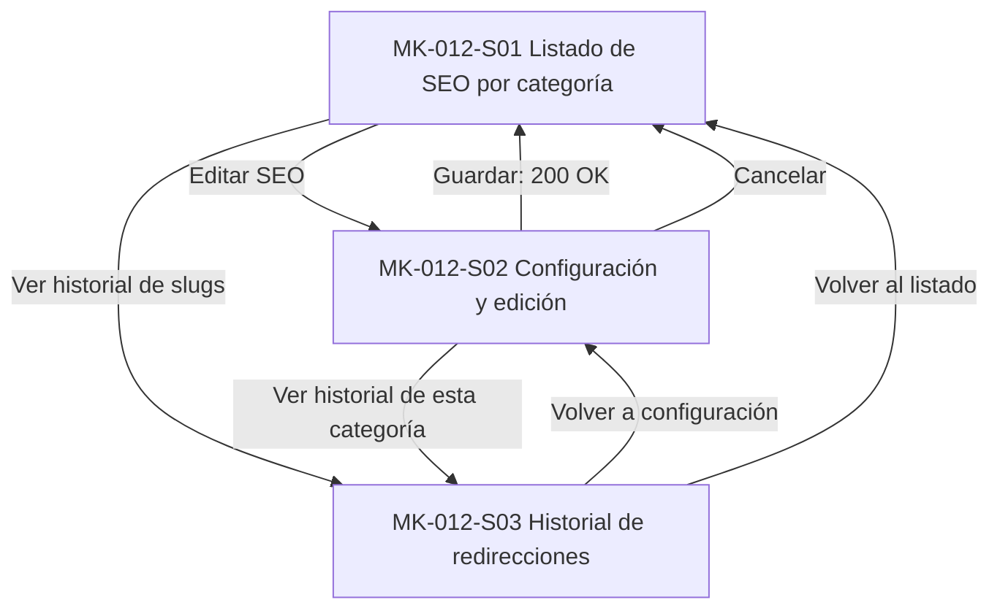

# MK-012 — Component Spec: gestión de SEO y metadatos

## 1. Identificación y estado

| Campo | Valor |
|---|---|
| Issue / coordinación | Ejecución general #61; entradas transversales #59 y #60 |
| Responsable / rama | Leonardo Lopez (`lopez`) / `lopez` |
| Versión / fecha | 1.0.0 / 2026-10-03 |
| Estado documental | En revisión; no acredita aprobación funcional, implementación ni visto bueno para Figma |
| Funcionalidad / actor | Optimización para motores de búsqueda y metadatos de taxonomía / Gestor Comercial |
| Plataforma | Web desktop; revisión canónica a 1440 × 900 px, con scroll vertical |

Este documento define la especificación formal del resultado esperado de MK-012. [Plan](plan.md) define la estrategia constructiva y [Tasks](tasks.md) las acciones ejecutables. Subordinado a las fuentes normativas, no redefine reglas de negocio ni introduce una propuesta UX paralela.

---

## 2. Fuentes y trazabilidad

| Fuente | Alcance consumido |
|---|---|
| [SPEC-012](../../specs/SPEC-012-seo-metadatos.md) | Normalización de slug, prevención de colisiones, contadores recomendados (70/160 caracteres), historial append-only de redirecciones (301 para Marketplace) |
| [HU-012](../../hu/HU-012-seo-metadatos.md) | Criterios CA-01 a CA-10: edición de metadatos, advertencias no bloqueantes de longitud, regeneración con sufijo e historial de cambios |
| [WF-012](../../wireframes/flows/WF-012-seo-metadatos.md) | Pantallas S-01 a S-03, vista previa SERP, contadores visuales y eliminación explícita del simulador 301 |
| [FLOW-012](../../flujos/FLOW-012-seo-metadatos.md) | §4.1 consulta de metadatos; §4.2 edición y vista previa; §4.3 historial de redirecciones |
| [OpenAPI 0.5.0](../../api/openapi.yaml) | `SeoAdmin`, `SeoUpdateRequest`, `SlugHistoryEntry`, `/categorias/{id}/seo`, `/categorias/{id}/seo/historial` |
| [Contrato API](../../Contrato_Api.md), [Alineación Marketplace](../../integraciones/ALINEACION_MARKETPLACE.md) | Contrato público de resolución de slugs para redirección 301 en Marketplace; ausencia de simuladores administrativos |
| [Propuesta UX](../ux/propuesta-ux.md) | UX 2.0; matriz de aplicabilidad: UX-P01 Media (visibilidad de optimización), UX-P02 Media (contadores y preview SERP), UX-P03 Alta (conservación de datos ante conflicto manual y preservación de historial) |
| [UX Decisions](../ux/ux-decisions.md) | UXD-001 (contexto), UXD-002 (complejidad pertinente), UXD-003 (tablas legibles), UXD-005 (feedback situado), UXD-007 (confirmación de cambios de URL), UXD-012 (comprensión y accesibilidad) |
| [UX Guidelines](../ux/ux-guidelines.md) | UXG-003, UXG-005, UXG-006, UXG-011, UXG-018, UXG-020 a UXG-022 |
| [Design System](../DESIGN.md) | Versión 1.0.0: layout desktop, foundations, DS-C01, DS-C02, DS-C03, DS-C05, DS-C13, DS-C14, DS-C17, DS-C19, DS-C21, DS-C22, DS-C24, DS-C25, DS-C28 |
| [Gobernanza](../../EQUIPO_Y_RESPONSABILIDADES.md) | Ownership funcional de `taxonomy-svc`, revisión transversal UX por Leonardo Vera Rodríguez |

---

## 3. Objetivo funcional, alcance y límites

### 3.1. Objetivo
Permitir al Gestor Comercial optimizar el posicionamiento orgánico de las categorías mediante la configuración de slugs canónicos, títulos y meta-descripciones con contadores visuales de longitud recomendada, vista previa realista tipo Google SERP y auditoría de cambios de slug para soportar redirecciones 301 automáticas en Marketplace.

### 3.2. Alcance incluido
- Listado del estado de optimización SEO de todas las categorías activas.
- Formulario de edición de metadatos SEO:
  - Edición manual de slug con validación de sintaxis y detección de colisiones.
  - Botón de regeneración automática de slug a partir del nombre de la categoría (con sufijo incremental si colisiona).
  - Input de Meta-título con contador de caracteres y advertencia visual al superar los **70 caracteres**.
  - Textarea de Meta-descripción con contador de caracteres y advertencia visual al superar los **160 caracteres**.
  - Componente de vista previa SERP (Snippet de resultados de búsqueda de Google) que se actualiza en tiempo real.
- Historial cronológico de cambios de slug (`slug anterior → nuevo slug`, fecha y responsable) para auditoría de redirecciones 301.

### 3.3. Fuera de alcance
- Las longitudes de 70 y 160 caracteres son **recomendaciones de buenas prácticas SEO**, NO restricciones bloqueantes de guardado (el gestor puede guardar textos más largos si lo decide).
- No existe pantalla administrativa para "probar o simular la redirección 301" en el backoffice (la resolución 301 es consumida directamente por la capa pública de Marketplace).
- No se gestionan palabras clave ni optimizaciones para productos individuales desde este módulo (alcance exclusivo de categorías en este hito).

---

## 4. Inventario completo de pantallas P0

| ID | Correspondencia WF / Propósito | Entrada y acción principal / salida | Ruta directa |
|---|---|---|---|
| MK-012-S01 | WF S-01; Listado de SEO por categoría | Vista de categorías con su slug actual, título SEO, badge de completitud y acciones; buscador | `/MK012/S01` |
| MK-012-S02 | WF S-02; Configurar y editar SEO de categoría | Formulario con slug, meta-título, meta-descripción, contadores 70/160 y preview SERP; «Guardar SEO» | `/MK012/S02` |
| MK-012-S03 | WF S-03; Historial de redirecciones de slugs | Tabla cronológica de cambios de slug con fecha y explicación de impacto 301; «Volver a configuración» | `/MK012/S03` |

---

## 5. Navegación y jerarquía de pantallas

---

## 6. Contratos de datos y operaciones admitidas

Base HTTP: `/api/v1`.

| Operación / Endpoint | Uso en MK-012 | DTO / Contrato | Regla de representación en interfaz |
|---|---|---|---|
| `GET /categorias` | S01 | Res: Array de `CategoriaAdmin` | Carga las categorías para la tabla general de estado SEO |
| `GET /categorias/{id}/seo` | S02 | Res: 200 `SeoAdmin { categoriaId, slug, metaTitulo, metaDescripcion, updatedAt }` | Carga los metadatos SEO vigentes de la categoría |
| `PUT /categorias/{id}/seo` | S02 | Req: `SeoUpdateRequest { slug, metaTitulo, metaDescripcion }` Res: 200 `SeoAdmin` | Guarda metadatos; si el slug cambió, genera un nuevo registro en el historial para 301 |
| `POST /seo/categorias/slug/resolver` | S02 | Req: `SlugCategoriaResolveRequest { nombre }` Res: `SlugCategoriaResolveResponse { slug, colisionResuelta }` | Disparado por el botón "Regenerar slug desde nombre"; muestra alerta si hubo sufijo numérico |
| `GET /categorias/{id}/seo/historial` | S03 | Res: 200 Array de `SlugHistoryEntry { oldSlug, newSlug, changedAt }` | Listado histórico append-only de modificaciones de slug |

### Reglas críticas de interacción:
1. **Advertencias 70/160 no bloqueantes:** Los contadores se muestran junto al campo (ej. `68 / 70` en verde; `85 / 70` en ámbar). Si se exceden los 70 o 160 caracteres, el campo muestra un texto de ayuda: *"Longitud superior a la recomendada para motores de búsqueda. Los textos largos pueden truncarse en los resultados"*, pero el botón de guardar **permanece habilitado**.
2. **Advertencia de cambio de slug:** Si el gestor modifica el slug de una categoría existente en S02, la interfaz muestra un modal de confirmación informando: *"Modificar el slug cambiará la URL pública. Se registrará una redirección 301 permanente en el historial para no perder tráfico"*.
3. **Copy normativo en historial (S03):** Se muestra permanentemente la leyenda: *"Marketplace utiliza esta resolución para responder la redirección permanente en la URL pública (301)"*.

---

## 7. Componentes del Design System utilizados

| Componente DS | Identificador | Pantallas | Uso específico |
|---|---|---|---|
| Botón principal y secundario | DS-C01 | S01, S02, S03 | Acciones de guardar SEO, regenerar slug, ver historial, volver |
| Iconos de acción | DS-C02 | S01 | Editar SEO, ver historial |
| Input de texto | DS-C03 | S01, S02 | Slug canónico, meta-título, buscador de categorías |
| Área de texto | DS-C05 | S02 | Meta-descripción con contador de caracteres |
| Barra de filtros | DS-C13 | S01 | Búsqueda por texto y filtro por estado de optimización |
| Badge de estado | DS-C14 | S01, S02 | Badges: `OPTIMIZADO` (verde), `INCOMPLETO` (ámbar), `SIN_CONFIGURAR` (gris) |
| Tabla de datos | DS-C17 | S01, S03 | Listado de categorías y tabla de historial de redirecciones |
| Card de contenido | DS-C19 | S02 | Contenedor del formulario SEO y contenedor de la vista previa SERP |
| Modal de confirmación | DS-C21 | S02 | Confirmación de cambio de URL pública y generación de redirección |
| Alertas contextuales | DS-C22 | S02, S03 | Avisos de longitudes excedidas y nota sobre redirecciones 301 |
| Skeleton / Loader | DS-C24 | S01, S02, S03 | Carga inicial de datos |
| Estado vacío | DS-C25 | S03 | Categoría sin cambios previos de slug |
| Migas de pan | DS-C28 | S01–S03 | Ruta: `Inicio > Taxonomía > SEO y Metadatos` |

---

## 8. Componentes locales (`MK-012-CXX`)

| ID | Nombre | Pantallas | Props principales | Comportamiento y accesibilidad |
|---|---|---|---|---|
| MK-012-C01 | ContadorCaracteres | S02 | `longitudActual: number`, `limiteRecomendado: number`, `label: string` | Muestra contador dinámico accesible (`aria-live="polite"`), cambiando de color al rebasar el límite |
| MK-012-C02 | VistaPreviaSerpGoogle | S02 | `titulo?: string`, `slug?: string`, `descripcion?: string` | Simula tarjeta de resultado de búsqueda de Google Desktop (fuente azul, URL verde/gris, texto resumen) |
| MK-012-C03 | TablaHistorialRedirecciones | S03 | `historial: SlugHistoryEntry[]` | Tabla accesible con representación de flecha `oldSlug → newSlug` y fecha formateada |

---

## 9. Decisiones UX locales (`LUX-12`)

* **LUX-12-01: Vista previa SERP reactiva e interactiva:**  
  La vista previa SERP en S02 reacciona en tiempo real a cada pulsación de tecla en título, slug o descripción. Si el título excede 70 caracteres, la vista previa muestra puntos suspensivos (`...`) simulando el corte exacto de Google.
* **LUX-12-02: Regeneración de slug con confirmación explícita:**  
  El botón *"Regenerar slug desde nombre"* no sobreescribe inmediatamente el campo de slug; solicita la propuesta a `/seo/categorias/slug/resolver`, muestra un badge temporal con el valor sugerido y pide un clic de confirmación antes de reemplazar el texto actual.

---

## 10. Fixtures deterministas para prototipo

| Fixture ID | Escenario representado | Datos mock |
|---|---|---|
| `FX-012-01` | Listado general de SEO | `Calzado` (slug: `calzado`, optimizado), `Running` (slug: `running`, optimizado), `Accesorios` (sin meta-descripción, incompleto) |
| `FX-012-02` | Metadatos completos y válidos | Slug: `running`, Título: `Zapatillas de Running para Hombre y Mujer` (44 car.), Descripción: `Descubre nuestra colección de zapatillas de running...` (112 car.) |
| `FX-012-03` | Advertencias de longitud excedida | Título de 88 caracteres y Descripción de 195 caracteres con alertas visuales amarillas |
| `FX-012-04` | Regeneración con sufijo | Categoría `Fútbol`: regenerar slug propone `futbol-2` con alerta de colisión resuelta |
| `FX-012-05` | Historial con 3 redirecciones | `calzado-deportivo` → `calzado-running` → `running` con fechas y horas |
| `FX-012-06` | Historial vacío | Categoría nueva sin cambios previos de slug; muestra estado vacío informativo |

---

## 11. Criterios de aceptación (Coverage HU-012)

- [ ] **CA-01 (Listado de SEO):** S01 muestra el estado de optimización y slug de cada categoría.
- [ ] **CA-02 (Contadores y advertencias):** S02 muestra contadores en tiempo real para 70 y 160 caracteres.
- [ ] **CA-03 (No bloqueo por longitud):** S02 permite guardar textos que superen los límites recomendados.
- [ ] **CA-04 (Vista previa SERP):** S02 renderiza la tarjeta de Google actualizada dinámicamente.
- [ ] **CA-05 (Regeneración de slug):** S02 permite recalcular el slug a partir del nombre consultando al resolver.
- [ ] **CA-06 (Historial de redirecciones):** S03 muestra la trazabilidad append-only de modificaciones de slug.
- [ ] **CA-07 (Copy de redirección 301):** S03 explicita el uso del historial por parte de Marketplace para el 301.
- [ ] **CA-08 (Ausencia de simulador):** La interfaz respeta la exclusión de herramientas de simulación 301 en backoffice.
